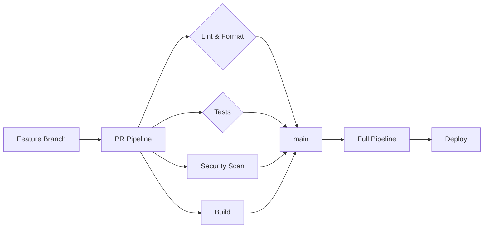

# Project One

> Full-Stack ERP System — Inventory, Sales, HR, and Business Process Management

[](https://github.com/Freelancer-soluctions/Project-one/actions)
[]()
[]()
[](http://makeapullrequest.com)

---

## Table of Contents

- [About](#about)
- [Architecture](#architecture)
- [Tech Stack](#tech-stack)
- [Prerequisites](#prerequisites)
- [Quick Start](#quick-start)
- [Project Structure](#project-structure)
- [Features](#features)
- [Security](#security)
- [CI/CD](#cicd)
- [Development Workflow](#development-workflow)
- [Documentation](#documentation)
- [Contributing](#contributing)
- [License](#license)

---

## About

**Project One** is an enterprise-grade ERP system built as a monorepo with a React frontend and Express backend. It manages inventory, sales, HR, client relationships, and business reporting with a robust RBAC/ABAC authorization layer across 20+ modules.

### Core capabilities

- **Inventory & Stock** — Multi-warehouse, lot tracking, transfers, valuation (FIFO/LIFO)
- **Sales & Purchases** — Orders, invoicing, supplier management
- **Human Resources** — Employees, payroll, attendance, performance evaluations, vacation workflows
- **Clients & Providers** — CRM, purchasing, order management
- **Reporting** — Real-time dashboards, exportable analytics

---

## Architecture

```
┌──────────────────────────────────────────────────────┐
│                   Monorepo (npm workspaces)           │
│                                                        │
│  ┌──────────────────┐    ┌──────────────────┐         │
│  │   apps/client     │    │   apps/server     │         │
│  │   React 18        │    │   Express 4       │         │
│  │   Vite 6          │    │   Prisma ORM      │         │
│  │   Tailwind 4      │◄──►│   PostgreSQL 16   │         │
│  │   shadcn/ui       │    │   Swagger/OpenAPI │         │
│  │   Redux Toolkit   │    │   JSDoc           │         │
│  └──────────────────┘    └──────────────────┘         │
│            │                       │                    │
│            └───────┬───────────────┘                    │
│                    │                                     │
│            ┌───────┴────────┐                            │
│            │   apps/e2e     │                            │
│            │   Playwright   │                            │
│            └────────────────┘                            │
└──────────────────────────────────────────────────────┘
```

### Design principles

- **Monorepo** — Shared tooling, unified CI/CD, atomic cross-stack changes
- **Layered backend** — Controller → Service → DAO with HOF error handling
- **API versioning** — All endpoints under `/api/v1/`
- **Deterministic workflow** — OpenSpec SDD with multi-agent orchestration

---

## Tech Stack

| Layer | Technology | Purpose |
|-------|-----------|---------|
| **Frontend** | React 18, Vite 6, Tailwind 4, shadcn/ui | UI framework, bundler, component library |
| **State** | Redux Toolkit, RTK Query, Redux Persist | Global state, API caching, persistence |
| **Forms** | React Hook Form + Zod | Form validation |
| **i18n** | i18next + react-i18next | Internationalization (EN/ES) |
| **Backend** | Express 4, Node 18 | REST API |
| **Database** | PostgreSQL 16, Prisma ORM | Data persistence |
| **Auth** | JWT, bcrypt, AES-GCM | Authentication, encryption |
| **API Docs** | Swagger/OpenAPI + JSDoc | API documentation |
| **Testing** | Vitest, Testing Library, Playwright, MSW | Unit, integration, E2E |
| **Security** | Semgrep, Trivy, Gitleaks, Helmet | SAST, dependency scan, secrets |

---

## Prerequisites

- **Node.js** ≥ 18.x
- **npm** ≥ 9.x
- **PostgreSQL** ≥ 16
- **Git**

---

## Quick Start

```bash
# 1. Clone
git clone https://github.com/Freelancer-soluctions/Project-one.git
cd Project-one

# 2. Install dependencies (all workspaces)
npm install

# 3. Configure environment
cp apps/server/.env.example apps/server/.env
cp apps/client/.env.example apps/client/.env
# Edit .env files with your database credentials

# 4. Database setup
cd apps/server
npx prisma generate
npx prisma migrate dev
npx prisma db seed
cd ../..

# 5. Start development servers
npm run dev
```

### Verify

| Service | URL |
|---------|-----|
| Client | `http://localhost:5173` |
| Server | `http://localhost:3000/api/v1/health` |
| API Docs | `http://localhost:3000/api-docs` |
| Storybook | `cd apps/client && npm run storybook` |

---

## Project Structure

```
project-one/
├── apps/
│   ├── client/                  # React frontend (Vite)
│   │   ├── src/
│   │   │   ├── modules/         # 25 feature modules
│   │   │   ├── components/      # Reusable UI (shadcn/ui)
│   │   │   ├── hooks/           # Custom React hooks
│   │   │   ├── redux/           # Redux store + slices
│   │   │   ├── services/        # API service layer
│   │   │   ├── locale/          # i18n translations
│   │   │   └── stories/         # Storybook stories
│   │   └── tests/
│   │
│   ├── server/                  # Express backend
│   │   ├── src/
│   │   │   ├── modules/         # 24 feature modules
│   │   │   ├── middleware/      # Auth, validation, security
│   │   │   ├── common/          # Shared utilities (HOF, errors)
│   │   │   ├── config/          # App configuration
│   │   │   ├── logger/          # Winston structured logging
│   │   │   └── docs/            # Swagger specs
│   │   ├── prisma/              # Schema, migrations, seeds
│   │   └── tests/
│   │
│   └── e2e/                     # Playwright E2E tests
│
├── docs/                        # Technical documentation
│   ├── modules/                 # Per-module guides
│   └── security/               # Security policies
├── scripts/                     # Security automation scripts
├── .github/workflows/           # CI/CD pipelines
├── openspec/                    # OpenSpec SDD artifacts
└── .agents/                     # AI agent orchestration
```

---

## Features

### Inventory Management
- Multi-warehouse stock control with lot and expiry tracking
- Stock valuation (FIFO, LIFO, Weighted Average)
- Auto stock updates on sales/purchases
- Low-stock alerts and reorder automation

### Sales & Purchases
- Customer and supplier order management
- Invoice and expense tracking
- Automatic inventory synchronization

### Human Resources
- Employee management with role-based access
- Payroll processing and attendance tracking
- Performance evaluations
- Vacation request and approval workflows

### Access Control
- **RBAC + ABAC** hybrid authorization
- 45+ granular permissions across 20 modules
- Role-based dashboards and module visibility
- Audit logging for sensitive operations

### Internationalization
- English and Spanish support
- Locale-based date/number formatting

---

## Security

Defense-in-depth strategy across the development lifecycle.

| Layer | Tool / Method |
|-------|--------------|
| HTTP headers | Helmet |
| Encryption | JWT + AES-GCM (field-level) |
| Rate limiting | express-rate-limit (critical endpoints) |
| Input validation | Joi (server) + Zod (client) |
| Authorization | RBAC + ABAC with 45+ permissions |
| Password hashing | bcrypt |
| **SAST** | Semgrep (Docker) |
| **Dependency scan** | Trivy (Docker) |
| **Secret detection** | Gitleaks (pre-commit hook) |

All security tools run as **pre-commit hooks** (Husky) and in CI/CD. See [Security Documentation](docs/security/SECURITY.md).

---

## CI/CD

Branch-based pipeline strategy with GitHub Actions.



| Workflow | Trigger | Scope |
|----------|---------|-------|
| `ci.yml` | PR to `main` | Lint, format, test, build |
| `ci-enterprise.yml` | Push to `main` | Full CI + security |
| `quality.yml` | Reusable (called) | Code quality |
| `security.yml` | PR to `main` | Semgrep, Trivy, Gitleaks |
| `pr-validation.yml` | PR to `main` | PR metadata validation |

---

## Development Workflow

### Commits

**Conventional Commits** enforced by commitlint + Husky.

```
<type>(<scope>): <description>

feat(products): add barcode generation
fix(auth): handle expired token refresh
```

Types: `feat`, `fix`, `docs`, `refactor`, `test`, `chore`, `security`

### Branch strategy

- **Trunk-based** with feature flags
- Short-lived feature branches → PR → `main`
- Pre-commit hooks enforce security + quality gates

### Local cycle

```bash
git add .
# Husky runs: Gitleaks + Semgrep + lint-staged
git commit -m "feat(scope): description"
git push origin feature/my-feature
```

---

## Documentation

| Resource | Location |
|----------|----------|
| Module guides | [docs/modules/](docs/modules/INDEX.md) |
| API docs (dev) | `/api-docs` (Swagger) |
| Storybook | `cd apps/client && npm run storybook` |
| Security | [docs/security/](docs/security/SECURITY.md) |
| Testing architecture | [docs/testing-architecture.md](docs/testing-architecture.md) |
| Code style | [docs/code-style.md](docs/code-style.md) |
| OpenSpec SDD | [openspec/](openspec/) |

---

## Contributing

1. Fork the repository
2. Create a feature branch (`git checkout -b feat/amazing-feature`)
3. Make changes
4. Verify: `npm test && npm run lint && npm run format:check`
5. Commit using [Conventional Commits](#commits)
6. Open a Pull Request

### PR requirements

- All CI checks pass
- Tests added or updated
- Documentation updated
- Security scan clean

---

## License

Distributed under the ISC License.
