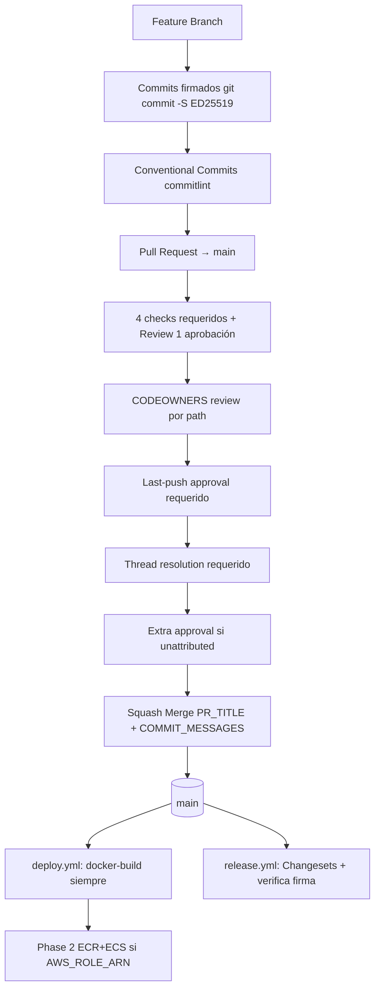

# CONTEXT CI/CD — Documento Central (auto-cargable)

> **Única fuente de verdad operativa del CI/CD de Project One.** Auto-cargado cada sesión (`opencode.jsonc` L49). Verificado 2026-08-28; re-verificación de config GitHub por API 2026-08-30 (ver §3.4/§3.5/§5.9); verificación merge queue + pr-title-lint 2026-08-31 (ver §3.3/§5.3/§9.3.3).
> **Antes de crear un change nuevo de CI/CD: LEER este documento** (sección 7) para no asumir cambios erróneos.

---

## 1. Estado de implementación (seguimiento)

| Estado                            | Significado                                      |
| --------------------------------- | ------------------------------------------------ |
| ✅ **Implementado y activo**      | Funciona hoy en GitHub, bloquea o reporta        |
| ⏸️ **Implementado pero inactivo** | Existe en workflow pero deshabilitado por diseño |
| 🔴 **Deuda conocida**             | Roto/duplicado/pendiente verificado              |
| 📋 **Pendiente/Futuro**           | No implementado, requiere change                 |

> **⚠️ DOS NIVELES DE DESACTIVACIÓN (distinción crítica, verificada por API 2026-08-30):**
> GitHub tiene **dos mecanismos independientes** para que un workflow no corra, y este doc los distingue porque tienen causas, remediación y semántica MUY diferentes:
>
> 1. **Gate a nivel de código YAML** (`if: false` / `if: CI_MINIMAL != 'true'` / `if: vars.AWS_ROLE_ARN != ''`): condición **dentro** del archivo `.yml` que hace saltar **jobs individuales** (o el workflow completo) en tiempo de ejecución. El workflow sigue **habilitado** en GitHub, pero sus jobs evalúan `false` y se marcan `SKIPPED`. Es diseño incremental intencional (ver §3.1).
> 2. **Toggle a nivel de GitHub (`disabled_manually`)**: interruptor **fuera** del código, en la UI/API de GitHub (Settings → Actions → General, o por workflow). Deshabilita el workflow **entero**: NO corre NINGÚN trigger (push/PR/cron/workflow_dispatch), independientemente de lo que diga el YAML. El archivo sigue en el repo pero GitHub lo ignora.
>
> **Resultado de la auditoría real (API, 2026-08-30):** de los 8 workflows del repo, **SOLO `ci.yml` está habilitado**. Los otros **7 están `disabled_manually`** en GitHub (no corren en absoluto): `security.yml`, `security-digest.yml`, `scheduled-security.yml`, `deploy.yml`, `preview.yml`, `release.yml`, `ci-enterprise.yml`. Esto se suma a los gates YAML internos. Ver estados exactos en §3.4/§3.5 y el inventario completo en §5.9.

| Área                                             | Estado          | Detalle                                                                                                                                 |
| ------------------------------------------------ | --------------- | --------------------------------------------------------------------------------------------------------------------------------------- |
| Ruleset 21227644 "Require signed commits"        | ✅ Activo       | Enforcer real de gobernanza (~DEFAULT_BRANCH)                                                                                           |
| `verify-signatures` (firmas)                     | ✅ Activo       | Required status check en ruleset                                                                                                        |
| `commit-lint` (Conventional Commits)             | ✅ Activo       | Required status check en ruleset                                                                                                        |
| `pr-title-lint`                                  | ✅ Activo       | Required + **BLOCKING** (continue-on-error removido 2026-08-31); `subjectPattern: ^(?![A-Z]).+$`, types añade `ops`                     |
| `dco`                                            | ✅ Activo       | Required + **BLOCKING** (continue-on-error removido 2026-08-31)                                                                         |
| `dependency-review`                              | ✅ Activo       | En `ci.yml` (inline, job `Dependency Review`); NO requerido por ruleset; corre en PRs (`if: pull_request`), bloquea vulns `>= moderate` |
| `zombie-workflow-guard`                          | ✅ Activo       | Guard de regression                                                                                                                     |
| Jobs quality/build/test/unit/e2e/sonarqube/etc.  | ⏸️ Inactivo     | `if: false` — **diseño incremental intencional**                                                                                        |
| `ci-complete` ("CI Complete")                    | ⏸️ Inactivo     | `if: CI_MINIMAL != 'true'` → skipped; NO es status check del ruleset                                                                    |
| Deploy Phase 2 (ecr-push, staging, production)   | ⏸️ Inactivo     | Gated por `vars.AWS_ROLE_ARN != ''` → 3 jobs "Skipped - No AWS Config" exit 0                                                           |
| Overlap classic branch protection + ruleset      | 🔴 Deuda        | Consolidar a ruleset-only a futuro                                                                                                      |
| `ci-enterprise.yml` paths `frontend/`/`backend/` | 🔴 Deuda        | No existen en este monorepo (template no usado)                                                                                         |
| `quality.yml`                                    | 🔴 Deuda (docs) | **YA NO EXISTE** — migrado a jobs `if:false` inline en ci.yml                                                                           |
| GHAS / secret scanning / dependabot security     | 📋 Pendiente    | DISABLED; si repo → privado, `dependency-review@v5` requiere GHAS                                                                       |
| AWS (environments, ECR, ECS)                     | 📋 Pendiente    | 0 environments, 0 secrets AWS; provisión futura                                                                                         |
| "CI Complete" añadido al ruleset                 | 📋 Pendiente    | Solo tras reportarse ≥1 vez (CI_MINIMAL=false)                                                                                          |
| Dependabot firma commits?                        | 🔴 Dudosa       | Verificar; si no firma, `verify-signatures` los falla                                                                                   |

## 2. Cómo verificar el estado (no asumir)

Comandos read-only para re-validar hechos antes de crear/implementar un change:

```bash
gh api repos/Freelancer-soluctions/Project-one/rulesets                                    # rulesets activos
gh api repos/Freelancer-soluctions/Project-one/branches/main/protection                   # classic protection
gh api repos/Freelancer-soluctions/Project-one/actions/workflows                          # inventario real de workflows (+ .state: active|disabled_manually, §5.9)
gh workflow enable <file> / gh workflow disable <file>                                      # toggle del workflow (admin; NO read-only)
gh api repos/Freelancer-soluctions/Project-one/actions/variables                          # repo variables (CI_MINIMAL)
gh api repos/Freelancer-soluctions/Project-one/actions/secrets                            # secret names (nunca valores)
gh api repos/Freelancer-soluctions/Project-one --jq '.visibility'                         # público/privado
gh api repos/Freelancer-soluctions/Project-one/actions/permissions                        # actions permissions
gh api repos/Freelancer-soluctions/Project-one/branches/main/protection/required_status_checks
```

> ⚠️ Sin `admin:org` scope: secrets/vars a nivel **org** dan 403 (no verificables). Solo repo-level son auditables.

## 3. Contexto actual del sistema

### 3.1 CI Incremental — por diseño

- `vars.CI_MINIMAL=true` ES INTENCIONAL → CI en modo mínimo/incremental.
- Muchos jobs `if: false` (disabled a propósito): client-lint, server-lint, \*-build, sonarqube, coverage, depcheck, test-unit-\*, test-integration, test-smoke, e2e, actionlint. NO son bugs; **no activarlos** "para que funque".
- `ci-complete` corre SOLO si `CI_MINIMAL != 'true'`. Como CI_MINIMAL=true, queda SKIPPED → "CI Complete" NO se reporta.
- NUNCA interpretar un job skipped/disabled por CI_MINIMAL como algo roto. Es diseño incremental.
- Status checks selectables: GitHub solo deja elegir un check si se reportó ≥1 vez. Un job que nunca corrió NO aparece en búsqueda del ruleset.

### 3.2 Los 4 status checks del ruleset (nombres EXACTOS)

1. `Verify Commit Signatures`
2. `Commit Lint (Conventional Commits)`
3. `PR Title Lint`
4. `DCO`

- `CI Complete` NO está vinculado al ruleset 21227644 (job salta mientras CI_MINIMAL=true).
- Integration ID para los 4 checks: `15368` (origen: config del ruleset vía API; no derivable de los workflows).
- Los nombres DEBEN coincidir EXACTO con el `name:` del job (renombrar rompe el binding del ruleset).

### 3.3 CI gate (ci.yml) — jobs habilitados hoy

**Triggers:** `pull_request` main + `merge_group`

> **⚠️ Merge queue NO está activo (verificado API 2026-08-31):** el trigger `merge_group` es **código muerto** — el ruleset 21227644 **no tiene regla `merge_queue`** y `allow_auto_merge=false`, así que GitHub **nunca dispara** `merge_group`. Los steps `if: merge_group` de commit-lint/pr-title-lint/dco son **preparación preventiva**. Conclusión: **NO añadir validación extra para merge_group** mientras no exista merge queue (ver §5.3).

| Job                                                                                                          | name (exacto)                          | Required?      | continue-on-error?               |
| ------------------------------------------------------------------------------------------------------------ | -------------------------------------- | -------------- | -------------------------------- |
| repo-discovery                                                                                               | Detect Changes                         | N/A (no check) | -                                |
| verify-signatures                                                                                            | **Verify Commit Signatures**           | ✅ ruleset     | ❌                               |
| commit-lint                                                                                                  | **Commit Lint (Conventional Commits)** | ✅ ruleset     | ❌                               |
| pr-title-lint                                                                                                | **PR Title Lint**                      | ✅ ruleset     | ❌ (bloqueante desde 2026-08-31) |
| dco                                                                                                          | **DCO**                                | ✅ ruleset     | ❌ (bloqueante desde 2026-08-31) |
| dependency-review                                                                                            | Dependency Review                      | ❌             | ❌                               |
| zombie-workflow-guard                                                                                        | Zombie Workflow Guard                  | ❌             | ❌                               |
| client-lint, server-lint, \*-build, sonarqube, coverage, depcheck, unit, integration, smoke, e2e, actionlint | Quality/Build/Test                     | ❌             | N/A (`if: false`)                |
| ci-complete                                                                                                  | CI Complete                            | ❌ (no bound)  | N/A (`if: CI_MINIMAL != 'true'`) |

### 3.4 Pipelines

> **Estado real del toggle GitHub (verificado por API 2026-08-30):** de los 8 workflows, **solo `ci.yml` está habilitado**. Los 7 restantes están **`disabled_manually`** en GitHub — un interruptor a nivel de GitHub (Settings/Actions o API) que deshabilita el workflow **completo**: NO corren en ningún trigger (push/PR/cron/workflow_dispatch), aunque los archivos existan y su YAML tenga `on:` válido. Esto es **independiente** de los gates `if:` internos (§3.1). En la siguiente lista, cada pipeline indica su `on:` de fuente de verdad y su **estado toggle real**:

| Workflow                   | Triggers (`on:`)                         | Estado toggle GitHub   | Detalle                                                                                                                                                                                                                                                                                                                                                                                                                               |
| -------------------------- | ---------------------------------------- | ---------------------- | ------------------------------------------------------------------------------------------------------------------------------------------------------------------------------------------------------------------------------------------------------------------------------------------------------------------------------------------------------------------------------------------------------------------------------------- |
| **ci.yml**                 | `pull_request` main + `merge_group`      | ✅ **HABILITADO**      | Único gate de gobernanza vivo. 4 checks required + dependency-review + zombie-guard. Ver §3.3/§9.3                                                                                                                                                                                                                                                                                                                                    |
| **security.yml**           | `workflow_call` + PR main + push main    | ⛔ `disabled_manually` | Dependency Scan SCA (Trivy), SAST (CodeQL), Secret Detection (Gitleaks OSS + licensed opcional), SBOM (Anchore). Jobs NO wireados a ci-complete; `dependency-review` vive en `ci.yml` (inline, job `Dependency Review`, L~732; también en `ci-complete.needs` L~769)                                                                                                                                                                  |
| **scheduled-security.yml** | cron Mon 03:00 UTC                       | ⛔ `disabled_manually` | Gitleaks full-history SARIF + upload a Security tab. Contiene job `notify-failure` (crea un GitHub Issue si algún scan falla)                                                                                                                                                                                                                                                                                                         |
| **security-digest.yml**    | cron Mon 03:00 UTC                       | ⛔ `disabled_manually` | SBOM (Anchore) + OSV Scanner + digest; cross-downloads Gitleaks artifact. Contiene job `notify-failure` (crea un GitHub Issue si falla)                                                                                                                                                                                                                                                                                               |
| **preview.yml**            | PR main + `workflow_dispatch`            | ⛔ `disabled_manually` | Floci + Postgres emulación backend validation + PR comment (Vercel URL + backend status). NO required status check                                                                                                                                                                                                                                                                                                                    |
| **deploy.yml**             | push main                                | ⛔ `disabled_manually` | Phase 1 `docker-build` siempre (Floci + Postgres, prisma migrate, health 200/503, smoke). Phase 2 `ecr-push` + `deploy-staging` + `deploy-production` gated por `vars.AWS_ROLE_ARN != ''` (si no, 3 jobs "skipped" explícitos `ecr-push-skipped`, `deploy-staging-skipped`, `deploy-production-skipped` que reportan notice visible, exit 0 — no "silent failure"). Targets ECR + ECS Fargate. **0 environments definidos en GitHub** |
| **release.yml**            | push main                                | ⛔ `disabled_manually` | `changesets/action` + GitHub App token (`secrets.APP_ID`, `APP_PRIVATE_KEY`) + re-verifica firma del tip de main                                                                                                                                                                                                                                                                                                                      |
| **ci-enterprise.yml**      | `workflow_dispatch`/`workflow_call` only | ⛔ `disabled_manually` | template; paths `frontend/`/`backend/` inexistentes (deuda conocida; no usado)                                                                                                                                                                                                                                                                                                                                                        |

> **Implicación operativa:** mientras estos 7 estén `disabled_manually`, un push a `main` **solo** dispara `ci.yml` (gobernanza). No corren deploy/release/security/preview ni en push ni en PR ni en cron. Para activar cualquiera: GitHub UI → Actions → workflow → Enable, o `gh workflow enable <file>`. Esta es la causa **adicional** a los gates `if:` internos por la que hoy "no pasa nada" más allá del gate de gobernanza.

### 3.5 GitHub config actual

> **Verificado por API 2026-08-30** (read-only `gh api`, 0 modificaciones). Toda la config estructural de esta sección coincide 1:1 con lo auditado; el único delta operativo relevante es el estado `disabled_manually` de 7 workflows (§3.4) y la inexistencia de `ISSUE_TEMPLATE/`.

**Repo:** PUBLIC · **Default branch:** `main` · **Webhooks:** 0 · **Environments:** 0

| **Workflow toggle state (API `actions/workflows`):**                                                                                                      | total 8 |
| --------------------------------------------------------------------------------------------------------------------------------------------------------- | ------- |
| `ci.yml` — ✅ active                                                                                                                                      |
| `security.yml`, `security-digest.yml`, `scheduled-security.yml`, `deploy.yml`, `release.yml`, `preview.yml`, `ci-enterprise.yml` — ⛔ `disabled_manually` |
| (config dinámico `dynamic/dependabot/dependabot-updates` — ✅ active)                                                                                     |

**Ruleset 21227644 "Require signed commits"** (active, enforcement, ~DEFAULT_BRANCH):

- **6 reglas** (ID 21227644, `bypass_actors: []`, `current_user_can_bypass: never`):
  - `deletion` + `non_fast_forward` + `required_signatures`
  - `required_status_checks`: strict=true, 4 checks (los 4 de §3.2), todos con `integration_id=15368`
  - `pull_request`: `required_approving_review_count=1`, `dismiss_stale_reviews_on_push`, `require_code_owner_review`, `require_last_push_approval`, `required_review_thread_resolution`, `required_extra_approval_for_unattributed_changes`, `allowed_merge_methods: merge/squash/rebase`
  - `required_linear_history`

**Classic branch protection (overlap heredado en main):** checks vacíos, 0 reviews, `required_signatures=false`, `linear_history=true`, `block_creations=true`, `required_conversation_resolution=true`, `enforce_admins=false`. **Ruleset es el enforcer real**; classic es legacy overlap → deuda.

**Merge settings:**

- `squash_merge_commit_title=PR_TITLE`, `squash_merge_commit_message=COMMIT_MESSAGES` (preserva DCO trailers en PRs 1 commit; gotcha multi-commit: subjects list puede omitir bodies)
- `merge_commit_title=MERGE_MESSAGE`, `merge_commit_message=PR_TITLE`
- `allow_squash=merge/rebase=true`, `allow_auto_merge=false`, `delete_branch_on_merge=false`, `allow_forking=true`

**Actions permissions:** default=read, `can_approve_pull_request_reviews=false`, `allowed_actions=all`, `sha_pinning_required=false` (considerar pinning/allow-list).

**Secrets (5):** `APP_ID`, `APP_PRIVATE_KEY`, `APP_SSH_KEY`, `APP_SSH_PUB`, `GIT_LEAKS`
**Vars (1):** `CI_MINIMAL=true`

**GHAS/secret scanning/dependabot security updates:** DISABLED. dependency-review@v5 funciona hoy (repo público); si repo → privado requiere GHAS.

**CODEOWNERS:** core-team default + frontend/backend/devops/qa/architects por path → ruleset `require_code_owner_review=true`.

**dependabot.yml:** 3 ecosistemas (npm, github-actions, docker), schedule weekly Mon 03:00 UTC, prefixes `fix`/`ci`, groups, limit 10.

## 4. Arquitectura — flujo por trigger

```mermaid
flowchart TD
    PR[("pull_request → main")] --> CI_GATE[ci.yml: Gate Governance]
    PR --> PREVIEW[preview.yml: Backend Validation]
    PR --> SECURITY_PR[security.yml: Security Pipeline]

    PUSH[("push → main")] --> DEPLOY[deploy.yml: CD Pipeline]
    PUSH --> RELEASE[release.yml: Release]

    CRON[("cron Mon 03:00 UTC")] --> SCHED_SEC[scheduled-security.yml]
    CRON --> SEC_DIGEST[security-digest.yml]

    subgraph CI_GATE [ci.yml — Gate Governance]
        RD[repo-discovery: Detect Changes]
        VS[verify-signatures: Verify Commit Signatures ⭐]
        CL[commit-lint: Commit Lint (Conventional Commits) ⭐]
        PTL[pr-title-lint: PR Title Lint ⭐]
        DCO[dco: DCO ⭐]
        DR[dependency-review: Dependency Review]
        ZWG[zombie-workflow-guard: Zombie Workflow Guard]
        Q_DISABLED["⚠️ Quality/Build/Test (if: false)"]
        CC[ci-complete: CI Complete ⏸️]
    end

    subgraph PREVIEW [preview.yml — Preview Validation]
        PV[preview: Preview Validation]
        FL[Floci + Postgres (ephemeral)]
        SMOKE[Smoke Tests vs AWS Emulated]
        COMMENT[PR Comment: Vercel URL + Backend Status]
    end

    subgraph SECURITY_PR [security.yml — Security Pipeline]
        DS[dependency-scan: Trivy SCA]
        SAST[SAST: CodeQL]
        SEC[secrets: Gitleaks OSS + Licensed]
        SBOM[SBOM: Anchore]
    end

    subgraph DEPLOY [deploy.yml — CD Pipeline]
        DB[docker-build: Build & Validate Image ✅]
        FL2[Floci + Postgres (ephemeral)]
        MIG[Prisma Migrate Deploy]
        HC[Health Check 200/503]
        SMK[Smoke Tests]
        ECR[ecr-push: Push to ECR ⏸️]
        STG[deploy-staging: ECS Fargate Staging ⏸️]
        PRD[deploy-production: ECS Fargate Production ⏸️]
        SKIP["⏸️ Skipped - No AWS Config (3 jobs)"]
    end

    subgraph RELEASE [release.yml — Release]
        CHG[changesets/action: Version Packages]
        GHAPP[GitHub App Token: APP_ID + APP_PRIVATE_KEY]
        VERIFY[Verify Commit Signature (main tip)]
    end

    subgraph SCHED_SEC [scheduled-security.yml]
        GL[Gitleaks Full History Scan]
        SARIF[Upload SARIF → Security Tab]
    end

    subgraph SEC_DIGEST [security-digest.yml]
        SBOM2[SBOM: Anchore]
        OSV[OSV Scanner]
        DG[Digest Generator]
        DL[Download Gitleaks from sibling run]
        PR_COMMENT[PR Comment if Critical/High]
    end

    classDef required fill:#e8f5e9,stroke:#2e7d32,stroke-width:2px;
    classDef nonblocking fill:#fff3e0,stroke:#ef6c00,stroke-width:2px;
    classDef skipped fill:#f5f5f5,stroke:#9e9e9e,stroke-width:1px,stroke-dasharray: 5 5;
    classDef always fill:#e3f2fd,stroke:#1565c0,stroke-width:2px;

    class VS,CL,PTL,DCO required;
    class DR,ZWG always;
    class Q_DISABLED,CC skipped;
    class DB,FL2,MIG,HC,SMK always;
    class ECR,STG,PRD,SKIP skipped;
```

**Leyenda:** ⭐ = Required status check (ruleset, todos **BLOCKING** desde 2026-08-31) · ✅ = Siempre se ejecuta (Phase 1 deploy) · ⏸️ = Gated/Skipped (esperan `AWS_ROLE_ARN` o `CI_MINIMAL != 'true'`)

> **⚠️ Lectura del diagrama (importante, verificado por API 2026-08-30):** el diagrama describe la **arquitectura por diseño** (cómo respondería cada pipeline a su trigger una vez habilitado). **Pero hoy, en GitHub, 7 de los 8 workflows están `disabled_manually`** (§3.4/§3.5) — solo `ci.yml` (Gate Governance) está habilitado y responde a PR/push. Los subgrafos `PREVIEW`, `SECURITY_PR`, `DEPLOY`, `RELEASE`, `SCHED_SEC`, `SEC_DIGEST` **no corren en la práctica** hasta que se re-habilite su workflow (UI → Actions → Enable o `gh workflow enable`). Esto es independiente de los gates `if:` internos (jobs Quality/Build/Test `if:false`, Phase 2 `AWS_ROLE_ARN`, `ci-complete` `CI_MINIMAL`).

### 4.1 Flujo de trabajo del equipo (hoy en adelante)



## 5. Configuraciones de GitHub explicadas

### 5.1 Ruleset "Require signed commits" (ID 21227644)

| Regla                                              | Qué hace                             | Relación con workflows/jobs                                        |
| -------------------------------------------------- | ------------------------------------ | ------------------------------------------------------------------ |
| `deletion`                                         | Bloquea eliminación de la rama       | Protección nativa                                                  |
| `non_fast_forward`                                 | Bloquea force-push                   | Protección nativa                                                  |
| `required_signatures`                              | Exige commits firmados y verificados | `verify-signatures` valida `.commit.verification.verified == true` |
| `required_status_checks` (strict, 4)               | Exige 4 status checks exactos        | Jobs ci.yml con names EXACTOS (§3.2). Renombrar rompe binding      |
| `required_approving_review_count=1`                | Mínimo 1 aprobación                  | UI PR                                                              |
| `dismiss_stale_reviews_on_push`                    | Push invalida reviews previas        | Nativo                                                             |
| `require_code_owner_review=true`                   | Review de CODEOWNERS por path        | `CODEOWNERS` → teams                                               |
| `require_last_push_approval=true`                  | Push final debe aprobarse            | Previene merge sin último push visto                               |
| `required_review_thread_resolution=true`           | Hilos deben resolverse               | UI PR                                                              |
| `required_extra_approval_for_unattributed_changes` | Commits sin autor → aprobación extra | Edge case bots                                                     |
| `allowed_merge_methods: merge/squash/rebase`       | Solo 3 métodos                       | Botones merge                                                      |
| `required_linear_history`                          | Historial lineal                     | Impide merge commits no squash/rebase                              |
| `bypass_actors: []`                                | Nadie puede saltarse, ni admins      | Para bypass → editar ruleset                                       |
| `current_user_can_bypass: never`                   | Ni el usuario actual                 | Coherente con bypass_actors                                        |

### 5.2 Classic Branch Protection (overlap)

Legacy que coexiste: `linear_history=true`, `block_creations=true`, `required_conversation_resolution=true`, `required_signatures=false`, `enforce_admins=false`, `required_status_checks: []`. **Recomendación:** consolidar a ruleset-only a futuro.

### 5.3 Merge Settings

`PR_TITLE` + `COMMIT_MESSAGES` en squash (gotcha: PRs multi-commit pueden perder trailers DCO — release.yml re-verifica firma del tip post-merge) · merge commit `MERGE_MESSAGE` + `PR_TITLE` · squash/merge/rebase habilitados · auto-merge off · no borrar rama · forks permitidos.

> **Merge queue (verificado API 2026-08-31) — NO activo:** el repo **no usa merge queue**. No existe regla `merge_queue` en el ruleset 21227644 ni en la branch protection clásica, y `allow_auto_merge=false`. Por tanto el trigger `merge_group` de `ci.yml` es **código muerto** (nunca se dispara). Si en el futuro se quisiera activar merge queue, habría que (1) añadir `type: "merge_queue"` al ruleset (con timeout/entries/method), (2) opcionalmente `allow_auto_merge=true`, y (3) reevaluar la validación de PR title en `merge_group` (§3.3). Hasta entonces, **no añadir checks para merge_group**.

### 5.4 Actions Permissions

default=read · workflows no aprueban reviews · `allowed_actions=all` (🔴 riesgo supply chain; considerar allow-list + SHA pinning) · `sha_pinning_required=false`.

> **Inconsistencia de versiones de actions (deuda observada, no bloqueante):** las versiones de GitHub Actions **no son uniformes** entre workflows — `actions/checkout@v6` (release.yml) vs `@v5` (ci.yml, deploy.yml, preview.yml, security.yml); `actions/setup-node@v4` en ci.yml/ci-enterprise.yml vs `@v5` en el resto; `dorny/paths-filter@v4` (ci.yml) vs `@v3` (ci-enterprise.yml); `download-artifact@v5` (security-digest.yml) vs `@v4`/`@v7` en otros. Esto no rompe nada hoy, pero amplía la superficie de supply chain (§5.4) y dificulta un SHA-pinning uniforme. Ver §6 deuda.

### 5.5 Variable CI_MINIMAL=true

Desactiva `ci-complete` y TODOS los jobs quality/build/test (`if: false`). Es diseño incremental: iterar gobernanza sin pagar build/test completos. Gate completo = change OpenSpec que justifique costo (`CI_MINIMAL=false` → ci-complete reporta → añadible al ruleset tras ≥1 run).

### 5.6 Secrets

| Secret            | Usado en                | Propósito                                                                        |
| ----------------- | ----------------------- | -------------------------------------------------------------------------------- |
| `APP_ID`          | release.yml             | GitHub App ID                                                                    |
| `APP_PRIVATE_KEY` | release.yml             | Private key App (PEM)                                                            |
| `APP_SSH_KEY`     | — (no usado)            | SSH key git push — NO referenciado en ningún workflow (verificado grep ago 2026) |
| `APP_SSH_PUB`     | — (no usado)            | Public key correspondiente — NO referenciado en ningún workflow                  |
| `GIT_LEAKS`       | security.yml (licensed) | Licencia Gitleaks (opcional; sin ella solo OSS)                                  |

> **Secrets AWS de Phase 2 (deploy.yml) — NO PROVISIONADOS:** el workflow `deploy.yml` referencia 16+ secrets que **no existen** en GitHub (0 environments, 0 secrets AWS): `STAGING_TASK_EXECUTION_ROLE_ARN`, `STAGING_TASK_ROLE_ARN`, `STAGING_DATABASE_URL_SECRET_ARN`, `STAGING_JWT_SECRET_SECRET_ARN`, `STAGING_REFRESH_SECRETKEY_SECRET_ARN`, `STAGING_AES_GCM_KEY_SECRET_ARN`, `STAGING_AWS_REGION_SECRET_ARN`, `PROD_TASK_EXECUTION_ROLE_ARN`, `PROD_TASK_ROLE_ARN`, `PROD_DATABASE_URL_SECRET_ARN`, `PROD_JWT_SECRET_SECRET_ARN`, `PROD_REFRESH_SECRETKEY_SECRET_ARN`, `PROD_AES_GCM_KEY_SECRET_ARN`, `PROD_AWS_REGION_SECRET_ARN`, `STAGING_URL`, `PROD_URL`. Hasta que se provisione AWS, la Phase 2 queda SKIPPED (jobs `*-skipped`, `vars.AWS_ROLE_ARN == ''`). Relacionado: §6 deuda "0 environments / vars AWS".

### 5.7 GHAS / Secret Scanning / Dependabot

DISABLED. Repo público → OK hoy. Repo privado → dependency-review@v5 requiere GHAS (404/403). Secret scanning push protection off. Sin dependabot security updates.

### 5.8 CODEOWNERS y Dependabot

CODEOWNERS: core-team default; frontend/backend/devops/qa/architects por path; `require_code_owner_review=true`. Dependabot: npm+github-actions+docker, weekly Mon, prefixes fix/ci, PRs pasan por mismo gate (¿firma? verificar).

### 5.9 GitHub-level workflow toggle (`disabled_manually`) — inventario y operación

> Hasta aquí el doc explicaba los gates **dentro** del YAML. Pero hay una segunda capa de control, a nivel de GitHub, que decide si un workflow corre **o no** (independiente del YAML). Esta subsección la documenta en profundidad porque es la causa real de que hoy "no pase nada" salvo el gate de gobernanza.

**¿Qué es `disabled_manually`?** Estado del workflow en el registro de GitHub (`GH Actions`, do `actions/workflows` API). Cuando un workflow está así, GitHub **no ejecuta ninguno de sus triggers** (push/PR/cron/workflow*dispatch/merge_group), aunque el `.yml` exista y tenga `on:` perfectamente válido. El YAML no se evalúa: GitHub lo ignora por completo. Los archivos siguen en el repo (controlados por git), pero el \_toggle* está apagado.

**Diferencia con los gates `if:` del YAML (§3.1):**

| Dimensión   | Gate `if:` (código YAML)                                 | Toggle `disabled_manually` (GitHub)       |
| ----------- | -------------------------------------------------------- | ----------------------------------------- |
| Dónde vive  | Dentro del archivo `.yml`                                | Fuera del código (Settings/UI/API)        |
| Alcance     | Jobs individuales (o workflow entero via `if` en evento) | Workflow **entero**, todos sus triggers   |
| Estado      | Job/evaluación `false` → SKIPPED en runtime              | Workflow ausente del registro de runs     |
| Causa       | Diseño incremental (CI_MINIMAL, AWS_ROLE_ARN)            | Interruptor manual (UI/API)               |
| Remediar    | Editar YAML `if:`                                        | `gh workflow enable <file>` o UI → Enable |
| Impacto hoy | Jobs quality/build/test/Phase2/ci-complete               | Los 7 workflows enteros no corren         |

**Cómo auditar (read-only, §2):**

```bash
gh api repos/Freelancer-soluctions/Project-one/actions/workflows \
  --jq '.workflows[] | {name, path, state}'
```

Devuelve `state` = `active` o `disabled_manually`.

**Cómo habilitar/deshabilitar (requiere admin):**

```bash
gh workflow enable  .github/workflows/deploy.yml   # o: gh workflow disable ...
```

O via UI: repo → Actions → <workflow> → ⋯ → Enable workflow.

**Inventario real (API 2026-08-30):**

| Workflow                    | Estado      | Qué esperaría dispararse hoy si NO estuviera deshabilitado |
| --------------------------- | ----------- | ---------------------------------------------------------- |
| `ci.yml`                    | ✅ active   | PR/push → 4 checks + dependency-review + zombie-guard      |
| `security.yml`              | ⛔ disabled | PR/push main → SCA/SAST/secrets/SBOM                       |
| `scheduled-security.yml`    | ⛔ disabled | cron Lun 03:00 → Gitleaks full-history + SARIF             |
| `security-digest.yml`       | ⛔ disabled | cron Lun 03:00 → SBOM/OSV/digest                           |
| `preview.yml`               | ⛔ disabled | PR main → backend validation + PR comment                  |
| `deploy.yml`                | ⛔ disabled | push main → docker-build (+ Phase 2 si AWS)                |
| `release.yml`               | ⛔ disabled | push main → changesets + verifica firma                    |
| `ci-enterprise.yml`         | ⛔ disabled | dispatch/call only (template inerte)                       |
| (dependabot-updates config) | ✅ active   | config dinámica de dependabot                              |

> **Regla práctica:** un archive de change (evidence §9) prueba que el **código** del workflow existe y fue implementado; pero **NO prueba que el workflow esté habilitado** en GitHub. Para saber si algo corre hoy, consultar siempre la API de `actions/workflows` (§3.4/§3.5) — no asumir "activo" solo porque el archivo existe.

### 5.10 Snapshot granular — seguridad avanzada, protección y config fina del repo

> Verificado por API 2026-08-30 (12 consultas read-only: `security_and_analysis`, `dependabot/secrets`, `actions/permissions/workflow`, `keys`, `rules/branches/main`, `automated-security-fixes`, `community/profile`, `topics`, flags finos del repo). **Resultado: 0 errores 403 (acceso de lectura completo confirmado).** Un único 404 esperado: `/dependabot/alert_rules` (feature enterprise, no aplica). Los siguientes bloques complementan §3.5/§5 con los campos que aquella auditoría no cubría.

**Advanced Security / Secret Scanning (`security_and_analysis`) — TODO DISABLED:**

| Feature                           | Estado      | Implicación                                                                                      |
| --------------------------------- | ----------- | ------------------------------------------------------------------------------------------------ |
| `advanced_security`               | ❌ disabled | Sin GHAS: no CodeQL ni secret scanning advanced                                                  |
| `secret_scanning`                 | ❌ disabled | No escaneo de secretos en el repo                                                                |
| `secret_scanning_push_protection` | ❌ disabled | No bloqueo de push con secretos                                                                  |
| `dependabot_security_updates`     | ❌ disabled | Dependabot solo abre version bumps (via config), no fix de seguridad                             |
| `code_scanning`                   | ❌ disabled | No CodeQL push alerts; el SAST (CodeQL) de `security.yml` está además `disabled_manually` (§3.4) |

> **Relación con §5.7:** el repo es PÚBLICO, así que hoy no falla nada. Pero esto explica por qué `dependency-review@v5` y Gitleaks/CodeQL corren fuera de GHAS. Si el repo pasa a privado, estas features se necesitarán sí o sí.

**Deploy keys:** **0** (`[ ]`) — sin llaves de deploy; el acceso a deploy de GitHub Actions usa `APP_SSH_KEY`/`APP_SSH_PUB` (secretos, no deploy keys; y esos 2 NI SIQUIERA se referencian en workflows, §5.6).

**Dependabot secrets:** **0** — no hay secrets separados para dependabot (solo los 5 repo-level de §5.6).

**Topics:** vacío (`[]`) — el repo no tiene topics publicados.

**Automated security fixes:** **disabled** (consistente con `security_and_analysis`).

**Community profile:** **health 62%** — gaps confirmados por API: **no** Code of Conduct, **no** `ISSUE_TEMPLATE/` (ya en §6), **no** `LICENSE`. Files presentes: `README`, `CONTRIBUTING`, `PULL_REQUEST_TEMPLATE`. Coherente con repo público pero sin pulido community.

**Action workflow-level (granular):**

| Campo                              | Valor   | Implicación                                                                           |
| ---------------------------------- | ------- | ------------------------------------------------------------------------------------- |
| `allowed_actions`                  | `all`   | Cualquier action de terceros permitida (riesgo supply chain, §5.4)                    |
| `sha_pinning_required`             | `false` | No exige SHA pinning (ideal: `true` + allow-list)                                     |
| `can_approve_pull_request_reviews` | `false` | Los workflows/github-token NO pueden aprobar reviews (bien, previene auto-aprobación) |
| `default workflow permissions`     | `read`  | El `GITHUB_TOKEN` por defecto es read-only                                            |

**Branch protection clásica (raw, cross-check §5.2):** `required_signatures=false`, `enforce_admins=false`, `restrictions` vacío (sin users/teams/apps), `required_status_checks` con arrays vacíos, `required_conversation_resolution=true`, `block_creations=true`, `allow_force_pushes=false`, `allow_deletions=false`, `required_linear_history=true`. **Vestigial — el ruleset 21227644 es el enforcer real.** No hay `rules/branches/main` v2 adicionales (el control vive en el ruleset v2, §3.5).

**Flags finos del repo:**

| Flag                                                         | Valor                                           |
| ------------------------------------------------------------ | ----------------------------------------------- |
| `has_issues` / `has_wiki` / `has_projects` / `has_downloads` | false (usados como código, no tracker/wiki)     |
| `has_pages`                                                  | false                                           |
| `is_template` / `archived` / `disabled`                      | false (no template, activo)                     |
| `allow_update_branch`                                        | false                                           |
| `stargazers_count` / `subscribers_count`                     | bajos (repo público joven)                      |
| `open_issues_count`                                          | bajo                                            |
| `license`                                                    | ninguno (sin LICENSE, contribuye al health 62%) |
| `homepage`                                                   | vacío                                           |

> **Observación de auditoría:** el snapshot confirma que **toda la capa de seguridad avanzada está apagada** y el repo, pese a ser público, no tiene pulido community (sin LICENSE ni CoC ni issue template). Ninguno de estos gaps rompe el CI/CD de gobernanza hoy, pero son los candidatos a change OpenSpec si se quiere endurecer el repo (→ §7 regla 4: SECURITY/GOVERNANCE sin mezclar stages).

## 6. Deudas / Observaciones (verified 2026-08-28; re-verificación granular 2026-08-30 §5.10)

| Deuda                                                              | Descripción                                                                                                                                                                                                             | Impacto                                                                                 |
| ------------------------------------------------------------------ | ----------------------------------------------------------------------------------------------------------------------------------------------------------------------------------------------------------------------- | --------------------------------------------------------------------------------------- |
| `quality.yml` ya no existe                                         | Migrado a jobs `if:false` inline en ci.yml; guías 00/06/07 (learning) lo referencian con **banner de deprecación** (2026-08-28); guías 02/08/09/10 lo usan como ejemplo didáctico del patrón reusable (sin banner)      | Confusión al leer docs viejas; el baner previene asumir que existe                      |
| `ci-enterprise.yml` paths inexistentes                             | `frontend/`/`backend/` no existen (monorepo usa `apps/client`, `apps/server`)                                                                                                                                           | Deuda; no se usa                                                                        |
| Overlap classic + ruleset                                          | Ambos activos en main                                                                                                                                                                                                   | Consolidar a ruleset-only                                                               |
| 4 vs 5 checks                                                      | "CI Complete" es 5º pero SKIPPED con CI_MINIMAL                                                                                                                                                                         | Añadible al ruleset tras ≥1 run                                                         |
| GHAS absent                                                        | OK público; falla si privado                                                                                                                                                                                            | Planear si cambia visibilidad                                                           |
| 0 environments / vars AWS                                          | Phase 2 siempre skipped (AWS_ROLE_ARN vacío)                                                                                                                                                                            | Deploy bloqueado hasta provisión AWS                                                    |
| Org-level secrets/vars                                             | Sin `admin:org` → 403                                                                                                                                                                                                   | Solo repo-level auditables                                                              |
| 7 workflows `disabled_manually` (API 2026-08-30)                   | security/deploy/release/preview/scheduled/ci-enterprise existen pero NO corren (toggle GitHub apagado). Solo `ci.yml` activo. Ver §3.4/§5.9                                                                             | Un push a main hoy solo dispara gobernanza; nada de security/deploy/release/preview     |
| `ISSUE_TEMPLATE/` inexistente                                      | Verificado 2026-08-30: no existe directorio de plantillas de issue (solo `PULL_REQUEST_TEMPLATE.md`)                                                                                                                    | Baja prioridad; el PR template sí existe                                                |
| Dependabot firma commits                                           | ¿Dependabot firma?                                                                                                                                                                                                      | Si no, `verify-signatures` falla sus PRs                                                |
| `cicd-estado-actual.md` + `cicd-plan-implementacion.md` NO existen | Referenciados por ~31 + ~14 docs (enlaces rotos pre-existentes, verificados 2026-08-29 con `git ls-tree -r HEAD`). Su contenido sobrevive SOLO en `docs/cicd-plantilla-completa.md` (Parte I = estado, Parte II = plan) | Documentar; reparar enlaces en change futuro                                            |
| Plantilla RETENIDA (decisión 2026-08-29)                           | `docs/cicd-plantilla-completa.md` NO se elimina: Parte II (plan: sprints 8 sem/48 SP, AWS+Floci, rollback, DORA, catálogo enterprise, brechas) + Parte III (índice D1-D10) son ÚNICOS — no están en este doc            | ~1.200+ líneas únicas preservadas como doc vivo                                         |
| `merge_group` trigger = dead code (API 2026-08-31)                 | Merge queue NO activo: sin regla `merge_queue` en ruleset/clásica, `allow_auto_merge=false`. Los steps `if: merge_group` de ci.yml nunca corren                                                                         | Paso 1 para activarlo en el futuro: añadir `type: "merge_queue"` al ruleset (§3.3/§5.3) |

## 7. Reglas de oro para nuevos changes de CI/CD (LEER ANTES DE CREAR)

1. **Leer este documento completo** antes de crear/implementar un change de CI/CD.
2. **Verificar con `gh api` (§2)** antes de asumir estado — no confiar en docs viejas ni en memoria.
3. **NO activar jobs `if: false` ni `CI_MINIMAL`** — son diseño incremental intencional, no bugs. Cualquier activación requiere change OpenSpec que justifique costo.
4. **Clasificar la spec en un solo dominio**: GOVERNANCE (PRE-PR/merge) · SECURITY (SCA/SBOM/SAST/secrets/GHAS) · DEPLOY (POST-merge gating) · AUDIT (POST-merge logs/evidencia). **Regla de oro: un change NO mezcla stages** (un change de governance NO contiene items de otro stage).
5. **Commits SIEMPRE firmados** (`git commit -S`, ED25519 dedicada). **NUNCA `--no-verify`** (rompe ruleset `required_signatures` y supply chain). Conventional Commits obligatorio.
6. **dependency-review es SECURITY, no governance**: vive en `ci.yml` (inline, job `Dependency Review`), NO en `security.yml`; el change `ci-governance-pre-merge-gates` NO lo reclama como entregable (spec en archive del change, no en `openspec/specs/`).
7. **"CI Complete" NO es status check del ruleset mientras CI_MINIMAL=true** — no asumirlo como gate; para añadirlo, primero corre el job ≥1 vez.
8. **Cambiar el `name:` de un job del ruleset rompe el binding** de los 4 status checks. Nombres EXACTOS en §3.2.
9. **Ver el historial**: change `ci-governance-pre-merge-gates` ARCHIVADO (2026-08-28) → `openspec/changes/archive/2026-08-28-ci-governance-pre-merge-gates/`. Sus specs OUT-OF-SCOPE (deploy-gating, rollback-strategy, audit-streaming, dependency-review) viven SOLO en el archive — los changes futuros de post-merge derivan de ahí (deferred).
10. **`.nvmrc` es la única fuente de verdad de Node** — nunca editar `node-version:` workflow por workflow.

## 8. Referencias

- `.github/workflows/` — implementación real (fuente de verdad)
- `.github/actions/setup-monorepo/action.yml` — composite action (setup-node con `node-version-file: .nvmrc`, npm ci, `actions/cache@v5` para Vitest; **NO hace checkout**)
- `.github/CODEOWNERS`, `.github/dependabot.yml` — configs declarativas
- `docs/learning/ci-cd/workflows-mantenimiento-guia.md` — runbook de mantenimiento (playbooks, checklist trimestral, inventario de actions)
- `openspec/changes/archive/2026-08-28-ci-governance-pre-merge-gates/` — change archivado (proposal/design/tasks/specs + OUT-OF-SCOPE)
- `openspec/specs/ruleset-expansion/spec.md` — spec main sincronizada (7 requirements)
- `docs/learning/ci-cd/` — curso de aprendizaje (00-20 + READMEs nivel)
- `docs/ci-cd-pipeline-empresarial.md` — fuente conceptual del curso (NO modificar)
- `docs/cicd-plantilla-completa.md` — doc vivo RETENIDO (estado actual + plan de implementación + índice cruzado; única copia de cicd-estado-actual.md y cicd-plan-implementacion.md)
- `docs/archive/governance-roadmap.md` — matriz de cobertura governance (archivada)

---

## 9. Implementaciones — changes que ya están vivos

> Catálogo de los changes OpenSpec **implementados** en el CI/CD de Project One, con el artefacto vivo que produjo cada uno. Verificado contra `.github/workflows/` y `openspec/changes/archive/` (2026-08-29). El change archivado en el que nace cada pieza es la trazabilidad; la implementación real (fuente de verdad) está en `.github/workflows/`.
>
> **⚠️ "Implementado" ≠ "corriendo hoy":** este catálogo prueba que el **código** de cada pieza existe y fue implementado. Pero el **estado runtime** en GitHub es distinto: el **único workflow habilitado es `ci.yml`**; los 7 restantes (`security.yml`, `security-digest.yml`, `scheduled-security.yml`, `deploy.yml`, `release.yml`, `preview.yml`, `ci-enterprise.yml`) están **`disabled_manually`** y NO corren en ningún trigger (§3.4/§3.5/§5.9). Es decir: las implementaciones de gobernanza (4 checks, jobs de ci.yml) están **vivas**; las implementaciones de security/deploy/release/preview **existen en el código pero su workflow está apagado en GitHub**.

### 9.1 Mapa changes implementados → artefactos vivos

| Change archivado (fecha) | Change                          | Qué implementa (artefacto vivo)                                                                                              |
| ------------------------ | ------------------------------- | ---------------------------------------------------------------------------------------------------------------------------- |
| 2026-08-28               | `ci-governance-pre-merge-gates` | 4 status checks requeridos + ruleset 21227644 (`Verify Commit Signatures`, `Commit Lint`, `PR Title Lint`, `DCO`) sobre main |
| 2026-08-26               | `ci-commit-signing`             | Firma de commits SSH ed25519 + job `verify-signatures` en `ci.yml` (Required)                                                |
| 2026-08-24               | `ci-commit-lint-governance`     | Job `commit-lint` (Conventional Commits / commitlint) en `ci.yml` (Required)                                                 |
| 2026-08-25               | `ci-pr-metadata-governance`     | Jobs `pr-title-lint` + `dco` en `ci.yml` (Required non-blocking, fase 1)                                                     |
| 2026-08-07               | `ci-secret-scanning`            | Secret Detection (Gitleaks OSS + licencia opcional) en `security.yml`                                                        |
| 2026-08-07               | `ci-scheduled-security`         | `scheduled-security.yml` (cron Mon 03:00 UTC, Gitleaks full-history + SARIF)                                                 |
| 2026-08-06               | `ci-security-enhance`           | Supply chain: `dependency-review`, SBOM (Anchore) en `security.yml`                                                          |
| 2026-08-06               | `ci-quality-gates`              | Gates de calidad (lint-staged, ESLint, coverage) — diseño de gates pre-commit                                                |
| 2026-08-15               | `learning-cicd-avanzado`        | Guías 11-17 + `avanzado-README.md` (docs/learning/ci-cd/)                                                                    |
| 2026-08-14               | `learning-cicd-intermedio`      | Guías 05-10 + `intermedio-README.md`                                                                                         |
| 2026-08-13               | `learning-cicd-fundamentos`     | Guías 00-04 + `fundamentos-README.md`                                                                                        |

### 9.2 Changes en curso (activos, no archivados)

Estos cambios existen en `openspec/changes/` pero **aún no están archivados**; su estado de implementación varía y NO deben darse por cerrados:

| Change                                                        | Estado probable      | Nota                                                      |
| ------------------------------------------------------------- | -------------------- | --------------------------------------------------------- |
| `ci-scheduled-trivy`                                          | ⏸️ Parcial           | Trivy SCA interactúa con `security.yml` / scheduled       |
| `learning-cicd-profesional`                                   | 📋 Pendiente         | Índice + guía profesional (18+), 🔜                       |
| `ci-preview-environments`                                     | ⏸️ Parcial           | `preview.yml` existe y corre; change no archivado         |
| `ci-floci-migration` / `ci-testcontainers`                    | ⏸️ Parcial           | Emulación Floci/testcontainers en CI                      |
| `ci-release-workflow-signing`                                 | ⏸️ Parcial           | `release.yml` re-verifica firma del tip de main           |
| `ci-test-integration` / `ci-shifting-left` / `ci-quality-dag` | 📋 Pendiente/Parcial | Jobs `if:false` deshabilitados (diseño incremental, §3.1) |

### 9.3 Cómo funciona cada implementación del gate (detalle verificado en `ci.yml`)

Esta subsección explica el **mecanismo real** de las implementaciones que protegen el merge a `main` (los 4 checks vinculados al ruleset 21227644, más los jobs no-required). Todo verificado contra `.github/workflows/ci.yml` (1048 líneas).

**Contexto de triggers y scoping:** `ci.yml` corre en `pull_request → main` y `merge_group`. Usa `dorny/paths-filter` para detectar qué workspace cambió (`client`/`server`/`e2e`/`shared`) — los jobs quality/build dependen de ese filtro (hoy `if: false`). El `concurrency` cancela runs previos del mismo PR (`pr-<n>`) o merge queue (`merge-group-<ref>`).

#### 9.3.1 `verify-signatures` → check "Verify Commit Signatures" (REQUIRED)

- **Qué hace:** valida que cada commit NUEVO del PR esté firmado **y verificado** por GitHub (`.commit.verification.verified == true`), consultando la REST API.
- **Cómo lo logra:** usa el endpoint `compare/base.sha...head.sha` (límite 250 commits/llamada) en lugar de paginar `GET /pulls/{n}/commits` — así solo evalúa los commits nuevos del PR, no los históricos de main.
- **Grandfathering (corte):** commits con `author.date < ROLLOUT_DATE="2026-08-01"` se consideran exonerados (`grandfathered`) y NO fallan — evita exigir firma retroactiva a commits previos al rollout de _ci-commit-signing_. El lote contaminado de PR #99 nunca entró a main (squash).
- **Anti-stale retry:** tolera el retraso de propagación de verificación de firma (~30s post-push). Con hasta 5 reintentos individuales por run, recupera SHAs que GitHub aún no marcó verified (bug ref: run 32661559666). El fallo solo cuenta si el check individual TAMBIÉN da no-verificado y NO es grandfathered.
- **Null tolerance:** `jq ... // false` para que `verification: null` no crashee y no se pase como verified.
- **Merge group:** evalúa un solo SHA (`github.sha`) vía `GET /commits/{sha}`.
- **Si falla:** `exit 1` → propaga al ruleset (bloquea merge).

#### 9.3.2 `commit-lint` → check "Commit Lint (Conventional Commits)" (REQUIRED)

- **Qué hace:** valida que los mensajes de commit del PR sigan **Conventional Commits** con `commitlint --verbose`.
- **PR:** `npx commitlint --from BASE_SHA --to HEAD_SHA --verbose` (con guard que falla si el rango base..head está vacío).
- **Merge group:** `npx commitlint --last --verbose` (valida el título del squash commit).

#### 9.3.3 `pr-title-lint` → check "PR Title Lint" (REQUIRED, BLOCKING desde 2026-08-31)

- **Qué hace:** valida el **título del PR** contra Conventional Commits usando `amannn/action-semantic-pull-request@v6` (must/standard: Vite, Electron, PostHog).
- **Tipos permitidos:** feat/fix/docs/style/refactor/perf/test/build/ci/chore/revert/**ops** (ops añadido 2026-08-31 para infra); `requireScope: false`; subject sin mayúscula inicial (`^(?![A-Z]).+$` — permite acrónimos internos como "AWS"; cambiado desde `^[a-z]` 2026-08-31); `ignoreLabels: bot`, `ignore-semantic-pull-request`.
- **Merge group:** skip (el título del squash ya lo valida commitlint). **Merge queue NO está activo** → step `if: merge_group` es dead code (ver §3.3/§5.3).
- **`continue-on-error`:** **removido** 2026-08-31 → **BLOCKING**. Nota: el análisis @researcher señaló que un check "required pero `continue-on-error: true`" es anti-patrón de gobernanza ("required pero non-blocking" erosiona confianza).

#### 9.3.4 `dco` → check "DCO" (REQUIRED, BLOCKING desde 2026-08-31)

- **Qué hace:** exige `Signed-off-by` en cada commit del PR vía `KineticCafe/actions-dco@v3.2.0`.
- **Bot policy:** `[bot] policy="well-known"` con categoría `dependency-updaters` (bots conocidos como Dependabot no fallan).
- **Merge group:** skip (DCO es a nivel PR; el squash no lleva trailers individuales).
- **`continue-on-error`:** **removido** 2026-08-31 → **BLOCKING** (mismo criterio que pr-title-lint §9.3.3).

#### 9.3.5 `dependency-review` → check "Dependency Review" (NO REQUIRED)

- **Qué hace:** `actions/dependency-review-action@v5` en PR; bloquea dependencias con vulnerabilidades `>= moderate` (`fail-on-severity: moderate`) + checks de licencia.
- **No está en el ruleset** (no es status check; es gate de seguridad, NO governance — ver §7 regla 6). Vive inline en `ci.yml` (no en `security.yml`) para que `ci-complete.needs` resuelva.

#### 9.3.6 `zombie-workflow-guard` → check "Zombie Workflow Guard" (NO REQUIRED)

- **Qué hace:** faila el build si reaparece un workflow que debía estar eliminado (`pr-validation.yml`, `lint.yml`, `formatter.yml`, `quality.yml`). Previene regresiones de archivos borrados.
- `needs: repo-discovery`; timeout 2 min.

#### 9.3.7 `ci-complete` → check "CI Complete" (NO REQUIRED, agrega todos)

- **Qué hace:** agregador único que pasa si TODOS los jobs upstream (quality/build/test/lint/sec) pasan o se saltan.
- **`if: ${{ vars.CI_MINIMAL != 'true' && always() }}`** → con `CI_MINIMAL=true` queda SKIPPED y NO se reporta. Por eso "CI Complete" NO es status check del ruleset (nunca se ha reportado para poder vincularlo).

> **Conclusión de contexto:** hoy, los ÚNICOS checks que bloquean el merge a `main` son los 4 del ruleset (`Verify Commit Signatures`, `Commit Lint`, `PR Title Lint`, `DCO`) — y desde 2026-08-31 los 4 son **BLOCKING** (se removió `continue-on-error` en pr-title-lint y dco). Todos los jobs de calidad/build/test/sonarqube están deshabilitados (`if: false`) por diseño de CI incremental (§3.1), NO por fallo. `CI_MINIMAL=true` desactiva `ci-complete` y ese bloque completo.

---

## 10. Git hooks — capa local de gobernanza (shifting-left)

> La **capa local** del CI/CD: hooks de Git (Husky v9) que ejecutan checks **antes** de que el código llegue al remoto. Implementan la estrategia **shifting-left** (ver §11): validar temprano, rápido y barato en el dev, y dejar la regresión completa para pre-push + CI. Esta capa NO está en GitHub — vive en `.husky/` y se activa vía `prepare: husky` en el package.json raíz (Husky v9, `^9.1.7`).

### 10.1 Los 3 hooks activos

| Hook             | Cuándo corre             | Qué ejecuta (verificado)                                                                                                      | Bloquea                                                  |
| ---------------- | ------------------------ | ----------------------------------------------------------------------------------------------------------------------------- | -------------------------------------------------------- |
| **`pre-commit`** | Antes de crear el commit | 1) `lint-staged` → 2) en paralelo `sast:semgrep` (Semgrep SAST vía `sast:semgrep`) + `security:secrets` (Gitleaks `--staged`) | ✅ SÍ (solo checks rápidos; regresión movida a pre-push) |
| **`commit-msg`** | Al redactar el mensaje   | `npx --no -- commitlint --edit "$1"` (Conventional Commits; flag `--no` añadido por Husky v9)                                 | ✅ SÍ                                                    |
| **`pre-push`**   | Antes de `git push`      | Tests scoped: `vitest run --changed origin/main` en server + client (regresión)                                               | ✅ SÍ                                                    |

### 10.2 Mecanismo del pre-commit (`.husky/pre-commit`)

1. **`lint-staged` primero** — aplica format/lint solo a archivos **staged** (config en `package.json` raíz): `prettier --write` sobre `*.{js,jsx,ts,tsx,cjs,mjs,json,jsonc,md}` y `eslint --fix --max-warnings 0` sobre `*.{js,jsx,cjs,mjs}`. Si falla o modifica → `exit 1` (bloquea).
2. **SAST + Secrets en paralelo** (`set -e` + `&` + `wait` capturando exit codes):
   - `npm run sast:semgrep` → `scripts/security/semgrep-staged.ps1` (PowerShell + `docker run semgrep/semgrep`, staged-only). **Gotcha cross-platform:** requiere `pwsh` + Docker (Windows/WSL centric); en macOS/Linux sin ellos falla el hook.
   - `npm run security:secrets` → `gitleaks protect --staged --verbose --redact --config .gitleaks.toml` (solo staged).
3. Si cualquiera falla → `exit 1` (bloquea el commit).

> **Notas de operación:** Husky v9 tiene scripts `husky:disable` / `husky:enable` (`ren .husky .husky.disabled`) para desactivar/activar los hooks puntualmente. **NUNCA** usar `git commit --no-verify` salvo emergencia extrema (rompe la cadena). El pre-commit ejecuta SOLO checks rápidos (lint/format/SAST/secrets-staged); la **regresión completa** (tests) se movió a `pre-push` + CI por diseño (velocidad del ciclo de commit).

---

## 11. Estrategia shifting-left (capa local → CI)

> La estrategia **shifting-left** mueve la validación lo más temprano posible en el ciclo de vida del desarrollo: valida en el dev (barato y rápido) antes de llegar al remoto (caro y lento). Se compone de **3 capas espaciadas** que aumentan en costo y cobertura.

### 11.1 Las 3 capas de validación

| Capa                | Punto de ejecución            | Qué valida                                                                                   | Costo      | Bloqueo               |
| ------------------- | ----------------------------- | -------------------------------------------------------------------------------------------- | ---------- | --------------------- |
| **L1 — Pre-commit** | En el dev (hook `pre-commit`) | Format (prettier), lint (eslint), SAST (Semgrep staged), secrets (Gitleaks staged)           | Muy bajo   | ✅                    |
| **L2 — Pre-push**   | En el dev (hook `pre-push`)   | Regresión de tests scoped (`vitest run --changed origin/main`) en server + client            | Bajo-medio | ✅                    |
| **L3 — CI**         | En GitHub (PR → main)         | Gates de gobernanza: firma de commits, Conventional Commits, DCO, dependency-review (ver §9) | Alto       | ✅ (4 checks ruleset) |

### 11.2 Por qué está espaciada así (por diseño)

- **Loop interno (L1)**: checks rápidos se ejecutan en cada `git commit` — segundos, sin infra. Fallan temprano y evitan contaminar el historial.
- **Loop intermedio (L2)**: la regresión de tests vive en `pre-push` (no en pre-commit) para mantener el ciclo de commit veloz; corre justo antes de que el código salga del dev.
- **Loop externo (L3)**: el CI en GitHub es el enforcer final de gobernanza e integridad (firma, calidad de mensajes, supply chain). El ruleset lo hace **obligatorio**, no opcional.

> **Regla de oro shifting-left:** la validación temprana (L1/L2) previene el _wasted feedback loop_ de esperar al CI para descubrir un error trivial de lint/format/secreto. La capa GitHub (L3) es la red de seguridad _non-bypassable_ (ruleset sin `bypass_actors`).

---

## 12. Tooling local de seguridad y calidad (raíz del repo)

> Herramientas y configs que viven en la **raíz** del monorepo y soportan la capa local (pre-commit/pre-push) y los workflows de CI. Verificadas contra los archivos del repo.

### 12.1 Seguridad local

| Herramienta            | Script npm / comando                                                                     | Config                                 | Para qué                                                                                                                                                                    |
| ---------------------- | ---------------------------------------------------------------------------------------- | -------------------------------------- | --------------------------------------------------------------------------------------------------------------------------------------------------------------------------- |
| **Semgrep (SAST)**     | `sast:semgrep` (staged) / `sast:semgrep:full`                                            | `.semgrep/.semgrep.yml`                | Análisis estático; staged-only via Docker (`semgrep/semgrep`); regla `no-console-log` + packs p/ comentados (owasp-top-ten, security-audit, secrets, nodejs, react, xss...) |
| **Gitleaks (secrets)** | `security:secrets` (staged, `protect`) / `security:secrets:full` (`detect` full history) | `.gitleaks.toml` + `.gitleaksignore`   | Detección de secretos; `useDefault=true` + reglas custom (api-key, jwt-secret, generic-secret, password, database-url) + allowlists (node_modules, dist, test fixtures...)  |
| **Trivy (SCA)**        | `security:trivy:deps`                                                                    | `scripts/security/dependency-scan.ps1` | Escaneo de vulnerabilidades de dependencias (software composition analysis) local                                                                                           |

### 12.2 Calidad y formato

| Herramienta       | Config                                                             | Para qué                                                                                    |
| ----------------- | ------------------------------------------------------------------ | ------------------------------------------------------------------------------------------- |
| **lint-staged**   | `package.json` (`lint-staged` key)                                 | Aplica prettier + eslint solo a archivos staged en pre-commit                               |
| **prettier**      | `.prettierrc` + `.prettierignore`                                  | Formato (printWidth 80, singleQuote, semi, eol lf)                                          |
| **eslint**        | `eslint.config.js`                                                 | Lint (JS/JSX; `--fix --max-warnings 0`)                                                     |
| **commitlint**    | `commitlint.config.js` (extends `@commitlint/config-conventional`) | Valida mensajes de commit (hook commit-msg + CI)                                            |
| **editorconfig**  | `.editorconfig`                                                    | Normas de edición (utf-8, eol lf, indent 2)                                                 |
| **gitattributes** | `.gitattributes`                                                   | Normaliza eol=lf en todo el repo; crlf solo para `.bat/.cmd/.ps1`; binarios marcados binary |

### 12.3 Herramientas de análisis (devDependencies raíz)

| Herramienta                       | Uso                                              |
| --------------------------------- | ------------------------------------------------ |
| **knip** (`6.32.2`)               | Detecta dependencias/código muerto               |
| **depcheck** (`1.4.7`)            | Verifica dependencias usadas/no usadas           |
| **dependency-cruiser** (`18.2.0`) | Valida arquitectura y dependencias entre módulos |
| **actionlint** (`2.0.6`)          | Lint de workflows GitHub Actions                 |
| **omniroute** (`3.8.49`)          | Meta-herramienta (presente en el toolchain)      |

### 12.4 Configuración raíz del entorno

| Archivo                     | Contenido verificado                                                                                                              | Impacto                                                                                                           |
| --------------------------- | --------------------------------------------------------------------------------------------------------------------------------- | ----------------------------------------------------------------------------------------------------------------- |
| **`.nvmrc`**                | `22.23.1`                                                                                                                         | ÚNICA fuente de verdad de Node (rule 10 del §7); usado por `setup-monorepo` (`node-version-file`) y CI            |
| **`.npmrc`**                | `save-exact=true`, `engine-strict=true`, `legacy-peer-deps=false`, `workspaces-update=true`, `audit-level=moderate`, `fund=false` | Instala versiones exactas, falla con Node incompatible, audita dependencias `>= moderate`, sin telemetría de fund |
| **`.changeset/`**           | Config de Changesets                                                                                                              | Release versioning (ver §13)                                                                                      |
| **`.env` / `.env.example`** | Por componente (`apps/client`, `apps/server`)                                                                                     | Variables de entorno; nunca commiteadas (`.gitignore`)                                                            |

---

## 13. Scripts de CI/CD locales y release (Changesets)

> Scripts ejecutables en la raíz (`scripts/`) y comandos npm (`package.json`) que materializan las operaciones de CI/CD local y de release. Verificados contra el repo.

### 13.1 Scripts de seguridad (`scripts/security/`)

| Script                             | Función                                                                           | Usado en                                 |
| ---------------------------------- | --------------------------------------------------------------------------------- | ---------------------------------------- |
| **`semgrep-staged.ps1`**           | SAST Semgrep solo sobre archivos staged                                           | `sast:semgrep` / pre-commit              |
| **`semgrep.ps1`**                  | SAST Semgrep full                                                                 | `sast:semgrep:full`                      |
| **`dependency-scan.ps1`**          | SCA Trivy sobre dependencias                                                      | `security:trivy:deps`                    |
| **`generate-security-digest.mjs`** | Genera `security-digest.md` desde SBOM (CycloneDX) + OSV report + Gitleaks report | `security-digest.yml` (workflow semanal) |

### 13.2 Script de CI (`scripts/ci/check-coverage.mjs`)

Valida umbrales de cobertura de tests — insumo de los jobs de coverage (hoy `if: false` por CI incremental, §3.1).

### 13.3 Operaciones de release (Changesets)

| Comando npm            | Equivale a                                          | Para qué                                       |
| ---------------------- | --------------------------------------------------- | ---------------------------------------------- |
| **`changeset`**        | `changeset`                                         | Crear un changeset (bump + release notes)      |
| **`version:packages`** | `changeset version && npm install --ignore-scripts` | Aplicar bumps de versión y actualizar lockfile |
| **`release`**          | `changeset tag`                                     | Crear tags de release tras publicar            |

> Estos comandos locales alimentan el workflow **`release.yml`** (GitHub, push → main): `changesets/action` versiona paquetes con GitHub App token y re-verifica la firma del tip de main (ver §3.4).

### 13.4 Artefactos CI a nivel de app (referenciados por workflows)

Archivos que los workflows y hooks referencian pero residen en `apps/*`, no en la raíz. Verificados contra los workflows.

| Archivo                                                                               | Función                                                                                                   | Referenciado en                                                                  |
| ------------------------------------------------------------------------------------- | --------------------------------------------------------------------------------------------------------- | -------------------------------------------------------------------------------- |
| **`apps/server/scripts/preview-smoke.mjs`**                                           | Smoke test del backend en el entorno preview (valida health + rutas críticas tras Floci/Postgres emulado) | `preview.yml` (step 8)                                                           |
| **`apps/server/vitest.config.js`** + **`apps/client/vitest.config.js`**               | Config de Vitest por workspace (usada por tests scoped y `check-coverage.mjs`)                            | `.husky/pre-push`, `scripts/ci/check-coverage.mjs`                               |
| **`apps/server/.dependency-cruiser.cjs`** + **`apps/client/.dependency-cruiser.cjs`** | Config de `dependency-cruiser` para validar límites de imports por app                                    | `ci.yml` (jobs `client-import-bounds`, `server-import-bounds` — hoy `if: false`) |
| **`apps/server/Dockerfile`**                                                          | Build de la imagen del server (Phase 1 `docker-build` de deploy.yml)                                      | `deploy.yml`                                                                     |
| **`apps/server/ecosystem.config.js`**                                                 | Config PM2 del server (referenciada en allowlist de `.gitleaks.toml`)                                     | `.gitleaks.toml` (allowlist)                                                     |

> **Observación:** `preview-smoke.mjs` no está bajo el directorio raíz `scripts/` (convención §13.1/§13.2), sino en `apps/server/scripts/`. Cambiarlo de ubicación alinearía la convención, pero requiere actualizar la referencia en `preview.yml`.

### 13.5 Inventario de acciones y versiones de tooling

Versiones EXACTAS de GitHub Actions de terceros y del tooling de test, verificadas contra `.github/workflows/*.yml` y los `package.json` (2026-08-30). Útiles para auditoría de supply chain y permiten fijar SHA-pinning de forma uniforme (hoy `allowed_actions=all`, §5.4).

**Actions oficiales de GitHub (`actions/*`) — versiones inconsistentes entre workflows:**

| Action                            | Versiones usadas                  | Workflows                                                                                                                       |
| --------------------------------- | --------------------------------- | ------------------------------------------------------------------------------------------------------------------------------- |
| `actions/checkout`                | **@v6** vs **@v5** vs **@v5.0.0** | @v6 → release.yml; @v5 → ci.yml/deploy.yml/preview.yml/security.yml/scheduled-security.yml; @v5.0.0 (pin) → security-digest.yml |
| `actions/setup-node`              | **@v5** vs **@v4**                | @v5 → mayoría; @v4 → ci.yml (L306), ci-enterprise.yml                                                                           |
| `actions/upload-artifact`         | **@v7**                           | ci.yml, security.yml, security-digest.yml, scheduled-security.yml                                                               |
| `actions/download-artifact`       | **@v4** vs **@v5**                | @v4 → ci.yml; @v5 → security-digest.yml                                                                                         |
| `actions/github-script`           | **@v8**                           | scheduled-security.yml, security-digest.yml                                                                                     |
| `actions/create-github-app-token` | **@v2**                           | release.yml                                                                                                                     |

**Actions de terceros:**

| Action                                  | Versión            | Workflow / uso                                                     |
| --------------------------------------- | ------------------ | ------------------------------------------------------------------ |
| `changesets/action`                     | @v2                | release.yml (versionado de paquetes)                               |
| `amannn/action-semantic-pull-request`   | @v6                | ci.yml (pr-title-lint)                                             |
| `KineticCafe/actions-dco`               | @v3.2.0            | ci.yml (DCO)                                                       |
| `dorny/paths-filter`                    | **@v4** vs **@v3** | @v4 → ci.yml; @v3 → ci-enterprise.yml                              |
| `dorny/test-reporter`                   | @v3                | ci.yml (×5: unit/integration/smoke/e2e)                            |
| `rhysd/actionlint`                      | @v1                | ci.yml (job actionlint)                                            |
| `SonarSource/sonarqube-scan-action`     | @v4                | ci.yml (jobs coverity/sonarqube — `if: false`)                     |
| `github/codeql-action/*`                | **@v4** vs **@v3** | @v4 → security.yml/scheduled-security.yml; @v3 → ci-enterprise.yml |
| `gitleaks/gitleaks-action`              | @v3                | security.yml (licensed)                                            |
| `anchore/sbom-action`                   | @v0.24.0           | security.yml, security-digest.yml (SBOM)                           |
| `google/osv-scanner-action`             | @v2.5.0            | security-digest.yml (OSV)                                          |
| `peter-evans/find-comment`              | @v4                | preview.yml                                                        |
| `peter-evans/create-or-update-comment`  | @v5                | preview.yml (PR comment)                                           |
| `step-security/harden-runner`           | @v2                | deploy.yml (Phase 2, ×3 jobs)                                      |
| `aws-actions/configure-aws-credentials` | @v6                | deploy.yml (Phase 2 — SKIPPED sin AWS)                             |
| `aws-actions/amazon-ecr-login`          | @v2                | deploy.yml (Phase 2 — SKIPPED sin AWS)                             |

**Tooling de test (devDependencies):**

| Tool                              | Versión                                               | Donde                                                  |
| --------------------------------- | ----------------------------------------------------- | ------------------------------------------------------ |
| `vitest`                          | `4.0.18` (raíz + server `^4.0.18`), `^4.1.0` (client) | tests unit/integration, `check-coverage.mjs`, pre-push |
| `@playwright/test` / `playwright` | `1.58.2`                                              | e2e/ (Playwright E2E)                                  |

> **Lectura:** la columna "versiones usadas" evidencia la falta de uniformidad (checkout v6/v5/v5.0.0, setup-node v5/v4, paths-filter v4/v3, download-artifact v4/v5, codeql v4/v3). Esto NO rompe nada hoy, pero amplía la superficie de supply chain y dificulta un `allow-list`/SHA-pinning coherente (§5.4, §6).

---

> **Regla:** un change **archivado** (con fecha en `openspec/changes/archive/`) es evidencia de implementación completada. Un change que sigue en `openspec/changes/` es trabajo abierto — verificar con `gh api` (§3) antes de asumir que algo está vivo.
