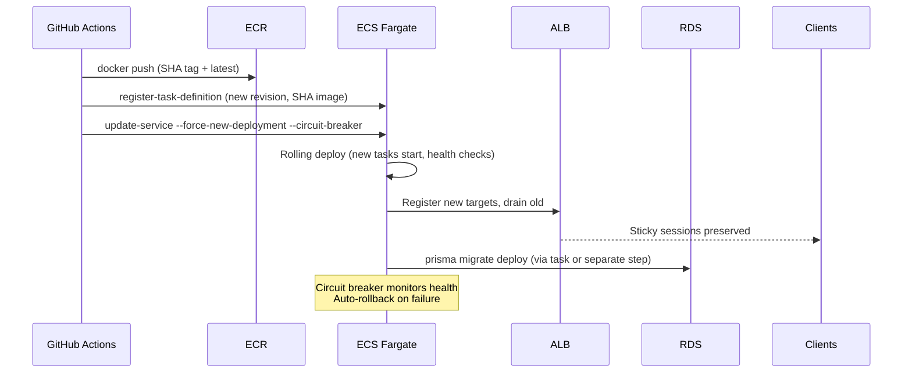

# AWS Deploy Architecture

> **Target architecture for the Project One server deployment on AWS**
>
> This document describes the component inventory, relationships, network layout, and a Terraform reference for reproducible provisioning. It is designed to be read **before** any real AWS resources are created (Phase 2), following the pedagogical sequence: console-guided learning → Terraform codification (design decision D9).

---

## 🎯 Component Inventory

| Component                   | AWS Service                                                              | Purpose                                                                                                                                                                                                                                                                                     | Key Configuration                                                                                                                                                                                                                             |
| --------------------------- | ------------------------------------------------------------------------ | ------------------------------------------------------------------------------------------------------------------------------------------------------------------------------------------------------------------------------------------------------------------------------------------- | --------------------------------------------------------------------------------------------------------------------------------------------------------------------------------------------------------------------------------------------- |
| **Container Orchestration** | ECS Fargate                                                              | Serverless containers for the Express + Socket.IO API                                                                                                                                                                                                                                       | Clusters: `project-one-staging`, `project-one-prod`; Service: `api`; Task definitions pinned by Git SHA                                                                                                                                       |
| **Load Balancer**           | Application Load Balancer (ALB)                                          | Terminate TLS, route HTTP/WS traffic, sticky sessions for Socket.IO                                                                                                                                                                                                                         | Target group stickiness (cookie-based, duration 1h); **idle timeout ≥ 65s** (server `keepAliveTimeout` = 60s); HTTPS listener with ACM cert                                                                                                   |
| **Database**                | RDS PostgreSQL                                                           | Managed PostgreSQL for Prisma ORM                                                                                                                                                                                                                                                           | Instance class: `db.t3.micro` / Serverless v2 (min capacity); Multi-AZ for prod; Automated backups + PITR; Security group restricted to ECS tasks + ALB                                                                                       |
| **Container Registry**      | ECR (Private)                                                            | Store Docker images tagged by SHA + `latest`                                                                                                                                                                                                                                                | Repo: `project-one-server`; Lifecycle policy: keep last 30 tags / 30 days; Image scan on push                                                                                                                                                 |
| **Identity & Access**       | IAM OIDC Provider + Role                                                 | GitHub Actions → AWS authentication without long-lived keys                                                                                                                                                                                                                                 | Provider: `token.actions.githubusercontent.com`; Audience: `sts.amazonaws.com`; Role trust policy restricted to `repo:<owner>/<repo>` + environment filter; Least-privilege policy (ECR push/pull, ECS update/describe on project clusters)   |
| **Network**                 | VPC + Subnets + Security Groups                                          | Isolated network for all resources                                                                                                                                                                                                                                                          | VPC with public + private subnets (2 AZs); NAT Gateway for private egress; SG: ALB (80/443 from internet), ECS tasks (3000 from ALB SG), RDS (5432 from ECS tasks SG)                                                                         |
| **Secrets**                 | GitHub Environment Secrets (Phase 1–2a) → AWS Secrets Manager (Phase 2c) | DATABASE*URL, **SECRETKEY** (env var — el ARN legacy se llama `*_JWT_SECRET_SECRET_ARN` pero el nombre del env var inyectado es `SECRETKEY`, NO `JWT_SECRET`), REFRESHSECRETKEY, AES_GCM_KEY, AWS_REGION + runtime vars (ORIGIN_CORS, FRONTEND_URL, BCRYPT_SALT, CLOUD*\*, SECRETCOOKIEKEY) | Phase 1–2a: injected via ECS task `secrets` from GitHub env secrets; Phase 2c: task execution role reads from Secrets Manager, app loads via `loadSecrets()` (code wiring required). Referencia completa: `docs/server-bootstrap-env-vars.md` |
| **Observability**           | CloudWatch Logs + Metrics                                                | Container logs, health checks, custom metrics                                                                                                                                                                                                                                               | Log groups: `/ecs/project-one-staging`, `/ecs/project-one-prod`; Container health check: `curl -f http://localhost:3000/health \|\| exit 1` (interval 30s, timeout 5s, retries 3, startPeriod 60s)                                            |

---

## 🔗 Component Relationships

```mermaid
graph TD
    subgraph Internet
        U[Users / Clients]
    end

    subgraph AWS_Account[AWS Account]
        subgraph VPC[VPC: project-one-vpc]
            subgraph Public_Subnets[Public Subnets (2 AZs)]
                ALB[ALB\n:80/:443\nStickiness + Idle Timeout ≥ 65s]
                NAT[NAT Gateway]
            end

            subgraph Private_Subnets[Private Subnets (2 AZs)]
                subgraph ECS_Staging[ECS Cluster: project-one-staging]
                    Svc_S[Service: api\nTask Def: SHA-tagged\nCircuit Breaker: ON]
                end
                subgraph ECS_Prod[ECS Cluster: project-one-prod]
                    Svc_P[Service: api\nTask Def: SHA-tagged\nCircuit Breaker: ON]
                end

                RDS[(RDS PostgreSQL\nMulti-AZ Prod / Single-AZ Staging\nBackups + PITR)]
            end
        end

        ECR[(ECR: project-one-server\nLifecycle: 30 tags / 30 days)]
        IAM[IAM OIDC Role\nGitHub Actions → AWS]
        SM[Secrets Manager\n(Phase 2c)]
        CW[CloudWatch Logs/Metrics]
    end

    U -->|HTTPS/WSS| ALB
    ALB -->|HTTP:3000\nSticky Sessions| Svc_S
    ALB -->|HTTP:3000\nSticky Sessions| Svc_P
    Svc_S -->|TCP:5432| RDS
    Svc_P -->|TCP:5432| RDS
    Svc_S -.->|Read Secrets| SM
    Svc_P -.->|Read Secrets| SM
    IAM -->|Assumes| Svc_S
    IAM -->|Assumes| Svc_P
    IAM -->|OIDC| GitHub[GitHub Actions]
    GitHub -->|Push SHA-tagged Image| ECR
    ECR -->|Pull Image| Svc_S
    ECR -->|Pull Image| Svc_P
    Svc_S -->|Logs/Metrics| CW
    Svc_P -->|Logs/Metrics| CW
    NAT -->|Egress| ECR
    NAT -->|Egress| SM
```

---

## 🌐 Network Layout

### VPC Design

- **CIDR**: `10.0.0.0/16` (adjustable)
- **Availability Zones**: 2 (e.g., `us-east-1a`, `us-east-1b`)
- **Subnets**:
  - Public: `10.0.0.0/20`, `10.0.16.0/20` — ALB, NAT Gateway
  - Private (App): `10.0.32.0/20`, `10.0.48.0/20` — ECS Fargate tasks
  - Private (Data): `10.0.64.0/20`, `10.0.80.0/20` — RDS

### Security Groups

| SG Name        | Ingress Rules            | Egress Rules                                            | Attached To                |
| -------------- | ------------------------ | ------------------------------------------------------- | -------------------------- |
| `sg-alb`       | 80/443 from `0.0.0.0/0`  | All to `sg-ecs-tasks`                                   | ALB                        |
| `sg-ecs-tasks` | 3000 from `sg-alb`       | 5432 to `sg-rds`; 443 to ECR/Secrets Manager/CloudWatch | ECS Tasks (staging + prod) |
| `sg-rds`       | 5432 from `sg-ecs-tasks` | None (deny all egress)                                  | RDS Instance               |

### ALB Configuration for Socket.IO

- **Target Group**: `project-one-api-tg` (instance/IP target type)
- **Stickiness**: Enabled (load balancer generated cookie, duration: 1 hour)
- **Idle Timeout**: **65 seconds minimum** (server `keepAliveTimeout` = 60s + buffer) — critical for WebSocket keep-alive
- **Health Check**: `GET /health`, interval 30s, timeout 5s, healthy threshold 2, unhealthy threshold 3
- **Listener**: HTTPS (443) with ACM certificate → forward to target group

### RDS Network Isolation

- RDS in **private data subnets** (no public access)
- Only `sg-ecs-tasks` can connect on port 5432
- Parameter group: `rds.postgresql16` with `rds.force_ssl = 1`
- Subnet group spans both AZs for Multi-AZ (prod)

---

## 🔄 Deployment Flow (Phase 2)



---

## 🛡️ Security Model

| Layer                  | Mechanism                                                                                            |
| ---------------------- | ---------------------------------------------------------------------------------------------------- |
| **Auth to AWS**        | OIDC federation (GitHub → IAM Role), no access keys                                                  |
| **Least Privilege**    | Role policy: ECR (project repo only), ECS (project clusters only)                                    |
| **Network**            | Private subnets for compute/data; SG least-privilege; NAT for egress                                 |
| **Secrets**            | Phase 1–2a: GitHub env secrets → ECS task `secrets`; Phase 2c: Secrets Manager + task execution role |
| **Transport**          | ALB terminates TLS; RDS `force_ssl=1`; ECS tasks communicate over private VPC                        |
| **Image Supply Chain** | SHA-tagged immutable images; ECR scan on push; `latest` movable tag                                  |

---

## 📦 Terraform Reference (State in S3)

> **Design Decision D9**: Console-guided first for learning, Terraform reference documents reproducibility. This reference covers all components above as a **starting point** for real provisioning. It is not a complete production-ready module — adapt to your standards.

### Backend Configuration

```hcl
# backend.tf
terraform {
  backend "s3" {
    bucket         = "project-one-terraform-state"
    key            = "cd-aws-deploy/terraform.tfstate"
    region         = "us-east-1"
    encrypt        = true
    dynamodb_table = "project-one-terraform-locks"
  }
}
```

### Provider & Variables

```hcl
# providers.tf
terraform {
  required_version = ">= 1.6"
  required_providers {
    aws = {
      source  = "hashicorp/aws"
      version = "~> 5.0"
    }
  }
}

provider "aws" {
  region = var.aws_region
}

variable "aws_region" {
  default = "us-east-1"
}

variable "project_name" {
  default = "project-one"
}

variable "environment" {
  type    = string
  validation {
    condition     = contains(["staging", "production"], var.environment)
    error_message = "Environment must be staging or production."
  }
}
```

### VPC Module (Simplified)

```hcl
# modules/vpc/main.tf
resource "aws_vpc" "main" {
  cidr_block           = "10.0.0.0/16"
  enable_dns_hostnames = true
  enable_dns_support   = true

  tags = {
    Name = "${var.project_name}-vpc"
  }
}

resource "aws_subnet" "public" {
  count                   = 2
  vpc_id                  = aws_vpc.main.id
  cidr_block              = cidrsubnet("10.0.0.0/16", 4, count.index)
  availability_zone       = data.aws_availability_zones.available.names[count.index]
  map_public_ip_on_launch = true

  tags = {
    Name = "${var.project_name}-public-${count.index + 1}"
    Type = "public"
  }
}

resource "aws_subnet" "private_app" {
  count             = 2
  vpc_id            = aws_vpc.main.id
  cidr_block        = cidrsubnet("10.0.0.0/16", 4, count.index + 2)
  availability_zone = data.aws_availability_zones.available.names[count.index]

  tags = {
    Name = "${var.project_name}-private-app-${count.index + 1}"
    Type = "private-app"
  }
}

resource "aws_subnet" "private_data" {
  count             = 2
  vpc_id            = aws_vpc.main.id
  cidr_block        = cidrsubnet("10.0.0.0/16", 4, count.index + 4)
  availability_zone = data.aws_availability_zones.available.names[count.index]

  tags = {
    Name = "${var.project_name}-private-data-${count.index + 1}"
    Type = "private-data"
  }
}

resource "aws_internet_gateway" "main" {
  vpc_id = aws_vpc.main.id
  tags   = { Name = "${var.project_name}-igw" }
}

resource "aws_nat_gateway" "main" {
  count         = 2
  subnet_id     = aws_subnet.public[count.index].id
  allocation_id = aws_eip.nat[count.index].id
  tags          = { Name = "${var.project_name}-nat-${count.index + 1}" }
}

resource "aws_eip" "nat" {
  count  = 2
  domain = "vpc"
  tags   = { Name = "${var.project_name}-eip-nat-${count.index + 1}" }
}

resource "aws_route_table" "public" {
  vpc_id = aws_vpc.main.id
  route {
    cidr_block = "0.0.0.0/0"
    gateway_id = aws_internet_gateway.main.id
  }
  tags = { Name = "${var.project_name}-rt-public" }
}

resource "aws_route_table_association" "public" {
  count          = 2
  subnet_id      = aws_subnet.public[count.index].id
  route_table_id = aws_route_table.public.id
}

resource "aws_route_table" "private_app" {
  count  = 2
  vpc_id = aws_vpc.main.id
  route {
    cidr_block     = "0.0.0.0/0"
    nat_gateway_id = aws_nat_gateway.main[count.index].id
  }
  tags = { Name = "${var.project_name}-rt-private-app-${count.index + 1}" }
}

resource "aws_route_table_association" "private_app" {
  count          = 2
  subnet_id      = aws_subnet.private_app[count.index].id
  route_table_id = aws_route_table.private_app[count.index].id
}

resource "aws_route_table" "private_data" {
  count  = 2
  vpc_id = aws_vpc.main.id
  # No NAT route — data subnet has no internet egress
  tags = { Name = "${var.project_name}-rt-private-data-${count.index + 1}" }
}

resource "aws_route_table_association" "private_data" {
  count          = 2
  subnet_id      = aws_subnet.private_data[count.index].id
  route_table_id = aws_route_table.private_data[count.index].id
}
```

### Security Groups

```hcl
# modules/security-groups/main.tf
resource "aws_security_group" "alb" {
  name        = "${var.project_name}-sg-alb"
  vpc_id      = var.vpc_id
  description = "ALB security group"

  ingress {
    from_port   = 80
    to_port     = 80
    protocol    = "tcp"
    cidr_blocks = ["0.0.0.0/0"]
  }

  ingress {
    from_port   = 443
    to_port     = 443
    protocol    = "tcp"
    cidr_blocks = ["0.0.0.0/0"]
  }

  egress {
    from_port   = 0
    to_port     = 0
    protocol    = "-1"
    security_groups = [aws_security_group.ecs_tasks.id]
  }

  tags = { Name = "${var.project_name}-sg-alb" }
}

resource "aws_security_group" "ecs_tasks" {
  name        = "${var.project_name}-sg-ecs-tasks"
  vpc_id      = var.vpc_id
  description = "ECS Fargate tasks security group"

  ingress {
    from_port       = 3000
    to_port         = 3000
    protocol        = "tcp"
    security_groups = [aws_security_group.alb.id]
  }

  egress {
    from_port       = 5432
    to_port         = 5432
    protocol        = "tcp"
    security_groups = [aws_security_group.rds.id]
  }

  egress {
    from_port   = 443
    to_port     = 443
    protocol    = "tcp"
    cidr_blocks = ["0.0.0.0/0"]  # ECR, Secrets Manager, CloudWatch
  }

  tags = { Name = "${var.project_name}-sg-ecs-tasks" }
}

resource "aws_security_group" "rds" {
  name        = "${var.project_name}-sg-rds"
  vpc_id      = var.vpc_id
  description = "RDS security group"

  ingress {
    from_port       = 5432
    to_port         = 5432
    protocol        = "tcp"
    security_groups = [aws_security_group.ecs_tasks.id]
  }

  # No egress rules — deny all outbound
  tags = { Name = "${var.project_name}-sg-rds" }
}
```

### ECR Repository

```hcl
# modules/ecr/main.tf
resource "aws_ecr_repository" "server" {
  name                 = "${var.project_name}-server"
  image_tag_mutability = "MUTABLE"  # latest tag moves; SHA tags immutable

  image_scanning_configuration {
    scan_on_push = true
  }

  lifecycle_policy {
    policy = jsonencode({
      rules = [
        {
          rulePriority = 1
          description  = "Keep last 30 tags"
          selection = {
            tagStatus     = "any"
            countType     = "imageCountMoreThan"
            countNumber   = 30
          }
          action = { type = "expire" }
        },
        {
          rulePriority = 2
          description  = "Expire images older than 30 days"
          selection = {
            tagStatus     = "any"
            countType     = "sinceImagePushed"
            countUnit     = "days"
            countNumber   = 30
          }
          action = { type = "expire" }
        }
      ]
    })
  }
}
```

### ECS Cluster + Service (Staging Example)

```hcl
# modules/ecs/main.tf
resource "aws_ecs_cluster" "staging" {
  name = "${var.project_name}-staging"

  setting {
    name  = "containerInsights"
    value = "enabled"
  }
}

resource "aws_ecs_task_definition" "staging_api" {
  family                   = "${var.project_name}-staging-api"
  network_mode             = "awsvpc"
  requires_compatibilities = ["FARGATE"]
  cpu                      = "256"
  memory                   = "512"
  execution_role_arn       = var.task_execution_role_arn
  task_role_arn            = var.task_role_arn

  container_definitions = jsonencode([
    {
      name      = "api"
      image     = "${var.ecr_repository_url}:${var.image_tag}"
      portMappings = [{ containerPort = 3000, protocol = "tcp" }]
      environment = [
        { name = "NODE_ENV", value = "staging" },
        { name = "PORT", value = "3000" }
      ]
      secrets = [
        { name = "DATABASE_URL", valueFrom = var.db_url_secret_arn },
        { name = "SECRETKEY", valueFrom = var.jwt_secret_arn },
        { name = "AWS_REGION", valueFrom = var.aws_region_secret_arn }
      ]
      logConfiguration = {
        logDriver = "awslogs"
        options = {
          "awslogs-group"         = "/ecs/${var.project_name}-staging"
          "awslogs-region"        = var.aws_region
          "awslogs-stream-prefix" = "api"
        }
      }
      healthCheck = {
        command     = ["CMD-SHELL", "curl -f http://localhost:3000/health || exit 1"]
        interval    = 30
        timeout     = 5
        retries     = 3
        startPeriod = 60
      }
    }
  ])
}

resource "aws_ecs_service" "staging_api" {
  name            = "api"
  cluster         = aws_ecs_cluster.staging.id
  task_definition = aws_ecs_task_definition.staging_api.arn
  desired_count   = 1
  launch_type     = "FARGATE"
  network_configuration {
    subnets         = var.private_app_subnet_ids
    security_groups = [aws_security_group.ecs_tasks.id]
    assign_public_ip = false
  }
  load_balancer {
    target_group_arn = aws_lb_target_group.api.arn
    container_name   = "api"
    container_port   = 3000
  }
  deployment_controller {
    type = "ECS"
  }
  deployment_circuit_breaker {
    enable   = true
    rollback = true
  }
}
```

### ALB with Stickiness + Idle Timeout

```hcl
# modules/alb/main.tf
resource "aws_lb" "main" {
  name               = "${var.project_name}-alb"
  internal           = false
  load_balancer_type = "application"
  subnets            = var.public_subnet_ids
  security_groups    = [aws_security_group.alb.id]
  enable_deletion_protection = false

  # Idle timeout ≥ 65s for Socket.IO keep-alive
  idle_timeout = 65
}

resource "aws_lb_target_group" "api" {
  name        = "${var.project_name}-api-tg"
  port        = 3000
  protocol    = "HTTP"
  vpc_id      = var.vpc_id
  target_type = "ip"

  # Stickiness for Socket.IO
  stickiness {
    type            = "lb_cookie"
    cookie_duration = 3600  # 1 hour
    enabled         = true
  }

  health_check {
    path                = "/health"
    interval            = 30
    timeout             = 5
    healthy_threshold   = 2
    unhealthy_threshold = 3
    matcher             = "200"
  }
}

resource "aws_lb_listener" "https" {
  load_balancer_arn = aws_lb.main.arn
  port              = 443
  protocol          = "HTTPS"
  ssl_policy        = "ELBSecurityPolicy-TLS13-1-2-2021-06"
  certificate_arn   = var.acm_certificate_arn

  default_action {
    type             = "forward"
    target_group_arn = aws_lb_target_group.api.arn
  }
}

# HTTP → HTTPS redirect
resource "aws_lb_listener" "http" {
  load_balancer_arn = aws_lb.main.arn
  port              = 80
  protocol          = "HTTP"

  default_action {
    type = "redirect"
    redirect {
      port        = "443"
      protocol    = "HTTPS"
      status_code = "HTTP_301"
    }
  }
}
```

### RDS PostgreSQL

```hcl
# modules/rds/main.tf
resource "aws_db_subnet_group" "main" {
  name       = "${var.project_name}-db-subnet-group"
  subnet_ids = var.private_data_subnet_ids
  tags       = { Name = "${var.project_name}-db-subnet-group" }
}

resource "aws_db_parameter_group" "pg16" {
  family = "postgres16"
  name   = "${var.project_name}-pg16-params"

  parameter {
    name  = "rds.force_ssl"
    value = "1"
  }
}

resource "aws_db_instance" "staging" {
  identifier             = "${var.project_name}-staging-db"
  engine                 = "postgres"
  engine_version         = "16.4"
  instance_class         = "db.t3.micro"
  allocated_storage      = 20
  storage_encrypted      = true
  db_subnet_group_name   = aws_db_subnet_group.main.name
  vpc_security_group_ids = [aws_security_group.rds.id]
  parameter_group_name   = aws_db_parameter_group.pg16.name
  db_name                = "project_one"
  username               = "appuser"
  password               = random_password.db_password.result
  skip_final_snapshot    = true  # Staging only
  backup_retention_period = 7
  multi_az               = false

  tags = { Environment = "staging" }
}

resource "aws_db_instance" "production" {
  identifier             = "${var.project_name}-prod-db"
  engine                 = "postgres"
  engine_version         = "16.4"
  instance_class         = "db.t3.micro"  # Start small, scale up
  allocated_storage      = 20
  max_allocated_storage  = 100
  storage_encrypted      = true
  db_subnet_group_name   = aws_db_subnet_group.main.name
  vpc_security_group_ids = [aws_security_group.rds.id]
  parameter_group_name   = aws_db_parameter_group.pg16.name
  db_name                = "project_one"
  username               = "appuser"
  password               = random_password.db_password.result
  skip_final_snapshot    = false
  deletion_protection    = true
  backup_retention_period = 30
  multi_az               = true

  tags = { Environment = "production" }
}
```

### IAM OIDC Role for GitHub Actions

```hcl
# modules/iam/github-oidc.tf
data "aws_iam_policy_document" "github_oidc_trust" {
  statement {
    sid = "AllowGitHubActions"
    effect = "Allow"
    principals {
      type        = "Federated"
      identifiers = [aws_iam_openid_connect_provider.github.arn]
    }
    actions = ["sts:AssumeRoleWithWebIdentity"]
    condition {
      test     = "StringLike"
      variable = "token.actions.githubusercontent.com:sub"
      values   = ["repo:${var.github_owner}/${var.github_repo}:*"]
    }
    condition {
      test     = "StringEquals"
      variable = "token.actions.githubusercontent.com:aud"
      values   = ["sts.amazonaws.com"]
    }
  }
}

resource "aws_iam_openid_connect_provider" "github" {
  client_id_list  = ["sts.amazonaws.com"]
  thumbprint_list = ["6938fd4d98bab03faadb97b34396831e3780aea1"]  # GitHub's thumbprint
  url             = "https://token.actions.githubusercontent.com"
}

resource "aws_iam_role" "github_actions" {
  name               = "${var.project_name}-github-actions"
  assume_role_policy = data.aws_iam_policy_document.github_oidc_trust.json
  max_session_duration = 3600
}

resource "aws_iam_policy" "github_actions_cd" {
  name = "${var.project_name}-github-actions-cd"
  policy = jsonencode({
    Version = "2012-10-17"
    Statement = [
      {
        Sid    = "ECRPushPull"
        Effect = "Allow"
        Action = [
          "ecr:GetAuthorizationToken",
          "ecr:InitiateLayerUpload",
          "ecr:PutImage",
          "ecr:CompleteLayerUpload",
          "ecr:BatchCheckLayerAvailability",
          "ecr:BatchGetImage",
          "ecr:GetDownloadUrlForLayer"
        ]
        Resource = "${aws_ecr_repository.server.arn}/*"
      },
      {
        Sid    = "ECSCRUD"
        Effect = "Allow"
        Action = [
          "ecs:RegisterTaskDefinition",
          "ecs:UpdateService",
          "ecs:DescribeServices",
          "ecs:DescribeTaskDefinition",
          "ecs:ListTasks",
          "ecs:WaitServicesStable"
        ]
        Resource = [
          "${aws_ecs_cluster.staging.arn}",
          "${aws_ecs_cluster.production.arn}",
          "${aws_ecs_task_definition.staging_api.arn}*",
          "${aws_ecs_task_definition.production_api.arn}*"
        ]
      },
      {
        Sid    = "ECRCreateRepo"
        Effect = "Allow"
        Action = ["ecr:CreateRepository"]
        Resource = "*"
        Condition = {
          StringEquals = { "aws:RequestTag/project" = var.project_name }
        }
      }
    ]
  })
}

resource "aws_iam_role_policy_attachment" "github_actions_cd" {
  role       = aws_iam_role.github_actions.name
  policy_arn = aws_iam_policy.github_actions_cd.arn
}
```

### Usage (Root Module)

```hcl
# main.tf (example composition)
module "vpc" {
  source = "./modules/vpc"
  project_name = var.project_name
}

module "security_groups" {
  source  = "./modules/security-groups"
  vpc_id  = module.vpc.vpc_id
  project_name = var.project_name
}

module "ecr" {
  source = "./modules/ecr"
  project_name = var.project_name
}

module "rds_staging" {
  source = "./modules/rds"
  project_name = var.project_name
  environment  = "staging"
  vpc_id            = module.vpc.vpc_id
  private_data_subnet_ids = module.vpc.private_data_subnet_ids
  sg_rds_id         = module.security_groups.sg_rds_id
  sg_ecs_tasks_id   = module.security_groups.sg_ecs_tasks_id
}

module "ecs_staging" {
  source = "./modules/ecs"
  project_name = var.project_name
  environment  = "staging"
  vpc_id                   = module.vpc.vpc_id
  private_app_subnet_ids   = module.vpc.private_app_subnet_ids
  ecr_repository_url       = module.ecr.repository_url
  image_tag                = var.image_tag_sha
  task_execution_role_arn  = var.task_execution_role_arn
  task_role_arn            = var.task_role_arn
  db_url_secret_arn        = var.staging_db_url_secret_arn
  jwt_secret_arn           = var.staging_jwt_secret_arn
  aws_region_secret_arn    = var.staging_aws_region_secret_arn
}

module "alb" {
  source = "./modules/alb"
  project_name = var.project_name
  vpc_id = module.vpc.vpc_id
  public_subnet_ids = module.vpc.public_subnet_ids
  sg_alb_id = module.security_groups.sg_alb_id
  sg_ecs_tasks_id = module.security_groups.sg_ecs_tasks_id
  acm_certificate_arn = var.acm_certificate_arn
}

module "github_oidc" {
  source = "./modules/iam/github-oidc"
  project_name = var.project_name
  github_owner = var.github_owner
  github_repo  = var.github_repo
  ecr_repository_arn = module.ecr.repository_arn
  ecs_cluster_staging_arn = module.ecs_staging.cluster_arn
  ecs_cluster_production_arn = module.ecs_production.cluster_arn
}
```

---

## 🔄 Rollback Procedures (Documented for < 15 min Budget)

### Application Rollback (Redeploy Previous Image)

```bash
# 1. Identify previous SHA tag in ECR
aws ecr describe-images \
  --repository-name project-one-server \
  --query 'sort_by(imageDetails,&imagePushedAt)[-2].imageTags[0]'

# 2. Register task definition with previous SHA
aws ecs register-task-definition \
  --family project-one-staging-api \
  --cli-input-json file://task-def-staging.json  # update image to previous SHA

# 3. Force new deployment (circuit breaker will monitor)
aws ecs update-service \
  --cluster project-one-staging \
  --service api \
  --task-definition <new-task-def-arn> \
  --force-new-deployment \
  --deployment-configuration "deploymentCircuitBreaker={enable=true,rollback=true}"
```

### Database Rollback (Prisma Migrate Down)

```bash
# Run as ECS one-off task (same network/security as service)
aws ecs run-task \
  --cluster project-one-staging \
  --task-definition project-one-staging-api:<revision> \
  --launch-type FARGATE \
  --network-configuration "awsvpcConfiguration={subnets=[subnet-xxx],securityGroups=[sg-xxx],assignPublicIp=DISABLED}" \
  --overrides '{"containerOverrides":[{"name":"api","command":["npx","prisma","migrate","down","--preview-feature"]}]}'
```

> **Note**: Every migration must be reversible or have a documented data plan (design decision D9, spec `cd-rollback`).

---

## 📋 Cross-References

| Document                                            | Purpose                                                                 |
| --------------------------------------------------- | ----------------------------------------------------------------------- |
| `docs/aws-cd-learning-path.md`                      | Milestone-based Floci practice to unlock each Phase 2 component         |
| `docs/aws-learning-with-floci.md`                   | Progressive AWS learning with Floci (sibling `ci-preview-environments`) |
| `docs/aws-dev-local-floci.md`                       | Local dev setup with Floci (sibling `ci-floci-migration`)               |
| `openspec/changes/cd-aws-deploy-pipeline/design.md` | Design decisions D1-D10                                                 |
| `.github/workflows/deploy.yml`                      | Pipeline implementation (Phase 1 scaffold + Phase 2 gated jobs)         |

---

_Generated as part of OpenSpec change `cd-aws-deploy-pipeline` — tasks 3.1, 3.2._
