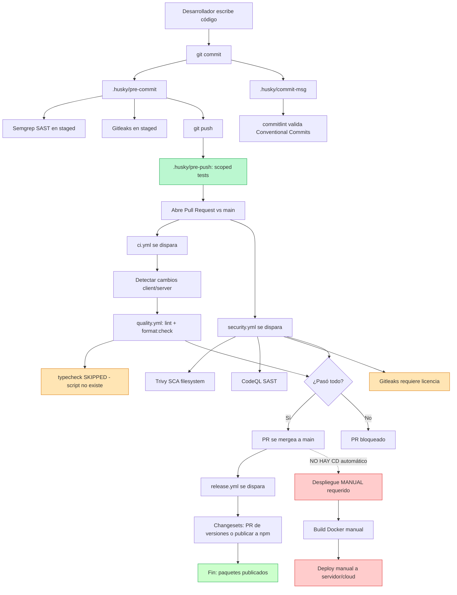

# Estado actual de CI/CD del sistema

> Documento explicativo del estado de Integración Continua (CI) y Despliegue Continuo (CD)
> del monorepo **Project One**.
> Audiencia: personas técnicas y no técnicas.
> Última revisión: julio 2026.

---

## Tabla de contenidos

1. [Resumen ejecutivo (para no técnicos)](#1-resumen-ejecutivo-para-no-técnicos)
2. [Glosario de términos](#2-glosario-de-términos)
3. [Estado actual de CI/CD de un vistazo](#3-estado-actual-de-cicd-de-un-vistazo)
4. [Flujo de Integración Continua (CI) paso a paso](#4-flujo-de-integración-continua-ci-paso-a-paso)
5. [Flujo de Despliegue Continuo (CD)](#5-flujo-de-despliegue-continuo-cd)
6. [Tabla de pipelines / workflows actuales](#6-tabla-de-pipelines--workflows-actuales)
7. [Diagrama del flujo del código](#7-diagrama-del-flujo-del-código)
8. [Cobertura de pruebas actual](#8-cobertura-de-pruebas-actual)
9. [Seguridad integrada en el pipeline](#9-seguridad-integrada-en-el-pipeline)
10. [Herramientas y tecnologías del pipeline](#10-herramientas-y-tecnologías-del-pipeline)
11. [Brechas, limitaciones y mejoras pendientes](#11-brechas-limitaciones-y-mejoras-pendientes)
12. [Conclusiones y recomendaciones](#12-conclusiones-y-recomendaciones)

---

## 1. Resumen ejecutivo (para no técnicos)

**¿Qué es CI/CD?**
CI/CD es un conjunto de prácticas automáticas que verifican que cada cambio en el código
(un nuevo botón, una corrección, una nueva función) sea seguro de integrar al proyecto
principal (**CI**) y que ese código verificado llegue a producción sin pasos manuales
propensos a error (**CD**).

**¿En qué estado está Project One?**

- ✅ **Integración Continua (CI): implementada.** Cuando alguien abre un Pull Request
  (solicitud de cambios) hacia la rama `main`, el sistema revisa automáticamente el
  código (estilo, formato, análisis de seguridad).
- ⚠️ **Calidad pre-commit en el equipo del desarrollador: parcial.** Antes de confirmar
  un cambio, el git hook revisa secretos filtrados y aplica análisis estático, pero
  el hook `pre-push` ejecuta tests scoped con `vitest --changed origin/main`, enfocándose
  solo en tests afectados por los cambios desde `origin/main`.
- ❌ **Despliegue Continuo (CD): no implementado.** No existe ninguna pipeline que
  publique automáticamente el código en un servidor o en la nube. La infraestructura
  Docker del servidor está lista, pero no está conectada a la automatización.
- ⚠️ **Pruebas en CI: ausentes.** Aunque el proyecto define pruebas unitarias, de
  integración y E2E (extremo a extremo) localmente, las pipelines que corren en GitHub
  no las ejecutan todavía. Están comentadas en `ci.yml`.
- ✅ **Seguridad: razonable.** Existen controles de secretos (gitleaks), análisis
  estático de código (CodeQL) y análisis de dependencias vulnerables (Trivy).
- ✅ **Versionado de paquetes y releases: automatizado.** El proyecto usa Changesets
  para publicar versiones automáticamente cuando se hace `push` a `main`.

**En una frase:** el proyecto verifica el código cuando se abre un Pull Request, pero
las pruebas no corren en CI y no existe despliegue automático a ningún entorno.

---

## 2. Glosario de términos

| Término | Significado (para no técnicos) |
|---|---|
| **CI (Integración Continua)** | Verificación automática del código cada vez que alguien propone un cambio. |
| **CD (Despliegue Continuo)** | Publicación automática del código verificado a un entorno real (staging, producción). |
| **Pipeline / Workflow** | Secuencia automática de etapas que se ejecutan en orden (verificar → construir → probar → publicar). |
| **Pull Request (PR)** | Solicitud para incorporar una rama de cambios a la rama principal `main`. |
| **Rama `main`** | La versión "oficial" del proyecto. Todo cambio entra ahí. |
| **Build (Construcción)** | Transformar el código fuente en archivos listos para producción. |
| **Lint** | Revisor automático de estilo y buenas prácticas del código. |
| **Format check** | Verifica que el código esté escrito con un formato uniforme (espacios, comas, etc.). |
| **Tests / Pruebas** | Pequeños programas que verifican que el código hace lo esperado. |
| **Unit test** | Prueba que verifica una función o componente aislado. |
| **Integration test** | Prueba que verifica cómo trabajan juntos varios módulos (ej. API + base de datos). |
| **E2E (end-to-end)** | Prueba que simula a un usuario real usando la aplicación de punta a punta. |
| **SAST** | Static Application Security Testing: analiza el código fuente buscando vulnerabilidades. |
| **SCA** | Software Composition Analysis: examina las librerías de terceros buscando vulnerabilidades conocidas. |
| **Secret scanning** | Busca contraseñas, tokens o claves accidentalmente escritas en el código. |
| **Staging** | Entorno de pruebas previo a producción. |
| **Producción** | El entorno real que usan los usuarios finales. |
| **Hook (git hook)** | Script que corre automáticamente en un evento de git (antes de un commit, antes de un push). |
| **Changesets** | Herramienta que gestiona cambios de versión y publica paquetes. |
| **Workspace (npm)** | Sub-proyecto dentro del monorepo (client, server, e2e). |

---

## 3. Estado actual de CI/CD de un vistazo

| Aspecto | Estado | Notas |
|---|---|---|
| **Integración Continua (CI)** | ✅ Implementada | 3 workflows activos: CI (calidad), security, release. |
| **Despliegue Continuo (CD)** | ❌ No implementada | No hay pipelines de publicación a ningún entorno. |
| **Gates pre-commit** | ✅ Activos | Husky ejecuta Semgrep (SAST) + Gitleaks (secretos en staged). |
| **Hook `commit-msg`** | ✅ Activo | commitlint valida Conventional Commits. |
| **Gates pre-push** | ✅ Activo | `.husky/pre-push`: `vitest --changed origin/main` scoped tests (server + client) |
| **Lint + Format en CI** | ✅ Activos | Workflow `quality.yml` reutilizable. |
| **Tests en CI** | ❌ No ejecutados | Sección comentada en `ci.yml`. |
| **Build en CI** | ❌ No ejecutado | No se corre `npm run build` en ningún workflow activo. |
| **Typecheck en CI** | ⚠️ Condicionado | Se intenta ejecutar pero el script `typecheck` no existe; imprime "Typecheck skipped". |
| **SCA (Trivy)** | ✅ Activo | Scaneo filesystem para severidad CRITICAL y HIGH. |
| **SAST (CodeQL)** | ✅ Activo | Análisis de código JavaScript. |
| **Secret scanning (gitleaks)** | ✅ Activo | En CI requiere licencia (secreto `GIT_LEAKS`). |
| **Versionado / Releases** | ✅ Changesets | PR de versión + publicación automática en `push` a `main`. |
| **Entornos (staging/prod)** | ❌ Inexistentes | No hay configuración de entornos remotos. |
| **Infra como código (IaC)** | ❌ Inexistente | No hay Terraform/Pulumi. |
| **Dockerización server** | ✅ Presente | `Dockerfile` + `docker-compose.yml` listos pero no integrados a CI/CD. |
| **`.dockerignore`** | ❌ No existe | Riesgo: imágenes podrían incluir archivos no deseados. |

---

## 4. Flujo de Integración Continua (CI) paso a paso

### Etapa 0 — En la máquina del desarrollador (pre-commit)

Antes incluso de subir el código, cuando el desarrollador ejecuta `git commit`:

1. **`.husky/pre-commit`** ejecuta:
   - **Semgrep SAST** (`npm run sast:semgrep`) — análisis estático de los archivos staged.
   - **Gitleaks** (`npm run security:secrets`) — búsqueda de secretos en los archivos staged.
2. **`.husky/commit-msg`** valida el mensaje del commit con **commitlint**:
   - Debe seguir **Conventional Commits** (formato `tipo(scope): descripción`).
   - Ejemplo válido: `feat(auth): agregar login con GitHub`.
   - Ejemplo inválido: `cambios varios`.
3. **lint-staged** (configurado en `package.json`):
   - Aplica `prettier` (formato) y `eslint` (lint) a los archivos staged.

> ✅ **Actualizado (jul 2026):** El hook `.husky/pre-push` ahora ejecuta tests scoped
> con `npx vitest run --changed origin/main` para los workspaces server y client,
> reemplazando la suite completa por solo tests afectados desde `origin/main`.

### Etapa 1 — Apertura del Pull Request

Cuando un PR se abre contra la rama `main`:

1. **Disparador:** `pull_request` en `branches: [main]` (ver `.github/workflows/ci.yml`).
2. **Cancelación de ejecuciones duplicadas:** Se configura `concurrency` con
   `cancel-in-progress: true` para no gastar minutos de GitHub Actions si el PR recibe
   nuevos commits mientras corre una pipeline anterior.

### Etapa 2 — Detección de cambios (job `changes`)

Job `changes` del workflow `ci.yml`:

- Usa `dorny/paths-filter@v3` para detectar qué workspaces cambiaron.
- Salidas:
  - `frontend`: `"true"` si hubo cambios en `apps/client/**`.
  - `backend`: `"true"` si hubo cambios en `apps/server/**`.
- Esto permite **saltar etapas innecesarias** (si solo cambia el cliente, no se lintea el servidor).

### Etapa 3 — Calidad de código (job `quality`)

Job `quality` que reutiliza `.github/workflows/quality.yml`:

1. `actions/checkout@v5` — clona el repo.
2. `actions/setup-node@v4` — instala Node leyendo la versión de `.nvmrc`.
3. `npm ci` — instalación determinística de dependencias desde `package-lock.json`.
4. **Si cambiaron archivos del cliente:**
   - `npm run lint --workspace=apps/client`
   - `npm run format:check --workspace=apps/client`
5. **Si cambiaron archivos del servidor:**
   - `npm run lint --workspace=apps/server`
   - `npm run format:check --workspace=apps/server`
6. **Typecheck global:**
   - `npm run typecheck || echo "Typecheck skipped"` — el script no existe en `package.json`,
     por lo que siempre se omite con un mensaje.

### Etapa 4 — Seguridad (workflow `security.yml`)

Un workflow separado, `security.yml`, también se dispara en PRs a `main` (y reutilizable vía `workflow_call`):

1. **`dependency-scan`** (SCA con Trivy):
   - `aquasecurity/trivy-action@0.33.1` con `scan-type: fs`, `scan-ref: .`, severidad `CRITICAL,HIGH`.
2. **`sast`** (CodeQL):
   - `github/codeql-action/init@v4` para `javascript`.
   - `npm ci` para instalar dependencias (el autoubuild está comentado).
   - `github/codeql-action/analyze@v4` para subir resultados a GitHub Security.
3. **`secrets`** (Gitleaks):
   - `gitleaks/gitleaks-action@v2` requiere el secreto `GIT_LEAKS` (licencia de Gitleaks Pro).

> ⚠️ Si el secreto `GIT_LEAKS` no está configurado en el repo, este job fallará en cada PR.

### Etapa 5 — Merge

Si todos los jobs de quality y security pasan, el PR es elegible para merge. Hasta aquí
llega la verificación automática: **no existen jobs de test ni build** en el PR.

---

## 5. Flujo de Despliegue Continuo (CD)

> **No existe CD automatizado.**

Lo que sí existe es un **release automático de paquetes** vía Changesets, que **no es lo
mismo** que desplegar la aplicación a un servidor.

### Release workflow (`push` a `main`)

Archivo: `.github/workflows/release.yml`

1. Disparador: `push` en `branches: [main]`.
2. Permisos: `contents: write`, `pull-requests: write`.
3. Pasos:
   - `git checkout` con `fetch-depth: 0` (historial completo).
   - `setup-node@v4` con Node 20 y caché de npm.
   - `npm ci`.
   - `changesets/action@v1` con `version: npm run version:packages`.
4. Comportamiento:
   - Si hay changesets pendientes → abre automáticamente un PR "chore: version packages".
   - Al mergear ese PR → publica las nuevas versiones a npm y crea tags.

> ⚠️ Esto publica **paquetes npm**, **no despliega** la app a un servidor. No hay
> workflow que construya la imagen Docker y la publique, ni que despliegue a Render,
> Railway, Vercel, Fly.io, AWS, etc.

### Infraestructura de despliegue existente (sin usar)

En el repositorio existen los artefactos para desplegar el servidor, pero **no están
conectados a CI/CD**:

- `apps/server/Dockerfile` — imagen Node 20 Alpine para producción.
- `apps/server/docker-compose.yml` — orquesta PostgreSQL, pgAdmin, API, nginx,
  Prometheus y Grafana.
- `apps/server/ecosystem.config.js` — configuración PM2 en cluster mode.
- `apps/server/nginx.conf` — reverse proxy con SSL WebSocket.
- En `apps/server/.env` hay una URL de Render **comentada** (histórico, no activa).

### Despliegues del cliente

- `apps/client/.env.example` define `VITE_WS_URL_PROD=wss://api.tudominio.com` —
  **placeholder**, no un dominio real.
- No hay `vercel.json`, `netlify.toml`, ni `render.yaml`.

> En resumen: la infraestructura está preparada **manualmente** pero no hay un botón
> "desplegar" automatizado conectado al pipeline.

---

## 6. Tabla de pipelines / workflows actuales

| Workflow | Archivo | Disparador | Etapas | ¿Activo? |
|---|---|---|---|---|
| **CI principal** | `.github/workflows/ci.yml` | `pull_request` a `main` | Detectar cambios → quality (lint + format) | ✅ Sí |
| **Code Quality (reutilizable)** | `.github/workflows/quality.yml` | `workflow_call`, `workflow_dispatch` | Checkout, setup Node, `npm ci`, lint + format:check por workspace, typecheck (skipped) | ✅ Sí |
| **Security** | `.github/workflows/security.yml` | `pull_request` a `main`, `workflow_call` | Trivy SCA + CodeQL SAST + Gitleaks secret scan | ✅ Sí |
| **Release (Changesets)** | `.github/workflows/release.yml` | `push` a `main` | Crear PR de versiones / publicar a npm | ✅ Sí |
| **CI Enterprise** | `.github/workflows/ci-enterprise.yml` | — | Pipelines para paths `frontend/`, `backend/` (no existen en este monorepo) | ❌ No aplica |

### Hooks locales (Husky)

| Hook | Archivo | Estado | Acción |
|---|---|---|---|
| `pre-commit` | `.husky/pre-commit` | ✅ Activo | Semgrep SAST + Gitleaks en archivos staged |
| `commit-msg` | `.husky/commit-msg` | ✅ Activo | commitlint (Conventional Commits) |
| `pre-push` | `.husky/pre-push` | ✅ Activo | Scoped tests: `vitest --changed origin/main` (server + client) |

### Scripts relevantes de `package.json` (raíz)

| Script | Comando | ¿Se ejecuta en CI? |
|---|---|---|
| `test` | `test:unit && test:integration && test:e2e` | ❌ No |
| `test:unit` | `test --workspace=client && test:unit --workspace=server` | ❌ No |
| `test:integration` | `test:integration --workspace=server` | ❌ No |
| `test:e2e` | `test --workspace=e2e` | ❌ No |
| `test:coverage` | `test:coverage --ws` | ❌ No |
| `build` | `build --ws --if-present` | ❌ No |
| `lint` | `eslint "apps/**/*.{js,jsx}"` | ✅ Sí (quality) |
| `format:check` | `prettier --check "apps/**/*.{js,jsx,json,md}"` | ✅ Sí (quality) |
| `prepush` | `npm run test && npm run build` | ❌ No (hook usa `vitest --changed` directo) |
| `sast:semgrep` | PowerShell `scripts/security/semgrep-staged.ps1` | ✅ Local (pre-commit) |
| `security:secrets` | `gitleaks protect --staged --verbose --redact` | ✅ Local (pre-commit) |
| `changeset` / `version:packages` / `release` | Changesets | ✅ En release workflow |

---

## 7. Diagrama del flujo del código

**Leyenda del diagrama:**

- 🟧 (naranja) — pasos con brechas o advertencias.
- 🟥 (rojo) — paso que debería ser automático pero actualmente es manual.
- 🟩 (verde) — paso funcional.

---

## 8. Cobertura de pruebas actual

El proyecto define una **pirámide de pruebas completa** localmente, pero la CI **no
ejecuta ninguna de ellas**. La documentación está en `docs/testing-architecture.md`.

| Tipo | Workspace | Comando local | ¿En CI? |
|---|---|---|---|
| **Unitarias (client)** | `apps/client` | `vitest run` | ❌ No |
| **Unitarias (server)** | `apps/server` | `npm run test:unit` | ❌ No |
| **Integración (server)** | `apps/server` | `npm run test:integration` | ❌ No |
| **E2E (Playwright)** | `apps/e2e` | `npm run test` | ❌ No |
| **Coverage** | Todos | `npm run test:coverage` | ❌ No |

**Stack de pruebas configurado:**

- **Vitest** — unitarias e integración (client y server).
- **Testing Library** — pruebas de componentes React.
- **Playwright** — E2E del extremo a extremo del usuario.
- **MSW** (Mock Service Worker) — mocks de APIs en tests.

### Impacto del gap

- Los PR pueden mergeearse sin que corra una sola prueba → riesgo de defectos en `main`.
- El script `prepush` (`npm run test && npm run build`) existe pero el hook usa
  `vitest --changed origin/main` directo → scoped, no suite completa.
- No hay gate de coverage (umbral mínimo).

### Recomendaciones técnicas

1. Descomentar y armar el job `test` en `ci.yml`:
   - `test:unit` — siempre.
   - `test:integration` — solo si `changes.server == 'true'` (requiere PostgreSQL service).
   - `test:e2e` — preferentemente en un job separado opcional.
2. Agregar `build` como job obligatorio de CI.
3. Activar el hook `pre-push`. ✅ **Completado** — hook usa `vitest --changed origin/main` directo (jul 2026).
4. Agregar gate de coverage en Vitest (`coverage.thresholds`).

---

## 9. Seguridad integrada en el pipeline

| Capa | Herramienta | Cuándo corre | Estado |
|---|---|---|---|
| **SAST local (pre-commit)** | Semgrep PowerShell | Al hacer `git commit` (staged) | ✅ |
| **Secret scanning local (pre-commit)** | Gitleaks `protect --staged` | Al hacer `git commit` | ✅ |
| **SCA (CI)** | Trivy filesystem scan (HIGH, CRITICAL) | En PR a `main` | ✅ |
| **SAST (CI)** | GitHub CodeQL (JavaScript) | En PR a `main` | ✅ |
| **Secret scanning (CI)** | Gitleaks Action v2 | En PR a `main` | ⚠️ Requiere licencia `GIT_LEAKS` |
| **npm audit (CI)** | `npm audit --audit-level=high` | — | ❌ Comentado en `security.yml` |
| **IaC security** | Semgrep Terraform rules | — | ❌ Comentado (no aplica, no hay IaC) |
| **SBOM generation** | anchore/sbom-action | — | ❌ Comentado |
| **Dependabot** | — | — | ❌ No visible (no `.github/dependabot.yml`) |

### Hallazgos de seguridad relevantes

- ✅ Buena separación por capas: pre-commit atrapa secretos antes del commit; CI atrapa vulnerabilidades de dependencias y código en PR.
- ⚠️ Si `GIT_LEAKS` no está configurado, **el job `secrets` de CI fallará** en cada PR — verificar el secreto en Settings → Secrets.
- ⚠️ Sin `.dockerignore`, si se integra Docker al CI, la imagen podría incluir `.env`, logs, etc.
- ❌ No hay Dependabot ni Renovate → las dependencias quedan a cargo del Trivy scan reactivo.

---

## 10. Herramientas y tecnologías del pipeline

| Categoría | Herramienta | Uso |
|---|---|---|
| **Plataforma CI/CD** | GitHub Actions | Ejecutor de workflows |
| **Trigger de versiones** | Changesets | Versionado y release automático de paquetes |
| **Lint** | ESLint v9 (flat config) | Estilo y buenas prácticas JS/JSX |
| **Formato** | Prettier v3 | Formato uniforme del código |
| **Commits** | commitlint + Conventional Commits | Estándar de mensajes |
| **Git hooks** | Husky v9 | Hooks locales |
| **Staged gating** | lint-staged | Lint/format solo a archivos staged |
| **SCA** | Trivy | Vulnerabilidades de dependencias |
| **SAST** | GitHub CodeQL, Semgrep | Análisis estático de seguridad |
| **Secret scanning** | Gitleaks | Detección de credenciales filtradas |
| **Unit/integration testing** | Vitest | Framework de pruebas JS |
| **Component testing** | Testing Library | Pruebas de componentes React |
| **E2E testing** | Playwright | E2E de navegador |
| **API mocking (tests)** | MSW | Mocks de servicio en pruebas |
| **Contenedores (server)** | Docker, docker-compose | Empaquetado del backend |
| **Process manager (server)** | PM2 (ecosystem.config.js) | Cluster mode en nodo |
| **Reverse proxy (server)** | nginx | TLS y WebSocket |
| **Monitoring (server)** | Prometheus, Grafana | Métricas y dashboards |
| **Node version** | `.nvmrc` | Versión determinística |

---

## 11. Brechas, limitaciones y mejoras pendientes

### 🟥 Críticas (afectan directamente a la calidad que llega a `main`)

| ID | Brecha | Impacto | Recomendación |
|---|---|---|---|
| C1 | **No corren tests en CI** | PR puede mergeearse sin pruebas | Implementar job `test` en `ci.yml` (unit siempre, integration/e2e condicionales) |
| C2 | **No corre `build` en CI** | Errores de compilación llegan a `main` | Agregar job `build` obligatorio en `ci.yml` |
| C3 | **No existe CD** | Cada despliegue es manual | Diseñar workflow `deploy.yml` (staging + prod) usando el Dockerfile existente |
| ~~C4~~ | ~~Hook pre-push vacío~~ | ✅ **Resuelto** — hook ejecuta `vitest --changed origin/main` (scoped) | — |

### 🟧 Altas (degradan madurez del pipeline)

> ✅ **Actualizado (jul 2026):** Los ítems A4 y M6 (versión Node inconsistente en release.yml) han sido resueltos — release.yml ahora usa `node-version-file: '.nvmrc'` igual que los demás workflows.

| ID | Brecha | Impacto | Recomendación |
|---|---|---|---|
| A1 | **Typecheck se omite en CI** | Errores de tipos no se detectan | Crear script `typecheck` real en `package.json` con `tsc --noEmit` por workspace |
| A2 | **Gitleaks Action requiere licencia** | Job falla si `GIT_LEAKS` no está configurado | Configurar el secreto o migrar a `gitleaks/gitleaks-action@v2` con licencia free tier |
| A3 | **`ci-enterprise.yml` referencia paths inexistentes** (`frontend/`, `backend/`) | Confusión / posibles falsos positivos | Eliminar el archivo o adaptar a `apps/client`, `apps/server` |
| ~~A4~~ | ~~`release.yml` usa `setup-node@v4` con Node 20 hardcodeado~~ vs `quality.yml` que usa `.nvmrc` | ~~Versiones inconsistentes entre workflows~~ | ✅ **Resuelto** — release.yml usa `node-version-file: '.nvmrc'` |

### 🟨 Medias (mejoras operativas)

| ID | Brecha | Impacto | Recomendación |
|---|---|---|---|
| M1 | **No existe `.dockerignore`** | Imágenes Docker podrían incluir `.env`, logs | Crear `.dockerignore` antes de integrar Docker al CI |
| M2 | **No hay entornos staging** | Imposible validar antes de producción | Agregar entorno staging en el proveedor cloud |
| M3 | **No hay IaC (Terraform/Pulumi)** | Infra no reproducible | Evaluar IaC para cloud cuando se defina el proveedor |
| M4 | **No hay SBOM** | Sin inventario de componentes | Activar `anchore/sbom-action` en security.yml |
| M5 | **No hay caching de Vitest/Playwright** | CI lento cuando se agreguen tests | Usar cache de acciones (`actions/cache`) para playwright browsers y vitest |
| ~~M6~~ | ~~`release.yml` usa `setup-node@v4` con Node 20 hardcodeado~~ vs `quality.yml` que usa `.nvmrc` | ~~Versiones inconsistentes entre workflows~~ | ✅ **Resuelto** — release.yml usa `node-version-file: '.nvmrc'` |
| M7 | **Secret scanning solo en CI, no en historial completo** | Secretos viejos no se detectan | Agregar job "full repo scan" programado (cron) |

---

## 12. Conclusiones y recomendaciones

### Para roles de producto / no técnicos

- ✅ El equipo **ya protege `main`**: cada PR se revisa automáticamente por calidad y seguridad antes de mergeearse.
- ⚠️ **Pero las pruebas no corren automáticamente** en GitHub. Esto significa que un cambio
  podría romper la app sin que nadie se entere antes de que sea demasiado tarde.
- ❌ **No hay despliegue automático**. Hoy, publicar una nueva versión del producto
  requiere pasos manuales (construir Docker, subir a servidor, actualizar base de datos).
- 🎯 **Prioridad máxima**: implementar tests + build en CI y luego el despliegue automático.

### Para roles técnicos

- **Madurez actual CI/CD: media-baja** (CI parcial, CD ausente).
- Arquitectura del pipeline **bien estructurada** (workflows reutilizables, paths-filter
  para optimización, concurrency para no gastar minutos, separación de security).
- Issues encontrados son **principalmente de configuración**, no de diseño.
- Existe una base sólida para escalar a un pipeline maduro en pocas iteraciones:

#### Roadmap sugerido (orden recomendado)

> ✅ **Actualizado (jul 2026):** Los ítems del Sprint 2 marcados con ✅ ya fueron completados en el change `ci-cleanup-enterprise`.

1. **Sprint 1 — Cerrar gaps de CI críticos:**
   - Descomentar e implementar jobs `test` y `build` en `ci.yml`.
   - Llenar el hook `pre-push`.
   - Agregar script `typecheck` real.

2. **Sprint 2 — Limpiar y estabilizar:**
   - ✅ Eliminar `pr-validation.yml`, `lint.yml`, `formatter.yml` (completado en `ci-cleanup-enterprise`).
   - ✅ Decidir sobre `lint.yml`/`formatter.yml` standalone → **eliminados** (completado).
   - Configurar secreto `GIT_LEAKS` o desactivar el job `secrets` de CI.
   - ✅ Unificar versión de Node en workflows a `.nvmrc` (completado — release.yml migrado).

3. **Sprint 3 — CD Básico:**
   - Definir proveedor cloud (Render / Railway / Fly.io / VPS propio con PM2).
   - Crear workflow `deploy.yml` que construya y publique la imagen Docker del server.
   - Crear workflow de deploy del cliente (Vercel / Netlify / Cloudflare Pages).
   - Crear `.dockerignore`.

4. **Sprint 4 — Madurez:**
   - Agregar entorno `staging` separado de `prod`.
   - Implementar Dependabot y SBOM.
   - Agregar gate de coverage.
   - Estrategia de rollback automático.
   - IaC si el proveedor lo permite (Terraform).

### KPIs sugeridos para medir madurez futura

| KPI | Meta | Estado actual |
|---|---|---|
| % de PRs con tests ejecutados | 100% | 0% |
| % de PRs con build ejecutado | 100% | 0% |
| Tiempo medio de pipeline CI | < 10 min | N/A (sin tests/build) |
| Frecuencia de despliegues a prod | ≥ 1/semana | Manual |
| Tiempo medio de recuperación (MTTR) | < 30 min | No medido |
| Cambios que rompen `main` | 0/mes | No medido |

---

## Apéndice A — Archivos investigados

### Workflows de GitHub Actions

- `.github/workflows/ci.yml` — pipeline principal en PRs
- `.github/workflows/quality.yml` — reusable de lint + format + typecheck (skipped)
- `.github/workflows/release.yml` — Changesets en push a main
- `.github/workflows/security.yml` — Trivy SCA + CodeQL SAST + Gitleaks
- `.github/workflows/ci-enterprise.yml` — referencia paths inexistentes

### Configuración del monorepo

- `package.json` (raíz) — scripts de test, build, lint, format, security, prepush, changesets
- `apps/client/package.json` — scripts de dev, build, storybook, test
- `apps/server/package.json` — scripts de dev, prisma-migration, test:unit, test:integration
- `e2e/package.json` — playwright test
- `eslint.config.js` — flat config con reglas separadas client/server/storybook
- `.prettierrc` — configuración de formato
- `commitlint.config.js` — extiende `@commitlint/config-conventional`
- `.changeset/config.json` — baseBranch: main, ignora e2e

### Hooks locales (Husky)

- `.husky/pre-commit` — Semgrep + Gitleaks en staged
- `.husky/commit-msg` — commitlint
- `.husky/pre-push` — `vitest --changed origin/main` scoped tests (server + client)

### Infraestructura de despliegue del servidor (sin usar)

- `apps/server/Dockerfile` — imagen Node 20 Alpine producción
- `apps/server/docker-compose.yml` — PostgreSQL + pgAdmin + API + nginx + Prometheus + Grafana
- `apps/server/ecosystem.config.js` — PM2 cluster mode
- `apps/server/nginx.conf` — reverse proxy con SSL y WebSocket

### Documentación referida

- `docs/testing-architecture.md` — pirámide de pruebas unit/integration/E2E
- `AGENTS.md` — contexto del monorepo y skills disponibles
- `CONTEXT.md` — glosario del proyecto

### Configuraciones NO encontradas

- ❌ `vercel.json`, `netlify.toml`, `render.yaml`, `fly.toml`
- ❌ `.dockerignore`
- ❌ `.github/dependabot.yml`
- ❌ Workflows de deploy a cualquier proveedor cloud
- ❌ Archivos IaC (Terraform, Pulumi, CloudFormation)
