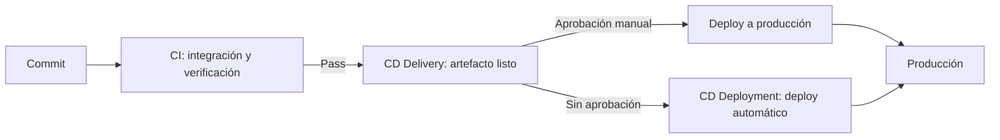
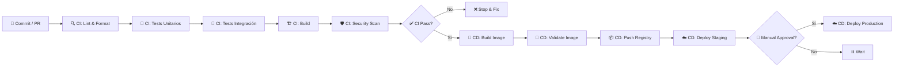
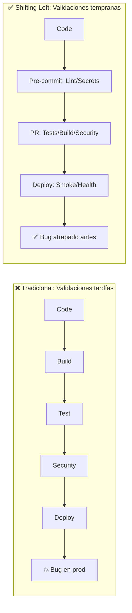
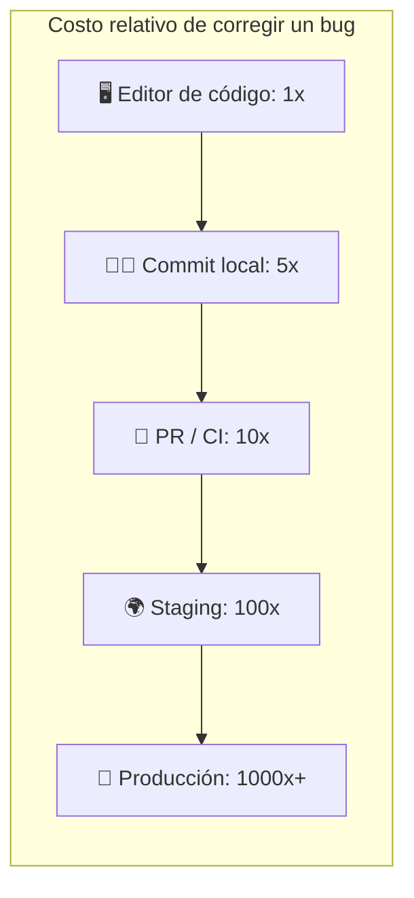
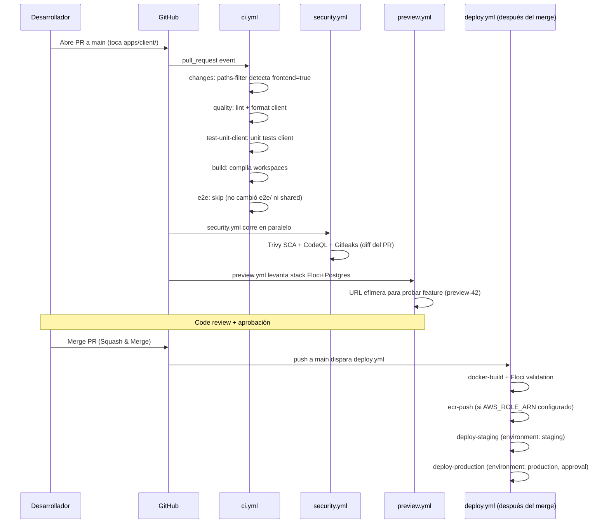

# 00 — Qué es CI/CD: Conceptos, Pipeline y Métricas

> **Guía 1 de 5 del nivel Fundamentos** | Prerequisitos: **Ninguno** | Siguiente: [`01-git-y-yaml.md`](01-git-y-yaml.md)

> ⚠️ **NOTA DE ACTUALIZACIÓN (2026-08-28):** Esta guía menciona `quality.yml` (workflow reutilizable) en varios ejemplos. **Ese workflow YA NO EXISTE** desde la consolidación — sus jobs (lint/format/typecheck) son ahora `if: false` inline dentro de `ci.yml`, y `ci.yml` cambió de 9 jobs a un gate de governance (verify-signatures, commit-lint, pr-title-lint, dco, dependency-review, zombie-workflow-guard + jobs quality/build/test deshabilitados). **El estado real de los workflows está en [`CONTEXT-CICD.md`](./CONTEXT-CICD.md) §3.3** — esta guía es didáctica: los conceptos (CI/CD, pipelines, DORA) siguen vigentes; los ejemplos de archivos concretos pueden estar desactualizados.

---

## 🎯 Objetivos de aprendizaje

Al terminar esta guía, serás capaz de:

- ✅ **Definir CI y CD** con tus propias palabras y dar una analogía cotidiana
- ✅ **Distinguir los tres conceptos** que suelen confundirse: Integración Continua, Entrega Continua y Despliegue Continuo
- ✅ **Explicar por qué nació CI/CD** (el problema que resuelve) y qué significa "continuo"
- ✅ **Enumerar las etapas típicas** de un pipeline CI/CD y su orden lógico
- ✅ **Explicar "shifting left"** y por qué mover validaciones temprano ahorra costos
- ✅ **Identificar las 4 métricas DORA** y qué mide cada una
- ✅ **Reconocer los 8 workflows** del proyecto y su propósito general
- ✅ **Seguir un Pull Request real** a lo largo del pipeline del proyecto

---

## Prerequisitos

**Ninguno.** Esta es la guía de entrada — empezamos desde cero absoluto.

> Solo necesitas saber lo básico de programación (qué es código, un repositorio, un commit) y haber usado Git alguna vez (`git commit`, `git push`). Todo lo demás se explica aquí.

---

## 1. Teoría: ¿Qué es CI/CD? (Desde cero con analogías)

### 1.1 La analogía de la cocina

Imagina que eres **chef en un restaurante**:

| Concepto                      | En la cocina                                                           | En software                                      |
| ----------------------------- | ---------------------------------------------------------------------- | ------------------------------------------------ |
| **Código**                    | Recetas e ingredientes                                                 | Archivos `.js`, `.ts`, `.json`                   |
| **Commit**                    | Anotar un cambio en la receta                                          | `git commit -m "feat: agregar sal"`              |
| **Pull Request**              | Pedir al jefe de cocina que revise tu cambio                           | Abrir PR en GitHub                               |
| **CI (Integración Continua)** | El jefe prueba tu plato _antes_ de servirlo a clientes                 | Lint + tests + build + security scan automáticos |
| **CD (Despliegue Continuo)**  | Si pasa la prueba, el plato va _automáticamente_ a la mesa del cliente | Deploy a staging → production sin pasos manuales |
| **Pipeline**                  | El recorrido: receta → preparación → prueba → mesa                     | La secuencia automatizada de jobs/steps          |

> 💡 **Clave**: CI = **verificar** que el cambio no rompe nada. CD = **entregar** ese cambio verificado a usuarios reales.

---

### 1.2 ¿De dónde viene CI/CD? El problema que resuelve

Para entender CI/CD, primero hay que entender el problema que lo hizo nacer. Antes de que existieran estas prácticas, el desarrollo de software tenía un ciclo doloroso:

```mermaid
flowchart LR
    subgraph Antes [❌ Desarrollo tradicional (años 90-2000)]
        A[Escribes código durante semanas] --> B[Integras todo de golpe al final]
        B --> C[💥 Cientos de conflictos y bugs]
        C --> D[Meses de 'integration hell' arreglando]
        D --> E[Despliegue manual con miedo]
    end

    subgraph Ahora [✅ Con CI/CD]
        F[Cambios pequeños e incrementales] --> G[Se integran y verifican en horas/minutos]
        G --> H[Bugs detectados al instante]
        H --> I[Despliegue automatizado y confiable]
    end
```

El término **"integration hell"** (infierno de integración) describe lo que pasaba cuando varios desarrolladores trabajaban en paralelo durante semanas y, al juntar todo, nada funcionaba. Los conflictos de código eran masivos y arreglarlos tomaba más tiempo que escribirlo.

**La solución**: en lugar de integrar raramente, integrar **continuamente**. Cada cambio pequeño se une al tronco principal y se verifica automáticamente al momento. Si rompe algo, lo sabes en minutos, no en semanas.

> 📖 **Concepto clave**: CI/CD no es una herramienta — es una **práctica** (una forma de trabajar). Las herramientas (GitHub Actions, Jenkins, GitLab CI) solo la hacen posible.

---

### 1.3 Los tres conceptos que se confunden: CI, CD (Delivery) y CD (Deployment)

Es común confundir estos términos porque dos de ellos comparten las siglas **CD**. Vamos a separarlos de una vez:

| Concepto | Nombre completo                               | Qué hace                                                                     | Pregunta que responde                  |
| -------- | --------------------------------------------- | ---------------------------------------------------------------------------- | -------------------------------------- |
| **CI**   | Continuous Integration (Integración Continua) | Verifica cada cambio automáticamente (lint, tests, build, security)          | ¿El cambio rompe algo?                 |
| **CD**   | Continuous Delivery (Entrega Continua)        | Deja el cambio **listo para desplegar** con un clic o aprobación manual      | ¿El cambio está listo para producción? |
| **CD**   | Continuous Deployment (Despliegue Continuo)   | Despliega el cambio a producción **automáticamente** sin intervención humana | ¿El cambio llega solo a producción?    |



**En la práctica, el proyecto hace:**

- **CI completa**: cada PR a `main` dispara `ci.yml` + `security.yml` (tests, build, seguridad)
- **Continuous Delivery**: el deploy a **producción** requiere aprobación manual (environment protection rules)
- **Continuous Deployment**: el deploy a **staging** es automático cuando se hace push a `main`

---

### 1.4 CI vs CD: Tabla comparativa

| Aspecto              | **CI (Integración Continua)**           | **CD (Despliegue Continuo / Entrega Continua)**  |
| -------------------- | --------------------------------------- | ------------------------------------------------ |
| **Qué hace**         | Verifica cada cambio automáticamente    | Publica cambios verificados a entornos           |
| **Cuándo corre**     | En cada Pull Request (y push a main)    | Tras CI exitosa, en push a main o tag            |
| **Objetivo**         | Detectar errores _temprano_             | Reducir fricción entre "listo" y "en producción" |
| **Salida**           | ✅ Pass / ❌ Fail (badge en PR)         | Artefacto desplegado (imagen Docker, URL)        |
| **Riesgo si falla**  | Tiempo de desarrollo perdido            | Incidente en producción (usuarios afectados)     |
| **En este proyecto** | `ci.yml`, `security.yml`, `preview.yml` | `deploy.yml`, `release.yml`                      |

> **Nota**: "Continuous Delivery" = listo para deploy manual. "Continuous Deployment" = deploy automático. Este proyecto hace **Continuous Deployment** a staging y **Delivery** a production (requiere approval manual).

**¿Por qué es importante la diferencia?** Porque define cuánto control humano hay antes de que el código llegue a usuarios reales. Algunas empresas (bancos, salud) necesitan aprobación humana para producción. Otras (SaaS moderno) despliegan decenas de veces al día de forma automática. Ninguna es "la correcta" — depende del riesgo aceptable.

---

### 1.5 Etapas de un pipeline CI/CD (con diagrama)

Un pipeline típico tiene estas **etapas secuenciales**:



**Descripción de cada etapa:**

| Etapa                 | Qué ocurre                         | Herramientas típicas         | En este proyecto                                        |
| --------------------- | ---------------------------------- | ---------------------------- | ------------------------------------------------------- |
| **Source**            | Commit/PR inicia el pipeline       | Git, GitHub                  | Push a rama, PR a `main`                                |
| **Lint/Format**       | Estilo, tipos, formato             | ESLint, Prettier, TypeScript | `ci.yml` (jobs inline `if: false`; antes `quality.yml`) |
| **Unit Tests**        | Funciones aisladas                 | Vitest                       | `ci.yml` → `test-unit-client/server`                    |
| **Integration Tests** | Módulos + DB real                  | Vitest + PostgreSQL service  | `ci.yml` → `test-integration`                           |
| **Build**             | Compilar a artefactos              | Vite, `npm run build`        | `ci.yml` → `build` job                                  |
| **Security**          | SAST, SCA, secrets, SBOM           | CodeQL, Trivy, Gitleaks      | `security.yml` + `scheduled-security.yml`               |
| **Docker Build**      | Imagen multi-stage                 | Docker, BuildKit             | `deploy.yml` → `docker-build`                           |
| **Validate Image**    | Boot contra stack emulado          | Floci + Postgres             | `deploy.yml` → `docker-build` services                  |
| **Push Registry**     | Subir a ECR/GHCR                   | `aws ecr`, OIDC              | `deploy.yml` → `ecr-push`                               |
| **Deploy Staging**    | ECS Fargate staging                | AWS CLI, task def            | `deploy.yml` → `deploy-staging`                         |
| **Deploy Prod**       | ECS Fargate prod + circuit breaker | AWS CLI, approval gate       | `deploy.yml` → `deploy-production`                      |

> 🔗 **Referencia técnica completa**: [`../../cicd-estado-actual.md`](../../cicd-estado-actual.md#4-mapa-del-pipeline--diagrama-mermaid-del-flujo-completo-del-pr-al-deploy) — diagrama Mermaid del flujo completo PR → deploy.

---

### 1.6 Profundizando: qué hace cada etapa (desde el punto de vista del Junior)

#### Source — el origen de todo

Todo pipeline empieza con un **evento**: un push a una rama o un Pull Request abierto. Sin este evento, el pipeline no existe. En GitHub Actions, este evento se configura en la clave `on:` del workflow — lo verás en detalle en la guía 02.

**Pregunta típica**: "¿Por qué el pipeline corre en el PR y no solo en `main`?" — Porque queremos validar el código **antes** de que llegue a la rama principal. Si el pipeline corre solo después del merge, el daño ya está hecho.

#### Lint / Format — la etapa más barata

Verifica que el código siga las reglas de estilo del equipo: formato (Prettier), reglas de calidad (ESLint) y tipos (TypeScript). Es la etapa **más rápida y barata** — no necesita base de datos ni servicios.

```jsonc
// En este proyecto: los jobs de calidad (lint + format de client/server) son inline en ci.yml (if: false)
// Source: package.json (scripts)
"lint": "npm run lint --workspaces --if-present",
"format:check": "npm run format:check --workspaces --if-present"
```

**¿Por qué importa?** Un equipo con formato consistente tiene diffs más legibles, menos conflictos y menos discusiones en code review. El lint automático atrapa errores de principiante (variables sin usar, imports huérfanos) que un humano tardaría minutos en notar.

#### Tests Unitarios — verificar piezas aisladas

Ejecutan funciones o módulos **de forma aislada** (sin red, sin base de datos) para verificar que cada pieza hace lo que debe. En este proyecto usan Vitest y corren para client y server por separado.

**Analogía**: probar cada ingrediente de la receta por separado antes de cocinar. La sal sabe bien, el arroz está en su punto — pero eso no garantiza que el plato final funcione.

#### Tests de Integración — verificar piezas juntas

Ejecutan flujos completos **con servicios reales** (PostgreSQL en un contenedor temporal). Verifican que los módulos hablan bien entre sí y con la base de datos.

**Analogía**: cocinar el plato completo y probarlo. Ya no basta que cada ingrediente esté bien — ahora verificamos la receta entera.

#### Build — producir el artefacto

Compila el código fuente a un artefacto listo para producción (bundle de Vite para el client, código transpilado para el server). Un build roto significa que el código "se ve bien" pero no se puede entregar.

#### Security Scan — la red de seguridad

Escanea dependencias vulnerables (SCA), código con patrones inseguros (SAST), secretos filtrados y genera un SBOM (inventario de componentes). En este proyecto: Trivy, CodeQL, Gitleaks. Lo verás a fondo en el nivel Avanzado.

#### Build Image / Push Registry / Deploy — la parte CD

Construye la imagen Docker, la sube a un registro (ECR) y despliega a staging/producción. La guía 04 profundiza en Docker; el nivel Avanzado en AWS.

---

### 1.7 Shifting Left: Mover validaciones a la izquierda



**Principio**: _Cuanto antes detectes un error, más barato es arreglarlo._

| Momento de detección   | Costo relativo | Ejemplo en este proyecto                                                    |
| ---------------------- | -------------- | --------------------------------------------------------------------------- |
| **Pre-commit (local)** | 1x             | Husky: Semgrep SAST (100+ reglas), Gitleaks staged, lint-staged, commitlint |
| **PR / CI**            | 10x            | `ci.yml` + `security.yml`: tests, build, SAST, SCA, SBOM                    |
| **Staging / Preview**  | 100x           | `preview.yml`: entorno efímero por PR, smoke tests contra Floci             |
| **Producción**         | 1000x+         | Incidentes reales, rollback, MTTR, reputación                               |

> 📖 **Profundización**: [`../../cicd-estado-actual.md`](../../cicd-estado-actual.md#5-stage-1--source--código-pre-commit-local) — Stage 1 completo con hooks pre-commit.

---

### 1.8 La curva de costo del error (por qué "shifting left" paga)

El costo de un bug no crece de forma lineal — crece **exponencialmente** según el momento en que se detecta:



**Un ejemplo concreto** para que lo sientas:

1. **En el editor** (1x): escribes mal el nombre de una variable → el autocompletado/lint lo marca al instante → corriges en 5 segundos.
2. **En CI** (10x): tu código pasa lint pero falla un test → el pipeline te avisa en 5 minutos → corriges, pusheas de nuevo, esperas otros 5 minutos.
3. **En producción** (1000x): un bug de seguridad que nadie detectó → datos expuestos → incidente → on-call a las 3 AM → comunicado a clientes → horas de post-mortem.

**¿Qué hace el proyecto para "shiftear a la izquierda"?**

- **Husky pre-commit**: corre lint-staged + Semgrep + Gitleaks en TU máquina antes del commit (costo 1x)
- **commitlint**: valida el mensaje del commit (Conventional Commits) en tu máquina
- **pre-push**: corre los tests afectados por tus cambios (`vitest --changed`) antes de hacer push
- **CI en cada PR**: tests, build, security scan — antes de que el código toque `main`
- **Preview environments**: cada PR levanta un entorno efímero para que pruebes tu feature en un stack completo

> 💡 **Takeaway**: Cada validación que se mueve "a la izquierda" (más temprano) evita pagar el precio multiplicado de detectarla tarde.

---

### 1.9 Métricas DORA: Los 4 indicadores clave de DevOps

Las **DORA metrics** (DevOps Research and Assessment) son el estándar de la industria para medir rendimiento de entrega de software:

| Métrica                          | Qué mide                                    | Buena (Elite) | Mala       | En este proyecto                             |
| -------------------------------- | ------------------------------------------- | ------------- | ---------- | -------------------------------------------- |
| **Deployment Frequency**         | ¿Con qué frecuencia deployas a producción?  | Múltiples/día | < 1/mes    | ✅ Habilitado vía `deploy.yml` + `main` push |
| **Lead Time for Changes**        | Tiempo desde commit → producción            | < 1 hora      | > 1 mes    | ✅ Pipeline < 15 min CI + ~10 min CD         |
| **Mean Time to Recovery (MTTR)** | Tiempo para recuperarse de un fallo en prod | < 1 hora      | > 1 semana | ✅ Circuit breaker + rollback auto en ECS    |
| **Change Failure Rate**          | % de deployments que causan incidente       | 0-15%         | > 30%      | ✅ Quality gates multi-capa reducen riesgo   |

---

### 1.10 Profundizando en cada métrica DORA

#### Deployment Frequency (Frecuencia de despliegue)

**Qué mide**: cada cuánto despliegas cambios a producción. Se mide por período (diaria, semanal, mensual).

**Por qué importa**: despliegues frecuentes y pequeños son menos riesgosos que despliegues raros y enormes. Si despliegas 1 vez al mes, cada despliegue es un evento de alto riesgo con cambios acumulados de 30 días. Si despliegas 10 veces al día, cada despliegue trae pocos cambios y es fácil de revertir si algo falla.

**El mito**: "desplegar más = más incidentes". La evidencia de DORA dice lo contrario: los equipos que despliegan más tienen **menor** Change Failure Rate, porque sus cambios son más pequeños y sus procesos están más automatizados.

**Cómo medirla en la práctica**:

- Cuenta deployments a producción por día/semana/mes
- Excluye rollbacks y hotfixes (son correcciones, no features nuevas)
- Objetivo: establecer baseline actual y mejorar progresivamente

**Ejemplo de evolución**:

```
Mes 1: 2 deployments/mes  (baseline)
Mes 2: 1 deployment/semana  (mejora: automatizar staging)
Mes 3: 3 deployments/semana (mejora: feature flags + auto-deploy staging)
Mes 6: 1 deployment/día    (elite: CI/CD maduro + cultura de cambios pequeños)
```

#### Lead Time for Changes (Tiempo de entrega)

**Qué mide**: el tiempo desde que un desarrollador hace commit hasta que el cambio está en producción.

**Cómo se reduce**: automatización (CI/CD), despliegues frecuentes, feature flags (desplegar el código apagado y activarlo cuando se quiera).

**En este proyecto**: el CI completo tarda < 15 minutos y el CD ~10 minutos, así que un cambio en `main` puede estar en producción en menos de una hora — asumiendo aprobación manual.

**Desglose típico del lead time en este proyecto**:
| Fase | Tiempo típico | Qué ocurre |
|------|---------------|------------|
| Commit → PR open | 0-30 min | Dev hace push, abre PR |
| PR → CI complete | 10-15 min | ci.yml + security.yml |
| CI → Merge | 15-60 min | Code review + approvals |
| Merge → Deploy staging | 8-10 min | deploy.yml: docker-build + ecr-push + deploy-staging |
| Staging → Production | 5-30 min | Manual approval + deploy-production |
| **Total** | **~40-120 min** | **Objetivo: < 60 min** |

**Cómo reducirlo más**:

- **Feature flags**: desplegar a producción con flag OFF, activar cuando esté listo (elimina approval wait)
- **Auto-merge**: bots que mergen automáticamente cuando CI pasa + approvals
- **Parallel jobs**: ya implementado en `ci.yml` (path filtering + concurrent jobs)

#### Mean Time to Recovery (Tiempo medio de recuperación)

**Qué mide**: cuánto tarda el equipo en volver a un estado operativo normal tras un incidente.

**Por qué importa**: los fallos son inevitables. Lo que separa a los equipos elite no es "no fallan nunca" — es que **se recuperan rápido**. Herramientas: rollback automático, despliegues reversibles, monitoring, runbooks.

**En este proyecto**: `deploy.yml` usa `deploymentCircuitBreaker={enable=true,rollback=true}` — si el despliegue falla el health check, ECS revierte automáticamente a la revisión anterior.

**MTTR real en este pipeline**:
| Escenario | Detección | Recuperación | MTTR estimado |
|-----------|-----------|--------------|---------------|
| Deploy falla health check | Automático (circuit breaker) | Rollback auto ECS | **< 2 min** |
| Bug en staging detectado | Smoke test post-deploy | Re-deploy previo SHA | **~5 min** |
| Bug en producción | Monitoring / alerta | Rollback manual + fix | **~15-30 min** |
| Incidente de seguridad | Security digest / SAST | Revert + patch + re-deploy | **~1-4 horas** |

**Runbook mental para MTTR bajo**:

1. **Detectar**: alertas automáticas (health checks, smoke tests, monitoring)
2. **Diagnosticar**: logs en CloudWatch, GitHub Actions run logs
3. **Recuperar**: rollback a SHA previo (1 click en ECS console o re-run deploy.yml con SHA anterior)
4. **Post-mortem**: documentar en 24h, action items para prevenir recurrencia

#### Change Failure Rate (Tasa de fallos de cambio)

**Qué mide**: porcentaje de despliegues que causan un incidente en producción (rollback, degradación, fix urgente).

**Por qué importa**: una tasa baja indica que el pipeline de calidad (tests, review, staging) está haciendo su trabajo. DORA considera "elite" una tasa de 0-15%.

**En este proyecto**: los quality gates multi-capa (lint → unit → integration → e2e → smoke post-deploy) reducen la probabilidad de que un cambio defectuoso llegue a producción.

**Quality gates que protegen el CFR en este repo**:
| Gate | Qué atrapa | Workflow/Job |
|------|------------|--------------|
| Lint + format | Syntax errors, style drift, unused vars | `ci.yml` (jobs inline `if: false`) |
| TypeScript check | Type errors, breaking API changes | `ci.yml` |
| Unit tests | Logic regressions, edge cases | `ci.yml` test-unit-\* |
| Integration tests | DB schema drift, API contract breaks | `ci.yml` test-integration |
| E2E tests | User journey breaks, UI regressions | `ci.yml` e2e |
| Security scan | Vulnerabilities, secrets, SAST findings | `security.yml` |
| Smoke tests (staging) | Runtime config, env vars, connectivity | `deploy.yml` deploy-staging |
| Smoke tests (prod) | Production config, real traffic paths | `deploy.yml` deploy-production |

**Cálculo práctico**: `CFR = (deployments_with_incidents / total_deployments) × 100`

- Si haces 20 deployments/mes y 2 causan rollback → CFR = 10% ✅ Elite
- Si haces 5 deployments/mes y 2 causan rollback → CFR = 40% ❌ Necesita mejora

> 🎯 **Objetivo del nivel Fundamentos**: Entender qué son. **Profundización en nivel Profesional (guía 22)**: cómo medirlas, dashboards, alertas, y mejora continua.

---

### 1.11 Panorama de herramientas CI/CD (2024-2025)

| Categoría          | Herramientas destacadas                               | Qué usa este proyecto                                         |
| ------------------ | ----------------------------------------------------- | ------------------------------------------------------------- |
| **CI/CD SaaS**     | GitHub Actions, GitLab CI, CircleCI, Buildkite        | **GitHub Actions** (native, gratis para público, 8 workflows) |
| **Self-hosted**    | Jenkins, TeamCity, Drone, Woodpecker                  | No (runners `ubuntu-latest` de GitHub)                        |
| **Contenedores**   | Docker, BuildKit, Kaniko, Podman                      | **Docker multi-stage** (`apps/server/Dockerfile`)             |
| **Orquestación**   | Kubernetes, ECS, Nomad, Docker Swarm                  | **AWS ECS Fargate** (serverless containers)                   |
| **IaC**            | Terraform, Pulumi, Crossplane, AWS CDK                | Parcial (task defs inline en `deploy.yml`)                    |
| **Secrets**        | Vault, AWS Secrets Manager, 1Password, GitHub Secrets | **GitHub Secrets + Environments** + OIDC                      |
| **Observabilidad** | Datadog, Grafana, Honeycomb, New Relic                | Básico (CloudWatch logs, health checks)                       |

> 💡 **Por qué GitHub Actions**: Integrado en GitHub, gratis para repos públicos, 4000 min/mes privados, marketplace enorme de actions, composite actions + reusable workflows para DRY.

---

### 1.12 Madurez CI/CD: Modelo de 5 niveles (referencia)

Para situar dónde está tu equipo/proyecto, usa este modelo simplificado basado en DORA y CMMI:

| Nivel | Nombre          | Características                                                                | Ejemplo en este proyecto                            |
| ----- | --------------- | ------------------------------------------------------------------------------ | --------------------------------------------------- |
| **1** | **Inicial**     | Build manual, tests manuales, deploy manual, sin versionado                    | — (proyecto ya pasó esto)                           |
| **2** | **Repetible**   | CI básico (lint + unit tests), deploy script manual, branches largas           | `ci.yml` temprano (solo quality + unit)             |
| **3** | **Definido**    | CI completo + CD a staging, PR gates, versionado semántico                     | Estado actual: `ci.yml` + `deploy.yml` staging auto |
| **4** | **Gestionado**  | Métricas DORA trackeadas, CD a prod con gates, rollback auto, preview envs     | Estado actual + `preview.yml` + circuit breaker     |
| **5** | **Optimizando** | Feature flags, progressive delivery, chaos engineering, SLSA, auto-remediation | Nivel Profesional (futuro)                          |

**Auto-evaluación rápida**:

- ¿Tienes CI en cada PR? → Nivel 2+
- ¿Deploy a staging es automático? → Nivel 3+
- ¿Mides lead time y deployment frequency? → Nivel 4+
- ¿Usas feature flags + progressive delivery? → Nivel 5

**Este proyecto hoy**: **Nivel 3-4** (CI completo, CD staging auto, prod con approval, preview envs, circuit breaker, DORA entendido pero no dashboard automatizado).

> 🎯 **Meta del aprendizaje**: Entender en qué nivel estás y qué necesitas para subir. Cada guía de este nivel Fundamentos te da una pieza del rompecabezas.

## 2. Implementación en el proyecto: El pipeline real

### 2.1 Inventario de workflows (8 workflows — post-cleanup + consolidación 2026-08-28)

| Workflow               | Archivo                  | Tipo            | Propósito                                                                                                                                        | Trigger principal                     |
| ---------------------- | ------------------------ | --------------- | ------------------------------------------------------------------------------------------------------------------------------------------------ | ------------------------------------- |
| **CI**                 | `ci.yml`                 | CI principal    | Gate governance: verify-signatures, commit-lint, pr-title-lint, dco, dependency-review, zombie-workflow-guard (+ quality/build/test `if: false`) | `pull_request` a `main`               |
| **Security**           | `security.yml`           | Security        | Trivy SCA + CodeQL SAST + Gitleaks diff + SBOM                                                                                                   | `pull_request` + `push` main          |
| **Scheduled Security** | `scheduled-security.yml` | Security cron   | Gitleaks full-history + OSV Scanner (semanal)                                                                                                    | `schedule` (cron)                     |
| **Security Digest**    | `security-digest.yml`    | Security digest | Comentario automático en PR si hallazgos críticos                                                                                                | `workflow_dispatch` + schedule        |
| **Preview**            | `preview.yml`            | CD Preview      | Levanta stack Floci+Postgres+Docker por PR                                                                                                       | `pull_request` (opened/synchronize)   |
| **Deploy**             | `deploy.yml`             | CD Principal    | 2 fases: docker-build (Floci) → ECR OIDC → ECS staging/prod                                                                                      | `push` a `main` + `workflow_dispatch` |
| **Release**            | `release.yml`            | Release         | Changesets: version bump + npm publish + tags                                                                                                    | `push` a `main`                       |
| **CI Enterprise**      | `ci-enterprise.yml`      | CI Extended     | Pipeline extendido para validaciones enterprise                                                                                                  | `workflow_dispatch`                   |

> ⚠️ **Nota (2026-08-28):** `quality.yml` fue **eliminado** en la consolidación — sus jobs de calidad ahora son `if: false` inline en `ci.yml`. Por eso el inventario pasó de 9 a 8 workflows. Versiones viejas de esta tabla (y del curso) mencionan 9; el estado verificado está en `CONTEXT-CICD.md` §3.3.

> 📋 **Inventario técnico detallado**: [`../../workflows-mantenimiento-guia.md#4-inventario-de-workflows-y-composite-actions`](../../workflows-mantenimiento-guia.md#4-inventario-de-workflows-y-composite-actions) — tabla completa con jobs, triggers, permissions, y composite actions.

---

### 2.2 Cómo leer la tabla de inventario (mini-guía)

Cada fila es un **workflow** — un archivo `.yml` en `.github/workflows/`. Algunas claves para entenderlos:

- **Trigger principal**: el evento que lo dispara. `pull_request` = corre en cada PR; `push` = corre al pushear a una rama; `schedule` = corre por tiempo (cron); `workflow_dispatch` = solo manual; `workflow_call` = lo invoca otro workflow.
- **CI vs CD**: los de tipo CI validan (no cambian el entorno); los de tipo CD despliegan (cambian el entorno real).
- **Reusable**: el patrón de reusable workflow sigue vigente (ver `security.yml` con trigger `workflow_call`); `quality.yml` fue eliminado en la consolidación 2026-08-28.

> 💡 **No memorices la tabla**: úsala como referencia. Cuando necesites saber qué hace un workflow, la consultas. La guía 02 te enseña a leer cualquier workflow por ti mismo.

---

### 2.3 Snippet mínimo: Estructura de `ci.yml` (líneas 1-41)

```yaml
# Source: ../../../.github/workflows/ci.yml (líneas 1-41)
name: 'CI'

permissions:
  contents: read

on:
  pull_request:
    branches:
      - main

concurrency:
  group: pr-${{ github.event.pull_request.number }}
  cancel-in-progress: true

jobs:
  changes:
    name: Detect Changes
    runs-on: ubuntu-latest
    outputs:
      frontend: ${{ steps.filter.outputs.client }}
      backend: ${{ steps.filter.outputs.server }}
      e2e: ${{ steps.filter.outputs.e2e }}
      shared: ${{ steps.filter.outputs.shared }}
    steps:
      - uses: actions/checkout@v5
      - uses: dorny/paths-filter@v4
        id: filter
        with:
          filters: |
            client:
              - 'apps/client/**'
            server:
              - 'apps/server/**'
```

> 🔑 **Puntos clave** (se explican en guías 02-03):
>
> - `permissions: contents: read` — mínimo privilegio (guía 03)
> - `concurrency` con `cancel-in-progress: true` — cancela runs previos del mismo PR
> - `jobs.changes` usa `dorny/paths-filter` para **path filtering** (solo jobs necesarios)
> - `outputs` pasa datos a jobs downstream (`needs: changes`)

---

### 2.4 Conexión con el plan de implementación

El pipeline actual **implementa** el plan de 8 semanas de [`../../cicd-plan-implementacion.md`](../../cicd-plan-implementacion.md):

| Sprint del plan | Qué entregó                     | Workflow(s) resultantes                                         |
| --------------- | ------------------------------- | --------------------------------------------------------------- |
| 1-2             | CI base + tests + quality gates | `ci.yml`                                                        |
| 3               | Security multi-capa             | `security.yml`, `scheduled-security.yml`, `security-digest.yml` |
| 4               | Preview environments            | `preview.yml`                                                   |
| 5-6             | CD: Docker + Floci + ECS        | `deploy.yml`                                                    |
| 7               | Release automatizado            | `release.yml`                                                   |
| 8               | Hardening + enterprise          | `ci-enterprise.yml`                                             |

> 📖 **Ver plan completo**: [`../../cicd-plan-implementacion.md`](../../cicd-plan-implementacion.md#10-plan-de-implementación-por-sprints)

---

### 2.5 Ejercicio guiado: sigue un Pull Request por el pipeline

Vamos a recorrer el pipeline con un caso concreto. Imagina que un desarrollador del equipo hace un cambio en `apps/client/` y abre un PR a `main`. Esto es lo que ocurre:



---

## 3. Errores comunes al aprender CI/CD

| Error común                                         | Qué pasa                                     | Cómo evitarlo                                                                                                      |
| --------------------------------------------------- | -------------------------------------------- | ------------------------------------------------------------------------------------------------------------------ |
| **Confundir CI con CD**                             | Crees que CI ya despliega                    | Recuerda: CI = verifica, CD = entrega/despliega                                                                    |
| **Pensar que "continuo" = "inmediato sin control"** | Miedo a que CD rompa producción              | CD Delivery = listo para deploy manual; CD Deployment = auto. El proyecto usa approval en prod.                    |
| **Saltarse tests locales**                          | "Total CI los corre"                         | Feedback en 10s (local) vs 5 min (CI). Los hooks pre-commit/pre-push existen para eso.                             |
| **Meter secretos en variables (`vars`)**            | Fuga de credenciales en logs                 | **Nunca**. Secrets van en `secrets` (masked). Vars = config no sensible.                                           |
| **No leer el workflow real**                        | Copias snippets sin entender                 | Abre `.github/workflows/ci.yml` y sigue la guía 02 línea por línea.                                                |
| **Creer que multi-stage = obligatorio**             | Forzas multi-stage donde no hace falta       | El `apps/server/Dockerfile` real es single-stage + `npm prune --omit=dev`. Multi-stage es concepto, no dogma.      |
| **Ignorar `permissions:`**                          | Token `GITHUB_TOKEN` con permisos excesivos  | Siempre `contents: read` por defecto; añade solo lo que el job necesite (`checks: write`, `id-token: write`, etc.) |
| **No usar `concurrency`**                           | Múltiples runs del mismo PR consumen minutos | `cancel-in-progress: true` en PRs; grupos separados por entorno en CD                                              |
| **Hardcodear versiones de Node**                    | Drift entre local y CI                       | Usa `.nvmrc` + `node-version-file: '.nvmrc'` en todos los workflows                                                |
| **Copiar workflows sin entender**                   | Cargo cult CI/CD                             | Cada línea del workflow debe tener un "por qué" que puedas explicar                                                |

---

## 4. Ejercicios prácticos

### Ejercicio 1: Identifica CI vs CD en tu día a día

**Objetivo**: Distinguir verificación de entrega.

1. Piensa en tu flujo actual: ¿qué pasos son automáticos y **validan**? (lint, tests) → CI
2. ¿Qué pasos **publican** o **despliegan**? (deploy a server, publish npm) → CD
3. Escribe 3 ejemplos de cada uno en tu cuaderno.

**Ejemplos de CI**: ESLint en save, tests unitarios en pre-push, typecheck en CI, security scan en PR.
**Ejemplos de CD**: Deploy a Vercel/Netlify en merge, publish a npm registry, update k8s manifest, terraform apply.

### Ejercicio 2: Calcula el costo de un bug detectado tarde

**Objetivo**: Interiorizar shifting left.

| Escenario         | Momento detectado | Tiempo para arreglar       | Costo estimado |
| ----------------- | ----------------- | -------------------------- | -------------- |
| Typo en variable  | Editor (1x)       | 30 seg                     | ~$0.50         |
| Test falla en CI  | PR (10x)          | 20 min                     | ~$20           |
| Bug en staging    | Staging (100x)    | 3 horas                    | ~$300          |
| Bug en producción | Prod (1000x)      | 2 días + incident response | ~$5000+        |

**Reflexiona**: ¿Cuántos bugs "baratos" de editor equivalen a 1 bug en producción?

**Respuesta**: ~10,000 bugs de editor = 1 bug en producción (1000x factor). Por eso invertir en tooling local (lint, typecheck, pre-commit) tiene ROI masivo.

### Ejercicio 3: Explora los workflows reales

**Objetivo**: Conectar teoría con código real.

1. Abre `.github/workflows/ci.yml`
2. Identifica: `name`, `on`, `permissions`, `concurrency`, `jobs`
3. Busca el job `changes` y sus `outputs`
4. Busca `needs: changes` en los jobs downstream
5. Anota: ¿qué jobs se saltarían si solo tocas `apps/client/`?

**Respuesta esperada**: `test-unit-server`, `test-integration`, `test-smoke`, `e2e` se saltarían (solo `frontend == 'true'` → `quality` client, `test-unit-client`, `build` corren).

### Ejercicio 4: DORA self-assessment

**Objetivo**: Medir dónde estás hoy.

Responde honestamente para tu equipo/proyecto actual:

- ¿Con qué frecuencia despliegan a producción? (Diario/Semanal/Mensual/Trimestral)
- ¿Tiempo commit → prod? (<1h / <1d / <1sem / >1mes)
- ¿Tiempo para recuperar de incidente? (<1h / <1d / <1sem / >1mes)
- ¿% deploys que causan incidente? (0-15% / 16-30% / 31-50% / >50%)

Compara con la tabla DORA "Buena (Elite)". ¿Dónde están las brechas?

### Ejercicio 5: Path filtering mental

**Objetivo**: Entender el routing dinámico de `ci.yml`.

Dado este diff de PR:

```
M apps/client/src/components/Button.tsx
M apps/client/src/utils/format.ts
M apps/server/src/modules/users/service.js
```

¿Qué outputs de `changes` job serían `"true"`?

**Respuesta**: `frontend=true`, `backend=true`, `shared=false`, `e2e=false`

¿Qué jobs corren y cuáles se saltan?

**Respuesta**: Corren: `quality` (client+server), `test-unit-client`, `test-unit-server`, `test-integration`, `test-smoke`, `build`. Se saltan: `e2e`.

### Ejercicio 6: Shifting left en tu proyecto

**Objetivo**: Identificar oportunidades de mover validaciones a la izquierda.

Lista 3 validaciones que hoy ocurren "tarde" (staging/prod) y podrías mover a "temprano" (editor/pre-commit/CI):

1. **\*\***\*\*\*\***\*\***\_**\*\***\*\*\*\***\*\*** (ej: validación de schema de API)
2. **\*\***\*\*\*\***\*\***\_**\*\***\*\*\*\***\*\*** (ej: check de dependencias vulnerables)
3. **\*\***\*\*\*\***\*\***\_**\*\***\*\*\*\***\*\*** (ej: test de contrato de base de datos)

Para cada una: ¿qué tool/hook la ejecutaría antes? ¿Cuánto tiempo ahorrarías estimado?

---

## 5. Preguntas frecuentes (FAQ)

### ¿CI/CD es solo para equipos grandes?

**No.** Un desarrollador solo también se beneficia: commits pequeños, tests automáticos, deploy sin pasos manuales. Las herramientas escalan hacia abajo (GitHub Actions gratis para 1 persona).

### ¿Necesito Kubernetes para hacer CD?

**No.** Este proyecto usa **AWS ECS Fargate** (serverless containers). También puedes usar: Vercel, Netlify, Railway, Fly.io, Docker Compose en VPS, GitHub Pages. CD = "entregar automáticamente", no "usar Kubernetes".

### ¿Qué pasa si mi pipeline falla a menudo?

**Señal de alarma**. Un pipeline que falla >20% de las veces por causas ajenas al código (flaky tests, timeouts, red) entrena al equipo a ignorar las alertas. **Arregla la flakiness primero** — es deuda técnica del pipeline.

### ¿Puedo tener CI sin CD?

**Sí.** Muchos equipos empiezan con CI (tests, lint, build automáticos) y añaden CD después. El valor de CI es inmediato; CD requiere infraestructura (entornos, secrets, approvals).

### ¿Shifting left significa "más trabajo para devs"?

**Significa trabajo DIFERENTE**. En lugar de arreglar bugs en producción a las 3 AM (estresante, reactivo), los detectas en tu editor o en CI (controlado, proactivo). El esfuerzo total **baja** drásticamente.

### ¿Las métricas DORA son para managers o para devs?

**Para todo el equipo**. Los devs las usan para argumentar mejoras ("nuestro lead time es 3 días, queremos <1 día → necesitamos feature flags"). Los managers las usan para tracking. Ambos ganan visibilidad.

### ¿Por qué el proyecto usa 8 workflows separados en lugar de 1 monolítico?

**Separación de responsabilidades y reutilización**:

- `ci.yml` = CI principal (gate governance del PR)
- `security.yml` = security pipeline — corre en PR + push + reusable
- `deploy.yml` = CD pipeline — solo en push/main + dispatch
- `preview.yml` = preview environments — solo PRs
- `release.yml` = versionado + publish — solo push/main
- `scheduled-security.yml` = cron semanal — full history scans
- `security-digest.yml` = reporting — digests automáticos
- `ci-enterprise.yml` = pipeline extendido — manual/on-demand

**Beneficios**: aislamiento de fallos, reutilización (DRY), permisos mínimos por workflow, concurrencia independiente, debugging más fácil.

### ¿Qué es un "reusable workflow"?

Un **reusable workflow** se invoca via `uses: ./.github/workflows/<name>.yml` desde otro workflow (`workflow_call` trigger). En este proyecto el ejemplo canónico era `quality.yml` (eliminado 2026-08-28); el patrón sigue vigente en `security.yml` (trigger `workflow_call`). Evita duplicar configuración entre múltiples workflows.

### ¿Cuál es la diferencia entre `pull_request` y `push` triggers en `ci.yml` vs `deploy.yml`?

- `ci.yml`: **solo `pull_request`** → valida ANTES del merge. No corre en `push` a main para evitar doble ejecución (el merge ya pasó CI en el PR).
- `deploy.yml`: **`push` a main + `workflow_dispatch`** → CD corre DESPUÉS del merge (o manual). El deploy a producción requiere que el código ya esté en `main`.

### ¿Por qué `concurrency` con `cancel-in-progress: true` en PRs pero `false` en CD?

- **PRs (CI)**: un nuevo push al mismo PR invalida el run anterior → ahorra minutos, el feedback relevante es el último commit.
- **CD (deploy)**: no cancelar deploys en curso. Un deploy a staging/prod en progreso no debe ser interrumpido por un nuevo push — podría dejar el entorno en estado inconsistente. `cancel-in-progress: false` protege la integridad del despliegue.

### ¿Qué pasa si `vars.AWS_ROLE_ARN` no está configurado?

El workflow `deploy.yml` tiene **jobs "skipped" paralelos** (`ecr-push-skipped`, `deploy-staging-skipped`, `deploy-production-skipped`) que corren con `if: ${{ vars.AWS_ROLE_ARN == '' }}` y reportan un notice visible en la UI de Actions explicando qué falta. Esto evita "silent failures" y da feedback accionable.

---

## 6. Glosario del nivel Fundamentos (términos base)

| Término                  | Definición corta                                                            |
| ------------------------ | --------------------------------------------------------------------------- |
| **CI**                   | Integración Continua: verificar cada cambio automáticamente                 |
| **CD (Delivery)**        | Entrega Continua: dejar el cambio listo para deploy manual                  |
| **CD (Deployment)**      | Despliegue Continuo: desplegar automáticamente a producción                 |
| **Pipeline**             | Secuencia de etapas automatizadas (build → test → deploy)                   |
| **Workflow**             | Archivo `.yml` en `.github/workflows/` que define una automatización        |
| **Job**                  | Unidad de ejecución con su propio runner                                    |
| **Step**                 | Paso atómico dentro de un job (action o comando)                            |
| **Trigger**              | Evento que inicia un workflow (push, PR, cron, manual)                      |
| **Runner**               | Máquina que ejecuta los jobs                                                |
| **Secret**               | Credencial cifrada (nunca visible en logs)                                  |
| **Variable**             | Configuración no sensible (visible en logs)                                 |
| **Environment**          | Entorno con secrets aislados y protection rules (staging/production)        |
| **Shifting Left**        | Mover validaciones (tests, security, lint) más temprano en el ciclo         |
| **DORA**                 | DevOps Research and Assessment — 4 métricas estándar de delivery            |
| **Integration Hell**     | Conflictos masivos al integrar código raramente                             |
| **Path Filtering**       | Solo ejecutar jobs relevantes según archivos modificados en el PR           |
| **Reusable Workflow**    | Workflow invocado por otro via `uses:` (trigger `workflow_call`)            |
| **Composite Action**     | Action construida con steps de workflow (reutiliza lógica, no Docker)       |
| **OIDC**                 | OpenID Connect — autenticación sin secrets estáticos (AWS/GCP/Azure)        |
| **Circuit Breaker**      | Patrón: si deploy falla health check, rollback automático a versión previa  |
| **Preview Environment**  | Entorno efímero levantado por PR para testing manual/automático             |
| **Quality Gate**         | Checkpoint obligatorio que debe pasar para continuar el pipeline            |
| **Artifact**             | Archivo(s) producido por build (bundle, imagen Docker, SBOM, reportes)      |
| **SBOM**                 | Software Bill of Materials — inventario de dependencias (CycloneDX/SPDX)    |
| **SAST**                 | Static Application Security Testing — análisis estático de código           |
| **SCA**                  | Software Composition Analysis — escaneo de vulnerabilidades en dependencias |
| **Floci**                | Emulador local de AWS (LocalStack fork) para testing de integración cloud   |
| **Changesets**           | Tool para versionado semántico automático + changelog + npm publish         |
| **Conventional Commits** | Especificación de mensajes de commit estructurados (`tipo(scope): desc`)    |

---

## 7. Resumen: Lo que has aprendido

| Concepto                          | Idea clave                                                                                                         |
| --------------------------------- | ------------------------------------------------------------------------------------------------------------------ |
| **CI vs CD**                      | CI = verifica (¿rompe?), CD = entrega/despliega (¿llega a usuarios?)                                               |
| **Entrega vs Despliegue**         | Delivery = listo + aprobación; Deployment = automático sin intervención                                            |
| **Pipeline stages**               | Source → Lint → Unit Tests → Integration → Build → Security → Image → Registry → Staging → (Approval) → Production |
| **Shifting Left**                 | Detectar temprano = 1x costo; detectar tarde = 1000x+ costo                                                        |
| **DORA metrics**                  | Frequency, Lead Time, MTTR, Change Failure Rate — estándar de la industria                                         |
| **8 workflows del proyecto**      | ci, security, scheduled-security, security-digest, preview, deploy, release, ci-enterprise                         |
| **Path filtering**                | `dorny/paths-filter` → outputs → `needs.changes.outputs.*` → `if:` condicionales                                   |
| **Reusable workflows**            | Patrón `workflow_call` (ej: `security.yml`); `quality.yml` eliminado 2026-08-28                                    |
| **Concurrency groups**            | PRs: cancel-in-progress=true; CD: cancel-in-progress=false (protege integridad)                                    |
| **Permissions mínimo privilegio** | `contents: read` por defecto; `checks: write`/`id-token: write` solo donde se necesitan                            |
| **Gating con vars**               | `if: ${{ vars.AWS_ROLE_ARN != '' }}` — CD solo corre si infra existe                                               |
| **Environment protection**        | `environment: staging/production` — secrets aislados + approval rules                                              |

---

## 8. Checklist de completitud de la Guía 00

Antes de pasar a la siguiente guía, verifica que puedes:

- [ ] Explicar la diferencia entre CI, CD Delivery y CD Deployment con una analogía
- [ ] Dibujar (mental o en papel) las etapas de un pipeline típico en orden
- [ ] Explicar "shifting left" y dar 3 ejemplos del proyecto (pre-commit, PR CI, preview)
- [ ] Nombrar las 4 métricas DORA y decir qué mide cada una
- [ ] Identificar los 8 workflows del proyecto y el trigger principal de cada uno
- [ ] Explicar qué hace `dorny/paths-filter` y cómo `needs.changes.outputs` rutea jobs
- [ ] Diferenciar `pull_request` vs `push` triggers y por qué `ci.yml` usa solo PR
- [ ] Explicar por qué `concurrency` tiene `cancel-in-progress: true` en CI pero `false` en CD

Si tienes dudas en algún punto, relee la sección correspondiente. La guía 01 asume estos conceptos claros.

---

## 9. Siguiente guía

▶️ **[`01-git-y-yaml.md`](01-git-y-yaml.md)** — Flujo de ramas Git profesional, Pull Requests, **Conventional Commits** (el proyecto usa Husky + commitlint), y **YAML desde cero** (escalares, listas, mapas, multilínea, anclas) — todo conectado a la configuración real del repo.

> 💡 **Por qué este orden**: Antes de leer workflows (YAML), necesitas entender Git (ramas, PRs, commits) y YAML (la sintaxis). La guía 00 te dio el "qué" y "por qué" de CI/CD; la 01 te da las herramientas base (Git + YAML) para la guía 02 (Actions).

---

## 🔙 Guía Anterior

> **Esta es la primera guía del nivel.** No hay guía anterior.

## 🏠 Volver al Índice

> **[fundamentos-README.md](./fundamentos-README.md)** — Roadmap completo del nivel Fundamentos y navegación a niveles Intermedio/Avanzado/Profesional.

---

_Parte del cambio OpenSpec `learning-cicd-fundamentos` — Nivel Fundamentos, Guía 00 de 5_
