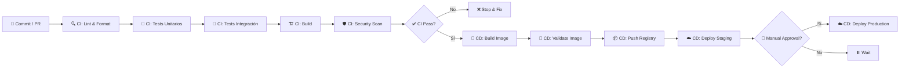
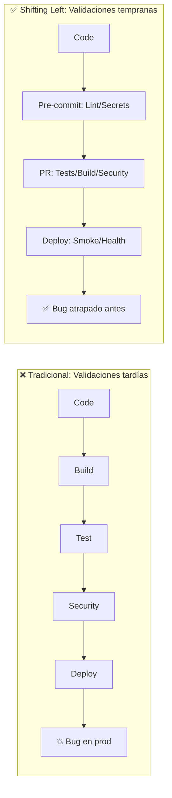

# 00 — Qué es CI/CD: Conceptos, Pipeline y Métricas

> **Guía 1 de 5 del nivel Fundamentos** | Prerequisitos: **Ninguno** | Siguiente: [`01-git-y-yaml.md`](01-git-y-yaml.md)

---

## 🎯 Objetivos de aprendizaje

Al terminar esta guía, serás capaz de:

- ✅ **Definir CI y CD** con tus propias palabras y dar una analogía cotidiana
- ✅ **Enumerar las etapas típicas** de un pipeline CI/CD y su orden lógico
- ✅ **Explicar "shifting left"** y por qué mover validaciones temprano ahorra costos
- ✅ **Identificar las 4 métricas DORA** y qué mide cada una
- ✅ **Reconocer los 9 workflows** del proyecto y su propósito general

---

## Prerequisitos

**Ninguno.** Esta es la guía de entrada — empezamos desde cero absoluto.

---

## 1. Teoría: ¿Qué es CI/CD? (Desde cero con analogías)

### 1.1 La analogía de la cocina

Imagina que eres **chef en un restaurante**:

| Concepto                      | En la cocina                                                           | En software                                      |
| ----------------------------- | ---------------------------------------------------------------------- | ------------------------------------------------ |
| **Código**                    | Recetas e ingredientes                                                 | Archivos `.js`, `.ts`, `.json`                   |
| **Commit**                    | Anotar un cambio en la receta                                          | `git commit -m "feat: agregar sal"`              |
| **Pull Request**              | Pedir al jefe de cocina que revise tu cambio                           | Abrir PR en GitHub                               |
| **CI (Integración Continua)** | El jefe prueba tu plato _antes_ de servirlo a clientes                 | Lint + tests + build + security scan automáticos |
| **CD (Despliegue Continuo)**  | Si pasa la prueba, el plato va _automáticamente_ a la mesa del cliente | Deploy a staging → production sin pasos manuales |
| **Pipeline**                  | El recorrido: receta → preparación → prueba → mesa                     | La secuencia automatizada de jobs/steps          |

> 💡 **Clave**: CI = **verificar** que el cambio no rompe nada. CD = **entregar** ese cambio verificado a usuarios reales.

---

### 1.2 CI vs CD: Tabla comparativa

| Aspecto              | **CI (Integración Continua)**                          | **CD (Despliegue Continuo / Entrega Continua)**  |
| -------------------- | ------------------------------------------------------ | ------------------------------------------------ |
| **Qué hace**         | Verifica cada cambio automáticamente                   | Publica cambios verificados a entornos           |
| **Cuándo corre**     | En cada Pull Request (y push a main)                   | Tras CI exitosa, en push a main o tag            |
| **Objetivo**         | Detectar errores _temprano_                            | Reducir fricción entre "listo" y "en producción" |
| **Salida**           | ✅ Pass / ❌ Fail (badge en PR)                        | Artefacto desplegado (imagen Docker, URL)        |
| **Riesgo si falla**  | Tiempo de desarrollo perdido                           | Incidente en producción (usuarios afectados)     |
| **En este proyecto** | `ci.yml`, `quality.yml`, `security.yml`, `preview.yml` | `deploy.yml`, `release.yml`                      |

> **Nota**: "Continuous Delivery" = listo para deploy manual. "Continuous Deployment" = deploy automático. Este proyecto hace **Continuous Deployment** a staging y **Delivery** a production (requiere approval manual).

---

### 1.3 Etapas de un pipeline CI/CD (con diagrama)

Un pipeline típico tiene estas **etapas secuenciales**:



**Descripción de cada etapa:**

| Etapa                 | Qué ocurre                         | Herramientas típicas         | En este proyecto                          |
| --------------------- | ---------------------------------- | ---------------------------- | ----------------------------------------- |
| **Source**            | Commit/PR inicia el pipeline       | Git, GitHub                  | Push a rama, PR a `main`                  |
| **Lint/Format**       | Estilo, tipos, formato             | ESLint, Prettier, TypeScript | `quality.yml` (reusable)                  |
| **Unit Tests**        | Funciones aisladas                 | Vitest                       | `ci.yml` → `test-unit-client/server`      |
| **Integration Tests** | Módulos + DB real                  | Vitest + PostgreSQL service  | `ci.yml` → `test-integration`             |
| **Build**             | Compilar a artefactos              | Vite, `npm run build`        | `ci.yml` → `build` job                    |
| **Security**          | SAST, SCA, secrets, SBOM           | CodeQL, Trivy, Gitleaks      | `security.yml` + `scheduled-security.yml` |
| **Docker Build**      | Imagen multi-stage                 | Docker, BuildKit             | `deploy.yml` → `docker-build`             |
| **Validate Image**    | Boot contra stack emulado          | Floci + Postgres             | `deploy.yml` → `docker-build` services    |
| **Push Registry**     | Subir a ECR/GHCR                   | `aws ecr`, OIDC              | `deploy.yml` → `ecr-push`                 |
| **Deploy Staging**    | ECS Fargate staging                | AWS CLI, task def            | `deploy.yml` → `deploy-staging`           |
| **Deploy Prod**       | ECS Fargate prod + circuit breaker | AWS CLI, approval gate       | `deploy.yml` → `deploy-production`        |

> 🔗 **Referencia técnica completa**: [`../../cicd-estado-actual.md`](../../cicd-estado-actual.md#4-mapa-del-pipeline--diagrama-mermaid-del-flujo-completo-del-pr-al-deploy) — diagrama Mermaid del flujo completo PR → deploy.

---

### 1.4 Shifting Left: Mover validaciones a la izquierda



**Principio**: _Cuanto antes detectes un error, más barato es arreglarlo._

| Momento de detección   | Costo relativo | Ejemplo en este proyecto                                                    |
| ---------------------- | -------------- | --------------------------------------------------------------------------- |
| **Pre-commit (local)** | 1x             | Husky: Semgrep SAST (100+ reglas), Gitleaks staged, lint-staged, commitlint |
| **PR / CI**            | 10x            | `ci.yml` + `quality.yml` + `security.yml`: tests, build, SAST, SCA, SBOM    |
| **Staging / Preview**  | 100x           | `preview.yml`: entorno efímero por PR, smoke tests contra Floci             |
| **Producción**         | 1000x+         | Incidentes reales, rollback, MTTR, reputación                               |

> 📖 **Profundización**: [`../../cicd-estado-actual.md`](../../cicd-estado-actual.md#5-stage-1--source--código-pre-commit-local) — Stage 1 completo con hooks pre-commit.

---

### 1.5 Métricas DORA: Los 4 indicadores clave de DevOps

Las **DORA metrics** (DevOps Research and Assessment) son el estándar de la industria para medir rendimiento de entrega de software:

| Métrica                          | Qué mide                                    | Buena (Elite) | Mala       | En este proyecto                             |
| -------------------------------- | ------------------------------------------- | ------------- | ---------- | -------------------------------------------- |
| **Deployment Frequency**         | ¿Con qué frecuencia deployas a producción?  | Múltiples/día | < 1/mes    | ✅ Habilitado vía `deploy.yml` + `main` push |
| **Lead Time for Changes**        | Tiempo desde commit → producción            | < 1 hora      | > 1 mes    | ✅ Pipeline < 15 min CI + ~10 min CD         |
| **Mean Time to Recovery (MTTR)** | Tiempo para recuperarse de un fallo en prod | < 1 hora      | > 1 semana | ✅ Circuit breaker + rollback auto en ECS    |
| **Change Failure Rate**          | % de deployments que causan incidente       | 0-15%         | > 30%      | ✅ Quality gates multi-capa reducen riesgo   |

> 🎯 **Objetivo del nivel Fundamentos**: Entender qué son. **Profundización en nivel Profesional (guía 22)**: cómo medirlas, dashboards, alertas, y mejora continua.

---

### 1.6 Panorama de herramientas CI/CD (2024-2025)

| Categoría          | Herramientas destacadas                               | Qué usa este proyecto                                         |
| ------------------ | ----------------------------------------------------- | ------------------------------------------------------------- |
| **CI/CD SaaS**     | GitHub Actions, GitLab CI, CircleCI, Buildkite        | **GitHub Actions** (native, gratis para público, 9 workflows) |
| **Self-hosted**    | Jenkins, TeamCity, Drone, Woodpecker                  | No (runners `ubuntu-latest` de GitHub)                        |
| **Contenedores**   | Docker, BuildKit, Kaniko, Podman                      | **Docker multi-stage** (`apps/server/Dockerfile`)             |
| **Orquestación**   | Kubernetes, ECS, Nomad, Docker Swarm                  | **AWS ECS Fargate** (serverless containers)                   |
| **IaC**            | Terraform, Pulumi, Crossplane, AWS CDK                | Parcial (task defs inline en `deploy.yml`)                    |
| **Secrets**        | Vault, AWS Secrets Manager, 1Password, GitHub Secrets | **GitHub Secrets + Environments** + OIDC                      |
| **Observabilidad** | Datadog, Grafana, Honeycomb, New Relic                | Básico (CloudWatch logs, health checks)                       |

> 💡 **Por qué GitHub Actions**: Integrado en GitHub, gratis para repos públicos, 4000 min/mes privados, marketplace enorme de actions, composite actions + reusable workflows para DRY.

---

## 2. Implementación en el proyecto: El pipeline real

### 2.1 Inventario de workflows (9 workflows, no 12 — post-cleanup agosto 2026)

| Workflow               | Archivo                  | Tipo            | Propósito                                                   | Trigger principal                     |
| ---------------------- | ------------------------ | --------------- | ----------------------------------------------------------- | ------------------------------------- |
| **CI**                 | `ci.yml`                 | CI principal    | Path filtering → quality → tests → build → e2e              | `pull_request` a `main`               |
| **Quality**            | `quality.yml`            | Reusable        | Lint + format + typecheck (client/server)                   | `workflow_call` desde `ci.yml`        |
| **Security**           | `security.yml`           | Security        | Trivy SCA + CodeQL SAST + Gitleaks diff + SBOM              | `pull_request` + `push` main          |
| **Scheduled Security** | `scheduled-security.yml` | Security cron   | Gitleaks full-history + OSV Scanner (semanal)               | `schedule` (cron)                     |
| **Security Digest**    | `security-digest.yml`    | Security digest | Comentario automático en PR si hallazgos críticos           | `workflow_dispatch` + schedule        |
| **Preview**            | `preview.yml`            | CD Preview      | Levanta stack Floci+Postgres+Docker por PR                  | `pull_request` (opened/synchronize)   |
| **Deploy**             | `deploy.yml`             | CD Principal    | 2 fases: docker-build (Floci) → ECR OIDC → ECS staging/prod | `push` a `main` + `workflow_dispatch` |
| **Release**            | `release.yml`            | Release         | Changesets: version bump + npm publish + tags               | `push` a `main`                       |
| **CI Enterprise**      | `ci-enterprise.yml`      | CI Extended     | Pipeline extendido para validaciones enterprise             | `workflow_dispatch`                   |

> 📋 **Inventario técnico detallado**: [`../../workflows-mantenimiento-guia.md#4-inventario-de-workflows-y-composite-actions`](../../workflows-mantenimiento-guia.md#4-inventario-de-workflows-y-composite-actions) — tabla completa con jobs, triggers, permissions, y composite actions.

---

### 2.2 Snippet mínimo: Estructura de `ci.yml` (primeras 30 líneas)

```yaml
# Source: ../../../.github/workflows/ci.yml
name: 'CI'

permissions:
  contents: read

on:
  pull_request:
    branches:
      - main

concurrency:
  group: pr-${{ github.event.pull_request.number }}
  cancel-in-progress: true

jobs:
  changes:
    name: Detect Changes
    runs-on: ubuntu-latest
    outputs:
      frontend: ${{ steps.filter.outputs.client }}
      backend: ${{ steps.filter.outputs.server }}
      e2e: ${{ steps.filter.outputs.e2e }}
      shared: ${{ steps.filter.outputs.shared }}
    steps:
      - uses: actions/checkout@v5
      - uses: dorny/paths-filter@v4
        id: filter
        with:
          filters: |
            client:
              - 'apps/client/**'
            server:
              - 'apps/server/**'
```

> 🔑 **Puntos clave** (se explican en guías 02-03):
>
> - `permissions: contents: read` — mínimo privilegio (guía 03)
> - `concurrency` con `cancel-in-progress: true` — cancela runs previos del mismo PR
> - `jobs.changes` usa `dorny/paths-filter` para **path filtering** (solo jobs necesarios)
> - `outputs` pasa datos a jobs downstream (`needs: changes`)

---

### 2.3 Conexión con el plan de implementación

El pipeline actual **implementa** el plan de 8 semanas de [`../../cicd-plan-implementacion.md`](../../cicd-plan-implementacion.md):

| Sprint del plan | Qué entregó                     | Workflow(s) resultantes                                         |
| --------------- | ------------------------------- | --------------------------------------------------------------- |
| 1-2             | CI base + tests + quality gates | `ci.yml`, `quality.yml`                                         |
| 3               | Security multi-capa             | `security.yml`, `scheduled-security.yml`, `security-digest.yml` |
| 4               | Preview environments            | `preview.yml`                                                   |
| 5-6             | CD: Docker + Floci + ECS        | `deploy.yml`                                                    |
| 7               | Release automatizado            | `release.yml`                                                   |
| 8               | Hardening + enterprise          | `ci-enterprise.yml`                                             |

> 📖 **Ver plan completo**: [`../../cicd-plan-implementacion.md`](../../cicd-plan-implementacion.md#10-plan-de-implementación-por-sprints)

---

## 3. Resumen

| Concepto            | Definición rápida                                                            |
| ------------------- | ---------------------------------------------------------------------------- |
| **CI**              | Verificación automática de cada cambio (lint, test, build, security)         |
| **CD**              | Publicación automática de cambios verificados a entornos reales              |
| **Pipeline**        | Secuencia ordenada de etapas: Source → Build → Test → Deploy                 |
| **Shifting Left**   | Mover validaciones lo más temprano posible (pre-commit → PR → cron)          |
| **DORA 4 métricas** | Deployment Frequency, Lead Time, MTTR, Change Failure Rate                   |
| **Este proyecto**   | 9 workflows en `.github/workflows/`, CI completa, CD 2-fases, Preview por PR |

---

## 4. Siguiente guía

▶️ ** [`01-git-y-yaml.md`](01-git-y-yaml.md) ** — Aprenderás flujo de ramas Git, Pull Requests, Conventional Commits (con Husky + commitlint real del proyecto) y **sintaxis YAML desde cero** (escalares, listas, mapas, multilínea, anclas).

> 💡 **Por qué este orden**: Necesitas Git + YAML _antes_ de entender workflows de GitHub Actions (guía 02), porque los workflows **están escritos en YAML** y se disparan por eventos Git (push, PR).

---

_Guía 00 de 5 — Nivel Fundamentos — Cambio OpenSpec `learning-cicd-fundamentos`_
