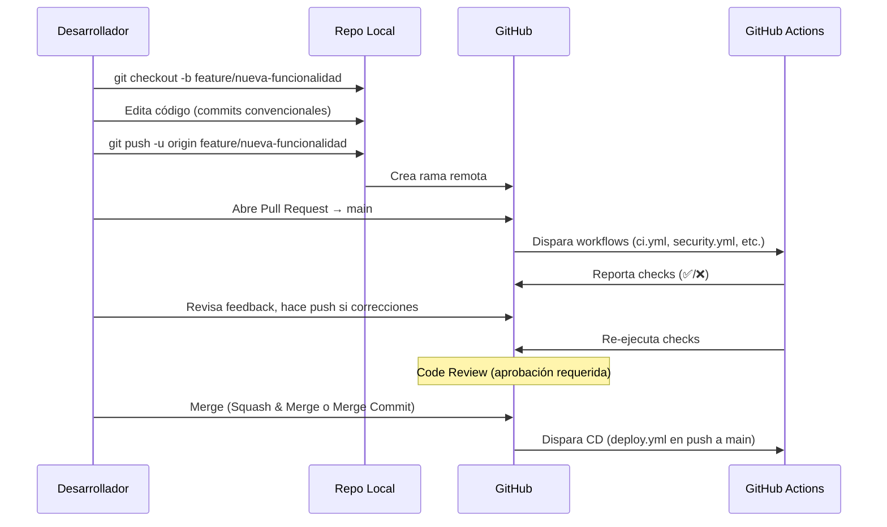

# Git y YAML — Flujo de Ramas, Commits Convencionales y Sintaxis YAML desde Cero

> **Guía 01 de 5** — Nivel Fundamentos | **Prerrequisitos:** [00-que-es-cicd.md](./00-que-es-cicd.md) completado | **Siguiente:** [02-github-actions-base.md](./02-github-actions-base.md)

---

## 🎯 Objetivos de Aprendizaje

Al terminar esta guía, serás capaz de:

- [ ] **Explicar** el flujo de ramas Git profesional: `main`, `feature/*`, Pull Requests, merge strategies
- [ ] **Escribir** mensajes de commit siguiendo **Conventional Commits** (`tipo(scope): descripción`)
- [ ] **Entender** por qué el proyecto usa **Husky + commitlint** para forzar commits convencionales
- [ ] **Leer y escribir YAML** válido: escalares, listas, mapas, estructuras anidadas
- [ ] **Dominar** YAML avanzado básico: bloques multilínea (`|` y `>`), anclas y alias (`&` y `*`)
- [ ] **Conectar** YAML con GitHub Actions: leer un workflow real comentado línea por línea
- [ ] **Aplicar** estrategias de merge (merge commit, squash, rebase) y entender cuándo usar cada una
- [ ] **Identificar y evitar** gotchas comunes de YAML que rompen workflows

---

## 📋 Prerequisitos

1. ✅ **Guía 00 completada** — Entiendes qué es CI/CD, pipeline stages, shifting left, DORA
2. ✅ **Git básico** — Sabes `clone`, `add`, `commit`, `push`, `pull`, `checkout`, `branch`
3. ✅ **Editor de código** — VS Code recomendado (resalta YAML, valida sintaxis)

> **Si no completaste la guía 00:** Vuelve a [00-que-es-cicd.md](./00-que-es-cicd.md) — los conceptos de pipeline y CI/CD se dan por sentados aquí.

---

## 🌳 Teoría: Flujo de Ramas Git y Pull Requests

### La Rama `main` es Sagrada

> **Regla de oro:** `main` **siempre** debe estar deployable. Nunca commits directos a `main`.

```
main ──────────────────────────────────────────────► (producción)
  │
  ├─► feature/login ──► PR #42 ──► merge ──► main
  │
  ├─► feature/api-v2 ──► PR #43 ──► merge ──► main
  │
  └─► fix/typo-readme ──► PR #44 ──► merge ──► main
```

### Estrategia: Trunk-Based Development (TBD) Ligero

El proyecto usa **TBD simplificado**:

| Rama        | Propósito                           | Vida útil          | Merge a       |
| ----------- | ----------------------------------- | ------------------ | ------------- |
| `main`      | Código listo para producción        | Permanente         | —             |
| `feature/*` | Una feature/chore/fix completa      | Corta (horas-días) | `main` via PR |
| `fix/*`     | Bugfix urgente                      | Muy corta          | `main` via PR |
| `release/*` | Preparación de versión (Changesets) | Días               | `main` via PR |

> **No usamos:** `develop`, `staging`, `hotfix/*` long-lived, GitFlow completo. **Por qué:** Complejidad innecesaria para equipo pequeño; TBD + feature flags + preview environments cubre las necesidades.

### Ciclo de Vida de un Pull Request



**Checks obligatorios en este repo (branch protection):**

- ✅ `ci.yml` — todos los jobs verdes
- ✅ `security.yml` — sin hallazgos críticos
- ✅ `quality.yml` — lint + format pasan
- ✅ Aprobación de al menos 1 reviewer

---

### 3.1 Repaso Git Básico: Comandos Esenciales para el Flujo Diario

Aunque ya conoces lo básico, estos son los comandos exactos que usarás día a día en este proyecto:

#### Crear y cambiar de rama

```bash
# Desde main actualizado
git checkout main
git pull origin main

# Nueva feature branch (convención: feature/<descripcion-corta>)
git checkout -b feature/agregar-login-jwt

# O fix urgente
git checkout -b fix/corregir-typo-readme
```

#### Hacer commits (¡siempre convencionales!)

```bash
# Ver qué cambió
git status
git diff

# Stagear cambios (preferible: stage selectivo, no todo)
git add apps/server/src/modules/auth/login.ts
git add apps/client/src/components/LoginForm.tsx

# Commit SIN -m para abrir editor y escribir mensaje completo
git commit
# Se abre editor → escribe mensaje convencional + cuerpo opcional + footer
```

#### Push y Pull Request

```bash
# Primer push de la rama (establece upstream)
git push -u origin feature/agregar-login-jwt

# Pushes subsiguientes
git push

# Abrir PR en GitHub (o usa: gh pr create)
gh pr create --title "feat(auth): agregar login con JWT" --body "Implementa login..."
```

#### Sincronizar con main (importante antes de merge)

```bash
# Opción A: Merge (recomendado para features largas)
git fetch origin
git merge origin/main

# Opción B: Rebase (historial lineal, para features cortas)
git fetch origin
git rebase origin/main
# Si hay conflictos: resuelve → git add . → git rebase --continue
```

#### Limpiar ramas merged

```bash
# Local
git branch -d feature/agregar-login-jwt

# Remota (tras merge en GitHub)
git push origin --delete feature/agregar-login-jwt
```

---

### 3.2 Estrategias de Merge: Merge Commit vs Squash vs Rebase

Cada estrategia tiene trade-offs. El proyecto permite **Squash & Merge** y **Merge Commit** (configurado en branch protection).

| Estrategia         | Cómo se ve en historial                                                | Cuándo usar                                                 | Pros                                                   | Contras                                                                   |
| ------------------ | ---------------------------------------------------------------------- | ----------------------------------------------------------- | ------------------------------------------------------ | ------------------------------------------------------------------------- | ------------ | ------------------------------------------------- | ----------------------------------------------- | ------------------------------------- |
| **Merge Commit**   | `* Merge pull request #42`<br>`                                        | \ feature/login`<br>`                                       | \* commit 3`<br>`                                      | \* commit 2`<br>`                                                         | \* commit 1` | Features complejas, historial completo importante | Preserva todo el historial "sucio" (fixup, wip) | Historial ruidoso, bisect más difícil |
| **Squash & Merge** | `* feat(auth): agregar login con JWT (#42)`<br>`* ...main anterior`    | **Default del proyecto** — features completas, PRs limpios  | Historial limpio, 1 commit = 1 feature, bisect trivial | Pierde granularidad de commits intermedios                                |
| **Rebase + Merge** | `* feat(auth): agregar login con JWT`<br>`* ...main anterior` (lineal) | Features muy cortas, 1-2 commits, historial lineal estricto | Historial perfectamente lineal                         | Reescribe historial (dangerous si rama compartida), pierde contexto de PR |

#### Deep Dive: ¿Qué ocurre internamente?

**Merge Commit (no fast-forward):**

```bash
# Git crea un NUEVO commit con dos parents:
# Parent 1: HEAD de main (antes del merge)
# Parent 2: HEAD de feature branch
git merge --no-ff feature/mi-feature
# Resultado: commit "Merge pull request #42 from user/feature"
```

**Squash & Merge:**

```bash
# Git NO crea merge commit. En su lugar:
# 1. Toma TODOS los commits de la feature branch
# 2. Los "aplana" en UN solo commit nuevo
# 3. Ese commit nuevo tiene 1 solo parent: HEAD de main
# 4. El mensaje = título del PR (o lo que escribas en UI)
# La feature branch original queda "huérfana" (se borra al mergear en GitHub)
```

**Rebase + Merge:**

```bash
# 1. Git toma commits de feature y los reaplica SOBRE main actual
#    (reescribe SHA de cada commit de la feature)
# 2. Luego hace fast-forward de main al nuevo HEAD
# 3. NO hay merge commit, NO hay squash — commits individuales preservados pero con NUEVOS SHA
git checkout feature/mi-feature
git rebase main
git checkout main
git merge feature/mi-feature  # fast-forward
```

#### ¿Qué usa este proyecto?

**Squash & Merge por defecto** (configurado en GitHub branch protection). Razones:

1. **Historial legible**: `main` muestra 1 commit por feature/PR
2. **Bisect funciona**: `git bisect` salta directo al commit que introdujo el bug
3. **Changelog automático**: Changesets lee commits en `main` → 1 entrada por feature
4. **Code review enfocado**: El reviewer ve el diff completo del PR, no commits intermedios "wip"

> 💡 **Tip**: Si tu PR tiene muchos commits "wip" (work in progress), no te preocupes — Squash & Merge los colapsa en 1 solo commit convencional al mergear.

#### Cuándo NO usar Squash & Merge

| Situación                                             | Qué hacer en su lugar                                                  |
| ----------------------------------------------------- | ---------------------------------------------------------------------- |
| **Fix urgente en producción** (hotfix)                | Merge Commit — preserva contexto exacto del fix                        |
| **Feature muy grande, múltiples devs**                | Merge Commit — historial granular útil para debugging                  |
| **Rama de release (`release/*`)**                     | Merge Commit — Changesets necesita commits individuales para versionar |
| **Investigando bug: necesitas `git bisect` granular** | Merge Commit o Rebase — commits atómicos ayudan a aislar regresión     |

---

## 📝 Conventional Commits: Estándar de Mensajes

### Formato Canónico

```
<tipo>(<scope>): <descripción corta>

[cuerpo opcional]

[footer(s) opcional(es)]
```

### Tipos Principales (de `@commitlint/config-conventional`)

| Tipo       | Cuándo usarlo                                 | Ejemplo                                            |
| ---------- | --------------------------------------------- | -------------------------------------------------- |
| `feat`     | Nueva funcionalidad para el usuario           | `feat(auth): agregar login con JWT`                |
| `fix`      | Corrección de bug                             | `fix(api): manejar error 404 en /users/:id`        |
| `docs`     | Solo documentación                            | `docs(readme): actualizar instrucciones install`   |
| `chore`    | Mantenimiento, tooling, deps (no user-facing) | `chore(deps): actualizar vitest a v2`              |
| `refactor` | Cambio interno sin cambiar comportamiento     | `refactor(utils): extraer sanitizePrismaMessage`   |
| `test`     | Añadir o modificar tests                      | `test(events): agregar integration test para RSVP` |
| `perf`     | Mejora de performance                         | `perf(db): añadir índice compuesto en events`      |
| `ci`       | Cambios en CI/CD (workflows, actions)         | `ci: agregar job e2e a ci.yml`                     |
| `build`    | Sistema de build, dependencias de prod        | `build: actualizar node a 20 en Dockerfile`        |
| `style`    | Formato, punto y coma, sin cambio lógico      | `style: prettier --write apps/server`              |
| `revert`   | Revierte commit previo                        | `revert: feat(auth): agregar login con JWT`        |

### Reglas de Oro

1. **Imperativo, presente:** "agregar" no "agregado" / "agrega"
2. **Minúscula inicial:** `feat(auth): agregar login` ✅ — `Feat(auth): Agregar login` ❌
3. **Sin punto final:** `fix: corregir typo` ✅ — `fix: corregir typo.` ❌
4. **Scope opcional pero recomendado:** `feat: agregar login` ✅ — `feat(auth): agregar login` ✅✅
5. **Límite 72 chars** en primera línea (recomendación git)

### Breaking Changes

Dos formas equivalentes:

```bash
# Opción 1: Exclamación en tipo
feat(api)!: cambiar respuesta de /users a array paginado

# Opción 2: Footer BREAKING CHANGE
feat(api): cambiar respuesta de /users a array paginado

BREAKING CHANGE: La respuesta ya no es array directo, ahora { data: [], meta: {} }
```

> **Por qué importa:** Conventional Commits **habilita automatización**: changelog automático, versionado semántico (Changesets), releases automáticos, filtrado de commits por tipo.

---

## 🔧 Husky + commitlint: El Guardián Local del Proyecto

El proyecto **fuerza** Conventional Commits en **cada commit local** via Husky hooks.

### Arquitectura de Hooks

```
.git/hooks/
├── pre-commit      → lint-staged + Semgrep + Gitleaks (archivos staged)
├── commit-msg      → commitlint (valida mensaje del commit)
└── pre-push        → vitest --changed (tests solo archivos modificados vs origin/main)
```

### commitlint.config.js (Configuración Real)

```javascript
// Source: ../../../commitlint.config.js
const config = {
  extends: ['@commitlint/config-conventional'],
};

export default config;
```

**Qué hace:** Extiende la config estándar de Conventional Commits. Valida:

- Tipo válido (feat, fix, docs, chore, refactor, test, perf, ci, build, style, revert)
- Scope opcional entre paréntesis
- Dos puntos + espacio obligatorios
- Descripción no vacía
- Breaking change válido (`!` o footer)

### .husky/commit-msg (Hook Real)

```bash
# Source: ../../../.husky/commit-msg
commitlint --edit $1
```

**Flujo:** Al hacer `git commit`, Git ejecuta este script. `commitlint` lee el archivo de mensaje temporal (`$1`), valida contra config, **falla si no pasa** → commit bloqueado.

### Ejemplos de Commits Válidos/Inválidos

| Mensaje                                | ¿Pasa? | Por qué                                  |
| -------------------------------------- | ------ | ---------------------------------------- |
| `feat(auth): agregar login JWT`        | ✅     | Tipo válido, scope, descripción          |
| `fix: corregir typo en README`         | ✅     | Tipo válido, sin scope (ok), descripción |
| `chore(deps): actualizar dependencias` | ✅     | Tipo válido, scope, descripción          |
| `feat! : breaking change en API`       | ✅     | `!` breaking, espacio opcional           |
| `agregar login`                        | ❌     | Falta tipo                               |
| `feat(auth) agregar login`             | ❌     | Falta `:`                                |
| `feat(auth):`                          | ❌     | Descripción vacía                        |
| `invalid-type(auth): hacer algo`       | ❌     | Tipo no reconocido                       |

> **Tip:** Usa `git commit` sin `-m` para que se abra tu editor y puedas escribir mensaje multilínea con cuerpo y footer.

---

## 📄 YAML desde Cero: Sintaxis Completa

> **YAML** (YAML Ain't Markup Language) = serialización de datos legible por humanos. **Todo workflow de GitHub Actions es YAML.**

### 1. Escalares (Valores Simples)

```yaml
# Strings (comillas opcionales salvo caracteres especiales)
nombre: "Project One"
version: '1.0.0'
descripcion: Proyecto monorepo con CI/CD maduro
multilinea_simple: Esto es una línea
  que continúa indentada (se une con espacio)

# Números
node_version: 20
timeout_minutes: 15
porcentaje: 0.95

# Booleanos
ci_enabled: true
debug_mode: false

# Null
optional_config: ~
# o
optional_config: null
```

> **Regla:** Strings con `:`, `{`, `}`, `[`, `]`, `,`, `&`, `*`, `#`, `?`, `|`, `>`, `-`, `<`, `>`, `=`, `!`, `%`, `@`, `` ` `` **requieren comillas**.

### 2. Listas (Arrays/Sequences)

```yaml
# Estilo bloque (recomendado para legibilidad)
trigger_branches:
  - main
  - develop
  - 'release/*'

# Estilo inline (compacto)
permissions: [contents: read, checks: write]

# Lista de objetos (común en jobs.steps)
steps:
  - name: Checkout
    uses: actions/checkout@v5
  - name: Setup Node
    uses: actions/setup-node@v5
    with:
      node-version-file: '.nvmrc'
```

### 3. Mapas (Objetos/Dictionaries)

```yaml
# Clave: valor (indentación 2 espacios = estándar)
job_config:
  runs-on: ubuntu-latest
  timeout-minutes: 10
  permissions:
    contents: read
    checks: write
```

### 4. Estructuras Anidadas (La Base de Workflows)

```yaml
# jobs es un mapa donde cada clave es job_id
jobs:
  build: # job_id = "build"
    name: Build Project # nombre legible
    runs-on: ubuntu-latest # runner
    steps: # lista de steps
      - name: Checkout
        uses: actions/checkout@v5
      - name: Build
        run: npm run build

  test: # job_id = "test"
    needs: build # depende de build
    runs-on: ubuntu-latest
    steps:
      - uses: actions/checkout@v5
      - run: npm test
```

### 5. Comentarios

```yaml
# Comentario de línea completa
name: 'CI' # Comentario inline (después de valor)


# NO hay comentarios de bloque /* ... */ en YAML
```

### 6. Strings Multilínea (Clave para Scripts Shell)

```yaml
# Literal (|) — preserva saltos de línea EXACTOS
script_literal: |
  echo "Paso 1"
  echo "Paso 2"
  npm run build
  # Saltos de línea se mantienen tal cual

# Plegado (>) — une líneas con espacio, preserva párrafos vacíos
script_plegado: >
  Este es un texto largo que se escribe
  en múltiples líneas pero YAML lo une
  en una sola línea con espacios.

  Este párrafo separado SÍ se mantiene.
```

**Cuál usar en GitHub Actions:**

- `run:` con **scripts shell** → usa **`|` (literal)** para preservar líneas
- `run:` con **comando único largo** → usa **`>` (plegado)** si prefieres escribirlo en varias líneas

### 7. Anclas y Alias (`&` y `*`) — Reutilización

```yaml
# Definir ancla (&) en un mapa base
defaults: &defaults
  runs-on: ubuntu-latest
  timeout-minutes: 10
  permissions:
    contents: read

# Referenciar alias (*) en jobs
jobs:
  build:
    <<: *defaults # Merge del mapa anclado
    name: Build
    steps:
      - run: npm run build

  test:
    <<: *defaults
    name: Test
    needs: build
    steps:
      - run: npm test
```

> **En Project One:** No usamos anclas extensivamente en workflows (preferimos `defaults:` en workflow root y composite actions), pero **entenderlas es esencial** para leer workflows complejos de la industria.

### 8. Separador de Documentos (`---`)

```yaml
# Primer documento
name: 'Workflow A'
on: push

---
# Segundo documento (raro en GitHub Actions, común en Kubernetes)
name: 'Workflow B'
on: pull_request
```

> **GitHub Actions:** Un archivo `.yml` = **un solo workflow**. No uses `---` múltiples.

---

### 9. Gotchas YAML: Trampas que Rompen Workflows

| Gotcha                          | Qué pasa                     | Ejemplo malo                                   | Ejemplo bueno                                  |
| ------------------------------- | ---------------------------- | ---------------------------------------------- | ---------------------------------------------- | ----- | ----------------- |
| **Tabs en vez de espacios**     | Error de sintaxis            | `key:\tvalue` (tab)                            | `key: value` (2 espacios)                      |
| **String sin comillas con `:`** | YAML lo parsea como mapa     | `cmd: npm run build:prod`                      | `cmd: "npm run build:prod"`                    |
| **Booleanos implícitos**        | `yes`/`no`/`on`/`off` = bool | `enabled: yes`                                 | `enabled: true` o `"yes"`                      |
| **Indentación inconsistente**   | Estructura rota              | 2 espacios, luego 4                            | **Siempre 2 espacios**                         |
| \*\*`                           | `vs`>` en scripts\*\*        | `>` une líneas → script roto                   | `run: >\n  npm run build`                      | `run: | \n npm run build` |
| **Anclas fuera de scope**       | `*alias` no resuelto         | `jobs:\n  build: *defaults` (antes de definir) | Definir `defaults: &defaults` ANTES de `jobs:` |
| **Claves duplicadas**           | Última gana silenciosamente  | `name: A\nname: B`                             | Una sola `name:` por mapa                      |

---

## 🔗 YAML + GitHub Actions: Workflow Real Comentado

Vamos a diseccionar las **líneas 1-41 de `ci.yml`** (el workflow principal) conectando cada clave YAML con su propósito.

```yaml
# Source: ../../../.github/workflows/ci.yml (líneas 1-41)
name: 'CI' # String: nombre en UI GitHub Actions

permissions: # Mapa: permisos por defecto para TODOS los jobs
  contents: read #   contents: read = solo lectura repo (mínimo privilegio)

on: # Mapa: triggers (cuándo corre)
  pull_request: #   Evento: pull_request
    branches: #     Filtro: solo branches
      - main #       Solo PRs hacia main

concurrency: # Mapa: control de ejecuciones concurrentes
  group: pr-${{ github.event.pull_request.number }} #   Expresión: grupo único por PR number
  cancel-in-progress: true #   Boolean: cancela run anterior del mismo grupo

jobs: # Mapa: definición de jobs (clave = job_id)
  changes: #   job_id = "changes"
    name: Detect Changes #     String: nombre legible
    runs-on: ubuntu-latest #     String: runner GitHub-hosted
    outputs: #     Mapa: outputs que otros jobs pueden leer
      frontend: ${{ steps.filter.outputs.client }} #   Expresión: output de step "filter"
      backend: ${{ steps.filter.outputs.server }}
      e2e: ${{ steps.filter.outputs.e2e }}
      shared: ${{ steps.filter.outputs.shared }}
    timeout-minutes: 5 #     Number: timeout del job
    steps: #     Lista: pasos del job
      - uses: actions/checkout@v5 #       Step: usa action checkout v5
      - uses: dorny/paths-filter@v4 #       Step: usa action paths-filter v4
        id: filter #         String: ID del step (para referenciar outputs)
        with: #         Mapa: inputs de la action
          filters: | #           String multilínea (literal |)
            client:                           #             Mapa anidado: filtro "client"
              - 'apps/client/**'              #               Lista: patrones glob
            server:                           #             Mapa anidado: filtro "server"
              - 'apps/server/**'
            e2e:
              - 'e2e/**'
            shared:
              - 'package.json'
              - 'package-lock.json'
              - '.github/workflows/**'
```

### Mapeo YAML → Conceptos GitHub Actions

| Estructura YAML          | Concepto GitHub Actions                                                 |
| ------------------------ | ----------------------------------------------------------------------- |
| `name:` (root)           | Nombre del workflow                                                     |
| `on:`                    | Triggers (eventos que disparan)                                         |
| `jobs:`                  | Mapa de jobs (clave = `job_id`)                                         |
| `jobs.<job_id>.runs-on:` | Runner (dónde corre)                                                    |
| `jobs.<job_id>.steps:`   | Lista de steps (acciones + comandos)                                    |
| `jobs.<job_id>.needs:`   | Dependencias entre jobs                                                 |
| `jobs.<job_id>.if:`      | Condicional para saltar job                                             |
| `jobs.<job_id>.outputs:` | Outputs que propagan a jobs dependientes                                |
| `steps[i].uses:`         | Action a ejecutar (`owner/repo@version` o path local)                   |
| `steps[i].with:`         | Inputs para la action                                                   |
| `steps[i].run:`          | Comando shell a ejecutar                                                |
| `steps[i].id:`           | ID para referenciar outputs (`${{ steps.<id>.outputs.<name> }}`)        |
| `${{ ... }}`             | **Expresión** — se evalúa en runtime (contextos, funciones, operadores) |

---

## 📝 Resumen: Lo Que Has Aprendido

| Tema                     | Concepto Clave                                                                                      |
| ------------------------ | --------------------------------------------------------------------------------------------------- | ----------------------------------------------------- |
| **Ramas Git**            | `main` siempre deployable; `feature/*` cortas; PR obligatorio para merge                            |
| **Pull Request**         | Gatilla CI, requiere reviews, checks obligatorios (ci.yml, security.yml, quality.yml)               |
| **Conventional Commits** | `tipo(scope): descripción` — habilita changelog, versionado semántico, releases auto                |
| **Husky + commitlint**   | Hook `commit-msg` valida **cada commit local** — config en `commitlint.config.js`                   |
| **YAML Escalares**       | Strings, números, booleanos, null — comillas para caracteres especiales                             |
| **YAML Listas**          | `- item` (bloque) o `[a, b]` (inline)                                                               |
| **YAML Mapas**           | `clave: valor` con indentación 2 espacios                                                           |
| **YAML Multilínea**      | `                                                                                                   | `literal (preserva \n),`>` plegado (une con espacios) |
| **YAML Anclas**          | `&nombre` define, `*nombre` referencia, `<<: *nombre` merge                                         |
| **Workflow YAML**        | `name`, `on`, `permissions`, `concurrency`, `jobs` con `runs-on`, `steps`, `needs`, `if`, `outputs` |
| **Merge Strategies**     | Squash & Merge (default), Merge Commit (hotfix/release), Rebase (features cortas, lineal)           |
| **Git Hooks**            | pre-commit (lint+security), commit-msg (conventional), pre-push (tests changed)                     |

---

## 📋 Checklist de Completitud: Guía 01

Antes de pasar a la siguiente guía, verifica que puedes:

- [ ] Crear rama feature, hacer commits convencionales, push, abrir PR
- [ ] Sincronizar tu rama con `main` via merge o rebase (y resolver conflictos)
- [ ] Explicar por qué el proyecto usa Squash & Merge por defecto
- [ ] Escribir 5 commits convencionales válidos de memoria (feat, fix, chore, refactor, breaking)
- [ ] Identificar qué hace cada hook Husky y por qué fallan (lint, commitlint, tests)
- [ ] Leer un YAML y señalar: escalares, listas, mapas, anidados, multilínea, anclas
- [ ] Escribir YAML válido para un job simple de GitHub Actions (runs-on, steps, needs)
- [ ] Detectar y corregir 3 gotchas YAML comunes (tabs, comillas, booleanos, indentación)

Si tienes dudas en algún punto, relee la sección correspondiente. La guía 02 asume fluidez con Git + YAML.

---

## 🧪 Ejercicios Prácticos con Soluciones

### Ejercicio 1: Escribe commits convencionales

**Escenario:** Haces estos cambios. Escribe el commit message correcto.

| Cambio                                       | Tu commit message                                      |
| -------------------------------------------- | ------------------------------------------------------ |
| Agregas endpoint `/api/users` en server      | `feat(api): agregar endpoint GET /api/users`           |
| Corregis typo en variable `SECRET_KEY`       | `fix(config): corregir typo en SECRET_KEY`             |
| Actualizas `vitest` de v1 a v2               | `chore(deps): actualizar vitest a v2`                  |
| Refactorizas `utils/date.ts` sin cambiar API | `refactor(utils): extraer parseDate a módulo separado` |
| Rompes API: `/users` ahora retorna paginado  | `feat(api)!: cambiar /users a respuesta paginada`      |

### Ejercicio 2: Resuelve conflictos de rebase

**Situación:** Haces `git rebase origin/main` y hay conflicto en `apps/server/package.json`.

```bash
# 1. Ver conflictos
git status
# both modified: apps/server/package.json

# 2. Abre archivo, busca marcadores <<<<<<< ======= >>>>>>>
# 3. Resuelve manualmente (mantén ambas deps si son compatibles)
# 4. Stagea resuelto
git add apps/server/package.json

# 5. Continúa rebase
git rebase --continue

# 6. Si más conflictos: repite 2-5
# 7. Al terminar: force push (solo TU rama!)
git push --force-with-lease origin feature/mi-rama
```

### Ejercicio 3: Identifica errores YAML

**Cada snippet tiene 1 error. Encuéntralo:**

```yaml
# A) Error:
run: npm run build:prod
# Fix: comillas → run: "npm run build:prod"

# B) Error:
permissions:
  contents: read
  checks: write
  contents: read  # duplicada
# Fix: quitar duplicada

# C) Error:
script: >
  echo "linea 1"
  echo "linea 2"
# Fix: usar | para preservar saltos de línea

# D) Error:
jobs:
  build:
    <<: *defaults
defaults: &defaults
  runs-on: ubuntu-latest
# Fix: definir &defaults ANTES de jobs:
```

### Ejercicio 4: Convierte a YAML válido

**Convierte este JSON a YAML:**

```json
{
  "jobs": {
    "test": {
      "runs-on": "ubuntu-latest",
      "steps": [
        { "uses": "actions/checkout@v5" },
        { "name": "Test", "run": "npm test" }
      ]
    }
  }
}
```

**Solución:**

```yaml
jobs:
  test:
    runs-on: ubuntu-latest
    steps:
      - uses: actions/checkout@v5
      - name: Test
        run: npm test
```

---

## ❓ Preguntas Frecuentes (FAQ)

### ¿Por qué no usar `git commit -m "mensaje"`?

**Puedes**, pero limita a 1 línea. Para commits con cuerpo/footer (breaking changes, referencias a issues), usa `git commit` sin `-m` → se abre editor.

### ¿Qué pasa si hago commit inválido y commitlint lo rechaza?

**El commit se bloquea**. No se crea. Corregis el mensaje en el editor y guardas. Si ya cerraste editor: `git commit --amend` para reabrir.

### ¿Puedo hacer rebase de una rama que ya empujé (push)?

**Solo si nadie más trabaja en ella.** Rebase reescribe historial → `git push --force-with-lease` necesario. Si es rama compartida: **merge**, no rebase.

### ¿Por qué el proyecto usa `feature/*` y no `feat/*`?

**Convención del equipo.** `feature/` es más descriptivo. Lo importante: **consistencia**. El branch protection no fuerza prefijo, pero el equipo acordó `feature/*`, `fix/*`, `release/*`.

### ¿Qué es `fetch-depth: 0` y por qué lo veo en workflows?

**Clona historial completo** (no shallow). Necesario para: `changesets`, `dorny/test-reporter`, `git log` en steps. Ver guía 02 y [`../../workflows-mantenimiento-guia.md#6-mantenimiento-de-actionscheckout-y-fetch-depth`](../../workflows-mantenimiento-guia.md#6-mantenimiento-de-actionscheckout-y-fetch-depth).

### ¿Los anclas YAML (`&`/`*`) funcionan en GitHub Actions?

**Sí**, YAML las soporta nativamente. Pero el proyecto prefiere `defaults:` en root del workflow + composite actions para DRY. Las anclas pueden hacer workflows harder to read.

---

## 📖 Glosario Git + YAML (Fundamentos)

| Término                  | Definición                                                         |
| ------------------------ | ------------------------------------------------------------------ | ------------------------------------------- |
| **HEAD**                 | Puntero al commit actual (donde estás parado)                      |
| **Branch**               | Línea independiente de desarrollo (puntero móvil a commit)         |
| **Merge**                | Unir dos historiales (crea merge commit o fast-forward)            |
| **Rebase**               | Reaplicar commits de una rama sobre otra (reescribe historial)     |
| **Squash**               | Colapsar múltiples commits en 1 solo                               |
| **Fast-forward**         | Merge sin commit extra (puntero simplemente avanza)                |
| **Upstream**             | Rama remota que trackea tu rama local (`-u origin rama`)           |
| **Origin**               | Nombre por defecto del remote (GitHub)                             |
| **PR/MR**                | Pull Request / Merge Request — propuesta de merge con review       |
| **Branch Protection**    | Reglas en GitHub que exigen checks, reviews, antes de merge        |
| **Conventional Commits** | Spec de mensajes estructurados: `tipo(scope): desc`                |
| **Husky**                | Git hooks manager (pre-commit, commit-msg, pre-push)               |
| **commitlint**           | Validador de Conventional Commits                                  |
| **lint-staged**          | Corre linters solo en archivos staged (rápido)                     |
| **YAML**                 | Serialización legible: clave: valor, listas, mapas, anidados       |
| **Escalar**              | Valor simple: string, number, boolean, null                        |
| **Lista**                | Secuencia ordenada: `- item` o `[a, b]`                            |
| **Mapa**                 | Pares clave-valor anidados (objeto/dict)                           |
| \*\*Multilínea `         | `\*\*                                                              | Literal: preserva \n exactos (para scripts) |
| **Multilínea `>`**       | Plegado: une líneas con espacio (para texto largo)                 |
| **Ancla `&`**            | Marca un nodo para reutilizar                                      |
| **Alias `*`**            | Referencia a ancla definida                                        |
| **Merge key `<<:`**      | Mezcla mapa anclado en mapa actual                                 |
| **Gotcha YAML**          | Trampa de sintaxis que rompe parsing (tabs, comillas, indentación) |

---

## ✅ Autoevaluación: ¿Dominas Git + YAML?

Marca cada afirmación que puedas sostener con confianza:

- [ ] Puedo crear rama, hacer commits convencionales, push, abrir PR, sincronizar con main, mergear
- [ ] Entiendo la diferencia entre merge commit, squash & merge, rebase + merge y cuándo usar cada uno
- [ ] Escribo mensajes de commit que pasan `commitlint` a la primera
- [ ] Sé qué hace cada hook de Husky (`pre-commit`, `commit-msg`, `pre-push`)
- [ ] Leo YAML y identifico: escalares, listas, mapas, estructuras anidadas
- [ ] Escribo YAML válido: indentación 2 espacios, comillas donde hace falta, `|` para scripts
- [ ] Entiendo anclas/alias (`&`, `*`, `<<:`) y por qué el proyecto no las usa mucho
- [ ] Identifico gotchas YAML comunes (tabs, booleanos implícitos, claves duplicadas)
- [ ] Conecto estructuras YAML con conceptos de GitHub Actions (jobs, steps, needs, outputs, if)
- [ ] Puedo leer las líneas 1-41 de `ci.yml` y explicar cada clave

**Puntuación:** 10/10 = Listo para guía 02. 7-9 = Repasa secciones débiles. <7 = Relee la guía completa.

---

## ➡️ Siguiente Guía

▶️ **[`02-github-actions-base.md`](02-github-actions-base.md)** — Anatomía completa de un workflow: jobs, steps, triggers (`push`, `pull_request`, `workflow_dispatch`, `cron`), runners (`ubuntu-latest` vs self-hosted), expresiones `${{ }}` y contextos (`github`, `secrets`, `vars`, `env`, `needs`), outputs de job vs step.

---

## 🔙 Guía Anterior

> **[00-que-es-cicd.md](./00-que-es-cicd.md)** — Qué es CI/CD, pipeline stages, shifting left, DORA metrics.

---

## 🏠 Volver al Índice

> **[fundamentos-README.md](./fundamentos-README.md)** — Roadmap completo y navegación.

---

_Parte del cambio OpenSpec `learning-cicd-fundamentos` — Nivel Fundamentos, Guía 01 de 5_
