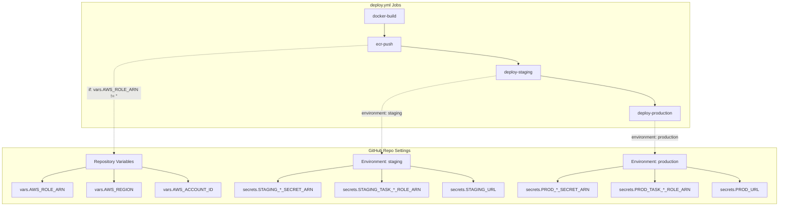
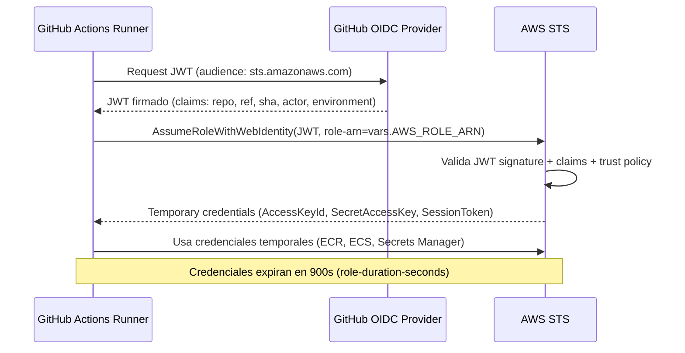
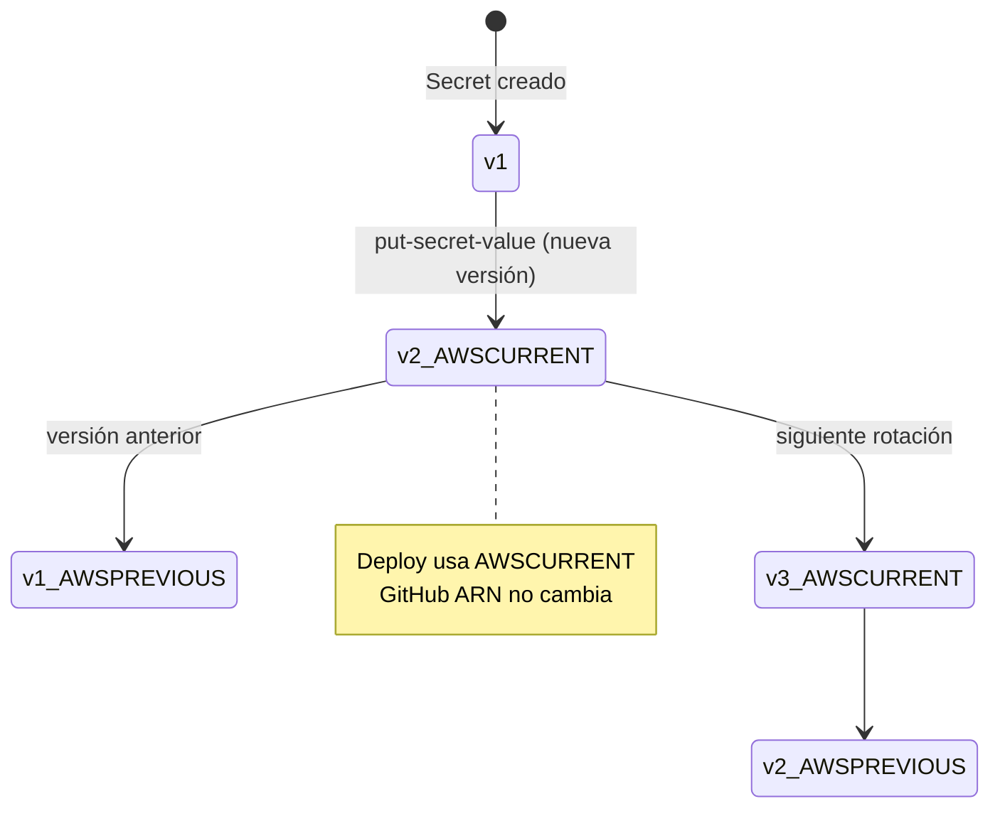

# 03 — Secrets y Variables: Gestión Segura de Configuración en GitHub Actions

> **Guía 03 de 5 del nivel Fundamentos** | Prerequisitos: [`02-github-actions-base.md`](02-github-actions-base.md) completada | Siguiente: [`04-docker-basico-para-cicd.md`](04-docker-basico-para-cicd.md)

---

## 🎯 Objetivos de aprendizaje

Al terminar esta guía, serás capaz de:

- ✅ **Diferenciar secrets de variables** de GitHub y decidir cuándo usar cada uno
- ✅ **Explicar Environments** (staging/production), environment secrets y protection rules
- ✅ **Aplicar el principio de mínimo privilegio** en configuración de workflows
- ✅ **Entender el gating real del proyecto**: `if: ${{ vars.AWS_ROLE_ARN != '' }}` y secrets `STAGING_*`/`PROD_*`
- ✅ **Configurar OIDC** para AWS sin credenciales estáticas (`permissions: id-token: write`)
- ✅ **Referenciar** [`../../workflows-mantenimiento-guia.md`](../../workflows-mantenimiento-guia.md) para anti-patterns y casos resueltos

---

## 📋 Prerequisitos

1. ✅ **Guía 02 completada** — Dominas anatomía de workflow, triggers, runners, expresiones `${{ }}`, contextos (`github`, `secrets`, `vars`, `env`, `needs`), outputs de job vs step
2. ✅ **Conceptos de seguridad básicos** — Entiendes qué es una credencial, token, key, y por qué no deben ir en código
3. ✅ **YAML fluido** — Lees/escribes maps, listas, multilínea, anclas sin dudar

> **Si no completaste la guía 02:** Vuelve a [`02-github-actions-base.md`](02-github-actions-base.md) — los contextos `secrets` y `vars` y la sintaxis `if:` se dan por sentados aquí.

---

## 1. Teoría: Secrets vs Variables — La Diferencia Fundamental

### 1.1 Tabla Comparativa: Secrets vs Variables

| Característica          | **Secrets** (`secrets.*`)                                    | **Variables** (`vars.*`)                                               |
| ----------------------- | ------------------------------------------------------------ | ---------------------------------------------------------------------- |
| **Visibilidad en logs** | **Masked** (reemplazado por `***`)                           | **Visible completo**                                                   |
| **Uso típico**          | Passwords, tokens, keys, ARNs de secrets, connection strings | ARNs de roles, regions, account IDs, feature flags, config no sensible |
| **Scope**               | Repo / Organization / Environment                            | Repo / Organization / Environment                                      |
| **En `deploy.yml`**     | `STAGING_*_SECRET_ARN`, `PROD_*_SECRET_ARN`                  | `AWS_ROLE_ARN`, `AWS_REGION`, `AWS_ACCOUNT_ID`                         |
| **Gating condicional**  | `if: ${{ secrets.MY_SECRET != '' }}`                         | `if: ${{ vars.AWS_ROLE_ARN != '' }}`                                   |
| **Límite tamaño**       | 64 KB por secret                                             | 48 KB por variable                                                     |
| **Cifrado**             | AES-256 en reposo, solo descifrado en runtime del job        | Almacenadas en claro (pero no en logs de workflow)                     |
| **API access**          | `GET /repos/{owner}/{repo}/actions/secrets`                  | `GET /repos/{owner}/{repo}/actions/variables`                          |

> **Regla de seguridad**: **NUNCA** pongas datos sensibles en `vars`. **SIEMPRE** usa `secrets` para credenciales, tokens, claves, connection strings. `vars` = configuración no sensible.

---

### 1.2 ¿Por qué existe la distinción?

GitHub Actions expone dos mecanismos separados por una razón de **diseño de seguridad**:

```
┌─────────────────────────────────────────────────────────────────┐
│  SECRETS — Para CUALQUIER cosa que no quieras ver en logs       │
│  ┌───────────────────────────────────────────────────────────┐  │
│  │  Database passwords    │  API tokens (GitHub, npm, AWS)   │  │
│  │  JWT secrets           │  Encryption keys (AES_GCM_KEY)   │  │
│  │  SSH private keys      │  Certificados TLS                │  │
│  │  Secret ARNs (AWS SM)  │  Cualquier credential real       │  │
│  └───────────────────────────────────────────────────────────┘  │
│  → Masked automáticamente en logs (aparece como ***)           │
│  → No accesibles via `actions/github-script` sin permisos      │
│  → No se pueden leer en fork PRs (excepto si configuras)       │
└─────────────────────────────────────────────────────────────────┘

┌─────────────────────────────────────────────────────────────────┐
│  VARIABLES — Para configuración NO sensible                     │
│  ┌───────────────────────────────────────────────────────────┐  │
│  │  AWS_ROLE_ARN            │  AWS_REGION (us-east-1)         │  │
│  │  AWS_ACCOUNT_ID          │  NODE_ENV (production)          │  │
│  │  Feature flags           │  URLs públicas (no secrets)     │  │
│  │  Config de build         │  Nombres de recursos            │  │
│  └───────────────────────────────────────────────────────────┘  │
│  → Visibles en logs (útil para debugging)                      │
│  → Mutables sin re-encrypt (cambio instantáneo)                │
│  → Útiles para gating: `if: ${{ vars.FEATURE_X != '' }}`       │
└─────────────────────────────────────────────────────────────────┘
```

---

### 1.3 Anti-Patterns Comunes (y cómo evitarlos)

| Anti-Pattern                                               | Qué pasa                                                   | Solución                                                                             |
| ---------------------------------------------------------- | ---------------------------------------------------------- | ------------------------------------------------------------------------------------ | --- | --------------- |
| **Meter `DATABASE_URL` en `vars`**                         | Connection string visible en logs → credenciales expuestas | Usar `secrets.DATABASE_URL` o mejor: secret ARN en `secrets` + inyectar via task def |
| **Hardcodear `AWS_REGION` en workflow**                    | Cambio de región = editar workflow + PR + deploy           | `vars.AWS_REGION` con fallback: `${{ vars.AWS_REGION                                 |     | 'us-east-1' }}` |
| **Usar `secrets` para feature flags**                      | Cambio de flag = rotar secret (overkill)                   | `vars.FEATURE_NEW_UI = 'true'` — cambio instantáneo sin secret rotation              |
| **Compartir secrets entre repos sin Organization secrets** | Duplicación, drift, rotación manual en N repos             | Organization secrets → heredan en todos los repos de la org                          |
| **No usar Environments para staging/prod**                 | Mismos secrets para todo → riesgo de leak cross-env        | Environments `staging`/`production` con secrets aislados + protection rules          |

> 📖 **Casos resueltos y anti-patterns documentados**: [`../../workflows-mantenimiento-guia.md#18-lecciones-aprendidas-y-anti-patrones`](../../workflows-mantenimiento-guia.md#18-lecciones-aprendidas-y-anti-patrones)

---

### 1.4 Cuándo usar cada Scope: Repo vs Organization vs Environment

| Scope            | Cuándo usar                       | Ejemplo en este proyecto                        | Herencia                             |
| ---------------- | --------------------------------- | ----------------------------------------------- | ------------------------------------ |
| **Repository**   | Config específica de un repo      | `vars.AWS_ROLE_ARN` (repo-level)                | Solo ese repo                        |
| **Organization** | Config compartida across repos    | `vars.AWS_REGION` (si multi-repo same region)   | Todos los repos de la org (opt-in)   |
| **Environment**  | Secrets/vars aislados por entorno | `secrets.STAGING_*_SECRET_ARN` en env `staging` | Solo jobs con `environment: staging` |

**Regla práctica del proyecto**:

- **Repo-level vars**: `AWS_ROLE_ARN`, `AWS_REGION`, `AWS_ACCOUNT_ID` (config de deployment)
- **Environment secrets**: Todo lo que toca runtime (DB, JWT, AES, IAM roles, URLs)
- **Organization secrets**: No usados actualmente (solo 1 repo en la org)

---

## 2. Teoría: Environments — Aislamiento y Protección por Entorno

### 2.1 ¿Qué es un Environment en GitHub?

Un **Environment** es un contenedor lógico que agrupa:

- **Environment secrets** — secrets que SOLO están disponibles para jobs que declaran `environment: nombre`
- **Environment variables** — variables específicas de ese entorno
- **Protection rules** — reglas que deben cumplirse antes de que el job corra:
  - **Required reviewers** (aprobación manual)
  - **Wait timer** (esperar N minutos)
  - **Deployment branches** (solo ciertas ramas pueden deployar)

```mermaid
flowchart LR
    subgraph GH [GitHub Repository Settings → Environments]
        STAGING[Environment: staging]
        PROD[Environment: production]
    end

    STAGING --> ST_S[Secrets: STAGING_*_SECRET_ARN]
    STAGING --> ST_V[Vars: staging-specific]
    STAGING --> ST_P[Protection: None (auto-deploy)]

    PROD --> PR_S[Secrets: PROD_*_SECRET_ARN]
    PROD --> PR_V[Vars: prod-specific]
    PROD --> PR_P[Protection: Required reviewers + Wait timer]
```

---

### 2.2 Environments en Este Proyecto

El proyecto define **dos environments** en GitHub (Settings → Environments):

| Environment    | Secrets (ejemplos)                                                                                                                                                                                                                                                     | Protection Rules                                                  | Deploy Trigger                         |
| -------------- | ---------------------------------------------------------------------------------------------------------------------------------------------------------------------------------------------------------------------------------------------------------------------- | ----------------------------------------------------------------- | -------------------------------------- |
| **staging**    | `STAGING_DATABASE_URL_SECRET_ARN`<br>`STAGING_JWT_SECRET_SECRET_ARN`<br>`STAGING_REFRESH_SECRETKEY_SECRET_ARN`<br>`STAGING_AES_GCM_KEY_SECRET_ARN`<br>`STAGING_AWS_REGION_SECRET_ARN`<br>`STAGING_TASK_EXECUTION_ROLE_ARN`<br>`STAGING_TASK_ROLE_ARN`<br>`STAGING_URL` | **Ninguna** (auto-deploy tras push a main)                        | `deploy.yml` → `deploy-staging` job    |
| **production** | `PROD_DATABASE_URL_SECRET_ARN`<br>`PROD_JWT_SECRET_SECRET_ARN`<br>`PROD_REFRESH_SECRETKEY_SECRET_ARN`<br>`PROD_AES_GCM_KEY_SECRET_ARN`<br>`PROD_AWS_REGION_SECRET_ARN`<br>`PROD_TASK_EXECUTION_ROLE_ARN`<br>`PROD_TASK_ROLE_ARN`<br>`PROD_URL`                         | **Required reviewers** (1+ approval)<br>**Wait timer** (opcional) | `deploy.yml` → `deploy-production` job |

> **Clave**: Los secrets de staging y production son **completamente separados**. Un leak en staging no compromete production.

---

### 2.3 Protection Rules en Detalle

```yaml
# Configuración conceptual en GitHub UI (Settings → Environments → production)
# No está en código, pero esto es lo que se configura:

# Environment: production
protection_rules:
  - type: required_reviewers
    required_reviewers_count: 1
    reviewers:
      - team: platform-team
      - user: tech-lead
  - type: wait_timer
    wait_minutes: 5
  - type: deployment_branch_policy
    protected_branches: true
    custom_branch_policies: false
```

| Rule                    | Qué hace                                       | En este proyecto                                       |
| ----------------------- | ---------------------------------------------- | ------------------------------------------------------ |
| **Required reviewers**  | Job espera aprobación manual antes de empezar  | `production`: 1 reviewer (platform team)               |
| **Wait timer**          | Espera N min tras aprobación antes de ejecutar | `production`: 5 min (opcional, para cancelar si error) |
| **Deployment branches** | Restringe qué ramas pueden deployar a este env | `production`: solo `main` (protected branches)         |

> **Staging no tiene protection rules** → auto-deploy inmediato tras push a main (si `AWS_ROLE_ARN` configurado). Esto permite feedback rápido en entorno real.

---

## 3. Teoría: Principio de Mínimo Privilegio Aplicado

El **principio de mínimo privilegio** (PoLP) dice: _cada componente debe tener solo los permisos estrictamente necesarios para su función_.

**En GitHub Actions se aplica en 3 capas:**

### Capa 1: `permissions:` del token `GITHUB_TOKEN`

```yaml
# Source: ../../../.github/workflows/deploy.yml (líneas 16-17, 167-169, 215-217)
permissions:
  contents: read  # Default mínimo para todos los jobs

# Job ecr-push:
permissions:
  id-token: write  # SOLO para OIDC assume-role
  contents: read

# Job deploy-staging:
permissions:
  id-token: write
  contents: read
```

| Permission               | Qué permite                                | Cuándo usar                                           |
| ------------------------ | ------------------------------------------ | ----------------------------------------------------- |
| `contents: read`         | Clonar repo (`actions/checkout`)           | **Siempre** (default mínimo)                          |
| `contents: write`        | Push commits, crear tags, releases         | Solo `release.yml` (Changesets)                       |
| `checks: write`          | Subir test results (JUnit) a Checks tab    | Jobs de test que usan `dorny/test-reporter`           |
| `id-token: write`        | **OIDC** — request JWT para cloud provider | Jobs que usan `aws-actions/configure-aws-credentials` |
| `security-events: write` | Subir SARIF (CodeQL, Trivy)                | Security workflows                                    |
| `pull-requests: write`   | Comentar en PRs                            | `security-digest.yml`, `preview.yml`                  |

> **Regla**: Empieza con `contents: read`. Añade **solo** lo que el job necesite. Nunca `write-all`.

### Capa 2: Scoping de Secrets/Variables por Environment

```yaml
# Job deploy-staging — SOLO ve secrets de environment "staging"
environment: staging
steps:
  - name: Register task definition (staging)
    run: |
      aws ecs register-task-definition \
        --execution-role-arn ${{ secrets.STAGING_TASK_EXECUTION_ROLE_ARN }} \
        --task-role-arn ${{ secrets.STAGING_TASK_ROLE_ARN }} \
        --container-definitions '{
          "secrets": [
            {"name": "DATABASE_URL", "valueFrom": "'${{ secrets.STAGING_DATABASE_URL_SECRET_ARN }}'"},
            {"name": "SECRETKEY", "valueFrom": "'${{ secrets.STAGING_JWT_SECRET_SECRET_ARN }}'"}
          ]
        }'
```

**Si este job intentara acceder a `secrets.PROD_DATABASE_URL_SECRET_ARN` → FALLA (secret no existe en scope).**

### Capa 3: Gating Condicional — Jobs que solo corren si hay infra

```yaml
# Source: ../../../.github/workflows/deploy.yml (líneas 160, 170, 219, 343)
ecr-push:
  if: ${{ vars.AWS_ROLE_ARN != '' }}

deploy-staging:
  if: ${{ vars.AWS_ROLE_ARN != '' }}

deploy-production:
  if: ${{ vars.AWS_ROLE_ARN != '' }}
```

**¿Por qué este gating?**

- El repo puede existir **sin infra AWS provisionada** (ej. fork, desarrollo local, CI only)
- `vars.AWS_ROLE_ARN` se configura **solo cuando existe el rol OIDC en AWS**
- Si no está configurado → jobs de CD se saltan **graciosamente** (no fallan, no bloquean PR)
- Jobs "skipped" paralelos reportan notice explicativo (ver `deploy.yml` líneas 456-498)

---

## 4. Implementación en el Proyecto: Análisis Real de `deploy.yml`

### 4.1 Arquitectura de Secrets/Variables en el CD Pipeline



---

### 4.2 Variables de Repositorio (Repo-level `vars`)

```yaml
# Configuradas en: GitHub Repo → Settings → Variables → Repository variables
# Source: ../../../.github/workflows/deploy.yml (líneas 184-186, 194-196, 229-231, 354-356)

# En step "Configure AWS credentials (OIDC)":
role-to-assume: ${{ vars.AWS_ROLE_ARN }}
aws-region: ${{ vars.AWS_REGION || 'us-east-1' }}

# En step "Build and push image to ECR":
docker tag ... ${{ vars.AWS_ACCOUNT_ID }}.dkr.ecr.${{ vars.AWS_REGION || 'us-east-1' }}.amazonaws.com/...
```

| Variable         | Qué es                    | Ejemplo valor                                            | Por qué variable (no secret)                  |
| ---------------- | ------------------------- | -------------------------------------------------------- | --------------------------------------------- |
| `AWS_ROLE_ARN`   | ARN del rol IAM para OIDC | `arn:aws:iam::123456789012:role/GitHubActions-OIDC-Role` | No es credencial, es identificador de recurso |
| `AWS_REGION`     | Región AWS                | `us-east-1`                                              | Config pública, no sensible                   |
| `AWS_ACCOUNT_ID` | Account ID numérico       | `123456789012`                                           | Público (visible en ARN de cualquier recurso) |

> **Fallback pattern**: `${{ vars.AWS_REGION || 'us-east-1' }}` — usa variable si existe, sino default. Útil para desarrollo sin infra.

---

### 4.3 Environment Secrets — Staging

```yaml
# Source: ../../../.github/workflows/deploy.yml (líneas 245-263, 284-286)
# En job deploy-staging (environment: staging):

secrets:
  - name: DATABASE_URL
    valueFrom: '${{ secrets.STAGING_DATABASE_URL_SECRET_ARN }}'
  - name: SECRETKEY
    valueFrom: '${{ secrets.STAGING_JWT_SECRET_SECRET_ARN }}'
  - name: REFRESHSECRETKEY
    valueFrom: '${{ secrets.STAGING_REFRESH_SECRETKEY_SECRET_ARN }}'
  - name: AES_GCM_KEY
    valueFrom: '${{ secrets.STAGING_AES_GCM_KEY_SECRET_ARN }}'
  - name: AWS_REGION
    valueFrom: '${{ secrets.STAGING_AWS_REGION_SECRET_ARN }}'

# Roles IAM para la task:
--execution-role-arn ${{ secrets.STAGING_TASK_EXECUTION_ROLE_ARN }}
--task-role-arn ${{ secrets.STAGING_TASK_ROLE_ARN }}

# Health check URL:
curl -sf "${{ secrets.STAGING_URL }}/health"
```

| Secret                                 | Qué contiene                                                          | Dónde se usa                                   |
| -------------------------------------- | --------------------------------------------------------------------- | ---------------------------------------------- |
| `STAGING_DATABASE_URL_SECRET_ARN`      | ARN de secret en AWS Secrets Manager con connection string PostgreSQL | Task def → container secret `DATABASE_URL`     |
| `STAGING_JWT_SECRET_SECRET_ARN`        | ARN con JWT signing secret                                            | Task def → container secret `SECRETKEY`        |
| `STAGING_REFRESH_SECRETKEY_SECRET_ARN` | ARN con refresh token secret                                          | Task def → container secret `REFRESHSECRETKEY` |
| `STAGING_AES_GCM_KEY_SECRET_ARN`       | ARN con clave encriptación AES-256-GCM                                | Task def → container secret `AES_GCM_KEY`      |
| `STAGING_AWS_REGION_SECRET_ARN`        | ARN con región (redundante con vars, pero aislado)                    | Task def → container secret `AWS_REGION`       |
| `STAGING_TASK_EXECUTION_ROLE_ARN`      | ARN del role para ECS agent (pull image, logs)                        | Task def `--execution-role-arn`                |
| `STAGING_TASK_ROLE_ARN`                | ARN del role para la app (permisos AWS runtime)                       | Task def `--task-role-arn`                     |
| `STAGING_URL`                          | URL base del servicio staging (ALB DNS)                               | Post-deploy health check + smoke tests         |

---

### 4.4 Environment Secrets — Production

```yaml
# Source: ../../../.github/workflows/deploy.yml (líneas 381-387, 407-409)
# En job deploy-production (environment: production):

secrets:
  - name: DATABASE_URL
    valueFrom: '${{ secrets.PROD_DATABASE_URL_SECRET_ARN }}'
  - name: SECRETKEY
    valueFrom: '${{ secrets.PROD_JWT_SECRET_SECRET_ARN }}'
  - name: REFRESHSECRETKEY
    valueFrom: '${{ secrets.PROD_REFRESH_SECRETKEY_SECRET_ARN }}'
  - name: AES_GCM_KEY
    valueFrom: '${{ secrets.PROD_AES_GCM_KEY_SECRET_ARN }}'
  - name: AWS_REGION
    valueFrom: '${{ secrets.PROD_AWS_REGION_SECRET_ARN }}'

# Roles IAM distintos de staging:
--execution-role-arn ${{ secrets.PROD_TASK_EXECUTION_ROLE_ARN }}
--task-role-arn ${{ secrets.PROD_TASK_ROLE_ARN }}

# Health check URL distinta:
curl -sf "${{ secrets.PROD_URL }}/health"
```

> **Diferencia clave**: Mismos **nombres** de secrets (`DATABASE_URL`, `SECRETKEY`, etc.) pero **ARNs distintos** apuntando a secrets distintos en AWS Secrets Manager. Aislamiento total.

---

### 4.5 OIDC: Autenticación AWS Sin Credenciales Estáticas

El proyecto usa **OpenID Connect (OIDC)** para autenticar con AWS — **nunca** usa `AWS_ACCESS_KEY_ID` / `AWS_SECRET_ACCESS_KEY` en GitHub secrets.

```yaml
# Source: ../../../.github/workflows/deploy.yml (líneas 181-188, 227-233, 351-357)
- name: Configure AWS credentials (OIDC)
  uses: aws-actions/configure-aws-credentials@v6
  with:
    role-to-assume: ${{ vars.AWS_ROLE_ARN }}
    aws-region: ${{ vars.AWS_REGION || 'us-east-1' }}
    role-session-name: gha-${{ github.run_id }}
    role-duration-seconds: 900
```

**Cómo funciona OIDC (flujo simplificado):**



**Trust Policy del rol IAM (AWS side) — concepto:**

```json
{
  "Version": "2012-10-17",
  "Statement": [
    {
      "Effect": "Allow",
      "Principal": {
        "Federated": "arn:aws:iam::123456789012:oidc-provider/token.actions.githubusercontent.com"
      },
      "Action": "sts:AssumeRoleWithWebIdentity",
      "Condition": {
        "StringEquals": {
          "token.actions.githubusercontent.com:aud": "sts.amazonaws.com"
        },
        "StringLike": {
          "token.actions.githubusercontent.com:sub": "repo:mi-org/project-one:*"
        }
      }
    }
  ]
}
```

> **Ventajas OIDC vs Static Keys**: Sin rotación manual, sin keys en GitHub, expiración automática, auditoría por request, scope por repo/branch/environment.

---

### 4.6 Jobs "Skipped" — Feedback Graceful Sin Infra

```yaml
# Source: ../../../.github/workflows/deploy.yml (líneas 456-498)
ecr-push-skipped:
  if: ${{ vars.AWS_ROLE_ARN == '' }}
  steps:
    - name: Report skipped
      run: |
        echo "::notice title=ECR Push Skipped::AWS_ROLE_ARN repository variable is not configured. This job requires AWS infrastructure (OIDC role + ECR repo). Configure vars.AWS_ROLE_ARN and vars.AWS_ACCOUNT_ID to enable Phase 2."

deploy-staging-skipped:
  if: ${{ vars.AWS_ROLE_ARN == '' }}
  steps:
    - name: Report skipped
      run: |
        echo "::notice title=Staging Deploy Skipped::AWS_ROLE_ARN repository variable is not configured. ECS staging cluster and environment secrets not provisioned. Complete Floci ECS learning milestone to unlock."

deploy-production-skipped:
  if: ${{ vars.AWS_ROLE_ARN == '' }}
  steps:
    - name: Report skipped
      run: |
        echo "::notice title=Production Deploy Skipped::AWS_ROLE_ARN repository variable is not configured. ECS production cluster, ALB, and environment not provisioned. Complete Floci learning path milestones to unlock."
```

**Por qué este patrón es excelente:**

1. **No falla el workflow** — `docker-build` pasa, CD se salta graciosamente
2. **Feedback visible** — `::notice` aparece en UI de Actions (amarillo, no rojo)
3. **Actionable** — Dice exactamente qué configurar para habilitar
4. **Educativo** — Menciona "Floci learning milestone" → conecta con docs de aprendizaje
5. **Concurrencia correcta** — Mismos `concurrency.group` que jobs reales → no races

---

## 5. Profundización: AWS Secrets Manager — Patrones de Integración

### 5.1 Cómo el Proyecto Usa AWSSM (No Solo ARNs)

El proyecto no almacena valores directamente en GitHub secrets. En su lugar:

1. **AWS Secrets Manager** guarda los valores reales (DB password, JWT secret, AES key)
2. **GitHub Environment Secrets** guardan solo los **ARNs** de esos secrets en AWSSM
3. **ECS Task Definition** referencia los ARNs via `valueFrom: secret-arn`
4. **ECS Agent** inyecta los valores como env vars en el container **en runtime**

```mermaid
flowchart LR
    subgraph AWSSM [AWS Secrets Manager]
        SEC_DB[Secret: project-one/staging/database-url]
        SEC_JWT[Secret: project-one/staging/jwt-secret]
        SEC_AES[Secret: project-one/staging/aes-gcm-key]
    end

    subgraph GH [GitHub Environment: staging]
        ARN_DB[secret: STAGING_DATABASE_URL_SECRET_ARN]
        ARN_JWT[secret: STAGING_JWT_SECRET_SECRET_ARN]
        ARN_AES[secret: STAGING_AES_GCM_KEY_SECRET_ARN]
    end

    subgraph ECS [Task Definition]
        CONT_SEC[container.secrets: [{name, valueFrom: ARN}]]
    end

    subgraph RUNTIME [Container Runtime]
        ENV_DB[env DATABASE_URL=postgresql://...]
        ENV_JWT[env SECRETKEY=...]
        ENV_AES[env AES_GCM_KEY=...]
    end

    SEC_DB -->|ARN| ARN_DB
    SEC_JWT -->|ARN| ARN_JWT
    SEC_AES -->|ARN| ARN_AES
    ARN_DB --> CONT_SEC
    ARN_JWT --> CONT_SEC
    ARN_AES --> CONT_SEC
    CONT_SEC -->|inject at start| ENV_DB
    CONT_SEC -->|inject at start| ENV_JWT
    CONT_SEC -->|inject at start| ENV_AES
```

**Ventajas de este patrón:**

- **GitHub nunca ve el valor real** — solo el ARN (string opaco)
- **Rotación en AWSSM** — no requiere cambiar GitHub secret si usas etiquetas `AWSCURRENT`/`AWSPREVIOUS`
- **Auditoría centralizada** — CloudTrail loggea cada acceso al secret en AWSSM
- **Versionado nativo** — AWSSM guarda versiones automáticamente

---

### 5.2 Estructura de Nombres de Secrets en AWSSM (Convención del Proyecto)

```
project-one/
├── staging/
│   ├── database-url          → STAGING_DATABASE_URL_SECRET_ARN
│   ├── jwt-secret            → STAGING_JWT_SECRET_SECRET_ARN
│   ├── refresh-secretkey     → STAGING_REFRESH_SECRETKEY_SECRET_ARN
│   ├── aes-gcm-key           → STAGING_AES_GCM_KEY_SECRET_ARN
│   ├── aws-region            → STAGING_AWS_REGION_SECRET_ARN
│   ├── task-execution-role   → STAGING_TASK_EXECUTION_ROLE_ARN
│   ├── task-role             → STAGING_TASK_ROLE_ARN
│   └── url                   → STAGING_URL
└── production/
    ├── database-url          → PROD_DATABASE_URL_SECRET_ARN
    ├── jwt-secret            → PROD_JWT_SECRET_SECRET_ARN
    ├── refresh-secretkey     → PROD_REFRESH_SECRETKEY_SECRET_ARN
    ├── aes-gcm-key           → PROD_AES_GCM_KEY_SECRET_ARN
    ├── aws-region            → PROD_AWS_REGION_SECRET_ARN
    ├── task-execution-role   → PROD_TASK_EXECUTION_ROLE_ARN
    ├── task-role             → PROD_TASK_ROLE_ARN
    └── url                   → PROD_URL
```

> **Nota**: Los ARNs de IAM roles (`TASK_EXECUTION_ROLE_ARN`, `TASK_ROLE_ARN`) también se guardan como secrets en AWSSM para mantener consistencia — aunque técnicamente son ARNs públicos, el proyecto los trata como configuración sensible de entorno.

---

### 5.3 Rotación de Secrets Sin Downtime (Procedimiento Real)

El proyecto usa **etiquetas de staging AWSSM** (`AWSCURRENT`, `AWSPREVIOUS`) para rotar sin tocar GitHub:

```bash
# 1. Crear nueva versión del secret en AWSSM (automático al actualizar valor)
aws secretsmanager put-secret-value \
  --secret-id project-one/production/jwt-secret \
  --secret-string '{"value":"<nuevo-jwt-base64-ejemplo>"}' \
  --version-stages AWSCURRENT  # Nueva versión se vuelve CURRENT automáticamente

# 2. La versión anterior pasa a AWSPREVIOUS (rollback instantáneo si falla)
# 3. GitHub environment secret NO CAMBIA — sigue apuntando al mismo ARN
# 4. Próximo deploy (deploy.yml) → ECS task def usa AWSCURRENT → nuevo valor
# 5. Verificar: health checks + smoke tests pasan
# 6. Si algo falla: revertir en AWSSM (mover AWSCURRENT a versión anterior) → re-deploy
```

**Flujo visual de rotación:**



> **Rollback en < 1 min**: `aws secretsmanager update-secret-version-stage --secret-id X --version-stage AWSCURRENT --move-to-version-id <prev-version-id>`

---

### 5.4 Cross-Repo / Organization Secrets Patterns

Aunque el proyecto actual es single-repo, estos patrones escalan:

| Patrón                     | Cuándo usar                                  | Cómo implementar                                        |
| -------------------------- | -------------------------------------------- | ------------------------------------------------------- |
| **Organization Variables** | `AWS_REGION`, `AWS_ACCOUNT_ID` compartidos   | GitHub Org Settings → Variables → "All repositories"    |
| **Organization Secrets**   | Shared CA certs, shared npm token            | GitHub Org Settings → Secrets → "Selected repositories" |
| **Environment per Repo**   | Multi-servicio, cada uno con su staging/prod | GitHub Repo Settings → Environments (por repo)          |
| **Secret per Service**     | Microservicios con DB/JWT aislados           | AWSSM path: `project-one/service-a/staging/*`           |

**Ejemplo Organization Variable:**

```yaml
# En cualquier workflow de cualquier repo de la org:
aws-region: ${{ vars.AWS_REGION || 'us-east-1' }}
# Si la org define AWS_REGION=us-west-2, todos los repos la heredan
```

---

## 6. Referencia: `workflows-mantenimiento-guia.md` — Casos Resueltos

> 📖 **Documento completo**: [`../../workflows-mantenimiento-guia.md`](../../workflows-mantenimiento-guia.md)

### 6.1 Secciones Relevantes para Secrets/Variables

| Sección                                      | Qué cubre                                                             | Por qué importa                 |
| -------------------------------------------- | --------------------------------------------------------------------- | ------------------------------- |
| **#16 Mantenimiento de permissions**         | Audit de `permissions:` por job, mínimo privilegio                    | Evita `write-all` innecesario   |
| **#14 Mantenimiento de CD/Deploy workflows** | Rotación de secrets, OIDC trust policy, environment drift             | Mantiene CD seguro y funcional  |
| **#18 Lecciones aprendidas y anti-patrones** | Casos reales: secret en vars, hardcoded regions, missing environments | Aprende de errores ya cometidos |

### 6.2 Anti-Patterns Documentados (Extracto)

> **Anti-pattern: Secret en variable**
>
> ```yaml
> # ❌ MAL: Credencial en variable (visible en logs)
> env:
>   DATABASE_URL: ${{ vars.DATABASE_URL }}
> ```
>
> ```yaml
> # ✅ BIEN: Credencial en secret (masked)
> env:
>   DATABASE_URL: ${{ secrets.DATABASE_URL }}
> ```
>
> **O MEJOR**: Inyectar via task definition secret (como hace `deploy.yml`) — ni el workflow ve el valor.

> **Anti-pattern: Hardcodear región**
>
> ```yaml
> # ❌ MAL: Región hardcodeada
> aws-region: us-east-1
> ```
>
> ```yaml
> # ✅ BIEN: Variable con fallback
> aws-region: ${{ vars.AWS_REGION || 'us-east-1' }}
> ```

> **Anti-pattern: Un solo environment para todo**
>
> ```yaml
> # ❌ MAL: staging y prod comparten secrets
> environment: production # para ambos jobs
> ```
>
> ```yaml
> # ✅ BIEN: Environments separados con secrets aislados
> environment: staging    # job deploy-staging
> environment: production # job deploy-production
> ```

---

## 7. Ejercicios Prácticos

### Ejercicio 1: Clasifica — Secret o Variable?

| Configuración                      | ¿Secret o Variable? | Por qué                                      |
| ---------------------------------- | ------------------- | -------------------------------------------- |
| `npm` token para publish           | **Secret**          | Credencial de escritura a registry           |
| `NODE_ENV=production`              | **Variable**        | Config no sensible, visible en logs OK       |
| `AWS_ROLE_ARN`                     | **Variable**        | Identificador de recurso, no credencial      |
| `JWT_SECRET_KEY`                   | **Secret**          | Clave de firma — leak = tokens falsificables |
| `FEATURE_NEW_DASHBOARD=true`       | **Variable**        | Feature flag, cambia menudo, no sensible     |
| `DATABASE_URL` (connection string) | **Secret**          | Contiene password — **nunca** en vars        |
| `ALB_DNS_NAME`                     | **Variable**        | DNS público, no sensible                     |
| `GITHUB_TOKEN` (auto)              | **Secret**          | GitHub lo provee automáticamente, masked     |

---

### Ejercicio 2: Diseña los Environments para un Nuevo Proyecto

**Requisitos:** App Node.js → ECS Fargate → staging + production. RDS PostgreSQL. JWT auth.

**Define:**

1. Repository variables (repo-level)
2. Environment `staging` secrets
3. Environment `production` secrets
4. Protection rules para cada environment

**Solución esperada:**

```yaml
# Repository Variables:
vars.AWS_ROLE_ARN
vars.AWS_REGION
vars.AWS_ACCOUNT_ID

# Environment: staging
secrets:
  STAGING_DATABASE_URL_SECRET_ARN
  STAGING_JWT_SECRET_SECRET_ARN
  STAGING_TASK_EXECUTION_ROLE_ARN
  STAGING_TASK_ROLE_ARN
  STAGING_URL
protection_rules: []  # Auto-deploy

# Environment: production
secrets:
  PROD_DATABASE_URL_SECRET_ARN
  PROD_JWT_SECRET_SECRET_ARN
  PROD_TASK_EXECUTION_ROLE_ARN
  PROD_TASK_ROLE_ARN
  PROD_URL
protection_rules:
  - required_reviewers: 1
  - wait_timer: 5  # minutes
```

---

### Ejercicio 3: Corrige el Workflow (Encuentra 5 errores)

```yaml
# ❌ Workflow con errores de seguridad/config
name: Deploy

on:
  push:
    branches: [main]

jobs:
  deploy:
    runs-on: ubuntu-latest
    permissions: write-all # ERROR 1
    environment: production
    steps:
      - uses: aws-actions/configure-aws-credentials@v6
        with:
          aws-access-key-id: ${{ secrets.AWS_ACCESS_KEY_ID }} # ERROR 2
          aws-secret-access-key: ${{ secrets.AWS_SECRET_ACCESS_KEY }} # ERROR 3
          aws-region: us-east-1 # ERROR 4
      - run: |
          echo "DB_URL=${{ vars.DATABASE_URL }}" >> $GITHUB_ENV  # ERROR 5
        env:
          DATABASE_URL: ${{ vars.DATABASE_URL }}
```

**Errores y fixes:**

1. `permissions: write-all` → `permissions: { id-token: write, contents: read }`
2. `aws-access-key-id` → **Eliminar** (usar OIDC: `role-to-assume: ${{ vars.AWS_ROLE_ARN }}`)
3. `aws-secret-access-key` → **Eliminar** (OIDC no necesita keys estáticas)
4. `aws-region: us-east-1` → `aws-region: ${{ vars.AWS_REGION || 'us-east-1' }}`
5. `vars.DATABASE_URL` → `secrets.DATABASE_URL` (connection string = secret). Y mejor: inyectar via task def, no env var.

---

### Ejercicio 4: Rotación de Secret JWT — Simula el Procedimiento

**Escenario:** El equipo de seguridad detecta que el JWT secret de production puede haber sido expuesto. Debes rotarlo **sin downtime**.

**Pasos a ejecutar (orden correcto):**

1. [ ] Generar nuevo JWT secret (base64, 32+ chars)
2. [ ] `aws secretsmanager put-secret-value --secret-id project-one/production/jwt-secret --secret-string '{"value":"<NUEVO_VALOR>"}'`
3. [ ] Verificar en AWSSM que la nueva versión tiene stage `AWSCURRENT`
4. [ ] Trigger `deploy.yml` (push a main o workflow_dispatch)
5. [ ] Verificar `deploy-production` job: health check + smoke tests pasan
6. [ ] Si falla: `aws secretsmanager update-secret-version-stage --secret-id ... --version-stage AWSCURRENT --move-to-version-id <VERSION_ANTERIOR>`
7. [ ] Re-deploy y verificar

**Pregunta clave:** ¿Por qué **no** tocamos el GitHub environment secret `PROD_JWT_SECRET_SECRET_ARN`?

**Respuesta:** El ARN no cambia. AWSSM maneja versiones internamente. El workflow sigue referenciando el mismo ARN, pero ECS inyecta el valor de `AWSCURRENT` (la nueva versión).

---

### Ejercicio 5: Promoción Staging → Production — Environment Drift Check

**Escenario:** Acabas de deployar a staging. Antes de aprobar production, quieres verificar que no hay **drift** de configuración (secrets/vars distintos que no deberían).

**Checklist de verificación:**

| Check                        | Comando / Acción                                                                 | Qué valida                     |
| ---------------------------- | -------------------------------------------------------------------------------- | ------------------------------ |
| 1. Mismos nombres de secrets | Comparar `STAGING_*` vs `PROD_*` en GitHub UI                                    | Nomenclatura consistente       |
| 2. ARNs distintos            | Verificar que `STAGING_DATABASE_URL_SECRET_ARN` ≠ `PROD_DATABASE_URL_SECRET_ARN` | Aislamiento real               |
| 3. IAM roles distintos       | `STAGING_TASK_ROLE_ARN` ≠ `PROD_TASK_ROLE_ARN`                                   | Least privilege por env        |
| 4. URLs distintas            | `STAGING_URL` ≠ `PROD_URL`                                                       | No cross-traffic               |
| 5. `AWS_REGION` consistente  | `vars.AWS_REGION` mismo valor en ambos                                           | Misma region                   |
| 6. `AWS_ROLE_ARN` mismo      | `vars.AWS_ROLE_ARN` mismo (rol OIDC compartido)                                  | Un rol, dos envs via condition |

**Automatización sugerida (nivel Intermedio):**

```yaml
# Job en deploy.yml o workflow separado: environment-drift-check
- name: Compare secret names
  run: |
    gh secret list --env staging --json name
    gh secret list --env production --json name
    # Diff automático → fail si nombres no coinciden
```

---

## 8. Preguntas Frecuentes (FAQ)

### ¿Puedo usar el mismo secret name en staging y production?

**Sí, y es recomendable** — `DATABASE_URL`, `SECRETKEY`, etc. Lo que cambia es el **ARN** (`valueFrom: '${{ secrets.STAGING_DATABASE_URL_SECRET_ARN }}'` vs `PROD_...`). El container ve el mismo nombre; el valor viene de secret distinto en AWS SM.

### ¿Por qué `AWS_REGION` está tanto en `vars` como en environment secrets?

- `vars.AWS_REGION` = **configuración de deployment** (dónde deployar, qué ECR region). Visible, mutable, fallback default.
- `secrets.STAGING_AWS_REGION_SECRET_ARN` / `PROD_...` = **runtime config inyectada en container** (la app la lee para SDK AWS). Aislada por environment, masked.

### ¿Qué pasa si un fork abre PR? ¿Tiene acceso a secrets?

**Por defecto: NO.** Fork PRs **no** tienen acceso a repo secrets (ni `secrets.*` ni `vars.*` a nivel repo/org). Solo `GITHUB_TOKEN` (read-only). Para permitir: Settings → Actions → General → "Allow GitHub Actions to create and approve pull requests" + "Allow workflows to run on fork pull requests" — **pero secrets siguen sin pasarse**. Esto es seguridad por diseño.

### ¿Cómo rotar un secret (ej: JWT secret) sin downtime?

1. **Crear nueva versión** en AWS Secrets Manager (AWSSM guarda versiones)
2. **Actualizar ARN** en GitHub environment secret (apuntar a nueva versión: `arn:aws:secretsmanager:...:secret:name:versionId:xxx`)
3. **Re-deploy** (workflow `deploy.yml` pick up nuevo ARN en próximo run)
4. **Verificar** health checks + smoke tests pasan
5. **Opcional**: Deshabilitar versión anterior en AWSSM tras confirmar

> El proyecto usa **ARNs con versionId** o **etiqueta de staging AWSSM** (`AWSCURRENT`/`AWSPREVIOUS`) para rotación sin cambiar GitHub secret.

### ¿`GITHUB_TOKEN` es un secret que debo configurar?

**No.** GitHub lo inyecta **automáticamente** en cada job. Su scope se controla via `permissions:`. Nunca lo pongas en `secrets` manualmente.

### ¿Puedo referenciar `secrets` en `if:` conditionals?

**Sí.** `if: ${{ secrets.MY_SECRET != '' }}` funciona. El secret se evalúa (masked en logs del eval) y el job corre/salta. Útil para gating opcional.

### ¿Por qué el proyecto no usa `aws-actions/amazon-ecr-login` para autenticar ECR?

**Lo usa** (ver `deploy.yml` línea 189-190), pero **después** de `configure-aws-credentials` con OIDC. El login a ECR usa las credenciales temporales OIDC, no keys estáticas.

### ¿Qué pasa si `AWS_ROLE_ARN` está configurado pero el rol IAM no existe en AWS?

El job `ecr-push` fallará en el step `Configure AWS credentials` con error `AssumeRoleWithWebIdentity` — el OIDC token es válido pero AWS no encuentra el rol. El notice de "skipped" no aparece porque `vars.AWS_ROLE_ARN != ''` es true. **Solución**: Verificar trust policy y existencia del rol en AWS.

---

## 9. Glosario: Secrets, Variables, Environments, OIDC

| Término                      | Definición                                                                                                       |
| ---------------------------- | ---------------------------------------------------------------------------------------------------------------- |
| **Secret**                   | Credencial cifrada (AES-256), masked en logs, scope repo/org/environment                                         |
| **Variable**                 | Config no sensible, visible en logs, mutable instantánea, scope repo/org/environment                             |
| **Environment**              | Contenedor lógico: secrets/vars aislados + protection rules (reviewers, wait, branches)                          |
| **Protection Rules**         | Reglas que gating el job: required reviewers, wait timer, deployment branches                                    |
| **Mínimo Privilegio (PoLP)** | Dar solo permisos estrictamente necesarios (permissions, secrets scope, IAM roles)                               |
| **OIDC**                     | OpenID Connect — federated identity: GitHub emite JWT, cloud provider valida y da credenciales temporales        |
| **Trust Policy**             | Política IAM en rol AWS que define quién puede `AssumeRoleWithWebIdentity` (condiciones: repo, ref, environment) |
| **Gating**                   | Patrón: `if: ${{ vars.X != '' }}` — job solo corre si config existe (infra provisionada)                         |
| **Skipped Job**              | Job con `if:` false que reporta `::notice` en lugar de fallar — feedback sin bloquear                            |
| **AWS Secrets Manager (SM)** | Servicio AWS para almacenar, rotar, acceder a secrets (ARNs referenciados en task defs)                          |
| **Task Definition Secrets**  | `secrets: [{name, valueFrom: secret-arn}]` — ECS inyecta como env var o file, workflow nunca ve valor            |
| **`id-token: write`**        | Permission necesaria para que runner pueda requestear JWT de GitHub OIDC provider                                |
| **`::notice`**               | Workflow command para mostrar mensaje amarillo en UI Actions (no fail, visible)                                  |
| **Fork PR Secret Access**    | Por defecto: fork PRs NO acceden a secrets repo/org. Seguridad por diseño.                                       |
| **AWSCURRENT / AWSPREVIOUS** | Etiquetas de staging AWSSM para versionado automático y rollback instantáneo                                     |
| **Secret ARN**               | Amazon Resource Name que identifica un secret en AWSSM (opaco, no revela valor)                                  |
| **Environment Drift**        | Diferencias no intencionadas de configuración entre environments (staging vs prod)                               |

---

## 10. Resumen: Lo Que Has Aprendido

| Concepto                 | Idea Clave                                                                                                                       |
| ------------------------ | -------------------------------------------------------------------------------------------------------------------------------- |
| **Secrets vs Variables** | Secrets = credenciales (masked). Variables = config no sensible (visible). Nunca mezclar.                                        |
| **Environments**         | Aislan secrets/vars por entorno (staging/prod) + añaden protection rules (approval en prod).                                     |
| **Mínimo Privilegio**    | `permissions: contents: read` base. `id-token: write` solo para OIDC. `checks: write` solo para test reporters.                  |
| **Gating con `vars`**    | `if: ${{ vars.AWS_ROLE_ARN != '' }}` — CD solo corre si infra existe. Jobs skipped reportan notice.                              |
| **OIDC en AWS**          | `aws-actions/configure-aws-credentials@v6` + `role-to-assume: ${{ vars.AWS_ROLE_ARN }}` + `id-token: write`. Sin keys estáticas. |
| **Task Def Secrets**     | ECS inyecta secrets via `valueFrom: secret-arn` — workflow nunca ve el valor real.                                               |
| **Repo Variables**       | `AWS_ROLE_ARN`, `AWS_REGION`, `AWS_ACCOUNT_ID` — config de deployment, no credenciales.                                          |
| **AWSSM Integration**    | GitHub guarda ARNs → AWSSM guarda valores → ECS inyecta en runtime. Rotación via `AWSCURRENT`.                                   |
| **Anti-patterns**        | Secret en vars, hardcodear región, un environment para todo, `permissions: write-all`.                                           |

---

## 11. Checklist de Completitud: Guía 03

Antes de pasar a la siguiente guía, verifica que puedes:

- [ ] Explicar la diferencia entre secret y variable con 3 ejemplos de cada uno
- [ ] Diseñar environments staging/production con secrets aislados y protection rules
- [ ] Escribir `permissions:` mínimo para un job que usa OIDC + ECR + ECS
- [ ] Explicar el flujo OIDC: GitHub JWT → AWS STS AssumeRole → credenciales temporales
- [ ] Identificar 3 anti-patterns de secrets/variables y su fix
- [ ] Leer `deploy.yml` y señalar: repo variables, environment secrets, gating, OIDC, skipped jobs
- [ ] Explicar por qué `DATABASE_URL` va en secret ARN inyectado en task def, no en workflow env
- [ ] Describir el procedimiento de rotación de secret via AWSSM `AWSCURRENT`/`AWSPREVIOUS`
- [ ] Explicar por qué el proyecto usa ARNs en GitHub (no valores directos) y cómo fluye a container

Si tienes dudas, relee las secciones correspondientes. La guía 04 (Docker) usa estos conceptos para la imagen que se despliega.

---

## ➡️ Siguiente Guía

▶️ **[`04-docker-basico-para-cicd.md`](04-docker-basico-para-cicd.md)** — Dockerfile, imágenes, **multi-stage builds** (concepto genérico + `apps/server/Dockerfile` real single-stage optimizado), docker-compose, y **concepto de contenedor Floci** (intro alto nivel, links a `docs/aws-*.md`, profundización en nivel Avanzado).

---

## 🔙 Guía Anterior

> **[02-github-actions-base.md](./02-github-actions-base.md)** — Anatomía workflow, triggers, runners, expresiones, contextos, outputs.

---

## 🏠 Volver al Índice

> **[README.md](./README.md)** — Roadmap completo y navegación.

---

_Parte del cambio OpenSpec `learning-cicd-fundamentos` — Nivel Fundamentos, Guía 03 de 5_
