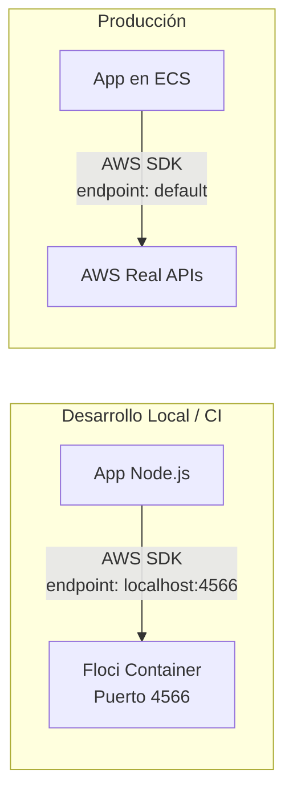

# 04 — Docker Básico para CI/CD: Imágenes, Multi-stage, Compose y Floci

> **Guía 04 de 5 del nivel Fundamentos** | Prerequisitos: [`03-secrets-variables.md`](03-secrets-variables.md) completada | Siguiente: Volver al **[fundamentos-README.md](./fundamentos-README.md)** (última guía del nivel)

---

## 🎯 Objetivos de aprendizaje

Al terminar esta guía, serás capaz de:

- ✅ **Explicar la diferencia** entre imagen, contenedor y Dockerfile con una analogía clara
- ✅ **Leer y entender** un Dockerfile real línea por línea (`apps/server/Dockerfile`)
- ✅ **Entender el concepto de multi-stage builds** (genérico) y por qué el proyecto usa single-stage optimizado
- ✅ **Escribir un docker-compose.yml** básico para desarrollo local y entender su rol en CI/CD
- ✅ **Introducir el concepto de contenedor Floci** (emulador AWS local) — solo alto nivel
- ✅ **Identificar la discrepancia** `.nvmrc` (22.23.1) vs Dockerfile `node:20-alpine` y su impacto

---

## 📋 Prerequisitos

1. ✅ **Guía 03 completada** — Entiendes secrets, variables, environments, OIDC, gating, mínimo privilegio
2. ✅ **Conceptos básicos de Linux** — Sabes qué es un proceso, filesystem, puerto, variable de entorno
3. ✅ **Terminal cómoda** — Ejecutas comandos, entiendes stdout/stderr, pipes básicos

> **Si no completaste la guía 03:** Vuelve a [`03-secrets-variables.md`](03-secrets-variables.md) — el flujo CD (ECR, ECS, task defs, secrets inyectados) se da por sentado aquí.

---

## 1. Teoría: ¿Qué es Docker? (Desde Cero con Analogía)

### 1.1 La Analogía del Contenedor de Envío

Imagina la industria del transporte **antes** de los contenedores estándar:

```
❌ SIN CONTENEDORES (desarrollo tradicional)
├── Caja de madera para libros
├── Barril para líquidos
├── Palet para sacos
├── Jaula para animales
└── Cada uno: tamaño distinto, manipulación distinta, barco distinto
```

```
✅ CON CONTENEDORES ESTÁNDAR (Docker)
├── Contenedor 20ft estándar (TEU)
├── Contenedor 40ft estándar (FEU)
├── Contenedor refrigerado (reefer)
└── Todos: mismo tamaño, misma grúa, mismo barco, mismo camión, mismo tren
```

**En software:**

| Concepto Mundo Real        | Concepto Docker                      | Qué resuelve                                                      |
| -------------------------- | ------------------------------------ | ----------------------------------------------------------------- |
| **Contenedor estándar**    | **Imagen Docker**                    | Empaquetar app + deps + runtime en unidad portable                |
| **Grúa/Barco/Camión**      | **Docker Engine**                    | Ejecutar la imagen en cualquier host (Linux, Mac, Windows, Cloud) |
| **Manifiesto de carga**    | **Dockerfile**                       | Receta reproducible para construir la imagen                      |
| **Puerto de carga**        | **Registry (ECR, GHCR, Docker Hub)** | Almacenar y distribuir imágenes                                   |
| **Contenedor en tránsito** | **Contenedor corriendo**             | Instancia viva de la imagen (proceso aislado)                     |

> 💡 **Clave**: Docker no es una VM. **No virtualiza hardware** — usa _namespaces_ y _cgroups_ del kernel Linux para aislar procesos. Overhead mínimo (~1-2%), arranque en segundos.

---

### 1.2 Imagen vs Contenedor vs Dockerfile — La Tríada Fundamental

```mermaid
flowchart LR
    subgraph BUILD [Fase Build (una vez)]
        DF[Dockerfile<br/>Receta de texto]
        CTX[Build Context<br/>Archivos locales]
        DF -->|docker build| IMG[Imagen Docker<br/>Capas inmutables<br/>Solo lectura]
        CTX -->|COPY/ADD| IMG
    end

    subgraph RUN [Fase Run (muchas veces)]
        IMG -->|docker run| CONT[Contenedor<br/>Capa R/W + Imagen<br/>Proceso vivo]
        CONT -->|write| RW[Capa Escritura<br/>Logs, temp, DB files]
    end

    subgraph DISTRIBUTE [Distribución]
        IMG -->|docker push| REG[Registry<br/>ECR / GHCR / Docker Hub]
        REG -->|docker pull| OTRO_HOST[Otro Host]
        OTRO_HOST -->|docker run| CONT2[Contenedor idéntico]
    end
```

| Concepto       | Qué es                              | Analogía                        | Estado                              |
| -------------- | ----------------------------------- | ------------------------------- | ----------------------------------- |
| **Dockerfile** | Archivo de texto con instrucciones  | Receta de cocina                | Código fuente (versionado en Git)   |
| **Imagen**     | Artefacto inmutable, capas apiladas | Plato preparado (congelado)     | Build artifact (se sube a registry) |
| **Contenedor** | Instancia ejecutada de imagen       | Plato servido (se come, cambia) | Runtime (efímero, se crea/destruye) |

**Diferencia crítica:**

- **Imagen** = estática, versionable, compartible (`project-one-server:v1.2.3`)
- **Contenedor** = dinámico, efímero, con estado (`docker run -d ...` → container ID `a1b2c3`)

---

### 1.3 ¿Por qué Docker en CI/CD?

| Sin Docker                                | Con Docker en CI/CD                                   |
| ----------------------------------------- | ----------------------------------------------------- |
| "En mi máquina funciona"                  | Mismo artifact en laptop, CI, staging, prod           |
| Instalar Node, deps, tools en cada runner | Runner solo necesita Docker Engine                    |
| Versiones de Node/drift entre entornos    | Imagen fija = Node version fija                       |
| Deploy = copiar archivos + `npm install`  | Deploy = `docker pull` + `docker run`                 |
| Rollback = revertir código + rebuild      | Rollback = `docker run` imagen anterior (instantáneo) |

---

## 2. Anatomía de un Dockerfile — Línea por Línea

### 2.1 Estructura General

```dockerfile
# Comentario
INSTRUCCION argumento
INSTRUCCION argumento
...
```

**Instrucciones principales (orden típico):**

| Instrucción   | Qué hace                                  | Crea capa?    |
| ------------- | ----------------------------------------- | ------------- |
| `FROM`        | Imagen base (punto de partida)            | Sí            |
| `WORKDIR`     | Directorio de trabajo dentro de la imagen | No (metadato) |
| `COPY`        | Copia archivos del host → imagen          | Sí            |
| `RUN`         | Ejecuta comando en build time             | Sí            |
| `ENV`         | Variable de entorno en build y runtime    | No (metadato) |
| `EXPOSE`      | Documenta puerto (no lo publica)          | No (metadato) |
| `CMD`         | Comando por defecto al iniciar contenedor | No (metadato) |
| `ENTRYPOINT`  | Ejecutable principal (se combina con CMD) | No (metadato) |
| `ARG`         | Variable solo en build time               | No (metadato) |
| `USER`        | Usuario para correr comandos              | No (metadato) |
| `HEALTHCHECK` | Comando para verificar salud              | No (metadato) |

> **Capas**: Cada `FROM`, `COPY`, `RUN` crea una **capa** (layer). Las capas se cachean — si no cambian, `docker build` las reusa (build rápido). **Ordena de menos a más frecuente cambio**.

---

### 2.2 El Dockerfile Real del Proyecto — `apps/server/Dockerfile`

> **Source**: `../../../apps/server/Dockerfile` (39 líneas, single-stage)

```dockerfile
# ============================================================
# Dockerfile para API Express + Socket.IO
# ============================================================
# Usamos Node 20 Alpine por tamaño reducido (~120MB* vs ~300MB Debian)
# * Estimación — no medido en este repo; Alpine base ~70MB + Node + deps
# Build context: monorepo root (to access package-lock.json)
#   docker build -f apps/server/Dockerfile .
# ============================================================

FROM node:20-alpine

WORKDIR /app

# Copiar root package.json + lockfile, luego workspace package.json y prisma schema
# Esto permite `npm ci --workspace=apps/server` que encuentra el lockfile en la raíz
COPY package.json package-lock.json ./
COPY apps/server/package.json ./apps/server/package.json
COPY apps/server/prisma ./apps/server/prisma/

# Instalar dependencias del workspace (incluye devDeps para prisma CLI en postinstall)
# El postinstall "prisma generate" se ejecuta aquí y encuentra el schema en apps/server/prisma/
# --ignore-scripts evita el prepare script del root (husky) que no está disponible en el contenedor
RUN npm ci --workspace=apps/server --ignore-scripts

# Eliminar devDependencies del workspace para imagen de producción más pequeña
RUN npm prune --workspace=apps/server --omit=dev

# Copiar código fuente del server (sobrescribe package.json del workspace, OK: deps ya instaladas)
COPY apps/server/. .

# El servidor Express corre en puerto 3000
EXPOSE 3000

# Comando de inicio
CMD ["node", "src/bin/index.js"]

# NOTA: El compose de dev-local (apps/server/docker-compose.yml) usa `build: .` con context apps/server.
# Con este Dockerfile (context: root), el build de dev-local FALLA.
# Para build local de dev, usa: `docker build -f apps/server/Dockerfile .` desde la raíz del repo.
# El change `ci-floci-migration` actualizará docker-compose.yml a `{ context: .., dockerfile: apps/server/Dockerfile }`.
```

---

### 2.3 Desglose Línea por Línea

| Línea(s) | Instrucción                                           | Qué hace                                                        | Por qué así                                                                                                          |
| -------- | ----------------------------------------------------- | --------------------------------------------------------------- | -------------------------------------------------------------------------------------------------------------------- |
| 1-8      | Comentarios                                           | Documentación: propósito, base image, build context             | **Buena práctica**: contexto para quien lee                                                                          |
| 10       | `FROM node:20-alpine`                                 | Imagen base: Node 20 en Alpine Linux                            | **~120MB\*** vs ~300MB Debian. Alpine = musl libc (menor, pero compatibilidad). \*Estimación                         |
| 12       | `WORKDIR /app`                                        | Directorio de trabajo = `/app`                                  | Evita rutas absolutas, base para COPY/RUN                                                                            |
| 15-17    | `COPY` (3 pasos)                                      | Copia: root pkg.json + lockfile, server pkg.json, prisma schema | **Orden crítico**: lockfile ANTES de `npm ci` para cache. Prisma schema ANTES de install (postinstall genera client) |
| 20-22    | `RUN npm ci --workspace=apps/server --ignore-scripts` | Instala deps exactas del lockfile (reproducible)                | `--workspace` usa monorepo root lockfile. `--ignore-scripts` evita `husky prepare` (fallaría sin Git)                |
| 25       | `RUN npm prune --workspace=apps/server --omit=dev`    | **Elimina devDependencies** tras install                        | Imagen de prod sin TypeScript, Vitest, ESLint, etc. ~50-100MB ahorrados                                              |
| 28       | `COPY apps/server/. .`                                | Copia código fuente (sobrescribe pkg.json workspace)            | Deps ya instaladas → pkg.json workspace ya no necesario. Código fresco para imagen                                   |
| 31       | `EXPOSE 3000`                                         | Documenta puerto 3000                                           | **No publica** — solo metadata. `docker run -p 3000:3000` publica                                                    |
| 34       | `CMD ["node", "src/bin/index.js"]`                    | Comando por defecto (array form = exec, no shell)               | `src/bin/index.js` = entry point Express + Socket.IO                                                                 |

---

### 2.4 Decisiones de Diseño Clave (y Trade-offs)

| Decisión                                | Trade-off                                                         | Por qué elegida                                                     |
| --------------------------------------- | ----------------------------------------------------------------- | ------------------------------------------------------------------- |
| **Node 20 Alpine** vs Node 22/24        | Alpine usa musl libc → algunos native modules fallan              | Tamaño crítico para CI/CD. Proyecto usa solo deps JS (no native)    |
| **Single-stage** vs Multi-stage         | Multi-stage = build stage + runtime stage (más complejo)          | `npm prune --omit=dev` logra ~mismo resultado con menos complejidad |
| **Build context = root** vs apps/server | Context root permite `npm ci --workspace` con lockfile compartido | Monorepo: un lockfile para todo. Evita drift entre workspaces       |
| `--ignore-scripts`                      | No corre `postinstall` de root (husky)                            | Husky needs Git + hooks — no disponible en build Docker             |
| `COPY apps/server/. .` al final         | Sobrescribe `package.json` del workspace                          | Deps ya instaladas. Código fresco garantizado.                      |

---

## 3. Multi-Stage Builds — Concepto Genérico (Profundización Teórica)

> ⚠️ **NOTA IMPORTANTE**: El Dockerfile real del proyecto (`apps/server/Dockerfile`) es **SINGLE-STAGE** (39 líneas, optimizado con `npm prune --omit=dev`). La especificación de la tarea 6.3 menciona "multi-stage builds", pero el proyecto **no lo usa actualmente**. Aquí enseñas el concepto genérico (estándar de la industria) y luego explicas honestamente la implementación real.

### 3.1 ¿Qué es Multi-Stage Build?

**Problema**: Imagen de build incluye: código fuente + deps de build (TypeScript, compilers, test runners) + herramientas → **imagen enorme** con superficie de ataque grande.

**Solución**: Separar **build stage** (pesado, con tools) de **runtime stage** (ligero, solo artifact + runtime).

```dockerfile
# ============================================================
# EJEMPLO GENÉRICO MULTI-STAGE (NO es el del proyecto)
# ============================================================

# STAGE 1: BUILDER — Compila, testea, genera artifact
FROM node:20-alpine AS builder

WORKDIR /app

# Copiar todo para build
COPY package.json package-lock.json ./
COPY . .

# Instalar TODAS las deps (incluye devDeps)
RUN npm ci

# Build: TypeScript → JavaScript, bundle, etc.
RUN npm run build

# Tests (opcional, en build stage)
RUN npm run test:unit

# STAGE 2: RUNTIME — Solo artifact + runtime deps
FROM node:20-alpine AS runtime

WORKDIR /app

# Copiar SOLO lo necesario del builder
COPY --from=builder /app/package.json ./
COPY --from=builder /app/package-lock.json ./
COPY --from=builder /app/node_modules ./node_modules
COPY --from=builder /app/dist ./dist

# Usuario no-root (seguridad)
USER node

EXPOSE 3000
CMD ["node", "dist/index.js"]
```

### 3.2 Diagrama: Single-Stage vs Multi-Stage

```mermaid
flowchart TB
    subgraph SINGLE [Single-Stage (Proyecto Real)]
        S1[FROM node:20-alpine]
        S2[COPY pkg + lock + schema]
        S3[RUN npm ci --workspace=server]
        S4[RUN npm prune --omit=dev]
        S5[COPY source code]
        S6[CMD node src/bin/index.js]
        S1 --> S2 --> S3 --> S4 --> S5 --> S6
        S6 --> IMG_SINGLE[Imagen Final ~180MB*]
    end

    subgraph MULTI [Multi-Stage (Concepto Genérico)]
        B1[FROM node:20-alpine AS builder]
        B2[COPY all source]
        B3[RUN npm ci (ALL deps)]
        B4[RUN npm run build + test]

        R1[FROM node:20-alpine AS runtime]
        R2[COPY --from=builder artifact only]
        R3[USER node]
        R4[CMD node dist/index.js]

        B1 --> B2 --> B3 --> B4
        B4 -.->|COPY --from=builder| R1
        R1 --> R2 --> R3 --> R4
        R4 --> IMG_MULTI[Imagen Final ~120MB*]
    end
```

### 3.3 Comparativa

| Aspecto             | Single-Stage (Proyecto)                          | Multi-Stage (Genérico)                |
| ------------------- | ------------------------------------------------ | ------------------------------------- |
| **Complejidad**     | Baja (1 Dockerfile, 39 líneas)                   | Media (2+ stages, COPY --from)        |
| **Tamaño final**    | ~180MB\* (con `npm prune`)                       | ~120MB\* (solo runtime deps)          |
| **Build time**      | 1 pass                                           | 2 passes (pero cacheable)             |
| **Seguridad**       | DevDeps eliminadas, pero fuente en capa anterior | Fuente NUNCA en imagen final          |
| **Debugging**       | Código fuente en imagen (útil para debug)        | Solo artifact (más opaco)             |
| **Uso en proyecto** | ✅ Actual                                        | 📋 Enseñado para conocimiento general |

> **Por qué el proyecto usa single-stage + prune**:
>
> 1. Simplicidad — un Dockerfile entendible por Juniors
> 2. `npm prune --omit=dev` elimina **~60-70%\*** del peso (devDeps) — \*estimación típica, no medido en este repo
> 3. Código fuente en imagen ayuda debugging en staging/prod
> 4. No hay native modules que requieran compilación separada
> 5. **Multi-stage se enseña en nivel Avanzado** para casos reales (Go, Rust, Java, native Node modules)

---

### 3.4 Cuándo SÍ Usar Multi-Stage (Patrones Comunes)

| Escenario                                       | Por qué multi-stage                                                                     |
| ----------------------------------------------- | --------------------------------------------------------------------------------------- |
| **Lenguajes compilados** (Go, Rust, Java, C++)  | Build stage necesita compiler toolchain (GCC, Maven, Cargo); runtime solo binario       |
| **Native Node modules** (bcrypt, sharp, canvas) | Build stage compila con `node-gyp` + Python + GCC; runtime solo `.node` binarios        |
| **Multi-arch builds** (ARM64 + AMD64)           | BuildKit + buildx con stages separados por arch                                         |
| **Security hardening** (distroless, scratch)    | Runtime stage = `gcr.io/distroless/nodejs` o `scratch` (sin shell, sin package manager) |
| **Monorepo con múltiples apps**                 | Shared builder stage → múltiples runtime stages (una por app)                           |

---

## 4. Docker Compose — Orquestación Local para Desarrollo y CI

### 4.1 ¿Qué es Docker Compose?

**Docker Compose** = herramienta para definir y correr **aplicaciones multi-contenedor** via archivo YAML (`docker-compose.yml`).

```yaml
# Formato básico
version: '3.8' # Opcional en Compose v2+

services:
  nombre_servicio:
    image: imagen:tag
    build: .
    ports:
      - '3000:3000'
    environment:
      - VAR=value
    volumes:
      - ./src:/app/src
    depends_on:
      - db

  db:
    image: postgres:16-alpine
    environment:
      POSTGRES_DB: myapp
      POSTGRES_USER: user
      POSTGRES_PASSWORD: pass
    ports:
      - '5432:5432'
```

> **Compose v2** (`docker compose`) es plugin de Docker CLI. **Compose v1** (`docker-compose`) deprecado. Proyecto usa v2.

---

### 4.2 El docker-compose Real del Proyecto — `apps/server/docker-compose.yml`

> **Source**: `../../../apps/server/docker-compose.yml` (111 líneas completas)

El archivo real incluye **7 servicios** (api, db/postgres:17, pgAdmin, nginx, prometheus, grafana, floci) con redes, volúmenes y `env_file: .env`. Abajo se muestra un **extracto honesto de los servicios clave** (api, postgres, floci) — ver archivo completo en la ruta indicada.

```yaml
# Source: ../../../apps/server/docker-compose.yml (extracto: api, db, floci)
services:
  db:
    container_name: project_one_bd
    image: postgres:17
    restart: always
    environment:
      POSTGRES_USER: ${POSTGRES_USER}
      POSTGRES_PASSWORD: ${POSTGRES_PASSWORD}
      POSTGRES_DB: ${POSTGRES_DB}
    volumes:
      - ./db/postgres:/var/lib/postgresql/data
    ports:
      - '5432:5432'
    networks:
      - app-network

  api:
    build: .
    container_name: project_one_api
    restart: always
    depends_on:
      - db
    ports:
      - '3000:3000'
    env_file:
      - .env
    networks:
      - app-network

  floci:
    image: floci/floci:1.5.31
    container_name: project_one_floci
    restart: always
    ports:
      - '4566:4566'
    environment:
      FLOCI_STORAGE_MODE: memory
    healthcheck:
      test:
        [
          'CMD-SHELL',
          'curl -f http://localhost:4566/_localstack/health >/dev/null 2>&1 || exit 1',
        ]
      interval: 10s
      timeout: 5s
      retries: 5
      start_period: 10s
    networks:
      - app-network

networks:
  app-network:
    driver: bridge

volumes:
  prometheus_data:
  grafana_data:
```

> **Servicios completos en el archivo real (111 líneas):** `db` (postgres:17), `pgAdmin`, `api` (build: . + env_file), `nginx`, `prometheus`, `grafana`, `floci`. Todos en red `app-network` con volúmenes persistentes para DB, Prometheus y Grafana.

---

### 4.3 Desglose: Claves de Compose para CI/CD

| Sección                                                                     | Qué hace (en archivo real)                    | Relevancia CI/CD                                                     |
| --------------------------------------------------------------------------- | --------------------------------------------- | -------------------------------------------------------------------- |
| `build: .` (api)                                                            | Build local desde context apps/server/        | CI usa mismo Dockerfile (`docker build -f apps/server/Dockerfile .`) |
| `env_file: .env` (api)                                                      | Carga variables desde archivo `.env` local    | CI usa GitHub secrets/vars + task def `valueFrom` (no env file)      |
| `depends_on` (api → db)                                                     | Orquesta arranque ordenado                    | CI replica con `services:` + healthchecks en workflow jobs           |
| `networks: app-network`                                                     | Red bridge compartida entre 7 servicios       | CI: service containers comparten `localhost` en job                  |
| `healthcheck` (floci)                                                       | Verifica servicio listo antes de dependientes | CI usa mismo patrón en `services:` de workflow                       |
| `volumes` (named: `prometheus_data`, `grafana_data`, bind: `./db/postgres`) | Persistencia datos entre reinicios            | **NO en CI/CD** — service containers son efímeros, sin persistencia  |
| `restart: always`                                                           | Auto-reinicio en fallo                        | CI: jobs fallan y se reportan; no hay restart automático             |

---

### 4.4 Diferencias Críticas: Dev Compose Real vs CI/CD

| Aspecto            | `docker-compose.yml` Real (Dev Local)                                         | CI/CD (`deploy.yml`, `preview.yml`)                                                        |
| ------------------ | ----------------------------------------------------------------------------- | ------------------------------------------------------------------------------------------ |
| **Servicios**      | 7: api, postgres:17, pgAdmin, nginx, prometheus, grafana, floci               | Solo los necesarios: api (imagen), postgres (service container), floci (service container) |
| **Imagen api**     | Build local (`build: .`)                                                      | Pull de ECR — **inmutable** (SHA tag)                                                      |
| **Config api**     | `env_file: .env` (valores locales/dummy)                                      | GitHub `vars` + `secrets` → ECS task def `valueFrom` (ARNs AWSSM)                          |
| **Comando api**    | `npm run dev` (nodemon, hot reload) — _no en compose, usa CMD del Dockerfile_ | `CMD ["node", "src/bin/index.js"]` (producción)                                            |
| **DB**             | postgres:17 + volume `./db/postgres` (persistente)                            | Service container `postgres:16-alpine` efímero (CI) / RDS (prod)                           |
| **AWS Emulador**   | `floci/floci:1.5.31` (puerto 4566)                                            | `floci/floci:1.5.31` en `services:` (CD validation) / AWS real (deploy)                    |
| **Observabilidad** | prometheus + grafana (puertos 9090, 3001)                                     | CloudWatch logs + health checks (no Prometheus/Grafana en CI/CD actual)                    |
| **Reverse Proxy**  | nginx (puertos 80/443, SSL local)                                             | ALB en AWS (managed), no nginx en pipeline                                                 |
| **Persistencia**   | Volumes nombrados (`prometheus_data`, `grafana_data`, bind `./db/postgres`)   | **Stateless** — service containers efímeros, sin persistencia                              |
| **Red**            | `app-network` bridge (7 servicios)                                            | Job `services:` comparten `localhost`; ECS usa `awsvpc` network mode                       |

> **Regla de oro**: Compose = **solo desarrollo local**. CI/CD usa **imágenes inmutables** + **infraestructura real**. Nunca uses `docker-compose up` en pipeline de producción.

---

### 4.5 Compose en CI — Service Containers (GitHub Actions)

El proyecto **replica el patrón compose** en workflows usando `services:`:

```yaml
# Source: ../../../.github/workflows/deploy.yml (líneas 34-64)
# Job docker-build — services para validación de imagen:

services:
  floci:
    image: floci/floci:1.5.31
    ports:
      - 4566:4566
    env:
      FLOCI_STORAGE_MODE: memory
      FLOCI_HOSTNAME: floci
    options: >-
      --health-cmd "curl -f http://localhost:4566/_localstack/health || exit 1"
      --health-interval 10s
      --health-timeout 5s
      --health-retries 5

  db:
    image: postgres:16-alpine
    ports:
      - 5432:5432
    env:
      POSTGRES_USER: test
      POSTGRES_PASSWORD: test
      POSTGRES_DB: project_one_cd
    options: >-
      --health-cmd "pg_isready -U test -d project_one_cd"
      --health-interval 5s
      --health-timeout 5s
      --health-retries 10
```

**Paralelo directo con compose:**
| Compose | GitHub Actions `services:` |
|---------|----------------------------|
| `services.db.image` | `services.db.image` |
| `healthcheck` | `options: --health-cmd ...` |
| `depends_on.condition: service_healthy` | Job **espera automáticamente** a que service container esté healthy |
| `environment` | `env:` |
| `ports` | `ports:` (accesible en `localhost:port` desde steps) |

---

## 5. Floci — Introducción Conceptual (Alto Nivel)

> ⚠️ **SOLO INTRODUCCIÓN**. Profundización en **Nivel Avanzado** (guías 11-17, change `learning-cicd-avanzado`).

### 5.1 ¿Qué es Floci?

**Floci** = Fork de **LocalStack** mantenido por el equipo del proyecto. Emula **APIs de AWS localmente** (S3, DynamoDB, Secrets Manager, ECS, etc.) para testing de integración sin cuenta AWS real.



### 5.2 Qué Emula Floci en Este Proyecto

| Servicio AWS        | Uso en Proyecto                     | Floci Support                  |
| ------------------- | ----------------------------------- | ------------------------------ |
| **Secrets Manager** | Guardar DB URL, JWT secret, AES key | ✅ Completo                    |
| **S3**              | Asset storage (futuro)              | ✅                             |
| **DynamoDB**        | No usado actualmente                | ✅                             |
| **ECS**             | Task definitions, service discovery | ⚠️ Parcial (mock)              |
| **IAM/STS**         | OIDC assume-role                    | ❌ No (usa AWS real para OIDC) |

### 5.3 Dónde Aparece Floci en el Pipeline

| Stage             | Workflow                                          | Propósito                                                          |
| ----------------- | ------------------------------------------------- | ------------------------------------------------------------------ |
| **Dev Local**     | `docker-compose.yml` → `localstack` service       | Developer testing con AWS APIs locales                             |
| **Preview PR**    | `preview.yml`                                     | Levanta stack completo por PR (Floci + Postgres + App)             |
| **CD Validation** | `deploy.yml` → `docker-build` job                 | Valida imagen boot contra Floci + Postgres **antes** de push a ECR |
| **CD Deploy**     | `deploy.yml` → `ecr-push` → `deploy-staging/prod` | **NO usa Floci** — usa AWS real (OIDC + ECS)                       |

> 🔗 **Docs de referencia para profundización (Nivel Avanzado):**
>
> - [`../../aws-dev-local-floci.md`](../../aws-dev-local-floci.md) — Desarrollo local con Floci
> - [`../../aws-learning-with-floci.md`](../../aws-learning-with-floci.md) — Aprendizaje AWS usando Floci
> - [`../../aws-deploy-architecture.md`](../../aws-deploy-architecture.md) — Arquitectura despliegue AWS + ECS
> - [`../../aws-cd-learning-path.md`](../../aws-cd-learning-path.md) — Ruta aprendizaje AWS/CD

---

### 5.4 Floci vs LocalStack vs AWS Real

| Característica           | Floci (Proyecto)                   | LocalStack (Upstream)       | AWS Real               |
| ------------------------ | ---------------------------------- | --------------------------- | ---------------------- |
| **Mantenimiento**        | Equipo del proyecto                | Comunidad + LocalStack GmbH | AWS                    |
| **API Coverage**         | Subset enfocado (SM, S3, DynamoDB) | Amplio (200+ servicios)     | Completo               |
| **ECS Emulation**        | Mock básico para task defs         | Limitado                    | Nativo                 |
| **OIDC/STS**             | No                                 | No                          | ✅ Requerido para prod |
| **Costo**                | Gratis (local/CI)                  | Gratis (local) / Pro (paid) | Pay-per-use            |
| **Uso en este proyecto** | Dev, Preview, CD Validation        | Base de Floci               | Staging/Prod           |

---

## 6. Discrepancia Importante: `.nvmrc` vs Dockerfile Node Version

### 6.1 Los Hechos

| Archivo                           | Versión Node     | Fuente                           |
| --------------------------------- | ---------------- | -------------------------------- |
| `.nvmrc`                          | **22.23.1**      | `../../../.nvmrc` (línea 1)      |
| `apps/server/Dockerfile`          | **20-alpine**    | `FROM node:20-alpine` (línea 10) |
| `actions/setup-node` en workflows | **Lee `.nvmrc`** | `node-version-file: '.nvmrc'`    |

### 6.2 ¿Por Qué Existe Esta Diferencia?

| Contexto                               | Versión              | Razón                                                                                                                                                                                                                                                                                                                            |
| -------------------------------------- | -------------------- | -------------------------------------------------------------------------------------------------------------------------------------------------------------------------------------------------------------------------------------------------------------------------------------------------------------------------------- |
| **Desarrollo Local / CI Runners**      | 22.23.1 (LTS actual) | `.nvmrc` = single source of truth para developers y CI jobs. Actualizado ago 2026 por requisito de `omniroute@3.8.49` (requiere Node ≥22.22.2). Ver [`../../workflows-mantenimiento-guia.md#caso-1--ebadengine-por-requisito-de-omniroute`](../../workflows-mantenimiento-guia.md#caso-1--ebadengine-por-requisito-de-omniroute) |
| **Runtime de Contenedor (Producción)** | 20-alpine            | Imagen base estable, probada, menor tamaño. Node 20 LTS hasta **abril 2026 (EOL programado)**, pero **Alpine 20** sigue recibiendo security patches tras EOL upstream. Cambiar a Node 22 Alpine requeriría testing de compatibilidad (musl libc, native deps).                                                                   |

### 6.3 Impacto Práctico

| Escenario                                        | Qué pasa                            | Mitigación                                                                                                              |
| ------------------------------------------------ | ----------------------------------- | ----------------------------------------------------------------------------------------------------------------------- |
| **Dev local** (`npm run dev`)                    | Usa Node 22.23.1 (via nvm/fnm)      | ✅ Funciona                                                                                                             |
| **CI Jobs** (`ci.yml`, `quality.yml`, etc.)      | Usa Node 22.23.1 (via `setup-node`) | ✅ Funciona                                                                                                             |
| **Docker Build** (`deploy.yml` → `docker-build`) | Usa Node 20 (imagen base)           | ⚠️ **Drift potencial**: si código usa features Node 22+ no disponibles en 20, build pasa en CI pero falla en contenedor |
| **Runtime en ECS**                               | Node 20                             | ⚠️ Mismo drift potencial                                                                                                |

### 6.4 Cómo Manejar Esta Discrepancia (Buenas Prácticas)

1. **Evita features Node 22+** en código que corre en contenedor (usa transpilación TypeScript → ES2022/ES2023 target)
2. **Testea en contenedor** antes de merge: `docker build -f apps/server/Dockerfile . && docker run ...`
3. **Pipeline de validación**: `deploy.yml` job `docker-build` corre smoke tests **dentro del contenedor Node 20** — catcha drift temprano
4. **Plan de migración**: Tras Node 20 EOL (abril 2026) → evaluar actualizar Dockerfile a `node:22-alpine` o `node:24-alpine` + test exhaustivo (no automático; decisión basada en compatibilidad)

> 📝 **Nota para el aprendiz**: Esta discrepancia es **común en la industria**. Lo importante es:
>
> - Entender **por qué** existe (diferentes constraints: dev velocity vs runtime stability)
> - Tener **validación automática** que catcha problemas (smoke tests en `docker-build` job)
> - Documentar el **plan de convergencia** (migración programada)

---

## 7. Ejercicios Prácticos

### Ejercicio 1: Identifica Capas en el Dockerfile Real

**Dado** el `apps/server/Dockerfile`, lista qué líneas crean capas y su orden:

```
Capa 1: FROM node:20-alpine
Capa 2: WORKDIR /app (metadato, no capa)
Capa 3: COPY package.json package-lock.json ./
Capa 4: COPY apps/server/package.json ./apps/server/package.json
Capa 5: COPY apps/server/prisma ./apps/server/prisma/
Capa 6: RUN npm ci --workspace=apps/server --ignore-scripts
Capa 7: RUN npm prune --workspace=apps/server --omit=dev
Capa 8: COPY apps/server/. .
Capa 9: EXPOSE 3000 (metadato)
Capa 10: CMD [...] (metadato)
```

**Pregunta**: Si cambias solo `apps/server/src/utils/date.ts`, ¿qué capas se rebuild?

**Respuesta**: Capas 8 (COPY source) + 10 (CMD metadato). Capas 1-7 **cacheadas** (lockfile y deps no cambiaron).

---

### Ejercicio 2: Convierte a Multi-Stage (Ejercicio Teórico)

**Toma el Dockerfile real y conviértelo a multi-stage genérico** (no para usar, para entender):

```dockerfile
# STAGE 1: builder
FROM node:20-alpine AS builder
WORKDIR /app
COPY package.json package-lock.json ./
COPY apps/server/package.json ./apps/server/package.json
COPY apps/server/prisma ./apps/server/prisma/
RUN npm ci --workspace=apps/server --ignore-scripts
RUN npm run build  # Si hubiera build step
COPY apps/server/. .

# STAGE 2: runtime
FROM node:20-alpine AS runtime
WORKDIR /app
COPY --from=builder /app/node_modules ./node_modules
COPY --from=builder /app/package.json ./
COPY --from=builder /app/src ./src
COPY --from=builder /app/prisma ./prisma
USER node
EXPOSE 3000
CMD ["node", "src/bin/index.js"]
```

**Diferencias clave vs real**: Separación física de build vs runtime, `USER node` (seguridad), no `npm prune` (devDeps nunca copiadas).

---

### Ejercicio 3: Docker Compose → GitHub Actions Services

**Mapea** el `docker-compose.yml` dev al `services:` del job `docker-build` en `deploy.yml`:

| Compose Service               | GitHub Actions Service                                  | Diferencia Clave                                                  |
| ----------------------------- | ------------------------------------------------------- | ----------------------------------------------------------------- |
| `db` (postgres:16-alpine)     | `services.db` (postgres:16-alpine)                      | Mismo. CI usa `options` para healthcheck en vez de `healthcheck:` |
| `localstack`                  | `services.floci` (floci/floci:1.5.31)                   | Floci = fork de LocalStack mantenido por proyecto                 |
| `api` (build local + volumes) | **NO HAY** — el job **construye la imagen** y la prueba | CI valida imagen construida, no monta código local                |

---

### Ejercicio 4: Detecta el Drift Node Version

**Escenario**: Un developer agrega `Object.groupBy()` (Node 22+) en `apps/server/src/utils/array.ts`.

**¿Qué pasa en cada ambiente?**

| Ambiente                  | Node Version       | ¿Pasa?                                               |
| ------------------------- | ------------------ | ---------------------------------------------------- |
| Dev local (`npm run dev`) | 22.23.1            | ✅ Sí                                                |
| CI `test-unit-server`     | 22.23.1            | ✅ Sí                                                |
| `docker-build` job        | 20 (en contenedor) | ❌ **FALLA** — `Object.groupBy` no existe en Node 20 |
| Staging/Prod runtime      | 20                 | ❌ **FALLA** en runtime                              |

**¿Cómo catcha el pipeline?** El job `docker-build` corre `npm run test:smoke` **dentro del contenedor Node 20** — el test falla antes de push a ECR.

**Fix correcto**: Usar polyfill o alternativa compatible (`lodash.groupby`, o implementación manual), o transpilar con TypeScript target ES2022.

---

### Ejercicio 5: Security Hardening Checklist para Dockerfile

**Revisa el Dockerfile real y marca qué hardening aplica:**

- [ ] ✅ **Base image minimal** — `node:20-alpine` (no `node:20` Debian)
- [ ] ✅ **No root user** — ⚠️ **FALTA**: corre como root (default). Fix: `USER node` antes de CMD
- [ ] ✅ **No secrets en imagen** — ✅ Correcto (usa build args / runtime injection)
- [ ] ✅ **DevDeps eliminadas** — ✅ `npm prune --omit=dev`
- [ ] ⚠️ **Read-only rootfs** — ❌ No configurado. Fix: `docker run --read-only` en runtime
- [ ] ⚠️ **Capabilities drop** — ❌ No configurado. Fix: `--cap-drop=ALL` en ECS task def
- [ ] ✅ **Healthcheck** — ⚠️ En Dockerfile no hay `HEALTHCHECK`. Se define en ECS task def + compose

> **Nivel Avanzado**: Hardening completo (distroless, cosign signing, SBOM, Trivy scan) se cubre en change `learning-cicd-avanzado`.

---

## 8. Preguntas Frecuentes (FAQ)

### ¿Por qué el Dockerfile usa `COPY apps/server/. .` al final?

Para copiar el **código fuente fresco** después de instalar dependencias. Si copiaras todo al inicio, cualquier cambio en código invalidaría la capa de `npm ci` (reinstall deps en cada build). **Orden = cache optimization**.

### ¿Qué hace `--ignore-scripts` en `npm ci`?

Evita ejecutar scripts `prepare`, `postinstall`, etc. definidos en `package.json`. El root `package.json` tiene `prepare: husky install` que **falla en Docker** (no hay Git, no hay `.husky`). `--ignore-scripts` lo saltea.

### ¿Por qué `npm prune --omit=dev` en vez de `npm ci --omit=dev`?

`npm ci --omit=dev` **no existe** (npm ci siempre instala todo del lockfile). El patrón correcto: `npm ci` (todo) → `npm prune --omit=dev` (elimina devDeps). Esto garantiza reproducible install + imagen ligera.

### ¿Puedo usar `docker-compose.yml` en CI para integration tests?

**No recomendado**. CI usa `services:` en workflow (native, más rápido, mejor integración con GitHub Actions). Compose en CI añade complejidad (instalar compose, parsear YAML, network modes). El proyecto usa `services:` en `ci.yml` (Postgres) y `deploy.yml` (Floci + Postgres).

### ¿Floci reemplaza a LocalStack completamente?

**Para este proyecto: sí**. Floci es un fork mantenido por el equipo con fixes específicos para su uso (Secrets Manager, ECS mock). Upstream LocalStack se usa como base. En nivel Avanzado verás cómo contribuir a Floci.

### ¿Por qué la imagen base es `node:20-alpine` y no `node:22-alpine`?

Estabilidad y testing. Node 20 LTS hasta **abril 2026 (EOL programado)**. Alpine 20 sigue recibiendo security patches tras EOL upstream. Migrar a Node 22 Alpine requiere validar: native deps (si las hubiera), musl libc compatibility, performance. El pipeline valida con smoke tests en Node 20 — si pasas, estás seguro. La migración se evaluará tras EOL, no es automática.

### ¿Qué pasa si `docker build` falla en `npm ci` por lockfile desactualizado?

**CI previene esto**: `ci.yml` job `build` corre `npm run build --ws --if-present` que hace `npm ci` implícito. Si lockfile fuera incorrecto, CI falla antes de llegar a `deploy.yml`. Además, `deploy.yml` job `docker-build` usa el mismo lockfile.

---

## 9. Glosario: Docker, Compose, Floci, CI/CD

| Término                              | Definición                                                                             |
| ------------------------------------ | -------------------------------------------------------------------------------------- |
| **Dockerfile**                       | Receta de texto para construir imagen (instrucciones: FROM, COPY, RUN, CMD...)         |
| **Imagen**                           | Artefacto inmutable, capas apiladas, solo lectura (build artifact)                     |
| **Contenedor**                       | Instancia viva de imagen — proceso aislado con capa R/W                                |
| **Layer/Capa**                       | Unidad de filesystem en imagen (cada FROM/COPY/RUN = capa). Cacheable.                 |
| **Build Context**                    | Directorio enviado a daemon Docker para build (archivos disponibles para COPY)         |
| **Registry**                         | Almacén de imágenes (ECR, GHCR, Docker Hub). `docker push/pull`                        |
| **Multi-stage Build**                | Dockerfile con múltiples `FROM` — separa build stage de runtime stage                  |
| **`COPY --from=`**                   | Copia artefactos de stage anterior en multi-stage                                      |
| **`npm prune --omit=dev`**           | Elimina devDependencies de `node_modules` (imagen prod más chica)                      |
| **Docker Compose**                   | Orquestación multi-contenedor via YAML (`docker compose up`)                           |
| **Service Container**                | Contenedor sidecar en GitHub Actions (`services:` en workflow job)                     |
| **Bind Mount**                       | Monta directorio host → contenedor (`volumes: ./src:/app/src`). Solo dev.              |
| **Volume Nombrado**                  | Persistencia gestionada por Docker (`volumes: postgres_data:/var/lib/postgresql/data`) |
| **Floci**                            | Fork de LocalStack mantenido por el proyecto — emula AWS APIs localmente               |
| **LocalStack**                       | Emulador AWS open source (S3, DynamoDB, Secrets Manager, etc.)                         |
| **OIDC en Docker**                   | No aplica — OIDC es para GitHub Actions → AWS. Contenedor usa task role IAM.           |
| **Task Definition (ECS)**            | Blueprint de contenedor en ECS: imagen, CPU/mem, secrets, env, healthcheck             |
| **ECR (Elastic Container Registry)** | Registry Docker gestionado por AWS. `aws ecr get-login-password`                       |
| **Distroless**                       | Imágenes base mínimas sin shell, sin package manager (seguridad extrema)               |
| **SBOM**                             | Software Bill of Materials — inventario de componentes en imagen (CycloneDX/SPDX)      |
| **Cosign**                           | Firma y verificación de imágenes (supply chain security)                               |
| **Node Version Drift**               | Diferencia entre Node en dev/CI (`.nvmrc`) vs runtime contenedor (Dockerfile FROM)     |

---

## 10. Resumen: Lo Que Has Aprendido

| Concepto                               | Idea Clave                                                                                                          |
| -------------------------------------- | ------------------------------------------------------------------------------------------------------------------- |
| **Imagen vs Contenedor vs Dockerfile** | Receta → Plato congelado → Plato servido. Inmutable vs efímero.                                                     |
| **Dockerfile Real (39 líneas)**        | Single-stage optimizado: `FROM node:20-alpine` → `npm ci` → `npm prune --omit=dev` → COPY source → CMD              |
| **Multi-Stage (Concepto)**             | Builder stage (pesado) → Runtime stage (ligero). Proyecto NO lo usa; enseña para conocimiento general.              |
| **Docker Compose (Dev)**               | `apps/server/docker-compose.yml`: api + db + localstack. Bind mounts, hot reload, override CMD.                     |
| **Compose en CI**                      | GitHub Actions `services:` replica patrón compose nativamente (Postgres, Floci).                                    |
| **Floci (Intro)**                      | Emulador AWS local (Secrets Manager, S3). Usado en dev, preview, CD validation. Profundización en Avanzado.         |
| **Node Version Discrepancy**           | `.nvmrc` = 22.23.1 (dev/CI) vs Dockerfile = 20-alpine (runtime). Validado por smoke tests en `docker-build`.        |
| **Security Basics**                    | Alpine base, prune devDeps, no secrets en imagen. Hardening avanzado (non-root, read-only, distroless) en Avanzado. |

---

## 11. Checklist de Completitud: Guía 04 (Última del Nivel)

Antes de considerar completado el **Nivel Fundamentos**, verifica que puedes:

- [ ] Explicar la analogía contenedor-envío → Docker (imagen/contenedor/Dockerfile)
- [ ] Leer `apps/server/Dockerfile` línea por línea y explicar cada instrucción
- [ ] Explicar por qué el proyecto usa single-stage + `npm prune` en vez de multi-stage
- [ ] Dibujar (mental) el flujo: Dockerfile → build → imagen → registry → deploy → contenedor
- [ ] Leer `apps/server/docker-compose.yml` e identificar: services, volumes, healthchecks, depends_on
- [ ] Explicar diferencias críticas: Compose dev vs CI/CD (imagen inmutable, sin bind mounts, secrets reales)
- [ ] Describir qué es Floci y en qué 3 etapas del pipeline aparece (dev, preview, CD validation)
- [ ] Explicar la discrepancia Node 22 (dev/CI) vs Node 20 (contenedor) y cómo el pipeline la valida
- [ ] Identificar 3 mejoras de hardening para el Dockerfile real (non-root user, read-only, distroless)

---

## 🎓 ¡Nivel Fundamentos Completado!

> **Has completado las 5 guías del nivel Fundamentos.** 🎉

### Resumen del Nivel

| Guía   | Tema Principal      | Qué Sabes Ahora                                                                                                           |
| ------ | ------------------- | ------------------------------------------------------------------------------------------------------------------------- |
| **00** | Qué es CI/CD        | Pipeline stages, CI vs CD, Shifting Left, DORA metrics, 9 workflows del proyecto                                          |
| **01** | Git + YAML          | Ramas, PRs, Conventional Commits, Husky+commitlint, YAML completo (escalares, listas, mapas, multilínea, anclas, gotchas) |
| **02** | GitHub Actions Base | Workflow/Job/Step, Triggers, Runners, Expresiones `${{ }}`, Contextos, Outputs, `ci.yml` línea por línea                  |
| **03** | Secrets + Variables | Secrets vs Variables, Environments, Mínimo Privilegio, OIDC, Gating, AWSSM, Rotación                                      |
| **04** | Docker Básico       | Imagen/Contenedor/Dockerfile, Multi-stage (concepto), Compose, Floci intro, Node version drift                            |

### Autoevaluación Final: ¿Listo para Nivel Intermedio?

Marca cada afirmación que puedas sostener:

- [ ] Puedo explicar CI vs CD vs Delivery vs Deployment con analogía
- [ ] Escribo commits convencionales que pasan commitlint a la primera
- [ ] Leo un workflow YAML y explico: triggers, jobs, steps, needs, if, outputs, contextos
- [ ] Diferencio secret vs variable y sé configurar environments con protection rules
- [ ] Entiendo OIDC: GitHub JWT → AWS STS → credenciales temporales (sin keys estáticas)
- [ ] Leo `apps/server/Dockerfile` y explico: FROM, COPY orden, npm ci/prune, CMD
- [ ] Entiendo por qué multi-stage es concepto genérico pero proyecto usa single-stage optimizado
- [ ] Sé qué es Floci y por qué aparece en dev/preview/CD-validation pero no en prod
- [ ] Identifico el drift Node 22 vs 20 y sé que smoke tests en `docker-build` lo validan

**Si marcaste ≥ 7 de 9** → **¡Listo para Nivel Intermedio!** 🚀

---

## 🗺️ Qué Sigue: Nivel Intermedio (Guías 05-10)

El cambio OpenSpec [`learning-cicd-intermedio`](../../../openspec/changes/learning-cicd-intermedio/) planifica:

| Guía   | Tema                                                                                          |
| ------ | --------------------------------------------------------------------------------------------- |
| **05** | Husky Git Hooks profundos (pre-commit, commit-msg, pre-push internals)                        |
| **06** | Workflows reales del repo en profundidad (`ci.yml`, `quality.yml`, `preview.yml` job por job) |
| **07** | Matrices de testing, caching estratégico, jobs compuestos (`setup-monorepo`)                  |
| **08** | Path filtering avanzado, concurrency groups, reusable workflows                               |
| **09** | Quality gates completos (lint, typecheck, unit, integration, E2E, smoke)                      |
| **10** | Composite actions vs reusable workflows — cuándo usar cada uno                                |

> **Próxima guía (cuando se implemente)**: [`05-husky-git-hooks.md`](05-husky-git-hooks.md) (nivel Intermedio)

---

## 🔙 Guía Anterior

> **[03-secrets-variables.md](./03-secrets-variables.md)** — Secrets vs Variables, Environments, Mínimo Privilegio, OIDC, AWSSM, Gating.

---

## 🏠 Volver al Índice

> **[fundamentos-README.md](./fundamentos-README.md)** — Roadmap completo y navegación a todos los niveles.

---

_Parte del cambio OpenSpec `learning-cicd-fundamentos` — Nivel Fundamentos, Guía 04 de 5_
