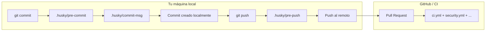
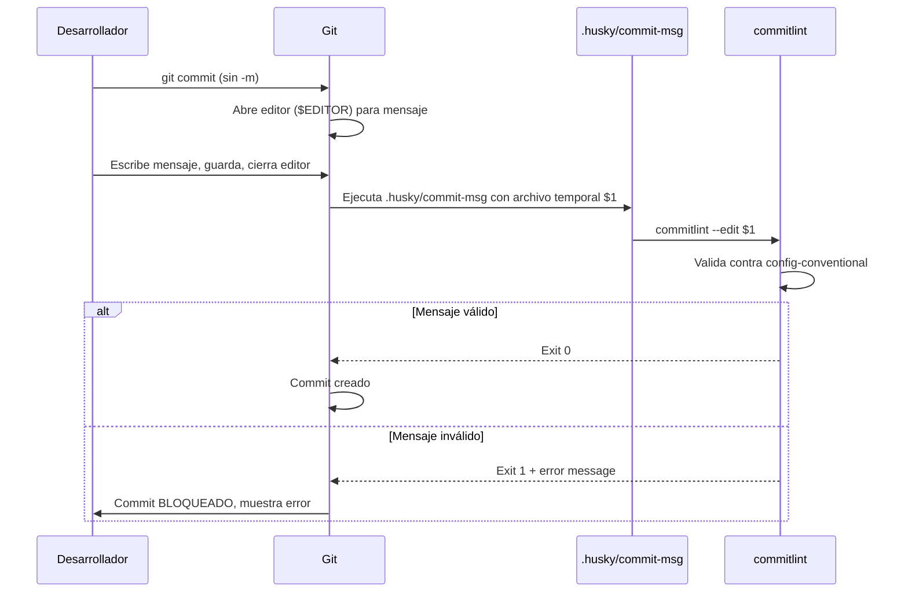
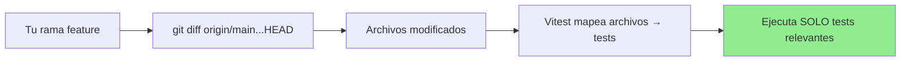

# 05 — Husky Git Hooks: Pre-commit, Commit-msg y Pre-push del Proyecto

> **Guía 05 de 6 del nivel Intermedio** | Prerequisitos: **Nivel Fundamentos completado (guías 00-04)** | Anterior: [intermedio-README.md](./intermedio-README.md) | Siguiente: [`06-ci-yml-walkthrough.md`](06-ci-yml-walkthrough.md)

---

## 🎯 Objetivos de aprendizaje

Al terminar esta guía, serás capaz de:

- ✅ **Explicar qué es un git hook** y cómo Husky los gestiona en el proyecto (`.husky/`)
- ✅ **Desglosar el hook `pre-commit`**: lint-staged (config en `package.json` raíz) → Semgrep + Gitleaks en paralelo con `&` + `wait`, captura de exit codes
- ✅ **Desglosar el hook `commit-msg`**: `commitlint --edit $1` y su relación con Conventional Commits (recordar [guía 01](./01-git-y-yaml.md))
- ✅ **Desglosar el hook `pre-push`**: `git fetch origin main --depth=1`, verificación de `origin/main`, y `vitest run --changed origin/main` para server y client (tests scoped)
- ✅ **Entender el gotcha del timeout de bash 120s**: commits `cf5e1bb` y `32d35a8`, falsos positivos, mitigación con `timeout 600 bash -c "git commit ..."`
- ✅ **Entender el baseline de Semgrep**: 19 findings pre-existentes no bloqueadores; el hook solo falla por findings **nuevos** en archivos staged
- ✅ **Explicar la config de lint-staged** en `package.json` (prettier + eslint con `--max-warnings 0` sobre archivos staged) y su contexto con [`docs/adr/turborepo-evaluation.md`](../../adr/turborepo-evaluation.md)

---

## 📋 Prerequisitos

1. ✅ **Nivel Fundamentos completado** — Entiendes CI/CD, Git+YAML, GitHub Actions base, secrets/variables, Docker básico
2. ✅ **Guía 01 (Git + YAML)** — Dominas flujo de ramas, Conventional Commits, Husky + commitlint básico, sintaxis YAML
3. ✅ **Conceptos de testing** — Sabes qué es Vitest y `vitest --changed` (guías 02, 04, y `docs/testing-architecture.md`)
4. ✅ **Terminal cómoda** — Entiendes `&` (background), `wait`, exit codes, pipes

> **Si no completaste Fundamentos:** Vuelve a [`./fundamentos-README.md`](./fundamentos-README.md) (nivel Fundamentos) y completa las guías 00-04. Este nivel **asume** esos conceptos y no los re-explica.

---

## 1. Teoría: ¿Qué es un Git Hook y cómo Husky los gestiona?

### 1.1 Git Hooks: Automatización en el ciclo de vida de Git

Un **git hook** (gancho de Git) es un **script que Git ejecuta automáticamente** en momentos específicos del ciclo de vida de un repositorio. No son configuración de GitHub Actions — corren **localmente en tu máquina** antes de que el código llegue al remoto.



| Hook           | Cuándo se ejecuta                                                   | Para qué sirve en este proyecto                                      |
| -------------- | ------------------------------------------------------------------- | -------------------------------------------------------------------- |
| **pre-commit** | Antes de crear el commit (tras `git commit`, antes de abrir editor) | Lint + format (staged) + SAST (Semgrep) + Secret scanning (Gitleaks) |
| **commit-msg** | Tras escribir el mensaje, antes de finalizar commit                 | Valida Conventional Commits via `commitlint`                         |
| **pre-push**   | Antes de enviar commits al remoto (`git push`)                      | Tests scoped (`vitest --changed origin/main`) server + client        |

> 💡 **Analogía**: Los hooks son como **controles de calidad en la fábrica** antes de que el producto salga por la puerta. `pre-commit` = control de calidad en la línea de montaje. `commit-msg` = verificación de la etiqueta del producto. `pre-push` = prueba de manejo antes de enviar al cliente.

---

### 1.2 Husky: El gestor de hooks moderno

**Husky** es una herramienta que instala y gestiona git hooks de forma declarativa. En lugar de escribir scripts en `.git/hooks/` (que no se versionan), Husky usa la carpeta `.husky/` en la raíz del repo, que **sí se versiona y comparte con el equipo**.

**Instalación en el proyecto** (ver `package.json` raíz, línea 26):

```json
{
  "scripts": {
    "prepare": "husky"
  }
}
```

Al hacer `npm install` (o `npm ci` en CI), el script `prepare` se ejecuta automáticamente y Husky:

1. Crea `.git/hooks/pre-commit` → apunta a `.husky/pre-commit`
2. Crea `.git/hooks/commit-msg` → apunta a `.husky/commit-msg`
3. Crea `.git/hooks/pre-push` → apunta a `.husky/pre-push`

> **Por qué `prepare`**: Es un lifecycle script de npm que corre **después** de `npm install` y **antes** de cualquier otro script. Garantiza que los hooks estén instalados en cualquier máquina que clone el repo y haga `npm install`.

---

### 1.3 Estructura de `.husky/` en el proyecto

```
.husky/
├── pre-commit      # 32 líneas: lint-staged → Semgrep + Gitleaks paralelo
├── commit-msg      # 1 línea: commitlint --edit $1
├── pre-push        # 22 líneas: git fetch + vitest --changed (server + client)
└── _/
    └── husky.sh    # Interno de Husky (no tocar)
```

**Archivos que versionas y editas**: `pre-commit`, `commit-msg`, `pre-push`.
**Archivo que NO tocas**: `.husky/_/husky.sh` (generado por Husky).

---

## 2. Walkthrough: Hook `pre-commit` — La Primera Línea de Defensa

### 2.1 Archivo completo: `.husky/pre-commit`

```bash
# Source: ../../../.husky/pre-commit
#!/usr/bin/env sh
# Pre-commit hook: lint-staged + SAST + Secrets (fast-only; regression moved to pre-push + CI)

set -e

echo "🔍 Running pre-commit checks..."

# 1. lint-staged first (fast, may modify files via autofix)
echo "🔧 Running lint-staged..."
npm exec lint-staged || { echo "❌ lint-staged failed"; exit 1; }

# 2. SAST + Secrets in parallel (fast-only pre-commit; regression moved to pre-push + CI)
echo "🔬 Starting SAST scan..."
npm run sast:semgrep &
SAST_PID=$!

echo "🔐 Starting secret detection..."
npm run security:secrets &
SECRETS_PID=$!

# Wait for all and capture exit codes
FAILED=0

wait $SAST_PID || { echo "❌ SAST scan failed."; FAILED=1; }
wait $SECRETS_PID || { echo "❌ Secret scan failed."; FAILED=1; }

if [ $FAILED -ne 0 ]; then
  echo "❌ Pre-commit checks failed. Commit blocked."
  exit 1
fi

echo "✅ All pre-commit checks passed (lint-staged, SAST, Secrets)."
```

---

### 2.2 Desglose paso a paso

| Sección                      | Qué hace                                     | Por qué así                                                                  |
| ---------------------------- | -------------------------------------------- | ---------------------------------------------------------------------------- |
| `#!/usr/bin/env sh`          | Shebang portable (funciona en sh, bash, zsh) | Compatibilidad cross-shell                                                   |
| `set -e`                     | Exit inmediato si cualquier comando falla    | Fail-fast: no continuar si hay error                                         |
| `npm exec lint-staged`       | Corre linters solo en archivos **staged**    | Velocidad: no lintorea todo el repo, solo lo que vas a commitear             |
| `npm run sast:semgrep &`     | Lanza Semgrep en **background** (`&`)        | Paralelismo: SAST y secrets corren a la vez                                  |
| `SAST_PID=$!`                | Captura PID del proceso background           | Para `wait` posterior y capturar exit code                                   |
| `npm run security:secrets &` | Lanza Gitleaks en **background**             | Paralelismo                                                                  |
| `wait $SAST_PID`             | Espera a que termine y captura su exit code  | Si falla, `FAILED=1` pero **espera al otro** también                         |
| `wait $SECRETS_PID`          | Idem para Gitleaks                           | Ambos corren a completion aunque uno falle                                   |
| `exit 1` si `FAILED=1`       | Bloquea el commit si cualquiera falló        | Calidad: no permite commit con lint errors, SAST findings nuevos, o secretos |

---

### 2.3 `lint-staged`: Config en `package.json` raíz

```json
// Source: ../../../package.json (líneas 84-87)
"lint-staged": {
  "*.{js,jsx,ts,tsx,cjs,mjs,json,jsonc,md}": "prettier --write",
  "*.{js,jsx,cjs,mjs}": "eslint --fix --max-warnings 0"
}
```

**Qué hace**:

1. **Prettier** --write: Formatea **todos** los archivos staged (JS, TS, JSON, MD, etc.)
2. **ESLint** --fix --max-warnings 0: Lint + autofix solo en archivos JS/JSX/CJS/MJS, **cero warnings permitidos**

> 📖 **Contexto**: Esta config existe porque el proyecto usa **npm workspaces nativo** (no Turborepo aún). Ver [`docs/adr/turborepo-evaluation.md`](../../adr/turborepo-evaluation.md) § "Problemática actual" — `lint-staged` es la solución actual para lint rápido en staged files. Si se migra a Turborepo, `turbo run lint` con cache inteligente podría reemplazar/paralelizar esto.

---

### 2.4 `npm run sast:semgrep` — SAST con Semgrep

```json
// Source: ../../../package.json (línea 55)
"sast:semgrep": "powershell -ExecutionPolicy Bypass -File scripts/security/semgrep-staged.ps1"
```

**⚠️ IMPORTANTE — Windows/Docker-céntrico**: Este comando ejecuta un **script PowerShell** que a su vez corre `docker run semgrep/semgrep:latest`.

**Qué significa para ti**:

- En **Windows (PowerShell)**: Funciona nativamente
- En **macOS/Linux/WSL**: **FALLARÁ** si no tienes PowerShell (`pwsh`) instalado **Y** Docker corriendo
- El hook pre-commit **no es cross-platform** por diseño — asume entorno con Docker + PowerShell

> 💡 **Si estás en macOS/Linux/WSL y el hook falla en `sast:semgrep`**: No es tu código. Es que `semgrep-staged.ps1` requiere `pwsh` + Docker. Opciones: (1) Instalar `pwsh` + Docker Desktop, (2) Saltar hook temporalmente con `git commit --no-verify` (solo emergencia), (3) Reportar al equipo para hacer el hook cross-platform.

**Semgrep baseline — 19 findings pre-existentes**:

- Semgrep reporta **19 findings** en el repo que son **baseline** (pre-existentes, no introducidos por tu cambio)
- **No son bloqueadores** — el hook está configurado para fallar **solo por findings nuevos en archivos staged**
- **No intentes "arreglar" los 19** a menos que se planifique un sprint dedicado de remediation
- Ver [`docs/workflows-mantenimiento-guia.md#8-mantenimiento-de-pre-commit-hooks-locales`](../../workflows-mantenimiento-guia.md#8-mantenimiento-de-pre-commit-hooks-locales) — "Semgrep baseline"

---

### 2.5 `npm run security:secrets` — Gitleaks en staged

```json
// Source: ../../../package.json (línea 57)
"security:secrets": "gitleaks protect --staged --verbose --redact --config .gitleaks.toml"
```

**Qué hace**: Escanea **solo archivos staged** (`--staged`) buscando patrones de secretos (API keys, passwords, tokens, etc.) usando config custom `.gitleaks.toml`.

**Flags clave**:

- `--staged`: Solo archivos en el index (rápido, no todo el historial)
- `--verbose`: Output detallado
- `--redact`: Oculta el valor del secreto en output (seguridad)
- `--config .gitleaks.toml`: Reglas custom del proyecto

> **Gitleaks bloquea ejemplos sintéticos**: Si escribes una variable tipo `secret` con un valor de 10+ chars en un archivo staged, Gitleaks lo detectará. **Usa placeholders inertes** como `<PLACEHOLDER>` en ejemplos de código.

---

### 2.6 Paralelismo con `&` + `wait` — Patrón Shell Avanzado

```bash
# Lanzar en background
npm run sast:semgrep &
SAST_PID=$!

npm run security:secrets &
SECRETS_PID=$!

# Esperar ambos y capturar exit codes
FAILED=0
wait $SAST_PID || { echo "❌ SAST scan failed."; FAILED=1; }
wait $SECRETS_PID || { echo "❌ Secret scan failed."; FAILED=1; }

if [ $FAILED -ne 0 ]; then exit 1; fi
```

**Por qué este patrón**:

- **`&`**: Lanza el proceso en background (no bloquea el shell)
- **`$!`**: Variable especial = PID del último proceso background
- **`wait $PID`**: Bloquea hasta que ese PID termine, **devuelve su exit code**
- **`|| { ...; FAILED=1; }`**: Si `wait` devuelve non-zero, ejecuta el bloque y marca fallo
- **Ambos `wait` se ejecutan**: Aunque el primero falle, el segundo **también se espera** (no "short-circuit") — quieres ver TODOS los errores, no solo el primero

> 📖 **Referencia**: [`docs/workflows-mantenimiento-guia.md#8-mantenimiento-de-pre-commit-hooks-locales`](../../workflows-mantenimiento-guia.md#8-mantenimiento-de-pre-commit-hooks-locales) — sección "Pre-commit hooks actuales"

---

## 3. Walkthrough: Hook `commit-msg` — Guardián de Conventional Commits

### 3.1 Archivo completo: `.husky/commit-msg`

```bash
# Source: ../../../.husky/commit-msg
commitlint --edit $1
```

**Una sola línea**. Toda la lógica está en `commitlint` y su config.

---

### 3.2 `commitlint.config.js` — Configuración real

```javascript
// Source: ../../../commitlint.config.js
const config = {
  extends: ['@commitlint/config-conventional'],
};

export default config;
```

**Qué hace**: Extiende la config estándar de [@commitlint/config-conventional](https://github.com/conventional-changelog/commitlint/tree/master/@commitlint/config-conventional). Valida:

- Tipo válido: `feat`, `fix`, `docs`, `chore`, `refactor`, `test`, `perf`, `ci`, `build`, `style`, `revert`
- Scope opcional entre paréntesis: `feat(auth): ...`
- Dos puntos + espacio obligatorios: `feat: ...` ✅ — `feat:...` ❌
- Descripción no vacía
- Breaking change válido: `feat!:` o footer `BREAKING CHANGE:`

---

### 3.3 Flujo: `git commit` → `commit-msg` hook



> **`$1`**: Es el **path al archivo temporal** que Git crea con tu mensaje de commit. `commitlint --edit` lee ese archivo, lo valida, y si pasa, el commit procede. Si falla, Git **no crea el commit**.

---

### 3.4 Ejemplos válidos/inválidos (recordar guía 01)

| Mensaje                                | ¿Pasa? | Por qué                                  |
| -------------------------------------- | ------ | ---------------------------------------- |
| `feat(auth): agregar login JWT`        | ✅     | Tipo válido, scope, descripción          |
| `fix: corregir typo en README`         | ✅     | Tipo válido, sin scope (ok), descripción |
| `chore(deps): actualizar dependencias` | ✅     | Tipo válido, scope, descripción          |
| `feat! : breaking change en API`       | ✅     | `!` breaking, espacio opcional           |
| `agregar login`                        | ❌     | Falta tipo                               |
| `feat(auth) agregar login`             | ❌     | Falta `:`                                |
| `feat(auth):`                          | ❌     | Descripción vacía                        |
| `invalid-type(auth): hacer algo`       | ❌     | Tipo no reconocido                       |

> **Tip**: Usa `git commit` **sin `-m`** para que se abra tu editor y puedas escribir mensaje multilínea con cuerpo y footer.

---

## 4. Walkthrough: Hook `pre-push` — Tests Scoped Antes de Push

### 4.1 Archivo completo: `.husky/pre-push`

```bash
# Source: ../../../.husky/pre-push
#!/bin/sh
set -e

# Fetch latest origin/main for accurate diff base
echo "Fetching latest origin/main..."
git fetch origin main --depth=1

# Check origin/main availability (safety net if fetch fails)
if ! git rev-parse --verify origin/main > /dev/null 2>&1; then
  echo "❌ origin/main not found locally."
  echo "   Run 'git fetch origin main' first, then push again."
  echo "   (If this persists, check your remote configuration.)"
  exit 1
fi

echo "Running scoped tests (server)..."
vitest run --changed origin/main --config apps/server/vitest.config.js || { echo "❌ Server scoped tests failed."; exit 1; }
echo "✅ Server scoped tests passed."

echo "Running scoped tests (client)..."
vitest run --changed origin/main --config apps/client/vitest.config.js || { echo "❌ Client scoped tests failed."; exit 1; }
echo "✅ Client scoped tests passed."
```

---

### 4.2 Desglose paso a paso

| Línea(s)                                                                 | Qué hace                                                      | Por qué                                                                            |
| ------------------------------------------------------------------------ | ------------------------------------------------------------- | ---------------------------------------------------------------------------------- | -------------------------------- | ------------------------------------------ |
| `git fetch origin main --depth=1`                                        | Trae solo el último commit de `origin/main` (shallow)         | Velocidad: no clona todo el historial, solo necesita el SHA base para `--changed`  |
| `git rev-parse --verify origin/main`                                     | Verifica que `origin/main` existe localmente tras fetch       | Safety net: si fetch falló (red, permisos), falla temprano con mensaje claro       |
| `vitest run --changed origin/main --config apps/server/vitest.config.js` | Ejecuta **solo tests afectados** por cambios vs `origin/main` | **Scoped tests**: feedback en segundos, no minutos. Config explícita por workspace |
| `                                                                        |                                                               | { echo "❌ ..."; exit 1; }`                                                        | Si tests fallan, bloquea el push | Calidad: no empujas código que rompe tests |

---

### 4.3 `vitest --changed origin/main` — Cómo funciona

**`--changed <commit>`** le dice a Vitest: _"Compara mi rama actual con `<commit>` y ejecuta solo los tests que tocan archivos modificados"_.



**En este proyecto**:

- **Server**: `--config apps/server/vitest.config.js` → busca `*.unit.test.js` y `*.integration.test.js` colocalizados
- **Client**: `--config apps/client/vitest.config.js` → busca `*.unit.test.js` y `*.ui.test.js` con Testing Library

> 📖 **Referencia**: [`docs/testing-architecture.md`](../../testing-architecture.md) § "Workspaces y Orquestación" — `npm run test:changed` usa el mismo principio. Ver también `package.json` línea 38: `"test:changed": "npm run test:changed --workspaces --if-present"`

---

### 4.4 Por qué `--depth=1` en `git fetch` (y no `fetch-depth: 0`)

En `pre-push`, **solo necesitas el SHA de `origin/main`** como base para el diff. Un shallow fetch (`--depth=1`) trae solo ese commit — es **rápido y suficiente**.

**Contraste con CI**: En `.github/workflows/ci.yml`, los jobs que usan `dorny/test-reporter` **necesitan historial completo** (`fetch-depth: 0`) porque el reporter debe encontrar el merge commit SHA del PR para adjuntar check runs. Ver guía 06 (Caso 2).

---

## 5. Gotcha: Timeout de Bash 120s — Falsos Positivos Reales

### 5.1 El problema

Durante los commits **`cf5e1bb`** y **`32d35a8`** (agosto 2026), la ejecución paralela de:

1. `lint-staged` (prettier + eslint)
2. `semgrep` (SAST via Docker + PowerShell)
3. `gitleaks` (secret scanning)

**superó el timeout por defecto de bash (120 segundos)**.

El hook fallaba con "exit 128" o "timeout" **falso positivo** — los checks eran correctos, solo necesitaban más tiempo en repos grandes.

> 📖 **Documentado en**: [`docs/workflows-mantenimiento-guia.md#8-mantenimiento-de-pre-commit-hooks-locales`](../../workflows-mantenimiento-guia.md#8-mantenimiento-de-pre-commit-hooks-locales) — sección "⚠️ TIMEOUT GOTCHA — bash default 120s"

---

### 5.2 Por qué pasa

| Factor                                              | Impacto                                                                        |
| --------------------------------------------------- | ------------------------------------------------------------------------------ |
| `semgrep` corre `docker run semgrep/semgrep:latest` | Pull de imagen (si no cached) + análisis = 30-60s                              |
| `gitleaks` escanea staged files                     | Rápido, pero se suma                                                           |
| `lint-staged` con autofix                           | Puede modificar archivos y re-escribir                                         |
| **Paralelismo `&` + `wait`**                        | Ambos corren a la vez, pero bash cuenta tiempo **wall-clock** del script padre |
| **Default bash timeout**                            | 120s (configurable via `TMOUT` o `timeout` comando)                            |

---

### 5.3 Mitigación: `timeout 600 bash -c "git commit ..."`

```bash
# En lugar de solo:
git commit -m "feat: mi cambio"

# Usa:
timeout 600 bash -c "git commit -m 'feat: mi cambio'"
```

**Qué hace**: Ejecuta el commit dentro de un subshell bash con **timeout de 600 segundos (10 minutos)**. Si el hook tarda más de 10 min, `timeout` lo mata — pero 10 min es **muy generoso** para pre-commit.

> **Alternativa**: Configurar `husky` con timeout mayor en config, pero `timeout` es más explícito y no requiere cambios en config compartida.

---

### 5.4 Lección práctica

> **Si tu commit falla con "timeout" o "exit 128" en pre-commit**:
>
> 1. **NO entres en pánico** — probablemente es falso positivo por timeout
> 2. Reintenta con `timeout 600 bash -c "git commit ..."`
> 3. Si pasa la segunda vez, era el timeout. Reporta al equipo para evaluar aumentar timeout por defecto.

---

## 6. Gotcha: Baseline de Semgrep — 19 Findings No Bloqueadores

### 6.1 Qué es el baseline

Al ejecutar `semgrep` en el repo completo, se detectan **19 findings pre-existentes** en archivos que **no están relacionados con tu cambio actual**.

Estos findings son **baseline** — existen desde antes, son conocidos, y **no son bloqueadores** para el commit.

---

### 6.2 Comportamiento del hook

El hook `pre-commit` ejecuta `semgrep` **solo en archivos staged** (via `semgrep-staged.ps1`).

- Si **tus archivos staged** introducen **nuevos findings** → hook **FALLA** (correcto)
- Si **tus archivos staged** no tienen findings nuevos → hook **PASA** (aunque el repo tenga 19 baseline en otros archivos)

> **No intentes "arreglar" los 19 findings baseline** a menos que se planifique un sprint dedicado de remediation. Son deuda técnica conocida, no tu responsabilidad en este commit.

---

### 6.3 Cómo verificar

```bash
# Ver todos los findings (incluyendo baseline)
npm run sast:semgrep:full

# Ver solo findings en staged (lo que hace el hook)
npm run sast:semgrep
```

> 📖 **Referencia**: [`docs/workflows-mantenimiento-guia.md#8-mantenimiento-de-pre-commit-hooks-locales`](../../workflows-mantenimiento-guia.md#8-mantenimiento-de-pre-commit-hooks-locales) — "Semgrep baseline"

---

## 7. Contexto: `lint-staged` y `docs/adr/turborepo-evaluation.md`

### 7.1 Por qué `lint-staged` existe en este proyecto

El ADR [`docs/adr/turborepo-evaluation.md`](../../adr/turborepo-evaluation.md) documenta la evaluación de migrar a **Turborepo** para cache inteligente de tasks.

**Estado actual (sin Turborepo)**:

- `npm run test` ejecuta **toda la suite desde cero** en cada push/PR
- No hay cache de resultados de tests entre runs
- Pre-push hook ejecuta `vitest --changed origin/main` pero **sin cache persistente** entre máquinas
- Desarrollo local: `npm run test` vuelve a correr tests que no cambiaron

**`lint-staged` es la solución actual** para lint rápido en staged files — corre solo lo que toca el commit, en segundos.

**Si se migra a Turborepo** (ADR Option A recomendada):

- `turbo run lint` detecta cambios, cache local + remote
- `turbo run test` paraleliza y cachea resultados
- `lint-staged` podría simplificarse o reemplazarse por `turbo run lint --filter=...`

> 📖 **Ver ADR completo**: [`docs/adr/turborepo-evaluation.md`](../../adr/turborepo-evaluation.md) — § "Problemática actual", "Recommendation: Option A — Turborepo"

---

## 8. Resumen: Lo que has aprendido

| Hook           | Archivo             | Qué hace                                               | Puntos clave                                                       |
| -------------- | ------------------- | ------------------------------------------------------ | ------------------------------------------------------------------ |
| **pre-commit** | `.husky/pre-commit` | lint-staged → Semgrep + Gitleaks paralelo              | `&` + `wait`, exit codes, baseline Semgrep 19, timeout 120s gotcha |
| **commit-msg** | `.husky/commit-msg` | `commitlint --edit $1`                                 | Valida Conventional Commits, config en `commitlint.config.js`      |
| **pre-push**   | `.husky/pre-push`   | `git fetch origin main --depth=1` → `vitest --changed` | Scoped tests server + client, shallow fetch suficiente             |

**Gotchas críticos**:

1. **Timeout bash 120s** → commits `cf5e1bb`/`32d35a8` → mitigar con `timeout 600`
2. **Semgrep baseline 19 findings** → no bloqueadores, solo falla por nuevos en staged
3. **Semgrep Windows/Docker-céntrico** → PowerShell + Docker, falla en macOS/Linux sin `pwsh`
4. **Gitleaks bloquea valores largos en variables tipo `secret`** → usa placeholders cortos (`<PLACEHOLDER>`) en ejemplos

---

## 9. Checklist de completitud: Guía 05

Antes de pasar a la siguiente guía, verifica que puedes:

- [ ] Explicar qué es un git hook y cómo Husky los gestiona (`.husky/` + `prepare: husky`)
- [ ] Desglosar `.husky/pre-commit` línea por línea: `set -e`, `lint-staged`, `&` + `wait`, captura exit codes
- [ ] Explicar `lint-staged` config en `package.json` (prettier + eslint `--max-warnings 0`)
- [ ] Explicar `npm run sast:semgrep`: PowerShell + Docker + Semgrep, Windows/Docker-céntrico
- [ ] Explicar `npm run security:secrets`: Gitleaks `--staged` con config `.gitleaks.toml`
- [ ] Explicar el patrón `&` + `wait` + captura de PIDs + exit codes
- [ ] Desglosar `.husky/commit-msg`: `commitlint --edit $1`, config `commitlint.config.js`
- [ ] Desglosar `.husky/pre-push`: `git fetch --depth=1`, verificación `origin/main`, `vitest --changed origin/main` (server + client)
- [ ] Explicar por qué `--depth=1` en pre-push vs `fetch-depth: 0` en CI
- [ ] Explicar el gotcha timeout bash 120s (commits `cf5e1bb`, `32d35a8`) y mitigación `timeout 600`
- [ ] Explicar el baseline Semgrep: 19 findings pre-existentes no bloqueadores
- [ ] Conectar `lint-staged` con `docs/adr/turborepo-evaluation.md` (solución actual vs futuro Turborepo)

Si tienes dudas en algún punto, relee la sección correspondiente. La guía 06 asume estos conceptos claros.

---

## 10. Ejercicios prácticos

### Ejercicio 1: Simula el flujo pre-commit

```bash
# 1. Haz un cambio en un archivo
echo "console.log('test')" >> apps/server/src/temp-test.js

# 2. Stagea
git add apps/server/src/temp-test.js

# 3. Intenta commit SIN mensaje convencional (debe fallar en commit-msg)
git commit -m "mensaje invalido"
# ¿Qué error muestra commitlint?

# 4. Ahora con mensaje válido
git commit -m "chore(test): agregar archivo temporal"
# ¿Pasa pre-commit? ¿Cuánto tarda?

# 5. Limpia
git rm apps/server/src/temp-test.js
git commit -m "chore(test): limpiar archivo temporal"
```

### Ejercicio 2: Entiende `vitest --changed`

```bash
# 1. Asegúrate de estar en una feature branch con commits vs origin/main
git log --oneline origin/main..HEAD

# 2. Corre tests scoped manualmente (server)
vitest run --changed origin/main --config apps/server/vitest.config.js

# 3. Corre tests scoped manualmente (client)
vitest run --changed origin/main --config apps/client/vitest.config.js

# 4. Compara tiempo vs test completo
time vitest run --config apps/server/vitest.config.js
time vitest run --changed origin/main --config apps/server/vitest.config.js
```

### Ejercicio 3: Diagnostica timeout falso positivo

```bash
# Si tu pre-commit tarda >120s y falla con exit 128:
# 1. Mide tiempo real
time git commit -m "test: commit"

# 2. Reintenta con timeout extendido
timeout 600 bash -c "git commit -m 'test: commit'"

# 3. Si pasa la 2da vez → era timeout falso positivo
# Reporta al equipo: "pre-commit timeout 120s false positive en repo grande"
```

### Ejercicio 4: Gitleaks con placeholder inerte

```bash
# 1. Crea archivo con "secreto" sintético que Gitleaks detectaría
echo 'const apiKey = "secret: abcdefghijklmnop"' > test-secret.js

# 2. Stagea e intenta commit
git add test-secret.js
git commit -m "test: gitleaks detection"
# ¿Falla? ¿Qué mensaje muestra Gitleaks?

# 3. Ahora con placeholder inerte
echo 'const apiKey = "secret: <...>"' > test-secret.js
git add test-secret.js
git commit -m "test: gitleaks placeholder inerte"
# ¿Pasa?

# 4. Limpia
git rm test-secret.js
git commit -m "chore: limpiar test gitleaks"
```

---

## ❓ Preguntas Frecuentes (FAQ)

### ¿Por qué el pre-commit usa PowerShell + Docker para Semgrep?

Porque Semgrep se distribuye oficialmente como **imagen Docker** (`semgrep/semgrep:latest`). El script `scripts/security/semgrep-staged.ps1` orquesta el `docker run` con los argumentos correctos (staged files, config, output). En Windows nativo, PowerShell es el shell estándar. En macOS/Linux/WSL, necesitas `pwsh` (PowerShell Core) instalado.

### ¿Puedo deshabilitar un hook temporalmente?

**Sí, pero solo en emergencia**:

```bash
# Saltar pre-commit + commit-msg
git commit --no-verify -m "fix: hotfix urgente"

# Saltar pre-push
git push --no-verify
```

> ⚠️ **Úsalo con extrema precaución**. Saltar hooks subvierte las quality gates del equipo. Si lo haces, **debes** correr los checks manualmente y crear un follow-up ticket para arreglar lo que causó el bloqueo.

### ¿Qué pasa si `origin/main` no existe en pre-push?

El hook tiene un safety net: verifica con `git rev-parse --verify origin/main`. Si falla, muestra mensaje claro:

```
❌ origin/main not found locally.
   Run 'git fetch origin main' first, then push again.
```

Ejecuta `git fetch origin main` y vuelve a intentar el push.

### ¿Por qué `--max-warnings 0` en ESLint?

**Cero tolerancia a warnings**. Un warning hoy es un error mañana. `--max-warnings 0` hace que ESLint falle si hay **cualquier** warning, forzando al equipo a mantener código limpio. Ver [`docs/code-style.md`](../../code-style.md) para estándares completos.

### ¿El hook pre-push corre TODOS los tests o solo los afectados?

**Solo los afectados** (`--changed origin/main`). Vitest calcula el diff entre `origin/main` y tu `HEAD`, mapea archivos modificados a tests, y ejecuta **solo esos tests**. Esto da feedback en **segundos** vs **minutos** de suite completa.

### ¿Cómo sé qué tests corrieron en pre-push?

La output de Vitest muestra:

```
RUN  v4.0.18 apps/server/vitest.config.js
  PASS  src/modules/events/service.unit.test.js (3 tests)
  PASS  src/modules/users/dao.unit.test.js (2 tests)
```

Solo lista los archivos de test que ejecutó. Si quieres ver el diff que usó: `git diff origin/main...HEAD --name-only`.

---

## 📖 Glosario: Git Hooks, Husky, lint-staged, Semgrep, Gitleaks

| Término                    | Definición                                                                                  |
| -------------------------- | ------------------------------------------------------------------------------------------- |
| **Git Hook**               | Script que Git ejecuta automáticamente en eventos (pre-commit, commit-msg, pre-push, etc.)  |
| **Husky**                  | Git hooks manager — instala hooks versionados en `.husky/` via `prepare: husky`             |
| **lint-staged**            | Herramienta que corre linters solo en archivos staged (index), no en todo el repo           |
| **Semgrep**                | SAST tool — análisis estático de código con 100+ reglas OWASP, corre via Docker             |
| **Gitleaks**               | Secret scanning — detecta credenciales, API keys, tokens en código                          |
| **commitlint**             | Validador de Conventional Commits — config extensible (`@commitlint/config-conventional`)   |
| **vitest --changed**       | Ejecuta solo tests afectados por cambios vs un commit base (scoped tests)                   |
| **Baseline**               | Findings pre-existentes conocidos, no bloqueadores para cambios nuevos                      |
| **Timeout falso positivo** | Fallo por límite de tiempo (bash default 120s) no por error real en checks                  |
| **`&` + `wait`**           | Patrón shell: lanza procesos en background (`&`), espera y captura exit codes (`wait $PID`) |
| **`$!`**                   | Variable shell: PID del último proceso lanzado en background                                |
| **`set -e`**               | Shell option: exit inmediato si cualquier comando falla (fail-fast)                         |

---

## ➡️ Siguiente Guía

▶️ **[`06-ci-yml-walkthrough.md`](06-ci-yml-walkthrough.md)** — Walkthrough profundo de `.github/workflows/ci.yml`: los 9 jobs (changes → quality → test-unit-client → test-unit-server → test-integration → test-smoke → build → e2e → zombie-guard), `dorny/paths-filter@v4` para path filtering, `concurrency` con `cancel-in-progress`, service container de PostgreSQL 16 con healthcheck, reporter JUnit con `dorny/test-reporter@v3` y el gotcha de `fetch-depth` (Caso 2) + Caso 1 `.nvmrc` SSOT.

---

## 🔙 Guía Anterior

> **[`./intermedio-README.md`](./intermedio-README.md)** — Índice del nivel Intermedio

---

## 🏠 Volver al Índice Fundamentos

> **[`./fundamentos-README.md`](./fundamentos-README.md)** — Roadmap completo y navegación (nivel Fundamentos: guías 00-04)

---

## 🧭 11. Flujo completo: del primer `git add` al `push` exitoso

Para consolidar, veamos los **tres hooks en secuencia** con un ejemplo real. Imagina que arreglas un bug en `apps/server/src/modules/users/dao.unit.test.js` y lo commiteas:

```mermaid
sequenceDiagram
    autonumber
    participant Dev as Tú
    participant Index as git index
    participant PC as pre-commit
    participant CM as commit-msg
    participant PP as pre-push
    participant Remote as origin/main

    Dev->>Index: git add apps/server/src/modules/users/dao.js
    Dev->>Dev: git commit -m "fix(users): null check en dao"
    Note over Dev,PC: 1️⃣ Dispara pre-commit
    Dev->>PC: ejecuta .husky/pre-commit
    PC->>PC: lint-staged → prettier --write + eslint --fix --max-warnings 0
    PC->>PC: Semgrep & + Gitleaks & (background)
    PC->>PC: wait $SAST_PID ; wait $SECRETS_PID
    alt cualquier check falla
        PC-->>Dev: ❌ Commit bloqueado (exit 1)
    else todos pasan
        PC-->>Dev: ✅ pre-commit OK
    end
    Note over Dev,CM: 2️⃣ Dispara commit-msg
    Dev->>CM: ejecuta .husky/commit-msg con $1 (archivo temporal del mensaje)
    CM->>CM: commitlint --edit $1 valida "fix(users): null check en dao"
    alt tipo/scope/descripción inválidos
        CM-->>Dev: ❌ "type must be one of [feat, fix, chore, ...]"
    else conforme a config-conventional
        CM-->>Dev: ✅ commit creado localmente
    end
    Dev->>Dev: git push origin feature/fix-users
    Note over Dev,PP: 3️⃣ Dispara pre-push
    Dev->>PP: ejecuta .husky/pre-push
    PP->>Remote: git fetch origin main --depth=1
    PP->>PP: verifica origin/main con git rev-parse
    PP->>PP: vitest run --changed origin/main --config apps/server/vitest.config.js
    alt tests afectados fallan
        PP-->>Dev: ❌ Push bloqueado
    else tests afectados pasan
        PP-->>Dev: ✅ Push al remoto
    end
    Remote->>Remote: commits subidos, abre/actualiza PR
```

**Observaciones clave del flujo**:

| Fase                              | Duración típica | Qué la haría fallar                                            |
| --------------------------------- | --------------- | -------------------------------------------------------------- |
| `pre-commit` (lint-staged)        | 2-5 s           | Error de sintaxis, estilo no re-formateable, warning de ESLint |
| `pre-commit` (Semgrep + Gitleaks) | 15-40 s         | SAST finding nuevo en staged · secreto detectado               |
| `commit-msg`                      | <1 s            | Mensaje no convencional                                        |
| `pre-push` (fetch + tests scoped) | 5-30 s          | `origin/main` no disponible · tests afectados fallan           |

> 💡 **Insight**: El pre-commit **no corre la suite completa de tests** — eso sería lento y repetiría trabajo de CI. La filosofía es **cercar el problema lo antes posible con el mínimo costo**: formato/tipos/secrets en pre-commit (rápido), tests afectados en pre-push (mediano), suite completa en CI (lento pero autoritativo).

---

## 🌍 12. Hooks en otros ecosistemas (contexto para no sorprenderte)

Los git hooks no son exclusivos de Husky ni de Node. Conocer el panorama te ayuda a entender **por qué Husky + lint-staged + commitlint** es la stack elegida aquí.

| Herramienta                | Ecosistema    | Cómo gestiona hooks                             | Comentario                                      |
| -------------------------- | ------------- | ----------------------------------------------- | ----------------------------------------------- |
| **Husky** (este repo)      | Node/JS       | Carpeta `.husky/` versionada + `prepare: husky` | Estándar de facto en JS moderno                 |
| **simple-git-hooks**       | Node/JS       | Config en `package.json`, sin carpeta versión   | Más simple, menos flexible                      |
| **lefthook**               | Node/polyglot | YAML config, paralelismo nativo                 | Alternativa con paralelismo first-class         |
| **pre-commit** (framework) | Python/multi  | `.pre-commit-config.yaml`, repos de hooks       | Estándar en Python; gestiona entornos virtuales |
| **.git/hooks/` raw**       | Cualquier git | Scripts sueltos en `.git/hooks/`                | **No se versiona** — por eso Husky existe       |

**¿Por qué este repo NO usa `pre-commit` (framework Python)?** Porque todo el toolchain ya es Node (npm scripts, Vitest, ESLint, Prettier, Semgrep via Docker). Añadir un gestor Python sumaría una dependencia de entorno extra. Husky se integra con `npm install` sin pasos manuales.

> 📖 **Referencia**: [`docs/workflows-mantenimiento-guia.md`](../../workflows-mantenimiento-guia.md) § "Elección del gestor de hooks" — justificación histórica de por qué se adoptó Husky sobre scripts raw `.git/hooks/`.

---

## 🔐 13. Profundización: Gitleaks y config custom `.gitleaks.toml`

El script `npm run security:secrets` invoca `gitleaks protect` con `--config .gitleaks.toml`. Ese archivo **extiende las reglas por defecto** con patrones específicos del proyecto. Entender su estructura te ayuda a diagnosticar falsos positivos:

```toml
# Estructura típica de .gitleaks.toml (resumen — ver archivo real en repo raíz)
title = "project-one custom rules"

[allowlist]
description = "paths/docs permitidos (no se escanean)"
paths = [
  '''docs/learning/ci-cd/.*\.md''',  # las guías mismas (ejemplos sintéticos)
  '''\.gitleaks\.toml''',
  '''package-lock\.json''',
]

[[rules]]
id = "custom-jwt-token"
description = "Detector de JWT hardcoded"
regex = '''eyJ[A-Za-z0-9-_=]+\.[A-Za-z0-9-_=]+\.?[A-Za-z0-9-_.+/=]*'''
secretGroup = 1
keywords = ["eyJ"]
```

**Tres comportamientos clave**:

1. **Allowlist de paths**: los markdown de las guías contienen ejemplos sintéticos (`secret: <...>`) que matchearían reglas. El `allowlist` los exime para que Gitleaks no bloquee tus propios commits a docs.
2. **Reglas custom + keywords**: cada `[[rules]]` define un `regex` + `keywords` (pre-filter rápido). Gitleaks primero filtra por `keywords` (barato) y solo entonces aplica el `regex` (caro).
3. **`secretGroup`**: índice del grupo de captura que contiene el "secreto" real — útil cuando el regex matchea una línea entera pero solo una parte es sensible.

> ⚠️ **Gotcha frecuente**: Si añades un ejemplo en una guía que NO esté en el `allowlist`, Gitleaks lo bloqueará aunque uses `<...>`. Solución: o bien agregas el path al `allowlist` (cambio en `.gitleaks.toml`), o bien usas valores tan cortos que no matcheen el mínimo de longitud de la regla.

---

## 🧪 14. Ejercicio integrador: diagnóstico combinado

Combina los tres gotchas (timeout, baseline, Windows/Docker) en un solo diagnóstico:

**Escenario**: Tu compañera en macOS hace `git commit` y ve:

```
🔍 Running pre-commit checks...
🔧 Running lint-staged...
🔬 Starting SAST scan...
npm ERR! missing script: sast:semgrep
❌ SAST scan failed.
❌ Pre-commit checks failed. Commit blocked.
```

**Guía de razonamiento** (inténtalo tú primero, luego lee):

1. **Síntoma**: `missing script: sast:semgrep`. NO es timeout (falló antes de empezar Semgrep). NO es baseline (no llegó a escanear).
2. **Causa raíz**: tu compañera está en macOS y `npm run sast:semgrep` ejecuta `scripts/security/semgrep-staged.ps1` — un PowerShell script. Si `pwsh` no está instalado o el `PATH` no lo expone, `npm` no encuentra el comando y reporta "missing script" (realmente falla el spawn del wrapper).
3. **Fix inmediato** (sin tocar config de equipo): `git commit --no-verify` para emergencias puntuales + abrir issue "pre-commit hook no cross-platform en macOS".
4. **Fix estructural**: migrar `semgrep-staged.ps1` a un script POSIX (`semgrep-staged.sh`) o usar `npx semgrep` directo, eliminando la dependencia de PowerShell. Esto es una decisión de equipo — **no lo hagas en un commit de feature**.

**Lección**: El mensaje de error rara vez apunta directo a la causa raíz. Separa **síntoma** (qué falló) → **causa** (por qué el comando falló) → **contexto** (qué condición del entorno lo causó) → **fix** (inmediato vs estructural).

---

## 📚 15. Lecturas complementarias (en el repo)

| Recurso                              | Para qué                                                   | Enlace                                                                           |
| ------------------------------------ | ---------------------------------------------------------- | -------------------------------------------------------------------------------- |
| `workflows-mantenimiento-guia.md` §8 | Hooks locales, baseline Semgrep, timeout gotcha            | [`../../workflows-mantenimiento-guia.md`](../../workflows-mantenimiento-guia.md) |
| `adr/turborepo-evaluation.md`        | Por qué `lint-staged` y no `turbo` (todavía)               | [`../../adr/turborepo-evaluation.md`](../../adr/turborepo-evaluation.md)         |
| `code-style.md`                      | Estándares que ESLint/`--max-warnings 0` hace obligatorios | [`../../code-style.md`](../../code-style.md)                                     |
| `testing-architecture.md`            | Pirámide de tests y `--changed` en profundidad             | [`../../testing-architecture.md`](../../testing-architecture.md)                 |
| `commitlint.config.js`               | Regla activa de Conventional Commits en el repo            | [`../../../commitlint.config.js`](../../../commitlint.config.js)                 |
| `.gitleaks.toml`                     | Reglas custom + allowlist de secret scanning               | [`../../../.gitleaks.toml`](../../../.gitleaks.toml)                             |

---

_Parte del cambio OpenSpec `learning-cicd-intermedio` — Nivel Intermedio, Guía 05 de 6_
