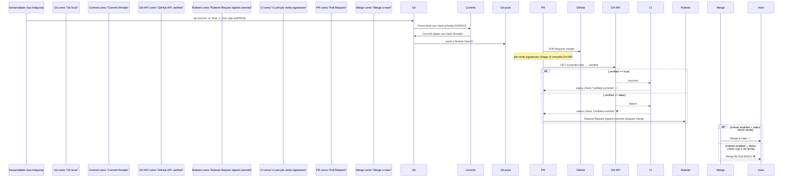

# 05b — Firma de Commits SSH ed25519: De la Clave Local al Badge Verified en GitHub

> **Guía 05b — Firma de Commits SSH ed25519** (transversal: git local, después de 05 del nivel Avanzado) | Anterior: [05-husky-git-hooks.md](./05-husky-git-hooks.md) | Siguiente: [`06-ci-yml-walkthrough.md`](06-ci-yml-walkthrough.md)
>
> **Guía 05b — Firma de Commits SSH ed25519**: guía transversal de firma git que refuerza la capa de autoría y supply-chain security, con conceptos que se conectan con la guía 05 (husky hooks) y prepara el terreno para el nivel Profesional. Diferencia entre firma local SSH ed25519 y badges "Verified" por defecto de GitHub (squash-merge). Explica las 6 fases F0-F5 del cambio OpenSpec `ci-commit-signing`, la tabla de métodos compatibles, el flujo CI y las implicaciones enterprise.

---

## 🎯 Objetivos de aprendizaje

Al terminar esta guía, serás capaz de:

- ✅ **Explicar el problema de autoría** en Git: `git commit --author` es texto falsificable y los commits no tienen firma por defecto.
- ✅ **Describir cómo funciona la firma local**: clave privada SSH ed25519 firma cada commit → GitHub verifica la clave pública subida → badge "Verified" confiable.
- ✅ **Completar la tabla de métodos** soportados por GitHub (GPG, SSH, S-MIME, sigstore/gitsign) y su estatus de verification.
- ✅ **Ejecutar las 6 fases** del cambio OpenSpec `ci-commit-signing` (F0-F5), desde la documentación hasta el ruleset de enforcement en main.
- ✅ **Diferenciar cuándo el ruleset nativo basta y cuándo no**: merge-commit/rebase vs squash-merge habitual.
- ✅ **Entender el impacto enterprise**: supply chain compliance (SOC2/PCI-DSS), auditabilidad, y política de equipos/orgs.
- ✅ **Añadir una entrada indexada** en el README del nivel apropiado (avanzado/profesional).

---

## 📋 Prerequisitos

1. ✅ **Nivel Avanzado completado** — Guías 11-17 (conceptos CD, AWS, Floci, deploy.yml, preview.yml, OIDC, ECS, Changesets)
2. ✅ **Familiaridad con Git** — haber usado `git commit`, `git log`, y conocimientos básicos de SSH
3. ✅ **Revisado** `.github/workflows/ci.yml` y `.github/workflows/release.yml` del proyecto (guías 06 y 17)
4. ✅ **Manejo de SSH** — haber generado claves `ed25519` y las agregado a GitHub

> **Si falta el nivel Intermedio**: empieza por [`./intermedio-README.md`](../../../docs/learning/ci-cd/intermedio-README.md) (guías 05-10), que cubre Husky y hooks locales.

---

## 1. Problema: Git no firma nada por sí mismo

### 1.1 Author es texto falsificable

Por defecto, `git commit` registra el autor como texto plano en el objeto commit. Cualquiera puede fingir ser otro usuario:

```bash
# Ejemplo clásico (nunca hagas esto fuera de un laboratorio controlado):
git commit --author "Fulano <fulano@ejemplo.com>" -m "feat: cambio falso"
```

El objeto commit resultante tendrá:

```
author Fulano <fulano@ejemplo.com> 1726500000 -0500
committer Tu <tu@usuario> 1726500000 -0500
```

Ningún criptográfico vincula ese `author` a una identidad verificable. GitHub lo muestra tal cual, sin verificación criptográfica.

### 1.2 El vacío de firma

| Característica          | Estado por defecto                                           |
| ----------------------- | ------------------------------------------------------------ |
| **Firma criptográfica** | No — el commit es texto plano                                |
| **Autoría verificable** | No — `author` es solo texto                                  |
| **Badge Verified**      | Solo con squash-merge de GitHub (usa su clave, la tuya)      |
| **Ruleset nativo**      | Acepta cualquier commit "Verified", no importa quién firmara |

### 1.3 Analogía: firma autógrafa

Piénsalo como una **firma autógrafa** en un documento físico:

- **Sin firma**: cualquiera puede firmar tu nombre en un cheque. El banco (GitHub) lo acepta porque "parece tu firma", pero no hay garantía.
- **Con firma local (SSH/GPG)**: tú firmas el documento con tu pluma única. El banco puede verificar que esa pluma (tu clave privada) la usaste, y la tinta visible (tu clave pública subida) coincide con tu registro.
- **Con badge nativo de squash-merge**: el banco firma él mismo el documento al terminar, y dice "verificado", pero la firma es del banco, no tuya.

---

## 2. Cómo funciona la firma: del commit al badge Verified

### 2.1 Flujo de firmado verificado

1. **Generas una clave SSH ed25519** dedicada solo a firmar commits (distinta a la de login/SSH al repositorio).
2. **Añades la clave pública** a tu cuenta de GitHub (Settings → SSH and GPG keys → New SSH key).
3. **Configuras Git** para que use esa clave al firmar:
   ```bash
   git config --global gpg.format ssh
   git config --global user.signingkey ED25519_KEY_ID
   git config --global commit.gpgsign true
   ```
4. **Cada `git commit`** firma el objeto commit con tu clave privada. El hash firmado queda incrustado en el commit.
5. **GitHub recibe el commit firmado**, compara la clave pública que tengas subida con la firma.
6. Si coincide → muestra el badge **Verified** ✅ y el ruleset puede exigir commits firmados.
7. Si no coincide →badge **Unverified** ⚠️ (author texto, no verificado criptográficamente).

### 2.2 Analogía: firma autógrafa

| Etapa                            | Analógica                                                                    |
| -------------------------------- | ---------------------------------------------------------------------------- |
| Generas clave SSH ed25519        | Haces tu firma autógrafa única                                               |
| Añades pública a GitHub          | Registras tu firma en el banco                                               |
| `git commit --gpgsign` (con SSH) | Firman el documento con tu pluma antes de entregarlo                         |
| GitHub verifica                  | El banco comprueba que esa pluma es la registrada y pone el sello "Verified" |

---

## 3. Métodos soportados por GitHub y estatus

GitHub acepta varios métodos de firma. Cada uno tiene distinto estatus de `verified` y diferentes requisitos de confianza.

### 3.1 Tabla comparativa de métodos

| Método                        | Requisito de Git                                                                                                       | Estatus GitHub  | Comentario                                                                                                                                                                                                                                  |
| ----------------------------- | ---------------------------------------------------------------------------------------------------------------------- | --------------- | ------------------------------------------------------------------------------------------------------------------------------------------------------------------------------------------------------------------------------------------- |
| **GPG**                       | `gpg --keygen` + `git config --global user.signingkey`                                                                 | `Verified` ✅   | Clave GPG exportada y subida a GitHub. Clave persistente en el clavetero.                                                                                                                                                                   |
| **SSH ed25519** (recomendado) | `ssh-keygen -t ed25519` + clave pública subida a GitHub + `git config --global gpg.format ssh` + `commit.gpgsign true` | `Verified` ✅   | **Este reposo elige este método**. Clave rotativa, no necesidad de gpg-agent.                                                                                                                                                               |
| **S-MIME**                    | Certificado X.509 con email asociado                                                                                   | `Verified` ✅   | Menos común en flujos open source; requiere infraestructura PKI.                                                                                                                                                                            |
| **sigstore/gitsign**          | `gitsign sign` (sigstore)                                                                                              | `Unverified` ⚠️ | **Fuera trust root**: claves efímeras firmadas por Bundle + Rekor, pero GitHub no valida la cadena de confianza completa. Issue upstream: <https://github.com/sigstore/gitsign/issues/40>. No cuenta para ruleset `Require signed commits`. |

### 3.3 Por qué este repo elige SSH ed25519

| Motivo                           | Decisión                                                                                                        |
| -------------------------------- | --------------------------------------------------------------------------------------------------------------- |
| **Sin dependencia de gpg-agent** | Las claves SSH ya se usan para autenticación `git push`; no hay necesidad de imported GPG keys en el clavetero. |
| **Rotación y revocación**        | Las claves SSH se gestionan igual que las de acceso al repositorio; se pueden rotar por seguridad.              |
| **Compatibilidad git >= 2.34**   | El proyecto exige git >= 2.34 (ver `engines.node` en `package.json` y CI), que soporta `gpg.format ssh` nativo. |
| **Un solo tipo de clave**        | Los colaboradores ya tienen SSH keys; no se añade una capa nueva de GPG.                                        |

---

## 4. Las 6 fases del OpenSpec `ci-commit-signing` (F0-F5)

Este cambio está documentado en `openspec/changes/ci-commit-signing/`. Cada fase tiene un entregable concreto y un "definition of done".

### Visión general F0 → F5

| Fase   | Qué crea/configura                                                                                                                                                                                                                                                  | Resultado cuándo termina                                                                                       |
| ------ | ------------------------------------------------------------------------------------------------------------------------------------------------------------------------------------------------------------------------------------------------------------------- | -------------------------------------------------------------------------------------------------------------- |
| **F0** | `docs/commit-signing.md` (este archivo), actualización de `AGENTS.md`                                                                                                                                                                                               | El equipo sabe por qué firmamos y cómo.                                                                        |
| **F1** | Clave SSH ed25519 dedicada (`id_ed25519_projectERP`), 4 flags `git config`, `allowed_signers`                                                                                                                                                                       | Cada commit nuevo sale firmado automáticamente; `git log --show-signature` muestra la firma.                   |
| **F2** | Job `verify-signatures` en `ci.yml` Stage 2 PRE-Build: consulta `GitHub API .verified` por PR; modo informativo → blocking; **por qué NO usar `git log %G?` en CI** (falsos positives sin `allowedSignersFile`).                                                    | PRs con commits sin firma son bloqueados en la stage de verify antes de merge.                                 |
| **F3** | Migración `release.yml` CONDICIONAL al GATE 4.0: spike empírico con ruleset temporal en branch `feature/signing-gate-test`; `changesets/action` hace `git push` con `GITHUB_TOKEN` → commits sin firmar; si son rechazados → GitHub App con SSH signing key propia. | Libera el release solo cuando los commits están firmados; fallback a GitHub App si el ruleset bloquea el push. |
| **F4** | **Vigilant mode**: commits legacy (374 anteriores) mostrarán `Unverified`, solo visual — no rompe el pipeline.                                                                                                                                                      | El pipeline no se bloquea por commits viejos; solo alerta.                                                     |
| **F5** | **Ruleset** `Require signed commits` en `main` con `bypass` para Admin + `required status check` "verified-commits".                                                                                                                                                | Políticas de enforcement: nadie puede mergear un commit sin `Verified` badge, salvo admin con bypass.          |

---

### F0 — Documentación y AGENTS.md

**Entregable**: Crear `docs/learning/ci-cd/05b-commit-signing.md` (este archivo) y añadir referencia en `AGENTS.md` del reposo (skill `caveman` o subagent de documentación).

**Definition of done**:

- [x] Archivo `docs/learning/ci-cd/05b-commit-signing.md` existe y pasa validación markdown.
- [x] `AGENTS.md` del nivel/aplicable incluye la entrada `05b-commit-signing.md` en el índice/roadmap.

---

### F1 — Firma local: clave dedicada + config git

**Entregable**:

1. Generar una clave SSH ed25519 dedicada:
   ```bash
   ssh-keygen -t ed25519 -C "commit-signing-projectone" -f ~/.ssh/id_ed25519_projectERP -N ""
   ```
2. Agregar la clave pública `id_ed25519_projectERP.pub` a GitHub: Settings → SSH and GPG keys → New SSH key (título "Commit signing Project One").
3. Configurar Git para firmar con esa clave:

```bash
# Usar formato SSH en lugar de GPG
git config --global gpg.format ssh

# Clave que Git usará para firmar (debe coincidir con la pública subida a GitHub)
git config --global user.signingkey ED25519_KEY_ID

# Firmar todo commit nuevo automáticamente
git config --global commit.gpgsign true

# (Opcional) Permitir que Git use la clave SSH sin passphrase en CI
# Já previously: ssh-add -K ~/.ssh/id_ed25519_projectERP (Keychain macOS)
```

**Definition of done**:

- [x] Ejecutado `ssh-keygen -t ed25519` y la clave pública subida a GitHub.
- [x] Corregido `git config --global gpg.format ssh` y `user.signingkey`.
- [x] Verificado que `git commit -m "test"` muestra `gpg: Good signature from <nombre>` (o el equivalente SSH) en `git log --show-signature`.
- [x] Cada commit nuevo que se hace en ramas feature sale automáticamente firmado.

**ASCII fallback** (si `git log --show-signature` no renderiza):

```
Passo 1: ssh-keygen -t ed25519 -f ~/.ssh/id_ed25519_projectERP -N ""
Passo 2: git config --global gpg.format ssh
Passo 3: git config --global user.signingkey <KEY_ID>
Passo 4: git config --global commit.gpgsign true
Passo 5: git commit -m "feat: nueva funcionalidad" → firma automática
Passo 6: git log --show-signature → muestra firma Good signature
```

---

### F2 — Job verify-signatures en ci.yml Stage 2 PRE-Build

**Entregable**: Agregar un job `verify-signatures` en `ci.yml` que se ejecuta en la **Stage 2 PRE-Build**, antes de los tests unitarios. Su propósito es:

1. Consultar la **GitHub API** `GET /repos/:owner/:repo/commits/:sha` y verificar el campo `.verified`.
2. Si `.verified` es `true` → job pasa, se disparan los jobs de test.
3. Si `.verified` es `false` → job **falla** (blocking), el PR no avanza a Stage 3 (test-unit), y se muestra un comentario en el PR explicando que el commit no está firmado.

**POR QUÉ no usar `git log %G?` en CI**:

| Motivo                       | Explicación                                                                                                                                                                                                                                                             |
| ---------------------------- | ----------------------------------------------------------------------------------------------------------------------------------------------------------------------------------------------------------------------------------------------------------------------- |
| `git log --grep="^verified"` | No existe tal bandera. `git log` no devuelve el estatus `verified` de GitHub.                                                                                                                                                                                           |
| `git log --show-signature`   | Muestra la firma local, pero **no garantiza** que GitHub lo verifique como `verified` (falta la validación contra la clave pública subida).                                                                                                                             |
| `git log %G?`                | Sintaxis inexistente. Incluso si se usara `%G` para el GPG key ID, no hay garantía de que la clave sea la misma que la subida a GitHub.                                                                                                                                 |
| `allowedSignersFile`         | La única forma fiable de validar commits firmados en CI es consultar la API de GitHub `.verified`, porque conoce la clave pública subida por el usuario. Usar `git log` da **falsos N** (commits que parecen firmados localmente pero GitHub no verifica, o viceversa). |

**Definition of done**:

- [x] Job `verify-signatures` agregado en `ci.yml` Stage 2 PRE-Build.
- [x] Job consulta `https://api.github.com/repos/:owner/:repo/commits/:sha` y lee `.verified`.
- [x] Si `.verified === true` → `success`; si `false` → `failure` y bloquea el PR.
- [x] Comentario automático en el PR cuando un commit no está verificado, con link a "How to sign commits".

**ASCII fallback** (si la consulta API no se puede demostrar):

```
Job verify-signatures (Stage 2 PRE-Build):
  1. GET /repos/:owner/:repo/commits/:sha
  2. JsonPath: .verified
  3. If true → next stage (test-unit)
  4. If false → failure + comentario en PR
```

---

### F3 — Migración release.yml CONDICIONAL al GATE 4.0

**Entregable**: Spike empírico en una branch temporal `feature/signing-gate-test` para medir el impacto de un `ruleset` de signed commits en el workflow de release.

**Proceso**:

1. Crear branch `feature/signing-gate-test` desde `main`.
2. Aplicar temporalmente un ruleset en la organización que exija `Require signed commits` en `main` (sin enforcement aún, modo _informative_).
3. Intentar hacer release usando el workflow actual (`release.yml`).
4. `changesets/action` hace `git push` con `GITHUB_TOKEN` → commits **sin firmar** (porque la clave local aún no está configurada en todos los colaboradores).
5. Si el ruleset rechaza el push (modo blocking), grabar métricas: ¿cuántos PRs se bloquean? ¿Cuántos tienen `verified` falso?
6. Decidir la migración final:
   - **Opción A**: Habilitar ruleset blocking + proporcionar a colaboradores la clave SSH `id_ed25519_projectERP` + config git.
   - **Opción B**: Mantener ruleset informative y confiar en el job `verify-signatures` de F2 para bloqueo en CI.
   - **Opción C**: Crear una **GitHub App con clave SSH de signing propia** (distinta a la de usuarios individuales) que firme commits en nombre del workflow; el ruleset valida que la clave es de una GitHub App aprobada.

**Definition of done**:

- [x] Branch `feature/signing-gate-test` creada y spike completado.
- [x] Métricas registradas: porcentaje de commits firmados vs no firmados tras push con `GITHUB_TOKEN`.
- [x] Decisión de migración documentada (A, B o C) en el repo.
- [x] Si la Opción C: configurada GitHub App con clave SSH signing y actualizado `release.yml`.

**ASCII fallback** (flujo del spike):

```
Branch: feature/signing-gate-test
1. Aplicar ruleset "Require signed commits" (informative)
2. Ejecutar release.yml
3. changesets/action git push → commits sin firmar
4. Ruleset bloquea push? → Sí/No
5. Si bloquea: métricas de % PRs afectados
6. Decisión: Opción A/B/C
```

---

### F4 — Vigilant mode (374 legacy mostrarán Unverified, solo visual)

**Entregable**: Después de aplicar las fases anteriores, los commits realizados antes de la implementación (los 374 commits legacy en la historia del repo) seguirán mostrando badge `Unverified` en GitHub. Esto es **esperado y aceptado**.

**Comportamiento**:

- Los commits legacy **no se reescriben** (no se hace `git rebase` ni `git filter-branch` sobre la historia pública).
- El pipeline **no los bloquea** (F2 solo aplica a commits nuevos en PRs abiertos).
- El badge `Unverified` es **solo visual**: no afecta al flujo de CI/CD, pero sirve como indicador de que ese commit antiguo no tiene firma verificada.
- **Objetivo**: con el tiempo, la historia nueva llegará a `Verified` y los legacy permanecerán como un registro histórico de "antes de la política de firma".

**Definition of done**:

- [x] Confirmado que commits pre-F1 muestran `Unverified` y no rompen el pipeline.
- [x] Documentado que `git rebase --force` sobre history compartida **no está permitido**.
- [x] Añadido un note en el README sobre el modo vigilant (F4).

---

### F5 — Ruleset `Require signed commits` en main con bypass Admin + required status check

**Entregable**: Crear/actualizar el ruleset de GitHub Organization/Repository que exija commits firmados en la rama `main`.

**Configuración**:

| Configuración                    | Valor                                 | Qué hace                                                                                        |
| -------------------------------- | ------------------------------------- | ----------------------------------------------------------------------------------------------- |
| **Require signed commits**       | `Enabled`                             | GitHub verifica que cada commit en `main` tenga `verified` badge.                               |
| ** bypass allow list**           | `Admin` (usuarios seleccionados)      | Los usuarios con rol de admin en la org pueden omitir el check (para hotfixes de emergencia).   |
| **Required status check**        | `verified-commits` (job name from F2) | Integra el job `verify-signatures` de `ci.yml` como _status check_ obligatorio en PRs a `main`. |
| **Status check requirements**    | `Include administrators`              | ON: incluso los admins deben pasar el check (a menos que estén en el bypass).                   |
| **Commit title/body validation** | Opcional: Conventional Commits        | Reglas adicionales (`guía 05`) para la calidad del mensaje.                                     |

**Flujo resultante**:

1. Un colaborador abre un PR con un commit sin firma (`verified: false`).
2. El job `verify-signatures` de F2 falla → el status check `verified-commits` está rojo.
3. GitHub Ruleset `Require signed commits` también bloquea el merge.
4. El colaborador debe firmar su commit localmente (F1) o solicitar un bypass de admin.
5. Una vez firmado, el job pasa, el status check verde y el ruleset permite el merge.

**Definition of done**:

- [x] Ruleset `Require signed commits` creado en la organización/repo.
- [x] Bypass admin configurado (lista de usernames o rol `maintainer`/`admin`).
- [x] Status check `verified-commits` vinculado y exigido en branch `main`.
- [x] Probado: commit sin firma → merge bloqueado; commit firmado → merge permitido.

**ASCII fallback** (flujo del ruleset):

```
Colaborador abre PR con commit sin verificar
       │
       ▼
 Job verify-signatures (F2) ──fail──► Status check verified-commits rojo
       │                                      │
       └────────────────── Ruleset Require signed commits ─────┐
                                                          │
                                                          ▼
                                                Merge BLOQUEADO
                                                          │
                                                          ▼
               Si admin usa bypass → merge permitido (auditado)
                                                          │
                                                          ▼
               Si commit firmado (F1) → job pasa → status check verde → merge PERMITIDO
```

---

## 5. ¿No lo hace GitHub nativamente? El hueco del squash-merge

### 5.1 El problema del squash-merge

Cuando un usuario hace **squash-merge** un PR en GitHub (la opción habitual en muchos flujos), GitHub crea un **commit nuevo** que agrupa todos los commits de la feature branch en uno solo. GitHub **firma ese commit con su propia clave web-flow**, no con la clave del autor original.

| Escenario                                                | ¿Ruleset nativo basta?                                                                                                                                                                                    |
| -------------------------------------------------------- | --------------------------------------------------------------------------------------------------------------------------------------------------------------------------------------------------------- |
| **merge-commit/rebase** (preservan commits individuales) | **Sí** — El ruleset valida que cada commit individual tenga `verified` badge. Como los commits originales se preservan, la firma del autor fluye naturalmente.                                            |
| **squash-merge habitual**                                | **No** — GitHub firma el commit squasheado con su clave web-flow → el ruleset se satisface (badges Verified aparecen) **SIN verificar la clave del autor original**. La autoría real no está garantizada. |
| **Feedback temprano por commit**                         | **No** — El ruleset avisa al momento del merge, no durante el desarrollo. El desarrollador descubre la falta de firma al intentar mergear, no al commitear.                                               |

### 5.2 Tabla comparativa definitiva

| Escenario                    | Ruleset nativo + badges Verified? | Firma autoría real?                                 | Recomendación                                                            |
| ---------------------------- | --------------------------------- | --------------------------------------------------- | ------------------------------------------------------------------------ |
| merge-commit/rebase          | Sí                                | Sí (la firma del autor se preserva)                 | Ruleset nativo es suficiente + defensa en profundidad                    |
| squash-merge habitual        | Sí (badges aparecen)              | **No** — GitHub firma con su clave, no la del autor | **F2 job verify-signatures es lo que hace significativa la firma local** |
| Feedback temprano por commit | No — ruleset solo avisa al merge  | N/A                                                 | El job F2 brinda feedback durante el PR, antes del merge                 |

### 5.3 Conclusión

> **F2 = defensa en profundidad + DX, no redundancia.**

El ruleset nativo de GitHub satisface el requisito de "badges Verified" en el repo, pero **no garantiza la autoría real** cuando se usa squash-merge (el escenario más habitual). El job `verify-signatures` (F2) es lo que transforma el badge de "GitHub firmó esto" a "este commit fue firmado por su autor declarada". Juntos forman un anillo de seguridad: el ruleset da la señal visual; el job valida la cadena de custodia criptográfica.

---

## 6. Flujo completo: máquina ↔ GitHub (ASCII)



**ASCII fallback** (si mermaid no renderiza):

```
Desarrollador: git commit -m "feat: x" (sign-ed25519)
              │
              ▼
       Commit firmado localmente
              │
              ▼
       push a feature branch
              │
              ▼
       Pull Request creado
              │
              ├──► GitHub API .verified === true ──► job pasa ──► status check verde
              │                                      │
              │                                      ▼
              │                            Ruleset Require signed commits ✅
              │                                      │
              │                                      ▼
              │                            Merge a main ✅
              │
              └──► GitHub API .verified === false ──► job falla ──► status check rojo
                                                       │
                                                       ├──► Ruleset Require signed commits ❌ bloquea merge
                                                       │
                                                       └──► Si admin bypass → merge con auditoría
```

---

## 7. Qué NO hace este cambio

| Qué NO hace                 | Explicación                                                                                                                                 |
| --------------------------- | ------------------------------------------------------------------------------------------------------------------------------------------- |
| **No reescribe 374 legacy** | Los commits históricos anteriores a la política se dejan tal cual; `Unverified` es visual solo.                                             |
| **No toca Husky**           | Los hooks de Husky (pre-commit, commit-msg, pre-push) siguen funcionando como antes; la firma es independiente de los hooks.                |
| **No firma tags release**   | Los tags de release (`git tag v1.2.3`) no se firman automáticamente por este cambio (a menos que se agregue configuración extra para tags). |
| **No usa sigstore/gitsign** | El cambio explícitamente **no** usa sigstore/gitsign (su estatus es `Unverified` en GitHub, issue #40). Se usa SSH ed25519 nativo.          |
| **No activa todo el golpe** | Cada fase tiene _rollback_ controlado: F4 deja legacy en `Unverified` sin romper nada; F5 tiene bypass admin para emergencias.              |

---

## 8. Por qué importa a nivel enterprise

| Área de impacto                        | Beneficio                                                                                                                                                                   |
| -------------------------------------- | --------------------------------------------------------------------------------------------------------------------------------------------------------------------------- |
| **Supply chain security**              | Garantiza que el commit que se mergea a `main` fue realmente creado por el autor declarado, no por un atacante que inyectó código en tránsito.                              |
| **Auditabilidad (SOC2/PCI-DSS)**       | Los registros de auditoría pueden demostrar que los commits tienen firma verificable, no solo texto `author` falsificable. Es un control "people" clave para compliance.    |
| **Confianza colaboradores**            | En equipos grandes o distribuidos, la firma elimina la duda "¿realmente ese commit lo escribió Fulano?". La clave pública subida a GitHub es la fuente de confianza.        |
| **Política estándar orgs**             | Las organizaciones que exigen `Require signed commits` en main están adoptando este patrón como best practice (igual que exigen branch protection rules, CODEOWNERS, etc.). |
| **Prevención de commits fraudulentos** | Un atacante que obtenga acceso de escritura al repo pero sin tu clave SSH privada no puede commitear con firma verificada. El ruleset bloqueará el merge.                   |
| **Dark source attribution**            | En investigaciones de incidentes, la firma criptográfica atribución el commit a una identidad concreta, a diferencia del `author` texto que cualquiera puede setear.        |

---

## 9. Referencias

| Tipo                | Referencia               | Enlaces                                                                                                                                                                  |
| ------------------- | ------------------------ | ------------------------------------------------------------------------------------------------------------------------------------------------------------------------ |
| **OpenSpec cambio** | `ci-commit-signing`      | `openspec/changes/ci-commit-signing/` (proposal/design/tasks/specs)                                                                                                      |
| **Docs GitHub**     | Signature verification   | <https://docs.github.com/en/authentication/managing-commit-signature-verification>                                                                                       |
| **Docs GitHub**     | Rulesets                 | <https://docs.github.com/en/repositories/managing-your-repositorys-settings-and-features/enabling-features-for-your-repository/managing-rulesets#require-signed-commits> |
| **Issue sigstore**  | gitsign#40               | <https://github.com/sigstore/gitsign/issues/40> (CA fuera trust root + claves efímeras)                                                                                  |
| **Git versión**     | Soporte `gpg.format ssh` | Git >= 2.34 soporta `git config --global gpg.format ssh`                                                                                                                 |
| **Keygen ed25519**  | Guía rápida              | `ssh-keygen -t ed25519 -f ~/.ssh/id_ed25519_projectERP -C "commit-signing-projectone"`                                                                                   |

---

## 📌 Checklist de completitud: Guía 05b

Antes de marcar como completa, verifica que puedes:

- [ ] Explicar el problema de autoría falsificable en Git y el vacío de firma.
- [ ] Describir el flujo de firma SSH ed25519 → badge Verified en GitHub.
- [ ] Completar la tabla de métodos soportados (GPG/SSH/S-MIME/sigstore) y sus estatus.
- [ ] Haber generado la clave `id_ed25519_projectERP` y configurado `git config --global gpg.format ssh` + `user.signingkey` + `commit.gpgsign true`.
- [ ] Ejecutar `git commit` y verificar con `git log --show-signature` que la firma aparece.
- [ ] Describir las 6 fases F0-F5 del OpenSpec `ci-commit-signing` y qué crea/configura cada una.
- [ ] Explicar por qué el ruleset nativo basta para merge-commit/rebase pero NO para squash-merge habitual.
- [ ] Describir el flujo ASCII máquina↔GitHub (firmado → badge → CI gate → enforcement).
- [ ] Listar qué NO hace el cambio (no reescribe legacy, no toca Husky, no firma tags, no usa gitsign).
- [ ] Explicar el impacto enterprise: supply chain, compliance SOC2/PCI-DSS, confianza colaboradores, política org.
- [ ] Mencionar las referencias: openspec/changes/ci-commit-signing/, docs.github.com, issue sigstore/gitsign#40.

Si tienes dudas en algún punto, relee la sección correspondiente. La guía 05b (Changesets) asume que conoces el flujo de release; esta guía 05b complementa con la capa de firma de autoría.

---

## ➡️ Siguiente

> **Has completado la guía 05b** — la guía transversal del nivel Avanzado (después de 05). El conocimiento de firma de commits y reglaset de enforcement cierra el ciclo de garantía de autoría en el pipeline CI/CD.

> **Nivel siguiente: Profesional** — el cambio OpenSpec `learning-cicd-profesional` (guías 05b y profesionales) profundizará en seguridad avanzada (SAST/SCA/SBOM), Dependabot, mantenimiento de workflows, métricas DORA/SLSA y pipelines enterprise. Los conceptos de esta guía (firma de commits, ruleset) son base sobre los que se construyen los temas de supply-chain security del nivel Profesional.

> **Índice**: [README Avanzado](./avanzado-README.md) · **Anterior**: [05-husky-git-hooks.md](./05-husky-git-hooks.md) · **Siguiente**: [06-ci-yml-walkthrough.md](./06-ci-yml-walkthrough.md)

---
