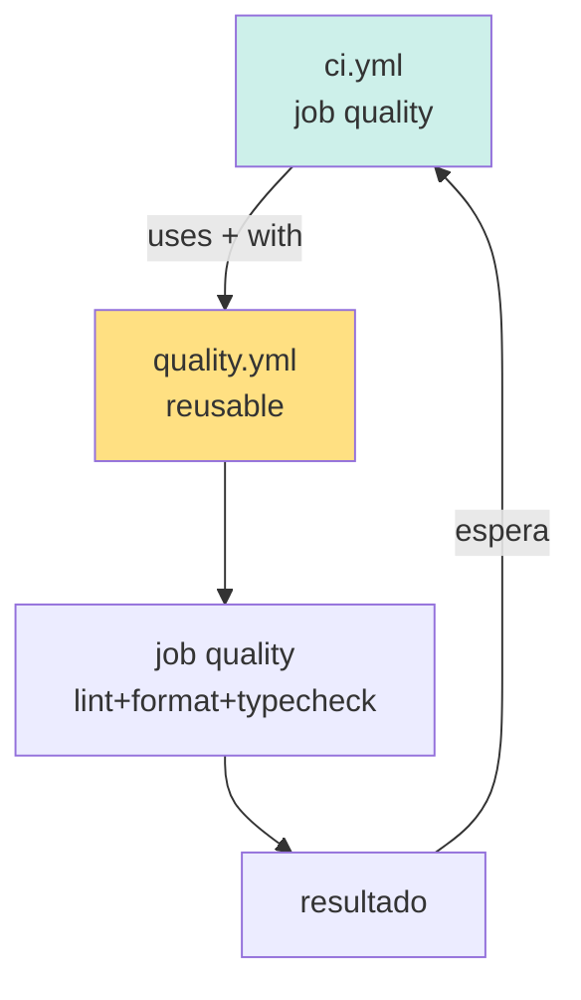

# 07 — Workflows Reutilizables: Walkthrough de `quality.yml`

> **Guía 07 de 6 del nivel Intermedio** | Prerequisitos: **Fundamentos (00-04) + Guía 05 (Husky) + Guía 06 (`ci.yml`)** | Anterior: [`06-ci-yml-walkthrough.md`](./06-ci-yml-walkthrough.md) | Siguiente: [`08-composite-actions.md`](./08-composite-actions.md)

---

## 🎯 Objetivos de aprendizaje

Al terminar esta guía, serás capaz de:

- ✅ **Explicar qué es un workflow reutilizable** y para qué sirve `workflow_call`
- ✅ **Desglosar `.github/workflows/quality.yml` línea por línea**: triggers, inputs, job único, steps condicionales por workspace
- ✅ **Mostrar cómo `ci.yml` invoca `quality.yml`** con `uses: ./.github/workflows/quality.yml` + `with:` pasando inputs
- ✅ **Distinguir reusable workflow vs composite action** (tabla comparativa) y saber cuándo usar cada uno
- ✅ **Diagnosticar el gotcha D8 — typecheck silenciado** (`npm run typecheck || echo "Typecheck skipped"`) y por qué sigue activo (al ago 2026)

---

## 📋 Prerequisitos

1. ✅ **Fundamentos completado (00-04)** — sabes qué es un workflow, job, step, trigger
2. ✅ **Guía 05 (Husky)** — entiendes hooks locales
3. ✅ **Guía 06 (`ci.yml`)** — viste cómo el job `quality` invoca `quality.yml` con `uses:` y `with:`, adelanto de esta guía
4. ✅ **npm workspaces** — sabes qué es `--workspace=<name>` y `--workspace=<path>`

> **Si no hiciste la guía 06**: vuelve a [`./06-ci-yml-walkthrough.md`](./06-ci-yml-walkthrough.md) y lee el job `quality` (sección 4). Es el punto de entrada conceptual a esta guía.

---

## 1. Teoría: ¿Qué es un workflow reutilizable y por qué `workflow_call`?

### 1.1 El problema que resuelve

Imagina que tienes 5 workflows (`ci.yml`, `deploy.yml`, `preview.yml`, `release.yml`, `scheduled-security.yml`) y todos necesitan ejecutar la misma secuencia:

```
checkout → setup-node (.nvmrc) → npm ci → lint → format:check → typecheck
```

**Sin reutilización**, copiarías esos steps en cada workflow → 5 copias idénticas. Cuando una cambia (p. ej. actualizar `setup-node`), debes editar 5 archivos → drift inevitable.

### 1.2 La solución: `workflow_call`

Un **workflow reutilizable** (reusable workflow) es un archivo `.github/workflows/*.yml` que se invoca desde **otros workflows** en vez de ejecutarse por su propio trigger. Se declara con el trigger `workflow_call`:

```yaml
on:
  workflow_call:
    inputs:
      run-client:
        required: true
        type: string
```

Otros workflows lo invocan con `uses:` (no `run:`):

```yaml
- job:
    uses: ./.github/workflows/quality.yml # invoca reusable
    with:
      run-client: 'true' # pasa inputs
```

GitHub arranca el workflow reutilizable **como un run separado** (con su propio log) y el caller espera su resultado.

### 1.3 Anatomía de un reusable workflow



| Elemento                 | Rol                                                                             |
| ------------------------ | ------------------------------------------------------------------------------- |
| `workflow_call` en `on:` | Habilita el workflow para ser invocado                                          |
| `inputs`                 | Contrato de parámetros que el caller debe pasar                                 |
| `uses:` en el caller     | Invoca el reusable (igual que con una action, pero apunta a un workflow `.yml`) |
| `with:` en el caller     | Pasa valores a los `inputs`                                                     |
| Run separado             | El reusable corre en su propio run con su propio log                            |

> 💡 **Analogía**: un reusable workflow es como una **función** en un lenguaje de programación. La firma son los `inputs`. El cuerpo es el `jobs:`. El caller (otro workflow) la "llama" con `uses:` + `with:`. Igual que una función, encapsula lógica reutilizable y centraliza mantenimiento.

---

## 2. Walkthrough: `.github/workflows/quality.yml` completo

```yaml
# Source: ../../../.github/workflows/quality.yml (64 líneas totales)
name: Code Quality

on:
  workflow_dispatch:
  workflow_call:
    inputs:
      run-client:
        required: true
        type: string
      run-server:
        required: true
        type: string

permissions:
  contents: read

jobs:
  quality:
    name: Lint + Format Check + TypeCheck
    runs-on: ubuntu-latest
    timeout-minutes: 15

    steps:
      - name: Checkout
        uses: actions/checkout@v5

      - name: Setup Node
        uses: actions/setup-node@v5
        with:
          node-version-file: '.nvmrc'
          cache: 'npm'
          cache-dependency-path: package-lock.json

      - name: Install Dependencies (workspace root)
        run: npm ci

      # =========================
      # CLIENT
      # =========================
      - name: Client Lint
        if: inputs.run-client == 'true'
        run: npm run lint --workspace=apps/client

      - name: Client Format Check
        if: inputs.run-client == 'true'
        run: npm run format:check --workspace=apps/client

      # =========================
      # SERVER
      # =========================
      - name: Server Lint
        if: inputs.run-server == 'true'
        run: npm run lint --workspace=apps/server

      - name: Server Format Check
        if: inputs.run-server == 'true'
        run: npm run format:check --workspace=apps/server

      # =========================
      # GLOBAL TYPECHECK (si aplica) Typescript
      # =========================
      - name: Type Check
        run: npm run typecheck || echo "Typecheck skipped"
```

### 2.1 Triggers: `workflow_call` + `workflow_dispatch`

```yaml
on:
  workflow_dispatch:
  workflow_call:
    inputs:
      run-client:
        required: true
        type: string
      run-server:
        required: true
        type: string
```

Dos triggers:

| Trigger             | Cuándo corre                                                      | Quién invoca              |
| ------------------- | ----------------------------------------------------------------- | ------------------------- |
| `workflow_call`     | Cuando otro workflow hace `uses: ./.github/workflows/quality.yml` | `ci.yml` job `quality`    |
| `workflow_dispatch` | Cuando alguien hace clic en "Run workflow" en GitHub UI           | Humano (debugging manual) |

> 💡 **Por qué ambos**: `workflow_call` es el contrato de reutilización (producción). `workflow_dispatch` te permite **correrlo a mano** sin tener que abrir un PR — útil para debuggear un fallo de lint aislado.

### 2.2 Inputs: `run-client` / `run-server`

```yaml
inputs:
  run-client:
    required: true
    type: string
  run-server:
    required: true
    type: string
```

- **`required: true`**: el caller **debe** pasarlos (no tienen default).
- **`type: string`**: son strings (`'true'` o `'false'` — no booleanos nativos). GitHub Actions evalúa `inputs.run-client == 'true'` comparando strings.

El caller (`ci.yml`) los pasa con `with:`:

```yaml
# Source: ../../../.github/workflows/ci.yml (job quality)
quality:
  name: Code Quality
  needs: changes
  uses: ./.github/workflows/quality.yml
  with:
    run-client: ${{ needs.changes.outputs.frontend }}
    run-server: ${{ needs.changes.outputs.backend }}
```

`needs.changes.outputs.frontend` es `'true'` o `'false'` (output de `dorny/paths-filter`). Se asigna directo al input `run-client` de `quality.yml`.

> ⚠️ **Tipos de inputs**: GitHub solo soporta `string`, `boolean`, `number`. Aquí se usó `string` (no `boolean`) para que el valor de `paths-filter` (que produce strings) calce sin conversión. Si fuera `boolean`, el caller tendría que convertir el string a booleano con `${{ needs.changes.outputs.frontend == 'true' }}`.

### 2.3 `permissions: contents: read`

Igual que `ci.yml` raíz — mínimo privilegio. El job de quality no necesita escribir check runs (no usa `test-reporter`), así que no eleva `checks: write`.

### 2.4 Job único: `quality`

```yaml
jobs:
  quality:
    name: Lint + Format Check + TypeCheck
    runs-on: ubuntu-latest
    timeout-minutes: 15
```

A diferencia de `ci.yml` (9 jobs), `quality.yml` tiene **un solo job** que ejecuta lint + format + typecheck en secuencia. La separación por workspace se logra con `if:` condicionales en cada step, no con jobs separados.

**`timeout-minutes: 15`**: mata el job si tarda más de 15 min (safety contra hangs).

### 2.5 Steps: checkout

```yaml
- name: Checkout
  uses: actions/checkout@v5
```

**Sin `fetch-depth: 0`** (default 1, shallow). ¿Por qué? `quality.yml` **no usa `dorny/test-reporter`** → no necesita merge commit SHA → shallow es suficiente y más rápido.

> 📖 **Contraste con guía 06**: los jobs de `ci.yml` que sí reportan (`test-unit-*`, integration, smoke, e2e) **sí** necesitan `fetch-depth: 0`. El job `quality` no. Decisión consciente, no "por si acaso".

### 2.6 Setup Node: `.nvmrc` SSOT + cache npm

```yaml
- name: Setup Node
  uses: actions/setup-node@v5
  with:
    node-version-file: '.nvmrc'
    cache: 'npm'
    cache-dependency-path: package-lock.json
```

- **`node-version-file: '.nvmrc'`**: lee la versión de `.nvmrc` — patrón Caso 1 EBADENGINE (guía 06 sección 11). **No** hardcodea `node-version: 22.23.1`.
- **`cache: 'npm'`**: habilita cache de `~/.npm` (descargas de paquetes).
- **`cache-dependency-path: package-lock.json`**: el hash de este archivo genera la key del cache. Si cambian deps, cache-miss → reinstall. Ver guía 09 (caching profundo).

### 2.7 `npm ci`

```yaml
- name: Install Dependencies (workspace root)
  run: npm ci
```

- **`npm ci`** (no `npm install`): instala **exactamente** lo declarado en `package-lock.json`, sin modificar lockfile. Determinista — CI reproducible.
- **Sin `--workspace`**: instala en la raíz, lo que en un monorepo con `workspaces` declarados en `package.json` trae también las dependencias de **todos** los workspaces (`apps/client`, `apps/server`). Suficiente para luego correr `npm run lint --workspace=...`.

### 2.8 Steps condicionales por workspace

```yaml
- name: Client Lint
  if: inputs.run-client == 'true'
  run: npm run lint --workspace=apps/client

- name: Client Format Check
  if: inputs.run-client == 'true'
  run: npm run format:check --workspace=apps/client

- name: Server Lint
  if: inputs.run-server == 'true'
  run: npm run lint --workspace=apps/server

- name: Server Format Check
  if: inputs.run-server == 'true'
  run: npm run format:check --workspace=apps/server
```

**Patrón**: cada step lleva `if: inputs.run-<workspace> == 'true'` → solo corre si el caller dice que ese workspace tiene cambios. Así el reusable es **selectivo** sin duplicar jobs por workspace.

> 📖 **Naming discrepancy honesta**: estos steps usan `--workspace=apps/client` y `--workspace=apps/server` (paths filesystem), **distinto** de `ci.yml` que usa `--workspace=client-react` y `--workspace=server-express` (nombres). `npm` acepta **ambos** (resolve por nombre o por path). Es deuda técnica de naming del repo — no es un bug, pero es inconsistencia a documentar en su momento.

### 2.9 Gotcha D8: typecheck silenciado

```yaml
# Source: ../../../.github/workflows/quality.yml (líneas 60-64)
# =========================
# GLOBAL TYPECHECK (si aplica) Typescript
# =========================
- name: Type Check
  run: npm run typecheck || echo "Typecheck skipped"
```

**Qué hace la línea 64**:

1. Ejecuta `npm run typecheck` (script raíz que tipicamente ejecuta `tsc --noEmit` en ambos workspaces).
2. **`|| echo "Typecheck skipped"`**: si `npm run typecheck` falla (exit code non-zero), el `||` (OR lógico del shell) ejecuta `echo "Typecheck skipped"` (exit code 0) → el **step pasa** aunque el typecheck haya fallado.

**El gap (D8)**: el typecheck **NO bloquea el workflow** cuando falla. Se enmascara como "skipped" en el log. Un PR que rompe tipos puede pasar CI sin que nadie note.

**Estado actual (verificación ago 2026)**: el spec del cambio `learning-cicd-intermedio` task 8.6 decía _"si `ci-security-hardening` aterrizó y des-suprimió el typecheck, actualizar la guía 07"_. Verifiqué `quality.yml` línea 64 hoy: **sigue con `|| echo "Typecheck skipped"`**. El cambio `ci-security-hardening` (archivado 2026-08-06) **NO** des-suprimió el typecheck.

**Por qué sigue** (hipótesis razonable): el typecheck actual probablemente falla con findings pre-existentes (deuda técnica en `apps/client` o `apps/server`). Des-suprimirlo a ciegas rompería CI. Necesita primero un sprint de remediación de type errors → cuando se arregle, se quita el `|| echo`. **Es un gap conocido, documentado y deferido — no un bug activo a arreglar en un commit de feature.**

> 📖 **Referencia**: marca del comment `# GLOBAL TYPECHECK (si aplica) Typescript` refleja la intención: "typecheck corre **si aplica**" (no bloquea). Cuando se migre a un modelo que sí bloquee, eliminar el `|| echo "Typecheck skipped"` y asegurar que `npm run typecheck` pasa limpio.

### 2.10 Cómo diagnosticar el estado real

```bash
# Verifica presence del silenciamiento
grep -n 'Typecheck skipped' .github/workflows/quality.yml

# Ejecuta typecheck local para ver si falla
npm run typecheck
# Si retorna non-zero, ese es el motivo del || echo (deuda type)

# Para ver history de cuándo se añadió el || echo
git log -S 'Typecheck skipped' -- .github/workflows/quality.yml
```

---

## 3. Invocación desde `ci.yml` (repaso de la guía 06)

```yaml
# Source: ../../../.github/workflows/ci.yml (job quality)
quality:
  name: Code Quality
  needs: changes
  uses: ./.github/workflows/quality.yml
  with:
    run-client: ${{ needs.changes.outputs.frontend }}
    run-server: ${{ needs.changes.outputs.backend }}
```

| Línea                                                     | Rol                                                   |
| --------------------------------------------------------- | ----------------------------------------------------- |
| `needs: changes`                                          | Espera al detector de cambios del PR                  |
| `uses: ./.github/workflows/quality.yml`                   | Invoca el reusable (`./` = repo local)                |
| `with: run-client: ${{ needs.changes.outputs.frontend }}` | Pasa output del job `changes` como input `run-client` |

Cuando esto corre, GitHub arranca un **run separado** de `quality.yml` con el log aislado. El job `quality` de `ci.yml` espera su resultado (`success`/`failure`) y lo refleja en el checks del PR.

### 3.1 Ejecución manual con `workflow_dispatch`

```bash
# Desde la GitHub UI:
# Actions tab → "Code Quality" → Run workflow → elegir branch → Run
```

O vía `gh` CLI:

```bash
gh workflow run quality.yml --ref <branch>
```

Esto sirve para debuggear un fallo de lint **aislado** sin tener que abrir un PR y tocar archivos.

---

## 4. Diferenciación crítica: reusable workflow vs composite action

| Criterio                    | Reusable workflow                                                        | Composite action                                                             |
| --------------------------- | ------------------------------------------------------------------------ | ---------------------------------------------------------------------------- |
| **Dónde vive**              | `.github/workflows/<name>.yml`                                           | `.github/actions/<name>/action.yml`                                          |
| **Cómo se invoca**          | `uses: ./.github/workflows/<name>.yml`                                   | `uses: ./.github/actions/<name>` (sin `.yml`)                                |
| **Trigger requerido**       | `workflow_call` en `on:`                                                 | Ninguno (`runs.using: composite` en el archivo)                              |
| **¿Tiene su propio run?**   | ✅ Sí, run separado con log propio                                       | ❌ No, se ejecuta **dentro** del job invocador                               |
| **Inputs**                  | `inputs` bajo `workflow_call`                                            | `inputs` a nivel raíz de `action.yml`                                        |
| **¿Quién hace `checkout`?** | El reusable hace **su propio checkout** (es workflow completo)           | La composite **NO** hace checkout — el job invocador debe hacerlo ANTES      |
| **¿Escala `permissions`?**  | Sí (puede tener su propio `permissions:`)                                | No (hereda del job invocador)                                                |
| **Costo**                   | Más pesado (run separado, log aparte)                                    | Más ligero (misma ejecución del job)                                         |
| **Cuándo usar**             | Lógica peso-mediano, invocada por múltiples workflows, con su propio log | Setup compartido entre steps de un mismo job (checkout + setup-node + cache) |

### 4.1 Ejemplos del repo

| Ejemplo                     | Tipo                  | Por qué esta elección                                                                                                      |
| --------------------------- | --------------------- | -------------------------------------------------------------------------------------------------------------------------- |
| `quality.yml`               | **Reusable workflow** | Invocado por `ci.yml` y `workflow_dispatch`, con su propio run para aislar log de lint                                     |
| `setup-monorepo/action.yml` | **Composite action**  | Setup Node + `npm ci` + cache Vitest — se invoca desde 6 jobs de `ci.yml` dentro de su propio job (no necesita run aparte) |

### 4.2 La fila clave: "¿quién hace `checkout`?"

Esta es la sutileza que más confunde a quienes migran de un patrón al otro:

| Mecanismo                               | `checkout` ocurre...                                                                           |
| --------------------------------------- | ---------------------------------------------------------------------------------------------- |
| **Reusable workflow** (`quality.yml`)   | **Dentro** del reusable: `uses: actions/checkout@v5` como primer step del job propio           |
| **Composite action** (`setup-monorepo`) | **Fuera** de la composite: el job invocador hace `checkout@v5` y **luego** invoca la composite |

Si una composite intenta hacer `checkout`, y el job invocador **también** lo hizo → doble checkout → `dorny/test-reporter` falla con exit 128 (Caso 2 de `docs/workflows-mantenimiento-guia.md`). Esta es la lección del **Caso 2** graficada con composites — ver guía 08 ([`08-composite-actions.md`](./08-composite-actions.md)) para el walkthrough completo.

> 💡 **Mnemotecnia**: **"workflow completo = checkout propio; composite = fragmento = checkout ajeno"**.

---

## 5. Gotchas prácticos de reusable workflows

### 5.1 Los `inputs` son strings (no booleans) por defecto

```yaml
# ❌ Esto falla si pasas 'false' como string:
if: inputs.run-client   # 'false' (string) es truthy!

# ✅ Comparación explícita:
if: inputs.run-client == 'true'
```

Si declaras `type: boolean`, el caller debe pasar `${{ var == 'true' }}`. La convención del repo (string) evita el paso de conversión.

### 5.2 El reusable hereda `permissions` del caller si no las define

Si `quality.yml` no declarara `permissions: contents: read`, heredaría las del caller (`ci.yml`). Como `ci.yml` también tiene `contents: read`, no hay diferencia aquí — pero si `ci.yml` tuviera `checks: write` (no la tiene a nivel raíz, solo en jobs), se heredaría confusamente. **Siempre declarar `permissions:` en el reusable** para que sea autónomo.

### 5.3 Los secrets no pasan automáticamente

Un reusable **no hereda `secrets` del caller** por defecto. Hay que pasarlos explícitamente:

```yaml
with:
  run-client: 'true'
secrets:
  AWS_ROLE_ARN: ${{ secrets.AWS_ROLE_ARN }}
```

En `quality.yml` no hace falta (no usa secrets), pero si añadieras un step que sube a S3, debes pasar `secrets:` en el caller.

> 📖 **Referencia**: [`docs/workflows-mantenimiento-guia.md`](../../../docs/workflows-mantenimiento-guia.md) § "Maintenance of reusable workflows" — gotchas de propagación de secrets y permisos.

### 5.4 Límite de anidamiento: 4 niveles

GitHub **permite** que un reusable invoque a otro reusable hasta **4 niveles** de anidamiento (pero en práctica se recomienda 1). Si necesitas reutilizar dentro de reutilizar, considera **composite actions** en su lugar (las composites sí pueden anidarse libremente).

---

## 6. Ejercicios prácticos

### Ejercicio 1: Traza un PR solo-client que invoca `quality.yml`

PR toca solo `apps/client/src/App.tsx` → `ci.yml` job `changes` outputs `frontend=true`, `backend=false`. Job `quality` invoca `quality.yml` con `run-client: 'true'`, `run-server: 'false'`. En `quality.yml`:

- `Client Lint` ✅ corre (`inputs.run-client == 'true'`)
- `Client Format Check` ✅ corre
- `Server Lint` ❌ se salta (`inputs.run-server == 'false'`)
- `Server Format Check` ❌ se salta
- `Type Check` ✅ corre (no condicional)

### Ejercicio 2: Debug manual con `workflow_dispatch`

```bash
# Lanza quality.yml a mano en tu branch
gh workflow run quality.yml --ref feature/tu-branch

# Ve el run
gh run watch
```

¿Sirve para qué? Para debuggear un fallo de lint **sin** abrir un PR.

### Ejercicio 3: Detecta si el typecheck está silenciado

```bash
grep -n '|| echo' .github/workflows/quality.yml
# Si ves "Typecheck skipped", el silenciamiento D8 sigue activo
```

### Ejercicio 4: Crea un reusable hipotético `deploy-checks.yml`

Diseña (en un archivo de prueba) un reusable con:

- `workflow_call` trigger
- 2 inputs: `environment` (string), `dry-run` (boolean)
- 1 job que haga `echo "Deploying to ${{ inputs.environment }} (dry-run: ${{ inputs.dry-run }})"`

Invócalo desde un workflow `test.yml` propio:

```yaml
jobs:
  test:
    uses: ./.github/workflows/deploy-checks.yml
    with:
      environment: 'staging'
      dry-run: true
```

---

## 7. 🛠️ Troubleshooting de quality.yml (problemas comunes y su diagnóstico)

Esta sección es tu **manual de campo** para cuando algo sale mal con un reusable workflow. Cada caso describe el síntoma, la causa raíz y el procedimiento de diagnóstico paso a paso. La filosofía: **nunca adivines — verifica con logs y con `gh`**.

### 7.1 El check `quality` no aparece en un PR solo-client

**Síntoma**: abres el PR, ves los checks de `ci.yml` (9 jobs), pero el check `quality` no está en la lista.

**Causa raíz**: no es que `quality.yml` fallara — es que **no se disparó**. Revisa qué desencadenó el PR:

```yaml
# .github/workflows/quality.yml (fragmento de triggers)
on:
  workflow_call:
    inputs: ...
  workflow_dispatch:
```

El trigger `workflow_call` solo se activa cuando **alguien lo invoca** con `uses:`. Si el caller (`ci.yml`) no lo invoca en ese path (p. ej. el PR solo tocó `docs/` y el job `quality` del caller tiene un `if:` que lo omite), el reusable nunca arranca.

**Diagnóstico**:

1. `gh run list --branch <rama>` — mira si el run del caller se creó.
2. Dentro del run, expande el job que invoca el reusable: ¿el step con `uses: ./.github/workflows/quality.yml` se **saltó** (icono de salto) o se **omitió** (gris)?
3. Si se saltó, busca el `if:` del job o step en el caller: `if: contains(needs.changes.outputs.client, 'true')`.

### 7.2 El step de lint del server corre aunque no tocaste server

**Síntoma**: en un PR que solo cambia `apps/client`, el step `Lint server` de `quality.yml` **igual corrió**.

**Causa raíz**: el step condicional usa el **input** `run-server`, y el caller lo pasa mal. Recuerda el gotcha de la sección 5.1: **los inputs son strings**, no booleans. Compara:

```yaml
# ❌ Incorrecto — 'server' no es un output del job 'changes' (el real es 'backend'); el input queda vacío
with:
  run-server: ${{ needs.changes.outputs.server }}

# ✅ Correcto — patrón real del repo (ci.yml job quality): output 'backend' del job 'changes'
with:
  run-server: ${{ needs.changes.outputs.backend }}
```

**Diagnóstico**: en el run, expande el step `Lint server` → muestra el `if:` evaluado. Si el valor del input quedó `false` (no `'true'`), el step no debería correr. Si el `if:` no está, el step corre siempre por diseño (¿es eso lo que quieres?).

### 7.3 Ves "Typecheck skipped" en el log y no sabes si falló

**Síntoma**: el log muestra `Typecheck skipped` y el check pasó (verde). ¿Falló o no?

**Causa raíz**: es el gotcha **D8** (sección 2.9). `npm run typecheck || echo "Typecheck skipped"` devuelve exit code 0 aunque `tsc` falle.

**Diagnóstico definitivo**:

```bash
# 1. Desde la raíz del repo, corre el mismo comando localmente
npm run typecheck
echo "exit code: $?"
# Si el exit code es != 0, el typecheck HOY falla y CI lo está enmascarando.
```

Si falla localmente, es deuda técnica real (types rotos en `apps/client` o `apps/server`) que necesita un sprint de remediación **antes** de quitar el `|| echo`.

### 7.4 "Resource not accessible by integration" en el reusable

**Síntoma**: un step del reusable falla con `Resource not accessible by integration`, aunque el mismo step funciona en el workflow del caller.

**Causa raíz**: permisos. Los reusables **no heredan automáticamente** los permisos del caller si el archivo define su propio bloque `permissions:` (sección 5.2). `quality.yml` usa `permissions: contents: read` — suficiente para `checkout` y `setup-node`, insuficiente para tareas que escriben o llaman APIs.

**Diagnóstico**:

1. Abre la sección "Annotations" del step fallido — GitHub explica qué permiso falta.
2. Decide: ¿el reusable necesita más permisos (sube `permissions:` en su propio bloque) o debería delegar esa tarea al caller?
3. Regla de oro: **menor privilegio primero**; solo amplía lo que el reusable necesita, nunca `permissions: write-all`.

### 7.5 El cache de npm no acierta (miss constante)

**Síntoma**: el step `Setup Node` muestra `Cache not found for input keys: ...` en cada run, y `npm ci` tarda 1-2 min extra.

**Causa raíz**: la clave del cache no coincide. Revisa si la key usa `hashFiles('**/package-lock.json')` — si el archivo cambia en cada commit (o el glob no matchea), el hash cambia y el cache nunca acierta. También verifica que `cache-dependency-path` apunte al lockfile correcto en un monorepo.

**Diagnóstico**:

1. Compara la key que se busca vs la key con la que se guardó (expande el step en el run).
2. Prueba local: `node -e "console.log(require('crypto').createHash('sha256').update(require('fs').readFileSync('package-lock.json')).digest('hex'))"` — ¿cambia entre commits?
3. Si el lockfile es estable, el cache debería acertar. Un miss persistente = la key no es estable.

---

## 8. ⚖️ Tres formas de reutilizar lógica CI/CD (y cuándo elegir cada una)

En este repo conviven **tres mecanismos** de reutilización. Confundirlos es la fuente #1 de errores de diseño en CI. Esta sección los compara de frente y te da una heurística de decisión.

### 8.1 La tabla comparativa definitiva

| Criterio                             | Reusable workflow                         | Composite action                             | Script JS/PS vendored                                     |
| ------------------------------------ | ----------------------------------------- | -------------------------------------------- | --------------------------------------------------------- |
| Dónde vive                           | `.github/workflows/*.yml`                 | `.github/actions/*/action.yml`               | `scripts/` (p. ej. `scripts/security/semgrep-staged.ps1`) |
| Qué reutiliza                        | **Jobs completos** (con su propio runner) | **Steps** dentro del job del caller          | Lógica arbitraria (no necesariamente CI)                  |
| ¿Hace checkout?                      | Sí, es su propio job                      | **NO** — el caller ya hizo checkout (Caso 2) | Depende del script                                        |
| ¿Puede tener secrets propios?        | Sí (`secrets: inherit` o explícitos)      | No — usa los del job                         | No aplica                                                 |
| ¿Puede llamar a otro del mismo tipo? | **4 niveles** de anidamiento (límite)     | Sí, anidación libre                          | Sí                                                        |
| Visibilidad en checks                | Aparece como job separado                 | Aparece como steps del job                   | Aparece como steps del job                                |
| Ejemplo en el repo                   | `quality.yml` invocado por `ci.yml`       | `setup-monorepo` usado por 5+ jobs           | `semgrep-staged.ps1` en el hook `pre-commit`              |

### 8.2 La heurística de decisión (árbol mental)

```
¿Reutilizas JOBS completos (runner, checkout, permisos propios)?
├─ SÍ  → Reusable workflow (workflow_call)
└─ NO  → ¿Reutilizas STEPS dentro de un job existente?
         ├─ SÍ  → Composite action
         └─ NO  → ¿Es lógica que también corre fuera de CI (local)?
                  ├─ SÍ  → Script vendored en scripts/ (invocado por hooks o workflows)
                  └─ NO  → ¿Es un paso único? No reutilices — duplica 3 líneas
```

**Regla práctica**: si el bloque que quieres reutilizar necesita su **propio runner** (p. ej. `runs-on: windows-latest` para un script PowerShell), es un reusable workflow. Si solo agrupa pasos que corren en el runner del caller, es una composite action. Si la lógica la necesitas **también en local** (hooks de husky), es un script vendored.

### 8.3 Caso real: el hook `pre-commit` y `semgrep-staged.ps1`

El hook `pre-commit` de `.husky/` no es un workflow ni una action — es un **script** que corre en local. Pero comparte lógica con CI:

```bash
# .husky/pre-commit (fragmento conceptual)
npx lint-staged
./scripts/security/semgrep-staged.ps1   # SAST en local
```

La misma lógica de seguridad aparece en CI vía `security.yml`. **No dupliques**: si el script vive en `scripts/`, tanto el hook local como el workflow de CI pueden invocarlo. Ese es el patrón "una fuente de verdad, dos invocadores" — el mismo principio que `.nvmrc` (sección 2.6) aplicado a scripts.

### 8.4 Cuándo NO reutilizar

La reutilización tiene un costo: **indirección**. Un reusable workflow añade una capa de abstracción que dificulta el debugging (el log del caller no muestra los steps internos del reusable con el mismo detalle). No conviertas en reusable:

- Un job que se usa **una sola vez** y no se espera que crezca.
- Lógica que cambia **cada semana** (el costo de versionar el reusable supera el beneficio).
- Pasos triviales de 2-3 líneas (`actions/checkout` + `setup-node`): agruparlos en una composite action solo si se repiten en **5+ jobs** (como `setup-monorepo`).

> 📖 **Referencia**: el inventario de workflows y composite actions del repo está en `docs/workflows-mantenimiento-guia.md` §4 — úsalo para ver qué se reutiliza HOY antes de crear un nuevo mecanismo.

---

## 9. 🔒 Seguridad en workflows reutilizables

Un reusable workflow **concentra privilegios**: todo lo que el caller puede hacer, el reusable lo hereda si no se protege. Esta sección cubre los 5 riesgos de seguridad específicos de los reusables y cómo mitigarlos en este repo.

### 9.1 `pull_request_target` + reusable = riesgo de exfiltración de secrets

**El peligro**: `pull_request_target` corre con el `GITHUB_TOKEN` **del repo base** (no del fork) y con acceso a secrets. Si un reusable se dispara con ese trigger y hace checkout del código del PR (fork), un atacante puede inyectar código malicioso en su PR que el workflow **ejecutará con tus secrets**.

**Por qué importa en reusables**: los reusables **no saben** desde qué trigger los invoca el caller. El caller controla el contexto. Por eso la regla es:

```yaml
# ❌ NUNCA hagas checkout del PR en un workflow con pull_request_target
- uses: actions/checkout@v5
  with:
    ref: ${{ github.event.pull_request.head.sha }}
# ✅ Si necesitas información del PR, usa los eventos como datos, no como código:
#    - github.event.pull_request.title/body (seguros)
#    - NO ejecutes archivos del PR en steps que tocan secrets
```

**Diagnóstico**: `grep -rn "pull_request_target" .github/workflows/` — en este repo NO existe (los workflows usan `push` + `pull_request`). Si algún día lo añades, nunca lo combines con checkout del fork + secrets.

### 9.2 Declaración explícita de secrets vs `secrets: inherit`

El caller puede pasar secrets al reusable de dos formas:

```yaml
# Forma A — explícita (recomendada): solo los secrets que necesitas
jobs:
  quality:
    uses: ./.github/workflows/quality.yml
    with:
      run-client: 'true'
    secrets:
      SONAR_TOKEN: ${{ secrets.SONAR_TOKEN }}

# Forma B — heredar todo (peligrosa): el reusable ve TODOS los secrets del caller
    secrets: inherit
```

`secrets: inherit` es cómodo pero rompe el principio de menor privilegio: cualquier bug o dependencia comprometida del reusable tiene acceso a **todo** el almacén de secrets del repo. **Regla**: declara explícitamente en `secrets:` solo lo que el reusable realmente usa.

### 9.3 `environment:` en reusables de deploy — el gate de protección

Si un reusable hace deploy (como `deploy.yml`), el **environment** debe protegerse con protection rules (reviewers + wait timer). Un reusable NO puede "crear" un environment desde el caller de forma transparente:

```yaml
# .github/workflows/deploy-reusable.yml (fragmento)
jobs:
  deploy:
    environment: production # ← el reusable declara a qué env apunta
    runs-on: ubuntu-latest
```

Con `environment: production`, el deploy espera a que **reviewers aprueben** la protección (si está configurada) y el secret `AWS_ROLE_ARN` de ese environment se inyecta solo. Sin environment, el reusable usaría secrets de repo — sin gate humano.

### 9.4 Lockdown de `permissions:` — nunca `write-all`

Recuerda la sección 5.2: si el reusable define su propio bloque `permissions:`, **pisa** el del caller. Un reusable bien diseñado debe declarar el mínimo:

```yaml
# .github/workflows/quality.yml (bloque permissions real)
permissions:
  contents: read # solo lectura: checkout + setup-node
  # NADA más — no issues:write, no pull-requests:write, no id-token
```

**Anti-patrón**:

```yaml
permissions: write-all # ❌ regala todos los permisos a cualquier caller
```

Si un reusable necesita escribir (p. ej. comentar en el PR), declara `pull-requests: write` explícito — y pregunta primero si esa tarea no debería vivir en el caller.

### 9.5 Tokens de bot y PATs — nunca en texto plano

Los PATs clásicos (`ghp_...`) vencen, no tienen scope fino por repo y son imposibles de rotar automáticamente. En workflows:

1. **Nunca** hardcodees un PAT en el YAML o en `echo` de logs (gitleaks del `pre-commit` te lo va a cazar — sección 2.4 de la guía 05).
2. Prefiere **OIDC** (sección 4.5 de la guía 03) o el `GITHUB_TOKEN` automático con scopes mínimos.
3. Si un reusable necesita acceso cross-repo, usa un **app token** de GitHub App (más seguro, rotable, scope por instalación) gestionado como secret de repositorio, nunca inline.

---

## 10. 📝 Ejercicios prácticos adicionales

Los ejercicios de la sección 6 eran de lectura y diseño mental. Estos son de **manipulación real**: escribes YAML, lo pruebas y lo corriges. Hazlos en una rama de práctica (`git checkout -b practice/reusables`) para no tocar `main`.

### Ejercicio 1: Añade un input `run-format` a `quality.yml`

**Objetivo**: que el caller pueda desactivar el step de formato (`Format Check`) igual que ya hace con lint.

**Paso 1** — declara el input en el bloque `on: workflow_call`:

```yaml
on:
  workflow_call:
    inputs:
      run-client:
        type: string
        default: 'true'
      run-server:
        type: string
        default: 'true'
      run-format: # ← NUEVO input
        type: string
        default: 'true'
  workflow_dispatch:
```

**Paso 2** — protege los steps de formato con el nuevo input:

```yaml
- name: Client Format Check
  if: ${{ inputs.run-client == 'true' && inputs.run-format == 'true' }}
  run: npm run format:check --workspace=apps/client
```

**Paso 3** — el caller `ci.yml` lo puede usar:

```yaml
- name: Quality
  uses: ./.github/workflows/quality.yml
  with:
    run-client: ${{ needs.changes.outputs.frontend }}
    run-server: ${{ needs.changes.outputs.backend }}
    run-format: 'false' # ← desactiva format checks en CI si hay deuda acumulada
```

**Solución razonada**: el input nuevo debe ser `type: string` (recordatorio del gotcha 5.1: los booleans se serializan como strings), con `default: 'true'` para no romper a los callers existentes, y combinarse con `&&` en el `if:` — nunca reemplazar la condición original.

### Ejercicio 2: Crea un reusable workflow mínimo desde cero

**Objetivo**: construir `banner.yml` — un reusable que imprime un banner ASCII y su versión. Te da la plantilla mínima de cualquier reusable futuro.

```yaml
# .github/workflows/banner.yml
name: Banner printer

on:
  workflow_call:
    inputs:
      message:
        type: string
        required: true
    outputs:
      printed-at:
        description: 'Timestamp de impresión'
        value: ${{ jobs.print.outputs.at }}

jobs:
  print:
    runs-on: ubuntu-latest
    outputs:
      at: ${{ steps.stamp.outputs.time }}
    steps:
      - name: Print banner
        run: |
          echo "🎉 ${{ inputs.message }}"
      - name: Stamp
        id: stamp
        run: echo "time=$(date -u +%FT%TZ)" >> "$GITHUB_OUTPUT"
```

Invocación desde un caller de prueba:

```yaml
jobs:
  hello:
    uses: ./.github/workflows/banner.yml
    with:
      message: 'Curso Intermedio CI/CD'
```

**Solución razonada**: observa los 3 elementos obligatorios — trigger `workflow_call`, `inputs` con `required: true` cuando no hay default, y `outputs` (opcional) declarado a nivel job (`jobs.print.outputs`) y asignado en el step con `id:`. Si olvidas el `id:`, el output `${{ steps.stamp.outputs.time }}` no existe y el reusable falla con `Unrecognized named-value`.

### Ejercicio 3: Corrige un trigger `workflow_call` roto

**Objetivo**: depurar un reusable que no arranca. Este YAML tiene **3 errores**:

```yaml
# .github/workflows/broken.yml — encuentra los errores
on:
  workflow_call:
    inputs:
      env:
        type: string
        required: true
        default: yes # ERROR 1: YAML 1.1 booleano sin comillas — 'yes' se parsea como true, no como string 'yes'
jobs:
  deploy:
    runs-on: ubuntu-latest
    steps:
      - run: echo "Deploy a ${{ input.env }}" # ERROR 2: es inputs.env, no input.env
      - uses: ./.github/workflows/otro.yml # ERROR 3: un reusable NO invoca a otro con uses: directo
```

**Correcciones**:

```yaml
on:
  workflow_call:
    inputs:
      env:
        type: string
        required: true
        default: 'yes' # ✅ comillas explícitas — evita el parseo booleano
jobs:
  deploy:
    runs-on: ubuntu-latest
    steps:
      - run: echo "Deploy a ${{ inputs.env }}" # ✅ plural inputs.
      # ✅ Para anidar lógica, usa una COMPOSITE action, no otro reusable (límite de 4 niveles, §5.4)
```

**Solución razonada**: (1) los strings YAML siempre con comillas por consistencia con `== 'true'`; (2) el contexto de inputs es SIEMPRE `inputs.<nombre>` en plural; (3) el anidamiento de reusables está limitado — para reutilizar steps usa composite actions.

---

## ❓ Preguntas frecuentes (FAQ)

### ¿Por qué solo 1 job en `quality.yml` y no 4 (client-lint, server-lint, etc.)?

Porque el job único es **más eficiente** con runners compartidos: setup-node + `npm ci` solo ocurre **una vez** y los steps condicionales solo skipan los que no aplican. Con 4 jobs, harías 4 setup-node + 4 `npm ci` → desperdicio. La granularidad por workspace se logra con `if:` en steps, no con jobs separados.

### ¿Por qué `workflow_dispatch` además de `workflow_call`?

`workflow_dispatch` permite **debug manual** desde la GitHub UI/CLI sin abrir PR. Es el "modo diagnóstico" del reusable. Costo: cero (no corre por trigger automático).

### ¿Puedo invocar `quality.yml` desde otro repo?

Solo si está en la misma organización y está marcado como **reusable** a nivel organizacional (configuración del repo). Aquí se invoca **dentro del mismo repo** (`uses: ./.github/...`), el caso más común.

### ¿Cómo se diferencia `uses:` de action vs reusable?

Por la extensión: `uses: actions/checkout@v5` (sin `.yml`) es una action publicada; `uses: ./.github/workflows/quality.yml` (con `.yml`, path relativo) es un reusable local. El path relativo `./` indica "en este repo".

### ¿Por qué typecheck corre SIEMPRE y lint por workspace?

Porque `npm run typecheck` se ejecuta en la raíz y cubre **ambos** workspaces (`apps/client` y `apps/server`) con un solo comando (`tsc -b` que compila project references). Lint sí se separa por workspace porque cada uno tiene su config ESLint distinta (`apps/client/eslint.config.js` y `apps/server/eslint.config.js`).

### ¿Puedo pasar secrets a un reusable y cuáles?

Sí, con el bloque `secrets:` del caller. Solo se inyectan los secrets **declarados** (o todos con `secrets: inherit`). El reusable accede con `${{ secrets.NOMBRE }}`. Regla: declara solo los que usa (menor privilegio) — no uses `secrets: inherit` a la ligera.

### ¿Qué pasa si el reusable define `permissions:` y el caller también?

**Gana el reusable** (sección 5.2). Si el reusable tiene bloque `permissions:`, pisa al del caller para TODOS los jobs del reusable. Si no lo define, hereda los permisos del caller. Por eso `quality.yml` declara `permissions: contents: read` explícito: hace el reusable autocontenido y predecible.

### ¿Cómo devuelve datos un reusable a su caller?

Con `outputs` a nivel job + workflow. El reusable declara `outputs` en `on: workflow_call.outputs`, cada job expone los suyos en `jobs.<id>.outputs`, y el caller los lee con `needs.<job>.outputs.<name>` (igual que entre jobs de un mismo workflow).

### ¿Puedo usar `needs:` context dentro del reusable?

Sí, **dentro** del reusable puedes encadenar sus propios jobs con `needs:`. Lo que NO puedes hacer es referenciar desde el reusable los jobs del caller — el contexto `needs` del caller no se propaga. Si el reusable necesita datos del caller, pásalos como inputs.

### ¿Cuántos niveles de anidamiento de reusables permite GitHub?

`workflow_call` soporta hasta **4 niveles** de anidamiento en la cadena, pero este repo recomienda **1 nivel** (sección 5.4): más niveles vuelven el debugging casi imposible. Para lógica anidada, usa composite actions (anidación libre).

### ¿Reusable workflow o composite action? Resumen ejecutivo

¿Reutilizas **jobs** (runner, checkout, permisos propios)? → reusable. ¿Reutilizas **steps** dentro de un job existente? → composite. ¿Es lógica que también corre en local? → script vendored en `scripts/` (sección 8). La tabla completa está en la sección 8.1.

### ¿`workflow_call` puede combinar triggers con `push`/`pull_request`?

Sí, un workflow puede tener `workflow_call` + `workflow_dispatch` + `push` + `pull_request` a la vez. Cuando se invoca con `uses:`, solo aplica `workflow_call`; cuando ocurre el evento, corre por el trigger normal. `quality.yml` usa `workflow_call` + `workflow_dispatch` a propósito.

---

## 📖 Glosario: reusable workflows

| Término                           | Definición                                                                                                           |
| --------------------------------- | -------------------------------------------------------------------------------------------------------------------- |
| **reusable workflow**             | Workflow invocado desde otro con `uses:` + `on: workflow_call`                                                       |
| **`workflow_call`**               | Trigger que habilita un workflow para ser invocado por otros                                                         |
| **`inputs`**                      | Parámetros que el caller pasa al reusable (en `with:`)                                                               |
| **`with:`**                       | Bloque del caller que asigna valores a los `inputs` del reusable                                                     |
| **`workflow_dispatch`**           | Trigger manual (Run workflow desde UI/`gh`) — aquí coexiste con `workflow_call`                                      |
| **caller**                        | Workflow que invoca al reusable (p. ej. `ci.yml`)                                                                    |
| **composite action**              | Alternativa más ligera: pasos reutilizables que corren **dentro** del job invocador                                  |
| **D8 typecheck-skipped**          | Gotcha: `npm run typecheck \|\| echo "Typecheck skipped"` enmascara fallos de typecheck                              |
| **`node-version-file: '.nvmrc'`** | Patrón SSOT: setup-node lee versión de `.nvmrc` (Caso 1 EBADENGINE)                                                  |
| **`npm ci`**                      | Instalación determinista desde `package-lock.json` (no muta el lockfile)                                             |
| **`secrets: inherit`**            | Forma de pasar TODOS los secrets del caller al reusable (conveniente, menos seguro — menor privilegio)               |
| **`secrets:` (explícito)**        | Bloque del caller que pasa solo secrets nombrados al reusable                                                        |
| **`outputs`**                     | Datos que un reusable devuelve al caller vía `on: workflow_call.outputs` + `jobs.<id>.outputs`                       |
| **`needs:`**                      | Contexto que encadena jobs (y lee sus outputs) — NO se propaga del caller al reusable                                |
| **`permissions:`**                | Bloque de scopes del `GITHUB_TOKEN`; si el reusable lo define, pisa al del caller (sección 5.2)                      |
| **`GITHUB_TOKEN`**                | Token automático de GitHub por run; permisos controlados por `permissions:` (nunca `write-all`)                      |
| **`pull_request_target`**         | Trigger peligroso que corre con el token del repo base + secrets; NUNCA con checkout de código de fork (sección 9.1) |
| **`environment`**                 | Entorno protegido (staging/production) que gatea deploys con reviewers + wait timer (sección 9.3)                    |
| **SSOT (Single Source of Truth)** | Principio "una fuente de verdad, muchos invocadores" — `.nvmrc`, scripts en `scripts/`, locks                        |
| **indirección**                   | Costo de abstracción de un reusable: una capa más de indirección que complica el debugging (sección 8.4)             |
| **reusable en otro repo**         | Solo si el repo está marcado como reusable a nivel organización; aquí se usa local (`uses: ./.github/...`)           |
| **`gh workflow run`**             | Comando para disparar manualmente un workflow con `workflow_dispatch` (debug sin PR)                                 |

---

## ✅ Checklist de completitud: Guía 07

Antes de pasar a la siguiente guía, verifica que puedes:

- [ ] Explicar qué es un reusable workflow y para qué sirve `workflow_call`
- [ ] Desglosar `quality.yml`: triggers (`workflow_call` + `workflow_dispatch`), inputs `run-client`/`run-server`, job único, steps condicionales
- [ ] Mostrar cómo `ci.yml` invoca `quality.yml` (`uses: ./.github/workflows/quality.yml` + `with:` pasando outputs de `changes`)
- [ ] Diferenciar reusable workflow vs composite action (tabla, fila clave "¿quién hace checkout?")
- [ ] Explicar por qué `quality.yml` no pone `fetch-depth: 0` (no usa test-reporter)
- [ ] Explicar el patrón `.nvmrc` SSOT en `setup-node` (Caso 1 EBADENGINE)
- [ ] Diagnosticar el gotcha D8 — por qué `|| echo "Typecheck skipped"` enmascara fallos y por qué sigue activo (ago 2026, no des-suprimido por `ci-security-hardening`)
- [ ] Usar `workflow_dispatch` para debug manual (`gh workflow run quality.yml --ref <branch>`)
- [ ] Explicar por qué los `inputs` son `type: string` (no `boolean`) y el patrón `inputs.run-client == 'true'`

---

## 🔙 Anterior

> **[`./06-ci-yml-walkthrough.md`](./06-ci-yml-walkthrough.md)** — Walkthrough profundo de `ci.yml` y sus 9 jobs

## ➡️ Siguiente

> **[`./08-composite-actions.md`](./08-composite-actions.md)** — Composite actions: walkthrough de `.github/actions/setup-monorepo/action.yml`, regla "composite NO hace checkout" (Caso 2), cuándo composite vs reusable

## 🏠 Índice

> **[`./intermedio-README.md`](./intermedio-README.md)** — Índice del nivel Intermedio

---

_Parte del cambio OpenSpec `learning-cicd-intermedio` — Nivel Intermedio, Guía 07 de 6_
