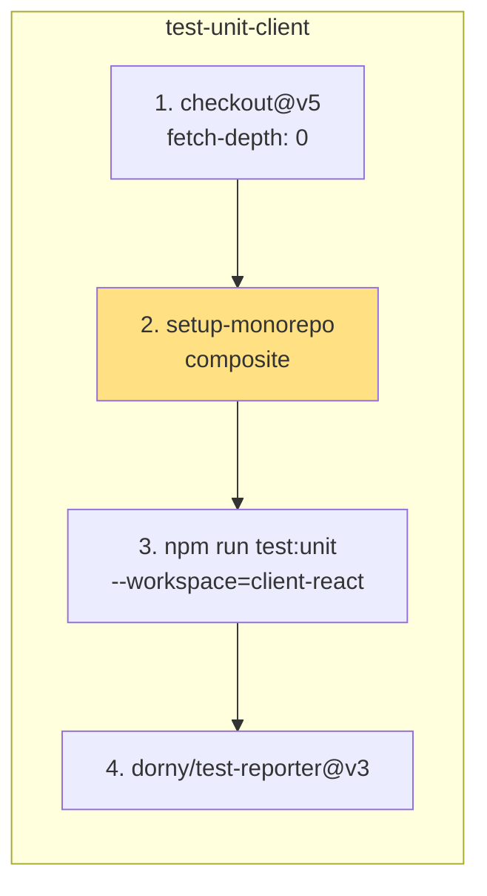
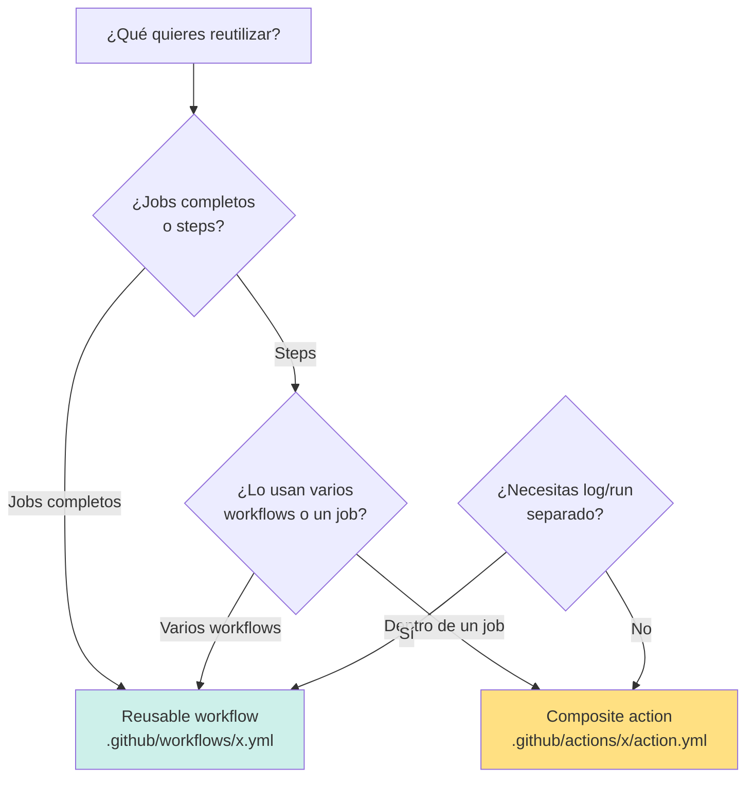

# 08 — Composite Actions: Walkthrough de `setup-monorepo`

> **Guía 08 de 6 del nivel Intermedio** | Prerequisitos: **Fundamentos (00-04) + Guía 06 (`ci.yml`) + Guía 07 (reusable workflows)** | Anterior: [`07-quality-yml-reusable.md`](./07-quality-yml-reusable.md) | Siguiente: [`09-caching-y-performance.md`](./09-caching-y-performance.md)

---

## 🎯 Objetivos de aprendizaje

Al terminar esta guía, serás capaz de:

- ✅ **Explicar qué es una composite action** y en qué se diferencia de una action JavaScript/Docker y de un reusable workflow
- ✅ **Desglosar `.github/actions/setup-monorepo/action.yml` línea por línea** (24 líneas): `name`, `description`, `runs.using: composite`, los 3 steps (setup-node, `npm ci`, cache Vitest)
- ✅ **Aplicar la regla de oro: "la composite NO hace checkout"** — el job invocador ejecuta `actions/checkout@v5` con `fetch-depth: 0` ANTES (Caso 2 de `docs/workflows-mantenimiento-guia.md`)
- ✅ **Decidir cuándo usar composite action vs reusable workflow** con la matriz de decisión y los ejemplos reales del repo
- ✅ **Explicar cómo los 6 jobs de `ci.yml` invocan `setup-monorepo`** con `uses: ./.github/actions/setup-monorepo` y por qué es el segundo step tras el checkout

---

## 📋 Prerequisitos

1. ✅ **Fundamentos completado (00-04)** — sabes qué es un workflow, job, step, action y runner
2. ✅ **Guía 06 (`ci.yml`)** — viste los 6 jobs que usan `uses: ./.github/actions/setup-monorepo` como segundo step
3. ✅ **Guía 07 (reusable workflows)** — entiendes `workflow_call`, `uses:` y la tabla comparativa reusable vs composite (sección 4)
4. ✅ **Caso 2 de `docs/workflows-mantenimiento-guia.md`** — el incidente de `fetch-depth` y `dorny/test-reporter` exit 128 (repasado en la guía 06, sección 10)

> **Si no hiciste la guía 07**: vuelve a [`./07-quality-yml-reusable.md`](./07-quality-yml-reusable.md) sección 4 — la tabla comparativa es el punto de entrada conceptual a esta guía. La fila clave "¿quién hace checkout?" se profundiza aquí.

---

## 1. Teoría: ¿Qué es una composite action?

### 1.1 El problema que resuelve

En la guía 07 viste que `quality.yml` (reusable workflow) encapsula **jobs completos**. Pero hay un caso más fino: **un conjunto de steps** que se repite dentro de varios jobs del MISMO workflow.

Mira `ci.yml`: los jobs `test-unit-client`, `test-unit-server`, `test-integration`, `test-smoke`, `build` y `e2e` comparten exactamente la misma secuencia de setup:

```
checkout (fetch-depth: 0) → setup-node (.nvmrc) → npm ci → cache Vitest
```

**Sin composite action**, copiarías esos 3 steps (setup-node + npm ci + cache) en cada uno de los 6 jobs → 6 copias idénticas. Cuando una cambia (p. ej. actualizar `actions/cache@v4` → `@v5`), debes editar 6 lugares → drift inevitable.

**Con composite action**, defines la secuencia **una sola vez** en `.github/actions/setup-monorepo/action.yml` y cada job la invoca con una línea:

```yaml
- uses: ./.github/actions/setup-monorepo
```

### 1.2 Definición formal

Una **composite action** es una action de GitHub Actions que agrupa **múltiples steps** en un solo archivo YAML reutilizable. A diferencia de las actions JavaScript (que corren código Node) o Docker (que corren un contenedor), una composite action **no ejecuta código propio**: simplemente **orquesta steps** que pueden ser `uses:` de otras actions o `run:` de comandos shell.

| Tipo de action | Cómo se ejecuta            | Archivo                        | Ejemplo en el repo                                |
| -------------- | -------------------------- | ------------------------------ | ------------------------------------------------- |
| **JavaScript** | Código Node.js empaquetado | `action.yml` + `dist/index.js` | (ninguna en este repo)                            |
| **Docker**     | Contenedor Docker          | `action.yml` + `Dockerfile`    | `docker://zricethezav/gitleaks` (en security.yml) |
| **Composite**  | Steps YAML orquestados     | `action.yml` (solo YAML)       | `.github/actions/setup-monorepo/action.yml`       |

> 💡 **Analogía**: si un reusable workflow es una **función** (guía 07), una composite action es una **macro** o **función inline**: se expande dentro del job que la invoca, sin crear un run separado. No tiene su propio log, no tiene su propio runner, no tiene su propio `permissions:` — **es parte del job invocador**.

### 1.3 Estructura de una composite action

Toda composite action vive en `.github/actions/<nombre>/action.yml` y tiene esta estructura mínima:

```yaml
name: 'Nombre descriptivo'
description: 'Qué hace y qué requiere del job invocador'
runs:
  using: 'composite'
  steps:
    - name: Paso 1
      run: echo "hola"
      shell: bash
    - name: Paso 2
      uses: actions/setup-node@v5
      with:
        node-version-file: '.nvmrc'
```

| Elemento                  | Obligatorio | Rol                                                                                                 |
| ------------------------- | ----------- | --------------------------------------------------------------------------------------------------- |
| `name`                    | ✅          | Nombre legible (aparece en logs y marketplace)                                                      |
| `description`             | ✅          | Documenta qué hace y sus requisitos (GitHub la exige)                                               |
| `runs.using: 'composite'` | ✅          | Declara que es una composite action                                                                 |
| `runs.steps`              | ✅          | La lista de steps a ejecutar                                                                        |
| `shell:` en steps `run:`  | ⚠️          | **Obligatorio** en steps `run:` de composites (a diferencia de workflows, no hay shell por defecto) |
| `inputs:` (raíz)          | ❌          | Parámetros de entrada (opcional)                                                                    |
| `outputs:` (raíz)         | ❌          | Salidas (opcional)                                                                                  |
| `branding:`               | ❌          | Icono/color para marketplace (opcional)                                                             |

> ⚠️ **Gotcha de `shell:`**: en un workflow, un step `run:` usa el shell por defecto del runner (`bash` en Linux). En una **composite action, `shell:` es OBLIGATORIO** en cada step `run:` — GitHub no asume ninguno. Si lo olvidas, el workflow falla con un error de validación. Fíjate que `setup-monorepo` lo declara: `shell: bash`.

### 1.4 Cómo se guarda y se invoca

**Ubicación**: `.github/actions/<nombre>/action.yml` — el nombre de la carpeta es el identificador.

**Invocación** (desde un job):

```yaml
- uses: ./.github/actions/setup-monorepo
```

Nota la diferencia con un reusable workflow (guía 07):

| Mecanismo         | Invocación                               | Extensión                            |
| ----------------- | ---------------------------------------- | ------------------------------------ |
| Reusable workflow | `uses: ./.github/workflows/quality.yml`  | **Con** `.yml`                       |
| Composite action  | `uses: ./.github/actions/setup-monorepo` | **Sin** `.yml` (apunta a la carpeta) |

El prefijo `./` indica "en este repo" (action local). Sin `./`, GitHub busca en el marketplace (`uses: actions/checkout@v5`).

### 1.5 Diagrama: dónde vive la composite en el flujo

```mermaid
flowchart TD
    JOB[job de ci.yml<br/>test-unit-client] --> CO[actions/checkout@v5<br/>fetch-depth: 0]
    CO --> SM[uses: ./.github/actions/setup-monorepo]
    SM --> S1[step 1: setup-node .nvmrc + cache npm]
    SM --> S2[step 2: npm ci]
    SM --> S3[step 3: cache Vitest]
    S3 --> RUN[steps del job: tests + reporte]
    style SM fill:#FFE082
    style CO fill:#CDF0EA
```

La composite se "expande" dentro del job: sus steps corren en el mismo runner, mismo log, mismo contexto que los steps del job invocador.

---

## 2. Walkthrough: `.github/actions/setup-monorepo/action.yml` completo

```yaml
# Source: ../../../.github/actions/setup-monorepo/action.yml (24 líneas totales)
name: 'Setup Monorepo'
description: 'Setup Node.js, install dependencies, and cache Vitest (requires prior actions/checkout with fetch-depth: 0 in the calling job)'
runs:
  using: 'composite'
  steps:
    - name: Setup Node.js
      uses: actions/setup-node@v5
      with:
        node-version-file: '.nvmrc'
        cache: 'npm'
        cache-dependency-path: package-lock.json

    - name: Install Dependencies
      run: npm ci
      shell: bash

    - name: Cache Vitest
      uses: actions/cache@v5
      with:
        path: node_modules/.cache
        key: vitest-${{ runner.os }}-${{ hashFiles('package-lock.json') }}
        restore-keys: |
          vitest-${{ runner.os }}-
        exclude: node_modules/.cache/vitest
```

### 2.1 Línea 1-2: `name` y `description`

```yaml
name: 'Setup Monorepo'
description: 'Setup Node.js, install dependencies, and cache Vitest (requires prior actions/checkout with fetch-depth: 0 in the calling job)'
```

- **`name`**: 'Setup Monorepo' — aparece en los logs de cada job que la invoca.
- **`description`**: **OJO, es oro puro**. Dice: _"requires prior actions/checkout with fetch-depth: 0 in the calling job"_. Esta frase documenta la **regla de oro** (sección 4): la composite NO hace checkout; el job invocador debe hacerlo antes con `fetch-depth: 0`. Es la lección del Caso 2 escrita en el propio archivo para que nadie la rompa.

> 💡 **Por qué importa la description**: cuando alguien intente añadir un step de checkout a esta composite, la description le recuerda que está violando el contrato. Es documentación viva en el lugar donde se necesita.

### 2.2 Línea 3-4: `runs.using: 'composite'`

```yaml
runs:
  using: 'composite'
```

Declara el tipo de action. Sin esto, GitHub no sabe cómo ejecutarla. Los valores posibles son `node20`/`node24` (JavaScript), `docker` (Docker) y `composite` (steps YAML).

### 2.3 Línea 5: `steps` — la lista

```yaml
steps:
```

A partir de aquí, todo es idéntico a los steps de un job de workflow: `uses:`, `run:`, `with:`, `env:`, `if:`, `name:`. La diferencia es que **no hay `jobs:`** — una composite no define jobs, solo steps.

### 2.4 Step 1: Setup Node.js (líneas 6-11)

```yaml
- name: Setup Node.js
  uses: actions/setup-node@v5
  with:
    node-version-file: '.nvmrc'
    cache: 'npm'
    cache-dependency-path: package-lock.json
```

Este step hace **dos cosas**:

1. **Instala Node** leyendo la versión de `.nvmrc` (`node-version-file: '.nvmrc'`) — el patrón **Caso 1 / `.nvmrc` SSOT** que viste en la guía 06 sección 11. Un solo archivo controla la versión de Node en los 9 workflows + esta composite.
2. **Habilita el cache npm** (`cache: 'npm'` + `cache-dependency-path: package-lock.json`) — el hash de `package-lock.json` genera la key del cache de `~/.npm`. Profundizamos en la guía 09.

> 📖 **Referencia**: guía 06 sección 11 (Caso 1 EBADENGINE) y guía 09 sección 2 (cache npm). Aquí solo lo invocamos; el detalle está en las guías dedicadas.

### 2.5 Step 2: Install Dependencies (líneas 12-15)

```yaml
- name: Install Dependencies
  run: npm ci
  shell: bash
```

- **`npm ci`** (no `npm install`): instala **exactamente** lo declarado en `package-lock.json`, sin modificar el lockfile. Determinista — CI reproducible.
- **`shell: bash`**: **obligatorio** en composites (ver gotcha de la sección 1.3). En un workflow no haría falta, aquí sí.
- **Sin `--workspace`**: instala en la raíz, lo que en un monorepo con `workspaces` declarados en `package.json` trae también las dependencias de **todos** los workspaces (`apps/client`, `apps/server`, `e2e`). Suficiente para que los 6 jobs corran sus tests/build.

### 2.6 Step 3: Cache Vitest (líneas 16-24)

```yaml
- name: Cache Vitest
  uses: actions/cache@v5
  with:
    path: node_modules/.cache
    key: vitest-${{ runner.os }}-${{ hashFiles('package-lock.json') }}
    restore-keys: |
      vitest-${{ runner.os }}-
    exclude: node_modules/.cache/vitest
```

Este es el step más interesante. Desglosemos:

| Campo          | Valor                                                           | Qué hace                                                                                |
| -------------- | --------------------------------------------------------------- | --------------------------------------------------------------------------------------- |
| `path`         | `node_modules/.cache`                                           | Qué carpeta se cachea (la cache de Vitest vive ahí)                                     |
| `key`          | `vitest-${{ runner.os }}-${{ hashFiles('package-lock.json') }}` | Identificador único de la entrada de cache                                              |
| `restore-keys` | `vitest-${{ runner.os }}-`                                      | Fallback: si la key exacta no existe, busca la más reciente que empiece con ese prefijo |
| `exclude`      | `node_modules/.cache/vitest`                                    | **Excluye** la carpeta de cache de Vitest del cache de `node_modules/.cache`            |

> ⚠️ **El detalle sutil de `exclude`**: `actions/cache@v5` permite excluir subcarpetas del path cacheado. Aquí se cachea `node_modules/.cache` **pero se excluye** `node_modules/.cache/vitest`. ¿Por qué? Porque la cache de Vitest se gestiona **por separado** con su propia key (`vitest-...`). Si no se excluyera, habría **dos caches compitiendo** por la misma carpeta: la genérica de `node_modules/.cache` y la específica de Vitest. La exclusión evita el conflicto y el doble almacenamiento.

**La key**: `vitest-${{ runner.os }}-${{ hashFiles('package-lock.json') }}` tiene dos componentes:

1. `${{ runner.os }}` — el OS del runner (`Linux`, `Windows`, `macOS`). Los caches son **por runner**, así que el OS debe estar en la key.
2. `${{ hashFiles('package-lock.json') }}` — el hash del lockfile. Si cambian las dependencias, cambia el hash → **cache-miss** → se restaura/crea una cache nueva.

**`restore-keys`**: si la key exacta no existe (p. ej. primera vez en un runner nuevo), GitHub busca la cache más reciente cuyo key **empiece** con `vitest-${{ runner.os }}-`. Así se reutiliza parcialmente una cache vieja (aunque las deps hayan cambiado) y solo se descargan los paquetes nuevos. Es un **fallback de rendimiento**, no de corrección.

> 📖 **Referencia**: guía 09 sección 3 (cache de Vitest) y sección 4 (reglas de invalidación). Aquí lo vemos como parte de la composite; allá lo vemos como estrategia.

---

## 3. ¿Quién invoca `setup-monorepo`? Los 6 jobs de `ci.yml`

### 3.1 El patrón de invocación

Los 6 jobs de `ci.yml` que usan la composite lo hacen como **segundo step**, siempre después del checkout:

```yaml
# Source: ../../../.github/workflows/ci.yml (job test-unit-client, líneas 60-65)
steps:
  - uses: actions/checkout@v5
    with:
      fetch-depth: 0

  - uses: ./.github/actions/setup-monorepo
```

| Job                | Línea del `uses:` | Qué hace después                                                      |
| ------------------ | ----------------- | --------------------------------------------------------------------- |
| `test-unit-client` | 65                | `npm run test:unit --workspace=client-react` + reporte JUnit          |
| `test-unit-server` | 93                | `npm run test:unit --workspace=server-express` + reporte JUnit        |
| `test-integration` | 134               | `prisma migrate deploy` + `npm run test:integration` + reporte        |
| `test-smoke`       | 184               | `prisma migrate deploy` + `npm run test:smoke:ci` + reporte           |
| `build`            | 218               | `npm run build --ws --if-present`                                     |
| `e2e`              | 251               | cache Playwright + `npx playwright test --project=chromium` + reporte |

### 3.2 Por qué es el segundo step (y no el primero)

El **primer step SIEMPRE es `actions/checkout@v5`**. ¿Por qué?

1. **GitHub necesita el código para resolver la action local**: para ejecutar `uses: ./.github/actions/setup-monorepo`, GitHub debe leer `action.yml` del repo → necesita el checkout previo.
2. **La composite NO hace checkout** (regla de oro, sección 4): el job invocador es responsable de clonar.

### 3.3 El orden exacto en cada job



El mismo patrón se repite en los 6 jobs. La composite centraliza los pasos 2-4 del setup (setup-node + npm ci + cache), y cada job solo aporta su paso específico.

---

## 4. La regla de oro: "la composite NO hace checkout"

### 4.1 El incidente (Caso 2 de `docs/workflows-mantenimiento-guia.md`)

Esta es la lección más importante de la guía. Recuerda el Caso 2 (guía 06 sección 10):

**Síntoma**: `dorny/test-reporter@v3` fallaba con exit 128 en los steps de reporte:

```text
Error: The process '/usr/bin/git' failed with exit code 128
fatal: bad revision '...'
##[error] Process completed with exit code 128
```

**Causa raíz (antes del fix, ago 2026)**: había **doble checkout por job**:

```yaml
# ci.yml (job)                  # setup-monorepo/action.yml
- uses: actions/checkout@v5     #   - name: Checkout
#  (shallow, default)           #     uses: actions/checkout@v5
- uses: ./.github/actions/      #     with:
  setup-monorepo                #       fetch-depth: 0
```

1. El job invocador hacía `actions/checkout@v5` **shallow** (default `fetch-depth: 1`).
2. La composite hacía **otro** checkout interno con `fetch-depth: 0`.
3. `dorny/test-reporter` necesita el SHA del merge commit del PR para adjuntar el check run. Con el checkout externo shallow, ese SHA **no existe localmente** → exit 128.

**Fix aplicado (ago 2026)**:

```yaml
# ci.yml (job)                  # setup-monorepo/action.yml
- uses: actions/checkout@v5     #   (sin checkout interno)
  with:                         #   - name: Setup Node.js
    fetch-depth: 0              #   - name: Install Dependencies
- uses: ./.github/actions/      #   - name: Cache Vitest
  setup-monorepo
```

- **Un solo checkout por job**: el checkout externo de los 6 jobs pasa a `fetch-depth: 0`.
- **Se elimina el checkout interno** de la composite: ahora solo hace setup-node + npm ci + cache Vitest.
- **Regla nueva**: `setup-monorepo` **NO hace checkout**; exige checkout externo previo con `fetch-depth: 0` (documentado en su `description`).

### 4.2 La regla en forma de contrato

| Quién             | Qué hace                                   | Cuándo                                             |
| ----------------- | ------------------------------------------ | -------------------------------------------------- |
| **Job invocador** | `actions/checkout@v5` con `fetch-depth: 0` | **SIEMPRE primero**, antes de invocar la composite |
| **Composite**     | setup-node + npm ci + cache                | **NUNCA** checkout                                 |

> 💡 **Mnemotecnia**: **"workflow completo = checkout propio; composite = fragmento = checkout ajeno"** (de la guía 07, sección 4.2). La composite es un fragmento del job; el checkout es responsabilidad del job completo.

### 4.3 Por qué `fetch-depth: 0` y no el default

El default de `actions/checkout@v5` es `fetch-depth: 1` (shallow, solo el último commit). Los 6 jobs usan `fetch-depth: 0` (historial completo) porque:

1. **`dorny/test-reporter@v3`** necesita el SHA del merge commit del PR → sin historial completo, exit 128.
2. **`vitest run --changed origin/main`** (pre-push, guía 05) y otros análisis de diff necesitan commits base.

> ⚠️ **Anti-patrón**: poner `fetch-depth: 0` "por si acaso" en workflows que no lo necesitan (p. ej. `quality.yml`). Gasta minutos de CI clonando historial que no se usa. **Opt-in consciente, no default** (Caso 2, lección extraída).

### 4.4 Cómo verificar que la regla se cumple

```bash
# 1. La composite NO tiene step de checkout
grep -n 'checkout' .github/actions/setup-monorepo/action.yml
# → sin resultados (o solo en la description)

# 2. Los 6 jobs de ci.yml hacen checkout con fetch-depth: 0 ANTES de la composite
grep -n -A2 'actions/checkout@v5' .github/workflows/ci.yml
# → cada checkout tiene fetch-depth: 0

# 3. La composite se invoca como segundo step
grep -n -B2 'setup-monorepo' .github/workflows/ci.yml
# → cada uso viene precedido por checkout
```

---

## 5. Composite vs Reusable Workflow: la matriz de decisión

### 5.1 Tabla comparativa completa

| Criterio                             | Reusable workflow                                                        | Composite action                                                             |
| ------------------------------------ | ------------------------------------------------------------------------ | ---------------------------------------------------------------------------- |
| **Dónde vive**                       | `.github/workflows/<name>.yml`                                           | `.github/actions/<name>/action.yml`                                          |
| **Cómo se invoca**                   | `uses: ./.github/workflows/<name>.yml`                                   | `uses: ./.github/actions/<name>` (sin `.yml`)                                |
| **Trigger requerido**                | `workflow_call` en `on:`                                                 | Ninguno (`runs.using: composite`)                                            |
| **¿Tiene su propio run?**            | ✅ Sí, run separado con log propio                                       | ❌ No, se ejecuta **dentro** del job invocador                               |
| **¿Tiene su propio runner?**         | ✅ Sí (puede ser distinto)                                               | ❌ No (usa el runner del job invocador)                                      |
| **¿Tiene su propio `permissions:`?** | ✅ Sí                                                                    | ❌ No (hereda del job invocador)                                             |
| **¿Qué encapsula?**                  | Jobs completos                                                           | Steps individuales                                                           |
| **¿Quién hace `checkout`?**          | El reusable hace **su propio checkout**                                  | La composite **NO** — el job invocador lo hace ANTES                         |
| **`shell:` en steps `run:`**         | Opcional (default del runner)                                            | **Obligatorio**                                                              |
| **¿Puede anidarse?**                 | ❌ Máximo 4 niveles de anidamiento                                       | ✅ Sí, libremente                                                            |
| **Costo**                            | Más pesado (run separado, log aparte)                                    | Más ligero (misma ejecución del job)                                         |
| **Cuándo usar**                      | Lógica peso-mediano, invocada por múltiples workflows, con su propio log | Setup compartido entre steps de un mismo job (checkout + setup-node + cache) |

### 5.2 Ejemplos del repo

| Ejemplo                     | Tipo                  | Por qué esta elección                                                                                                      |
| --------------------------- | --------------------- | -------------------------------------------------------------------------------------------------------------------------- |
| `quality.yml`               | **Reusable workflow** | Invocado por `ci.yml` y `workflow_dispatch`, con su propio run para aislar el log de lint                                  |
| `setup-monorepo/action.yml` | **Composite action**  | Setup Node + `npm ci` + cache Vitest — se invoca desde 6 jobs de `ci.yml` dentro de su propio job (no necesita run aparte) |

### 5.3 Árbol de decisión



**Regla práctica**:

- ¿Encapsulas **jobs** (con su propio runner, permissions, log)? → **Reusable workflow**
- ¿Encapsulas **steps** que se repiten dentro de un job? → **Composite action**
- ¿Lo invocan **varios workflows**? → **Reusable workflow** (o composite si es solo setup)
- ¿Necesitas **anidar** reutilización? → **Composite action** (los reusables no se anidan bien)

---

## 6. Gotchas prácticos de composite actions

### 6.1 `shell:` obligatorio en steps `run:`

```yaml
# ❌ FALLA: falta shell en un step run: de una composite
runs:
  using: 'composite'
  steps:
    - name: Install
      run: npm ci

# ✅ CORRECTO
runs:
  using: 'composite'
  steps:
    - name: Install
      run: npm ci
      shell: bash
```

GitHub valida la composite al cargarla: un step `run:` sin `shell:` en una composite action es un **error de validación** (el workflow ni siquiera arranca).

### 6.2 No añadir checkout a la composite "para que sea autónoma"

```yaml
# ❌ ANTI-PATRÓN: reintroduce el doble checkout (Caso 2)
runs:
  using: 'composite'
  steps:
    - name: Checkout
      uses: actions/checkout@v5   # ¡NO!
    - name: Setup Node.js
      ...

# ✅ CORRECTO: la composite asume que el job ya clonó
runs:
  using: 'composite'
  steps:
    - name: Setup Node.js
      ...
```

Si añades checkout a la composite, y el job invocador **también** lo hace (como los 6 jobs de `ci.yml`), reintroducirás el doble checkout → `dorny/test-reporter` falla con exit 128. **La description de la composite lo documenta**: _"requires prior actions/checkout with fetch-depth: 0 in the calling job"_.

### 6.3 Los `inputs` de una composite no son tipados

A diferencia de los reusable workflows (guía 07, sección 2.2), los `inputs` de una composite action **no tienen `type:`** — son siempre strings:

```yaml
inputs:
  node-version-file:
    description: 'Ruta al archivo de versión de Node'
    required: true
    default: '.nvmrc'
```

No hay `type: boolean` ni `type: number`. Si necesitas lógica condicional sobre un input, compara strings: `if: inputs.run-client == 'true'`.

### 6.4 Los `outputs` de una composite requieren `id` en el step

```yaml
outputs:
  cache-hit:
    description: 'Si la cache de Vitest hizo hit'
    value: ${{ steps.cache.outputs.cache-hit }}

runs:
  using: 'composite'
  steps:
    - name: Cache Vitest
      id: cache          # ← OBLIGATORIO para referenciar outputs
      uses: actions/cache@v5
      ...
```

Sin el `id:` en el step, no puedes referenciar sus outputs desde el `outputs:` de la composite.

### 6.5 Depurar una composite con `act`

```bash
# Ejecuta un job de ci.yml que usa la composite
act -j test-unit-client -W .github/workflows/ci.yml

# Con verbose para ver los steps expandidos
act -j test-unit-client -W .github/workflows/ci.yml -v
```

`act` expande la composite como steps normales del job — puedes ver cada step en el log. Limitaciones: service containers y secrets no funcionan igual que en GitHub (ver guía 09 sección 6).

---

## 7. Ejercicios prácticos

### Ejercicio 1: Traza la expansión de la composite

Elige el job `build` de `ci.yml` y lista los steps **expandidos** (incluyendo los 3 de la composite):

```
1. actions/checkout@v5 (fetch-depth: 0)
2. [composite] Setup Node.js (setup-node@v5, .nvmrc, cache npm)
3. [composite] Install Dependencies (npm ci)
4. [composite] Cache Vitest (actions/cache@v5)
5. Build All Workspaces (npm run build --ws --if-present)
```

¿Cuántos steps ve GitHub en el log? **5** (los 3 de la composite se expanden inline).

### Ejercicio 2: Crea una composite hipotética `setup-e2e`

Diseña (en un archivo de prueba) una composite que encapsule el setup del job `e2e`:

```yaml
# .github/actions/setup-e2e/action.yml (hipotética)
name: 'Setup E2E'
description: 'Cache Playwright browsers and install Chromium (requires prior checkout)'
runs:
  using: 'composite'
  steps:
    - name: Cache Playwright Browsers
      id: cache-playwright
      uses: actions/cache@v5
      with:
        path: ~/.cache/ms-playwright
        key: playwright-${{ runner.os }}-${{ hashFiles('package-lock.json') }}

    - name: Install Playwright with System Dependencies
      if: steps.cache-playwright.outputs.cache-hit != 'true'
      run: npx playwright install --with-deps chromium
      shell: bash
      working-directory: e2e
```

¿Qué pasos del job `e2e` de `ci.yml` (líneas 260-271) encapsularía? Los dos de cache/install de Playwright. El checkout, `prisma migrate deploy` y el test en sí quedarían en el job.

### Ejercicio 3: Detecta una violación de la regla de oro

```bash
# Busca checkout dentro de cualquier composite del repo
grep -rn 'checkout' .github/actions/*/action.yml
# Si aparece un step "uses: actions/checkout" (no en description), es una violación
```

### Ejercicio 4: Compara el costo de ambos mecanismos

Para el setup de Node en 6 jobs, ¿cuántos runs/logs genera cada mecanismo?

- **Reusable workflow** (si `setup-monorepo` fuera reusable): 6 runs separados + 6 logs + 6 runners → más overhead.
- **Composite action** (actual): 0 runs separados — los steps se expanden en los 6 jobs existentes → más ligero.

---

## ❓ Preguntas frecuentes (FAQ)

### ¿Por qué `setup-monorepo` es composite y no reusable workflow?

Porque encapsula **steps** (setup-node + npm ci + cache) que se repiten **dentro** de 6 jobs del mismo workflow. Un reusable workflow encapsula jobs completos con su propio run/log — sería overkill para un setup que no necesita log separado. Además, los reusables no se anidan bien; las composites sí.

### ¿Puedo invocar una composite desde un reusable workflow?

Sí. Un reusable workflow (como `quality.yml`) puede usar `uses: ./.github/actions/setup-monorepo` en sus steps. De hecho, `quality.yml` **no** la usa (hace su propio setup-node + npm ci inline), pero podría. La composición es libre: reusable → composite → steps.

### ¿Por qué la composite no tiene `permissions:`?

Porque no es un job: no tiene contexto de ejecución propio. Hereda las `permissions:` del job invocador. Si necesitas permisos distintos, se declaran en el job, no en la composite.

### ¿Qué pasa si dos jobs invocan la composite con inputs distintos?

Cada invocación es independiente: la composite se expande por separado en cada job. Si la composite tuviera `inputs:`, cada job pasaría los suyos con `with:`.

### ¿Cómo sé qué versión de `actions/cache` usa la composite?

`actions/cache@v5` (línea 18 de `action.yml`). La guía de mantenimiento (`docs/workflows-mantenimiento-guia.md` sección 7) recomienda revisar versiones mensualmente con Dependabot.

### ¿La composite puede usar `env:`?

Sí, tanto a nivel de step como a nivel de job (heredado). Los steps `run:` de la composite ven las env vars del job invocador.

---

## 📖 Glosario: composite actions

| Término                              | Definición                                                                       |
| ------------------------------------ | -------------------------------------------------------------------------------- |
| **composite action**                 | Action que agrupa múltiples steps YAML; se ejecuta dentro del job invocador      |
| **`runs.using: 'composite'`**        | Declaración que identifica el tipo de action                                     |
| **`shell:`**                         | Campo **obligatorio** en steps `run:` de composites                              |
| **Regla de oro**                     | La composite NO hace checkout; el job invocador clona con `fetch-depth: 0` antes |
| **Caso 2**                           | Incidente de `dorny/test-reporter` exit 128 por doble checkout + shallow clone   |
| **`node-version-file: '.nvmrc'`**    | Patrón SSOT: setup-node lee la versión de `.nvmrc` (Caso 1)                      |
| **`npm ci`**                         | Instalación determinista desde `package-lock.json`                               |
| **`actions/cache@v5`**               | Action de cache con `key`, `restore-keys` y `exclude`                            |
| **`hashFiles()`**                    | Función de GitHub que genera un hash de archivos para keys de cache              |
| **`restore-keys`**                   | Fallback de cache: reutiliza la entrada más reciente con el prefijo dado         |
| **`exclude`**                        | Subcarpetas que se excluyen del path cacheado                                    |
| **`uses: ./.github/actions/<name>`** | Invocación de una composite local (sin `.yml`)                                   |

---

## ✅ Checklist de completitud: Guía 08

Antes de pasar a la siguiente guía, verifica que puedes:

- [ ] Explicar qué es una composite action y su estructura (`name`, `description`, `runs.using: composite`, `steps`)
- [ ] Desglosar `setup-monorepo/action.yml` línea por línea: setup-node con `.nvmrc` + cache npm, `npm ci` con `shell: bash`, cache Vitest con `actions/cache@v5`
- [ ] Explicar la key `vitest-${{ runner.os }}-${{ hashFiles('package-lock.json') }}` y el `restore-keys`
- [ ] Explicar el `exclude: node_modules/.cache/vitest` y por qué evita el doble cache
- [ ] Aplicar la regla de oro: la composite NO hace checkout; el job invocador clona con `fetch-depth: 0` ANTES
- [ ] Explicar el Caso 2: doble checkout → exit 128 en `dorny/test-reporter` → fix con checkout único
- [ ] Decidir cuándo usar composite vs reusable workflow (matriz de decisión)
- [ ] Explicar cómo los 6 jobs de `ci.yml` invocan `setup-monorepo` como segundo step
- [ ] Recordar que `shell:` es obligatorio en steps `run:` de composites
- [ ] Depurar una composite con `act -j <job> -W .github/workflows/ci.yml`

---

## 🔙 Anterior

> **[`./07-quality-yml-reusable.md`](./07-quality-yml-reusable.md)** — Workflows reutilizables: `workflow_call`, inputs, distinción reusable vs composite

## ➡️ Siguiente

> **[`./09-caching-y-performance.md`](./09-caching-y-performance.md)** — Caching y performance: cache npm, Vitest, Playwright, reglas de invalidación, gotcha de `ci-enterprise.yml`, ejecución local con `act`

## 🏠 Índice

> **[`./intermedio-README.md`](./intermedio-README.md)** — Índice del nivel Intermedio

---

_Parte del cambio OpenSpec `learning-cicd-intermedio` — Nivel Intermedio, Guía 08 de 6_

---

## 8. Cómo crear una composite action desde cero (tutorial)

Vamos a crear una composite action nueva paso a paso, siguiendo el patrón de `setup-monorepo`. El caso de uso: encapsular el setup del job `e2e` (cache de Playwright + instalación de Chromium) que hoy vive inline en `ci.yml` líneas 260-271.

### Paso 1: Crear la carpeta y el archivo

```bash
mkdir -p .github/actions/setup-e2e
touch .github/actions/setup-e2e/action.yml
```

La convención de nombres: kebab-case, descriptivo del propósito (`setup-e2e`, `setup-monorepo`).

### Paso 2: Declarar `name`, `description` y `runs.using`

```yaml
# .github/actions/setup-e2e/action.yml
name: 'Setup E2E'
description: 'Cache Playwright browsers and install Chromium (requires prior actions/checkout in the calling job)'
runs:
  using: 'composite'
```

La `description` es obligatoria y debe documentar los requisitos del job invocador (siguiendo el patrón de `setup-monorepo`).

### Paso 3: Añadir los steps

```yaml
steps:
  - name: Cache Playwright Browsers
    id: cache-playwright
    uses: actions/cache@v5
    with:
      path: ~/.cache/ms-playwright
      key: playwright-${{ runner.os }}-${{ hashFiles('package-lock.json') }}

  - name: Install Playwright with System Dependencies
    if: steps.cache-playwright.outputs.cache-hit != 'true'
    run: npx playwright install --with-deps chromium
    shell: bash
    working-directory: e2e
```

Nota los detalles:

- `id: cache-playwright` — necesario para referenciar `steps.cache-playwright.outputs.cache-hit` en el step siguiente.
- `shell: bash` — obligatorio en el step `run:`.
- `working-directory: e2e` — el comando corre desde la carpeta `e2e` (donde está el `package.json` de Playwright).

### Paso 4: Invocarla desde el job

```yaml
# ci.yml (job e2e, reemplazando las líneas 260-271)
    steps:
      - uses: actions/checkout@v5
        with:
          fetch-depth: 0

      - uses: ./.github/actions/setup-monorepo

      - name: Prisma Migrate Deploy
        run: npx prisma migrate deploy
        ...

      - uses: ./.github/actions/setup-e2e   # ← la nueva composite

      - name: Run E2E Tests
        run: npx playwright test --project=chromium --output=test-results
        ...
```

### Paso 5: Validar con `act` antes de pushear

```bash
act -j e2e -W .github/workflows/ci.yml -v
```

`act` expande la composite y muestra cada step. Si algo falla, el log te dice exactamente qué step de la composite falló.

> ⚠️ **Regla de oro aplicada**: la nueva composite NO hace checkout — el job `e2e` ya clonó con `fetch-depth: 0` en su primer step. Si añadieras checkout a `setup-e2e`, reintroducirías el doble checkout del Caso 2.

---

## 9. Troubleshooting: problemas comunes con composites

### 9.1 "Composite action is not supported" / error de validación

**Síntoma**: el workflow falla al cargarse con un error de validación de la action.

**Causas posibles**:

1. Falta `runs.using: 'composite'` → GitHub no sabe cómo ejecutarla.
2. Falta `shell:` en un step `run:` → error de validación.
3. Falta `description` → GitHub la exige.

**Fix**: revisa la estructura contra la sección 1.3. Los tres campos (`name`, `description`, `runs.using`) son obligatorios, y cada step `run:` necesita `shell:`.

### 9.2 "Cannot find action" / action local no encontrada

**Síntoma**: `Error: Cannot find action ... .github/actions/setup-monorepo`.

**Causas posibles**:

1. La ruta en `uses:` no coincide con la carpeta real (`.github/actions/<nombre>`).
2. El archivo no se llama `action.yml` (GitHub solo busca `action.yml` o `action.yaml`).
3. El checkout no ocurrió antes (GitHub no puede leer la action local sin código).

**Fix**: verifica `ls .github/actions/` y que el archivo sea `action.yml`. Y recuerda: el checkout SIEMPRE va primero.

### 9.3 El step `run:` no encuentra el comando

**Síntoma**: `npm: command not found` o `npx: command not found` dentro de un step de la composite.

**Causa**: la composite corre en el contexto del job, pero si el step `run:` no tiene `shell: bash` explícito, el shell por defecto puede no tener el PATH de npm.

**Fix**: añade `shell: bash` al step. En `setup-monorepo`, el step `npm ci` lo declara explícitamente por esta razón.

### 9.4 Los outputs de la composite están vacíos

**Síntoma**: `${{ steps.mi-step.outputs.x }}` devuelve vacío.

**Causa**: el step que produce el output no tiene `id:`, o el `outputs:` de la composite no referencia el `id` correcto.

**Fix**: verifica que el step tenga `id:` y que el `outputs:` use `${{ steps.<id>.outputs.<nombre> }}` (sección 6.4).

### 9.5 La composite hace checkout y todo se rompe

**Síntoma**: `dorny/test-reporter` falla con exit 128, o el job clona dos veces (visible en el log).

**Causa**: alguien añadió un step de checkout a la composite → doble checkout (Caso 2).

**Fix**: elimina el checkout de la composite. El job invocador ya clonó con `fetch-depth: 0`. La `description` de `setup-monorepo` lo documenta: _"requires prior actions/checkout with fetch-depth: 0 in the calling job"_.

---

## 10. Resumen

En esta guía aprendiste:

| Concepto                      | Qué es                                                  | Dónde vive en el repo                       |
| ----------------------------- | ------------------------------------------------------- | ------------------------------------------- |
| **Composite action**          | Action que agrupa steps YAML, se expande dentro del job | `.github/actions/setup-monorepo/action.yml` |
| **`runs.using: 'composite'`** | Declaración del tipo de action                          | Línea 4 de `action.yml`                     |
| **`shell:` obligatorio**      | Requisito de steps `run:` en composites                 | Línea 15 de `action.yml`                    |
| **Regla de oro**              | La composite NO hace checkout                           | Documentada en la `description` (línea 2)   |
| **Cache Vitest**              | `actions/cache@v5` con key `vitest-OS-hash`             | Líneas 16-24 de `action.yml`                |
| **Invocación**                | `uses: ./.github/actions/setup-monorepo`                | 6 jobs de `ci.yml`                          |

**La conexión con la siguiente guía**: el step 3 de `setup-monorepo` (cache Vitest) y el cache de Playwright del job `e2e` son la puerta de entrada al tema de la guía 09: **caching y performance**. Ahí verás la teoría completa de keys, invalidación y `restore-keys`, y el gotcha de `ci-enterprise.yml`.

> 💡 **Regla mnemotécnica final**: **"composite = fragmento del job; reusable = job completo; checkout siempre del job completo"**.
