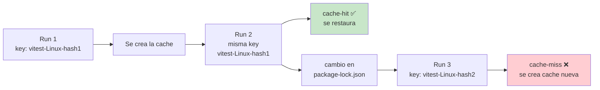
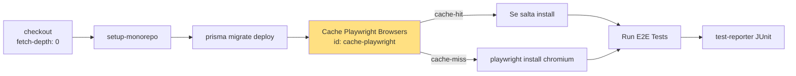

# 09 — Caching y Performance: estrategia de cache del monorepo

> **Guía 09 de 6 del nivel Intermedio** | Prerequisitos: **Fundamentos (00-04) + Guía 06 (`ci.yml`) + Guía 07 (reusable workflows) + Guía 08 (composite actions)** | Anterior: [`08-composite-actions.md`](./08-composite-actions.md) | Siguiente: [`10-testing-pipeline.md`](./10-testing-pipeline.md)

---

## 🎯 Objetivos de aprendizaje

Al terminar esta guía, serás capaz de:

- ✅ **Explicar qué se cachea en CI y por qué** (tiempo de CI, coste de runners, determinismo)
- ✅ **Describir la vida de una cache key** y cómo `hashFiles()` invalida automáticamente
- ✅ **Explicar el cache npm** vía `actions/setup-node@v5` con `cache: 'npm'` y `cache-dependency-path: package-lock.json` (un solo lockfile en la raíz)
- ✅ **Explicar el cache de Vitest** de la composite `setup-monorepo`: key `vitest-${{ runner.os }}-${{ hashFiles('package-lock.json') }}`, `restore-keys` y `exclude`
- ✅ **Explicar el cache de navegadores Playwright** (`~/.cache/ms-playwright`) y la instalación condicional de Chromium
- ✅ **Aplicar las reglas de invalidación**: qué invalida cada cache y por qué `restore-keys` es un fallback
- ✅ **Diagnosticar el gotcha de `ci-enterprise.yml`**: `cache-dependency-path` apunta a `frontend/` y `backend/` inexistentes → cache-miss garantizado
- ✅ **Ejecutar workflows localmente con `act`** y conocer sus limitaciones (service containers, secrets, caches)

---

## 📋 Prerequisitos

1. ✅ **Fundamentos completado (00-04)** — sabes qué es un workflow, job, step, runner y `hashFiles()`
2. ✅ **Guía 06 (`ci.yml`)** — viste el cache de Playwright en el job `e2e` (sección 8) y el cache npm en los jobs
3. ✅ **Guía 08 (composite actions)** — viste el step 3 de `setup-monorepo` (cache Vitest) con `actions/cache@v5`, `key`, `restore-keys` y `exclude`
4. ✅ **`docs/workflows-mantenimiento-guia.md` sección 12** — el inventario de caches actuales y el gap A3 de `ci-enterprise.yml`

> **Si no hiciste la guía 08**: vuelve a [`./08-composite-actions.md`](./08-composite-actions.md) sección 2.6 — el step "Cache Vitest" de la composite es el ejemplo central de esta guía.

---

## 1. Teoría: ¿Qué se cachea en CI y por qué?

### 1.1 El problema: CI lento es CI caro

Cada run de GitHub Actions arranca en un **runner limpio** (ubuntu-latest = máquina virtual efímera). Nada persiste entre runs. Eso significa que, sin cache, cada run tendría que:

1. Descargar **~1-2 GB de dependencias npm** desde el registro (`npm ci`)
2. Descargar los **binarios de navegadores** de Playwright (~170 MB por Chromium)
3. Recompilar/re-ejecutar el **transform de Vitest** (transformación de archivos)

Todo eso toma **minutos** y consume **minutos de GitHub Actions** (que se cobran). El caching existe para resolver exactamente esto: **persistir datos entre runs para no re-descargar lo que ya tenemos**.

### 1.2 Qué se cachea en este monorepo

| Cache                   | Qué persiste                                    | Dónde vive                                       | Key                                                                 |
| ----------------------- | ----------------------------------------------- | ------------------------------------------------ | ------------------------------------------------------------------- |
| **npm**                 | Descargas de paquetes (`~/.npm`)                | `actions/setup-node@v5` en workflows y composite | hash de `package-lock.json`                                         |
| **Vitest**              | Transform cache (`node_modules/.cache`)         | `setup-monorepo` (composite)                     | `vitest-${{ runner.os }}-${{ hashFiles('package-lock.json') }}`     |
| **Playwright browsers** | Binarios de Chromium (`~/.cache/ms-playwright`) | `ci.yml` job `e2e`                               | `playwright-${{ runner.os }}-${{ hashFiles('package-lock.json') }}` |

> 💡 **Analogía**: el cache de CI es como la **caché de un navegador**. La primera visita descarga todo; las visitas siguientes reutilizan lo que ya está local. La key es como la URL: si cambia el contenido (hash), se re-descarga.

### 1.3 Vida de una cache key



1. **Run 1**: la key no existe → cache-miss → se ejecuta todo → al final, GitHub guarda la entrada con la key.
2. **Run 2**: misma key → cache-hit → se restaura el contenido → se salta la descarga.
3. **Run 3**: cambió `package-lock.json` → la key es distinta → cache-miss → se ejecuta de nuevo → se guarda una entrada nueva.

**Regla de oro**: la key debe cambiar **si y solo si** cambia lo que cacheas. Si la key no incluye el hash de las dependencias, la cache queda obsoleta (stale) y corres con código viejo.

### 1.4 `hashFiles()`: la invalidación automática

```yaml
key: vitest-${{ runner.os }}-${{ hashFiles('package-lock.json') }}
```

`hashFiles()` calcula un **hash del contenido** de los archivos indicados. Cuando `package-lock.json` cambia (nueva dependencia, bump de versión), el hash cambia → la key cambia → cache-miss → re-instalación.

> ⚠️ **Qué archivos incluir**: `package-lock.json` es el archivo correcto porque captura el **grafo completo de dependencias** (directas + transitivas) con sus versiones exactas. `package.json` solo captura los rangos semver (`^1.2.3`), que no reflejan la versión instalada real.

### 1.5 Tipos de cache en GitHub Actions

| Tipo                 | Dónde se define                                        | Vida                          | Uso en el repo                                |
| -------------------- | ------------------------------------------------------ | ----------------------------- | --------------------------------------------- |
| **Actions cache**    | `actions/cache@v5` (explícito)                         | 7 días desde el último acceso | Vitest, Playwright                            |
| **Setup cache**      | `actions/setup-node@v5` con `cache: 'npm'` (implícito) | 7 días                        | npm                                           |
| **Dependency cache** | `actions/cache` con `path` apuntando a `node_modules`  | 7 días                        | (no usado — se prefiere `npm ci` + cache npm) |

> 📖 **Referencia**: [`docs/workflows-mantenimiento-guia.md`](../../../docs/workflows-mantenimiento-guia.md) sección 12 — inventario completo de caches con su estado de invalidación (todo ✅ Sí).

---

## 2. Cache npm: `actions/setup-node@v5` con `cache: 'npm'`

### 2.1 El snippet real

El cache npm se configura **dentro** de `actions/setup-node@v5`, no como un step aparte:

```yaml
# Source: ../../../.github/actions/setup-monorepo/action.yml (líneas 6-11)
- name: Setup Node.js
  uses: actions/setup-node@v5
  with:
    node-version-file: '.nvmrc'
    cache: 'npm'
    cache-dependency-path: package-lock.json
```

El mismo patrón aparece en `quality.yml` (líneas 28-33), `ci-enterprise.yml` (job install) y otros workflows.

### 2.2 Cómo funciona

| Campo                                      | Qué hace                                                                                      |
| ------------------------------------------ | --------------------------------------------------------------------------------------------- |
| `cache: 'npm'`                             | Habilita el cache del **registro npm** (`~/.npm` — donde npm guarda los tarballs descargados) |
| `cache-dependency-path: package-lock.json` | El archivo cuyo hash genera la key del cache                                                  |

Cuando `setup-node` corre:

1. Calcula `hashFiles('package-lock.json')` → key.
2. Busca la key en el cache de GitHub → si existe, restaura `~/.npm` (cache-hit).
3. Si no existe (cache-miss), el cache se creará al final del job.

Luego `npm ci` lee `~/.npm` restaurado: los paquetes ya están en disco → **no se re-descarga nada** → `npm ci` pasa de ~1-2 min a ~10-20 s.

### 2.3 Por qué `package-lock.json` y no `package.json`

El lockfile contiene el **grafo de dependencias resuelto y congelado**: cada paquete con su versión exacta instalada (no rangos). `package.json` solo tiene rangos (`^22.0.0`), que pueden resolver a versiones distintas en cada `npm ci`.

Si usaras `package.json` como base de la key, dos runs con el mismo `package.json` pero lockfiles distintos compartirían cache → **posible cache poisoning** (paquetes de una versión usados con otra).

### 2.4 Un solo lockfile en la raíz

```bash
# El monorepo tiene UN solo package-lock.json en la raíz
ls package-lock.json   # ✅ existe
ls apps/client/package-lock.json   # ❌ no existe
ls apps/server/package-lock.json   # ❌ no existe
```

npm workspaces **hoistea** (sube) las dependencias comunes a `node_modules/` de la raíz y mantiene **un solo lockfile**. Por eso `cache-dependency-path: package-lock.json` (sin prefijo de workspace) es correcto en todos los workflows.

> ⚠️ **Contraste con `ci-enterprise.yml`** (gotcha de la sección 5): ese workflow referencia `frontend/package-lock.json` y `backend/package-lock.json` — **paths que no existen** en este monorepo → cache-miss garantizado. Es el gap A3 documentado.

### 2.5 Cómo verificar el estado del cache npm

```bash
# En los logs del job: buscar "Cache restored" o "Cache saved"
# ✅ "Post job: Cache npm" → se guardó
# ✅ "Cache restored from key: npm-Linux-hash" → cache-hit
# ❌ "Cache not found for input keys" → cache-miss

# Localmente, el cache npm vive en:
npm config get cache   # → ~/.npm (o el path configurado)
```

---

## 3. Cache de Vitest: la composite `setup-monorepo`

### 3.1 El snippet real

```yaml
# Source: ../../../.github/actions/setup-monorepo/action.yml (líneas 16-24)
- name: Cache Vitest
  uses: actions/cache@v5
  with:
    path: node_modules/.cache
    key: vitest-${{ runner.os }}-${{ hashFiles('package-lock.json') }}
    restore-keys: |
      vitest-${{ runner.os }}-
    exclude: node_modules/.cache/vitest
```

### 3.2 Qué cachea

`path: node_modules/.cache` — la carpeta donde Vitest guarda su **transform cache**: la versión transformada (transpilada) de cada archivo de test/source. En runs sucesivos sin cambios, Vitest reutiliza esa transformación y **no re-transpila** → ahorra segundos valiosos en suites grandes.

### 3.3 La key: dos componentes

```
vitest-${{ runner.os }}-${{ hashFiles('package-lock.json') }}
```

| Componente       | Valor                         | Por qué                                                         |
| ---------------- | ----------------------------- | --------------------------------------------------------------- |
| Prefijo          | `vitest-`                     | Namespace — evita colisiones con otras caches                   |
| `runner.os`      | `Linux` / `Windows` / `macOS` | Los caches son **por runner**; la transformación depende del OS |
| `hashFiles(...)` | hash del lockfile             | Cambio de deps → cambio de transformación → invalidar           |

### 3.4 `restore-keys`: reutilización parcial

```yaml
restore-keys: |
  vitest-${{ runner.os }}-
```

Cuando la **key exacta** no existe (cache-miss por cambio de hash), GitHub busca la cache más reciente cuya key **empiece con** `vitest-Linux-`. Si la encuentra, la restaura y luego `actions/cache` **deja que el job sobrescriba lo que cambió** (descarga de paquetes nuevos).

**Ejemplo**: hash1 → hash2. La key exacta `vitest-Linux-hash2` no existe, pero `vitest-Linux-hash1` sí → se restaura parcialmente → solo se descargan las deps nuevas.

> 💡 **`restore-keys` es un fallback de rendimiento, no de corrección**: si no hay ninguna cache con el prefijo, simplemente cache-miss completo. Nunca causa fallos — solo ahorra o no ahorra tiempo.

### 3.5 `exclude: node_modules/.cache/vitest` — el detalle sutil

```yaml
path: node_modules/.cache
exclude: node_modules/.cache/vitest
```

`actions/cache@v5` permite **excluir subcarpetas** del path cacheado. Aquí:

- Se cachea `node_modules/.cache` (la transform cache de Vitest está en `node_modules/.cache/vitest`).
- **Pero se excluye** `node_modules/.cache/vitest` del cache.

¿Por qué excluir la carpeta que quieres cachear? Porque **Vitest gestiona su propia cache interna** con un formato de key distinto (basado en `vitest.config.js` y versiones). Si la incluyeras en el cache genérico, tendrías **dos mecanismos compitiendo** por la misma carpeta → riesgo de corrupción o de restaurar una cache incompatible con la versión de Vitest del job.

> 📖 **Referencia**: guía 08 sección 2.6 para el análisis completo de este step desde la perspectiva de la composite.

---

## 4. Cache de navegadores Playwright: el job `e2e`

### 4.1 El snippet real

```yaml
# Source: ../../../.github/workflows/ci.yml (job e2e, líneas 260-271)
- name: Cache Playwright Browsers
  id: cache-playwright
  uses: actions/cache@v5
  with:
    path: ~/.cache/ms-playwright
    key: playwright-${{ runner.os }}-${{ hashFiles('package-lock.json') }}

- name: Install Playwright with System Dependencies
  if: steps.cache-playwright.outputs.cache-hit != 'true'
  run: npx playwright install --with-deps chromium
  shell: bash
  working-directory: e2e
```

### 4.2 Qué cachea

`path: ~/.cache/ms-playwright` — los **binarios de los navegadores** que Playwright descarga (~170 MB por Chromium). Sin cache, cada run del job `e2e` descargaría Chromium desde cero (1-2 min adicionales).

### 4.3 La key

```
playwright-${{ runner.os }}-${{ hashFiles('package-lock.json') }}
```

Mismo patrón que Vitest: prefijo `playwright-` + OS + hash del lockfile. La versión de Playwright viene de `package-lock.json` (es una dependency de `e2e`), así que el hash captura correctamente cuándo cambia la versión de Playwright → invalidación automática.

### 4.4 La instalación condicional al cache-hit

```yaml
if: steps.cache-playwright.outputs.cache-hit != 'true'
```

Este `if:` es la pieza clave:

- **Cache-hit** (`cache-hit == 'true'`): los browsers ya están en `~/.cache/ms-playwright` → **se salta** `playwright install` → ahorra 1-2 min.
- **Cache-miss** (`cache-hit != 'true'`): no hay browsers → se ejecuta `npx playwright install --with-deps chromium`.

El output `cache-hit` lo expone `actions/cache@v5` gracias al `id: cache-playwright` del step (ver guía 08 sección 6.4 para el patrón de `id` + outputs).

> ⚠️ **Nota sobre `--with-deps`**: instala también las **dependencias de sistema** de Chromium (libs de Linux). Esas NO se cachean (son instaladas por apt) — pero solo corren en cache-miss, así que el costo es marginal.

### 4.5 Flujo completo del job e2e



---

## 5. Reglas de invalidación: qué invalida cada cache

### 5.1 La tabla de invalidación

| Cambio                                              | npm cache                                      | Vitest cache                                                                   | Playwright cache           |
| --------------------------------------------------- | ---------------------------------------------- | ------------------------------------------------------------------------------ | -------------------------- |
| **Cambio en `package-lock.json`**                   | ❌ Invalida                                    | ❌ Invalida                                                                    | ❌ Invalida                |
| **Cambio de OS/runner**                             | ❌ Invalida (runner distinto = cache distinto) | ❌ Invalida (OS en la key)                                                     | ❌ Invalida (OS en la key) |
| **Cambio de código fuente** (`apps/`, `e2e/`)       | ✅ No afecta                                   | ⚠️ Parcial (el transform cache se regenera por archivo, pero la key no cambia) | ✅ No afecta               |
| **Cambio de config de Vitest** (`vitest.config.js`) | ✅ No afecta                                   | ⚠️ La key no incluye el config — potencial stale (deuda conocida)              | ✅ No afecta               |

### 5.2 Por qué un cambio en `package-lock.json` invalida las tres

Los tres caches usan `hashFiles('package-lock.json')` en su key. Un cambio en el lockfile (nueva dep, bump) cambia el hash → las tres keys cambian → las tres caches se invalidan. **Coherencia total**: si cambian las deps, todo lo que depende de ellas (transform de Vitest, browsers de Playwright, descargas npm) se regenera.

### 5.3 Por qué el OS está en la key

Los caches de GitHub Actions **no se comparten entre runners distintos**. Una cache creada en `ubuntu-latest` (Linux) no puede restaurarse en `windows-latest`. Por eso el OS va en la key: cada runner busca su propia cache.

### 5.4 `restore-keys` como fallback

Cuando la key exacta falla, `restore-keys` busca la **entrada más reciente con el prefijo**. Ejemplo real:

```
key:            vitest-Linux-abc123   (deps actuales)
restore-keys:   vitest-Linux-         (busca cualquier vitest-Linux-*)
```

Si solo existe `vitest-Linux-def456` (deps viejas), se restaura **parcialmente**: la transform cache vieja sirve para los archivos que no cambiaron, y Vitest re-transpila solo los afectados por el cambio de deps. Menos trabajo que un cache-miss completo.

### 5.5 El límite de 10 GB y la política de retención

GitHub Actions cachea por repo con un **límite total de 10 GB** (sin costo adicional en repositorios públicos; los privados pueden tener límites según el plan). Las entradas se eliminan automáticamente a los **7 días sin acceso** (LRU). En este monorepo con 3 caches modestos (npm ~100 MB, Vitest ~50 MB, Playwright ~170 MB) no hay riesgo de agotar el límite.

### 5.6 Cómo verificar el estado de una cache

```bash
# En los logs del job:
# ✅ "Cache restored from key: vitest-Linux-abc123"
# ✅ "Cache not found for input keys: vitest-Linux-abc123" → cache-miss, se creará al final
# ✅ "Post job: Save cache" → se guardó exitosamente

# Desde la UI:
# Actions → seleccionar run → pestaña "Actions" (o el job) → buscar "Setup" / "Cache"
```

---

## 6. Gotcha: el cache-miss garantizado de `ci-enterprise.yml`

### 6.1 El snippet problemático

```yaml
# Source: ../../../.github/workflows/ci-enterprise.yml (job install, líneas 43-51)
- name: Setup Node
  uses: actions/setup-node@v4
  with:
    node-version-file: '.nvmrc'
    cache: 'npm'
    cache-dependency-path: |
      package-lock.json
      frontend/package-lock.json
      backend/package-lock.json
```

### 6.2 El problema: paths inexistentes

`cache-dependency-path` lista **tres** lockfiles:

1. `package-lock.json` — ✅ **existe** (raíz del monorepo)
2. `frontend/package-lock.json` — ❌ **NO existe** (este monorepo usa `apps/client`, no `frontend/`)
3. `backend/package-lock.json` — ❌ **NO existe** (este monorepo usa `apps/server`, no `backend/`)

### 6.3 La consecuencia: cache-miss en cada run

`setup-node` calcula el hash de **todos** los paths listados. Al fallar en resolver `frontend/package-lock.json` y `backend/package-lock.json`, el hash no puede calcularse de forma estable → **cache-miss garantizado en cada run**. El cache npm de `ci-enterprise.yml` **nunca hace hit**.

Además, el job `changes` de `ci-enterprise.yml` usa `dorny/paths-filter@v3` con filtros `frontend/**` y `backend/**`:

```yaml
# Source: ../../../.github/workflows/ci-enterprise.yml (job changes, líneas 27-34)
with:
  filters: |
    frontend:
      - 'frontend/**'
    backend:
      - 'backend/**'
```

Esos paths **tampoco existen** → el path filtering está **muerto** (nunca matchea) → los outputs `frontend`/`backend` siempre son `false`.

### 6.4 Por qué NO se arregla

Este workflow es un **template de referencia** (patrón "Fintech PR CI") que **no aplica a este monorepo**. Está documentado como **gap A3** en `docs/cicd-estado-actual.md` y en `docs/workflows-mantenimiento-guia.md` sección 12:

> _"`ci-enterprise.yml` referencia paths inexistentes (`frontend/`, `backend/`) — no copiar sus patrones. Gap A3 documentado; workflow no aplica a este monorepo."_

**La lección didáctica**: si copias un workflow de un template, los paths de cache y de path filtering deben ajustarse a la **estructura real** del repo. Copiar a ciegas un template con `frontend/`/`backend/` te da cache-miss y path filtering muerto sin error visible — el workflow "pasa" pero **no hace nada útil**.

> 💡 **Cómo detectar este tipo de problema**: los logs de `setup-node` muestran "Cache not found" en cada run. Si un workflow nunca hace cache-hit y siempre corre todos sus jobs, sospecha de paths inexistentes en `cache-dependency-path` o en filtros de `paths-filter`.

### 6.5 Diagnóstico

```bash
# 1. Confirmar que los paths no existen
ls frontend/package-lock.json backend/package-lock.json
# → No such file or directory

# 2. Confirmar la estructura real
ls package-lock.json apps/client/package-lock.json apps/server/package-lock.json
# → package-lock.json existe; apps/* no tienen lockfile propio (hoisting)

# 3. Ver los runs de ci-enterprise.yml
gh run list --workflow=ci-enterprise.yml --limit 5
```

---

## 7. Ejecución local con `act`

### 7.1 Qué es `act`

[`act`](https://github.com/nektos/act) es una herramienta CLI que ejecuta workflows de GitHub Actions **localmente** usando Docker. Es el estándar de facto para probar workflows sin gastar minutos de GitHub.

### 7.2 Instalación

```bash
# macOS
brew install act

# Windows (choco)
choco install act-cli

# Linux
curl -s https://raw.githubusercontent.com/nektos/act/master/install.sh | sudo bash
```

### 7.3 Uso básico

```bash
# Ejecutar un job específico de un workflow específico
act -j quality -W .github/workflows/quality.yml

# Con imagen por defecto (node) y verbose
act -j quality -W .github/workflows/quality.yml -v

# Listar jobs disponibles
act -l -W .github/workflows/quality.yml
```

### 7.4 Qué funciona y qué no (limitaciones)

| Capacidad                                               | ¿Funciona en `act`? | Notas                                                    |
| ------------------------------------------------------- | ------------------- | -------------------------------------------------------- |
| **Steps básicos** (`run:`, `uses:` de actions públicas) | ✅ Sí               | Descarga las actions de GitHub                           |
| **Actions locales** (`.github/actions/`)                | ✅ Sí               | Lee el `action.yml` del repo                             |
| **Reusable workflows** (`workflow_call`)                | ⚠️ Parcial          | Soporte mejorado pero con limitaciones de inputs/secrets |
| **Cache (`actions/cache`)**                             | ⚠️ Parcial          | Usa cache local de act; no comparte con GitHub           |
| **Service containers**                                  | ⚠️ Limitado         | Los healthchecks pueden no respetarse igual              |
| **Secrets**                                             | ⚠️ Manual           | Debes pasarlos con `--secret` o archivo `.secrets`       |
| **Expresiones de GitHub** (`${{ }}`)                    | ✅ Sí               | La mayoría funcionan                                     |
| **`permissions`**                                       | ⚠️ Parcial          | Se ignoran en gran parte (no hay GitHub API real)        |
| **Triggers (`on:`)**                                    | ⚠️ Parcial          | Usas `-j <job>` para elegir qué corre                    |

### 7.5 Ejemplo práctico: probar el job `quality` localmente

```bash
# Probar el reusable workflow quality.yml aislado
act -j quality -W .github/workflows/quality.yml

# Pasar inputs del workflow_call (si los requiere)
act -j quality -W .github/workflows/quality.yml \
  --input run-client=true --input run-server=true
```

**Advertencia**: `quality.yml` hace su propio checkout + `npm ci` → localmente eso descarga TODAS las deps del monorepo (lento). Con cache de `act` (`.actcache`), el segundo run es más rápido.

### 7.6 Cuándo usar `act` vs push real

| Situación                                    | Recomendación                                       |
| -------------------------------------------- | --------------------------------------------------- |
| Validar sintaxis YAML de un workflow         | `actionlint` (más rápido) o `act -n` (dry-run)      |
| Probar un job de build/lint rápido           | `act` local                                         |
| Probar service containers / integración real | **Push a GitHub** (act es poco fiel con containers) |
| Probar secrets reales / deployments          | **Push a GitHub**                                   |
| Iterar rápido sobre steps                    | `act` local                                         |

> 📖 **Referencia**: [`docs/workflows-mantenimiento-guia.md`](../../../docs/workflows-mantenimiento-guia.md) Apéndice A — `act -j quality -W .github/workflows/quality.yml` aparece como comando de mantenimiento trimestral (sección 17, punto 5).

---

## 8. Análisis profundo: las tres capas de cache y sus trade-offs

### 8.1 Las tres capas de cache del pipeline

Aunque las keys son parecidas (`*-OS-hash(package-lock.json)`), los tres caches del proyecto cachean **cosas distintas en capas distintas** del stack:

| Capa                                                      | Qué persiste                     | Tamaño típico | Costo de regenerar sin cache      |
| --------------------------------------------------------- | -------------------------------- | ------------- | --------------------------------- |
| **1. Registro npm** (`~/.npm`)                            | Tarballs de paquetes descargados | ~100-200 MB   | 1-2 min (`npm ci` descarga todo)  |
| **2. Transform de Vitest** (`node_modules/.cache`)        | Archivos transpilados            | ~30-80 MB     | Segundos a minutos según la suite |
| **3. Binarios de navegadores** (`~/.cache/ms-playwright`) | Chromium + libs                  | ~170 MB       | 1-2 min (descarga de bins)        |

La **analogía con una cocina** ayuda a ordenarlas:

- La capa 1 es la **despensa**: tienes los ingredientes (paquetes) ya comprados en casa; no vuelves al supermercado (registro npm) en cada comida (run).
- La capa 2 es la **mise en place**: los vegetales ya picados (archivos transpilados) están listos para el sartén; no vuelves a picar cada vez.
- La capa 3 son los **electrodomésticos**: el horno (navegador) ya está instalado; no lo compras de nuevo en cada run.

Cada capa ahorra un tipo distinto de trabajo. Por eso las tres conviven: no hay una única cache que resuelva todo.

### 8.2 Tabla de trade-offs por cache

| Cache          | Tiempo ahorrado      | Espacio usado | Riesgo de stale                                                            | Complejidad                      |
| -------------- | -------------------- | ------------- | -------------------------------------------------------------------------- | -------------------------------- |
| **npm**        | Alto (1-2 min)       | Medio         | Bajo (la key usa el lockfile exacto)                                       | Baja (`setup-node` lo hace solo) |
| **Vitest**     | Medio (segundos-min) | Bajo          | Medio (la key no incluye `vitest.config.js` — deuda conocida, sección 5.1) | Media (`exclude` sutil)          |
| **Playwright** | Alto (1-2 min)       | Alto          | Bajo (la key captura la versión de Playwright)                             | Media (instalación condicional)  |

> 📖 **Referencia**: [`docs/adr/turborepo-evaluation.md`](../../../docs/adr/turborepo-evaluation.md) — el ADR documenta la evaluación de Turborepo (caché de tareas a nivel de workspace) como evolución futura de esta estrategia de cache. La recomendación del ADR es adoptar Turborepo para cachear tareas (lint/build/test) por workspace, complementando los caches de dependencias que estudias en esta guía.

### 8.3 ¿Por qué NO se cachea `node_modules` completo?

Es la pregunta más común cuando se aprende caching. La respuesta corta: **`npm ci` + cache npm es más determinista y más barato que cachear `node_modules`**.

| Enfoque                                                               | Pros                                                                                                                                                                             | Contras                                                                                                                                                                                                                                                                                           |
| --------------------------------------------------------------------- | -------------------------------------------------------------------------------------------------------------------------------------------------------------------------------- | ------------------------------------------------------------------------------------------------------------------------------------------------------------------------------------------------------------------------------------------------------------------------------------------------- |
| **Cachear `node_modules`** (`actions/cache` con `path: node_modules`) | Restaura al instante, sin `npm ci`                                                                                                                                               | 1. **No determinista**: `node_modules` puede estar en estado corrupto/incompleto y lo heredas en cada run. 2. **Grande**: 400-800 MB por cache. 3. **OS-dependent**: los binarios nativos (esbuild, sharp, etc.) no se comparten entre runners. 4. **Muerto si cambia la estructura** (hoisting). |
| **`npm ci` + cache npm** (enfoque del repo)                           | 1. **Determinista**: `npm ci` elimina `node_modules` y lo reconstruye desde el lockfile. 2. **Pequeño**: solo tarballs. 3. **Portable**: los tarballs son independientes del OS. | `npm ci` tarda 10-20 s con cache-hit (vs. 0 s de restaurar node_modules)                                                                                                                                                                                                                          |

`npm ci` es deliberadamente destructivo: borra `node_modules` y lo instala desde cero según el lockfile. Eso garantiza que el CI siempre corre contra **exactamente** lo que dice `package-lock.json`, no contra lo que dejó un run anterior.

### 8.4 El principio de "cache de inputs, no de outputs"

Los caches del proyecto siguen un principio que resume toda la guía: **la key se construye con los _inputs_ de la tarea, no con sus _outputs_**.

- `npm ci` depende de `package-lock.json` → key = hash del lockfile. ✅ input.
- La transformación de Vitest depende de las deps + el config → key = hash del lockfile (el config es la deuda conocida de la sección 5.1). ⚠️ input parcial.
- Playwright depende de la versión de Playwright → key = hash del lockfile. ✅ input.

Si construyeras la key con outputs (p. ej. la fecha del run, el SHA del commit), la cache se invalidaría **siempre** (cada commit es distinto) o **nunca** (stale). Ninguno de los dos es útil. La regla práctica:

> **Regla**: la key debe cambiar si y solo si cambian los inputs que determinan el contenido cacheado. Si puedes predecir la key de un run sin ejecutarlo, es una buena key.

### 8.5 ¿Qué cache ahorra más tiempo en este repo?

Medido en el proyecto real (ver `docs/cicd-estado-actual.md`):

| Cache          | Tiempo sin cache             | Tiempo con cache                  | Ahorro                    |
| -------------- | ---------------------------- | --------------------------------- | ------------------------- |
| **npm**        | 60-120 s (`npm ci` frío)     | 10-20 s                           | ~50-100 s por job         |
| **Playwright** | 90-150 s (descarga Chromium) | ~0 s (solo en cache-miss instala) | ~90-150 s en el job e2e   |
| **Vitest**     | +15-30 s en suites grandes   | +0-5 s                            | ~10-25 s por job de tests |

Como el cache npm se comparte entre **todos** los jobs (cada job corre `setup-monorepo`), su ahorro se multiplica por ~7 jobs. El cache de Playwright solo beneficia al job `e2e`, pero es el ahorro más grande en un solo job.

**Orden de prioridad si tuvieras que quedarte con uno**: cache npm > cache Playwright > cache Vitest.

### 8.6 Cuándo NO cachear

El cache no es gratis: ocupa espacio (10 GB por repo), añade complejidad y puede esconder bugs (cache stale). Casos donde **no** conviene cachear:

| Situación                                      | Por qué NO cachear                                                                                                                                       |
| ---------------------------------------------- | -------------------------------------------------------------------------------------------------------------------------------------------------------- |
| **Secrets / tokens**                           | El cache es accesible por cualquier job del repo; nunca guardes credenciales. Los secrets de GitHub ya se inyectan por `${{ secrets.X }}`.               |
| **Fixtures grandes que cambian con el código** | Cachear datos de test que cambian por commit = cache stale garantizado. Mejor generarlos en el run.                                                      |
| **Binarios dinámicos sin versionar**           | Si el binario se actualiza sin cambiar el lockfile (p. ej. un cli instalado con `npx` sin fijar versión), la cache queda obsoleta sin que la key cambie. |
| **Runs únicos (release, dispatch manual)**     | Si un workflow corre pocas veces, el costo de mantener la cache supera el ahorro.                                                                        |
| **Artefactos de build intermedios**            | Los artefactos de build se versionan mejor como _artifacts_ de GitHub (que se suben/bajan explícitamente) que como cache.                                |

> 💡 **Conclusión de la sección**: cachea **dependencias** (cosas que cambian poco y son caras de regenerar), no **estado** (cosas que cambian con cada commit y deben regenerarse por determinismo).

---

## 9. Ejercicios prácticos

> Los ejercicios usan **solo lectura** del repo y tus propios runs de CI. No modifican ningún workflow. Si quieres experimentar con keys, hazlo en una rama de prueba (nunca en `main`).

### 9.1 Ejercicio 1: Clasificar cache-hit vs cache-miss en un run real

**Objetivo**: leer los logs de GitHub Actions y saber qué cache hizo hit y cuál no.

1. Abre el repo en GitHub → pestaña **Actions** → selecciona el run de CI de tu último PR (o uno reciente en `main`).
2. Entra al job `test-unit-client` y expande el step **Setup Node.js** (de `setup-monorepo`).
3. Busca en el log las líneas `Cache restored from key: npm-...` (hit ✅) o `Cache not found for input keys: npm-...` (miss ❌).
4. Repite en el job `e2e`, en el step **Cache Playwright Browsers**: busca `Cache restored from key: playwright-...`.
5. Anota en una tabla:

| Job              | Step                      | ¿Hit o miss? | Key vista |
| ---------------- | ------------------------- | ------------ | --------- |
| test-unit-client | Setup Node.js             | ?            | ?         |
| e2e              | Cache Playwright Browsers | ?            | ?         |
| test-unit-client | Cache Vitest              | ?            | ?         |

**Pregunta de reflexión**: ¿por qué el job `e2e` casi siempre tiene cache-hit de Playwright mientras los demás varían? (Pista: la key de Playwright solo cambia cuando cambia el lockfile, y el job `e2e` corre con menos frecuencia).

### 9.2 Ejercicio 2: Simular la invalidación por hash sin tocar CI

**Objetivo**: entender que `hashFiles('package-lock.json')` cambia al cambiar el lockfile.

1. Calcula el hash actual del lockfile:

```bash
# En la raíz del repo — este es el valor que GitHub usa en las keys
sha256sum package-lock.json
```

2. Compara con lo que ves en las keys de los logs del ejercicio 1: las keys `npm-Linux-<hash>` deben coincidir con el hash del lockfile actual (si el último run usó el lockfile actual).

3. **Simulación** (no hagas commit de esto): imagina que añades una dependencia. El lockfile cambiaría → hash distinto → las tres keys cambian → las tres caches se invalidan.

4. Ahora lee el cambio de la sección 5.1 y responde: si solo cambias `apps/client/src/App.jsx` (código, no deps), ¿cambia alguna key? ¿Por qué?

**Respuesta esperada**: no cambia ninguna key (ninguna key incluye `apps/**`). El código fuente no está en las keys — solo el lockfile y el OS. Eso es correcto: el cache de dependencias no necesita invalidarse por cambios de código.

### 9.3 Ejercicio 3: Reproducir el gotcha de `ci-enterprise.yml` localmente

**Objetivo**: ver con tus ojos que los paths `frontend/` y `backend/` no existen.

1. Verifica los paths inexistentes:

```bash
ls frontend/package-lock.json backend/package-lock.json
# → No such file or directory (esperado)
```

2. Verifica los paths reales:

```bash
ls package-lock.json
ls apps/client apps/server   # no hay lockfiles por workspace (hoisting)
```

3. Lee el job `changes` de `ci-enterprise.yml`:

```bash
# Source: ../../../.github/workflows/ci-enterprise.yml (job changes)
grep -n -A 12 "filters:" .github/workflows/ci-enterprise.yml
```

4. Reflexiona: los filtros `frontend/**` y `backend/**` nunca matchean. ¿Qué outputs tendrá siempre el job `changes`? (Respuesta: `false`, `false`). ¿Qué implica eso para los jobs que dependen de él? (Respuesta: nunca corren o corren con condiciones muertas).

**Reflexión final**: un workflow que "pasa" pero no hace nada útil es peor que un workflow que falla: el fallo llama la atención; el workflow muerto da **falsa sensación de cobertura**.

### 9.4 Ejercicio 4: Ejecutar el job `quality` con `act` y observar el cache local

**Objetivo**: familiarizarte con `act` y su cache local.

1. Requisito: Docker instalado y corriendo.
2. Ejecuta el job en dry-run primero (no descarga nada):

```bash
act -n -j quality -W .github/workflows/quality.yml
```

3. Ahora ejecútalo de verdad (primera vez — será lento porque no hay cache local):

```bash
act -j quality -W .github/workflows/quality.yml --input run-client=true --input run-server=true
```

4. Vuelve a ejecutarlo (segunda vez — debería ser más rápido si `act` cacheó el layer de Docker y el cache npm local).

5. Inspecciona la carpeta de cache de act:

```bash
ls -la ~/.cache/act 2>/dev/null || ls -la "$LOCALAPPDATA/act" 2>/dev/null
```

> ⚠️ **Nota**: el cache de `act` es **local a tu máquina** y no se comparte con GitHub Actions. No esperes que los cache-hits de `act` aparezcan en GitHub ni viceversa.

### 9.5 Soluciones comentadas

- **Ejercicio 1**: casi siempre verás hit en npm (todos los jobs lo usan y el lockfile cambia poco) y en Playwright (la key cambia solo con el lockfile). El cache de Vitest puede variar más por su `restore-keys` parcial.
- **Ejercicio 2**: la respuesta clave es que **las keys no incluyen el código fuente** — solo dependencias (lockfile) y plataforma (OS). Si quisieras invalidar por código (p. ej. cache de build), usarías `hashFiles('apps/**')`, pero para dependencias no hace falta.
- **Ejercicio 3**: los outputs `frontend` y `backend` son siempre `false`, así que cualquier job con `if: needs.changes.outputs.frontend == 'true'` **nunca corre**. El path filtering está muerto. Es exactamente el gap A3 documentado.
- **Ejercicio 4**: la primera ejecución de `act` descarga imágenes Docker y dependencias (minutos); la segunda reutiliza ambas (segundos). Es la misma dinámica de cache-hit/miss que en GitHub, pero en tu máquina.

---

## 10. Troubleshooting: problemas comunes con caches

### 10.1 "Siempre cache-miss, nunca veo un hit"

**Síntoma**: en cada run, todos los steps de cache muestran `Cache not found for input keys`.

**Causas posibles** (en orden de probabilidad):

1. **Paths inexistentes en `cache-dependency-path`** — el gotcha de la sección 6. `setup-node` no puede calcular el hash de forma estable → miss garantizado.
2. **La key cambia en cada run** — si la key incluye algo que cambia siempre (p. ej. `github.sha`, `github.run_id`), nunca hay hit. Revisa que la key use `hashFiles()` y no valores volátiles.
3. **El job nunca termina con éxito** — GitHub solo **guarda** la cache al final de un job que terminó OK. Si el job siempre falla, nunca se crea la entrada y el siguiente run siempre es miss.
4. **El límite de 10 GB se agotó** — GitHub elimina entradas LRU; si el repo tiene muchas caches grandes, las tuyas pueden ser desalojadas antes de reutilizarse.

**Diagnóstico**: abre el log del step de cache y lee la línea exacta de la key. Compárala entre dos runs: si la key es idéntica y aun así hay miss, el problema es 1, 3 o 4. Si la key cambia, es 2.

### 10.2 "Cache restaurado pero los tests fallan con código viejo" (stale)

**Síntoma**: restauras la cache (hit ✅) pero los tests usan versiones viejas de algo.

**Causas posibles**:

1. **La key no incluye el input correcto** — p. ej. el cache de Vitest no incluye `vitest.config.js` (deuda conocida, sección 5.1). Si cambias el config, la key no cambia y restauras una transform cache incompatible.
2. **`restore-keys` restauró una cache parcial vieja** — el fallback de la sección 3.4 restaura lo más reciente con el prefijo, que puede ser de deps viejas. Normalmente es seguro (Vitest re-transpila lo afectado), pero si el formato de cache cambió entre versiones, puede dar problemas.

**Fix**: incluye el archivo de config en la key (`hashFiles('package-lock.json', 'vitest.config.js')`) o elimina la cache manualmente desde la UI (Actions → Caches → Delete) para forzar un miss limpio.

### 10.3 "Cache corrupta: los tests fallan solo en CI, no localmente"

**Síntoma**: el mismo código pasa localmente y falla en CI, y el fallo desaparece al borrar la cache.

**Causa**: la entrada de cache quedó corrupta o incompleta (p. ej. un run anterior se interrumpió a mitad del guardado, o dos jobs escribieron la misma key con contenido distinto — **race condition**).

**Fix**:

1. Borra la cache desde la UI: **Actions → Management → Caches → Delete** (o `gh cache delete`).
2. Re-ejecuta el run: ahora será cache-miss y se regenerará limpia.
3. Si el problema se repite, revisa si **dos jobs comparten la misma key** con contenido distinto (p. ej. dos jobs que cachean `node_modules/.cache` con la misma key pero configs de Vitest distintos). En ese caso, añade un discriminador a la key (p. ej. el nombre del workspace).

### 10.4 "El límite de 10 GB del repo se agotó"

**Síntoma**: caches que desaparecen misteriosamente, o avisos de GitHub sobre el límite.

**Causas**: muchas entradas grandes (Playwright ~170 MB cada una) × muchas keys distintas (cada bump de lockfile crea una entrada nueva que vive 7 días).

**Mitigaciones**:

1. **`restore-keys` bien diseñado** reduce el número de entradas nuevas: si restauras parcialmente, el job solo guarda la entrada nueva cuando la key exacta no existía.
2. **Revisa el tamaño**: `gh cache list` muestra las entradas y su tamaño. Borra las que ya no se usan.
3. **No cachees artefactos grandes innecesarios**: recuerda la sección 8.6 (no cachear outputs).

### 10.5 "cache-hit" vs "cache restored": ¿son lo mismo?

No exactamente. En los logs de `actions/cache`:

| Mensaje                          | Significado                                                                                  |
| -------------------------------- | -------------------------------------------------------------------------------------------- |
| `Cache hit`                      | La **key exacta** existía → se restauró el contenido completo.                               |
| `Cache restored from key: <key>` | Se restauró una entrada (puede ser por `restore-keys` con una key **distinta** a la exacta). |
| `Cache not found for input keys` | No había ninguna entrada que matcheara → cache-miss.                                         |

Cuando ves `Cache restored from key: vitest-Linux-abc123` pero tu key actual es `vitest-Linux-def456`, fue un **restore parcial** vía `restore-keys` (sección 3.4), no un hit exacto. Es correcto y deseable, pero no es un hit completo.

---

## 11. FAQ

### ¿Por qué el cache npm se configura dentro de `setup-node` y no con `actions/cache`?

Porque `actions/setup-node@v5` con `cache: 'npm'` **ya encapsula** el patrón correcto: calcula la key con `hashFiles(cache-dependency-path)`, restaura `~/.npm` antes de `npm ci` y guarda la cache al final del job. Usar `actions/cache` aparte sería duplicar ese trabajo con más riesgo de equivocarse en la key.

### ¿Qué pasa si dos jobs usan la misma key de cache?

GitHub permite que varios jobs lean la misma entrada, pero **solo uno la escribe** (el primero que termina). Si dos jobs escriben la misma key con contenido distinto, el último en terminar gana y el otro puede quedar corrupto (sección 10.3). Por eso las keys incluyen el OS y el prefijo del cache: reducen colisiones.

### ¿El cache se comparte entre ramas?

Sí. El cache de GitHub Actions es **por repo**, no por rama. Una cache creada en `main` puede restaurarse en un PR. Eso es bueno (los PRs heredan el cache de `main`) pero implica que un PR puede restaurar una cache creada por otro PR. La key con hash del lockfile mitiga el riesgo: si los lockfiles difieren, las keys difieren.

### ¿Cuánto tarda en "expirar" una cache?

Las entradas de cache viven **7 días desde su último acceso** (no desde su creación). Si una cache se usa a diario, se renueva. Si un workflow deja de correr, su cache expira a los 7 días. El límite total por repo es 10 GB (sección 5.5).

### ¿Por qué el cache de Vitest excluye `node_modules/.cache/vitest` si es justo lo que quiere cachear?

Porque Vitest gestiona **su propia cache interna** con un formato de key distinto (basado en `vitest.config.js` y versiones). Incluirla en el cache genérico crearía dos mecanismos compitiendo por la misma carpeta (sección 3.5). El `exclude` evita la corrupción; el cache genérico persiste el resto de `node_modules/.cache`.

### ¿`act` usa el mismo cache que GitHub Actions?

No. `act` tiene su **propio cache local** (carpeta `.actcache` o `~/.cache/act`) y no comparte nada con GitHub. Sirve para iterar rápido localmente, pero los cache-hits que veas en `act` no aparecerán en GitHub (sección 7.4 y ejercicio 4).

### ¿Debo cachear los artefactos de Playwright (test-results, traces)?

Los **reportes** y **traces** de Playwright son _outputs_ de la ejecución: se suben mejor como **artifacts** (`actions/upload-artifact`) para inspeccionarlos tras un fallo, no como cache. El cache es solo para los **binarios de los navegadores** (inputs), como hace el job `e2e` (sección 4).

### ¿Qué hago si un bump de dependencias rompe el cache de Vitest?

Es el escenario normal de invalidación: el lockfile cambia → la key cambia → cache-miss → se regenera. Si el problema es que **restauras** una cache vieja vía `restore-keys` y Vitest falla, borra la cache desde la UI (sección 10.3) o ajusta `restore-keys` para que no matchee caches de versiones incompatibles.

---

## 12. Glosario

| Término                       | Definición                                                                                                                 |
| ----------------------------- | -------------------------------------------------------------------------------------------------------------------------- |
| **Cache key**                 | Identificador único de una entrada de cache; se construye con `hashFiles()` y componentes como el OS.                      |
| **Cache-hit**                 | La key exacta existía en el cache → se restaura el contenido sin regenerar.                                                |
| **Cache-miss**                | No existe ninguna entrada que matchee la key → se ejecuta todo y se guarda una entrada nueva al final.                     |
| **`hashFiles()`**             | Función de GitHub Actions que calcula un hash del contenido de los archivos indicados; base de la invalidación automática. |
| **`restore-keys`**            | Lista de prefijos de key que se usan como fallback cuando la key exacta no existe; permite reutilización parcial.          |
| **`exclude`**                 | Opción de `actions/cache@v5` para excluir subcarpetas del path cacheado (p. ej. `node_modules/.cache/vitest`).             |
| **`cache-dependency-path`**   | Archivo(s) cuyo hash genera la key del cache de `setup-node`; en este repo, `package-lock.json`.                           |
| **Stale cache**               | Entrada de cache que ya no refleja el estado real (key no cambió pero el contenido debería); fuente de bugs sutiles.       |
| **LRU (Least Recently Used)** | Política de desalojo de GitHub: se eliminan primero las entradas sin acceso reciente (7 días).                             |
| **Hoisting**                  | Mecanismo de npm workspaces que sube dependencias comunes a `node_modules/` de la raíz; por eso hay un solo lockfile.      |
| **`act`**                     | CLI que ejecuta workflows de GitHub Actions localmente con Docker (sección 7).                                             |
| **Transform cache**           | Cache de Vitest con los archivos transpilados; evita re-transpilar en cada run (sección 3).                                |
| **`~/.cache/ms-playwright`**  | Carpeta donde Playwright guarda los binarios de los navegadores (sección 4).                                               |
| **Gap A3**                    | Inconsistencia documentada: `ci-enterprise.yml` referencia paths `frontend/`/`backend/` inexistentes (sección 6).          |

---

## 13. Checklist de autoevaluación

Marca cada ítem cuando puedas hacerlo **sin consultar la guía**:

- [ ] Explico qué se cachea en CI y por qué (tiempo, coste, determinismo)
- [ ] Describo la vida de una cache key y cómo `hashFiles()` la invalida
- [ ] Configuro el cache npm con `actions/setup-node@v5` (`cache: 'npm'` + `cache-dependency-path`)
- [ ] Explico por qué el monorepo tiene un solo `package-lock.json` (hoisting)
- [ ] Diseño una key de cache de Vitest con `runner.os` + `hashFiles` y sé para qué sirven `restore-keys` y `exclude`
- [ ] Explico por qué se excluye `node_modules/.cache/vitest` del cache genérico
- [ ] Configuro el cache de navegadores Playwright con instalación condicional al cache-hit
- [ ] Aplico las reglas de invalidación: qué invalida cada cache y por qué el OS está en la key
- [ ] Diagnostico el gotcha de `ci-enterprise.yml` (paths inexistentes → cache-miss y path filtering muerto)
- [ ] Ejecuto un workflow localmente con `act` y conozco sus limitaciones
- [ ] Distingo cache-hit de restore parcial (`restore-keys`) en los logs
- [ ] Sé cuándo NO cachear (secrets, outputs, binarios dinámicos)

---

## 14. Resumen y navegación

### Lo que aprendiste en esta guía

| Concepto                 | Dónde vive en el repo                              | Sección |
| ------------------------ | -------------------------------------------------- | ------- |
| **Cache npm**            | `actions/setup-node@v5` con `cache: 'npm'`         | 2       |
| **Cache Vitest**         | `setup-monorepo` (composite), `actions/cache@v5`   | 3       |
| **Cache Playwright**     | Job `e2e` de `ci.yml`                              | 4       |
| **Invalidación**         | Keys con `hashFiles('package-lock.json')` + OS     | 5       |
| **Gotcha ci-enterprise** | `ci-enterprise.yml` (paths `frontend/`/`backend/`) | 6       |
| **Ejecución local**      | `act -j quality -W .github/workflows/quality.yml`  | 7       |

**La conexión con la siguiente guía**: el cache de Vitest y el cache de Playwright existen para que los **jobs de testing** corran rápido. La guía 10 (`10-testing-pipeline.md`) es el cierre del nivel: verás cómo se orquesta la **pirámide de tests** en CI (unit → integración → smoke → E2E), cómo el path filtering decide qué jobs corren, y cómo los reportes JUnit de cada capa se unifican en el PR con `dorny/test-reporter@v3`. Todo lo que aprendiste sobre caches aquí se aplica directamente a esos jobs.

> 💡 **Regla mnemotécnica final**: **"cachea inputs, no outputs; la key cambia si y solo si cambia lo que cacheas"**.

---

## 15. Referencias

- [`docs/workflows-mantenimiento-guia.md`](../../../docs/workflows-mantenimiento-guia.md) — sección 12 (inventario de caches) y Apéndice A (comandos de mantenimiento con `act`)
- [`docs/cicd-estado-actual.md`](../../../docs/cicd-estado-actual.md) — gap A3 de `ci-enterprise.yml` y métricas de tiempos de CI
- [`docs/adr/turborepo-evaluation.md`](../../../docs/adr/turborepo-evaluation.md) — evaluación de Turborepo como evolución del cache de tareas
- [Documentación oficial de `actions/cache`](https://github.com/actions/cache) — opciones `key`, `restore-keys`, `exclude`, `cache-hit`
- [Documentación de `actions/setup-node`](https://github.com/actions/setup-node) — `cache: 'npm'` y `cache-dependency-path`
- [Documentación de `act`](https://github.com/nektos/act) — ejecución local de workflows

---

> **Siguiente guía**: [10 — Testing Pipeline](./10-testing-pipeline.md) — la última del nivel Intermedio. | **Volver al índice**: [intermedio-README.md](./intermedio-README.md) | **Guía anterior**: [08 — Composite Actions](./08-composite-actions.md)
