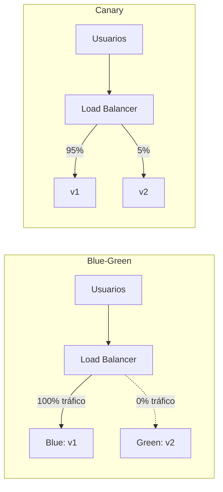
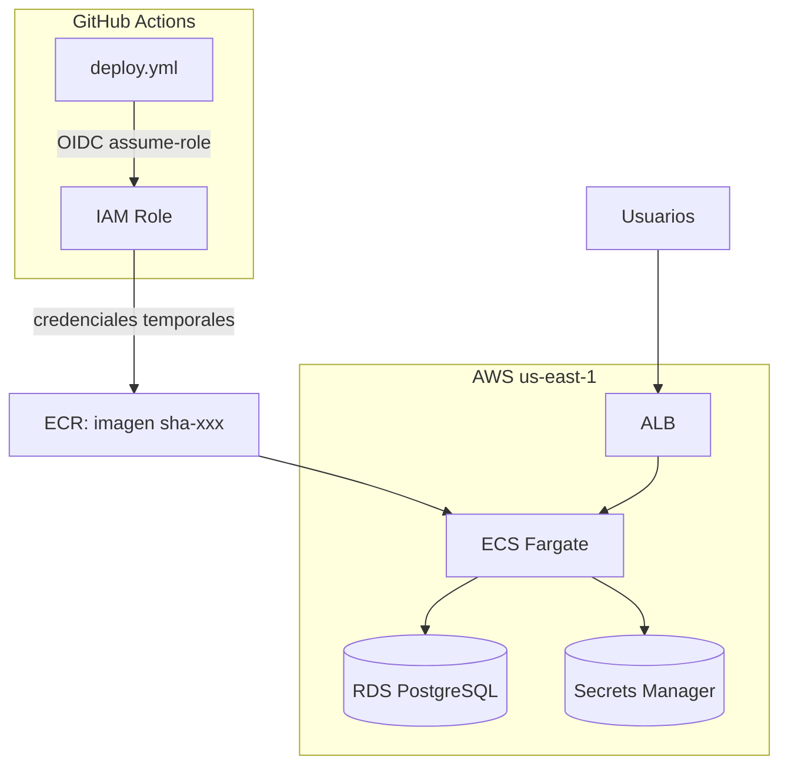

# 🧭 Guía 11 — Conceptos de CD y AWS desde cero

> **Nivel Avanzado · Guía 11 de 7**
> En esta guía damos el salto del CI (integración continua) al CD (despliegue continuo) y aterrizamos los conceptos fundamentales de AWS que necesitarás para las guías 12 a 17.

## 🎯 Objetivos de aprendizaje

Al terminar esta guía serás capaz de:

1. **Explicar la diferencia entre CI y CD** con tus propias palabras y con una analogía cotidiana.
2. **Describir las estrategias de despliegue blue-green y canary**: cómo funcionan, cuándo usarlas y qué riesgos mitigan.
3. **Definir los conceptos AWS fundamentales**: cuenta, región, ARN, consola, servicios regionales vs globales.
4. **Enumerar el inventario de servicios AWS del proyecto** y el rol de cada uno (ECS, ECR, RDS, IAM, ALB, VPC, Secrets Manager).
5. **Leer el diagrama de arquitectura simplificado** del despliegue del proyecto.

## 📋 Prerequisitos

- Nivel **Fundamentos** completo (guías 00-04), especialmente la guía 04 (Docker básico para CI/CD).
- Nivel **Intermedio** completo (guías 05-10), especialmente la guía 06 (walkthrough de `ci.yml`).
- **No se requiere experiencia previa con AWS**: esta guía parte desde cero.

## 1. CI vs CD desde cero

### 1.1 Recordatorio: qué es CI

En el nivel Fundamentos aprendiste que la **Integración Continua (CI)** es la práctica de integrar los cambios de todos los desarrolladores en una rama compartida de forma frecuente, verificando cada integración con un pipeline automatizado: build, tests, lint y análisis de calidad.

El workflow `ci.yml` del proyecto es un ejemplo perfecto de CI: cada push a una rama dispara un pipeline que compila, testea y valida el código antes de que llegue a `main`.

### 1.2 Qué es CD (Continuous Delivery / Continuous Deployment)

La **Entrega Continua (Continuous Delivery, CD)** extiende la CI: además de verificar que el código es correcto, lo deja **siempre listo para desplegarse en producción** de forma automatizada y reproducible.

Existe una distinción importante entre dos términos que suelen confundirse:

| Término                   | Qué hace                                                          | Intervención humana                   |
| ------------------------- | ----------------------------------------------------------------- | ------------------------------------- |
| **Continuous Delivery**   | El pipeline construye y publica artefactos listos para producción | Un humano aprueba el despliegue final |
| **Continuous Deployment** | El pipeline despliega automáticamente a producción                | Ninguna (o mínima)                    |

El proyecto usa **Continuous Delivery**: el workflow `deploy.yml` despliega a staging automáticamente, pero el despliegue a producción requiere **aprobación manual** vía GitHub Environments (lo verás en la guía 13).

### 1.3 Analogía: el restaurante

Para entender CI vs CD, imagina un restaurante:

- **CI** es el **control de calidad de la cocina**: cada vez que un cocinero prepara un plato nuevo, el chef lo prueba antes de que salga a la sala. Si algo está mal, se corrige al momento. Así, la cocina siempre tiene platos que funcionan.
- **CD** es el **servicio a la mesa**: una vez que el plato está aprobado, el camarero lo lleva al cliente (producción) de forma rápida y repetible. Si el restaurante tiene "Continuous Deployment", el plato llega solo; si tiene "Continuous Delivery", el maître aprueba antes de servirlo.

En el mundo del software:

- **CI** = cada push se integra y se verifica (build + tests).
- **CD** = cada push a `main` deja el artefacto listo para desplegar, y el despliegue se ejecuta de forma automatizada (con o sin aprobación humana).

### 1.4 Tabla comparativa CI vs CD

| Aspecto                | CI (Integración Continua)              | CD (Entrega/Despliegue Continuo)           |
| ---------------------- | -------------------------------------- | ------------------------------------------ |
| **Objetivo**           | Detectar errores de integración rápido | Entregar software listo para producción    |
| **Frecuencia**         | Por cada push / PR                     | Por cada merge a `main` (o release)        |
| **Artefacto**          | Código verificado                      | Imagen Docker + despliegue                 |
| **Entorno**            | CI runner efímero                      | Staging / Producción                       |
| **Ejemplo en el repo** | `ci.yml`                               | `deploy.yml`, `preview.yml`, `release.yml` |
| **Fallo típico**       | Test rojo, lint fallido                | Health check fallido, rollback             |

### 1.5 Dónde encaja cada workflow del proyecto

| Workflow      | Tipo                      | Disparador                 |
| ------------- | ------------------------- | -------------------------- |
| `ci.yml`      | CI                        | Push a cualquier rama / PR |
| `preview.yml` | CD (preview)              | PR abierto/actualizado     |
| `deploy.yml`  | CD (staging + producción) | Push a `main`              |
| `release.yml` | Release                   | Merge del PR de versionado |

## 2. Estrategias de despliegue

Desplegar no es solo "subir código nuevo". La pregunta clave es: **¿qué pasa si el código nuevo falla en producción?** Las estrategias de despliegue responden a esa pregunta con distintos niveles de riesgo.

### 2.1 Despliegue directo (naive)

La forma más simple: se detiene la versión vieja y se inicia la nueva. Si la nueva falla, los usuarios se quedan sin servicio hasta que alguien revierta manualmente. Es rápida pero **peligrosa** — en la guía 16 verás por qué el proyecto no hace esto.

### 2.2 Blue-Green

La estrategia **blue-green** mantiene **dos entornos idénticos**:

- **Blue**: la versión actual en producción.
- **Green**: la versión nueva, desplegada y verificada en paralelo.

Cuando Green está lista y validada, se **cambia el tráfico** (por ejemplo, en el balanceador de carga) de Blue a Green. Si algo sale mal, se revierte el switch en segundos.

**Ventajas**:

- Rollback instantáneo (volver a apuntar el tráfico a Blue).
- La versión nueva se puede probar en el entorno real antes de recibir tráfico.

**Desventajas**:

- Cuesta el doble de infraestructura (dos entornos completos).
- El switch es "todo o nada": no hay exposición gradual.

### 2.3 Canary

La estrategia **canary** (canario, como el pájaro en la mina) expone la versión nueva a un **porcentaje pequeño de usuarios** y lo aumenta progresivamente:

1. Se despliega la versión nueva junto a la vieja.
2. Se envía el 5% del tráfico a la nueva.
3. Si las métricas son buenas, se sube al 25%, 50%, 75%...
4. Al 100%, se retira la versión vieja.

**Ventajas**:

- Riesgo acotado: un fallo afecta solo al porcentaje expuesto.
- Detección temprana de problemas con métricas reales.

**Desventajas**:

- Requiere infraestructura de routing por porcentaje (load balancer, service mesh).
- Más complejo de operar y de monitorear.

### 2.4 Diagrama comparativo de estrategias



**ASCII fallback** (si mermaid no renderiza):

```
Blue-Green:  [Usuarios] → [LB] → 100% → [Blue: v1]   (Green: v2 espera, 0%)
Canary:      [Usuarios] → [LB] → 95% → [v1]
                              └→ 5%  → [v2]
```

**Lectura del diagrama**:

- En **blue-green**, todo el tráfico va a Blue; Green espera en paralelo hasta el switch.
- En **canary**, el tráfico se reparte por porcentaje entre v1 y v2.

> 💡 **¿Qué usa el proyecto?** El proyecto usa un modelo cercano a **blue-green con rollback automático**: ECS despliega la nueva task definition y, si el health check falla, el **circuit breaker** revierte automáticamente (guía 16). No usa canary por porcentaje porque el ALB del proyecto no está configurado para routing gradual.

## 3. AWS desde cero

Hasta aquí todo ha sido teoría de despliegue. Ahora aterrizamos en **AWS**, la nube donde vive la infraestructura del proyecto. Si nunca has usado AWS, esta sección es para ti.

### 3.1 Cuenta de AWS

Una **cuenta de AWS** es el contenedor raíz de todos tus recursos. Todo lo que creas (bases de datos, contenedores, usuarios IAM) pertenece a una cuenta. El proyecto tiene su infraestructura en una cuenta AWS gestionada con Terraform (verás el HCL en la guía 15).

### 3.2 Región

AWS tiene **centros de datos en todo el mundo** agrupados en **regiones** (por ejemplo, `us-east-1` en Virginia, `eu-west-1` en Irlanda). Cada región es independiente: un recurso creado en `us-east-1` no existe en `eu-west-1`.

**Regla práctica**: despliega los recursos **cerca de tus usuarios**. El proyecto usa `us-east-1` como región principal.

### 3.3 ARN (Amazon Resource Name)

Un **ARN** es el "DNI" de un recurso AWS. Tiene un formato estandarizado:

```
arn:partition:service:region:account-id:resource
```

Ejemplo ilustrativo del proyecto:

```
arn:aws:ecs:us-east-1:123456789012:service/project-one-cluster/project-one-service
```

| Parte          | Significado               |
| -------------- | ------------------------- |
| `arn`          | Prefijo fijo              |
| `aws`          | Partition (nube pública)  |
| `ecs`          | Servicio                  |
| `us-east-1`    | Región                    |
| `123456789012` | ID de cuenta              |
| `service/...`  | Tipo y nombre del recurso |

Los ARN aparecen por todas partes en IAM, ECS y en los workflows — saber leerlos es esencial.

### 3.4 Navegación por la consola

La **consola de AWS** (https://console.aws.amazon.com) es la interfaz web para gestionar recursos. Puntos clave:

- **Barra de búsqueda superior**: escribe el nombre del servicio (ECS, IAM, RDS...) para ir directo.
- **Selector de región** (arriba a la derecha): recuerda que los recursos son regionales — si no ves un recurso, probablemente estás en la región equivocada.
- **CloudShell**: terminal integrada en la consola con la CLI de AWS ya configurada.

> 💡 En este proyecto, la mayor parte del tiempo **no tocarás la consola**: los workflows despliegan solos. La consola es para **inspeccionar** (ver logs, estados de deployment, health checks).

### 3.5 Servicios regionales vs globales

AWS tiene dos tipos de servicios según su alcance:

| Tipo         | Alcance                               | Ejemplos                                 |
| ------------ | ------------------------------------- | ---------------------------------------- |
| **Regional** | Existen dentro de una región concreta | ECS, ECR, RDS, ALB, VPC, Secrets Manager |
| **Global**   | Únicos en toda la cuenta              | IAM, Route 53, CloudFront                |

**Consecuencia práctica**: cuando veas un ARN de ECS o RDS, incluirá la región (`us-east-1`). Cuando veas un ARN de IAM, **no** incluirá región:

```
# Regional (ECS)
arn:aws:ecs:us-east-1:123456789012:service/cluster/service

# Global (IAM role)
arn:aws:iam::123456789012:role/github-actions-role
```

### 3.6 El modelo de permisos: IAM

**IAM (Identity and Access Management)** es el servicio **global** que gestiona identidades y permisos. Dos piezas clave:

- **Policy**: documento JSON que dice _qué se puede hacer sobre qué_.
- **Role**: identidad a la que se le asignan policies, y que puede ser "asumida" por otros (por ejemplo, por GitHub Actions vía OIDC — guía 15).

Ejemplo de policy de mínimo privilegio (ECR push):

```json
{
  "Effect": "Allow",
  "Action": [
    "ecr:GetAuthorizationToken",
    "ecr:BatchCheckLayerAvailability",
    "ecr:PutImage",
    "ecr:InitiateLayerUpload"
  ],
  "Resource": "*"
}
```

No memorices el JSON: lo importante es el **modelo mental** — IAM decide _quién_ puede hacer _qué_ sobre _qué recurso_.

## 4. Inventario de servicios AWS del proyecto

El proyecto usa un conjunto concreto de servicios AWS. Esta tabla es tu **mapa de referencia** para todo el nivel:

| Servicio            | Tipo                     | Rol en el proyecto                                                                       |
| ------------------- | ------------------------ | ---------------------------------------------------------------------------------------- |
| **ECS Fargate**     | Regional (compute)       | Ejecuta los contenedores del server sin gestionar servidores (serverless containers)     |
| **ECR**             | Regional (registro)      | Registro privado de imágenes Docker; el workflow hace push de la imagen por SHA          |
| **RDS PostgreSQL**  | Regional (base de datos) | Base de datos gestionada; el server se conecta vía Prisma                                |
| **IAM**             | Global (identidad)       | Roles y policies; el role OIDC que asume GitHub Actions                                  |
| **ALB**             | Regional (red)           | Application Load Balancer; reparte tráfico y mantiene **sticky sessions** para Socket.IO |
| **VPC**             | Regional (red)           | Red virtual aislada donde viven ECS, RDS y el ALB                                        |
| **Secrets Manager** | Regional (secrets)       | Guarda secretos (JWT, DB credentials); emulado por Floci en dev/CI                       |

### 4.1 ECS Fargate — el corazón del despliegue

**ECS (Elastic Container Service)** ejecuta contenedores Docker en AWS. Con **Fargate**, AWS gestiona los servidores por ti: defines la **task definition** (imagen, CPU, memoria, health check) y ECS se encarga del resto.

Conceptos ECS que verás en la guía 16:

- **Cluster**: agrupación lógica de servicios (el proyecto tiene `project-one-cluster`).
- **Service**: instancia de una task definition con reglas de escalado y despliegue.
- **Task definition**: la "receta" del contenedor (imagen, puertos, env vars, health check).
- **Deployment**: el proceso de pasar de una task definition a otra.

### 4.2 ECR — el registro de imágenes

**ECR (Elastic Container Registry)** es el registro privado de imágenes Docker. El workflow `deploy.yml`:

1. Construye la imagen con un tag basado en el **SHA del commit** (`sha-<hash>`).
2. Hace login en ECR (con credenciales OIDC).
3. Hace push de la imagen.

El tag por SHA garantiza **reproducibilidad**: cada commit tiene una imagen única e inmutable.

### 4.3 RDS — la base de datos

**RDS (Relational Database Service)** gestiona PostgreSQL. El server se conecta vía **Prisma** usando las variables de entorno de la task definition. En desarrollo y CI, la base de datos se emula con un contenedor Postgres efímero (guías 12-14).

### 4.4 ALB — el balanceador de carga

El **ALB (Application Load Balancer)** recibe el tráfico de los usuarios y lo reparte entre las instancias del servicio ECS. Dos detalles importantes del proyecto:

- **Sticky sessions**: el ALB está configurado para que un cliente siempre caiga en la **misma instancia**. Esto es **necesario para Socket.IO**: las conexiones WebSocket en tiempo real deben mantenerse en el mismo servidor durante toda la sesión.
- **Health checks del target group**: el ALB verifica periódicamente el endpoint `/health` de cada instancia y deja de enviarle tráfico si no responde.

### 4.5 VPC — la red privada

La **VPC (Virtual Private Cloud)** es la red virtual aislada donde viven ECS, RDS y el ALB. Define subredes públicas (donde está el ALB) y privadas (donde están ECS y RDS). No necesitas gestionarla en este nivel, pero es útil saber que existe: es la frontera de seguridad de la infraestructura.

### 4.6 Secrets Manager — los secretos

**Secrets Manager** guarda secretos cifrados (JWT, credenciales de base de datos). En producción, la task definition de ECS referencia los secretos por nombre y ECS los inyecta como variables de entorno.

**Dato clave para el nivel**: en desarrollo y CI, Secrets Manager se **emula con Floci** (guía 12). El script `preview-smoke.mjs` hace `CreateSecret` + `GetSecretValue` contra el emulador para verificar que el patrón funciona antes de llegar a AWS real.

## 5. Diagrama de arquitectura simplificado

El proyecto tiene un diagrama completo en `docs/aws-deploy-architecture.md`. Aquí reproducimos una **versión simplificada** (~20 líneas) con fines didácticos — consulta el original para el detalle completo:



**ASCII fallback** (si mermaid no renderiza):

```
[GitHub Actions: deploy.yml] --OIDC assume-role--> [IAM Role]
                                                      |
                                                      v
[Usuarios] --> [ALB] --> [ECS Fargate] <-- [ECR: imagen sha-xxx]
                            |
                            +--> [RDS PostgreSQL]
                            +--> [Secrets Manager]
```

**# Source:** versión simplificada de `docs/aws-deploy-architecture.md` (diagrama completo ~48 líneas en el original).

**Lectura del diagrama**:

1. GitHub Actions asume un rol IAM vía **OIDC** (sin credenciales estáticas).
2. Con esas credenciales, hace push de la imagen a **ECR**.
3. **ECS Fargate** descarga la imagen y ejecuta el contenedor.
4. El contenedor se conecta a **RDS** (PostgreSQL) y lee secretos de **Secrets Manager**.
5. El **ALB** recibe el tráfico de los usuarios y lo reparte al servicio ECS.

## 6. Resumen

En esta guía has aprendido:

1. **CI vs CD**: CI verifica el código; CD lo deja listo y lo despliega. El proyecto usa Continuous Delivery (aprobación manual en producción).
2. **Estrategias de despliegue**: blue-green (switch de tráfico entre dos entornos) y canary (porcentaje progresivo). El proyecto usa un modelo cercano a blue-green con rollback automático vía circuit breaker.
3. **AWS desde cero**: cuenta, región (`us-east-1`), ARN, consola, servicios regionales vs globales, y el modelo IAM (policy + role).
4. **Inventario de servicios**: ECS Fargate (compute), ECR (registro), RDS (base de datos), IAM (identidad), ALB (balanceo + sticky sessions), VPC (red), Secrets Manager (secretos).
5. **Arquitectura**: GitHub Actions → OIDC → ECR → ECS → RDS/Secrets Manager, con el ALB al frente.

**Siguiente paso**: en la [guía 12](./12-floci-emulador-aws.md) aprenderás a usar **Floci**, el emulador de AWS que te permitirá practicar todo esto sin una cuenta real.

## ❓ FAQ

### ¿Necesito saber AWS para ser desarrollador backend?

No es obligatorio, pero **sí es muy valioso**: entender el despliegue te hace mejor desarrollador porque sabes cómo tu código llega a producción y qué puede fallar en el camino. Este nivel te da exactamente esa visión.

### ¿Qué es más importante, blue-green o canary?

Depende del contexto. **Blue-green** es más simple de operar y da rollback instantáneo; **canary** es mejor para detectar problemas con tráfico real pero requiere más infraestructura. Para un proyecto como este, blue-green con rollback automático es la opción pragmática.

### ¿Por qué `us-east-1`?

Es la región más antigua y con más servicios disponibles de AWS. El proyecto la usa como región principal. En un proyecto real elegirías la región más cercana a tus usuarios.

### ¿Qué es un "target group"?

Es el grupo de instancias (targets) al que el ALB envía tráfico, con su propia configuración de health checks. En ECS, el service registra sus tasks en el target group automáticamente.

## 📖 Glosario

| Término                   | Definición                                                            |
| ------------------------- | --------------------------------------------------------------------- |
| **Account ID**            | Identificador numérico de 12 dígitos de la cuenta AWS                 |
| **Blast radius**          | El alcance del daño si una credencial se ve comprometida              |
| **Continuous Delivery**   | El pipeline deja el software listo para producción; un humano aprueba |
| **Continuous Deployment** | El pipeline despliega a producción automáticamente                    |
| **Load balancer**         | Componente que reparte tráfico entre varias instancias                |
| **Region**                | Centro de datos geográfico de AWS (ej. `us-east-1`)                   |
| **Rollback**              | Volver a una versión anterior del software                            |
| **Target group**          | Grupo de instancias al que el ALB envía tráfico                       |

## 7. Hands-on: ejercicios prácticos

Esta sección consolida lo aprendido con ejercicios que puedes hacer sin cuenta de AWS (usando la consola de solo lectura si tienes acceso, o simplemente razonando las respuestas).

### Ejercicio 1: leer ARNs

Identifica cada parte de estos ARNs ilustrativos del proyecto:

```
arn:aws:ecr:us-east-1:123456789012:repository/project-one-server
arn:aws:iam::123456789012:role/github-actions-deploy-role
arn:aws:secretsmanager:us-east-1:123456789012:secret:prod/JWT_SECRET-abc123
```

Para cada uno responde: ¿qué servicio? ¿es regional o global? ¿qué recurso identifica?

**Respuestas** (cubre antes de mirar):

1. ECR, regional (`us-east-1`), el repositorio `project-one-server`.
2. IAM, global (no tiene región), el role `github-actions-deploy-role`.
3. Secrets Manager, regional, el secreto `prod/JWT_SECRET` (el sufijo `-abc123` es el random suffix que AWS añade).

### Ejercicio 2: clasificar servicios

Clasifica cada servicio como **regional** o **global**: ECS, IAM, ECR, RDS, ALB, VPC, Secrets Manager, Route 53.

**Respuesta**: regionales — ECS, ECR, RDS, ALB, VPC, Secrets Manager. Globales — IAM, Route 53.

### Ejercicio 3: elegir estrategia de despliegue

Para cada escenario, ¿qué estrategia elegirías (blue-green, canary o directo) y por qué?

1. Una app de chat con WebSocket que no puede permitirse downtime.
2. Un servicio interno con pocos usuarios y sin presupuesto para duplicar infraestructura.
3. Una API pública con métricas de error bien monitorizadas y equipo con experiencia en canary.

**Respuestas orientativas**:

1. Blue-green: el switch de tráfico evita downtime y el rollback es instantáneo.
2. Directo (o blue-green si el downtime es inaceptable): duplicar infraestructura puede no justificarse.
3. Canary: las métricas permiten detectar problemas con un porcentaje pequeño antes de exponer a todos.

### Ejercicio 4: explicar el diagrama

Sin mirar la sección 5, dibuja de memoria el flujo: GitHub Actions → OIDC → ECR → ECS → RDS/Secrets Manager, con el ALB al frente. Después compáralo con el diagrama de la sección 5.

## 8. Profundización: IAM y políticas

IAM es el servicio que más cuesta entender al principio. Esta sección lo desglosa con calma.

### 8.1 Los tres componentes

| Componente    | Qué es                                   | Analogía                         |
| ------------- | ---------------------------------------- | -------------------------------- |
| **Principal** | Quién pide permiso (user, role, service) | La persona que entra al edificio |
| **Policy**    | Qué permisos tiene (JSON)                | La tarjeta de acceso             |
| **Resource**  | Sobre qué se aplica (ARN)                | La puerta concreta               |

### 8.2 Anatomía de una policy

Toda policy IAM es un JSON con una lista de statements:

```json
{
  "Version": "2012-10-17",
  "Statement": [
    {
      "Effect": "Allow",
      "Action": ["ecs:UpdateService", "ecs:DescribeServices"],
      "Resource": "arn:aws:ecs:us-east-1:123456789012:service/project-one-cluster/*"
    }
  ]
}
```

| Campo       | Significado                                                                           |
| ----------- | ------------------------------------------------------------------------------------- |
| `Effect`    | `Allow` o `Deny`                                                                      |
| `Action`    | Operaciones permitidas (`ecs:UpdateService`, `s3:GetObject`...)                       |
| `Resource`  | ARN o patrón de ARN sobre el que aplica                                               |
| `Condition` | (opcional) Restricciones adicionales (ej. `StringLike` sobre el subject del JWT OIDC) |

### 8.3 Mínimo privilegio

El **principio de mínimo privilegio** dice: concede **solo** los permisos necesarios para la tarea, nada más. El proyecto lo aplica en dos niveles:

- **IAM**: el role de GitHub Actions solo puede hacer ECR push/pull y ECS update/describe **en los clusters del proyecto** (no en toda la cuenta).
- **GitHub**: los secrets se exponen solo a los workflows que los necesitan, y los environments restringen qué ramas pueden desplegar.

### 8.4 Deny explícito vs ausencia de Allow

En IAM, la ausencia de un `Allow` ya es un **deny implícito**. Un `Deny` explícito es necesario solo para **anular** un Allow (por ejemplo, de una policy gestionada por AWS). Regla mental: _lo que no está permitido, está denegado_.

### 8.5 Policies gestionadas vs inline

- **Managed policy**: JSON reutilizable entre varios roles (ej. `AmazonEC2ReadOnlyAccess`).
- **Inline policy**: JSON incrustado en un único role/user.

El proyecto usa policies **inline o custom managed** para el role OIDC, porque las gestionadas por AWS son demasiado amplias para el mínimo privilegio.

## 9. Profundización: ECS y ECR en detalle

### 9.1 El ciclo de vida de una imagen

1. **Build**: Docker construye la imagen desde el `Dockerfile` (workflow `deploy.yml`, Fase 1).
2. **Push**: la imagen se sube a ECR con un tag único por SHA (`sha-<hash>`).
3. **Pull**: ECS descarga la imagen desde ECR al crear las tasks.
4. **Run**: el contenedor arranca con la configuración de la task definition.

### 9.2 Task definition: la receta

Una task definition es un JSON que describe el contenedor. Campos clave:

| Campo              | Ejemplo                                                                   | Significado                    |
| ------------------ | ------------------------------------------------------------------------- | ------------------------------ |
| `image`            | `123456789012.dkr.ecr.us-east-1.amazonaws.com/project-one-server:sha-abc` | Imagen a ejecutar              |
| `cpu` / `memory`   | `256` / `512`                                                             | Recursos asignados             |
| `portMappings`     | `[{containerPort: 3000}]`                                                 | Puertos del contenedor         |
| `environment`      | `[{name: "NODE_ENV", value: "production"}]`                               | Variables de entorno           |
| `secrets`          | `[{name: "SECRETKEY", valueFrom: "arn:...:secret:prod/JWT_SECRET"}]`      | Secretos desde Secrets Manager |
| `healthCheck`      | `{command: ["CMD-SHELL", "curl -f http://localhost:3000/health"]}`        | Health check del contenedor    |
| `logConfiguration` | `awslogs`                                                                 | Envío de logs a CloudWatch     |

### 9.3 ECR: repositorios y tags

- Un **repositorio** ECR agrupa las imágenes de un servicio (ej. `project-one-server`).
- Los **tags** identifican versiones: `sha-<hash>` para cada commit, `latest` para la última.
- El **URI** de la imagen tiene la forma `<account>.dkr.ecr.<region>.amazonaws.com/<repo>:<tag>`.

### 9.4 ¿Por qué el tag por SHA?

Si dos deploys usaran el mismo tag (`latest`), no sabrías **qué código** está corriendo. Con `sha-<hash>`:

- Cada commit tiene una imagen **inmutable y única**.
- El rollback es trivial: apuntar la task definition al SHA anterior.
- La auditoría es directa: imagen → SHA → commit → código.

### 9.5 ECS service vs task

| Concepto    | Qué es                                             | Analogía                  |
| ----------- | -------------------------------------------------- | ------------------------- |
| **Task**    | Una ejecución concreta de la task definition       | Un proceso                |
| **Service** | Mantiene N tasks corriendo, con deploys y escalado | Un supervisor de procesos |
| **Cluster** | Contenedor lógico de services                      | El "host" lógico          |

## 10. Autoevaluación

Responde sin mirar las secciones anteriores. Las respuestas están al final.

### Preguntas

1. ¿Cuál es la diferencia principal entre Continuous Delivery y Continuous Deployment?
2. Nombra dos ventajas y una desventaja de blue-green.
3. ¿Qué significa que IAM es un servicio "global"?
4. Escribe el ARN de un secreto de Secrets Manager en `us-east-1` de la cuenta `123456789012` llamado `prod/DB_PASSWORD`.
5. ¿Por qué el ALB del proyecto necesita sticky sessions?
6. ¿Qué hace el health check del target group?
7. ¿Qué servicio emula Floci en desarrollo y CI?
8. ¿Qué es un ARN y para qué sirve?
9. ¿Cuál es la diferencia entre un deny implícito y uno explícito en IAM?
10. ¿Por qué el tag de imagen por SHA mejora la auditoría?

### Respuestas

1. Delivery deja el artefacto listo y requiere aprobación humana; Deployment despliega automáticamente.
2. Ventajas: rollback instantáneo y prueba en entorno real antes del switch. Desventaja: duplica infraestructura.
3. Que existe una sola vez en toda la cuenta, sin importar la región.
4. `arn:aws:secretsmanager:us-east-1:123456789012:secret:prod/DB_PASSWORD-xxxxxx`.
5. Para que las conexiones WebSocket de Socket.IO se mantengan en la misma instancia durante toda la sesión.
6. Verifica periódicamente que cada instancia responde en `/health` y deja de enviarle tráfico si falla.
7. Secrets Manager (y otros ~68 servicios AWS).
8. Identificador único y estandarizado de un recurso AWS; se usa en IAM, ECS y los workflows.
9. Implícito: no hay Allow, así que está denegado. Explícito: un Deny que anula un Allow existente.
10. Cada commit tiene una imagen única e inmutable; puedes saber exactamente qué código corre y revertir a un SHA anterior.

### Criterio de aprobación

- **8-10 correctas**: listo para la guía 12.
- **5-7 correctas**: repasa las secciones 3-5 y vuelve a intentarlo.
- **<5 correctas**: repasa la guía completa antes de continuar.

## 11. FAQ adicional

### ¿Cuánto cuesta AWS?

Depende del uso. ECS Fargate cobra por CPU/memoria usada; RDS cobra por instancia. El proyecto usa instancias pequeñas para staging y producción. Para aprender, Floci es gratis y local.

### ¿Puedo usar la consola de AWS sin pagar?

Sí, la consola y la mayoría de las vistas de solo lectura son gratis. Crear recursos cuesta dinero, así que **no crees recursos** en la cuenta del proyecto sin permiso.

### ¿Qué es CloudWatch?

Es el servicio de logs y métricas de AWS. ECS envía los logs de los contenedores a CloudWatch (`logConfiguration: awslogs`). Cuando un deploy falla, los logs están en CloudWatch.

### ¿Qué diferencia hay entre ECS y Kubernetes?

Ambos orquestan contenedores. ECS es el servicio gestionado de AWS (más simple, integrado con IAM/ALB); Kubernetes es una plataforma agnóstica y más compleja. El proyecto usa ECS por simplicidad.

### ¿Por qué el proyecto no usa canary?

El ALB del proyecto no está configurado para routing por porcentaje, y el equipo prefiere la simplicidad de blue-green con rollback automático. Canary añade complejidad operativa que no se justifica para este proyecto.

## ✅ Checklist de la guía

- [ ] Puedo explicar CI vs CD con una analogía.
- [ ] Puedo describir blue-green y canary.
- [ ] Puedo leer un ARN completo.
- [ ] Puedo clasificar servicios regionales vs globales.
- [ ] Puedo enumerar los 7 servicios del proyecto y su rol.
- [ ] Puedo explicar el flujo del diagrama de arquitectura.
- [ ] Puedo explicar el mínimo privilegio en IAM.
- [ ] He completado los 4 ejercicios hands-on.
- [ ] He obtenido 8+ en la autoevaluación.

## 🧭 Navegación

| Anterior                                        | Actual                         | Siguiente                                                 |
| ----------------------------------------------- | ------------------------------ | --------------------------------------------------------- |
| [10-testing-pipeline](./10-testing-pipeline.md) | **11 — Conceptos de CD y AWS** | [12 — Floci: emulador de AWS](./12-floci-emulador-aws.md) |

- [Volver al índice Avanzado](./avanzado-README.md)
- [Volver al índice Intermedio](./intermedio-README.md)

## 12. Caso de estudio: un despliegue real del proyecto

Para conectar toda la teoría, sigue mentalmente un despliegue real del proyecto. Este es el flujo completo que verás en detalle en las guías 13-16:

### 12.1 El push a main

Un desarrollador mergea un PR a `main`. Ese push dispara dos workflows:

1. `ci.yml` — verifica el código (build, tests, lint).
2. `deploy.yml` — construye la imagen y la despliega.

### 12.2 Fase 1: build y verificación

El job `docker-build`:

1. Construye la imagen Docker del server.
2. Levanta servicios efímeros: **Floci** (emula Secrets Manager) y **Postgres**.
3. Espera al health check del server.
4. Ejecuta smoke tests contra el stack emulado.

Si algo falla aquí, el workflow se detiene: **nada se despliega**.

### 12.3 Fase 2: push y despliegue

1. `ecr-push`: asume el rol IAM vía **OIDC**, hace login en ECR y sube la imagen con tag `sha-<hash>`.
2. `deploy-staging`: registra la task definition y fuerza un nuevo deployment en staging.
3. `deploy-production`: **espera aprobación manual** (GitHub Environments) y despliega en producción.

### 12.4 El despliegue en ECS

ECS ejecuta el deployment con el **circuit breaker** activo:

1. Arranca las nuevas tasks con la imagen `sha-<hash>`.
2. Espera al health check (interval 30s, timeout 5s, retries 3, startPeriod 60s).
3. Si las tasks no pasan el health check, **revierte automáticamente** a la versión anterior.
4. Si pasan, el ALB empieza a enviarles tráfico.

### 12.5 Después del despliegue

- Los smoke tests post-deploy verifican `/health` durante 5 minutos (30 retries × 10s).
- Los logs del contenedor van a CloudWatch.
- Si algo falla en producción, el equipo revierte apuntando la task definition al SHA anterior.

### 12.6 Mapa de conceptos

| Paso                    | Concepto de esta guía       | Guía donde se profundiza |
| ----------------------- | --------------------------- | ------------------------ |
| Build + smoke tests     | CI / CD                     | 13                       |
| OIDC assume-role        | IAM, mínimo privilegio      | 15                       |
| Push a ECR              | ECR, tag por SHA            | 13                       |
| Deploy en ECS           | ECS, task definition        | 16                       |
| Health check + rollback | Blue-green, circuit breaker | 16                       |
| Aprobación manual       | Continuous Delivery         | 13                       |

## 13. Banco de analogías

Las analogías ayudan a fijar conceptos. Guarda estas en tu caja de herramientas:

| Concepto          | Analogía                                                                                    |
| ----------------- | ------------------------------------------------------------------------------------------- |
| CI                | El chef que prueba cada plato antes de que salga a la sala                                  |
| CD                | El camarero que lleva el plato aprobado a la mesa                                           |
| Blue-green        | Dos cocinas idénticas; cuando la nueva está lista, se abre la puerta del comedor hacia ella |
| Canary            | Probar un plato nuevo dándole una cucharada a un comensal antes de servirlo a todos         |
| ARN               | El DNI de un recurso AWS                                                                    |
| Región            | La ciudad donde está el restaurante                                                         |
| IAM policy        | La tarjeta de acceso que dice qué puertas puedes abrir                                      |
| Mínimo privilegio | Dar a cada empleado solo las llaves de las puertas que necesita                             |
| Task definition   | La receta del plato (ingredientes, cantidades, tiempo)                                      |
| Circuit breaker   | El extintor automático que apaga el fuego antes de que queme la cocina                      |
| Sticky sessions   | El camarero que siempre atiende a la misma mesa                                             |
| Secrets Manager   | La caja fuerte del restaurante                                                              |

## 14. Errores comunes

### Confundir CI con CD

**Error**: "CD es lo mismo que CI pero en producción".
**Realidad**: CI verifica el código; CD lo entrega y despliega. Son fases complementarias del mismo pipeline.

### Pensar que Floci es hosting

**Error**: "Desplegamos en Floci".
**Realidad**: Floci es un **emulador** para dev/CI. Producción usa AWS real (guía 12, sección de advertencia).

### Ignorar la región

**Error**: "No encuentro el recurso en la consola".
**Realidad**: probablemente estás en otra región. Los recursos son regionales; cambia el selector de región.

### Leer mal un ARN

**Error**: "El ARN de IAM tiene región".
**Realidad**: IAM es global; su ARN no incluye región. Si ves `:us-east-1:` en un ARN, es un servicio regional.

### Subestimar el mínimo privilegio

**Error**: "Le doy `AdministratorAccess` al role de CI, es más fácil".
**Realidad**: si el role se compromete, el atacante controla toda la cuenta. El mínimo privilegio limita el blast radius (guía 15).

## 15. Profundización: cuándo usar cada estrategia

### 15.1 Tabla de decisión

| Factor                       | Directo             | Blue-Green                      | Canary                             |
| ---------------------------- | ------------------- | ------------------------------- | ---------------------------------- |
| **Downtime aceptable**       | No                  | No (switch instantáneo)         | No                                 |
| **Costo de infraestructura** | Bajo                | Alto (2x)                       | Medio                              |
| **Complejidad operativa**    | Baja                | Media                           | Alta                               |
| **Detección de problemas**   | Tardía              | Antes del switch                | Temprana (con métricas)            |
| **Rollback**                 | Manual y lento      | Instantáneo (switch)            | Progresivo (bajar %)               |
| **Riesgo de fallo**          | Alto                | Medio                           | Bajo                               |
| **Cuándo usarla**            | Prototipos, sin SLA | Apps críticas, equipos pequeños | APIs con métricas, equipos maduros |

### 15.2 El despliegue del proyecto en contexto

El proyecto combina elementos de varias estrategias:

- **Blue-green**: ECS mantiene las tasks viejas hasta que las nuevas pasan el health check; el ALB solo envía tráfico a las sanas.
- **Rollback automático**: el circuit breaker revierte si el health check falla (guía 16).
- **Aprobación humana**: la protección de environment en producción (guía 13).

Este enfoque híbrido es el **estándar pragmático** para proyectos medianos: robusto sin la complejidad de un canary completo.

### 15.3 ¿Cuándo migrar a canary?

Considera canary cuando:

- Tengas métricas de error y latencia **en tiempo real** por versión.
- El equipo tenga experiencia operando deploys graduales.
- El costo de un fallo total sea muy alto (miles de usuarios afectados).

Hasta entonces, blue-green con circuit breaker es una elección sólida.

## 16. Referencias

| Documento                         | Para qué consultarlo                                |
| --------------------------------- | --------------------------------------------------- |
| `docs/aws-deploy-architecture.md` | Diagrama completo de la arquitectura de despliegue  |
| `docs/cicd-estado-actual.md`      | Estado actual de los workflows y datos del proyecto |
| `docs/aws-cd-learning-path.md`    | Ruta pedagógica Floci → Consola → Terraform         |
| `.github/workflows/deploy.yml`    | El workflow de despliegue real (guía 13)            |
| `infra/`                          | Terraform: la infraestructura como código (guía 15) |

## 17. Glosario extendido

| Término                  | Definición                                                                |
| ------------------------ | ------------------------------------------------------------------------- |
| **CloudWatch**           | Servicio de logs y métricas de AWS                                        |
| **Cluster (ECS)**        | Agrupación lógica de services de ECS                                      |
| **Condition (IAM)**      | Restricción opcional en una policy (ej. StringLike sobre el subject OIDC) |
| **Deny implícito**       | Ausencia de Allow: la acción está denegada por defecto                    |
| **Deny explícito**       | Un Deny que anula un Allow existente                                      |
| **Environment (GitHub)** | Entorno con protecciones (aprobación manual, ramas permitidas)            |
| **Fargate**              | Modo serverless de ECS: sin servidores que gestionar                      |
| **Managed policy**       | Policy IAM reutilizable entre roles                                       |
| **Mínimo privilegio**    | Conceder solo los permisos necesarios                                     |
| **Principal (IAM)**      | Quién pide permiso: user, role o servicio                                 |
| **Service (ECS)**        | Supervisor que mantiene N tasks corriendo                                 |
| **Sticky session**       | Fijar un cliente a una instancia concreta                                 |
| **Target group**         | Grupo de instancias al que el ALB envía tráfico                           |
| **Task (ECS)**           | Una ejecución concreta de la task definition                              |
| **Task definition**      | La receta del contenedor: imagen, CPU, memoria, health check              |
| **URI de imagen**        | `<account>.dkr.ecr.<region>.amazonaws.com/<repo>:<tag>`                   |

## 18. Palabras finales

Has completado la base teórica del nivel Avanzado. Ahora entiendes:

- Qué es el CD y cómo se diferencia del CI.
- Las estrategias de despliegue y cuál usa el proyecto.
- Los conceptos AWS fundamentales y el inventario de servicios.
- La arquitectura de despliegue del proyecto.

En la [guía 12](./12-floci-emulador-aws.md) pondrás esto en práctica: aprenderás a usar **Floci** para emular AWS en local y en CI, sin necesidad de una cuenta real. Es la herramienta que te permitirá experimentar con seguridad.

---

_Guía 11 de 7 del nivel Avanzado. Anterior: [10 — Testing Pipeline](./10-testing-pipeline.md) · Siguiente: [12 — Floci: emulador de AWS](./12-floci-emulador-aws.md)._

## 19. Profundización: la CLI de AWS y CloudShell

### 19.1 ¿Qué es la AWS CLI?

La **AWS CLI** es la herramienta de línea de comandos para interactuar con AWS. Los workflows del proyecto la usan constantemente (por ejemplo, `aws ecr get-login-password` o `aws ecs update-service`). Conocerla te ayudará a leer los workflows con fluidez.

Comandos que verás en las guías siguientes:

```bash
# Login en ECR (guía 13)
aws ecr get-login-password --region us-east-1 | docker login --username AWS --password-stdin <account>.dkr.ecr.us-east-1.amazonaws.com

# Forzar un nuevo deployment (guía 16)
aws ecs update-service --cluster project-one-cluster --service project-one-service \
  --force-new-deployment --region us-east-1

# Describir el estado de un servicio
aws ecs describe-services --cluster project-one-cluster --services project-one-service --region us-east-1
```

### 19.2 CloudShell

**CloudShell** es una terminal integrada en la consola de AWS con la CLI ya instalada y autenticada. Es la forma más rápida de probar comandos sin configurar nada en tu máquina.

### 19.3 Variables de entorno de la CLI

La CLI lee credenciales de varias fuentes, en este orden:

1. Variables de entorno (`AWS_ACCESS_KEY_ID`, `AWS_SECRET_ACCESS_KEY`, `AWS_SESSION_TOKEN`).
2. Archivo de credenciales (`~/.aws/credentials`).
3. **Web identity / SSO** (el caso OIDC del proyecto).
4. Rol de instancia (si corres en EC2/ECS).

En el proyecto, GitHub Actions usa la opción 3: el role OIDC emite credenciales temporales que la CLI recoge automáticamente.

## 20. Profundización: ALB y red

### 20.1 Cómo decide el ALB a qué instancia enviar

1. El cliente hace una petición al DNS del ALB.
2. El ALB elige un target del target group (por defecto, round-robin).
3. Con **sticky sessions**, el ALB recuerda la elección mediante una cookie y reutiliza el mismo target.

### 20.2 Health checks del target group

El target group tiene su propia configuración de health check, independiente del health check del contenedor:

| Parámetro             | Valor típico | Significado                                          |
| --------------------- | ------------ | ---------------------------------------------------- |
| `Path`                | `/health`    | Endpoint que se verifica                             |
| `Interval`            | 30s          | Cada cuánto se verifica                              |
| `Timeout`             | 5s           | Tiempo máximo de espera de respuesta                 |
| `Healthy threshold`   | 3            | Verificaciones seguidas OK para marcar sano          |
| `Unhealthy threshold` | 3            | Verificaciones seguidas fallidas para marcar no sano |

### 20.3 Subredes públicas y privadas

- **Subred pública**: tiene acceso a Internet (el ALB vive aquí).
- **Subred privada**: sin acceso directo a Internet (ECS y RDS viven aquí; ECS sale a Internet vía NAT gateway para descargar imágenes).

Este aislamiento es una capa de seguridad: la base de datos nunca está expuesta directamente a Internet.
