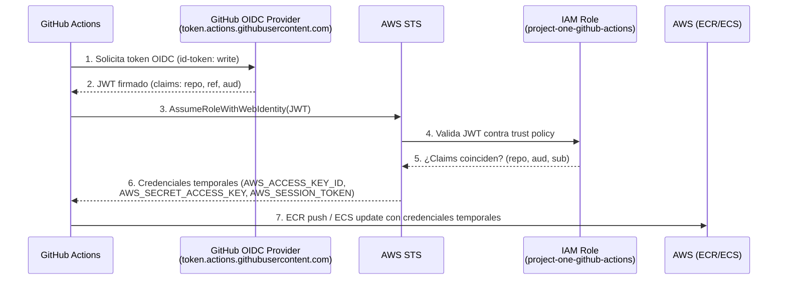

# Guía 15 — OIDC: despliegues sin credenciales estáticas

> **Nivel**: Avanzado · **Guía 15 de 7** · **Tema**: OpenID Connect (OIDC) para autenticar GitHub Actions contra AWS sin access keys

Esta guía explica cómo el proyecto elimina las **credenciales estáticas de larga duración** (access keys de IAM user) en el pipeline de deploy, sustituyéndolas por **credenciales temporales emitidas por AWS STS** a través de **OpenID Connect (OIDC)**. Verás el flujo completo del JWT, el modelo de trust policy, la política de mínimo privilegio y las limitaciones de Floci para emular este flujo.

## 🎯 Objetivos de aprendizaje

- [ ] Explicar por qué OIDC reemplaza a las access keys de larga duración (rotación, blast radius, auditoría).
- [ ] Describir el flujo completo: GitHub firma un JWT → trust policy IAM verifica → STS assume-role-with-web-identity → credenciales temporales.
- [ ] Explicar el modelo OIDC preciso: trust policy `StringLike` con `repo:owner/repo:*` + `aud: sts.amazonaws.com` + filtro de environment en GitHub Environments.
- [ ] Identificar la inconsistencia `:ref:refs/heads/main` (documentado) vs `repo:*` (HCL real) como lección de verificación.
- [ ] Explicar la política de mínimo privilegio (ECR push/pull, ECS update/describe solo en clusters del proyecto).
- [ ] Comparar IAM role (temporal, scoped) vs IAM user (estático) y por qué OIDC elimina users para CI.
- [ ] Reconocer la limitación de Floci: no emula `STS:AssumeRoleWithWebIdentity`.

## 📋 Prerequisitos

- Guía 13 — [Walkthrough de deploy.yml](./13-deploy-yml-walkthrough.md)
- Guía 12 — [Floci: emulador de AWS](./12-floci-emulador-aws.md)
- Guía 03 — [Secrets y variables](./03-secrets-variables.md)
- Conceptos básicos de IAM (roles, policies, trust relationships)
- Conocimiento de JWT (estructura header.payload.signature)

## 1. El problema: credenciales estáticas en CI

### 1.1 El modelo clásico (y sus dolores)

Históricamente, un pipeline de CI/CD que desplegaba a AWS guardaba un par de **access keys de un IAM user** en los secrets del repositorio:

```yaml
# .github/workflows/deploy.yml (modelo clásico — NO es el del proyecto)
env:
  AWS_ACCESS_KEY_ID: ${{ secrets.AWS_ACCESS_KEY_ID }}
  AWS_SECRET_ACCESS_KEY: ${{ secrets.AWS_SECRET_ACCESS_KEY }}
```

Este modelo funciona, pero arrastra cuatro dolores crónicos:

| Dolor                   | Descripción                                                                                                                                                                                     |
| ----------------------- | ----------------------------------------------------------------------------------------------------------------------------------------------------------------------------------------------- |
| **Rotación dolorosa**   | Las access keys no caducan. Hay que rotarlas manualmente cada N días, coordinando el cambio en todos los repos que las usan.                                                                    |
| **Blast radius enorme** | Si una key se filtra (log, dependencia comprometida, empleado que se va), el atacante tiene acceso **hasta que alguien la revoque**. Y mientras tanto, puede asumir cualquier permiso del user. |
| **Auditoría difícil**   | Todas las acciones de CI aparecen como el mismo IAM user. No puedes distinguir "este deploy vino del repo X, rama main" de "este deploy vino del repo Y".                                       |
| **Secret sprawl**       | Cada repo necesita su copia de las keys. Más repos = más copias = más superficie de ataque.                                                                                                     |

> 🔑 **Regla mental**: una access key es una **llave maestra** que no caduca. OIDC es un **pase de acceso** que caduca en minutos y solo sirve para una acción concreta.

### 1.2 La alternativa: OIDC

**OpenID Connect (OIDC)** es un protocolo de autenticación construido sobre OAuth 2.0. En el contexto de CI/CD, permite que **GitHub Actions se autentique contra AWS sin compartir ninguna credencial estática**:

1. GitHub (el _identity provider_) firma un **JWT** que describe el contexto del workflow (repo, ref, environment, job).
2. El workflow presenta ese JWT a **AWS STS** mediante `AssumeRoleWithWebIdentity`.
3. AWS valida el JWT contra la **trust policy** del role IAM.
4. Si la validación pasa, STS devuelve **credenciales temporales** (máx. 1 hora) para ese role.

El resultado: **no hay access keys en los secrets**, las credenciales caducan solas, y cada deploy queda auditado con el contexto exacto del workflow que lo originó.

## 2. El flujo completo del JWT

### 2.1 Diagrama del flujo



### 2.2 ASCII fallback

```
GitHub Actions                GitHub OIDC Provider            AWS STS
     |                                |                          |
     | 1. id-token: write             |                          |
     |------------------------------->|                          |
     |                                | 2. JWT firmado           |
     |<-------------------------------|                          |
     | 3. AssumeRoleWithWebIdentity(JWT)                         |
     |---------------------------------------------------------->|
     |                                | 4. Valida contra trust   |
     |                                |    policy del role       |
     |                                |<-------------------------|
     |                                | 5. OK / Denegado         |
     |<----------------------------------------------------------|
     | 6. Credenciales temporales     |                          |
     | 7. ECR push / ECS update       |                          |
```

### 2.3 Los tres actores

| Actor                       | Rol                                   | Ejemplo en el proyecto                                |
| --------------------------- | ------------------------------------- | ----------------------------------------------------- |
| **Identity Provider (IdP)** | Emite y firma el JWT                  | GitHub (`token.actions.githubusercontent.com`)        |
| **Relying Party (RP)**      | Confía en el IdP y emite credenciales | AWS STS + IAM role `project-one-github-actions`       |
| **Workflow**                | Obtiene el token y lo presenta        | GitHub Actions job con `permissions: id-token: write` |

### 2.4 El claim `aud` (audience)

El JWT incluye un claim `aud` (audiencia) que indica **para quién** está destinado el token. En el proyecto, el workflow solicita el token con:

```yaml
permissions:
  id-token: write # necesario para pedir el token OIDC
  contents: read
```

Y la trust policy exige `aud: sts.amazonaws.com`. Esto evita que un JWT emitido para otra audiencia (p. ej. otra plataforma) sea aceptado por AWS.

> 🔑 **Regla mental**: `aud` es el "destinatario" del JWT. Si el destinatario no coincide con el que valida, el token se rechaza.

## 3. El modelo de trust policy

### 3.1 ¿Qué es una trust policy?

Una **trust policy** (política de confianza) es la parte del role IAM que responde a la pregunta: **¿quién puede asumir este role?** No define _qué puede hacer_ el role (eso es la policy de permisos), sino _quién tiene permitido entrar_.

En el modelo clásico, la trust policy de un role solía permitir a un IAM user o a un servicio concreto:

```json
{
  "Version": "2012-10-17",
  "Statement": [
    {
      "Effect": "Allow",
      "Principal": { "AWS": "arn:aws:iam::123456789012:user/ci-deploy" },
      "Action": "sts:AssumeRole"
    }
  ]
}
```

Con OIDC, el **Principal** ya no es un user concreto, sino el **proveedor OIDC de GitHub**, y la confianza se restringe con **condiciones** sobre los claims del JWT.

### 3.2 La trust policy del proyecto (`github-oidc.tf`)

El proyecto define el role de deploy con Terraform. La trust policy real (fuente: `docs/aws-deploy-architecture.md`, módulo `modules/iam/github-oidc.tf`) es:

```hcl
# Source: docs/aws-deploy-architecture.md (módulo modules/iam/github-oidc.tf)
resource "aws_iam_role" "github_oidc" {
  name = "project-one-github-actions"

  assume_role_policy = jsonencode({
    Version = "2012-10-17"
    Statement = [
      {
        Effect = "Allow"
        Principal = {
          Federated = "arn:aws:iam::${var.account_id}:oidc-provider/token.actions.githubusercontent.com"
        }
        Action = "sts:AssumeRoleWithWebIdentity"
        Condition = {
          StringEquals = {
            "token.actions.githubusercontent.com:aud" = "sts.amazonaws.com"
          }
          StringLike = {
            "token.actions.githubusercontent.com:sub" = "repo:${var.github_owner}/${var.github_repo}:*"
          }
        }
      }
    ]
  })
}
```

### 3.3 Desglose claim por claim

| Claim | Condición                            | Significado                                                                                   |
| ----- | ------------------------------------ | --------------------------------------------------------------------------------------------- |
| `aud` | `StringEquals` = `sts.amazonaws.com` | El token fue emitido para AWS STS.                                                            |
| `sub` | `StringLike` = `repo:owner/repo:*`   | El token proviene de un workflow del repo `owner/repo`, en **cualquier** ref (rama, tag, PR). |

El claim `sub` (subject) es el más importante: identifica **quién** es el emisor del token. El patrón `repo:owner/repo:*` con `StringLike` permite **cualquier** ref de ese repo. Si quisieras restringir a una rama concreta, usarías `repo:owner/repo:ref:refs/heads/main`.

### 3.4 ¿Dónde se filtra el environment?

Un punto sutil y muy importante: **el filtro de environment (staging vs producción) NO vive en la trust policy**. La trust policy del proyecto permite `repo:owner/repo:*` — es decir, cualquier workflow del repo puede asumir el role.

La separación de entornos se consigue en **GitHub Environments**:

- El job de deploy a **staging** usa `environment: staging`.
- El job de deploy a **producción** usa `environment: production`, que tiene una **protection rule** (aprobación manual) y un concurrency group separado.

Esto significa que la _autorización_ (quién puede asumir el role) la decide IAM, pero la _aprobación_ (cuándo se despliega a prod) la decide GitHub. Son dos capas independientes que se complementan.

> 🔑 **Regla mental**: la trust policy responde "¿puede este repo asumir el role?"; GitHub Environments responde "¿puede este deploy pasar a producción?".

## 4. Lección de verificación: `:ref:refs/heads/main` vs `repo:*`

### 4.1 La discrepancia documentada

Durante la investigación de este nivel se detectó una **inconsistencia real** entre la documentación y la implementación:

| Fuente                                       | Qué dice                                                                                           |
| -------------------------------------------- | -------------------------------------------------------------------------------------------------- |
| `docs/cicd-estado-actual.md:1340`            | La trust policy usa `:ref:refs/heads/main` — es decir, **solo la rama main** puede asumir el role. |
| `docs/aws-deploy-architecture.md` (HCL real) | La trust policy usa `repo:owner/repo:*` con `StringLike` — **cualquier ref** del repo.             |

### 4.2 ¿Por qué importa?

La diferencia no es cosmética:

- Con `:ref:refs/heads/main`, **solo los workflows que corren en main** pueden asumir el role. Un workflow de un PR o de otra rama recibiría un `AccessDenied`.
- Con `repo:*`, **cualquier workflow del repo** (cualquier rama, cualquier PR) puede asumir el role, siempre que pase el `aud` y el `sub`.

En la práctica, el proyecto compensa la apertura de `repo:*` con las **protection rules de GitHub Environments** (aprobación manual en producción) y con el hecho de que los jobs de deploy solo se disparan en `push` a `main`. Pero la trust policy en sí es más permisiva de lo que la documentación sugiere.

### 4.3 La lección didáctica

> 🔑 **Lección**: la documentación puede quedarse desactualizada respecto a la infraestructura real. **Siempre verifica contra el código fuente** (el HCL de Terraform, el YAML del workflow) antes de asumir que un claim de seguridad es correcto. Un auditor que confiara en `cicd-estado-actual.md:1340` concluiría que el role solo es asumible desde main; la realidad es más amplia.

Este es exactamente el tipo de discrepancia que un **revisión de seguridad** (como la que hace `owasp-security-check`) debe cazar: la superficie de confianza real es mayor que la documentada.

### 4.4 Cómo verificar tú mismo

```bash
# 1. Localiza el HCL real
grep -n "StringLike\|StringEquals\|sub\|aud" docs/aws-deploy-architecture.md

# 2. Compara con la documentación
grep -n "refs/heads/main\|repo:" docs/cicd-estado-actual.md | head -20

# 3. Conclusión: ¿coinciden? Si no, la doc está desactualizada.
```

## 5. Mínimo privilegio: qué puede (y qué no puede) hacer el role

### 5.1 La policy de permisos

La trust policy dice _quién entra_; la **policy de permisos** dice _qué puede hacer dentro_. El role `project-one-github-actions` del proyecto sigue el principio de **mínimo privilegio**: solo las acciones necesarias para desplegar, y solo sobre los recursos del proyecto.

```hcl
# Source: docs/aws-deploy-architecture.md (módulo modules/iam/github-oidc.tf, policy de permisos resumida)
resource "aws_iam_role_policy" "github_oidc_deploy" {
  name = "project-one-github-actions-cd"
  role = aws_iam_role.github_oidc.id

  policy = jsonencode({
    Version = "2012-10-17"
    Statement = [
      {
        Effect = "Allow"
        Action = [
          "ecr:GetAuthorizationToken",
          "ecr:BatchCheckLayerAvailability",
          "ecr:GetDownloadUrlForLayer",
          "ecr:BatchGetImage",
          "ecr:PutImage",
          "ecr:InitiateLayerUpload",
          "ecr:UploadLayerPart",
          "ecr:CompleteLayerUpload"
        ]
        Resource = "*"
      },
      {
        Effect = "Allow"
        Action = [
          "ecs:UpdateService",
          "ecs:DescribeServices",
          "ecs:RegisterTaskDefinition",
          "ecs:DescribeTaskDefinition"
        ]
        Resource = [
          "arn:aws:ecs:${var.region}:${var.account_id}:service/${var.ecs_cluster}/*",
          "arn:aws:ecs:${var.region}:${var.account_id}:task-definition/*"
        ]
      }
    ]
  })
}
```

### 5.2 Qué puede hacer

| Acción                                            | Para qué sirve                                    |
| ------------------------------------------------- | ------------------------------------------------- |
| `ecr:GetAuthorizationToken`                       | Obtener el token para autenticarse contra ECR.    |
| `ecr:PutImage`, `ecr:UploadLayerPart`, etc.       | **Push** de la imagen Docker al repositorio ECR.  |
| `ecr:BatchGetImage`, `ecr:GetDownloadUrlForLayer` | **Pull** de la imagen (necesario para el deploy). |
| `ecs:UpdateService`                               | Forzar un nuevo deployment en el servicio ECS.    |
| `ecs:RegisterTaskDefinition`                      | Registrar la task definition pineada por SHA.     |
| `ecs:DescribeServices` / `DescribeTaskDefinition` | Verificar el estado del deploy (smoke tests).     |

### 5.3 Qué NO puede hacer

| Acción                                    | Por qué está prohibida                                         |
| ----------------------------------------- | -------------------------------------------------------------- |
| `iam:*`                                   | No puede crear roles ni users (evita escalada de privilegios). |
| `s3:*`                                    | No toca buckets (no es su trabajo).                            |
| `ec2:*`                                   | No gestiona instancias.                                        |
| `ecs:DeleteService` / `ecs:StopTask`      | No puede destruir infraestructura.                             |
| `ecr:DeleteRepository`                    | No puede borrar imágenes ni repos.                             |
| `*` en cualquier recurso fuera de ECR/ECS | El scope está limitado a los ARNs del proyecto.                |

> 🔑 **Regla mental**: si un atacante comprometiera el role, lo máximo que podría hacer es **desplegar una imagen** en los clusters del proyecto. No podría leer secrets de otros servicios, ni borrar infraestructura, ni crear credenciales. Ese es el valor del mínimo privilegio.

## 6. IAM user vs IAM role: por qué OIDC elimina users para CI

### 6.1 La comparación fundamental

| Aspecto            | IAM user (estático)                       | IAM role vía OIDC (temporal)                   |
| ------------------ | ----------------------------------------- | ---------------------------------------------- |
| **Credenciales**   | Access key + secret key, **no caducan**   | Credenciales STS, caducan en ≤ 1 hora          |
| **Almacenamiento** | Secrets del repo (o peor, en código)      | Ninguna: se obtienen en runtime                |
| **Rotación**       | Manual, periódica, coordinada             | Automática: cada ejecución renueva             |
| **Blast radius**   | Total hasta revocación manual             | Limitado a la ventana de 1 hora                |
| **Auditoría**      | Todo aparece como el mismo user           | CloudTrail registra el role + contexto del JWT |
| **Scope**          | Fijo (lo que el user tenga)               | Scoped por trust policy + conditions           |
| **Fuga**           | Catastrófica (key válida indefinidamente) | Menor (caduca en minutos)                      |
| **Multi-repo**     | Copia de keys en cada repo                | Un solo role, reutilizable con conditions      |

### 6.2 ¿Por qué OIDC elimina los users para CI?

Un **IAM user** existe para representar a una _persona_ o a un _proceso de larga vida_ con credenciales estáticas. Un pipeline de CI/CD no es ninguna de las dos cosas: es un proceso **efímero** que se ejecuta bajo demanda y muere al terminar.

OIDC alinea la identidad con la realidad:

- El **workflow** no necesita una identidad persistente; necesita un **pase temporal** para una tarea concreta.
- El **role** es la identidad correcta: se asume, se usa, y las credenciales caducan.
- La **trust policy** añade contexto: no basta con "tener la key", hay que demostrar _quién eres_ (repo, ref, aud) mediante un JWT firmado.

> 🔑 **Regla mental**: los IAM users son para humanos y servicios de larga vida. Los pipelines deben usar **roles asumidos con credenciales temporales**. Si tu CI usa access keys estáticas, es una deuda de seguridad que OIDC elimina.

### 6.3 El flujo en el workflow real

En `deploy.yml`, el job de deploy no lee ningún secret de AWS. En su lugar:

```yaml
# Source: .github/workflows/deploy.yml (extracto)
permissions:
  id-token: write # habilita la emisión del JWT OIDC
  contents: read

steps:
  - name: Configure AWS credentials
    uses: aws-actions/configure-aws-credentials@v6
    with:
      role-to-assume: arn:aws:iam::123456789012:role/project-one-github-actions
      aws-region: us-east-1
```

El action `aws-actions/configure-aws-credentials` hace el trabajo pesado: pide el JWT a GitHub, llama a `AssumeRoleWithWebIdentity`, y exporta `AWS_ACCESS_KEY_ID`, `AWS_SECRET_ACCESS_KEY` y `AWS_SESSION_TOKEN` como variables de entorno del job. Los pasos siguientes (`aws ecr`, `aws ecs`) las usan sin saber que son temporales.

### 6.4 ¿Y si el role no existe o el JWT no es válido?

El error típico es:

```
Error: AccessDenied: Not authorized to perform sts:AssumeRoleWithWebIdentity
```

Causas comunes:

| Causa                                | Diagnóstico                                                                         |
| ------------------------------------ | ----------------------------------------------------------------------------------- |
| El role no existe o el ARN está mal  | Revisa `role-to-assume` en el workflow vs el ARN real en Terraform.                 |
| `aud` no coincide                    | La trust policy exige `sts.amazonaws.com`; si el action pide otra audiencia, falla. |
| `sub` no coincide                    | El repo en el JWT no matchea `repo:owner/repo:*`.                                   |
| Falta `id-token: write`              | Sin ese permiso, GitHub no emite el JWT.                                            |
| El proveedor OIDC no está registrado | Debe existir `token.actions.githubusercontent.com` como IdP federado en IAM.        |

## 7. Floci y la limitación de STS

### 7.1 Qué emula Floci

Floci (Guía 12) emula servicios de infraestructura de AWS **localmente**: S3, DynamoDB, SQS, SNS, etc. Es ideal para tests de integración y para el entorno de preview (Guía 14).

### 7.2 Qué NO emula: STS AssumeRoleWithWebIdentity

**Floci puede no validar completamente el token OIDC (`STS:AssumeRoleWithWebIdentity`).** Esto tiene una consecuencia práctica importante:

> ⚠️ **El flujo OIDC completo puede no validarse localmente con Floci.** No hay garantía de que Floci emita credenciales temporales a partir de un JWT de GitHub, porque ese flujo depende de la infraestructura real de IAM + STS de AWS.

### 7.3 Implicaciones para el desarrollo

| Actividad                     | ¿Se puede probar con Floci? | Alternativa                      |
| ----------------------------- | --------------------------- | -------------------------------- |
| Push/pull de imágenes ECR     | No (Floci no emula ECR)     | Docker registry local o ECR real |
| Deploy a ECS                  | No (Floci no emula ECS)     | ECS real en staging              |
| `AssumeRoleWithWebIdentity`   | No garantizado              | Solo AWS real                    |
| S3/DynamoDB/SQS (app runtime) | Sí                          | Floci local                      |

### 7.4 Cómo se valida entonces el flujo OIDC

El flujo OIDC se valida **en staging real** (AWS), no localmente:

1. El PR se mergea a `main`.
2. `deploy.yml` corre en staging con el role `project-one-github-actions`.
3. Si la trust policy o el JWT fallan, el job falla con `AccessDenied` y se ve en los logs de Actions.
4. La aprobación manual de producción (Guía 16) es la última barrera antes de tocar prod.

> 🔑 **Regla mental**: Floci te da feedback rápido sobre la _aplicación_; solo AWS real te da feedback sobre la _autenticación_. No intentes emular STS localmente — valida en staging.

## 8. Walkthrough: de cero a un deploy con OIDC

### 8.1 Paso 1 — Registrar el IdP en IAM

El proveedor OIDC de GitHub debe existir en IAM (una vez por cuenta):

```hcl
# Source: docs/aws-deploy-architecture.md (módulo modules/iam/github-oidc.tf, extracto)
resource "aws_iam_openid_connect_provider" "github" {
  url = "https://token.actions.githubusercontent.com"
  client_id_list = ["sts.amazonaws.com"]
  thumbprint_list = ["6938fd4d98bab03faadb97b34396831e3780aea1"]
}
```

- `url`: el endpoint del IdP.
- `client_id_list`: las audiencias permitidas (`sts.amazonaws.com`).
- `thumbprint_list`: huella del certificado TLS del IdP (se actualiza cuando GitHub rota certificados).

### 8.2 Paso 2 — Crear el role con trust policy

Como vimos en la sección 3: role `project-one-github-actions` con trust policy que permite `sts:AssumeRoleWithWebIdentity` al IdP de GitHub, condicionado por `aud` y `sub`.

### 8.3 Paso 3 — Adjuntar la policy de mínimo privilegio

Como vimos en la sección 5: solo ECR (push/pull) y ECS (update/describe) sobre los ARNs del proyecto.

### 8.4 Paso 4 — Configurar el workflow

```yaml
# Source: .github/workflows/deploy.yml (extracto)
permissions:
  id-token: write
  contents: read

steps:
  - uses: aws-actions/configure-aws-credentials@v6
    with:
      role-to-assume: arn:aws:iam::123456789012:role/project-one-github-actions
      aws-region: us-east-1
```

### 8.5 Paso 5 — Verificar en CloudTrail

Cada `AssumeRoleWithWebIdentity` queda registrado en **CloudTrail** con los claims del JWT. Puedes auditar:

- `userIdentity.type` = `AssumedRole`
- `userIdentity.arn` = el ARN del role asumido
- `requestParameters` = el JWT (con los claims de repo/ref)

Esto responde a la pregunta de auditoría: **"¿quién desplegó qué, desde qué repo y qué rama?"** — algo imposible con un IAM user compartido.

## 9. Ejercicios

### Ejercicio 1 — Lee la trust policy real

**Objetivo**: verificar la discrepancia documentada por ti mismo.

1. Abre `docs/aws-deploy-architecture.md`.
2. Localiza la trust policy del role `project-one-github-actions`.
3. Anota: ¿qué `Action` permite? ¿Qué condiciones usa (`StringEquals`/`StringLike`)? ¿Qué claims compara?
4. Compara con lo que dice `docs/cicd-estado-actual.md:1340`.
5. Responde: ¿la documentación coincide con el HCL? ¿Qué implicación de seguridad tiene la diferencia?

**Criterio de éxito**: identificas correctamente si el `sub` usa `:ref:refs/heads/main` o `repo:*`, y explicas la diferencia de superficie de confianza.

### Ejercicio 2 — Diseña una trust policy restrictiva

**Objetivo**: aplicar el modelo OIDC a un caso nuevo.

Imagina que quieres que **solo la rama `main`** pueda asumir el role de deploy. Escribe la condición `sub` correcta.

**Pista**: el claim `sub` para una rama concreta tiene la forma `repo:owner/repo:ref:refs/heads/main`.

**Criterio de éxito**: tu condición usa `StringLike` (o `StringEquals`) con el patrón `repo:owner/repo:ref:refs/heads/main` y mantienes `aud: sts.amazonaws.com`.

### Ejercicio 3 — Audita un AccessDenied

**Objetivo**: diagnosticar un fallo de `AssumeRoleWithWebIdentity`.

Te llega este error de un job de deploy:

```
Error: AccessDenied: Not authorized to perform sts:AssumeRoleWithWebIdentity
```

1. Enumera al menos 4 causas posibles (revisa la tabla de la sección 6.4).
2. Para cada causa, indica qué archivo revisarías primero (workflow, HCL, IAM console).
3. ¿Qué comando de `aws` usarías para verificar que el role existe y qué trust policy tiene?

**Criterio de éxito**: tu diagnóstico cubre `id-token: write`, `aud`, `sub` y el ARN del role, con el archivo correcto para cada uno.

## 10. Troubleshooting

| Síntoma                                                                 | Causa probable                                      | Solución                                                  |
| ----------------------------------------------------------------------- | --------------------------------------------------- | --------------------------------------------------------- |
| `AccessDenied: Not authorized to perform sts:AssumeRoleWithWebIdentity` | Trust policy no matchea los claims                  | Verifica `aud` y `sub` en el HCL vs el JWT real           |
| El job no tiene token OIDC                                              | Falta `permissions: id-token: write`                | Añade el permiso al job                                   |
| `InvalidIdentityToken`                                                  | El JWT está mal formado o el IdP no está registrado | Verifica el `aws_iam_openid_connect_provider`             |
| El deploy funciona en staging pero no en prod                           | Protection rule de prod bloquea                     | Aprueba manualmente el environment en GitHub              |
| `thumbprint` desactualizado                                             | GitHub rotó sus certificados                        | Actualiza `thumbprint_list` en Terraform                  |
| El role no aparece en la consola                                        | Terraform no lo aplicó                              | `terraform plan` / `terraform apply` en `infra/terraform` |

## 11. FAQ

**¿OIDC elimina todos los secrets de AWS del repo?**
Sí, para autenticación. No necesitas `AWS_ACCESS_KEY_ID` ni `AWS_SECRET_ACCESS_KEY` en secrets. Otros secrets (DATABASE_URL, tokens de terceros) siguen en GitHub Secrets.

**¿Las credenciales temporales duran cuánto?**
Hasta 1 hora (el máximo de STS para `AssumeRoleWithWebIdentity`). El action de AWS las renueva en cada ejecución.

**¿Puedo usar OIDC con otros proveedores (Azure, GCP)?**
Sí. El patrón es el mismo: el IdP firma un JWT, el proveedor de nube lo valida contra una trust policy. GitHub Actions soporta OIDC con AWS, Azure, GCP y otros.

**¿Por qué `repo:*` y no `repo:owner/repo:ref:refs/heads/main`?**
Es una decisión de diseño del proyecto: la separación de entornos se delega a GitHub Environments (protection rules) en lugar de endurecer la trust policy. Tiene la ventaja de centralizar la aprobación en GitHub; la desventaja es una trust policy más permisiva.

**¿Floci puede emular el flujo OIDC?**
Depende. Floci puede no validar completamente el token OIDC (`STS:AssumeRoleWithWebIdentity`). El flujo completo se valida en staging real.

**¿Qué pasa si se filtra el JWT?**
El JWT caduca en minutos (el token OIDC de GitHub dura ~5 minutos) y solo sirve para asumir el role con las condiciones de la trust policy. El riesgo es mucho menor que una access key estática.

## 12. Glosario

| Término                       | Definición                                                                                                            |
| ----------------------------- | --------------------------------------------------------------------------------------------------------------------- |
| **OIDC**                      | OpenID Connect: protocolo de autenticación sobre OAuth 2.0 que permite verificar la identidad mediante JWTs firmados. |
| **JWT**                       | JSON Web Token: token firmado con estructura `header.payload.signature`.                                              |
| **IdP**                       | Identity Provider: entidad que emite y firma tokens (GitHub).                                                         |
| **Trust policy**              | Política del role IAM que define quién puede asumirlo.                                                                |
| **STS**                       | AWS Security Token Service: servicio que emite credenciales temporales.                                               |
| **AssumeRoleWithWebIdentity** | Acción de STS que intercambia un JWT por credenciales temporales.                                                     |
| **Claim**                     | Par clave-valor dentro del payload de un JWT (p. ej. `sub`, `aud`, `repo`).                                           |
| **aud**                       | Audience: para quién está destinado el token.                                                                         |
| **sub**                       | Subject: quién es el emisor del token (repo/ref en el contexto de GitHub).                                            |
| **Blast radius**              | El alcance del daño si una credencial se ve comprometida.                                                             |
| **Mínimo privilegio**         | Principio de seguridad: conceder solo los permisos estrictamente necesarios.                                          |
| **CloudTrail**                | Servicio de AWS que registra las llamadas a la API (auditoría).                                                       |

## 13. Checklist de la guía

- [ ] Entiendo por qué las access keys estáticas son una deuda de seguridad (rotación, blast radius, auditoría).
- [ ] Puedo dibujar el flujo OIDC: GitHub firma JWT → STS valida contra trust policy → credenciales temporales.
- [ ] Sé que la trust policy usa `StringLike` con `repo:owner/repo:*` y `aud: sts.amazonaws.com`.
- [ ] Conozco la discrepancia `:ref:refs/heads/main` (doc) vs `repo:*` (HCL) y por qué hay que verificar contra el código.
- [ ] Entiendo que el filtro de environment vive en GitHub Environments, no en la trust policy.
- [ ] Puedo enumerar qué puede y qué no puede hacer el role `project-one-github-actions` (mínimo privilegio).
- [ ] Sé por qué OIDC elimina los IAM users para CI (credenciales temporales vs estáticas).
- [ ] Sé que Floci no emula `STS:AssumeRoleWithWebIdentity` y que el flujo se valida en staging real.
- [ ] Puedo diagnosticar un `AccessDenied` de `AssumeRoleWithWebIdentity`.

## 14. Resumen y siguiente guía

En esta guía viste cómo el proyecto autentica sus deploys contra AWS **sin credenciales estáticas**: GitHub firma un JWT, AWS STS lo valida contra la trust policy del role `project-one-github-actions`, y el workflow recibe credenciales temporales de máximo privilegio mínimo. También aprendiste a verificar la documentación contra la implementación real (la discrepancia `:ref:refs/heads/main` vs `repo:*`) y a reconocer los límites de Floci para emular este flujo.

**Siguiente**: [Guía 16 — ECS: circuit breaker y health checks](./16-ecs-circuit-breaker-health-checks.md), donde verás cómo el deploy a ECS se protege con SHA pinning, circuit breaker y smoke tests.

**Anterior**: [Guía 14 — Preview environments](./14-preview-environments-yml.md) · **Índice**: [README Avanzado](./avanzado-README.md)

## 15. Anatomía del JWT de GitHub

### 15.1 Estructura general

Un JWT tiene tres partes separadas por puntos: `header.payload.signature`. Cada parte está codificada en Base64URL.

```
<HEADER_BASE64>.<PAYLOAD_BASE64>.<SIGNATURE_BASE64>  # JWT real: eyJhbGci... (omitido por Gitleaks)
```

### 15.2 Header

```json
{
  "alg": "RS256",
  "kid": "1",
  "typ": "JWT"
}
```

- `alg`: algoritmo de firma (RS256 = RSA + SHA-256).
- `kid`: key ID — identifica qué clave pública de GitHub se usó para firmar.

### 15.3 Payload (los claims)

```json
{
  "sub": "repo:owner/repo:ref:refs/heads/main",
  "aud": "sts.amazonaws.com",
  "ref": "refs/heads/main",
  "sha": "a1b2c3d4e5f6...",
  "repository": "owner/repo",
  "repository_owner": "owner",
  "run_id": "1234567890",
  "run_number": "42",
  "workflow": "deploy.yml",
  "job_workflow_ref": "owner/repo/.github/workflows/deploy.yml@refs/heads/main",
  "iss": "https://token.actions.githubusercontent.com",
  "nbf": 1723600000,
  "exp": 1723600300,
  "iat": 1723599700
}
```

| Claim         | Significado                      | Uso en la trust policy                         |
| ------------- | -------------------------------- | ---------------------------------------------- |
| `sub`         | Subject: repo + ref del workflow | Condición `StringLike` principal               |
| `aud`         | Audience: para quién es el token | Condición `StringEquals` = `sts.amazonaws.com` |
| `ref`         | Ref del workflow (rama/tag)      | Puede usarse en condiciones más finas          |
| `sha`         | Commit SHA                       | Auditoría                                      |
| `repository`  | `owner/repo`                     | Auditoría                                      |
| `workflow`    | Nombre del workflow              | Auditoría                                      |
| `iss`         | Emisor del token                 | Debe ser `token.actions.githubusercontent.com` |
| `nbf` / `exp` | Not-before / Expiration          | El token solo es válido en esa ventana         |

### 15.4 Firma

La firma se calcula con la clave privada de GitHub sobre `header.payload`. AWS la verifica con la **clave pública** del IdP (obtenida del endpoint `/.well-known/openid-configuration` de GitHub). Si la firma no valida, el token se rechaza — es imposible forjar un JWT sin la clave privada.

> 🔑 **Regla mental**: el JWT es como un **documento firmado por notario**. Cualquiera puede leerlo (está en Base64), pero solo el notario (GitHub) puede firmarlo, y solo el receptor (AWS) puede verificar la firma.

### 15.5 Cómo inspeccionar un JWT real

```bash
# 1. Decodifica el payload (parte 2 del token)
echo "<PAYLOAD_BASE64>" | base64 -d  # Sustituye por el payload real del JWT

# 2. O en un job de Actions, imprime los claims
# (añade un step temporal al workflow)
# - name: Debug OIDC claims
#   run: |
#     echo "sub: ${{ steps.creds.outputs.aws-account-id }}"
#     curl -H "Authorization: bearer $ACTIONS_ID_TOKEN_REQUEST_TOKEN" \
#       "$ACTIONS_ID_TOKEN_REQUEST_URL&audience=sts.amazonaws.com" | jq .
```

## 16. Walkthrough completo de `deploy.yml` con OIDC

### 16.1 El job `ecr-push` (Fase 2), paso a paso

El job `docker-build` (Fase 1) valida la imagen contra el stack emulado (Floci + Postgres) **sin tocar AWS**. El primer job que usa OIDC es `ecr-push`, gated por `vars.AWS_ROLE_ARN != ''`:

```yaml
# Source: .github/workflows/deploy.yml (job ecr-push, Fase 2 - gated por vars.AWS_ROLE_ARN)
ecr-push:
  name: Push to ECR
  needs: docker-build
  runs-on: ubuntu-latest
  permissions:
    id-token: write
    contents: read
  if: ${{ vars.AWS_ROLE_ARN != '' }}

  steps:
    - name: Configure AWS credentials (OIDC)
      uses: aws-actions/configure-aws-credentials@v6
      with:
        role-to-assume: ${{ vars.AWS_ROLE_ARN }}
        aws-region: ${{ vars.AWS_REGION || 'us-east-1' }}
        role-session-name: gha-${{ github.run_id }}
        role-duration-seconds: 900

    - name: Login to Amazon ECR
      uses: aws-actions/amazon-ecr-login@v2

    - name: Build and push image to ECR
      run: |
        docker build -t project-one-server:${GITHUB_SHA} -t project-one-server:latest -f apps/server/Dockerfile .
        docker tag project-one-server:${GITHUB_SHA} ${{ vars.AWS_ACCOUNT_ID }}.dkr.ecr.${{ vars.AWS_REGION || 'us-east-1' }}.amazonaws.com/project-one-server:${GITHUB_SHA}
        docker push ${{ vars.AWS_ACCOUNT_ID }}.dkr.ecr.${{ vars.AWS_REGION || 'us-east-1' }}.amazonaws.com/project-one-server:${GITHUB_SHA}
```

### 16.2 Qué ocurre en cada paso

| Paso                                   | Qué hace                                                          | Dependencia de OIDC              |
| -------------------------------------- | ----------------------------------------------------------------- | -------------------------------- |
| `configure-aws-credentials`            | Pide JWT, asume role, exporta credenciales                        | **Sí** — el corazón del flujo    |
| `amazon-ecr-login`                     | Autentica contra ECR con las credenciales temporales              | Sí (usa las env vars exportadas) |
| `docker build/tag/push`                | Construye y sube la imagen a ECR                                  | Sí (ECR auth)                    |
| `deploy-staging` / `deploy-production` | `register-task-definition` + `update-service` con circuit breaker | Sí (credenciales temporales)     |

### 16.3 El orden importa

El paso `configure-aws-credentials` **debe ir antes** de cualquier paso que use AWS. Si un paso anterior intenta usar `aws` sin credenciales, fallará con `Unable to locate credentials`. El action exporta:

- `AWS_ACCESS_KEY_ID` (temporal)
- `AWS_SECRET_ACCESS_KEY` (temporal)
- `AWS_SESSION_TOKEN` (temporal)

Y el CLI de AWS las lee automáticamente de las variables de entorno.

## 17. Seguridad: más allá del mínimo privilegio

### 17.1 El modelo de amenazas

| Amenaza                                   | Mitigación con OIDC                                                              |
| ----------------------------------------- | -------------------------------------------------------------------------------- |
| Fuga de access keys en logs               | No existen access keys estáticas que fugar                                       |
| Repo comprometido (dependencia maliciosa) | El atacante solo obtiene credenciales temporales del role, con mínimo privilegio |
| Empleado que se va                        | No hay keys personales que revocar; el role sigue funcionando para el repo       |
| Deploy desde un repo no autorizado        | La trust policy restringe `sub` a `repo:owner/repo:*`                            |
| Replay de un JWT robado                   | El JWT caduca en ~5 min y `nbf`/`exp` lo limitan                                 |

### 17.2 Buenas prácticas adicionales

1. **Nunca pongas `repo:*` si puedes evitarlo**: restringe a las ramas que realmente despliegan (`ref:refs/heads/main`).
2. **Usa GitHub Environments para aprobaciones**: la aprobación manual de producción es una barrera humana que la trust policy no puede dar.
3. **Audita con CloudTrail**: revisa periódicamente los `AssumeRoleWithWebIdentity` para detectar asunciones anómalas.
4. **Mantén el thumbprint actualizado**: GitHub rota certificados; un thumbprint viejo rompe la validación.
5. **No mezcles modelos**: si un repo usa OIDC y otro access keys, la superficie de ataque sigue existiendo. Migra todo a OIDC.

### 17.3 OWASP y OIDC

Desde la perspectiva de OWASP (ver skill `owasp-security-check`):

- **A01 Broken Access Control**: la trust policy + mínimo privilegio limitan qué puede hacer el role.
- **A07 Identification and Authentication Failures**: OIDC elimina el problema de credenciales estáticas mal gestionadas.
- **A05 Security Misconfiguration**: una trust policy mal escrita (`repo:*` sin environments) amplía la superficie. La verificación doc-vs-código (sección 4) es exactamente este tipo de control.

> 🔑 **Regla mental**: OIDC no es "seguridad automática". Es una **base sólida** que sigue requiriendo trust policies correctas, mínimo privilegio y revisión humana en producción.

## 18. Comparativa: tres modelos de autenticación para CI

| Aspecto                     | Access keys (IAM user) | Role estático (assume-role con keys) | OIDC (role + JWT)        |
| --------------------------- | ---------------------- | ------------------------------------ | ------------------------ |
| **Credenciales en secrets** | Sí (2 keys)            | Sí (2 keys del user bootstrap)       | No                       |
| **Caducidad**               | Nunca                  | Nunca (las keys del user)            | ≤ 1 hora                 |
| **Rotación**                | Manual                 | Manual (solo las keys bootstrap)     | Automática               |
| **Contexto (repo/ref)**     | No                     | No                                   | Sí (claims del JWT)      |
| **Auditoría granular**      | No                     | Parcial                              | Sí (CloudTrail + claims) |
| **Complejidad inicial**     | Baja                   | Media                                | Media-alta               |
| **Riesgo de fuga**          | Alto                   | Medio                                | Bajo                     |
| **Recomendado para**        | Nada en CI             | Transición                           | **CI moderno**           |

### 18.1 El modelo de transición

Si un proyecto aún usa access keys, el camino típico de migración es:

1. **Fase 1**: crear el role `project-one-github-actions` con trust policy y mínimo privilegio (Terraform).
2. **Fase 2**: cambiar el workflow a `configure-aws-credentials` con `role-to-assume`.
3. **Fase 3**: verificar en staging que todo funciona.
4. **Fase 4**: eliminar las access keys de los secrets del repo.
5. **Fase 5**: revocar/eliminar el IAM user de CI.

> ⚠️ **Advertencia**: no elimines el IAM user hasta confirmar que ningún otro workflow o herramienta lo usa. Un `grep` por `AWS_ACCESS_KEY_ID` en `.github/workflows/` y en scripts ayuda a detectar dependencias ocultas.

## 19. Errores comunes y cómo evitarlos

### 19.1 Olvidar `id-token: write`

```yaml
# ❌ MAL: sin id-token, GitHub no emite el JWT
permissions:
  contents: read

# ✅ BIEN
permissions:
  id-token: write
  contents: read
```

### 19.2 ARN del role incorrecto

```yaml
# ❌ MAL: ARN inventado o de otra cuenta
role-to-assume: arn:aws:iam::999999999999:role/project-one-github-actions

# ✅ BIEN: el ARN real de la cuenta del proyecto
role-to-assume: arn:aws:iam::123456789012:role/project-one-github-actions
```

### 19.3 Confundir `StringEquals` con `StringLike`

```hcl
# ❌ MAL: StringEquals con comodín no funciona (el * se toma literal)
StringEquals = {
  "token.actions.githubusercontent.com:sub" = "repo:owner/repo:*"
}

# ✅ BIEN: StringLike permite el comodín *
StringLike = {
  "token.actions.githubusercontent.com:sub" = "repo:owner/repo:*"
}
```

### 19.4 Poner el filtro de environment en la trust policy

```hcl
# ❌ MAL: mezclar entornos en la trust policy complica el modelo
# (el proyecto delega esto a GitHub Environments)

# ✅ BIEN: trust policy solo con repo/aud; environments en GitHub
```

### 19.5 Asumir que Floci emula STS

```bash
# ❌ MAL: intentar probar OIDC contra Floci
# Floci puede no validar completamente el token OIDC

# ✅ BIEN: validar en staging real de AWS
```

## 20. Referencias y fuentes

| Tema                            | Fuente                                                             |
| ------------------------------- | ------------------------------------------------------------------ |
| Trust policy y role             | `docs/aws-deploy-architecture.md`                                  |
| Workflow de deploy              | `.github/workflows/deploy.yml`                                     |
| Documentación del estado actual | `docs/cicd-estado-actual.md` (sección 11.2, línea 1340)            |
| Limitación de Floci con STS     | `docs/aws-cd-learning-path.md` (módulo M4)                         |
| Guía 12 (Floci)                 | [12-floci-emulador-aws.md](./12-floci-emulador-aws.md)             |
| Guía 13 (deploy.yml)            | [13-deploy-yml-walkthrough.md](./13-deploy-yml-walkthrough.md)     |
| Guía 14 (preview)               | [14-preview-environments-yml.md](./14-preview-environments-yml.md) |

## 21. Cierre

OIDC es la pieza que hace que el pipeline de deploy del proyecto sea **seguro por diseño**: sin credenciales estáticas que rotar, sin blast radius permanente, con auditoría granular por repo/ref y con mínimo privilegio. La lección más valiosa de esta guía, sin embargo, no es el protocolo: es la **verificación**. La discrepancia entre `cicd-estado-actual.md:1340` y el HCL real demuestra que la documentación se queda vieja y que la seguridad se audita contra el código, no contra los documentos.

Con esto, el pipeline ya puede desplegar de forma segura. La siguiente guía se centra en **cómo se protege ese deploy** una vez en ECS: SHA pinning, circuit breaker y health checks.

**Siguiente**: [Guía 16 — ECS: circuit breaker y health checks](./16-ecs-circuit-breaker-health-checks.md)
