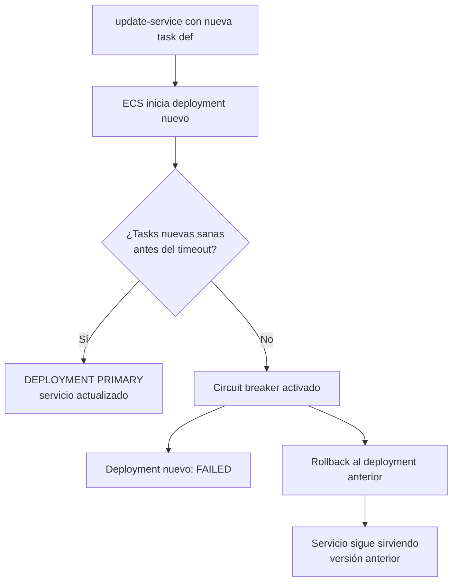
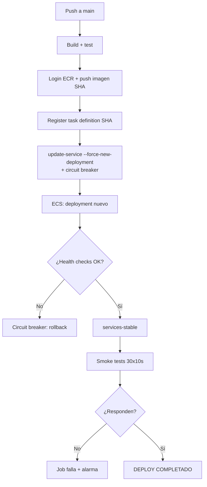

# Guía 16 — ECS: circuit breaker y health checks

> **Nivel**: Avanzado · **Guía 16 de 7** · **Tema**: Despliegues seguros en ECS con SHA pinning, circuit breaker y smoke tests

Esta guía desglosa cómo el proyecto convierte un deploy a ECS en una operación **segura y reversible**: la task definition se pinea por SHA (inmutabilidad), el servicio usa el **circuit breaker** de ECS para hacer rollback automático ante fallos, los **health checks** deciden cuándo un deployment es sano, y los **smoke tests post-deploy** verifican que la aplicación responde antes de dar el deploy por bueno.

## 🎯 Objetivos de aprendizaje

- [ ] Explicar por qué la task definition se pinea por Git SHA y qué ganamos con esa inmutabilidad.
- [ ] Explicar `aws ecs update-service --force-new-deployment` y qué dispara exactamente.
- [ ] Explicar el `deploymentCircuitBreaker` (`enable: true`, `rollback: true`) y su comportamiento de rollback automático.
- [ ] Detallar la configuración de health check (interval, timeout, retries, startPeriod, path) y el significado de cada parámetro.
- [ ] Explicar los smoke tests post-deploy y la diferencia de rigor entre staging y producción.
- [ ] Contrastar el patrón "production-grade" del proyecto vs un deploy naive.
- [ ] Cerrar con resumen y enlace a la Guía 17.

## 📋 Prerequisitos

- Guía 13 — [Walkthrough de deploy.yml](./13-deploy-yml-walkthrough.md)
- Guía 15 — [OIDC: sin credenciales estáticas](./15-oidc-sin-credenciales-estaticas.md)
- Guía 12 — [Floci: emulador de AWS](./12-floci-emulador-aws.md)
- Conceptos de Docker (Guía 04) y ECS (Guía 13)

## 1. El problema: desplegar no es "subir la imagen"

### 1.1 El deploy naive

El deploy más simple posible a ECS es:

```bash
# ❌ MAL: deploy naive
aws ecs update-service --cluster my-cluster --service my-service \
  --force-new-deployment
```

Esto fuerza un nuevo deployment, pero **no verifica nada**:

- No sabe si la imagen existe.
- No sabe si la task definition es válida.
- No sabe si la aplicación arranca.
- No sabe si el servicio queda sano.
- No hace rollback si algo falla.

Si la imagen nueva crashea al arrancar, el servicio se queda en `RUNNING` con tasks fallando en bucle, y **nadie se entera hasta que un usuario reporta el problema**.

### 1.2 El deploy production-grade

El proyecto combina cinco capas de protección:

| Capa                   | Mecanismo                                               | Pregunta que responde          |
| ---------------------- | ------------------------------------------------------- | ------------------------------ |
| 1. Inmutabilidad       | Task definition pineada por SHA                         | ¿Qué exactamente se despliega? |
| 2. Disparo controlado  | `--force-new-deployment`                                | ¿Cómo se inicia el deploy?     |
| 3. Rollback automático | `deploymentCircuitBreaker`                              | ¿Qué pasa si el deploy falla?  |
| 4. Salud               | Health checks (interval, timeout, retries, startPeriod) | ¿Cuándo se considera sano?     |
| 5. Verificación        | Smoke tests post-deploy                                 | ¿La app responde de verdad?    |

> 🔑 **Regla mental**: un deploy naive dice "he lanzado la imagen". Un deploy production-grade dice "he lanzado la imagen, he verificado que arranca, que responde y que, si no, he vuelto atrás".

## 2. SHA pinning: la task definition inmutable

### 2.1 ¿Qué es una task definition?

Una **task definition** es el "plano" de un contenedor en ECS: imagen, CPU, memoria, puertos, variables de entorno, health check, etc. Se registra en ECS con un nombre y una **revisión** (`my-task-def:1`, `my-task-def:2`, ...).

### 2.2 ¿Por qué pinear por SHA y no por tag?

El proyecto registra la task definition con el **Git SHA del commit** como tag de imagen y como identificador:

```bash
# Source: .github/workflows/deploy.yml (extracto)
IMAGE_TAG=${{ github.sha }}
aws ecs register-task-definition \
  --family my-task-def \
  --container-definitions "[{\"name\":\"app\",\"image\":\"$ECR_REGISTRY/$ECR_REPOSITORY:$IMAGE_TAG\",...}]"
```

| Aspecto              | Tag mutable (`latest`)              | SHA inmutable (`a1b2c3d`)                 |
| -------------------- | ----------------------------------- | ----------------------------------------- |
| **Identidad**        | Cambia con cada push                | Fijo para siempre                         |
| **Reproducibilidad** | "latest" hoy ≠ "latest" mañana      | El SHA siempre es el mismo commit         |
| **Auditoría**        | No sabes qué versión corre          | Sabes exactamente qué commit se desplegó  |
| **Rollback**         | Difícil (¿a qué "latest" anterior?) | Trivial: vuelve al SHA anterior           |
| **Debugging**        | "¿qué hay en prod?" es ambiguo      | `git show a1b2c3d` te da el código exacto |

> 🔑 **Regla mental**: un tag es una **etiqueta que se mueve**; un SHA es una **huella que no cambia**. Para desplegar de forma reproducible, pineas la huella, no la etiqueta.

### 2.3 La cadena de inmutabilidad

```
commit a1b2c3d ──► imagen ECR:a1b2c3d ──► task-def:a1b2c3d ──► ECS service
     (git)              (docker)              (ECS)            (runtime)
```

Cada eslabón referencia el mismo SHA. Si necesitas saber qué corre en producción, sigues la cadena hacia atrás hasta el commit.

### 2.4 ¿Y si el SHA no existe en ECR?

El deploy falla en el paso de `register-task-definition` o en el `update-service` con un error de imagen no encontrada. Eso es **bueno**: el fallo ocurre antes de tocar el servicio, no después.

## 3. `--force-new-deployment`: disparar el deploy

### 3.1 Qué hace

```bash
# Source: .github/workflows/deploy.yml (extracto)
aws ecs update-service \
  --cluster my-cluster \
  --service my-service \
  --task-definition my-task-def:${{ github.sha }} \
  --force-new-deployment
```

`--force-new-deployment` le dice a ECS: **"inicia un nuevo deployment ahora mismo"**, aunque la task definition no haya cambiado. Sin esta flag, ECS solo crea un deployment nuevo si la task definition o el service config cambian.

### 3.2 Cuándo la necesitas

| Situación                                     | ¿Necesitas `--force-new-deployment`? |
| --------------------------------------------- | ------------------------------------ |
| Cambiaste la task definition (nueva revisión) | No (ECS lo detecta solo)             |
| Misma task definition, quieres reiniciar      | **Sí**                               |
| Quieres probar el circuit breaker             | **Sí**                               |
| Quieres forzar que las tasks se recreen       | **Sí**                               |

### 3.3 El ciclo de vida de un deployment ECS

```
update-service
      │
      ▼
┌─────────────────┐
│  PROVISIONING   │  ECS crea las tasks nuevas
└─────────────────┘
      │
      ▼
┌─────────────────┐
│   ACTIVE        │  Tasks nuevas arrancando
└─────────────────┘
      │
      ▼
┌─────────────────┐
│  PRIMARY        │  Deployment sano y sirviendo tráfico
└─────────────────┘
```

Si el deployment nuevo falla y el circuit breaker está activo, ECS **revierte a PRIMARY el deployment anterior** (rollback).

> 🔑 **Regla mental**: `--force-new-deployment` es el "botón de reiniciar" del servicio. El circuit breaker es el "airbag" que se activa si el reinicio sale mal.

## 4. El circuit breaker de ECS

### 4.1 ¿Qué es un circuit breaker?

En ingeniería de fiabilidad, un **circuit breaker** es un mecanismo que **interrumpe una operación que probablemente va a fallar**, en lugar de dejarla intentar una y otra vez. En ECS, el `deploymentCircuitBreaker` hace exactamente eso con los deployments:

- Si un porcentaje de tasks del deployment nuevo **no alcanza el estado sano** dentro de un tiempo límite, ECS **detiene el deployment** y **revierte al deployment anterior** (que seguía sirviendo tráfico).

### 4.2 La configuración en el proyecto

```bash
# Source: .github/workflows/deploy.yml (extracto)
aws ecs update-service \
  --cluster my-cluster \
  --service my-service \
  --task-definition my-task-def:${{ github.sha }} \
  --force-new-deployment \
  --deployment-configuration \
    "deploymentCircuitBreaker={enable=true,rollback=true}"
```

Dos flags:

| Flag       | Valor  | Qué controla                                                                                                                    |
| ---------- | ------ | ------------------------------------------------------------------------------------------------------------------------------- |
| `enable`   | `true` | Activa el circuit breaker en este servicio.                                                                                     |
| `rollback` | `true` | Si el deployment falla, **revierte automáticamente** al deployment anterior (rollback) en lugar de dejar el servicio degradado. |

### 4.3 Comportamiento detallado



**ASCII fallback** (si mermaid no renderiza):

```
update-service con nueva task def → ECS inicia deployment nuevo
    → ¿Tasks nuevas sanas antes del timeout?
        ├─ Sí → DEPLOYMENT PRIMARY (servicio actualizado)
        └─ No → Circuit breaker activado → [deployment FAILED] + [rollback al anterior]
                    → Servicio sigue sirviendo versión anterior
```

### 4.4 ¿Qué cuenta como "fallo"?

El circuit breaker se activa si el deployment nuevo no alcanza un porcentaje mínimo de tasks sanas (por defecto, el 100%... en la práctica, el `minimumHealthyPercent`) dentro del periodo de `deploymentCircuitBreaker` timeout. Las tasks se consideran **no sanas** si:

- El contenedor crashea al arrancar (exit code ≠ 0).
- El health check del contenedor falla repetidamente.
- La task no llega a `RUNNING` en el tiempo esperado.
- La imagen no existe o no se puede descargar.

### 4.5 ¿Por qué es importante `rollback: true`?

Sin rollback, un deployment fallido deja el servicio en un estado intermedio: parte de las tasks nuevas (rotas) y parte de las viejas (sanas). Con `rollback: true`, ECS **restaura el deployment anterior completo** y lo vuelve a poner como PRIMARY. El servicio queda exactamente como estaba antes del intento.

> 🔑 **Regla mental**: el circuit breaker con rollback es el "commit automático" de ECS: si el cambio nuevo rompe algo, vuelve al estado anterior sin intervención humana.

### 4.6 Limitaciones del circuit breaker

| Limitación                                         | Implicación                                                                          |
| -------------------------------------------------- | ------------------------------------------------------------------------------------ |
| Solo detecta fallos **de arranque y health check** | No detecta bugs lógicos (la app arranca y responde, pero devuelve datos incorrectos) |
| No cubre fallos posteriores al deploy              | Por eso existen los smoke tests post-deploy (sección 6)                              |
| Depende de un health check **bien configurado**    | Si el health check es demasiado laxo, el circuit breaker nunca se activa             |

> ⚠️ **Ojo**: el circuit breaker es la última línea de defensa técnica, pero la primera línea es un **health check correcto**. Un health check mal configurado puede dar el deploy por bueno cuando la app está rota.

## 5. Health checks: los parámetros uno a uno

### 5.1 La configuración en la task definition

```json
# Source: task definition registrada en deploy.yml (containerDefinitions)
{
  "name": "app",
  "image": "123456789012.dkr.ecr.us-east-1.amazonaws.com/my-app:a1b2c3d",
  "healthCheck": {
    "command": ["CMD-SHELL", "curl -f http://localhost:3000/health || exit 1"],
    "interval": 30,
    "timeout": 5,
    "retries": 3,
    "startPeriod": 60
  }
}
```

### 5.2 Parámetro por parámetro

| Parámetro     | Valor del proyecto                     | Qué controla                                                                                                          |
| ------------- | -------------------------------------- | --------------------------------------------------------------------------------------------------------------------- |
| `command`     | `curl -f http://localhost:3000/health` | El comando que se ejecuta dentro del contenedor para comprobar su salud. `-f` hace que curl falle ante un HTTP ≥ 400. |
| `interval`    | `30` (segundos)                        | Cada cuánto se ejecuta el health check.                                                                               |
| `timeout`     | `5` (segundos)                         | Tiempo máximo que espera el check antes de considerarlo fallido.                                                      |
| `retries`     | `3`                                    | Cuántos fallos consecutivos se necesitan para marcar el contenedor como **unhealthy**.                                |
| `startPeriod` | `60` (segundos)                        | Periodo de gracia al arrancar: el contenedor NO se considera unhealthy durante este tiempo, aunque el check falle.    |

### 5.3 La línea de tiempo de un arranque

```
t=0          t=60s                    t=90s                t=150s
│  arranca   │  fin startPeriod       │  check #1 falla    │  retries agotadas
│  (grace)   │  checks empiezan a     │  check #2 falla    │  → UNHEALTHY
│            │  contar                │  check #3 falla    │  → circuit breaker
└────────────┴────────────────────────┴────────────────────┴──────────────
```

1. **t=0 → t=60s** (`startPeriod`): el contenedor arranca. Aunque el check falle, ECS no lo marca como unhealthy. Da tiempo a que la app inicialice (conexiones a BD, migraciones, warm-up).
2. **t=60s en adelante**: los checks se ejecutan cada `interval` (30s).
3. **3 fallos consecutivos** (`retries`): el contenedor pasa a `UNHEALTHY`.
4. El circuit breaker detecta tasks unhealthy y **activa el rollback**.

### 5.4 ¿Por qué el health check apunta a `/health`?

El endpoint `/health` es un endpoint **específico para health checks**: devuelve `200 OK` cuando la app está lista para recibir tráfico, y `503` cuando no. No es el endpoint de negocio (`/api/...`), porque:

- No depende de la lógica de negocio (que puede fallar por motivos ajenos a la salud del contenedor).
- Es barato de ejecutar (no hace queries pesadas).
- Devuelve códigos HTTP estables y predecibles (200/503).

```js
// Source: apps/server/src/app.js (patrón típico)
app.get('/health', (_req, res) => {
  // Si la BD responde, 200; si no, 503
  res.status(healthy ? 200 : 503).json({ status: healthy ? 'ok' : 'degraded' });
});
```

> 🔑 **Regla mental**: el health check debe responder "¿puede este contenedor recibir tráfico?", no "¿funciona la feature X?".

### 5.5 Cómo elegir los valores

| Escenario                                     | Ajuste recomendado                        |
| --------------------------------------------- | ----------------------------------------- |
| App con arranque lento (migraciones, warm-up) | `startPeriod` alto (60-120s)              |
| Health check barato (solo memoria/proceso)    | `interval` bajo (10-30s)                  |
| Health check costoso (hace queries)           | `interval` alto (60s+), `timeout` holgado |
| Detección rápida de fallos                    | `retries` bajo (2-3), `interval` bajo     |

> ⚠️ **Advertencia**: no copies valores a ciegas. Un `startPeriod` de 60s no sirve si tu app tarda 3 minutos en arrancar — el circuit breaker mataría el deploy aunque la app esté bien.

## 6. Smoke tests post-deploy

### 6.1 ¿Qué es un smoke test post-deploy?

Un **smoke test** es una verificación rápida de que la aplicación **responde y funciona** después del deploy. No es una suite de tests completa: es un "humo" — si sale humo, hay fuego; si no, seguimos.

En el proyecto, tras el `update-service`, el workflow espera a que el servicio esté estable y luego hace peticiones reales al endpoint de salud:

```bash
# Source: .github/workflows/deploy.yml (extracto — patrón de smoke test)
# Espera a que el servicio esté estable
aws ecs wait services-stable \
  --cluster my-cluster \
  --services my-service

# Smoke test: petición al health endpoint
curl -f --retry 30 --retry-delay 10 \
  -o /dev/null -sS \
  "https://staging.example.com/health"
```

### 6.2 Los números del proyecto

| Entorno        | Espera            | Smoke test                |
| -------------- | ----------------- | ------------------------- |
| **Staging**    | `services-stable` | 30 retries × 10s de delay |
| **Producción** | `services-stable` | 30 retries × 10s de delay |

Ambos entornos usan **30 retries × 10s** (hasta 5 minutos de espera). Pero **NO es que producción tenga un health window más largo** — la diferencia de rigor entre entornos está en otra parte.

### 6.3 La diferencia de rigor entre staging y producción

Esta es la lección clave de la guía: **el rigor extra de producción NO viene del smoke test**. Viene de dos mecanismos que viste en guías anteriores:

#### (a) La aprobación manual vía GitHub Environments

```yaml
# Source: .github/workflows/deploy.yml (extracto)
deploy-production:
  environment: production # ← protection rule: requiere aprobación manual
  concurrency:
    group: deploy-production
    cancel-in-progress: false
```

El job de producción usa `environment: production`, que tiene una **protection rule** configurada en GitHub: **un humano debe aprobar el deploy** antes de que el job se ejecute. El smoke test de producción corre _después_ de esa aprobación.

#### (b) El concurrency group separado

```yaml
concurrency:
  group: deploy-production
  cancel-in-progress: false
```

Producción tiene su **propio concurrency group** (`deploy-production`) con `cancel-in-progress: false`. Esto significa:

- Un deploy de producción **nunca se cancela** por otro deploy.
- Si dos pushes llegan seguidos, el segundo **espera** a que el primero termine.
- No se interrumpe un deploy que ya está en marcha (a diferencia de preview, que sí cancela).

### 6.4 La comparación completa

| Aspecto              | Staging                   | Producción                              |
| -------------------- | ------------------------- | --------------------------------------- |
| Smoke test           | 30×10s                    | 30×10s (igual)                          |
| Aprobación manual    | No                        | **Sí** (protection rule)                |
| Concurrency group    | `deploy-staging`          | `deploy-production` (separado)          |
| `cancel-in-progress` | —                         | `false` (no interrumpir)                |
| Riesgo si falla      | Bajo (entorno de pruebas) | Alto (usuarios reales)                  |
| **Rigor extra**      | —                         | **Aprobación humana + no interrupción** |

> 🔑 **Regla mental**: el smoke test verifica la _máquina_; la aprobación manual y el concurrency verifican el _proceso_. Producción es más rigurosa porque añade control humano y serialización, no porque espere más tiempo.

### 6.5 ¿Qué pasa si el smoke test falla?

1. El job de deploy falla con exit code ≠ 0.
2. GitHub Actions marca el check como fallido.
3. El commit queda señalado como "deploy fallido" en la UI.
4. **El circuit breaker ya habría hecho rollback** si el fallo era de arranque; si el fallo es lógico (la app responde pero mal), el smoke test lo detecta y el equipo interviene manualmente.

> ⚠️ **Importante**: el smoke test NO hace rollback automático. El rollback automático es del circuit breaker (fallos de arranque/salud). El smoke test es una **alarma** que requiere intervención humana si detecta un fallo lógico.

## 7. Deploy naive vs deploy production-grade

### 7.1 La tabla comparativa

| Aspecto             | Deploy naive                                 | Deploy production-grade (proyecto)                                 |
| ------------------- | -------------------------------------------- | ------------------------------------------------------------------ |
| **Imagen**          | `latest` (mutable)                           | SHA del commit (inmutable)                                         |
| **Task definition** | No se registra / se reutiliza                | Registrada por SHA                                                 |
| **Disparo**         | `update-service` a secas                     | `--force-new-deployment` explícito                                 |
| **Rollback**        | Manual (si alguien se da cuenta)             | Automático (circuit breaker)                                       |
| **Health check**    | Ninguno o mal configurado                    | interval 30s, timeout 5s, retries 3, startPeriod 60s, path /health |
| **Verificación**    | "El job terminó OK"                          | Smoke tests reales (30×10s)                                        |
| **Aprobación prod** | Ninguna                                      | Protection rule manual                                             |
| **Concurrency**     | Ninguno                                      | Grupos separados, no interrumpir prod                              |
| **Si algo falla**   | Servicio roto en producción, nadie se entera | Rollback automático + check fallido + alarma                       |

### 7.2 La historia de los dos deploys

**Deploy naive**: un equipo sube `latest` a ECS un viernes a las 17:00. La imagen nueva crashea al arrancar. El servicio queda con tasks en bucle de reinicio. El lunes, los usuarios reportan que la app no carga. El equipo investiga, descubre el deploy del viernes, y revierte manualmente. **Horas de caída, sin auditoría, sin saber qué versión se desplegó.**

**Deploy production-grade**: el mismo equipo mergea a main. El pipeline construye la imagen con el SHA, registra la task definition, fuerza el deployment. El health check falla 3 veces seguidas → el circuit breaker **revierte automáticamente** al deployment anterior. El job de Actions falla con el log del smoke test. El equipo recibe la notificación, mira el commit exacto (`git show a1b2c3d`), arregla el bug y reintenta. **Minutos de impacto, rollback automático, auditoría completa.**

> 🔑 **Regla mental**: el deploy naive optimiza el _tiempo de escribir el comando_; el production-grade optimiza el _tiempo de recuperación ante fallos_. En producción, lo segundo vale mucho más.

## 8. Walkthrough: el deploy completo paso a paso

### 8.1 El flujo completo



**ASCII fallback** (si mermaid no renderiza):

```
Push a main → Build + test → Login ECR + push imagen SHA → Register task definition SHA
→ update-service --force-new-deployment + circuit breaker → ECS: deployment nuevo
→ ¿Health checks OK?
    ├─ No → Circuit breaker: rollback
    └─ Sí → services-stable → Smoke tests 30x10s → ¿Responden?
                ├─ No → Job falla + alarma
                └─ Sí → DEPLOY COMPLETADO
```

### 8.2 Paso a paso con los comandos

```bash
# 1. Push de la imagen (Guía 15: credenciales OIDC)
docker push $ECR_REGISTRY/$ECR_REPOSITORY:${{ github.sha }}

# 2. Registrar la task definition pineada
aws ecs register-task-definition \
  --family my-task-def \
  --container-definitions file://task-definition.json

# 3. Forzar el deployment con circuit breaker
aws ecs update-service \
  --cluster my-cluster \
  --service my-service \
  --task-definition my-task-def:${{ github.sha }} \
  --force-new-deployment \
  --deployment-configuration \
    "deploymentCircuitBreaker={enable=true,rollback=true}"

# 4. Esperar a que el servicio esté estable
aws ecs wait services-stable \
  --cluster my-cluster \
  --services my-service

# 5. Smoke test
curl -f --retry 30 --retry-delay 10 -o /dev/null -sS \
  "https://staging.example.com/health"
```

### 8.3 Cómo inspeccionar el resultado

```bash
# Estado del servicio y del deployment
aws ecs describe-services --cluster my-cluster --services my-service \
  --query "services[0].{status:status,deployments:deployments[].{id:id,status:status,rollout:rolloutState}}"

# Últimos eventos del servicio (rollback, health check failures)
aws ecs describe-services --cluster my-cluster --services my-service \
  --query "services[0].events[0:5]"
```

Los eventos del servicio son la **bitácora** del deploy: verás `service my-service has reached a steady state`, `(service my-service) deployment failed` o `(service my-service) deployment rolled back` según el resultado.

## 9. Parámetros de deployment adicionales

### 9.1 `minimumHealthyPercent` y `maximumPercent`

Además del circuit breaker, el deployment de ECS se controla con dos porcentajes:

| Parámetro               | Valor típico | Qué controla                                                                                                                                                              |
| ----------------------- | ------------ | ------------------------------------------------------------------------------------------------------------------------------------------------------------------------- |
| `minimumHealthyPercent` | `100`        | El porcentaje mínimo de tasks del servicio que deben seguir sanas **durante** el deploy. Con 100, ECS crea tasks nuevas antes de matar las viejas (rolling sin downtime). |
| `maximumPercent`        | `200`        | El porcentaje máximo de tasks que puede haber **simultáneamente** (viejas + nuevas). Con 200, puede duplicar las tasks durante el deploy.                                 |

```bash
aws ecs update-service \
  --cluster my-cluster \
  --service my-service \
  --deployment-configuration \
    "minimumHealthyPercent=100,maximumPercent=200,deploymentCircuitBreaker={enable=true,rollback=true}"
```

### 9.2 ¿Qué significan en la práctica?

- `minimumHealthyPercent: 100` → **cero downtime**: nunca hay menos tasks sanas de las necesarias.
- `maximumPercent: 200` → ECS puede tener el doble de tasks durante la transición (requiere capacidad en el cluster).

> 🔑 **Regla mental**: `minimumHealthyPercent` protege la _capacidad_ (nunca menos de lo necesario); `maximumPercent` limita el _pico_ (nunca más de lo permitido). Juntos definen la estrategia de rolling update.

### 9.3 El deployment timeout

ECS también tiene un **timeout de deployment** (por defecto 10 minutos): si el deployment nuevo no alcanza el estado estable en ese tiempo, se considera fallido y el circuit breaker (si está activo) hace rollback.

| Parámetro                         | Valor por defecto | Qué controla                                          |
| --------------------------------- | ----------------- | ----------------------------------------------------- |
| `deploymentConfiguration` timeout | 10 min            | Tiempo máximo para que el deployment llegue a PRIMARY |

## 10. Cómo probar el circuit breaker (sin romper nada)

### 10.1 El experimento controlado

Puedes verificar que el circuit breaker funciona en staging con un deploy deliberadamente roto:

```bash
# 1. Registra una task definition con una imagen que no existe
aws ecs register-task-definition \
  --family my-task-def \
  --container-definitions "[{\"name\":\"app\",\"image\":\"123456789012.dkr.ecr.us-east-1.amazonaws.com/my-app:no-existe\"}]"

# 2. Fuerza el deployment
aws ecs update-service \
  --cluster my-cluster \
  --service my-service \
  --task-definition my-task-def \
  --force-new-deployment \
  --deployment-configuration \
    "deploymentCircuitBreaker={enable=true,rollback=true}"

# 3. Observa el resultado
aws ecs describe-services --cluster my-cluster --services my-service \
  --query "services[0].deployments[].{id:id,status:status,rollout:rolloutState}"
```

**Resultado esperado**: el deployment nuevo pasa a `FAILED`, el anterior vuelve a `PRIMARY`, y el servicio sigue sirviendo la versión buena.

### 10.2 Qué observar en los eventos

```
(service my-service) has reached a steady state.          ← deploy anterior, sano
(service my-service) deployment failed: tasks did not become healthy in time.
(service my-service) deployment rolled back.              ← circuit breaker actuó
```

> ⚠️ **Advertencia**: haz este experimento en **staging**, nunca en producción. Y recuerda restaurar la task definition correcta después.

## 11. Ejercicios

### Ejercicio 1 — Diseña el health check

**Objetivo**: elegir los parámetros de health check para una app con arranque lento.

Tu app tarda ~90 segundos en arrancar (conecta a BD, corre migraciones) y el health check hace una query ligera a la BD.

1. Propón valores para `interval`, `timeout`, `retries` y `startPeriod`.
2. Justifica cada valor.
3. ¿Qué pasaría si usaras `startPeriod: 10`?

**Criterio de éxito**: `startPeriod` ≥ 90s (o justificas por qué menos), y explicas que un `startPeriod` corto mataría el deploy aunque la app esté sana.

### Ejercicio 2 — Explica la diferencia de rigor

**Objetivo**: demostrar que entiendes por qué producción es más rigurosa.

1. ¿El smoke test de producción es más largo que el de staging? (Sí/No)
2. ¿De dónde viene el rigor extra de producción? Nombra los dos mecanismos.
3. ¿Qué pasaría si producción usara `cancel-in-progress: true`?

**Criterio de éxito**: respondes "No" a la 1, nombras la protection rule y el concurrency group separado en la 2, y explicas que un deploy nuevo cancelaría el que está en marcha en la 3.

### Ejercicio 3 — Simula un rollback

**Objetivo**: entender el flujo del circuit breaker.

1. Escribe el comando `update-service` con circuit breaker activo.
2. Describe qué ve un operador en `describe-services` cuando el deploy falla.
3. ¿Qué dos tipos de fallo detecta el circuit breaker y cuál NO detecta?

**Criterio de éxito**: el comando incluye `deploymentCircuitBreaker={enable=true,rollback=true}`, describes `FAILED` + rollback, y mencionas que el circuit breaker NO detecta fallos lógicos (eso es trabajo del smoke test).

## 12. Troubleshooting

| Síntoma                                         | Causa probable                                  | Solución                                                    |
| ----------------------------------------------- | ----------------------------------------------- | ----------------------------------------------------------- |
| El deploy falla siempre al arrancar             | La imagen no existe o crashea                   | Verifica el SHA en ECR; revisa los logs del contenedor      |
| El circuit breaker no se activa                 | Health check mal configurado o `enable` no está | Revisa `deploymentCircuitBreaker` y el health check         |
| El servicio queda con tasks unhealthy           | `startPeriod` demasiado corto                   | Aumenta `startPeriod` (la app tarda en arrancar)            |
| `services-stable` nunca llega                   | El deployment no alcanza PRIMARY                | Revisa `describe-services` y los eventos                    |
| El smoke test falla pero el deploy "funcionó"   | Fallo lógico (no de arranque)                   | Revisa los logs de la app; el circuit breaker no cubre esto |
| `minimumHealthyPercent: 100` y no hay capacidad | El cluster no puede duplicar tasks              | Baja `maximumPercent` o añade capacidad al cluster          |
| El deploy se cancela a mitad                    | Concurrency con `cancel-in-progress: true`      | Usa `cancel-in-progress: false` en producción               |

## 13. FAQ

**¿El circuit breaker reemplaza a los smoke tests?**
No. Son complementarios: el circuit breaker detecta fallos de arranque/salud y hace rollback automático; el smoke test detecta fallos lógicos y genera una alarma. El primero actúa solo; el segundo requiere intervención.

**¿Por qué pinear por SHA y no por tag?**
Por reproducibilidad y auditoría. Un SHA identifica un commit exacto para siempre; un tag mutable (`latest`) cambia con cada push y no puedes saber qué versión corre.

**¿`--force-new-deployment` es peligroso?**
No, es el mecanismo estándar para iniciar un deploy. El peligro está en _no_ tener circuit breaker ni health checks: entonces un deploy roto deja el servicio caído sin rollback.

**¿Cuánto tarda un deploy completo?**
Depende: build + push (~2-5 min), deployment ECS (hasta que las tasks pasan el health check, ~1-3 min), smoke tests (hasta 5 min). En total, típicamente 5-15 minutos.

**¿Puedo probar el circuit breaker con Floci?**
No. Floci no emula ECS ni el deployment lifecycle. El circuit breaker se prueba en staging real (sección 10).

**¿Qué pasa si el health check devuelve 503?**
El contenedor se marca como unhealthy (tras `retries` fallos) y el circuit breaker puede activar el rollback. El endpoint `/health` devuelve 503 cuando la app no está lista (p. ej. BD caída).

## 14. Glosario

| Término                   | Definición                                                                             |
| ------------------------- | -------------------------------------------------------------------------------------- |
| **Task definition**       | El "plano" del contenedor en ECS: imagen, CPU, memoria, health check, env vars.        |
| **SHA pinning**           | Fijar la versión desplegada al Git SHA del commit (inmutabilidad).                     |
| **force-new-deployment**  | Flag de `update-service` que inicia un deployment aunque la task definition no cambie. |
| **Circuit breaker**       | Mecanismo que interrumpe un deployment fallido y revierte al anterior.                 |
| **Rollback**              | Volver a la versión anterior del software.                                             |
| **Health check**          | Comando periódico que verifica si un contenedor está sano.                             |
| **startPeriod**           | Periodo de gracia al arrancar durante el cual los fallos del health check no cuentan.  |
| **Smoke test**            | Verificación rápida post-deploy de que la app responde.                                |
| **services-stable**       | Wait de AWS CLI que bloquea hasta que el servicio alcanza estado estable.              |
| **Protection rule**       | Regla de GitHub Environments que exige aprobación manual para desplega                 |
| r.                        |
| **Concurrency group**     | Mecanismo de GitHub Actions que serializa ejecuciones de un grupo.                     |
| **minimumHealthyPercent** | % mínimo de tasks sanas durante el deploy (protege capacidad).                         |
| **maximumPercent**        | % máximo de tasks simultáneas durante el deploy (limita pico).                         |

## 15. Checklist de la guía

- [ ] Entiendo por qué la task definition se pinea por SHA (inmutabilidad, reproducibilidad, auditoría).
- [ ] Sé qué hace `--force-new-deployment` y cuándo es necesario.
- [ ] Puedo configurar `deploymentCircuitBreaker={enable=true,rollback=true}` y explicar su comportamiento.
- [ ] Conozco el significado de interval, timeout, retries, startPeriod y path en el health check.
- [ ] Sé que el rigor extra de producción viene de la protection rule y el concurrency group, no de un smoke test más largo.
- [ ] Puedo contrastar un deploy naive vs uno production-grade.
- [ ] Sé que el circuit breaker no detecta fallos lógicos y que el smoke test es la alarma para esos casos.
- [ ] Puedo inspeccionar el estado de un deployment con `describe-services`.

## 16. Resumen y siguiente guía

En esta guía viste cómo el proyecto convierte el deploy a ECS en una operación segura y reversible: SHA pinning para saber exactamente qué se despliega, `--force-new-deployment` para disparar el deploy, circuit breaker para rollback automático, health checks bien calibrados para decidir la salud, y smoke tests para verificar que la app responde. La lección central: **el rigor de producción no está en esperar más, sino en la aprobación humana y en no interrumpir los deploys en marcha**.

**Siguiente**: [Guía 17 — Changesets y release.yml](./17-changesets-release-yml.md), la última del nivel, donde verás cómo se versiona y publica el paquete a npm.

**Anterior**: [Guía 15 — OIDC](./15-oidc-sin-credenciales-estaticas.md) · **Índice**: [README Avanzado](./avanzado-README.md)

## 17. Estrategias de deployment en ECS

### 17.1 Rolling update (la del proyecto)

El proyecto usa el **rolling update** por defecto de ECS: las tasks nuevas se crean de a poco mientras las viejas se retiran, manteniendo `minimumHealthyPercent` de capacidad.

```
Antes:   [T1][T2][T3]  (versión A)
Durante: [T1][T2][T3][T4]  (T4 = versión B, maximumPercent 200)
         [T1][T2][T4][T5]  (T3 retirada, T5 = versión B)
         [T4][T5][T6]      (versión B completa)
Después: [T4][T5][T6]  (versión B)
```

| Ventaja                                        | Desventaja                                                 |
| ---------------------------------------------- | ---------------------------------------------------------- |
| Sin downtime (si `minimumHealthyPercent: 100`) | No hay "ventana de validación" aislada                     |
| Simple, nativo de ECS                          | El tráfico se mezcla entre versiones durante la transición |
| Compatible con circuit breaker                 | —                                                          |

### 17.2 Blue/green (alternativa)

En **blue/green** se despliega la versión nueva (green) en paralelo a la vieja (blue), se valida, y luego se cambia el tráfico de golpe.

```
Blue:  [T1][T2][T3]  versión A (sirviendo tráfico)
Green: [T4][T5][T6]  versión B (validando, sin tráfico)
Cambio de tráfico → Green sirve, Blue se retira
```

| Ventaja                                     | Desventaja                     |
| ------------------------------------------- | ------------------------------ |
| Validación aislada antes de recibir tráfico | Requiere el doble de capacidad |
| Rollback trivial (volver a blue)            | Más complejo de orquestar      |
| Ideal para cambios de schema/breaking       | Más caro                       |

### 17.3 ¿Cuándo usar cada una?

| Escenario                                    | Estrategia recomendada |
| -------------------------------------------- | ---------------------- |
| Deploys frecuentes, cambios incrementales    | Rolling (proyecto)     |
| Cambios breaking o de schema                 | Blue/green             |
| Migraciones de datos largas                  | Blue/green             |
| Costo sensible                               | Rolling                |
| Cumplimiento estricto (auditoría de versión) | Blue/green             |

> 🔑 **Regla mental**: rolling optimiza costo y simplicidad; blue/green optimiza seguridad de validación. El proyecto elige rolling + circuit breaker + smoke tests, que cubre la mayoría de los casos con menos infraestructura.

## 18. Observabilidad del deploy

### 18.1 ¿Qué mirar durante un deploy?

| Señal                 | Comando / fuente                | Qué indica                       |
| --------------------- | ------------------------------- | -------------------------------- |
| Estado del deployment | `aws ecs describe-services`     | `PRIMARY`/`ACTIVE`/`FAILED`      |
| Eventos del servicio  | `describe-services` → `events`  | Rollback, steady state, fallos   |
| Salud de las tasks    | `aws ecs describe-tasks`        | `RUNNING`/`STOPPED`, exit codes  |
| Logs del contenedor   | CloudWatch Logs (`/ecs/my-app`) | Errores de arranque, excepciones |
| Métricas del servicio | CloudWatch (`ECS/Service`)      | CPU, memoria, `healthyTaskCount` |
| Respuesta HTTP        | Smoke tests / uptime checks     | 200 vs 5xx                       |

### 18.2 El dashboard mental del operador

```
1. ¿El deployment llegó a PRIMARY?        → describe-services
2. ¿Las tasks están RUNNING y sanas?      → describe-tasks + health
3. ¿Los logs no tienen errores nuevos?    → CloudWatch Logs
4. ¿El endpoint responde 200?             → smoke test / curl
5. ¿Las métricas son estables?            → CloudWatch metrics
```

Si cualquiera de las cinco falla, el deploy no está completo aunque el job de Actions diga "success".

### 18.3 Alertas recomendadas

| Alerta                           | Condición                        | Severidad |
| -------------------------------- | -------------------------------- | --------- |
| `healthyTaskCount` = 0           | El servicio no tiene tasks sanas | Crítica   |
| Deployment `FAILED`              | El circuit breaker actuó         | Alta      |
| Smoke test fallido               | La app no responde post-deploy   | Alta      |
| `CPUUtilization` > 85% sostenido | Posible problema de capacidad    | Media     |
| Exit code ≠ 0 en tasks           | El contenedor crashea            | Alta      |

> 🔑 **Regla mental**: un deploy no termina cuando el job de CI dice "success"; termina cuando las **métricas y los logs** confirman que la app está sana y estable.

## 19. El patrón completo en contexto

### 19.1 Cómo encaja con las guías anteriores

| Guía   | Pieza del pipeline                  | Rol en el deploy seguro                  |
| ------ | ----------------------------------- | ---------------------------------------- |
| 11     | Conceptos AWS                       | Contexto de ECR/ECS                      |
| 12     | Floci                               | Tests locales (no ECS)                   |
| 13     | deploy.yml                          | El workflow completo                     |
| 14     | Preview                             | Validación por PR (antes del deploy)     |
| 15     | OIDC                                | Autenticación sin credenciales estáticas |
| **16** | **Circuit breaker + health checks** | **Protección del deploy en ECS**         |
| 17     | Changesets                          | Versionado y release                     |

### 19.2 La cadena de confianza

```
PR → preview (Guía 14) → merge a main → build/test → OIDC (15)
   → push imagen SHA → task def SHA → circuit breaker (16)
   → health checks (16) → smoke tests (16) → release (17)
```

Cada eslabón añade una garantía: el preview valida el cambio, OIDC autentica, el SHA pinea, el circuit breaker protege, el health check mide, el smoke test verifica, y changesets versiona.

## 20. Referencias y fuentes

| Tema                        | Fuente                                                                           |
| --------------------------- | -------------------------------------------------------------------------------- |
| Comandos de deploy          | `.github/workflows/deploy.yml`                                                   |
| Health check del contenedor | Task definition en `deploy.yml` / `infra/`                                       |
| Endpoint /health            | `apps/server/src/` (ruta de salud)                                               |
| Guía 13 (deploy.yml)        | [13-deploy-yml-walkthrough.md](./13-deploy-yml-walkthrough.md)                   |
| Guía 15 (OIDC)              | [15-oidc-sin-credenciales-estaticas.md](./15-oidc-sin-credenciales-estaticas.md) |
| Guía 14 (preview)           | [14-preview-environments-yml.md](./14-preview-environments-yml.md)               |

## 21. Cierre

El deploy a ECS del proyecto no es "subir una imagen": es una **operación con cinco capas de protección** — inmutabilidad por SHA, disparo explícito, rollback automático, salud medida y verificación real. Y la lección más sutil: el rigor de producción no se mide en segundos de espera, sino en **control humano y serialización**. Con esto, el pipeline puede desplegar con confianza. La última guía del nivel cierra el ciclo con el **versionado y la publicación** del paquete.

**Siguiente**: [Guía 17 — Changesets y release.yml](./17-changesets-release-yml.md)

## 22. Buenas prácticas resumidas

### 22.1 El decálogo del deploy seguro

1. **Pinea por SHA**, nunca por `latest`.
2. **Registra la task definition** en cada deploy (no reutilices revisiones viejas).
3. **Activa el circuit breaker** con `rollback: true` en todos los servicios críticos.
4. **Configura el health check** con `startPeriod` acorde al arranque real de la app.
5. **Apunta el health check a `/health`**, no a endpoints de negocio.
6. **Espera `services-stable`** antes de dar el deploy por bueno.
7. **Corre smoke tests** reales contra el endpoint público.
8. **Usa GitHub Environments** con protection rule para producción.
9. **Serializa producción** con un concurrency group propio y `cancel-in-progress: false`.
10. **Inspecciona los eventos** de `describe-services` cuando algo falle.

### 22.2 Anti-patrones a evitar

| Anti-patrón                           | Por qué es peligroso                                                       |
| ------------------------------------- | -------------------------------------------------------------------------- |
| Deploy con `latest`                   | No sabes qué versión corre ni puedes hacer rollback reproducible           |
| Sin circuit breaker                   | Un deploy roto deja el servicio caído sin recuperación automática          |
| Health check a `/` (página principal) | Puede dar falsos positivos (CDN, cache) o falsos negativos (lógica pesada) |
| `startPeriod` demasiado corto         | El circuit breaker mata deploys de apps con arranque lento                 |
| Smoke test solo en staging            | Producción puede fallar por config distinta (secrets, regiones)            |
| `cancel-in-progress: true` en prod    | Un push nuevo interrumpe un deploy en marcha                               |

### 22.3 La mentalidad

> 🔑 **Regla final**: un deploy es una **hipótesis** ("esta versión funciona en producción") que el pipeline debe **verificar** antes de declararla verdadera. SHA pinning, circuit breaker, health checks y smoke tests son los instrumentos de esa verificación. Sin ellos, estás desplegando con los ojos cerrados.

Con esto cierras la guía 16. El pipeline ya sabe desplegar de forma segura; la guía 17 te enseña a **versionar y publicar** el resultado.

**Siguiente**: [Guía 17 — Changesets y release.yml](./17-changesets-release-yml.md)

## 23. Nota sobre versiones de la CLI

Los comandos de esta guía usan la AWS CLI v2. Si tu entorno usa v1, la sintaxis de `--deployment-configuration` con `deploymentCircuitBreaker` puede variar ligeramente. Verifica con:

```bash
aws --version
aws ecs update-service help | grep -A 5 "deploymentCircuitBreaker"
```

> 💡 **Tip**: en la AWS CLI v2, los parámetros anidados como `deploymentCircuitBreaker={enable=true,rollback=true}` se pasan como string JSON. En v1, algunos flags requieren archivos JSON (`--deployment-configuration file://config.json`). Consulta la ayuda de tu versión antes de copiar comandos.
