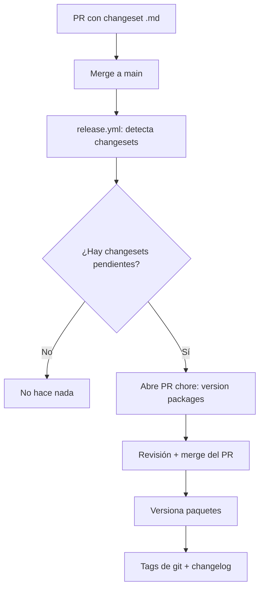
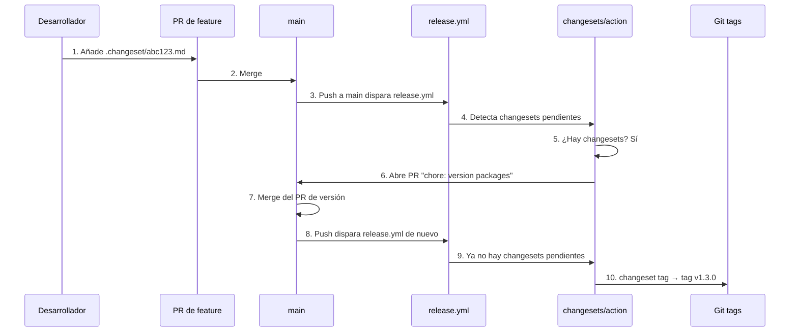

# Guía 17 — Changesets y `release.yml`: versionado y publicación

> **Nivel**: Avanzado · **Guía 17 de 7** · **Tema**: Release automático con Changesets: versionado semántico, PR de versión y tags de git

Esta guía cierra el nivel Avanzado explicando el **workflow de release**: cómo el proyecto usa **Changesets** para versionar el paquete con semver, abrir un PR automático `chore: version packages`, y versionar paquetes con tags de git. Verás por qué `fetch-depth: 0` es imprescindible, cómo se estructura `.changeset/`, y cómo el concurrency group protege el release.

## 🎯 Objetivos de aprendizaje

- [ ] Explicar el flujo de release: push a main → detectar changesets pendientes → PR `chore: version packages` → merge → versionar paquetes + tags git.
- [ ] Explicar por qué `fetch-depth: 0` es requerido (changesets necesita los diffs de commits).
- [ ] Explicar la estructura de `.changeset/` (archivos de changeset, `config.json`, `README.md`).
- [ ] Referenciar la spec formal `openspec/specs/release-workflow/spec.md`.
- [ ] Explicar el concurrency group `release` con `cancel-in-progress: false` (no interrumpir un release en marcha).
- [ ] Cerrar el nivel Avanzado con resumen y enlace de vuelta al README.

## 📋 Prerequisitos

- Guía 16 — [ECS: circuit breaker y health checks](./16-ecs-circuit-breaker-health-checks.md)
- Guía 13 — [Walkthrough de deploy.yml](./13-deploy-yml-walkthrough.md)
- Guía 06 — [Walkthrough de ci.yml](./06-ci-yml-walkthrough.md)
- Guía 03 — [Secrets y variables](./03-secrets-variables.md)
- Conceptos de Conventional Commits (Guía 05) y semver

## 1. ¿Qué es un release y por qué automatizarlo?

### 1.1 El problema del versionado manual

Versionar un paquete a mano es propenso a errores:

- ¿Qué versión toca? ¿patch, minor o major? (semver)
- ¿Qué cambios entran en el changelog?
- ¿El tag de git coincide con la versión de `package.json`?
- ¿Se publicó a npm la versión correcta?

Un release manual típico falla en al menos una de estas preguntas. **Changesets** automatiza todo el flujo.

### 1.2 ¿Qué es Changesets?

**Changesets** es una herramienta de gestión de versiones para monorepos y paquetes npm. Su modelo es simple:

1. Cada PR que introduce un cambio de comportamiento **añade un archivo de changeset** en `.changeset/` describiendo el cambio y su impacto semver (`patch`, `minor`, `major`).
2. En el release, el action `changesets/action` detecta los changesets pendientes y abre un PR `chore: version packages` que **actualiza `package.json`, el changelog y elimina los changesets consumidos**.
3. Al mergear ese PR, el workflow **versiona los paquetes** y crea los **tags de git**.

### 1.3 El flujo completo



**ASCII fallback** (si mermaid no renderiza):

```
PR con changeset .md → Merge a main → release.yml detecta changesets
→ ¿Hay changesets pendientes?
    ├─ No → No hace nada
    └─ Sí → Abre PR "chore: version packages" → Revisión + merge → Versiona paquetes → Tags de git + changelog
```

> 🔑 **Regla mental**: el desarrollador solo escribe _qué cambió y cuánto impacta_ (el changeset). El versionado, el changelog y los tags los hace la máquina.

## 2. El workflow `release.yml`

### 2.1 El archivo completo (estructura)

```yaml
# Source: .github/workflows/release.yml
name: Release

on:
  push:
    branches: [main]

permissions:
  contents: write
  pull-requests: write

concurrency:
  group: release
  cancel-in-progress: false

jobs:
  release:
    runs-on: ubuntu-latest
    timeout-minutes: 10
    steps:
      - uses: actions/checkout@v6
        with:
          fetch-depth: 0

      - uses: actions/setup-node@v5
        with:
          node-version-file: '.nvmrc'
          cache: npm
          cache-dependency-path: package-lock.json

      - run: npm ci

      - name: Create Release PR or Publish
        id: changesets
        uses: changesets/action@v2
        with:
          version-script: npm run version:packages
          pr-title: 'chore: version packages'
          commit-message: 'chore: version packages'
        env:
          GITHUB_TOKEN: ${{ secrets.GITHUB_TOKEN }}
```

### 2.2 Desglose

| Elemento                           | Valor     | Qué hace                                          |
| ---------------------------------- | --------- | ------------------------------------------------- |
| `on.push.branches`                 | `[main]`  | Se dispara solo en pushes a main                  |
| `permissions.contents: write`      | —         | Necesario para crear el PR y los tags             |
| `permissions.pull-requests: write` | —         | Necesario para abrir/actualizar el PR de versión  |
| `concurrency.group`                | `release` | Serializa los releases                            |
| `concurrency.cancel-in-progress`   | `false`   | **No** interrumpe un release en marcha            |
| `fetch-depth: 0`                   | —         | Clona el historial completo (clave, sección 3)    |
| `changesets/action@v2`             | —         | El corazón: detecta changesets, versiona, publica |

### 2.3 Los dos scripts

```json
// Source: package.json (scripts)
{
  "scripts": {
    "version:packages": "changeset version && npm install --ignore-scripts",
    "release": "changeset tag"
  }
}
```

| Script             | Comando                                             | Qué hace                                                                                                                 |
| ------------------ | --------------------------------------------------- | ------------------------------------------------------------------------------------------------------------------------ |
| `version:packages` | `changeset version && npm install --ignore-scripts` | Actualiza `package.json` y changelogs según los changesets, **borra** los changesets consumidos y reinstala dependencias |
| `release`          | `changeset tag`                                     | Crea los tags de git (`v<version>`) para los paquetes versionados                                                        |

> 🔑 **Regla mental**: `version:packages` prepara los archivos (bump + changelog); `release` (`changeset tag`) crea los tags de git. El action invoca `version-script` al abrir el PR de versión.

## 3. `fetch-depth: 0`: por qué el historial completo

### 3.1 El problema

Por defecto, `actions/checkout` hace un **clone shallow** (solo el commit más reciente, `fetch-depth: 1`). Es rápido, pero **no tiene historial**.

Changesets necesita saber **qué commits han cambiado desde el último release** para:

- Determinar qué paquetes han cambiado.
- Calcular los bumps de versión correctos.
- Generar el changelog con los commits relevantes.

### 3.2 La solución

```yaml
- uses: actions/checkout@v6
  with:
    fetch-depth: 0 # ← historial completo
```

`fetch-depth: 0` clona **todos los commits y todas las ramas**. Es más lento y pesado, pero necesario para que changesets pueda comparar contra el último tag de release.

### 3.3 ¿Qué pasa sin `fetch-depth: 0`?

```
❌ Sin fetch-depth: 0:
   changesets no encuentra el tag anterior → no sabe qué cambió
   → versiones incorrectas o "no changesets found" erróneo

✅ Con fetch-depth: 0:
   changesets compara contra el último tag (v1.2.3)
   → detecta los changesets pendientes → versiona correctamente
```

> 🔑 **Regla mental**: `fetch-depth: 0` es el precio de la **comparación contra el historial**. Sin historial, changesets está ciego.

### 3.4 Coste y alternativas

| Opción           | Coste                  | Cuándo usarla                          |
| ---------------- | ---------------------- | -------------------------------------- |
| `fetch-depth: 0` | Más lento (clona todo) | Releases (necesario)                   |
| `fetch-depth: 1` | Rápido                 | CI de tests (no necesita historial)    |
| `fetch-depth: N` | Medio                  | Cuando necesitas N commits de contexto |

> 💡 **Tip**: usa `fetch-depth: 0` solo donde haga falta (release). En `ci.yml` y `preview.yml`, un clone shallow es suficiente y más rápido.

## 4. La estructura de `.changeset/`

### 4.1 El árbol de archivos

```
.changeset/
├── config.json          # Configuración global de changesets
├── README.md            # Instrucciones para contribuidores
├── .gitignore           # Ignora los archivos de changeset consumidos
└── *.md                 # Los changesets pendientes (uno por PR)
```

### 4.2 `config.json`

```json
// Source: .changeset/config.json
{
  "$schema": "https://unpkg.com/@changesets/config@3.0.0/schema.json",
  "changelog": [
    "@changesets/changelog-github",
    { "repo": "Freelancer-soluctions/Project-one" }
  ],
  "commit": false,
  "fixed": [],
  "linked": [],
  "access": "restricted",
  "baseBranch": "main",
  "updateInternalDependencies": "patch",
  "ignore": ["e2e"]
}
```

| Clave                        | Valor                                                                               | Qué controla                                                   |
| ---------------------------- | ----------------------------------------------------------------------------------- | -------------------------------------------------------------- |
| `changelog`                  | `["@changesets/changelog-github", { "repo": "Freelancer-soluctions/Project-one" }]` | Genera el changelog con enlaces a PRs/commits de GitHub        |
| `commit`                     | `false`                                                                             | No crea commits automáticos (el action los gestiona)           |
| `access`                     | `restricted`                                                                        | Paquetes privados: **no publica a npm** (solo versiona + tags) |
| `baseBranch`                 | `main`                                                                              | La rama base contra la que se calculan los cambios             |
| `updateInternalDependencies` | `patch`                                                                             | Cómo se actualizan las dependencias internas del monorepo      |
| `ignore`                     | `["e2e"]`                                                                           | Paquetes que no se versionan (el workspace `e2e`)              |

### 4.3 `README.md`

El README de `.changeset/` es la **guía para contribuidores**: explica cómo añadir un changeset a un PR. El contenido típico:

````markdown
# Changesets

Este directorio contiene los **changesets**: archivos que describen los cambios
de comportamiento de cada PR.

## Cómo añadir un changeset

Ejecuta:

```bash
npx changeset
```
````

Selecciona el tipo de bump (patch, minor, major) y escribe una descripción.
El archivo generado se añade al PR y se mergea con él.

## Qué NO hacer

- No edites `package.json` ni el changelog a mano.
- No borres changesets de otros PRs.
- No uses `changeset version` localmente salvo que sepas lo que haces.

````

### 4.4 Los archivos de changeset (`*.md`)

Cada changeset es un archivo Markdown con **frontmatter YAML** y una descripción:

```markdown
---
"my-app": minor
---

Añadido endpoint de health check con soporte para circuit breaker de ECS.
````

| Elemento          | Significado                                                                  |
| ----------------- | ---------------------------------------------------------------------------- |
| `"my-app": minor` | El paquete `my-app` recibe un bump **minor** (nueva feature retrocompatible) |
| Descripción       | Texto que se incluirá en el changelog                                        |

### 4.5 Los tres tipos de bump

| Tipo    | Cuándo                        | Ejemplo de cambio                    |
| ------- | ----------------------------- | ------------------------------------ |
| `patch` | Bugfix retrocompatible        | Corregir un error en el health check |
| `minor` | Feature nueva retrocompatible | Añadir un endpoint nuevo             |
| `major` | Cambio breaking               | Cambiar la firma de una API pública  |

> 🔑 **Regla mental**: semver es un **contrato**. `patch` no rompe nada, `minor` añade sin romper, `major` puede romper. El changeset declara el tipo para que la máquina calcule la versión.

### 4.6 El ciclo de vida de un changeset

```
1. PR añade .changeset/abc123.md  (frontmatter + descripción)
2. Merge a main
3. release.yml detecta el changeset pendiente
4. changesets/action abre PR "chore: version packages"
   → actualiza package.json (bump) + CHANGELOG.md
   → borra .changeset/abc123.md (consumido)
5. Merge del PR de versión
6. changeset publish → npm + tags git
```

## 5. El PR `chore: version packages`

### 5.1 ¿Por qué ese título?

El PR que abre `changesets/action` se llama **`chore: version packages`**. Sigue **Conventional Commits** (Guía 05):

- `chore`: tipo de commit que indica "trabajo de mantenimiento, no feature ni fix".
- `version packages`: el scope/descripción — versionar los paquetes.

Es un PR **automático** que el equipo revisa y mergea. No contiene código de negocio: solo bumps de versión, changelog y limpieza de changesets.

### 5.2 Qué contiene el PR

```
chore: version packages
├── package.json          # versión actualizada (1.2.3 → 1.3.0)
├── CHANGELOG.md          # entradas nuevas con los changesets consumidos
├── .changeset/abc123.md  # ELIMINADO (consumido)
└── (otros archivos de versión)
```

### 5.3 ¿Por qué un PR y no publicar directo?

| Razón                      | Explicación                                                   |
| -------------------------- | ------------------------------------------------------------- |
| **Revisión humana**        | El equipo ve qué versión se va a publicar antes de que ocurra |
| **Oportunidad de abortar** | Si el bump es incorrecto, se puede editar el PR               |
| **Historial limpio**       | El commit de versión queda separado de los cambios de código  |
| **CI en el PR**            | Los tests corren sobre la versión final antes del merge       |

> 🔑 **Regla mental**: el PR de versión es la **última puerta de revisión** antes de publicar. Mergearlo es el acto consciente de "sí, publicamos esta versión".

## 6. La spec formal: `openspec/specs/release-workflow/spec.md`

### 6.1 ¿Qué es una spec de OpenSpec?

El proyecto documenta sus flujos con **OpenSpec**: specs formales en `openspec/specs/` que describen el comportamiento esperado en formato WHEN/THEN. El workflow de release tiene su propia spec:

```
openspec/specs/release-workflow/spec.md
```

### 6.2 Qué cubre la spec

La spec de release-workflow define formalmente:

- **WHEN** se dispara el release (push a main).
- **THEN** se detectan los changesets pendientes.
- **THEN** se abre el PR `chore: version packages`.
- **THEN** al mergear, se versionan los paquetes y se crean los tags.
- **THEN** el concurrency group serializa los releases.

> 💡 **Tip**: cuando una guía referencia una spec, léela como el **contrato formal** del flujo. La guía te da el _porqué_ y el _cómo_; la spec te da el _qué debe ocurrir_.

### 6.3 Cómo leer una spec WHEN/THEN

```markdown
## Release

### WHEN se hace push a main

- THEN el workflow release.yml se ejecuta
- THEN se detectan los changesets pendientes en .changeset/
- THEN si hay changesets, se abre un PR "chore: version packages"
- THEN al mergear el PR, se versionan los paquetes
- THEN se crean los tags de git correspondientes
```

Cada `THEN` es un **requisito verificable**: o ocurre o no ocurre. Esto permite verificar la implementación contra la spec (ver skill `openspec-verify`).

## 7. Concurrency: proteger el release

### 7.1 El grupo `release`

```yaml
concurrency:
  group: release
  cancel-in-progress: false
```

| Clave                | Valor     | Qué hace                                                  |
| -------------------- | --------- | --------------------------------------------------------- |
| `group`              | `release` | Todas las ejecuciones de release.yml comparten este grupo |
| `cancel-in-progress` | `false`   | **No** cancela la ejecución en curso; la nueva **espera** |

### 7.2 ¿Por qué `false` y no `true`?

En preview (Guía 14) usamos `cancel-in-progress: true` porque un preview viejo no tiene valor. En release es **al revés**:

- Un release en marcha está **publicando a npm** y creando tags.
- Si un push nuevo lo cancelara a mitad, podrías quedar con:
  - `package.json` versionado pero npm sin publicar (o al revés).
  - Tags de git inconsistentes con el registro npm.
  - Un changelog a medias.

> 🔑 **Regla mental**: `cancel-in-progress: true` es para trabajos **descartables** (previews, tests). `false` es para trabajos **irreversibles** (releases, deploys de producción). Nunca interrumpas una publicación.

### 7.3 La cola de releases

```
Push A ──► release #1 (en marcha, publicando)
Push B ──► release #2 (ESPERA, no cancela)
Push C ──► release #3 (ESPERA)
```

Cuando el #1 termina, el #2 arranca. Si el #2 ya no tiene changesets pendientes (el #1 los consumió), termina sin hacer nada.

## 8. El flujo de release en detalle

### 8.1 Timeline completa



**ASCII fallback** (si mermaid no renderiza):

```
Dev → PR: 1. Añade .changeset/abc123.md
PR → main: 2. Merge
main → release.yml: 3. Push dispara release.yml
release.yml → changesets/action: 4. Detecta changesets pendientes
changesets/action: 5. ¿Hay changesets? Sí
changesets/action → main: 6. Abre PR "chore: version packages"
main: 7. Merge del PR de versión
main → release.yml: 8. Push dispara release.yml de nuevo
release.yml → changesets/action: 9. Ya no hay changesets pendientes
changesets/action → Git tags: 10. changeset tag → tag v1.3.0
```

### 8.2 El doble disparo

Un detalle sutil: `release.yml` se dispara **dos veces** en cada ciclo:

| Disparo                      | Qué encuentra             | Qué hace              |
| ---------------------------- | ------------------------- | --------------------- |
| 1º (merge de feature)        | Changesets pendientes     | Abre el PR de versión |
| 2º (merge del PR de versión) | Sin changesets pendientes | Crea los tags de git  |

El action `changesets/action` distingue ambos casos automáticamente: si hay changesets, versiona (abre PR); si no, no hace nada (este workflow no configura script de publish).

### 8.3 ¿Qué pasa si no hay changesets?

```
Push a main sin changesets pendientes
→ release.yml corre
→ changesets/action no encuentra .changeset/*.md
→ No abre PR, no publica, termina OK
```

Esto significa que un push de solo documentación o config **no genera release**. El release solo ocurre cuando hay un changeset que lo justifique.

## 9. Versionado y tags de git

### 9.1 Qué hace `changeset tag`

```bash
npm run release   # → changeset tag
```

`changeset tag`:

1. Lee la versión actualizada de `package.json` (ya bumpada por el PR de versión).
2. Crea el **tag de git** con el formato `v<version>` (p. ej. `v1.3.0`) para cada paquete versionado.

### 9.2 El token de GitHub

```yaml
env:
  GITHUB_TOKEN: ${{ secrets.GITHUB_TOKEN }}
```

El workflow se autentica con el **`GITHUB_TOKEN`** automático que provee GitHub (Guía 03). El `release.yml` real **no usa `NPM_TOKEN`**: el script `release` (`changeset tag`) solo crea tags de git, no publica a npm. Nunca pongas un token en el código ni en los logs.

### 9.3 El tag de git

```
v1.3.0  ← tag creado por changeset tag
```

El tag permite:

- **Auditoría**: saber exactamente qué commit corresponde a cada versión publicada.
- **Rollback**: volver a una versión anterior con `git checkout v1.2.3`.
- **Integración**: tools como dependabot o changelog generators leen los tags.

### 9.4 Verificación post-publicación

```bash
# ¿La versión está en npm?
npm view my-app version

# ¿El tag existe?
git tag -l "v*"

# ¿El changelog tiene la entrada nueva?
grep -A 5 "1.3.0" CHANGELOG.md
```

> 🔑 **Regla mental**: un release completo = versión en package.json + tag en git + entrada en changelog. Si falta cualquiera de los tres, el release está incompleto.

### 9.5 Modo de firma: API vs git-cli

`changesets/action@v2` tiene dos modos de push:

| Modo                   | Config                     | Firma de commits                                  |
| ---------------------- | -------------------------- | ------------------------------------------------- |
| **API mode** (default) | `push-with-git-cli: false` | GitHub auto-firma vía web-flow GPG key            |
| **git-cli mode**       | `push-with-git-cli: true`  | Git push local → requiere signing key configurada |

**API mode** (el default): changesets usa la REST API de GitHub para push. GitHub auto-firma los commits con su GPG key de web-flow (`github-actions[bot]`). El ruleset `Require signed commits` acepta estas firmas (verified=true). No necesita configuración SSH.

**git-cli mode**: changesets ejecuta `git push` localmente. Requiere configurar `gpg.format`, `user.signingkey` y `commit.gpgsign` en el runner. Necesita la clave PRIVADA en ssh-agent (no solo la pública).

> ⚠️ **Anti-patrón**: añadir config SSH a release.yml en API mode es dead code. La config nunca se ejecuta porque changesets no usa `git push`. Incluso en git-cli mode, provisionar solo la clave pública (sin la privada en ssh-agent) es non-functional.

**Ref:** `openspec/changes/ci-release-workflow-signing/design.md`

## 10. Ejercicios

### Ejercicio 1 — Escribe un changeset

**Objetivo**: crear un changeset correcto.

Imagina que añades un endpoint nuevo (`GET /api/status`) al paquete `my-app`.

1. ¿Qué tipo de bump usas: `patch`, `minor` o `major`?
2. Escribe el archivo de changeset completo (frontmatter + descripción).
3. ¿Dónde lo colocas y qué nombre le pones?

**Criterio de éxito**: usas `minor` (feature retrocompatible), el frontmatter es `"my-app": minor`, y el archivo va en `.changeset/` con un nombre descriptivo.

### Ejercicio 2 — Explica `fetch-depth: 0`

**Objetivo**: demostrar que entiendes por qué el release necesita historial completo.

1. ¿Qué hace `actions/checkout` por defecto?
2. ¿Por qué changesets necesita `fetch-depth: 0`?
3. ¿Qué fallaría sin él?

**Criterio de éxito**: mencionas el clone shallow por defecto, la necesidad de comparar contra el último tag, y el fallo de detección de changesets.

### Ejercicio 3 — Diseña el concurrency

**Objetivo**: decidir la política de concurrency correcta.

1. ¿Por qué `release` usa `cancel-in-progress: false`?
2. ¿Qué pasaría con `true`?
3. Compara con preview (Guía 14): ¿por qué ahí sí se cancela?

**Criterio de éxito**: explicas que un release es irreversible (npm + tags) y no debe interrumpirse, mientras que un preview es descartable.

### Ejercicio 4 — Traza el doble disparo

**Objetivo**: entender el ciclo completo del release.

1. ¿Cuántas veces se dispara `release.yml` en un ciclo completo?
2. ¿Qué hace en cada disparo?
3. ¿Qué pasa si un push a main no tiene changesets?

**Criterio de éxito**: describes el disparo 1 (abre PR de versión) y el disparo 2 (publica), y el caso sin changesets (no hace nada).

## 11. Troubleshooting

| Síntoma                                    | Causa probable                                                        | Solución                                                     |
| ------------------------------------------ | --------------------------------------------------------------------- | ------------------------------------------------------------ |
| "No changesets found" en un PR con cambios | El PR no incluyó un archivo `.changeset/*.md`                         | Ejecuta `npx changeset` y añade el archivo                   |
| El PR de versión no se abre                | `fetch-depth` no es 0 o no hay changesets                             | Verifica `fetch-depth: 0` y los archivos en `.changeset/`    |
| El action no puede abrir el PR (403)       | `GITHUB_TOKEN` sin permiso `contents: write` / `pull-requests: write` | Verifica el bloque `permissions` de release.yml              |
| El tag no se crea                          | `changeset tag` falló a mitad                                         | Revisa los logs; el tag se crea tras versionar               |
| El release se ejecuta dos veces            | Cambios entre el PR de versión y el merge                             | Normal: el 2º disparo no encuentra changesets y no hace nada |
| El changelog no tiene la entrada           | `changelog` config mal o changeset sin descripción                    | Verifica `config.json` y la descripción del changeset        |
| El concurrency bloquea releases            | Un release anterior sigue en marcha                                   | Espera a que termine (es el comportamiento deseado)          |

## 12. FAQ

**¿Puedo versionar sin changesets?**
Sí, manualmente, pero pierdes la automatización: changelog, bumps correctos y tags consistentes. Changesets hace el proceso reproducible y auditable.

**¿Qué pasa si dos PRs tocan el mismo paquete?**
Cada PR aporta su changeset. El PR de versión los consume **todos juntos** en un solo bump: si dos PRs son `minor`, el paquete sube una vez a `minor`, no dos.

**¿`fetch-depth: 0` ralentiza mucho el release?**
Algo, pero es necesario. El release no es un job de alta frecuencia; el coste de clonar el historial completo es aceptable frente a versiones incorrectas.

**¿Por qué el PR se llama `chore: version packages`?**
Sigue Conventional Commits: `chore` indica mantenimiento (no feature/fix) y `version packages` describe la acción. Es el título estándar de changesets/action.

**¿Puedo editar el PR de versión?**
Sí, y a veces es necesario (p. ej. si el bump automático no es el deseado). Pero los cambios manuales deben ser mínimos y conscientes.

**¿Qué es `access: public` en config.json?**
Indica el acceso al registro npm: `public` = paquete visible para todos; `restricted` = paquete privado, no accesible públicamente. En este proyecto el acceso es `restricted`: el flujo versiona paquetes y crea tags de git, no publica a npm.

**¿El release publica también el changelog?**
El changelog se actualiza en el PR de versión (archivo `CHANGELOG.md`). El flujo versiona los paquetes y crea tags de git; el changelog vive en el repo. No hay publicación a npm (acceso `restricted`).

## 13. Glosario

| Término                | Definición                                                                                      |
| ---------------------- | ----------------------------------------------------------------------------------------------- |
| **Changesets**         | Herramienta de gestión de versiones para paquetes npm/monorepos.                                |
| **Changeset**          | Archivo `.changeset/*.md` que describe un cambio y su bump semver.                              |
| **Semver**             | Versionado semántico: `major.minor.patch` (X.Y.Z).                                              |
| **Bump**               | Incremento de versión: `patch`, `minor` o `major`.                                              |
| **Changelog**          | Registro de cambios por versión (`CHANGELOG.md`).                                               |
| **fetch-depth**        | Parámetro de `actions/checkout` que controla cuánto historial se clona.                         |
| **Clone shallow**      | Clon con historial limitado (por defecto, solo el último commit).                               |
| **PR de versión**      | PR automático `chore: version packages` que aplica los bumps.                                   |
| **changesets/action**  | Action de GitHub que orquesta versionado y publicación.                                         |
| **changeset version**  | Comando (vía `version:packages`) que actualiza package.json y changelogs, y consume changesets. |
| **changeset tag**      | Comando (vía `release`) que crea los tags de git `v<version>`.                                  |
| **Concurrency group**  | Mecanismo de GitHub Actions que serializa ejecuciones.                                          |
| **cancel-in-progress** | Flag que decide si una ejecución nueva cancela la en curso.                                     |
| **GITHUB_TOKEN**       | Token automático de GitHub que autentica el action (el workflow real no usa NPM_TOKEN).         |
| **OpenSpec spec**      | Documento formal WHEN/THEN que describe el comportamiento esperado.                             |

## 14. Checklist de la guía

- [ ] Entiendo el flujo de release: changesets → PR `chore: version packages` → merge → publish.
- [ ] Sé por qué `fetch-depth: 0` es imprescindible (comparación contra el historial).
- [ ] Conozco la estructura de `.changeset/` (config.json, README.md, archivos \*.md).
- [ ] Sé escribir un changeset con frontmatter y descripción.
- [ ] Entiendo los tres bumps semver (patch, minor, major) y cuándo usar cada uno.
- [ ] Sé que el PR de versión es la última puerta de revisión antes de publicar.
- [ ] Conozco la spec formal `openspec/specs/release-workflow/spec.md`.
- [ ] Entiendo por qué el concurrency `release` usa `cancel-in-progress: false`.
- [ ] Sé que el release se dispara dos veces (versionar y publicar) y qué hace en cada una.
- [ ] Puedo verificar un release completo (npm + tag + changelog).

## 15. El nivel Avanzado: resumen completo

### 15.1 Las siete guías del nivel

| Guía | Tema                                                                         | Pieza del pipeline                       |
| ---- | ---------------------------------------------------------------------------- | ---------------------------------------- |
| 11   | [Conceptos AWS](./11-cd-conceptos-aws.md)                                    | ECR, ECS, IAM, regiones                  |
| 12   | [Floci: emulador AWS](./12-floci-emulador-aws.md)                            | Tests locales con servicios AWS emulados |
| 13   | [Walkthrough de deploy.yml](./13-deploy-yml-walkthrough.md)                  | El workflow de deploy completo           |
| 14   | [Preview environments](./14-preview-environments-yml.md)                     | Entornos efímeros por PR                 |
| 15   | [OIDC](./15-oidc-sin-credenciales-estaticas.md)                              | Autenticación sin credenciales estáticas |
| 16   | [Circuit breaker y health checks](./16-ecs-circuit-breaker-health-checks.md) | Deploys seguros y reversibles            |
| 17   | **Changesets y release** (esta)                                              | Versionado y publicación                 |

### 15.2 El pipeline completo de extremo a extremo

```
PR ──► preview (14) ──► merge a main
        │
        ▼
   ci.yml (06-10): lint, test, build
        │
        ▼
   deploy.yml (13): OIDC (15) → ECR → ECS (16)
        │
        ▼
   release.yml (17): changesets → npm + tags
```

Cada guía del nivel Avanzado aporta una pieza: los conceptos AWS (11), la emulación local (12), el deploy (13), la validación por PR (14), la seguridad (15), la protección del deploy (16) y el versionado (17).

### 15.3 Los aprendizajes clave del nivel

1. **AWS en CI/CD**: ECR para imágenes, ECS para ejecución, IAM para permisos.
2. **Floci**: emula servicios AWS localmente, pero no todo (ni ECS ni STS).
3. **Deploy**: SHA pinning, circuit breaker, health checks y smoke tests.
4. **Preview**: validación por PR con entornos efímeros.
5. **OIDC**: credenciales temporales, mínimo privilegio, verificación doc-vs-código.
6. **Release**: changesets, semver, PR de versión, publicación automática.

### 15.4 El siguiente nivel: Profesional

El nivel **Profesional** (`learning-cicd-profesional`, futuro) profundizará en:

- Multi-entorno avanzado y gestión de secrets a escala.
- Observabilidad y alertado de pipelines.
- Estrategias de deploy avanzadas (blue/green, canary).
- Gobernanza de CI/CD (políticas, compliance, auditoría).
- Optimización de costes y rendimiento de pipelines.

> 🔑 **Regla mental**: el nivel Avanzado te deja con un pipeline **completo, seguro y automatizado**. El nivel Profesional te prepara para **operarlo a escala** en equipos y organizaciones grandes.

## 16. Referencias y fuentes

| Tema                           | Fuente                                                                               |
| ------------------------------ | ------------------------------------------------------------------------------------ |
| Workflow de release            | `.github/workflows/release.yml`                                                      |
| Configuración de changesets    | `.changeset/config.json`                                                             |
| Scripts de release             | `package.json` (scripts `version:packages` / `release`)                              |
| Spec formal del release        | `openspec/specs/release-workflow/spec.md`                                            |
| Guía 16 (circuit breaker)      | [16-ecs-circuit-breaker-health-checks.md](./16-ecs-circuit-breaker-health-checks.md) |
| Guía 13 (deploy)               | [13-deploy-yml-walkthrough.md](./13-deploy-yml-walkthrough.md)                       |
| Guía 05 (Conventional Commits) | [05-husky-git-hooks.md](./05-husky-git-hooks.md)                                     |

## 17. Cierre del nivel

Con esta guía cierras el **nivel Avanzado** del learning path de CI/CD. Has recorrido el pipeline completo: desde los conceptos de AWS (11) hasta la publicación automática del paquete (17), pasando por la emulación local (12), el deploy (13), los previews (14), la seguridad OIDC (15) y la protección del deploy con circuit breaker (16).

El resultado es un pipeline **completo, seguro, verificable y automatizado**:

- **Completo**: PR → CI → preview → deploy → release.
- **Seguro**: OIDC sin credenciales estáticas, mínimo privilegio.
- **Verificable**: health checks, smoke tests, specs WHEN/THEN.
- **Automatizado**: changesets versiona y publica sin intervención manual.

**Siguiente nivel**: [Profesional](./avanzado-README.md#nivel-siguiente-profesional) (futuro, `learning-cicd-profesional`).

**Anterior**: [Guía 16 — Circuit breaker y health checks](./16-ecs-circuit-breaker-health-checks.md) · **Índice**: [README Avanzado](./avanzado-README.md)

## 18. Changesets y Conventional Commits

### 18.1 Dos herramientas complementarias

| Herramienta                        | Nivel              | Qué hace                                                      |
| ---------------------------------- | ------------------ | ------------------------------------------------------------- |
| **Conventional Commits** (Guía 05) | Mensajes de commit | Estandariza `type(scope): description` para historial legible |
| **Changesets**                     | Versionado         | Traduce los cambios a bumps semver y changelog                |

No compiten: se complementan. Conventional Commits da **formato** al historial; changesets da **semántica de versión** a los cambios.

### 18.2 ¿Changesets lee los commits?

Por defecto, changesets **no** deriva el bump de los mensajes de commit: lo declara el desarrollador en el frontmatter del changeset. Esto es deliberado:

- El autor conoce el **impacto real** del cambio (¿rompe algo? ¿añade feature?).
- Un commit `fix:` no siempre es un `patch` (puede ser un fix breaking → `major`).

### 18.3 La convención en el proyecto

| Cambio          | Commit                          | Changeset     |
| --------------- | ------------------------------- | ------------- |
| Bugfix          | `fix(health): corregir timeout` | `patch`       |
| Feature nueva   | `feat(api): añadir /status`     | `minor`       |
| Breaking change | `feat!(auth): cambiar firma`    | `major`       |
| Docs/config     | `docs: actualizar guía`         | Sin changeset |

> 🔑 **Regla mental**: el commit describe _qué_ cambió; el changeset declara _cuánto_ impacta. Ambos juntos dan un historial y un versionado coherentes.

## 19. Consideraciones de monorepo

### 19.1 El problema de los paquetes múltiples

En un monorepo con varios paquetes, un solo PR puede tocar varios. Changesets gestiona esto con **un changeset por paquete afectado**:

```markdown
---
'my-app': minor
'@org/shared': patch
---

Añadido /status y corregido util compartida.
```

Cada paquete recibe su bump independiente, y el PR de versión actualiza **todos** los `package.json` afectados.

### 19.2 `fixed` y `linked`

```json
{
  "fixed": [["pkg-a", "pkg-b"]],
  "linked": [["pkg-c", "pkg-d"]]
}
```

| Clave    | Qué hace                                                                          |
| -------- | --------------------------------------------------------------------------------- |
| `fixed`  | Los paquetes del grupo **siempre** suben a la misma versión (se versionan juntos) |
| `linked` | Los paquetes del grupo comparten bump (si uno sube a minor, todos suben a minor)  |

El proyecto usa `fixed: []` y `linked: []` (paquetes independientes), pero es útil conocerlos para monorepos acoplados.

### 19.3 `updateInternalDependencies`

```json
{
  "updateInternalDependencies": "patch"
}
```

Controla cómo se actualizan las dependencias **internas** del monorepo cuando un paquete cambia: con `patch`, si `pkg-a` depende de `pkg-b` y `pkg-b` sube, `pkg-a` se actualiza con un bump `patch` (o el mínimo necesario).

## 20. Buenas prácticas y anti-patrones

### 20.1 Buenas prácticas

1. **Un changeset por PR**: cada PR que cambia comportamiento incluye su changeset.
2. **Descripciones claras**: el texto del changeset es el futuro changelog — escribe para lectores.
3. **Bump honesto**: no uses `major` por miedo ni `patch` por pereza; declara el impacto real.
4. **Revisa el PR de versión**: es la última puerta antes de publicar.
5. **Mantén `fetch-depth: 0`** en release.yml.
6. **Nunca interrumpas un release** (`cancel-in-progress: false`).
7. **Verifica post-publicación**: npm + tag + changelog.

### 20.2 Anti-patrones

| Anti-patrón                                    | Por qué es malo                                       |
| ---------------------------------------------- | ----------------------------------------------------- |
| Editar `package.json` a mano en PRs de feature | El versionado debe ser exclusivo del PR de versión    |
| Borrar changesets de otros PRs                 | Rompe el versionado de esos cambios                   |
| `changeset version` local sin saber            | Puede consumir changesets y crear commits no deseados |
| `cancel-in-progress: true` en release          | Puede dejar npm y tags inconsistentes                 |
| Publicar sin PR de versión                     | Pierdes la revisión humana del bump                   |
| Changeset sin descripción                      | El changelog queda vacío e inútil                     |

### 20.3 La mentalidad del release

> 🔑 **Regla final**: un release es un **contrato público** con tus consumidores. La versión dice cuánto cambió, el changelog dice qué cambió, y el tag dice dónde está el código. Changesets automatiza el _cálculo_; la revisión humana del PR de versión garantiza el _consentimiento_.

## 21. Cierre final del nivel

Has completado las **siete guías del nivel Avanzado** y el pipeline de CI/CD del proyecto de punta a punta:

```
PR → preview (14) → CI (06-10) → deploy OIDC (13, 15) → ECS seguro (16) → release (17)
```

El nivel Avanzado te deja con la capacidad de **entender, operar y extender** un pipeline de producción real: emulación local con Floci, deploys seguros con OIDC y circuit breaker, validación por PR con previews, y releases automatizados con changesets.

El siguiente paso natural es el nivel **Profesional** (`learning-cicd-profesional`), donde estos conceptos se llevan a escala: multi-entorno, observabilidad, gobernanza y estrategias de deploy avanzadas.

**Índice del nivel**: [README Avanzado](./avanzado-README.md) · **Anterior**: [Guía 16](./16-ecs-circuit-breaker-health-checks.md)

## 22. Nota final: verificación contra la spec

Antes de dar por cerrado el flujo de release, recuerda que el proyecto verifica la implementación contra las specs de OpenSpec (ver skill `openspec-verify`). Para el release-workflow, la spec `openspec/specs/release-workflow/spec.md` define los requisitos WHEN/THEN; esta guía te da el contexto para entenderlos y verificarlos.

```bash
# Verificación rápida del flujo de release
ls .changeset/*.md 2>/dev/null          # ¿Hay changesets pendientes?
git tag -l "v*" | tail -5               # ¿Tags de releases recientes?
npm view my-app version                 # ¿Última versión publicada?
grep -n "version packages" .github/workflows/release.yml  # ¿PR de versión configurado?
```

Con esto, el nivel Avanzado queda completo. ¡Buen camino hacia el nivel Profesional!
