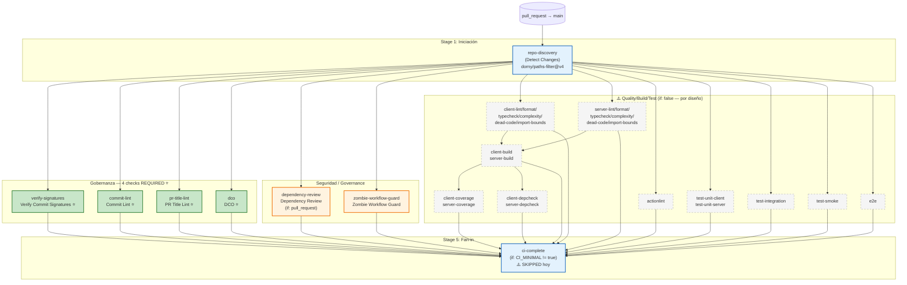

# 24 — Infraestructura del DAG en Pipelines CI/CD

> **Nivel Profesional · Guía 24**
> En esta guía aprenderás qué es un DAG (Directed Acyclic Graph) aplicado a pipelines CI/CD, los conceptos clave de orquestación de jobs, y cómo el DAG está implementado _realmente_ en `ci.yml` de Project One. Cubre patrones de la industria (fan-out/fan-in, path-scoping, skip-propagation) y cruza con la documentación existente del repo.

## 🎯 Objetivos de aprendizaje

Al terminar esta guía serás capaz de:

1. **Definir qué es un DAG** y por qué todo pipeline moderno _ya es_ un DAG (implícito o explícito).
2. **Explicar los conceptos clave** de orquestación: nodos/jobs, aristas/dependencias, fan-out, fan-in, path-scoping, skip-propagation y semántica de estados.
3. **Leer el DAG real de `ci.yml`** y mapearlo: repo-discovery → jobs condicionales → ci-complete.
4. **Distinguir los 3 tipos de nodos** en el DAG de Project One: required checks, non-blocking, y deshabilitados por diseño.
5. **Comparar capacidades DAG** entre los principales sistemas CI/CD de la industria.
6. **Evaluar cuándo el DAG es overkill** vs. cuándo aporta valor real.

## 📋 Prerequisitos

- Guía 06 completada (walkthrough de `ci.yml`): saber leer un workflow y entender `needs:`, `if:`, `steps:`.
- Guía 22 completada (rulesets): entender required status checks y el ruleset 21227644.
- Conceptos básicos de grafos (nodos y aristas) — no se requiere formación matemática.

---

# PARTE A — Qué es infraestructura del DAG

## 1. Definición: DAG aplicado a CI/CD

Un **DAG** (Directed Acyclic Graph) es una estructura de datos donde:

- **Nodos** = elementos que ejecutan trabajo (jobs, steps, tareas).
- **Aristas dirigidas** = dependencias entre nodos (el nodo B espera a que A termine).
- **Sin ciclos** = no hay caminos que retornen al nodo de origen (A→B→C→A es imposible).

> **Dato clave (verificado 2026-09-11):** Todo pipeline de CI/CD es _implicitamente_ un DAG aunque no lo declares. GitHub Actions construye un grafo interno a partir de `needs:`; GitLab CI lo construye a partir de `stages:` + `needs:`; Azure Pipelines lo construye con `dependsOn:`. La diferencia es si el DAG es **estático** (declarado en YAML) o **dinámico** (generado en runtime por código).

### ¿Por qué los pipelines modernos SON DAGs?

Porque la alternativa — ejecución secuencial estricta — es ineficiente:

```
# Secuencial (sin DAG): A → B → C → D → E
# Total: 5 × tiempo_medio = 5T

# Con DAG (paralelizado):
# A y B en paralelo → C (espera A+B) → D y E en paralelo
# Total: ~3T (40% más rápido)
```

El DAG permite **paralelización real** donde no hay dependencias, y **espera inteligente** donde las hay.

---

## 2. Conceptos clave

### 2.1 Nodos/jobs y aristas/dependencias (`needs:`)

En GitHub Actions, cada job es un nodo. La relación de dependencia se declara con `needs:`:

```yaml
jobs:
  build: # Nodo A (raíz, sin dependencias)
    runs-on: ubuntu-latest
    steps:
      - run: echo "Building..."

  test: # Nodo B (depende de A)
    needs: build
    runs-on: ubuntu-latest
    steps:
      - run: echo "Testing..."

  deploy: # Nodo C (depende de A y B)
    needs: [build, test]
    runs-on: ubuntu-latest
    steps:
      - run: echo "Deploying..."
```

**Regla por defecto:** un job con `needs:` solo corre si **todos** sus dependientes completaron con `success`. Si A falla o se salta, B y C se saltan automáticamente.

> **Fuente:** GitHub Docs — "Using jobs in a workflow" (docs.github.com, 2026). "If a job fails or is skipped, all jobs that need it are skipped unless the jobs use a conditional expression."

### 2.2 Fan-out y fan-in

| Patrón  | Qué es                                               | Ejemplo en Project One                       |
| ------- | ---------------------------------------------------- | -------------------------------------------- |
| Fan-out | Un job dispara N hijos en paralelo                   | `repo-discovery` alimenta 20+ jobs           |
| Fan-in  | N jobs alimentan 1 agregador que valida el resultado | `ci-complete` agrega todos los jobs upstream |

**Fan-out en GitHub Actions:**

```yaml
# repo-discovery produce outputs que alimentan N jobs
repo-discovery:
  outputs:
    client: ${{ steps.filter.outputs.client }}
    server: ${{ steps.filter.outputs.server }}
  steps:
    - uses: dorny/paths-filter@v4
      id: filter
      with: |
        client: ['apps/client/**']
        server: ['apps/server/**']

# Fan-out: cada job verifica el output correspondiente
client-lint:
  needs: repo-discovery
  if: needs.repo-discovery.outputs.client == 'true'
  steps: [...]
server-lint:
  needs: repo-discovery
  if: needs.repo-discovery.outputs.server == 'true'
  steps: [...]
```

**Fan-in (agregador):**

```yaml
ci-complete:
  if: ${{ vars.CI_MINIMAL != 'true' && always() }}
  needs: [client-lint, server-lint, verify-signatures, ...]
  steps:
    - name: Check for failures
      run: |
        if [[ "${{ contains(needs.*.result, 'failure') }}" == "true" ]]; then
          exit 1
        fi
        echo "All upstream jobs succeeded or were skipped"
```

> **Fuente:** Jake Wharton — "Fan-in to a single required GitHub Action" (jakewharton.com, 2025-05-07). Patrón documentado para consolidar múltiples required checks en un único gate.

### 2.3 Path-scoping / Routed DAG

Un **routed DAG** es un DAG cuya forma **cambia** según qué archivos cambiaron en el PR. No todos los jobs corren siempre — solo los "ruteados" por el path filter.

```yaml
# El DAG no es fijo; se construye dinámicamente según el diff
jobs:
  repo-discovery:
    outputs:
      client: ${{ steps.filter.outputs.client }}
      server: ${{ steps.filter.outputs.server }}
  # ...
  client-lint:
    needs: repo-discovery
    if: needs.repo-discovery.outputs.client == 'true' # Solo si cambiaron archivos de client
  server-lint:
    needs: repo-discovery
    if: needs.repo-discovery.outputs.server == 'true' # Solo si cambiaron archivos de server
```

> **Fuente (verificado 2026-09-11):** `docs/ci-cd-pipeline-empresarial.md` §23.3 L~2798-2801 define "DAG router / path scoping como INFRAESTRUCTURA prebuild" — el pipeline se organiza como DAG donde los jobs se enrutan según qué paths cambiaron en el PR.

**Comparativa de herramientas path-scoping:**

| Herramienta                | Tipo        | Graph-aware   | Drift risk |
| -------------------------- | ----------- | ------------- | ---------- |
| `dorny/paths-filter`       | Path list   | ❌ Manual     | Alto       |
| `tj-actions/changed-files` | Path list   | ❌ Manual     | Alto       |
| Nx `affected`              | Graph-based | ✅ Automático | Bajo       |
| Turborepo `--affected`     | Graph-based | ✅ Automático | Bajo       |
| Bazel query                | Graph-based | ✅ Automático | Bajo       |

> **Fuente:** Nx Docs — "Monorepo CI best practices" (nx.dev, 2025). "Path filters need no extra tooling... Maintaining path-based filters is expensive: a change to libs/ui has to be listed by hand in the filter of every consumer... Developers forget to update the filters when projects and dependencies change, so the pipeline goes green on a change it never tested."

### 2.4 Skip-propagation

¿Qué pasa con los dependientes cuando un upstream se salta (`skipped`) o falla (`failed`)? La respuesta **varía por plataforma** y es una de las fuentes más comunes de confusión.

**GitHub Actions (verificado 2026-09-11):**

```yaml
# COMPORTAMIENTO POR DEFECTO:
# Si A falla o se salta → B se salta automáticamente
# Si B se salta → C se salta automáticamente
# Skipped reporta "Success" y NO bloquea required checks

# Para romper la cadena de skip-propagation:
ci-complete:
  if: ${{ always() }} # Corre SIEMPRE, aunque upstreams fallen/se salten
  needs: [job-a, job-b]
  steps:
    - name: Validate results
      run: |
        if [[ "${{ contains(needs.*.result, 'failure') }}" == "true" ]]; then
          exit 1
        fi
```

> **Fuente:** GitHub Docs — "Using conditions to control job execution" (docs.github.com, 2026). "A job that is skipped will report its status as 'Success'. It will not prevent a pull request from merging, even if it is a required check." Issue actions/runner#2205 documenta el comportamiento confuso.

**GitLab CI:**

En GitLab, `needs` con un job skipped puede causar que el dependiente **se ejecute** (comportamiento opuesto a GitHub). Bug #213080: "Inconsistent behavior when using needs with skipped jobs — failure status is not being propagated down the need chain."

**Azure Pipelines:**

"If a stage, job, or step's parent is skipped, the stage, job, or step doesn't run, regardless of its conditions." (Microsoft Learn, 2026). Más restrictivo que GitHub.

### 2.5 Semántica de estados

GitHub Actions ofrece funciones de expresión para controlar cuándo corre un job:

| Expresión      | Significado                                      | Cuándo usarlo                                    |
| -------------- | ------------------------------------------------ | ------------------------------------------------ |
| `always()`     | Corre siempre (éxito, fallo, skipped, cancelled) | Agregadores que siempre deben evaluar resultados |
| `!cancelled()` | Corre salvo que se haya cancelado manualmente    | Agregadores que respetan cancelación del usuario |
| `!failure()`   | Corre si no hay fallos (pero sí skipped)         | Jobs que deben correr con upstreams skipped      |
| `success()`    | Solo si todos los upstreams fueron exitosos      | Default implícito de `needs:`                    |
| `failure()`    | Solo si algún upstream falló                     | Jobs de notificación de error                    |

**`continue-on-error: true`** en un job hace que su fallo NO propague a dependientes. Es decir, el job puede fallar y sus hijos siguen corriendo.

**`concurrency`** con `cancel-in-progress: true` cancela runs previos del mismo grupo — útil para PRs donde se hace push rápidamente.

```yaml
# Patrón recomendado para agregadores
ci-complete:
  if: ${{ !cancelled() }} # Corre siempre excepto si el usuario cancela
  needs: [job-a, job-b]
  steps:
    - name: Validate
      run: |
        if [[ "${{ contains(needs.*.result, 'failure') }}" == "true" ]]; then
          exit 1
        fi
```

> **Fuente:** Stack Overflow — "How to execute a job that needs a job that was skipped" (2024). Patrón `always() + result checking` como solución estándar.

### 2.6 Agregador/gate único (patrón fan-in)

El patrón más relevante para Project One: un job final que **agrega** el resultado de todos los upstreams y se convierte en el **único required check** del ruleset.

```yaml
# Patrón Jake Wharton (2025)
ci-complete:
  if: ${{ !cancelled() }}
  needs: [all, upstream, jobs]
  steps:
    - name: Check all results
      run: |
        results=$(tr -d '\n' <<< '${{ toJSON(needs.*.result) }}')
        if grep -q -v -E '(success|skipped)' <<< "$results"; then
          echo "One or more required jobs failed"
          exit 1
        fi
```

**¿Por qué no usar `always()` directamente?** Porque `always()` incluye `cancelled`, lo que hace que el agregador corra incluso si el usuario canceló el run. `!cancelled()` es más limpio.

> **Fuente:** Jake Wharton — "Fan-in to a single required GitHub Action" (jakewharton.com, 2025-05-07). "GitHub will skip the 'final-status' job if any of its 'needs' fail... To work around this, change the job to always run (unless canceled)."

---

## 3. Por qué importa

| Aspecto            | Con DAG                                              | Sin DAG (secuencial)                   |
| ------------------ | ---------------------------------------------------- | -------------------------------------- |
| **Costo CI**       | Solo corren jobs afectados (path-scoped)             | Todos los jobs siempre → desperdicio   |
| **Lead time**      | Paralelización real donde no hay dependencias        | Todo secuencial → lento                |
| **Determinismo**   | Mismo diff → mismo subgrafo ejecutado                | No siempre predecible                  |
| **Mantenibilidad** | Declarar dependencias es más claro que anidar stages | Lógica implícita en orden de aparición |

### ¿Cuándo es overkill?

Para repos pequeños (<5 workspaces, <20 jobs), un DAG explícito con path-scoping agrega complejidad de mantenimiento sin beneficio proporcional. Las herramientas como Dagger, Buildkite dynamic pipelines o Tekton son overkill hasta que el monorepo justifique la inversión.

> **Dato verificado (2026-09-11):** Project One tiene 2 workspaces activos (client, server) + e2e. Con ~20 jobs en ci.yml (la mayoría `if: false`), el DAG actual con `dorny/paths-filter` es la solución de costo-beneficio correcta. No se justifica migrar a Nx/Turborepo affected hasta que se añadan ≥5 workspaces.

---

## 4. Panorama de sistemas (tabla comparativa)

| Capacidad                      | GitHub Actions                   | GitLab CI                    | CircleCI                      | Buildkite                      | Azure Pipelines                |
| ------------------------------ | -------------------------------- | ---------------------------- | ----------------------------- | ------------------------------ | ------------------------------ |
| **DAG nativo**                 | `needs:` + `if:`                 | `needs:` + `stages:`         | Workflows (DAG implícito)     | `depends_on` + `steps`         | `dependsOn` + `condition`      |
| **Path-scoping nativo**        | `on: paths:` (trigger)           | `rules:changes:`             | Path-filtering orb            | `if_changed` + monorepo-diff   | `paths` (trigger)              |
| **Path-scoping dinámico**      | `dorny/paths-filter` (3rd party) | Manual via rules             | Dynamic config (setup_config) | Dynamic pipelines (SDK nativo) | Script custom                  |
| **Skip-propagation**           | Skipped → Success (no bloquea)   | Inconsistente (bugs #213080) | Skipped → Success             | Skip condition por step        | Parent skipped → child skipped |
| **Fan-in / agregador**         | `if: always()` + check results   | `needs` + `when:always`      | Continuation config           | `depends_on` + finalizer       | `condition: always()`          |
| **Generación dinámica de DAG** | ❌ (solo matrix)                 | ❌ (child pipelines)         | ✅ (dynamic config)           | ✅ (SDK nativo: Go/TS/Python)  | ❌                             |
| **Requiere migración**         | No (YAML puro)                   | No (YAML puro)               | Semi (setup_config)           | No (YAML + scripts)            | No (YAML puro)                 |

> **Nota:** Buildkite es el único que soporta **generación programática** del pipeline completo en runtime (Go, TypeScript, Python). Los demás son YAML declarativo con opciones dinámicas limitadas.

---

# PARTE B — Qué está implementado en Project One HOY

> **⚠️ Nota metodológica:** toda la información de esta parte fue verificada contra el código fuente real (`.github/workflows/ci.yml`, 1049 líneas, verificado 2026-09-11) y la documentación del repo. Se cita la línea de referencia exacta.

## 1. El DAG real de `ci.yml`

### 1.1 Raíz del DAG: `repo-discovery`

**Archivo:** `.github/workflows/ci.yml` L20-46
**Job ID:** `repo-discovery` | **Nombre UI:** "Detect Changes"

```yaml
repo-discovery:
  name: Detect Changes
  runs-on: ubuntu-latest
  outputs:
    client: ${{ steps.filter.outputs.client }}
    server: ${{ steps.filter.outputs.server }}
    e2e: ${{ steps.filter.outputs.e2e }}
    shared: ${{ steps.filter.outputs.shared }}
  steps:
    - uses: actions/checkout@v5
    - uses: dorny/paths-filter@v4
      id: filter
      with:
        filters: |
          client:
            - 'apps/client/**'
          server:
            - 'apps/server/**'
          e2e:
            - 'e2e/**'
          shared:
            - 'package.json'
            - 'package-lock.json'
            - '.github/workflows/**'
```

Este job es la **raíz del DAG**: consume el diff del PR y produce 4 outputs booleanos que enrutan los jobs downstream. Es el punto donde el DAG se vuelve **routed** (su forma depende del contenido del PR).

### 1.2 DAG condicional: path-scoping por outputs

Los jobs downstream verifican los outputs de `repo-discovery` vía `needs.repo-discovery.outputs.<key>`:

```yaml
# Ejemplo real (ci.yml L394-404):
client-lint:
  if: false # Disabled for incremental CI
  needs: repo-discovery
  # Cuando se reactive, la condición será:
  # if: needs.repo-discovery.outputs.client == 'true'

server-lint:
  if: false # Disabled for incremental CI
  needs: repo-discovery
```

> **Estado real verificado:** hoy, TODOS los jobs de calidad/build/test tienen `if: false` — el path-scoping condicional **está declarado en la estructura** pero **no se evalúa** porque los nodos están deshabilitados por diseño (CI_MINIMAL=true).

### 1.3 Agregador final: `ci-complete`

**Archivo:** `.github/workflows/ci.yml` L760-809
**Job ID:** `ci-complete` | **Nombre UI:** "CI Complete"

```yaml
ci-complete:
  if: ${{ vars.CI_MINIMAL != 'true' && always() }}
  name: CI Complete
  needs:
    - repo-discovery
    - actionlint
    - commit-lint
    - pr-title-lint
    - dco
    - dependency-review
    - client-lint
    - client-format-check
    - client-typecheck
    - client-complexity
    - client-dead-code
    - client-import-bounds
    - server-lint
    - server-format-check
    - server-typecheck
    - server-complexity
    - server-dead-code
    - server-import-bounds
    - client-build
    - server-build
    - client-sonarqube
    - server-sonarqube
    - client-coverage
    - server-coverage
    - client-depcheck
    - server-depcheck
    - test-unit-client
    - test-unit-server
    - test-integration
    - test-smoke
    - e2e
    - verify-signatures
    - zombie-workflow-guard
  steps:
    - name: Check for failures
      run: |
        if [[ "${{ contains(needs.*.result, 'failure') }}" == "true" ]]; then
          echo "❌ One or more upstream jobs failed"
          exit 1
        fi
        if [[ "${{ contains(needs.*.result, 'cancelled') }}" == "true" ]]; then
          echo "⚠️ One or more upstream jobs were cancelled — skipping ci-complete"
          exit 0
        fi
        echo "✅ All upstream jobs succeeded or were skipped"
```

**Comportamiento actual:**

- `CI_MINIMAL=true` → `ci-complete` se salta (**SKIPPED**)
- Como skipped reporta "Success", NO es status check del ruleset (nunca se ha reportado para poder vincularlo)
- `always()`确保 corre aunque upstreams fallen — pero el guard de CI_MINIMAL lo previene

> **Fuente cruzada:** `docs/CONTEXT-CICD.md` §3.1: "ci-complete corre SOLO si CI_MINIMAL != 'true'. Como CI_MINIMAL=true, queda SKIPPED → 'CI Complete' NO se reporta."

### 1.4 Jobs habilitados que SÍ corren hoy

| Job                     | Nombre UI                          | Required?  | continue-on-error? | Path-scoped?       |
| ----------------------- | ---------------------------------- | ---------- | ------------------ | ------------------ |
| `verify-signatures`     | Verify Commit Signatures           | ✅ Ruleset | ❌                 | No (corre siempre) |
| `commit-lint`           | Commit Lint (Conventional Commits) | ✅ Ruleset | ❌                 | No (corre siempre) |
| `pr-title-lint`         | PR Title Lint                      | ✅ Ruleset | ❌                 | No (corre siempre) |
| `dco`                   | DCO                                | ✅ Ruleset | ❌                 | No (corre siempre) |
| `dependency-review`     | Dependency Review                  | ❌         | ❌                 | `if: pull_request` |
| `zombie-workflow-guard` | Zombie Workflow Guard              | ❌         | ❌                 | No (corre siempre) |

> **Nota (2026-09-11):** el job `sast` ("SAST Semgrep") que existía previamente en ci.yml (L757-772, con `continue-on-error: true`, standalone governance) **fue eliminado** del archivo. La funcionalidad SAST vive ahora solo en `security.yml` (deshabilitado). Verificar si fue movido a otro workflow o eliminado completamente antes de documentar como "implementado".

### 1.5 Jobs `if: false` — DAG con nodos deshabilitados

**Archivo:** `.github/workflows/ci.yml` — múltiples jobs (L394-576, 580-698, 815-1022)

Todos estos jobs tienen `if: false` con comentario explícito:

```yaml
client-lint:
  if: false # Disabled for incremental CI — change to true to re-enable
  needs: repo-discovery
```

**Jobs deshabilitados (verificados L394-1022):**

| Categoría      | Jobs                                                                                                          | Líneas    |
| -------------- | ------------------------------------------------------------------------------------------------------------- | --------- |
| Client Quality | client-lint, client-format-check, client-typecheck, client-complexity, client-dead-code, client-import-bounds | L394-477  |
| Server Quality | server-lint, server-format-check, server-typecheck, server-complexity, server-dead-code, server-import-bounds | L479-562  |
| Shared Quality | actionlint                                                                                                    | L565-576  |
| Build          | client-build, server-build                                                                                    | L580-698  |
| Coverage       | client-coverage, server-coverage                                                                              | L700-713  |
| DepCheck       | client-depcheck, server-depcheck                                                                              | L715-728  |
| Unit Tests     | test-unit-client, test-unit-server                                                                            | L815-875  |
| Integration    | test-integration                                                                                              | L877-935  |
| Smoke          | test-smoke                                                                                                    | L937-967  |
| E2E            | e2e                                                                                                           | L969-1022 |

> **⚠️ CRÍTICO:** Estos nodos **NO están rotos**. Son diseño incremental de CI_MINIMAL=true (§3.1 de CONTEXT-CICD). Activarlos requiere un change OpenSpec que justifique el costo.

---

## 2. Cruce con documentación existente

### 2.1 `docs/ci-cd-pipeline-empresarial.md` §23.3

> L~2798-2801: Define "DAG router / path scoping" como **INFRAESTRUCTURA prebuild** (Stage 2). El pipeline se organiza como DAG donde los jobs se enrutan según qué paths cambiaron en el PR. NO es un check de gobernanza — es infraestructura que alimenta los checks.

### 2.2 `docs/pre-merge-gates-governance.md` §4.11

> L613: repo-discovery es infraestructura, DAG condicional, alimenta ci-complete. Clasificado como INFRAESTRUCTURA (no GOVERNANCE).

### 2.3 `docs/CONTEXT-CICD.md` §3.1

> "CI_MINIMAL=true ES INTENCIONAL → CI en modo mínimo/incremental. Muchos jobs if: false (disabled a propósito): client-lint, server-lint, _-build, sonarqube, coverage, depcheck, test-unit-_, test-integration, test-smoke, e2e, actionlint. NO son bugs; no activarlos 'para que funcione'."

### 2.4 `docs/learning/ci-cd/07-quality-yml-reusable.md` §11

> Documenta la migración de `quality.yml` (workflow separado) a jobs `if:false` inline en `ci.yml` — el patrón actual del DAG.

---

## 3. Estado real del repo

| Indicador                       | Estado real (verificado API + código)                                                      |
| ------------------------------- | ------------------------------------------------------------------------------------------ |
| Workflows totales               | 8 archivos en `.github/workflows/`                                                         |
| Workflows habilitados en GitHub | 1 (`ci.yml` activo)                                                                        |
| Workflows `disabled_manually`   | 7 (security, scheduled-security, security-digest, deploy, preview, release, ci-enterprise) |
| Ruleset 21227644                | Activo, 4 required checks                                                                  |
| Merge queue                     | NO activo (trigger `merge_group` es dead code)                                             |
| CI_MINIMAL                      | `true` → la mayoría de jobs deshabilitados                                                 |
| Node source of truth            | `.nvmrc` = `22.23.1`                                                                       |

> **Fuente:** `docs/CONTEXT-CICD.md` §3.4/§5.9 — verificado por API 2026-08-30.

---

## 4. Mapa del DAG actual de Project One



**Leyenda:**

- ⭐ = Required status check (ruleset 21227644, **BLOCKING**)
- 🟠 = Non-blocking (dependency-review, zombie-guard)
- ⬜ = Skipped por diseño (if: false, CI_MINIMAL=true)
- 🔵 = Siempre corre (raíz del DAG + fan-in)

---

## Fuentes de la investigación

Las siguientes fuentes fueron consultadas el **2026-09-11** para la investigación que fundamenta esta guía:

1. GitHub Docs — "Using conditions to control job execution" — https://docs.github.com/en/actions/how-tos/write-workflows/choose-when-workflows-run/control-jobs-with-conditions
2. GitHub Docs — "Using jobs in a workflow" — https://docs.github.com/en/actions/how-tos/write-workflows/choose-what-workflows-do/use-jobs
3. GitHub Docs — "Workflow syntax for GitHub Actions" — https://docs.github.com/actions/using-workflows/workflow-syntax-for-github-actions
4. GitHub Changelog — "Smarter editing, clearer debugging, and a new case function" — https://github.blog/changelog/2026-01-29-github-actions-smarter-editing-clearer-debugging-and-a-new-case-function
5. Wasil Zafar — "GitHub Actions Bootcamp Module 3: Jobs, Steps, and Workflow Structure" — https://www.wasilzafar.com/pages/series/software-engineering/deep-dive-github-actions-03-jobs-steps-structure.html (2026-06-02)
6. Nx Docs — "Monorepo CI best practices" — https://nx.dev/docs/kb/monorepo-ci-best-practices
7. Nx Docs — "Run Only Tasks Affected by a PR" — https://21.nx.dev/docs/features/ci-features/affected
8. Nx Docs — "Reduce Wasted Time in CI" — https://nx.dev/docs/kb/reduce-waste
9. Buildkite Docs — "Working with monorepos" — https://buildkite.com/docs/pipelines/best-practices/working-with-monorepos
10. Buildkite Docs — "Dynamic pipelines" — https://buildkite.com/docs/pipelines/configure/dynamic-pipelines.md
11. Buildkite Blog — "The power of Dynamic Pipelines" — https://buildkite.com/resources/blog/how-to-build-ci-cd-pipelines-dynamically (2025-03-28)
12. Buildkite Skills — "Dynamic Pipeline Patterns" — https://github.com/buildkite/skills/blob/main/skills/buildkite-pipelines/references/dynamic-pipeline-patterns.md
13. Buildkite Docs — "Pipeline design and structure" — https://buildkite.com/docs/pipelines/best-practices/pipeline-design-and-structure
14. Hasura Blog — "What we learnt by migrating from CircleCI to Buildkite" — https://hasura.io/blog/what-we-learnt-by-migrating-from-circleci-to-buildkite
15. OneUptime — "How to Handle Monorepo Path Filters in GitHub Actions" — https://oneuptime.com/blog/post/2025-12-20-monorepo-path-filters-github-actions/view (2025-12-20)
16. OneUptime — "How to Use DAG in GitLab CI" — https://oneuptime.com/blog/post/2025-12-21-dag-gitlab-ci/view (2025-12-21)
17. Eficode — "GitLab CI monorepos: Pipeline do's and don'ts" — https://www.eficode.com/insights/blog/gitlab-ci-monorepos-pipeline-dos-and-donts (2026-08-04)
18. Microsoft Learn — "Pipeline conditions" — https://learn.microsoft.com/en-us/azure/devops/pipelines/process/conditions
19. Microsoft Learn — "Stages in Azure Pipelines" — https://learn.microsoft.com/en-us/azure/devops/pipelines/process/stages
20. Jake Wharton — "Fan-in to a single required GitHub Action" — https://jakewharton.com/fan-in-to-a-single-required-github-action (2025-05-07)
21. GitHub Issue — "Jobs skipped when NEEDS job ran successfully" — https://github.com/actions/runner/issues/2205 (2022-2025)
22. GitHub Issue — "Clarify expressions for workflows with skipped jobs" — https://github.com/github/docs/issues/28762 (2023)
23. Mergify — "Monorepo CI for GitHub Actions: Run Exactly the Tests You Need" — https://mergify.com/blog/monorepo-ci-for-github-actions-run-exactly-the-tests-you-need-nothing-more
24. Dagger.io — "The missing software stack for CI" — https://dagger.io/
25. Dagger Docs — "GitLab CI integration" — https://docs.dagger.io/getting-started/ci-integrations/gitlab-ci
26. Vercel Blog — "Monorepos are changing how teams build software" — https://vercel.com/blog/monorepos
27. Turborepo Docs — "Constructing CI" — https://turborepo.dev/docs/crafting-your-repository/constructing-ci
28. Turborepo Blog — "Turborepo 2.9" (91% faster TTFT) — https://turborepo.dev/blog/2-9
29. Bazel Docs — "Remote Execution Overview" — https://bazel.build/remote/rbe
30. DZone — "CI/CD at Scale: Smarter Pipelines for Monorepo" — https://dzone.com/articles/ci-cd-at-scale-smarter-pipelines-for-monorepos

---

## Próximos pasos / mejoras candidatas

| Candidato                                  | Prioridad | Dependencia                                 | Nota                                                                                  |
| ------------------------------------------ | --------- | ------------------------------------------- | ------------------------------------------------------------------------------------- |
| **ci-complete robusto con `!cancelled()`** | Alta      | Ninguna (cambio en ci.yml)                  | Cambiar `if: always()` → `if: !cancelled()` para respetar cancelación del usuario     |
| **Path-scoping real en jobs habilitados**  | Media     | CI_MINIMAL=false (requiere change OpenSpec) | Cuando se activen jobs quality, añadir `if: needs.repo-discovery.outputs.X == 'true'` |
| **F2 SAST blocking**                       | Media     | Validar F1 (no-blocking) por sprint         | Re-introducir job sast en ci.yml con `continue-on-error: false` + añadir al ruleset   |
| **Nx/Turborepo affected detection**        | Baja      | >5 workspaces en el monorepo                | Reemplazar `dorny/paths-filter` con graph-based affected                              |
| **Merge queue activa**                     | Baja      | Regla `merge_queue` en ruleset              | Activar `merge_group` trigger (hoy es dead code)                                      |
| **Dagger.io como DAG engine**              | Baja      | Migración significativa                     | Solo si el pipeline crece a 50+ jobs y YAML se vuelve ingobernable                    |
