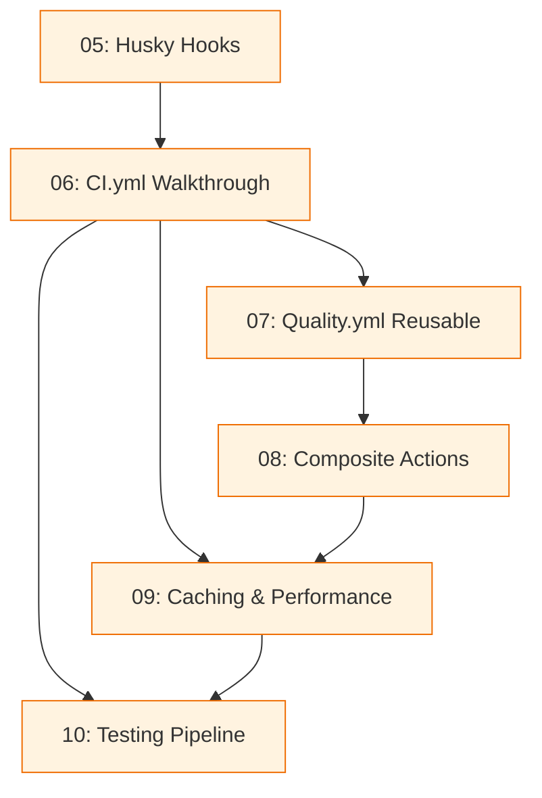

# Nivel Intermedio: CI/CD con GitHub Actions

> **Ruta de navegación**: [Fundamentos](./fundamentos-README.md) → **Intermedio** → [Avanzado](../../../openspec/changes/learning-cicd-avanzado/) → [Profesional](../../../openspec/changes/learning-cicd-profesional/)

---

## 🎯 Objetivos de Aprendizaje Globales

Al completar este nivel, serás capaz de:

- **Leer y modificar cualquier workflow del proyecto** (`.github/workflows/*.yml`) entendiendo su arquitectura, jobs, steps y dependencias
- **Configurar y depurar hooks de Husky** (`.husky/pre-commit`, `commit-msg`, `pre-push`) con herramientas de calidad paralelas
- **Diseñar workflows reutilizables** usando `workflow_call` y **composite actions** sabiendo cuándo usar cada patrón
- **Optimizar caché y performance** en CI (npm, Vitest, Playwright) entendiendo claves de invalidación y gotchas reales
- **Ejecutar y diagnosticar pipelines de testing** completos: unit, integración (PostgreSQL real), smoke y E2E (Playwright)

---

## 👤 Perfil del Lector

| Característica                | Descripción                                                              |
| ----------------------------- | ------------------------------------------------------------------------ |
| **Experiencia**               | Desarrollador Junior (0-2 años)                                          |
| **Prerrequisito obligatorio** | Haber completado **guías 00-04 del nivel Fundamentos**                   |
| **Conocimientos base**        | Conceptos básicos CI/CD, GitHub Actions, secrets/variables, YAML, Docker |
| **Objetivo**                  | Pasar de "ejecutar CI" a "entender, modificar y extender CI"             |

> ⚠️ **Importante**: Si no has completado el nivel Fundamentos, empieza por [aquí](./fundamentos-README.md). Este nivel asume fluidez con: `actions/checkout`, `actions/setup-node`, `npm ci`, estructura básica de workflow, y el concepto de _runner_.

---

## 🧭 Metodología

- **Aprender haciendo**: Cada guía incluye walkthrough de código real del proyecto
- **Gotchas explícitos**: Problemas reales encontrados (timeouts, cache-miss, fetch-depth) con solución
- **Referencias, no copias**: Enlazamos a docs oficiales y archivos del repo; no duplicamos contenido
- **Progresión controlada**: Guías 05-10 en orden estricto; cada una construye sobre la anterior

---

## 🗺️ Roadmap: 4 Niveles de Aprendizaje CI/CD


| Nivel           | Guías     | Enfoque                                                                             | Estado            |
| --------------- | --------- | ----------------------------------------------------------------------------------- | ----------------- |
| **Fundamentos** | 00-04     | Conceptos base, syntax YAML, jobs simples, actions marketplace                      | ✅ Completado     |
| **Intermedio**  | **05-10** | **Hooks Husky, walkthrough CI real, reusable/composite, caching, testing pipeline** | 🟠 **Estás aquí** |
| **Avanzado**    | 11-15     | Matrix builds, environments, deployment, security scanning, monorepo strategies     | 🔜 Planificado    |
| **Profesional** | 16-20     | Self-hosted runners, cost optimization, governance, platform engineering            | 🔜 Planificado    |

> **Nota**: Los niveles Avanzado y Profesional se implementarán en los cambios OpenSpec `learning-cicd-avanzado` y `learning-cicd-profesional` respectivamente. Enlaces arriba (pueden dar 404 hasta que se implementen).

---

## 📋 Tabla de Guías: Orden de Lectura Obligatorio

| #   | Guía                      | Archivo                                                          | Descripción Breve                                                                                                                                                                                                        | Tiempo Estimado |
| --- | ------------------------- | ---------------------------------------------------------------- | ------------------------------------------------------------------------------------------------------------------------------------------------------------------------------------------------------------------------ | --------------- |
| 05  | **Husky Git Hooks**       | [`./05-husky-git-hooks.md`](./05-husky-git-hooks.md)             | Configuración `.husky/`: pre-commit (lint-staged + Semgrep + Gitleaks paralelo), commit-msg (commitlint + Conventional Commits), pre-push (vitest --changed). Gotcha: timeout bash 120s, baseline 19 findings Semgrep.   | 45-60 min       |
| 06  | **CI.yml Walkthrough**    | [`./06-ci-yml-walkthrough.md`](./06-ci-yml-walkthrough.md)       | Análisis profundo `.github/workflows/ci.yml`: 9 jobs, `dorny/paths-filter@v4`, `concurrency cancel-in-progress`, service container PostgreSQL 16, reporter JUnit + `dorny/test-reporter@v3`. Gotcha: fetch-depth Caso 2. | 60-75 min       |
| 07  | **Quality.yml Reusable**  | [`./07-quality-yml-reusable.md`](./07-quality-yml-reusable.md)   | Workflows reutilizables vía `workflow_call`: cómo `ci.yml` invoca `quality.yml` con inputs, distinción reusable vs composite, parámetros tipados.                                                                        | 45-60 min       |
| 08  | **Composite Actions**     | [`./08-composite-actions.md`](./08-composite-actions.md)         | Composite actions en detalle: walkthrough `.github/actions/setup-monorepo/action.yml` (setup-node .nvmrc + npm ci + cache Vitest). Regla "composite NO hace checkout" Caso 2. Cuándo composite vs reusable.              | 45-60 min       |
| 09  | **Caching & Performance** | [`./09-caching-y-performance.md`](./09-caching-y-performance.md) | Caché npm via `setup-node`, cache Vitest (key `vitest-OS-hash`), cache Playwright, reglas de invalidación. Gotcha cache-miss `ci-enterprise.yml` (paths frontend/backend inexistentes). Ejecución local con `act`.       | 60-75 min       |
| 10  | **Testing Pipeline**      | [`./10-testing-pipeline.md`](./10-testing-pipeline.md)           | Pipeline testing en CI: path filtering por workspace, unit co-locados, integración con PostgreSQL real, smoke (`vitest.smoke.config.js`), E2E Playwright Chromium, reporter JUnit, pirámide de tests.                    | 60-75 min       |

**Total estimado**: 5.5 - 7 horas

---

## 🎯 Objetivos Específicos por Guía

### Guía 05: Husky Git Hooks

- [ ] Entender la arquitectura de hooks en `.husky/` y su ejecución en cliente (pre-commit, commit-msg, pre-push)
- [ ] Configurar `lint-staged` para ejecutar linters solo en archivos staged
- [ ] Ejecutar Semgrep + Gitleaks en paralelo en pre-commit con timeout controlado (120s)
- [ ] Validar Conventional Commits con `commitlint` en commit-msg
- [ ] Lanzar `vitest --changed origin/main` en pre-push para tests afectados
- [ ] Interpretar baseline de 19 findings Semgrep y decidir cuáles suprimir

### Guía 06: CI.yml Walkthrough

- [ ] Leer y explicar los 9 jobs de `ci.yml` y sus dependencias (`needs`)
- [ ] Usar `dorny/paths-filter@v4` para path-based job triggering
- [ ] Configurar `concurrency: cancel-in-progress` para evitar builds zombis
- [ ] Levantar service container PostgreSQL 16 para tests de integración
- [ ] Generar reportes JUnit y consumirlos con `dorny/test-reporter@v3`
- [ ] Entender el gotcha `fetch-depth: 0` vs el default (`1`) (Caso 2)

### Guía 07: Quality.yml Reusable

- [ ] Definir un workflow reutilizable con `on: workflow_call` e inputs tipados
- [ ] Invocar `quality.yml` desde `ci.yml` pasando parámetros (node-version, cache-keys, etc.)
- [ ] Distinguir `workflow_call` (reusable workflow) vs `composite action` (composite action)
- [ ] Usar `secrets: inherit` vs pasar secrets explícitamente
- [ ] Versionar workflows reutilizables con tags o refs

### Guía 08: Composite Actions

- [ ] Crear composite action en `.github/actions/setup-monorepo/action.yml`
- [ ] Encadenar steps: `setup-node` con `.nvmrc` → `npm ci` → cache Vitest
- [ ] Aplicar regla crítica: **composite NO hace checkout** (responsabilidad del caller)
- [ ] Decidir cuándo usar composite action vs reusable workflow (matriz de decisión)
- [ ] Depurar composite actions con `act` localmente

### Guía 09: Caching & Performance

- [ ] Configurar cache npm via `actions/setup-node@cache: 'npm'`
- [ ] Diseñar claves de cache Vitest: `vitest-${{ runner.os }}-${{ hashFiles('package-lock.json') }}`
- [ ] Configurar cache Playwright (solo browsers: `~/.cache/ms-playwright`)
- [ ] Definir reglas de invalidación: `restore-keys`, `cache-hit` vs `cache-miss`
- [ ] Diagnosticar gotcha real: `ci-enterprise.yml` referenciando paths `frontend/` y `backend/` inexistentes
- [ ] Ejecutar workflows localmente con `act` para validar cache

### Guía 10: Testing Pipeline

- [ ] Implementar path filtering por workspace (apps/client, apps/server, packages/\*)
- [ ] Ejecutar tests unitarios co-locados (`*.test.ts` junto a source)
- [ ] Levantar PostgreSQL real para tests de integración (service container)
- [ ] Configurar smoke tests con `vitest.smoke.config.js` (subset crítico)
- [ ] Ejecutar E2E con Playwright Chromium en CI headless
- [ ] Unificar reportes JUnit de todas las capas para `dorny/test-reporter`
- [ ] Visualizar pirámide de tests: unit (rápidos, muchos) → integración (medios) → E2E (lentos, pocos)

---

## 📚 Docs de Referencia (Enlaces, No Copias)

| Documento                        | Ruta                                                                                             | Qué Encontrarás                                                      |
| -------------------------------- | ------------------------------------------------------------------------------------------------ | -------------------------------------------------------------------- |
| **Estado actual CI/CD**          | [`../../../docs/cicd-estado-actual.md`](../../../docs/cicd-estado-actual.md)                     | Snapshot de workflows, jobs, tiempos, métricas actuales              |
| **Guía mantenimiento workflows** | [`../../../docs/workflows-mantenimiento-guia.md`](../../../docs/workflows-mantenimiento-guia.md) | Patrones para modificar workflows sin romper CI                      |
| **Arquitectura de testing**      | [`../../../docs/testing-architecture.md`](../../../docs/testing-architecture.md)                 | Pirámide, estrategias, herramientas, configuración Vitest/Playwright |
| **Code Style**                   | [`../../../docs/code-style.md`](../../../docs/code-style.md)                                     | Convenciones lint, format, naming, commits                           |

> **Convención**: Estos docs son **fuente de verdad viva**. Si detectas discrepancia entre una guía y estos docs, **gana el doc de referencia**. Reporta la discrepancia como issue.

---

## ⏱️ Ritmo Sugerido

| Sesión | Guías | Objetivo                                                            |
| ------ | ----- | ------------------------------------------------------------------- |
| 1      | 05    | Hooks locales funcionando, entiendes pre-commit/commit-msg/pre-push |
| 2      | 06    | Lees `ci.yml` end-to-end, explicas cada job y su `needs`            |
| 3      | 07    | Entiendes `workflow_call`, modificas un input y ves el efecto       |
| 4      | 08    | Creas/modificas composite action, entiendes regla no-checkout       |
| 5      | 09    | Diagnosticas cache-hit/miss, ejecutas `act` localmente              |
| 6      | 10    | Corres pipeline testing completo, interpretas reportes JUnit        |

**Tip**: Una guía por sesión (1-1.5h). No saltes guías; la 07 usa conceptos de la 06, la 08 aclara dudas de la 07, etc.

---

## 🧩 Navegación Rápida (Diagrama de Dependencias)



**ASCII fallback** (si mermaid no renderiza):

```
05 Husky Hooks
    |
    v
06 CI.yml Walkthrough ---+--- 07 Quality.yml Reusable ---+ 08 Composite Actions
    |                        |                           |
    |                        +---------------+-----------+
    |                                        v
    +--------------------------------+ 09 Caching & Performance
                                       |
                                       v
                                   10 Testing Pipeline
```

---

## ❓ FAQ

### ¿Puedo saltarme la guía 05 si ya uso Husky en otro proyecto?

**No.** Esta guía cubre la configuración **específica de este repo**: paralelismo Semgrep+Gitleaks, timeout 120s, baseline 19 findings, y `vitest --changed origin/main` en pre-push. Son decisiones de arquitectura del proyecto, no genéricas.

### ¿Por qué 9 jobs en `ci.yml`? ¿No es mucho?

Cada job tiene responsabilidad única (`changes`, `quality`, `test-unit-client`, `test-unit-server`, `test-integration`, `test-smoke`, `build`, `e2e`, `zombie-workflow-guard`). El path-filtering asegura que **solo corran los necesarios**. Ver guía 06 para el desglose.

### ¿Cuál es la diferencia real entre `workflow_call` y `composite action`?

| Aspecto       | `workflow_call` (Reusable) | `composite` Action       |
| ------------- | -------------------------- | ------------------------ |
| **Alcance**   | Workflow completo (jobs)   | Secuencia de steps       |
| **Checkout**  | Puede hacerlo internamente | **NUNCA** (regla de oro) |
| **Inputs**    | Tipados, validados         | `inputs:` en action.yml  |
| **Outputs**   | `outputs:` en workflow     | `outputs:` en action.yml |
| **Uso ideal** | Orquestación multi-job     | Setup compartido, utils  |

Ver guías 07 y 08 para ejemplos reales del repo.

### ¿Por qué `fetch-depth: 0` en algunos jobs y el default en otros?

`fetch-depth: 0` = historial completo (necesario para `dorny/test-reporter` y el análisis de commits; Caso 2 de la guía 06). El resto de jobs usan el default (`fetch-depth: 1`, shallow checkout). Ver guía 06, gotcha Caso 2.

### El cache no funciona, siempre cache-miss. ¿Qué hago?

1. Verifica que la **key** incluya hash de archivos de config (`package-lock.json`, `vitest.config.ts`, etc.)
2. Revisa `restore-keys` para fallback parcial
3. Ejecuta con `act -j <job>` localmente y inspecciona logs de `actions/cache`
4. Ver guía 09: gotcha real `ci-enterprise.yml` con paths inexistentes

### ¿Cómo ejecuto todo localmente antes de pushear?

```bash
# Hooks locales (ya configurados si completaste guía 05)
git commit -m "feat: test"  # dispara pre-commit + commit-msg
git push origin feature/x   # dispara pre-push

# CI completo con act (requiere Docker)
act -j test-unit-client,test-unit-server  # jobs específicos
act                         # todos (lento, necesita secrets)
```

Ver guía 09 para `act` setup detallado.

---

## 📖 Glosario Rápido (Términos Técnicos en Inglés)

| Término                  | Definición Corta                                                                      |
| ------------------------ | ------------------------------------------------------------------------------------- |
| **workflow**             | Archivo YAML en `.github/workflows/` que define automatización                        |
| **job**                  | Unidad de ejecución dentro de un workflow; corre en un runner                         |
| **step**                 | Comando o action individual dentro de un job                                          |
| **runner**               | Máquina (GitHub-hosted o self-hosted) que ejecuta jobs                                |
| **action**               | Unidad reutilizable de lógica (JavaScript, Docker, o composite)                       |
| **hook**                 | Script Git que se ejecuta en eventos locales (pre-commit, push, etc.)                 |
| **concurrency**          | Control de ejecuciones simultáneas; `cancel-in-progress` mata previas                 |
| **service container**    | Contenedor Docker auxiliar (ej. PostgreSQL) accesible via `localhost` en job          |
| **path filtering**       | Técnica para ejecutar jobs solo si cambian archivos en ciertos paths                  |
| **cache key**            | Identificador único para una entrada de cache; `hashFiles()` para invalidación        |
| **workflow_call**        | Trigger que permite invocar un workflow desde otro (reusable workflow)                |
| **composite action**     | Action que agrupa múltiples steps; no hace checkout por sí misma                      |
| **JUnit reporter**       | Formato XML estandarizado para reportes de tests; consumido por `dorny/test-reporter` |
| **semgrep**              | Static analysis tool con reglas de seguridad/calidad; corre en pre-commit             |
| **gitleaks**             | Secret scanner; evita commitear API keys, tokens, passwords                           |
| **lint-staged**          | Ejecuta linters solo en archivos staged (no en todo el repo)                          |
| **conventional commits** | Especificación de mensajes de commit estructurados (`feat:`, `fix:`, `chore:`, etc.)  |

---

## ✅ Checklist de Graduación (Nivel Intermedio Completado)

Marca cada ítem cuando lo domines **sin consultar la guía**:

### Guía 05 - Husky Hooks

- [ ] Explico qué hace cada hook (pre-commit, commit-msg, pre-push) y en qué orden corren
- [ ] Configuré `lint-staged` para un nuevo linter y funcionó en commit
- [ ] Entiendo por qué Semgrep+Gitleaks corren en paralelo y cómo ajustar timeout
- [ ] Sé interpretar y actuar sobre los 19 findings baseline de Semgrep
- [ ] `vitest --changed origin/main` en pre-push detecta tests rotos antes de push

### Guía 06 - CI.yml Walkthrough

- [ ] Dibujo el grafo de dependencias de los 9 jobs (`needs:`) de memoria
- [ ] Explico cómo `dorny/paths-filter` decide qué jobs disparar
- [ ] Configuré `concurrency: cancel-in-progress` en un workflow nuevo
- [ ] Levanté service container PostgreSQL y conecté tests de integración
- [ ] Generé y consumí reporte JUnit con `dorny/test-reporter@v3`
- [ ] Explico la diferencia `fetch-depth: 0` vs el default (`1`) y cuándo usar cada uno

### Guía 07 - Quality.yml Reusable

- [ ] Escribí un `workflow_call` con inputs tipados (`string`, `boolean`, `choice`)
- [ ] Invocé un reusable workflow pasando secrets y inputs desde `ci.yml`
- [ ] Distingo claramente cuándo usar reusable workflow vs composite action

### Guía 08 - Composite Actions

- [ ] Creé/modifiqué `.github/actions/mi-action/action.yml` con steps encadenados
- [ ] Apliqué la regla: **composite NO hace checkout** (el caller lo hace)
- [ ] Decidí correctamente entre composite y reusable para un caso nuevo

### Guía 09 - Caching & Performance

- [ ] Diseñé cache key con `hashFiles()` para invalidación automática
- [ ] Diagnosticé cache-miss y cache-hit en logs de GitHub Actions
- [ ] Identifiqué y corregí paths inexistentes en config de cache (gotcha enterprise)
- [ ] Ejecuté workflow localmente con `act` y validé cache

### Guía 10 - Testing Pipeline

- [ ] Configuré path filtering por workspace (client, server, packages)
- [ ] Corrí tests unit, integración (PostgreSQL real), smoke y E2E en orden
- [ ] Interpreté reporte JUnit unificado en `dorny/test-reporter`
- [ ] Explico la pirámide de tests y por qué cada capa existe

---

## 🚀 Qué Sigue: Nivel Avanzado

Cuando **todos los checkboxes de arriba estén marcados**, estás listo para el **Nivel Avanzado** (guías 11-15), que cubrirá:

| Guía | Tema                                        | Cambio OpenSpec          |
| ---- | ------------------------------------------- | ------------------------ |
| 11   | Matrix builds multi-OS/Node                 | `learning-cicd-avanzado` |
| 12   | Environments & deployment gates             | `learning-cicd-avanzado` |
| 13   | Security scanning (SAST/DAST/SCA)           | `learning-cicd-avanzado` |
| 14   | Monorepo strategies (Nx/Turborepo patterns) | `learning-cicd-avanzado` |
| 15   | Observabilidad & métricas CI                | `learning-cicd-avanzado` |

> **Enlace futuro**: [`../../../openspec/changes/learning-cicd-avanzado/`](../../../openspec/changes/learning-cicd-avanzado/) (cuando se implemente)

Y después, **Nivel Profesional** (guías 16-20): self-hosted runners, cost optimization, governance, platform engineering — cambio `learning-cicd-profesional`.

---

## 🏠 Volver al Inicio

- [📚 Nivel Fundamentos (guías 00-04)](./fundamentos-README.md)
- [📚 Docs Learning CI/CD](./fundamentos-README.md)
- [📚 Raíz del proyecto](../../../README.md)

---

_Última actualización: 2026-08-13 | Parte del cambio OpenSpec `learning-cicd-intermedio` | Task 1.1_
