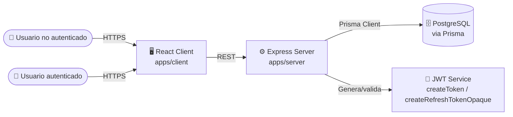
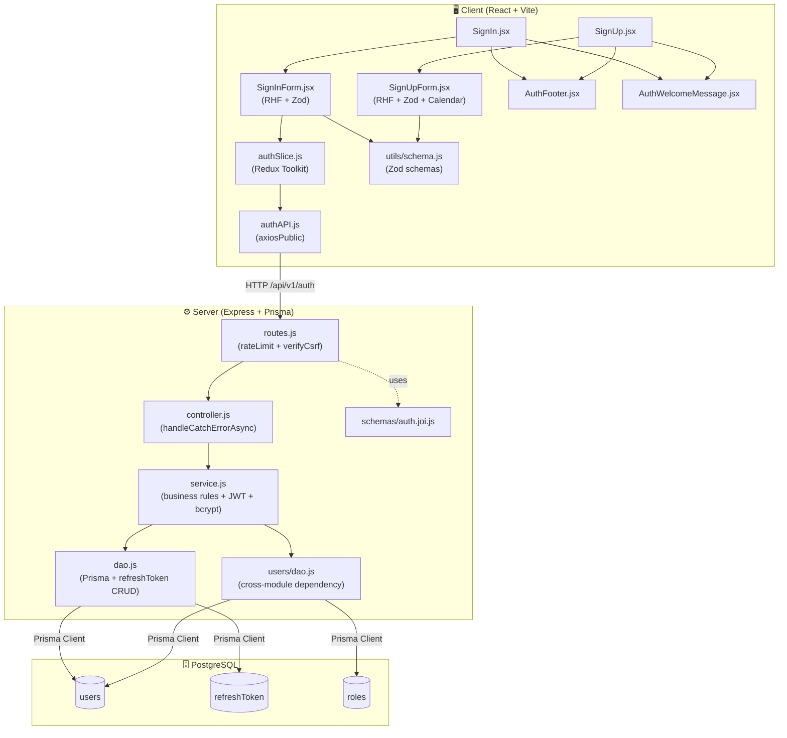
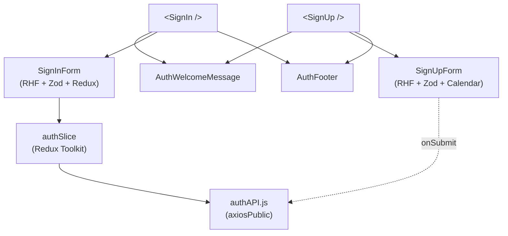
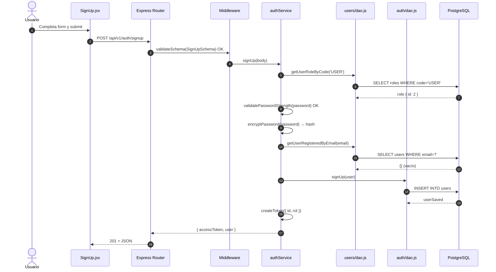
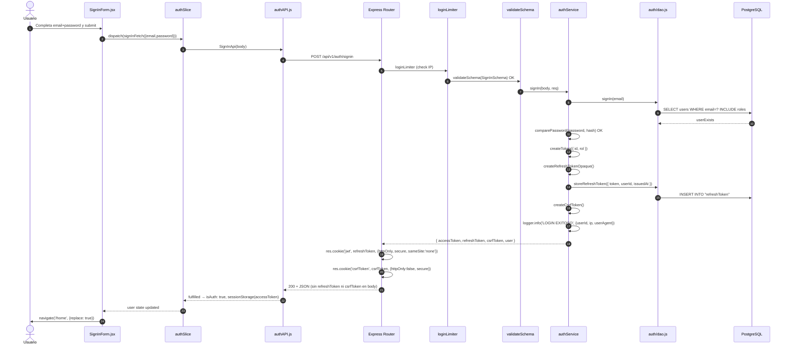
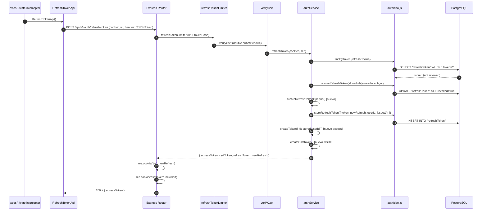
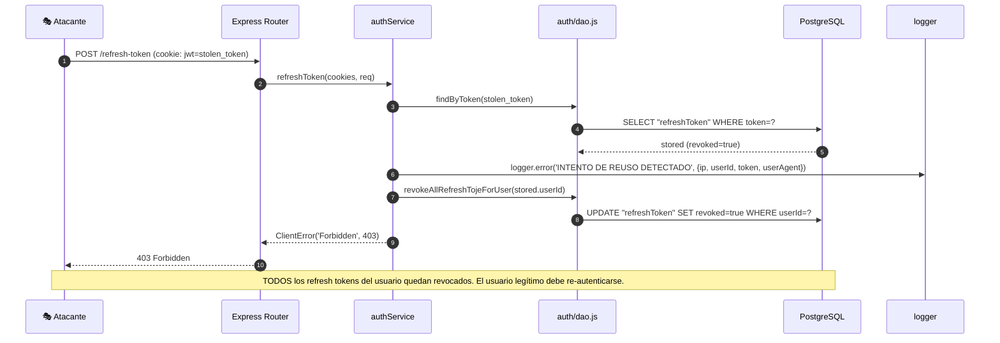
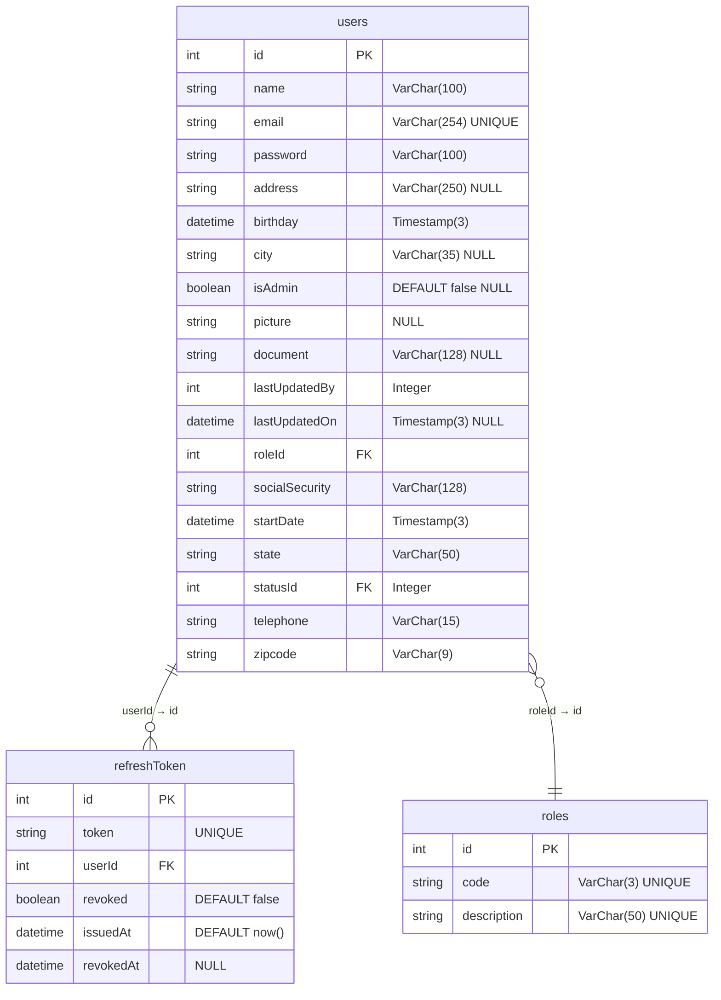
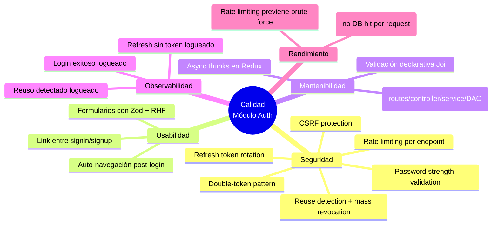

# Módulo: Auth (Server + Client)

> Documentación técnica integral del módulo **Auth** siguiendo un enfoque híbrido **arc42 / C4 Model / IEEE 1016**.
> Cubre tanto el backend (`apps/server/src/modules/auth/`) como el frontend (`apps/client/src/modules/auth/`).
>
> **Audiencia:** Arquitectos de software, Tech Leads, desarrolladores backend/frontend, revisores de código, auditores de seguridad y QA.

---

## Tabla de Contenidos

1. [Metadatos del Documento e Historial de Revisiones](#1-metadatos-del-documento-e-historial-de-revisiones)
2. [Introducción y Objetivos](#2-introducción-y-objetivos)
3. [Contexto y Alcance](#3-contexto-y-alcance)
4. [Restricciones](#4-restricciones)
5. [Stack Tecnológico](#5-stack-tecnológico)
6. [Arquitectura del Módulo (Overview)](#6-arquitectura-del-módulo-overview)
7. [Vista de Building Blocks — Server](#7-vista-de-building-blocks--server)
8. [Vista de Building Blocks — Client](#8-vista-de-building-blocks--client)
9. [Vista de Runtime y Flujo de Datos](#9-vista-de-runtime-y-flujo-de-datos)
10. [Modelo de Datos](#10-modelo-de-datos)
11. [Contratos de API](#11-contratos-de-api)
12. [Reglas de Validación y Esquemas](#12-reglas-de-validación-y-esquemas)
13. [Seguridad y Autorización](#13-seguridad-y-autorización)
14. [Manejo de Errores](#14-manejo-de-errores)
15. [Conceptos Transversales (Cross-Cutting)](#15-conceptos-transversales-cross-cutting)
16. [Requisitos de Calidad](#16-requisitos-de-calidad)
17. [Decisiones de Diseño (ADRs)](#17-decisiones-de-diseño-adrs)
18. [Riesgos y Deuda Técnica](#18-riesgos-y-deuda-técnica)
19. [Glosario](#19-glosario)
20. [Apéndices](#20-apéndices)

---

## 1. Metadatos del Documento e Historial de Revisiones

| Campo | Valor |
| ---------------- | ------------------------------------------------ |
| **Módulo** | `auth` |
| **Estado** | Released / Implementado |
| **Versión** | `1.0.0` |
| **Owner** | Backend Guild — Express Track |
| **Path Server** | `apps/server/src/modules/auth/` |
| **Path Client** | `apps/client/src/modules/auth/` |
| **Base URL API** | `/api/v1/auth` |
| **Estándar** | arc42 + C4 (L1/L2) + IEEE 1016 |
| **Audiencia** | Engineers, Architects, QA, Security Reviewers |

### Historial de Revisiones

| Versión | Fecha | Autor | Cambios |
| ------- | ----------- | ------------ | -------------------------------------------------------------------------------------------------- |
| 1.0.0 | 2026-06-11 | Docs Bot | Creación inicial del documento integral (server + client) siguiendo arc42/C4/IEEE 1016. |

---

## 2. Introducción y Objetivos

### 2.1 Propósito

El módulo **Auth** gestiona la autenticación del sistema: registro de usuarios, inicio de sesión, renovación de tokens y cierre de sesión. Implementa un patrón de **double-token (access + refresh)** con rotación de refresh tokens, protección CSRF, rate limiting específico y cookies HTTP-only seguras.

Funcionalidades principales:

- **Sign Up**: Registro de nuevos usuarios con validación de fuerza de contraseña y verificación de email duplicado.
- **Sign In**: Autenticación con email/password, emisión de access token (JWT) + refresh token opaco + CSRF token.
- **Session**: Recuperación de datos de sesión del usuario autenticado.
- **Refresh Token**: Rotación de refresh token con detección de reuso y revocación masiva.
- **Logout**: Revocación del refresh token y limpieza de cookies.
- **Change Password** y **Forgot Password**: Definidos en esquemas y rate limiters pero comentados (no implementados aún).

### 2.2 Alcance Funcional

| ID | Función | Actor | Cubre |
| ------ | ---------------------------------------------------------------- | --------- | ----------------------------------------------------------------------------------------- |
| F-001 | Registrar nuevo usuario | Público | POST `/api/v1/auth/signup` con validación Joi y fuerza de contraseña |
| F-002 | Iniciar sesión | Público | POST `/api/v1/auth/signin` con rate limiting, emisión de access+refresh+CSRF tokens |
| F-003 | Obtener sesión actual | Autenticado | GET `/api/v1/auth/session` con `verifyToken` |
| F-004 | Renovar access token | Autenticado | POST `/api/v1/auth/refresh-token` con rotación de refresh token y CSRF verification |
| F-005 | Cerrar sesión | Autenticado | Revocación de refresh token y limpieza de cookies |
| F-006 | Cambiar contraseña | Autenticado | (Comentado) PATCH con rate limiting y validación |
| F-007 | Recuperar contraseña | Público | (Comentado) POST con rate limiting |

### 2.3 Objetivos de Calidad

| ID | Prioridad | Objetivo |
| ----- | --------- | --------------------------------------------------------------------------------------- |
| Q-001 | Alta | **Seguridad:** Rate limiting por IP en login (5/15min) y refresh (10/15min). CSRF protection en refresh. |
| Q-002 | Alta | **Rotación de tokens:** Refresh token se rota en cada uso; detección de reuso revoca todos los tokens del usuario. |
| Q-003 | Alta | **Cookies seguras:** Refresh token en HTTP-only, Secure, SameSite=None. CSRF token legible por JS para header. |
| Q-004 | Alta | **Fuerza de contraseña:** Validación server-side con `validatePasswordStrength`. |
| Q-005 | Media | **Trazabilidad:** Logging de login exitoso, intento de refresh sin token, y detección de reuso. |
| Q-006 | Media | **UX reactiva:** Redux slice con `signInFetch` async thunk y auto-navegación post-login. |
| Q-007 | Baja | **Internacionalización:** Textos UI por `react-i18next`; mensajes de validación por Zod i18n map. |

### 2.4 Stakeholders

| Rol | Interés |
| ------------------ | -------------------------------------------------------------------------------- |
| Product Owner | Flujo signup/signin/refresh funcional y seguro. |
| Backend Engineer | Mantenimiento de routes/controller/service/DAO + JWT + rate limiters. |
| Frontend Engineer | Mantenimiento de pages/components/slice/API. |
| Security Reviewer | CSRF, rate limiting, rotación de tokens, cookie security, password strength. |
| QA | Pruebas de integración, escenarios de error, brute force, token reuse. |
| DevOps | Configuración de cookies (Secure flag por entorno), health-check. |

---

## 3. Contexto y Alcance

### 3.1 Diagrama de Contexto (C4 Nivel 1)



### 3.2 Dentro del Alcance (In-Scope)

- Endpoints REST `/api/v1/auth/*` con signup, signin, session, refresh-token.
- Flujo de doble token (JWT access + opaco refresh) con rotación.
- Protección CSRF en refresh-token endpoint.
- Rate limiting específico por endpoint (login, refresh, change-password, forgot-password).
- Registro de usuario con validación de email duplicado y fuerza de contraseña.
- Client-side: formularios de signin/signup con Zod validation + RHF.
- Client-side: Redux slice para estado de autenticación y refresh automático.
- Cookies HTTP-only para refresh token y CSRF token accesible por JS.

### 3.3 Fuera del Alcance (Out-of-Scope)

- OAuth / Social login (Google, GitHub, etc.).
- Multi-factor authentication (MFA/2FA).
- Email verification post-signup.
- Password reset flow (definido pero no implementado).
- Change password flow (definido pero no implementado).
- JWT blacklist (se usa revocación de refresh tokens en su lugar).
- Session management en DB separada (se usa tabla `refreshToken`).

---

## 4. Restricciones

| ID | Tipo | Restricción |
| ----- | ------------------- | ---------------------------------------------------------------------------------------------------------- |
| C-001 | Tecnológica | Backend debe usar Express + Prisma + PostgreSQL (ver `apps/server/AGENTS.md`). |
| C-002 | Tecnológica | Frontend debe usar React 18 + Vite + Redux Toolkit (ver `apps/client/AGENTS.md`). |
| C-003 | Tecnológica | Todos los endpoints REST cuelgan del prefijo `/api/v1`. |
| C-004 | Seguridad | Refresh token almacenado en cookie HTTP-only, Secure, SameSite=None. |
| C-005 | Seguridad | CSRF token requerido en header `CSRF-Token` para refresh-token endpoint. |
| C-006 | Seguridad | Rate limiting: login 5/15min, refresh 10/15min, change-password 3/1h, forgot-password 3/1h. |
| C-007 | Validación | `email` formato válido; `password` min 6, max 16 chars; `firstName/lastName` min 4, max 50. |
| C-008 | Seguridad | `verifyToken` NO se aplica globalmente en auth router (solo en `/session`). Signup y signin son públicos. |
| C-009 | Convencional | Convención de commits: Conventional Commits (Husky). |
| C-010 | Convencional | Path alias en cliente: `@/ → src/`. |

---

## 5. Stack Tecnológico

| Capa | Tecnología | Versión / Notas | Justificación |
| --------------------- | ------------------------------------- | ---------------------------------------- | ---------------------------------------------------------------------------- |
| **Server runtime** | Node.js | LTS (>= 18) | Compatibilidad con Prisma y Express. |
| **Server framework** | Express.js | 4.x / 5.x | Estándar de facto, simple, ecosistema maduro. |
| **Server ORM** | Prisma | Cliente Prisma | Type-safety; acceso a `users`, `refreshToken`, `roles`. |
| **Server DB** | PostgreSQL | Tipos `@db.VarChar(N)`, `@db.Timestamp(3)`, `@db.Integer` | Tipado estricto. |
| **Server validación** | Joi | Esquemas en `auth.joi.js` | Validación declarativa del payload. |
| **Server auth** | JWT + Refresh Token Opaco | `createToken` + `createRefreshTokenOpaque` | Access token stateless; refresh token opaco para revocación. |
| **Server rate limit** | express-rate-limit | `loginLimiter`, `refreshTokenLimiter`, etc. | Protección contra brute force. |
| **Server CSRF** | Custom middleware | `verifyCsrf` | Double-submit cookie pattern. |
| **Server hashing** | bcrypt | `encryptPassword`, `comparePassword` | Hashing seguro de contraseñas. |
| **Server logging** | Winston (logger) | `logger.info`, `logger.warn`, `logger.error` | Observabilidad de eventos de autenticación. |
| **Client framework** | React | 18.x | Hooks, concurrent rendering. |
| **Client bundler** | Vite | 5.x+ | HMR rápido, ESM nativo. |
| **Client state** | Redux Toolkit | `createSlice` + `createAsyncThunk` | Estado global de auth, side effects. |
| **Client HTTP** | Axios (public) | `axiosPublic` | Sin interceptor de refresh (evita loop). |
| **Client forms** | react-hook-form + Zod | `@hookform/resolvers/zod` | Validación tipada. |
| **Client UI** | shadcn/ui + Radix + Tailwind CSS | Form, Input, Button, Calendar, Popover | Componentes accesibles. |
| **Client cookies** | js-cookie | `Cookies.get('csrfToken')` | Lectura del CSRF token para header. |
| **Client i18n** | react-i18next | `useTranslation()` | Traducciones externas. |

---

## 6. Arquitectura del Módulo (Overview)

### 6.1 Estructura de Archivos

```text
project-one/
├── apps/
│   ├── server/
│   │   └── src/modules/auth/
│   │       ├── routes.js           # Express router + rate limiters + CSRF
│   │       ├── controller.js       # 5 handlers (signUp, signIn, session, refreshToken, logOut)
│   │       ├── service.js          # Lógica de negocio + JWT + bcrypt + password strength
│   │       ├── dao.js              # Acceso a datos (Prisma + refreshToken CRUD)
│   │       └── schemas/
│   │           └── auth.joi.js     # Joi: SignIn, SignUp
│   └── client/
│       └── src/modules/auth/
│           ├── pages/
│           │   ├── SignIn.jsx      # Página de login
│           │   └── SignUp.jsx      # Página de registro
│           ├── api/
│           │   └── authAPI.js      # Funciones API (SignIn, SignUp, RefreshToken)
│           ├── components/
│           │   ├── SignInForm.jsx   # Formulario login (RHF + Zod)
│           │   ├── SignUpForm.jsx   # Formulario registro (RHF + Zod + Calendar)
│           │   ├── AuthFooter.jsx   # Footer con link entre signin/signup
│           │   ├── AuthWelcomeMessage.jsx # Mensaje de bienvenida
│           │   └── index.js         # Barrel export
│           ├── slice/
│           │   └── authSlice.js     # Redux Toolkit slice (auth state + async thunks)
│           └── utils/
│               └── schema.js        # Zod signInSchema + signUpSchema
└── docs/
    └── modules/
        └── auth.md                  # Este documento
```

### 6.2 Diagrama de Contenedores (C4 Nivel 2)



---

## 7. Vista de Building Blocks — Server

### 7.1 Responsabilidades por Capa

| Capa | Archivo | Responsabilidad |
| ------------- | ---------------------- | --------------------------------------------------------------------------------------------------- |
| **Rutas** | `routes.js` | Definir endpoints, encadenar middleware (rate limiting + validación + CSRF). NO aplica `verifyToken` globalmente. |
| **Controlador** | `controller.js` | Recibir request HTTP, extraer datos, delegar al servicio, gestionar cookies, formatear respuesta. |
| **Servicio** | `service.js` | Reglas de negocio: fuerza de contraseña, verificación de email duplicado, emisión de tokens, rotación de refresh token, detección de reuso, logging de seguridad. |
| **DAO** | `dao.js` | Persistencia: `createRow` para users, `prisma.refreshToken.create/findUnique/update/updateMany`. |
| **Esquemas** | `schemas/auth.joi.js` | Validación declarativa del shape del payload. |
| **Cross-module** | `users/dao.js` | `getUserRegisteredByEmail`, `getUserRoleByCode` — dependencia con módulo Users. |

### 7.2 Rutas y Cadena de Middleware

| Método | Path | Middleware Chain | Handler |
| ------ | --------------------------------- | ------------------------------------------------------------------------------------------------------------- | ---------------------- |
| POST | `/signup` | `validateSchema(SignUpSchema)` | `signUp` |
| POST | `/signin` | `loginLimiter` → `validateSchema(SignInSchema)` | `signIn` |
| GET | `/session` | `verifyToken` | `session` |
| POST | `/refresh-token` | `refreshTokenLimiter` → `verifyCsrf` | `refreshToken` |
| POST | `/change-password` | (Comentado) `verifyToken` → `changePasswordLimiter` → `validateSchema(ChangePasswordSchema)` | `changePassword` |
| POST | `/forgot-password` | (Comentado) `forgotPasswordLimiter` → `validateSchema(ForgotPasswordSchema)` | `forgotPassword` |

> **Nota:** El router de auth NO aplica `verifyToken` globalmente — solo `/session` requiere autenticación. Signup y signin son endpoints públicos. Refresh-token usa `verifyCsrf` (no `verifyToken`).

### 7.3 Controladores (Funciones Exportadas)

| Función | Firma | Comportamiento | Status Code |
| -------------------- | ---------------------------------------------------------------------------------------------- | ------------------------------------------------------------------------------------------------------------- | ----------- |
| `signUp` | `(req, res) → Promise<void>` <br/>Lee `req.body` | Llama a `authService.signUp(body)`, responde con `{ accessToken, user }`. | `201` |
| `signIn` | `(req, res) → Promise<void>` <br/>Lee `req.body` | Llama a `authService.signIn(body, req)`, setea cookies `jwt` (HTTP-only) y `csrfToken`, elimina tokens del response body. | `200` |
| `session` | `(req, res) → Promise<void>` <br/>Lee `req.userId` | Llama a `authService.session(userId)`, responde con datos del usuario. | `200` |
| `refreshToken` | `(req, res) → Promise<void>` <br/>Lee `req.cookies` | Llama a `authService.refreshToken(cookies, req)`, setea nuevas cookies `jwt` y `csrfToken`, responde con `{ accessToken }`. | `200` |
| `logOut` | `(req, res) → Promise<void>` <br/>Lee `req.cookies` | Llama a `authService.logout(cookies)`, limpia cookie `jwt`, responde con mensaje. | `200` |
| `changePassword` | `(req, res) → Promise<void>` | Stub vacío — no implementado. | n/a |

> **Patrón:** Todas las funciones usan `handleCatchErrorAsync` (decorador que captura errores y los delega a la capa central de errores) y `globalResponse` (formateador estándar de respuesta JSON). El controlador gestiona las cookies de seguridad.

### 7.4 Servicios (Lógica de Negocio)

| Función | Firma | Reglas Aplicadas |
| ------------------- | -------------------------------------------------------------------- | ------------------------------------------------------------------------------------------------------------------------------------------------- |
| `signUp` | `(user) → Promise<{accessToken, user}>` | 1) Obtiene rol `USER` vía `getUserRoleByCode`. 2) Valida fuerza de contraseña (`validatePasswordStrength`). 3) Encripta password (`encryptPassword`). 4) Verifica email no registrado (`getUserRegisteredByEmail`). 5) Crea usuario vía DAO. 6) Genera access token JWT. |
| `signIn` | `(user, req) → Promise<{accessToken, refreshToken, csrfToken, user}>` | 1) Busca usuario por email con `roles` incluido. 2) Compara password con bcrypt. 3) Genera access token JWT. 4) Genera refresh token opaco. 5) Almacena refresh token en DB. 6) Genera CSRF token. 7) Log de login exitoso (IP + user-agent). |
| `session` | `(id) → Promise<{user}>` | Busca usuario por ID con `roles` incluido. Si no existe, lanza `ClientError(400)`. |
| `refreshToken` | `(cookies, req) → Promise<{accessToken, csrfToken, refreshToken}>` | 1) Verifica cookie `jwt` presente. 2) Busca token en DB. 3) Si no existe o está revocado → **detección de reuso**: revoca TODOS los tokens del usuario y lanza 403. 4) Si válido: revoca token actual (rotación), genera nuevo refresh token, genera nuevo access token, genera nuevo CSRF token. 5) Log de seguridad. |
| `logout` | `(cookies) → Promise<boolean>` | Busca refresh token en cookie, lo revoca en DB si existe y no está revocado. |

### 7.5 DAO (Acceso a Datos)

| Función | Estrategia | Prisma API |
| -------------------- | ------------------------------------------------------------------------------------------------------------- | ------------------------------------------------------------------------------------------------------------------------------------------------------------- |
| `signUp` | Inserción de usuario. | `createRow('users', user)` (helper genérico) |
| `signIn` | Búsqueda por email con roles. | `getOneRow({ tableName: 'users', where: { email }, include: { roles: true } })` |
| `session` | Búsqueda por ID con roles. | `getOneRow({ tableName: 'users', where: { id }, include: { roles: true } })` |
| `getUserById` | Búsqueda por ID con roles. | `getOneRow({ tableName: 'users', where: { id }, include: { roles: true } })` |
| `saveRefreshToken` | Actualización (legacy, ya no usada). | `updateRow('users', { refreshToken }, { id })` |
| `storeRefreshToken` | Inserción de refresh token en tabla dedicada. | `prisma.refreshToken.create({ data: { token, userId, issuedAt } })` |
| `findByToken` | Búsqueda de refresh token por valor. | `prisma.refreshToken.findUnique({ where: { token } })` |
| `revokeRefreshToken` | Marca un token como revocado. | `prisma.refreshToken.update({ where: { id }, data: { revoked: true, revokedAt: new Date() } })` |
| `revokeAllRefreshTojeForUser` | Revoca todos los tokens de un usuario (detección de reuso). | `prisma.refreshToken.updateMany({ where: { userId }, data: { revoked: true, revokedAt: new Date() } })` |

> **Nota:** `revokeAllRefreshTojeForUser` tiene un typo en el nombre ("Toje" en lugar de "Token") — ver §18 R-001.

### 7.6 Utilidades Compartidas (Server)

| Utilidad | Ubicación | Uso en este módulo |
| ------------------------------------- | ---------------------------------------- | ------------------------------------------------------------------- |
| `globalResponse(res, status, data)` | `utils/responses&Errors/globalResponse.js` | Estandariza la respuesta JSON. |
| `handleCatchErrorAsync(fn)` | `utils/responses&Errors/handleCatchErrorAsync.js` | Decorador async que captura y propaga errores. |
| `createToken(payload)` | `utils/jwt/createToken.js` | Genera access token JWT. |
| `createRefreshTokenOpaque()` | `utils/jwt/createToken.js` | Genera refresh token opaco (no JWT). |
| `createCsrfToken()` | `utils/csrftoken/csrfToken.js` | Genera CSRF token. |
| `encryptPassword(pwd)` | `utils/bcrypt/encrypt.js` | Hashing bcrypt. |
| `comparePassword(pwd, hash)` | `utils/bcrypt/encrypt.js` | Comparación bcrypt. |
| `validatePasswordStrength(pwd)` | `utils/bcrypt/encrypt.js` | Validación de fuerza de contraseña. |
| `loginLimiter` | `middleware/rateLimit.js` | 5 intentos fallidos / 15 min por IP. |
| `refreshTokenLimiter` | `middleware/rateLimit.js` | 10 intentos / 15 min por IP+token hash. |
| `changePasswordLimiter` | `middleware/rateLimit.js` | 3 intentos / 1h por IP. |
| `forgotPasswordLimiter` | `middleware/rateLimit.js` | 3 intentos / 1h por IP. |
| `verifyCsrf` | `middleware/verifyCsrf.js` | Double-submit cookie pattern para CSRF. |
| `ROLESCODES.USER` | `utils/constants/enums.js` | Constante para rol por defecto. |
| `logger` | `logger/index.js` | Winston logger para eventos de seguridad. |
| `getUserRegisteredByEmail` | `modules/users/dao.js` | Cross-module: verificar email duplicado. |
| `getUserRoleByCode` | `modules/users/dao.js` | Cross-module: obtener ID de rol por código. |

---

## 8. Vista de Building Blocks — Client

### 8.1 Páginas — `SignIn.jsx` / `SignUp.jsx`

| Página | Componentes | Comportamiento |
| --------------------- | ------------------------------------------------------------------------------------------------ | -------------------------------------------------------- |
| `SignIn.jsx` | `AuthWelcomeMessage`, `SignInForm`, `AuthFooter` | Página de login. Footer con link a signUp. |
| `SignUp.jsx` | `AuthWelcomeMessage`, `SignUpForm`, `AuthFooter` | Página de registro. Footer con link a signIn. |

### 8.2 Diagrama del Árbol de Componentes (Client)



### 8.3 Especificación de Componentes

#### `SignInForm.jsx`

| Aspecto | Detalle |
| --------------------- | ------------------------------------------------------------------------------------------------ |
| **Hooks** | `useForm({ resolver: zodResolver(signInSchema) })`, `useDispatch`, `useSelector`, `useNavigate`, `useTranslation`, `useRef` |
| **State** | Lee `{ user, isError, isLoading }` de `state.auth` |
| **On Submit** | `dispatch(signInFetch({ email, password }))` |
| **Navegación** | `useEffect` — si `user` existe y `!isError`, navega a `/home` con `replace: true`. Usa `useRef` para evitar doble navegación. |
| **Campos** | `email` (Input type=email), `password` (Input type=password) |
| **Extras** | Botón "Remind me", Link "Forgot password" (sin funcionalidad). Botón debug `checkState` (debe eliminarse). |

#### `SignUpForm.jsx`

| Aspecto | Detalle |
| --------------------- | ------------------------------------------------------------------------------------------------ |
| **Hooks** | `useForm({ resolver: zodResolver(signUpSchema) })`, `useTranslation` |
| **On Submit** | `console.log(data)` — **NO conectado a API** (WIP). |
| **Campos** | `fname` (firstName), `lname` (lastName), `email`, `password`, `rpassword` (confirmación), `dob` (Calendar popover) |
| **Estado** | Sin dispatch, sin navegación. |

> **Gap:** SignUpForm no está conectado al flujo de registro real — solo hace `console.log`. Ver §18 R-002.

#### `AuthFooter.jsx`

| Prop | Tipo | Descripción |
| --------- | --------------------- | -------------------------------------------------------------------- |
| `link` | `string` (required) | Ruta de navegación (`/signUp` o `/signIn`). |
| `linkMessage` | `string` (required) | Clave i18n del texto del link. |
| `authMessage` | `string` (required) | Clave i18n del mensaje contextual. |

#### `AuthWelcomeMessage.jsx`

| Prop | Tipo | Descripción |
| --------- | --------------------- | -------------------------------------------------------------------- |
| `field_sign_message` | `string` (required) | Clave i18n del mensaje de bienvenida. |

### 8.4 API Client — `authAPI.js`

```js
// Usa axiosPublic (sin interceptor de refresh para evitar loops)
import { axiosPublic } from '@/config/axios';
import Cookies from 'js-cookie';
```

| Función | Verbo | Path | Notas |
| --------------------------------- | ----- | --------------------------------- | ------------------------------------------------ |
| `SignInApi(body)` | POST | `/auth/signin` | Body: `{ email, password }` |
| `SignUpApi(body)` | POST | `/auth/signup` | Body: `{ firstName, lastName, birthday, email, password }` |
| `RefreshTokenApi()` | POST | `/auth/refresh-token` | Lee `csrfToken` de cookie, envía en header `CSRF-Token`. Body vacío, `withCredentials: true`. |

> **Estrategia:** Auth API usa `axiosPublic` (sin auth interceptor) para evitar loops infinitos. El refresh token se envía automáticamente como cookie por `withCredentials`.

### 8.5 Redux Slice — `authSlice.js`

| Aspecto | Detalle |
| --------------------- | ------------------------------------------------------------------------------------------------ |
| **Name** | `auth` |
| **Initial State** | `{ isLoading: false, user: null, isError: false, isAuth: false, errorMessage: '' }` |

**Async Thunks:**

| Thunk | Action Type | Comportamiento |
| ----- | ----------- | -------------- |
| `signInFetch` | `auth/signIn` | Dispatch `SignInApi(args)`, on fulfilled → `isAuth: true`, `user: payload`, guarda `accessToken` en `sessionStorage`. |
| `refreshTokenFecth` | `auth/refresh-token` | Dispatch `RefreshTokenApi()`, on fulfilled → actualiza `user.data.accessToken`, guarda nuevo token en `sessionStorage`. |

> **Typo:** `refreshTokenFecth` → debería ser `refreshTokenFetch`. Ver §18 R-003.

**Reducers:**

| Action | Comportamiento |
| ------ | -------------- |
| `updateAuthData` | Actualiza `state.user` con payload. |
| `logout` | Resetea todo el estado: `user: null`, `isAuth: false`, `isError: false`, `errorMessage: ''`. |

### 8.6 Utilidades del Cliente

| Función / Constante | Archivo | Descripción |
| ----------------------------------------- | -------------------- | -------------------------------------------------------------------------------------------------------------------------------------- |
| `signInSchema` | `utils/schema.js` | Zod: `email` (string, email), `password` (string, min 6, max 16). Mensajes i18n. |
| `signUpSchema` | `utils/schema.js` | Zod: `email` (string, email), `password` (string, min 6, max 16). **Incompleto**: falta `firstName`, `lastName`, `birthday` (ver §18 R-004). |

---

## 9. Vista de Runtime y Flujo de Datos

### 9.1 Secuencia — Sign Up (Happy Path)



### 9.2 Secuencia — Sign In (Happy Path)



### 9.3 Secuencia — Refresh Token (Happy Path con rotación)



### 9.4 Secuencia — Detección de Reuso de Refresh Token



### 9.5 Escenarios de Error (Tabla)

| Escenario | Origen | Manejo Server | Manejo Client |
| ---------------------------------------- | ----------------------------------------------------- | ------------------------------------------------------------------ | ---------------------------------------------------------- |
| Email ya registrado | `service.signUp` | `ClientError('Este correo ya esta registrado.', 400)` | `signInFetch.rejected` → mensaje en state |
| Contraseña demasiado débil | `service.signUp` | `ClientError('La contraseña es demasiado débil...', 400)` | `signInFetch.rejected` → mensaje en state |
| Email no registrado | `service.signIn` | `ClientError('Este correo no esta registrado.', 400)` | `signInFetch.rejected` → `isError: true` |
| Contraseña inválida | `service.signIn` | `ClientError('Contraseña invalida.', 400)` | `signInFetch.rejected` → `isError: true` |
| Rate limit excedido (login) | `loginLimiter` | 429 Too Many Requests | `signInFetch.rejected` → error message |
| Refresh token no encontrado | Cookie ausente | `ClientError('Refresh token no encontrado', 400)` | `refreshTokenFecth.rejected` → `isAuth: false` |
| Refresh token reuso detectado | Token revocado en DB | `ClientError('Forbidden', 403)` + revocación masiva | `refreshTokenFecth.rejected` → logout |
| CSRF token inválido | `verifyCsrf` middleware | 403 Forbidden | Error de red → logout |
| Validación Joi fallida | `validateSchema` | 400 con detalle de campos | Error genérico del formulario |
| Usuario no encontrado (session) | `service.session` | `ClientError('No se ha encontrado al usuario', 400)` | `unwrap()` rechaza |

---

## 10. Modelo de Datos

### 10.1 Diagrama Entidad-Relación (Mermaid)



### 10.2 Tabla `users` (parcial — campos relevantes para Auth)

| Columna | Tipo (Prisma) | Restricciones | Notas |
| -------------- | --------------------- | ------------------------------------------ | -------------------------------------------------------------------------------------- |
| `id` | `Int` | PK, autoincrement | |
| `name` | `String` | `VarChar(100)` | No se usa directamente en Auth pero se retorna en session. |
| `email` | `String` | `VarChar(254)`, UNIQUE | Verificado como duplicado en signUp. |
| `password` | `String` | `VarChar(100)` | Bcrypt hash (60 chars). |
| `birthday` | `DateTime` | `Timestamp(3)` | Requerido en Joi SignUp. |
| `roleId` | `Int` | FK → `roles.id` | Asignado automáticamente como `USER` en signUp. |
| `statusId` | `Int` | FK → `userStatus.id` | No gestionado por Auth directamente. |

### 10.3 Tabla `refreshToken`

| Columna | Tipo (Prisma) | Restricciones | Notas |
| -------------- | --------------------- | ------------------------------------------ | -------------------------------------------------------------------------------------- |
| `id` | `Int` | PK, autoincrement | |
| `token` | `String` | UNIQUE | Token opaco generado por `createRefreshTokenOpaque()`. |
| `userId` | `Int` | FK → `users.id` | |
| `revoked` | `Boolean` | DEFAULT `false` | `true` cuando se rota o revoca. |
| `issuedAt` | `DateTime` | DEFAULT `now()` | |
| `revokedAt` | `DateTime?` | NULL | Timestamp de revocación. |

### 10.4 Tabla `roles` (catálogo)

| Columna | Tipo (Prisma) | Restricciones | Notas |
| ------------- | ------------- | -------------------------- | ------------------------------------------------------------ |
| `id` | `Int` | PK, autoincrement | |
| `code` | `String` | `VarChar(3)`, UNIQUE | Ej: `C02` (USER). |
| `description` | `String` | `VarChar(50)`, UNIQUE | Ej: "USER", "ADMIN", "MANAGER". |

---

## 11. Contratos de API

> **Base URL:** `/api/v1/auth`
> **Auth:** No se requiere JWT para signup/signin. `verifyToken` solo en `/session`. CSRF en `/refresh-token`.
> **Content-Type:** `application/json`.

### 11.1 `POST /api/v1/auth/signup` — Registrar usuario

| Aspecto | Detalle |
| --------------- | --------------------------------------------------------------------------------------------- |
| **Auth** | Ninguna (público) |
| **Validación** | `validateSchema(SignUpSchema)` |
| **Body** | `application/json` |

**Request Body:**

```json
{
  "firstName": "María",
  "lastName": "Pérez",
  "birthday": "1995-06-15",
  "email": "maria@example.com",
  "password": "****"
}
```

**Response 201:**

```json
{
  "error": false,
  "statusCode": 201,
  "message": "Some success message",
  "data": {
    "accessToken": "eyJhbGciOi...",
    "user": {
      "id": 42,
      "firstName": "María",
      "picture": null,
      "role": 2
    }
  }
}
```

**Errores:** `400` (email duplicado, contraseña débil, Joi validation), `500` (DB).

---

### 11.2 `POST /api/v1/auth/signin` — Iniciar sesión

| Aspecto | Detalle |
| --------------- | --------------------------------------------------------------------------------------------- |
| **Auth** | Ninguna (público) |
| **Rate Limit** | `loginLimiter` — 5 intentos fallidos / 15 min por IP |
| **Validación** | `validateSchema(SignInSchema)` |
| **Cookies Set** | `jwt` (HTTP-only, Secure, SameSite=None, maxAge=24h), `csrfToken` (HTTP-only=false, Secure) |

**Request Body:**

```json
{
  "email": "maria@example.com",
  "password": "****"
}
```

**Response 200:**

```json
{
  "error": false,
  "statusCode": 200,
  "message": "Some success message",
  "data": {
    "accessToken": "eyJhbGciOi...",
    "user": {
      "id": 42,
      "firstName": "María",
      "picture": null,
      "roleName": "USER",
      "roleId": 2
    }
  }
}
```

> **Nota:** `refreshToken` y `csrfToken` se eliminan del body antes de enviar la respuesta. Solo se transmiten como cookies.

**Errores:** `400` (email no registrado, contraseña inválida), `429` (rate limit).

---

### 11.3 `GET /api/v1/auth/session` — Obtener sesión

| Aspecto | Detalle |
| --------------- | --------------------------------------------------------------------------------------------- |
| **Auth** | `verifyToken` |
| **Headers** | `Authorization: Bearer <accessToken>` |

**Response 200:**

```json
{
  "error": false,
  "statusCode": 200,
  "message": "Some success message",
  "data": {
    "user": {
      "name": "María Pérez",
      "picture": null,
      "role": { "id": 2, "code": "C02", "description": "USER" }
    }
  }
}
```

**Errores:** `400` (usuario no encontrado), `401` (token inválido).

---

### 11.4 `POST /api/v1/auth/refresh-token` — Renovar access token

| Aspecto | Detalle |
| --------------- | --------------------------------------------------------------------------------------------- |
| **Auth** | CSRF (no JWT) |
| **Rate Limit** | `refreshTokenLimiter` — 10 intentos / 15 min por IP+tokenHash |
| **CSRF** | `verifyCsrf` — header `CSRF-Token` debe coincidir con cookie `csrfToken` |
| **Cookies** | `jwt` (HTTP-only refresh token), `csrfToken` |
| **Cookies Set** | Nuevas cookies `jwt` y `csrfToken` (rotación) |

**Request:** `POST /api/v1/auth/refresh-token` con cookies y header CSRF.

**Response 200:**

```json
{
  "error": false,
  "statusCode": 200,
  "message": "Some success message",
  "data": {
    "accessToken": "eyJhbGciOiNew..."
  }
}
```

**Errores:** `400` (cookie `jwt` ausente), `403` (token revocado / reuso detectado → revocación masiva), `429` (rate limit).

---

### 11.5 Tabla Resumen de Validación por Endpoint

| Endpoint | Auth | Rate Limit | Validación de entrada |
| ------------------------------------- | ------------------------------------- | --------------------- | ---------------------------------------- |
| `POST /api/v1/auth/signup` | Ninguna | Ninguno | `SignUpSchema` (body) |
| `POST /api/v1/auth/signin` | Ninguna | `loginLimiter` (5/15min) | `SignInSchema` (body) |
| `GET /api/v1/auth/session` | `verifyToken` | Ninguno | (ninguna) |
| `POST /api/v1/auth/refresh-token` | `verifyCsrf` | `refreshTokenLimiter` (10/15min) | Cookie `jwt` + header `CSRF-Token` |

---

## 12. Reglas de Validación y Esquemas

### 12.1 Joi — `apps/server/src/modules/auth/schemas/auth.joi.js`

```js
// SignInSchema
Joi.object({
  email: Joi.string().email({ tlds: false }).required(),
  password: Joi.string().min(6).max(16).required(),
});

// SignUpSchema
Joi.object({
  firstName: Joi.string().min(4).max(50).required(),
  lastName: Joi.string().min(4).max(50).required(),
  birthday: Joi.date().required(),
  email: Joi.string().email({ tlds: false }).required(),
  password: Joi.string().min(6).max(16).required(),
});
```

### 12.2 Zod — `apps/client/src/modules/auth/utils/schema.js`

```js
// signInSchema
z.object({
  email: z.string({ required_error: '...' }).email({ message: '...' }),
  password: z.string({ required_error: '...' }).min(6, ...).max(16, ...),
});

// signUpSchema (INCOMPLETO)
z.object({
  email: z.string({ required_error: '...' }).email({ message: '...' }),
  password: z.string({ required_error: '...' }).min(6, ...).max(16, ...),
});
// Falta: firstName, lastName, birthday, confirmPassword
```

### 12.3 Alineación de Boundaries Joi ⇄ Zod ⇄ DB

| Campo | Joi (server) | Zod (client) | DB | Notas |
| ------------- | --------- | --------- | ------------ | ----------------------------------------------------------------------- |
| `email` | `email().required()` | `.email()` | `VarChar(254) UNIQUE` | ✅ Alineado. |
| `password` | `min(6).max(16).required()` | `min(6).max(16)` | `VarChar(100)` | ✅ Alineado. DB tiene más espacio para el hash. |
| `firstName` | `min(4).max(50).required()` | ❌ No en schema | `VarChar(100)` | **Inconsistencia** — Joi lo requiere, Zod no lo valida. |
| `lastName` | `min(4).max(50).required()` | ❌ No en schema | (parte de `name`) | **Inconsistencia** — Joi lo requiere, Zod no lo valida. |
| `birthday` | `date().required()` | ❌ No en schema | `Timestamp(3)` | **Inconsistencia** — Joi lo requiere, Zod no lo valida. |

> **Ver §18 R-004:** signUpSchema de Zod está incompleto.

---

## 13. Seguridad y Autorización

### 13.1 Autenticación

- **Mecanismo:** Double-token pattern — JWT access token (stateless, short-lived) + opaque refresh token (stored en DB, rotativo).
- **Access Token:** Generado por `createToken({ id, rol })`. Firmado con `JWT_SECRET`. Almacenado en `sessionStorage` del client.
- **Refresh Token:** Generado por `createRefreshTokenOpaque()` (string aleatorio opaco). Almacenado en cookie HTTP-only y en tabla `refreshToken` de DB.

### 13.2 CSRF Protection

- **Patrón:** Double-submit cookie.
- **Cookie:** `csrfToken` — legible por JavaScript (`httpOnly: false`) para incluir en headers.
- **Header:** `CSRF-Token` — verificado por `verifyCsrf` middleware en refresh-token endpoint.
- **Scope:** Solo aplicado en `/refresh-token` (el endpoint más sensible que no requiere JWT).

### 13.3 Rate Limiting

| Endpoint | Limiter | Window | Max | Key | Count failed only? |
| -------- | ------- | ------ | --- | ---- | ------------------- |
| `/signin` | `loginLimiter` | 15 min | 5 | IP | ✅ Yes |
| `/refresh-token` | `refreshTokenLimiter` | 15 min | 10 | IP + SHA256(token)[:16] | ❌ No |
| `/change-password` | `changePasswordLimiter` | 1 hour | 3 | IP | ✅ Yes |
| `/forgot-password` | `forgotPasswordLimiter` | 1 hour | 3 | IP | ❌ No |

### 13.4 Cookie Security

| Cookie | `httpOnly` | `secure` | `sameSite` | `maxAge` | Propósito |
| ------ | ---------- | -------- | ---------- | -------- | --------- |
| `jwt` | ✅ `true` | `true` | `none` | 24h | Refresh token opaco. |
| `csrfToken` | ❌ `false` | `true` | `none` | Session | CSRF token para header. |

> **Nota:** `secure: true` siempre está activo, incluso en localhost. Esto impide el uso en desarrollo sin HTTPS. Ver §18 R-005.

### 13.5 Refresh Token Rotation

1. Cada uso del refresh token genera uno nuevo y revoca el anterior.
2. Si se detecta reuso (token ya revocado), se revocan **todos** los tokens del usuario y se retorna 403.
3. Esto protege contra token theft: si un atacante roba un refresh token, el primer uso legítimo lo revoca, y el uso del atacante dispara la alarma y la revocación masiva.

### 13.6 OWASP Top 10 — Checklist Rápido

| Riesgo | Estado |
| ------------------------------------- | --------------------------------------------------------------------------------------- |
| A01 Broken Access Control | ✅ Rate limiting + CSRF + JWT verification. |
| A02 Cryptographic Failures | ✅ Bcrypt para passwords. Cookie Secure. |
| A03 Injection | ✅ Prisma parametriza queries. Joi/Zod validan input. |
| A04 Insecure Design | ✅ Double-token pattern con rotación. |
| A05 Security Misconfiguration | ⚠️ `secure: true` siempre activo (problema en dev). |
| A06 Vulnerable Components | Pendiente `npm audit`. |
| A07 Auth Failures | ✅ Rate limiting específico. Logging de eventos. |
| A08 Software & Data Integrity | ✅ Refresh token rotation previene reuso. |
| A09 Logging & Monitoring | ✅ Login exitoso, refresh sin token, reuso detectado — todos logueados. |
| A10 SSRF | No aplica (no se hace fetch externo). |

---

## 14. Manejo de Errores

### 14.1 Server

| Origen | Mecanismo | Respuesta al cliente |
| ------------------------------- | ------------------------------------------- | ------------------------------------------------- |
| Error async en handler | `handleCatchErrorAsync` → `next(err)` | Middleware central → JSON estándar |
| Email ya registrado | `ClientError('Este correo ya esta registrado.', 400)` | `400` con mensaje |
| Contraseña débil | `ClientError('La contraseña es demasiado débil...', 400)` | `400` con mensaje |
| Email no registrado | `ClientError('Este correo no esta registrado.', 400)` | `400` con mensaje |
| Contraseña inválida | `ClientError('Contraseña invalida.', 400)` | `400` con mensaje |
| Refresh token ausente | `ClientError('Refresh token no encontrado', 400)` | `400` con mensaje |
| Refresh token reuso | `ClientError('Forbidden', 403)` + revocación masiva | `403` |
| Rate limit excedido | express-rate-limit | `429` con mensaje |
| CSRF inválido | `verifyCsrf` | `403` |
| Validación Joi | `validateSchema` | `400` con detalle de campos |

### 14.2 Client

| Origen | Mecanismo | UX |
| ------------------------------ | ---------------------------------------------------------------------------------- | ------------------------------------------------------------------------------------------------- |
| Error en signIn | `signInFetch.rejected` | `isError: true`, `errorMessage` en state. No se muestra explícitamente en UI. |
| Error en refresh | `refreshTokenFecth.rejected` | `isAuth: false`, `isLoading: false`. La app redirige a login. |
| Validación Zod (form) | `zodResolver` → `formState.errors` | `FormMessage` por campo |
| 429 desde server | `signInFetch.rejected` | Mismo flujo que error genérico — no hay UX específica para rate limit. |

---

## 15. Conceptos Transversales (Cross-Cutting)

### 15.1 Token Storage

| Token | Client Storage | Server Storage | Propósito |
| ----- | -------------- | -------------- | --------- |
| Access Token (JWT) | `sessionStorage` | No (stateless) | Autenticación en headers `Authorization: Bearer <token>`. |
| Refresh Token (opaco) | Cookie `jwt` (HTTP-only) | Tabla `refreshToken` | Renovación de access token. |
| CSRF Token | Cookie `csrfToken` (legible) | No | Protección CSRF en refresh endpoint. |

### 15.2 Internacionalización (i18n)

- **Client:** `react-i18next` con `useTranslation()`. Claves usadas: `email`, `password`, `sign_in`, `sign_up`, `sign_up_button`, `welcome_back`, `sign_in_message`, `sign_up_message`, `dont_you_have_an_account`, `do_you_have_an_account`, `first_name`, `last_name`, `date_of_birth`, `forgot_password`, `remind_me`, `pick_date`, `sign_email_placeholder`, `sign_password_placeholder`, `sign_name_placeholder`, `sign_last_name_placeholder`, `sign_confirm_password_placeholder`, `check_state`.
- **Zod:** Mensajes localizados vía `getZodMessage('zod.auth.<campo>.<reason>')`.

### 15.3 Logging de Seguridad

- **Login exitoso:** `logger.info('LOGIN EXITOSO', { userId, email, ip, userAgent })`.
- **Refresh sin token:** `logger.warn('INTENTO DE REFRESH SIN TOKEN', { ip, userAgent, timestamp })`.
- **Reuso detectado:** `logger.error('INTENTO DE REUSO DE REFRESH TOKEN DETECTADO', { ip, userId, token[:10], revoked, revokedAt, userAgent, timestamp })`.

### 15.4 Cross-Module Dependencies

- **Auth → Users:** `getUserRegisteredByEmail` y `getUserRoleByCode` importados de `modules/users/dao.js`. Auth depende de Users para verificación de email y obtención de roles.
- **Auth → Roles:** Accede a la relación `users.roles` vía Prisma include.

### 15.5 Cambio de Contraseña (Futuro)

- `ChangePasswordSchema` y `changePasswordLimiter` están definidos pero comentados en `routes.js`.
- `changePassword` controller es un stub vacío.
- Requiere: validación de contraseña actual, nueva contraseña con fuerza, actualización en DB, revocación de tokens existentes.

---

## 16. Requisitos de Calidad

### 16.1 Árbol de Calidad



### 16.2 Gaps de Calidad Conocidos

| ID | Gap | Severidad |
| ----- | ------------------------------------------------------------------------- | --------- |
| Q-G01 | SignUpForm no conectado a API (solo console.log). | Alta |
| Q-G02 | signUpSchema de Zod incompleto (falta firstName, lastName, birthday). | Alta |
| Q-G03 | Botón debug `checkState` en producción. | Baja |
| Q-G04 | No hay UX específica para rate limit 429. | Media |
| Q-G05 | `secure: true` siempre activo impide desarrollo local sin HTTPS. | Media |
| Q-G06 | No hay test automatizado visible en el módulo. | Alta |
| Q-G07 | Change password y forgot password no implementados. | Media |

---

## 17. Decisiones de Diseño (ADRs)

### ADR-001 — Refresh Token Opaco (no JWT) con tabla dedicada

| Aspecto | Detalle |
| ----------- | -------------------------------------------------------------------------------------------------------------------------------- |
| **Estado** | Accepted |
| **Contexto**| Se podría usar JWT para refresh tokens (auto-contenido, sin DB hit). Sin embargo, la revocación de JWT es compleja sin una blacklist. |
| **Decisión**| Usar refresh tokens opacos (random strings) almacenados en tabla `refreshToken`. Cada token se puede revocar individualmente o masivamente. |
| **Consecuencias** | (+) Revocación inmediata y granular. (+) Detección de reuso trivial. (-) DB hit en cada refresh. (-) Escalabilidad: tabla puede crecer. |
| **Mitigación**| Rotación automática reduce tokens activos. Añadir cleanup de tokens expirados/revocados periódicamente. |

### ADR-002 — CSRF Protection solo en refresh-token endpoint

| Aspecto | Detalle |
| ----------- | -------------------------------------------------------------------------------------------------------------------------------- |
| **Estado** | Accepted |
| **Contexto**| Los endpoints de signup y signin son públicos (no requieren cookies). Session usa JWT en Authorization header (no vulnerable a CSRF). Solo refresh-token usa cookies. |
| **Decisión**| Aplicar `verifyCsrf` solo en `/refresh-token`, usando double-submit cookie pattern. |
| **Consecuencias** | (+) Protección contra CSRF en el endpoint más sensible. (+) No añade complejidad a endpoints públicos. (-) Si se añaden más endpoints con cookies, se debe recordar aplicar CSRF. |

### ADR-003 — Auth API usa axiosPublic (sin interceptor de refresh)

| Aspecto | Detalle |
| ----------- | -------------------------------------------------------------------------------------------------------------------------------- |
| **Estado** | Accepted |
| **Contexto**| El interceptor de `axiosPrivate` intenta refresh automático en 401. Si auth API usara `axiosPrivate`, un 401 en signin dispararía refresh → loop infinito. |
| **Decisión**| Auth API usa `axiosPublic` (sin interceptores). |
| **Consecuencias** | (+) Sin loops. (-) Auth API no se beneficia de refresh automático (no lo necesita). (-) Si se añade un endpoint auth que requiera auth, se debe migrar a axiosPrivate con cuidado. |

---

## 18. Riesgos y Deuda Técnica

| ID | Descripción | Severidad | Mitigación Sugerida |
| ------ | -------------------------------------------------------------------------------------------------------- | --------- | -------------------------------------------------------------------------------------------------------------------- |
| R-001 | Typo `revokeAllRefreshTojeForUser` → debería ser `revokeAllRefreshTokenForUser`. | Baja | Renombrar función y actualizar import. |
| R-002 | `SignUpForm.jsx` no despacha acción Redux ni llama a `SignUpApi`. `onSubmit` hace `console.log(data)`. | Alta | Conectar formulario: `dispatch(signUpFetch(data))` + crear thunk + navegación a signin. |
| R-003 | Typo `refreshTokenFecth` → debería ser `refreshTokenFetch`. | Baja | Renombrar thunk y actualizar referencias. |
| R-004 | `signUpSchema` de Zod solo tiene `email` y `password`. Faltan `firstName`, `lastName`, `birthday`, `confirmPassword`. | Alta | Completar schema Zod alineado con Joi `SignUpSchema`. |
| R-005 | Cookie `secure: true` siempre activo. En desarrollo local sin HTTPS, las cookies no se setean. | Media | Usar `secure: isProduction` (ya existe variable en controller pero no se usa consistentemente). |
| R-006 | `console.log('newSate', user)` y `console.log('Error', ...)` en authSlice — ruido en producción. | Baja | Eliminar console.logs. Usar logger. |
| R-007 | No hay cleanup de `refreshToken` tabla — tokens revocados/expirados se acumulan. | Media | Añadir cron job o Prisma query para purgar tokens revocados más antiguos de N días. |
| R-008 | `sessionStorage` para access token es accesible por XSS. Si hay XSS, el token puede ser robado. | Media | Considerar almacenar access token en cookie HTTP-only también, o usar shorter TTL. |
| R-009 | No hay test automatizado visible en `apps/server/src/modules/auth/` ni en client. | Alta | Crear `auth.unit.test.js` y `auth.integration.test.js`. |
| R-010 | `changePassword` y `forgotPassword` están definidos (schemas, limiters) pero comentados. | Baja | Implementar o eliminar código muerto. |

---

## 19. Glosario

| Término | Definición |
| ----------------------------- | ------------------------------------------------------------------------------------------------ |
| **Access Token** | JWT de corta duración usado para autenticar requests en headers `Authorization`. |
| **Refresh Token** | Token opaco de larga duración almacenado en cookie HTTP-only y DB, usado para obtener nuevos access tokens. |
| **CSRF Token** | Token anti-falsificación de solicitudes entre sitios, usado en patrón double-submit cookie. |
| **Double-submit cookie** | Patrón CSRF donde el token se envía en cookie y en header, verificando que coincidan. |
| **Opaque token** | Token sin estructura legible (random string), validable solo contra DB. |
| **Token rotation** | Emitir un nuevo refresh token y revocar el anterior en cada uso. |
| **Reuse detection** | Detectar si un refresh token ya revocado se reutiliza, indicando posible theft. |
| **Rate limiting** | Limitar la frecuencia de requests por IP o clave compuesta para prevenir abuso. |
| **Bcrypt** | Algoritmo de hashing de contraseñas con salt integrado y factor de costo. |
| **ClientError** | Clase de error custom del server para errores 4xx con mensaje y status code. |

---

## 20. Apéndices

### 20.1 Referencias

- **Estándares:** arc42 (https://arc42.org), C4 Model (https://c4model.com), IEEE 1016-2009.
- **Stack:** Express (https://expressjs.com), Prisma (https://www.prisma.io), Joi (https://joi.dev), Zod (https://zod.dev), React (https://react.dev), Redux Toolkit (https://redux-toolkit.js.org), bcrypt (https://npmjs.com/package/bcrypt), express-rate-limit (https://npmjs.com/package/express-rate-limit).
- **Internos del repo:** `apps/server/AGENTS.md`, `apps/client/AGENTS.md`, `docs/modules/events.md` (template de referencia).

### 20.2 Comandos Comunes

```bash
# Server
cd apps/server
npm run dev                  # Nodemon en src/bin/index.js
npm run prisma-migration     # Migraciones Prisma
npm run test:unit            # Vitest unit
npm run test:integration     # Vitest integration

# Client
cd apps/client
npm run dev                  # Dev server (puerto 5173)
npx vitest run               # Tests una sola vez
```

### 20.3 Guía de Pruebas (Testing)

- **Unit (server):** Mockear Prisma y `users/dao.js`. Probar:
  - `service.signUp` — fuerza de contraseña, email duplicado, encriptación.
  - `service.signIn` — usuario no encontrado, contraseña inválida, emisión de tokens.
  - `service.refreshToken` — token ausente, token revocado (reuse detection), rotación exitosa.
  - `service.logout` — revocación de token existente y ausente.
- **Integration (server):** Con DB de prueba:
  - `POST /auth/signup` 201 con datos válidos; 400 con email duplicado; 400 con contraseña débil.
  - `POST /auth/signin` 200 con credenciales válidas; 400 con email no registrado; 400 con contraseña inválida.
  - `POST /auth/refresh-token` 200 con cookie válida; 403 con token revocado; 400 sin cookie.
  - `GET /auth/session` 200 con JWT válido; 401 sin token.
- **Unit (client):** Mockear `authAPI` y `useTranslation`. Probar:
  - `SignInForm` dispara `signInFetch` con datos del form.
  - `authSlice` reduce estado correctamente en fulfilled/rejected.
  - Navegación a `/home` post-login.
- **Integration (client):** MSW contra los endpoints reales. Probar:
  - Flujo completo signin → sessionStorage → navigate.
  - Refresh token flow con cookies mock.

### 20.4 Mapa de Archivos del Módulo

```text
apps/server/src/modules/auth/
├── routes.js               ← Endpoints + rate limiters + CSRF
├── controller.js           ← Handlers HTTP + cookie management
├── service.js              ← Reglas de negocio + JWT + bcrypt
├── dao.js                  ← Persistencia (Prisma + refreshToken CRUD)
└── schemas/
    └── auth.joi.js         ← Validación declarativa

apps/client/src/modules/auth/
├── pages/
│   ├── SignIn.jsx           ← Página de login
│   └── SignUp.jsx           ← Página de registro
├── api/
│   └── authAPI.js           ← Funciones API (axiosPublic)
├── components/
│   ├── SignInForm.jsx       ← Formulario login (RHF + Zod + Redux)
│   ├── SignUpForm.jsx       ← Formulario registro (RHF + Zod + Calendar)
│   ├── AuthFooter.jsx       ← Footer con link entre páginas
│   ├── AuthWelcomeMessage.jsx ← Mensaje de bienvenida
│   └── index.js             ← Barrel export
├── slice/
│   └── authSlice.js         ← Redux Toolkit slice + async thunks
└── utils/
    └── schema.js            ← Zod signInSchema + signUpSchema
```

---

> **Mantenimiento de este documento:** Cualquier cambio en rutas, schemas, middleware de seguridad, token strategy o Redux slice debe reflejarse en este archivo en el mismo PR. Use Conventional Commits y referencie el módulo (`feat(auth): ...`, `fix(auth): ...`).
