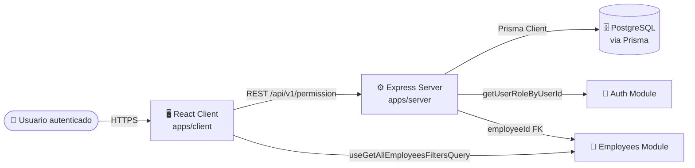
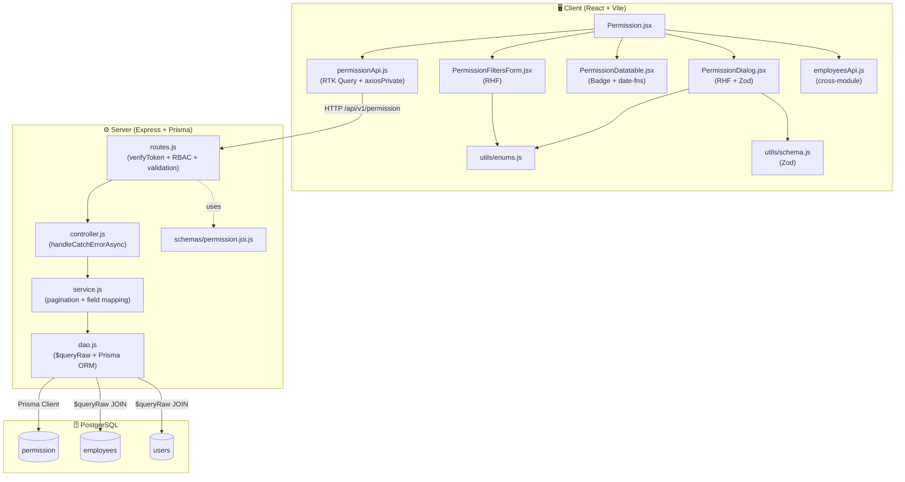
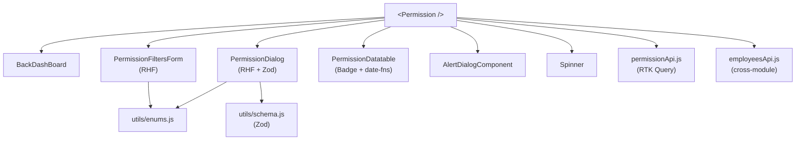
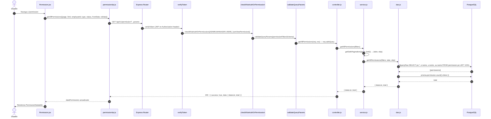
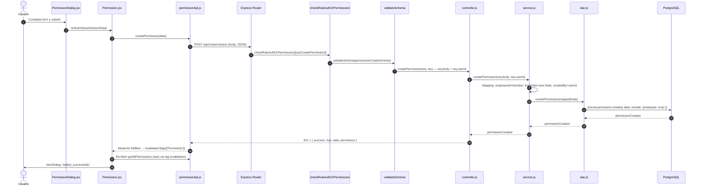
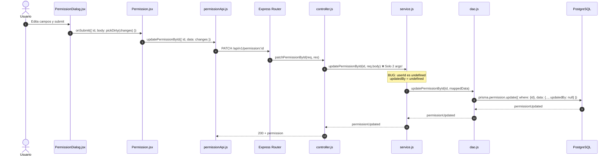
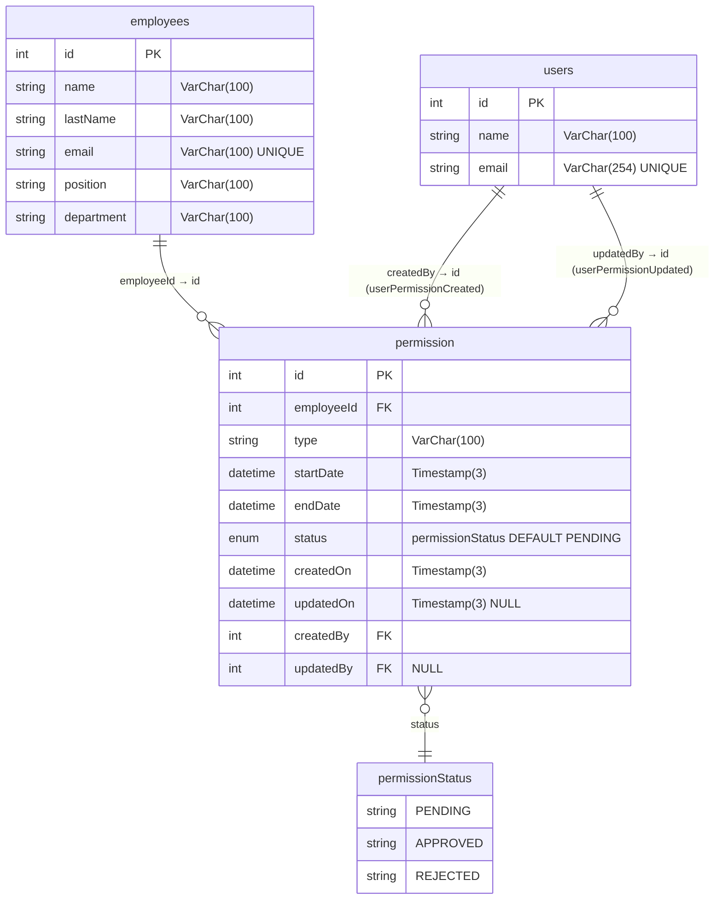
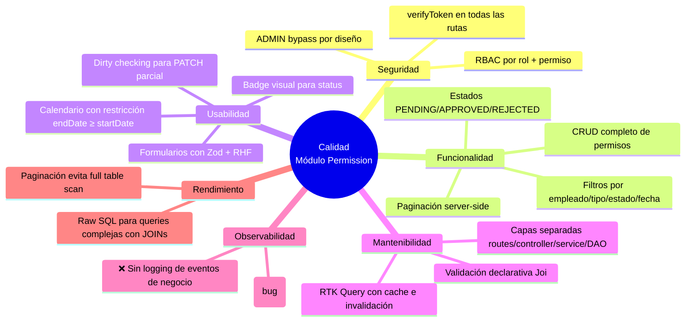

# Módulo: Permission (Server + Client)

> Documentación técnica integral del módulo **Permission** siguiendo un enfoque híbrido **arc42 / C4 Model / IEEE 1016**.
> Cubre tanto el backend (`apps/server/src/modules/permission/`) como el frontend (`apps/client/src/modules/permission/`).
>
> **Aclaración terminológica:** Este módulo gestiona **permisos laborales de empleados** (licencias, ausencias justificadas como enfermería, maternidad, paternidad, asuntos personales). NO gestiona permisos de acceso al sistema (RBAC) — esa responsabilidad recae en el modelo `permissions` (catálogo) y el middleware `checkRoleAuthOrPermisssion`.
>
> **Audiencia:** Arquitectos de software, Tech Leads, desarrolladores backend/frontend, revisores de código, auditores de seguridad y QA.

---

## Tabla de Contenidos

1. [Metadatos del Documento e Historial de Revisiones](#1-metadatos-del-documento-e-historial-de-revisiones)
2. [Introducción y Objetivos](#2-introducción-y-objetivos)
3. [Contexto y Alcance](#3-contexto-y-alcance)
4. [Restricciones](#4-restricciones)
5. [Stack Tecnológico](#5-stack-tecnológico)
6. [Arquitectura del Módulo (Overview)](#6-arquitectura-del-módulo-overview)
7. [Vista de Building Blocks — Server](#7-vista-de-building-blocks--server)
8. [Vista de Building Blocks — Client](#8-vista-de-building-blocks--client)
9. [Vista de Runtime y Flujo de Datos](#9-vista-de-runtime-y-flujo-de-datos)
10. [Modelo de Datos](#10-modelo-de-datos)
11. [Contratos de API](#11-contratos-de-api)
12. [Reglas de Validación y Esquemas](#12-reglas-de-validación-y-esquemas)
13. [Seguridad y Autorización](#13-seguridad-y-autorización)
14. [Manejo de Errores](#14-manejo-de-errores)
15. [Conceptos Transversales (Cross-Cutting)](#15-conceptos-transversales-cross-cutting)
16. [Requisitos de Calidad](#16-requisitos-de-calidad)
17. [Decisiones de Diseño (ADRs)](#17-decisiones-de-diseño-adrs)
18. [Riesgos y Deuda Técnica](#18-riesgos-y-deuda-técnica)
19. [Glosario](#19-glosario)
20. [Apéndices](#20-apéndices)

---

## 1. Metadatos del Documento e Historial de Revisiones

| Campo | Valor |
| ---------------- | ------------------------------------------------ |
| **Módulo** | `permission` |
| **Estado** | Released / Implementado (con bugs críticos) |
| **Versión** | `1.0.0` |
| **Owner** | Backend Guild — Express Track |
| **Path Server** | `apps/server/src/modules/permission/` |
| **Path Client** | `apps/client/src/modules/permission/` |
| **Base URL API** | `/api/v1/permission` |
| **Estándar** | arc42 + C4 (L1/L2) + IEEE 1016 |
| **Audiencia** | Engineers, Architects, QA, Security Reviewers |

### Historial de Revisiones

| Versión | Fecha | Autor | Cambios |
| ------- | ----------- | ------------ | -------------------------------------------------------------------------------------------------- |
| 1.0.0 | 2026-06-11 | Docs Bot | Creación inicial del documento integral (server + client) siguiendo arc42/C4/IEEE 1016. |

---

## 2. Introducción y Objetivos

### 2.1 Propósito

El módulo **Permission** gestiona las solicitudes de permisos laborales de los empleados: licencias por enfermedad, asuntos personales, maternidad, paternidad y otros motivos. Implementa un flujo de solicitud-aprobación con estados (PENDING → APPROVED/REJECTED), filtros avanzados por empleado/tipo/estado/fecha, y paginación server-side.

Funcionalidades principales:

- **Listar permisos**: Obtener todos los permisos con filtros opcionales (empleado, tipo, estado, rango de fechas) y paginación.
- **Crear permiso**: Registrar una nueva solicitud de permiso para un empleado, con tipo, fechas y motivo.
- **Editar permiso**: Actualizar parcialmente un permiso existente (cambiar estado, motivo, fechas, comentarios).
- **Eliminar permiso**: Borrar un permiso por su ID.

### 2.2 Alcance Funcional

| ID | Función | Actor | Cubre |
| ------ | ---------------------------------------------------------------- | --------- | ----------------------------------------------------------------------------------------- |
| F-001 | Listar permisos con filtros y paginación | Autenticado | GET `/api/v1/permission` con `checkRoleAuthOrPermisssion(canViewPermission)` |
| F-002 | Crear solicitud de permiso | Autenticado | POST `/api/v1/permission` con `checkRoleAuthOrPermisssion(canCreatePermission)` |
| F-003 | Actualizar permiso existente | Autenticado | PATCH `/api/v1/permission/:id` con `checkRoleAuthOrPermisssion(canEditPermission)` |
| F-004 | Eliminar permiso | Autenticado | DELETE `/api/v1/permission/:id` con `checkRoleAuthOrPermisssion(canDeletePermission)` |

### 2.3 Objetivos de Calidad

| ID | Prioridad | Objetivo |
| ----- | --------- | --------------------------------------------------------------------------------------- |
| Q-001 | Alta | **Autorización RBAC:** Todos los endpoints requieren `verifyToken` + permiso específico (`canViewPermission`, etc.). |
| Q-002 | Alta | **Validación de entrada:** Joi en server (body + query), Zod en client (form). |
| Q-003 | Alta | **Integridad de datos:** `endDate ≥ startDate` validado en Joi y en client (Calendar disabled). |
| Q-004 | Media | **Paginación server-side:** `getSafePagination` previene valores inválidos de limit/page. |
| Q-005 | Media | **Trazabilidad:** `createdBy` / `updatedBy` vinculan cada permiso al usuario que lo creó/modificó. |
| Q-006 | Media | **UX reactiva:** Filtros + paginación en useEffect, cache RTK Query con `keepUnusedDataFor: 300`. |
| Q-007 | Baja | **Internacionalización:** Textos UI por `react-i18next`; mensajes de validación por Zod i18n map. |

### 2.4 Stakeholders

| Rol | Interés |
| ------------------ | -------------------------------------------------------------------------------- |
| Product Owner | Flujo de solicitud-aprobación de permisos laborales funcional. |
| Backend Engineer | Mantenimiento de routes/controller/service/DAO + Prisma. |
| Frontend Engineer | Mantenimiento de pages/components/API/utils. |
| HR Manager | Aprobación/rechazo de solicitudes de permisos de empleados. |
| QA | Pruebas de integración, filtros, paginación, escenarios de error. |

---

## 3. Contexto y Alcance

### 3.1 Diagrama de Contexto (C4 Nivel 1)



### 3.2 Dentro del Alcance (In-Scope)

- Endpoints REST `/api/v1/permission/*` con CRUD completo.
- Flujo de estados PENDING → APPROVED / REJECTED.
- Filtros por empleado, tipo, estado y rango de fechas.
- Paginación server-side con `take` / `skip`.
- Client-side: formulario de creación/edición con Zod + RHF, datatable con filtros, diálogo de confirmación de eliminación.
- Auditoría: `createdBy`, `updatedBy`, `createdOn`, `updatedOn`.

### 3.3 Fuera del Alcance (Out-of-Scope)

- Flujo de aprobación automatizado (notificaciones, escalado).
- Adjuntar documentos/soportes al permiso (e.g., certificado médico).
- Cálculo de días de permiso disponibles o saldo.
- Integración con calendario laboral.
- Auditoría detallada de cambios (audit log por campo).
- Permisos recurrentes o por rango horario.

---

## 4. Restricciones

| ID | Tipo | Restricción |
| ----- | ------------------- | ---------------------------------------------------------------------------------------------------------- |
| C-001 | Tecnológica | Backend debe usar Express + Prisma + PostgreSQL (ver `apps/server/AGENTS.md`). |
| C-002 | Tecnológica | Frontend debe usar React 18 + Vite + Redux Toolkit + RTK Query (ver `apps/client/AGENTS.md`). |
| C-003 | Tecnológica | Todos los endpoints REST cuelgan del prefijo `/api/v1`. |
| C-004 | Seguridad | Todos los endpoints requieren `verifyToken` (aplicado globalmente en el router del módulo). |
| C-005 | Seguridad | Autorización por rol + permiso: `checkRoleAuthOrPermisssion` en cada ruta. ADMIN bypass automático. |
| C-006 | Validación | `employeeId` entero positivo; `type` enum (SICK, PERSONAL, MATERNITY, PATERNITY, OTHER); `status` enum (PENDING, APPROVED, REJECTED); `reason` max 500; `comments` max 1000. |
| C-007 | Datos | `endDate ≥ startDate` (validado en Joi y client). |
| C-008 | Paginación | `getSafePagination` requiere `limit > 0` y `page ≥ 1`. |
| C-009 | Convencional | Convención de commits: Conventional Commits (Husky). |
| C-010 | Convencional | Path alias en cliente: `@/ → src/`. |

---

## 5. Stack Tecnológico

| Capa | Tecnología | Versión / Notas | Justificación |
| --------------------- | ------------------------------------- | ---------------------------------------- | ---------------------------------------------------------------------------- |
| **Server runtime** | Node.js | LTS (>= 18) | Compatibilidad con Prisma y Express. |
| **Server framework** | Express.js | 4.x / 5.x | Estándar de facto, simple, ecosistema maduro. |
| **Server ORM** | Prisma | Cliente Prisma | Type-safety; acceso a `permission`, `employees`, `users`. |
| **Server DB** | PostgreSQL | Tipos `@db.VarChar(N)`, `@db.Timestamp(3)`, `@db.Integer` | Tipado estricto. |
| **Server validación** | Joi | Esquemas en `permission.joi.js` | Validación declarativa del payload. |
| **Server auth** | JWT + RBAC | `verifyToken` + `checkRoleAuthOrPermisssion` | Autenticación + autorización por rol/permiso. |
| **Server SQL** | Prisma `$queryRaw` | Consultas crudas con JOINs | Flexibilidad para JOINs con `employees` y `users`. |
| **Client framework** | React | 18.x | Hooks, concurrent rendering. |
| **Client bundler** | Vite | 5.x+ | HMR rápido, ESM nativo. |
| **Client state** | Redux Toolkit / RTK Query | `createApi` + hooks autogenerados | Cache, invalidación, lazy queries. |
| **Client HTTP** | Axios (private) | `axiosPrivateBaseQuery` | Con interceptor de refresh automático. |
| **Client forms** | react-hook-form + Zod | `@hookform/resolvers/zod` | Validación tipada. |
| **Client UI** | shadcn/ui + Radix + Tailwind CSS | Form, Select, Calendar, Popover, Badge, DataTable | Componentes accesibles. |
| **Client i18n** | react-i18next | `useTranslation()` | Traducciones externas. |
| **Client dates** | date-fns | `format(date, 'PPP')` | Formateo de fechas en UI. |

---

## 6. Arquitectura del Módulo (Overview)

### 6.1 Estructura de Archivos

```text
project-one/
├── apps/
│ ├── server/
│ │ └── src/modules/permission/
│ │ ├── routes.js # Express router + auth + validation middleware
│ │ ├── controller.js # 4 handlers (getAll, create, patch, delete)
│ │ ├── service.js # Lógica de negocio + paginación + mapping
│ │ ├── dao.js # Acceso a datos (Prisma $queryRaw + ORM)
│ │ └── schemas/
│ │ └── permission.joi.js # Joi: Filters, Create, Update
│ └── client/
│ └── src/modules/permission/
│ ├── pages/
│ │ └── Permission.jsx # Página principal (orquestador)
│ ├── api/
│ │ └── permissionApi.js # RTK Query API (4 endpoints)
│ ├── components/
│ │ ├── PermissionDatatable.jsx # Tabla de datos con columnas
│ │ ├── PermissionDialog.jsx # Diálogo crear/editar (RHF + Zod)
│ │ ├── PermissionFiltersForm.jsx # Filtros (empleado, tipo, estado, fechas)
│ │ └── index.js # Barrel export
│ └── utils/
│ ├── enums.js # PERMISSION_TYPES, PERMISSION_STATUS
│ ├── schema.js # Zod PermissionSchema
│ └── index.js # Barrel export
└── docs/
 └── modules/
 └── permission.md # Este documento
```

### 6.2 Diagrama de Contenedores (C4 Nivel 2)



---

## 7. Vista de Building Blocks — Server

### 7.1 Responsabilidades por Capa

| Capa | Archivo | Responsabilidad |
| ------------- | ---------------------- | --------------------------------------------------------------------------------------------------- |
| **Rutas** | `routes.js` | Definir endpoints, encadenar middleware (`verifyToken` global + `checkRoleAuthOrPermisssion` + validación Joi). |
| **Controlador** | `controller.js` | Recibir request HTTP, extraer datos (`safeQuery`, `body`, `params`, `userId`), delegar al servicio, formatear respuesta. |
| **Servicio** | `service.js` | Paginación (`getSafePagination`), mapping de campos (startDate→fromDate, endDate→toDate), seteo de `createdBy`/`updatedBy`. |
| **DAO** | `dao.js` | Persistencia: `$queryRaw` para listado con JOINs, `prisma.permission.create/update/delete` para mutaciones. |
| **Esquemas** | `schemas/permission.joi.js` | Validación declarativa del shape del payload (filters, create, update). |

### 7.2 Rutas y Cadena de Middleware

| Método | Path | Middleware Chain | Handler |
| ------ | --------------------------------- | ------------------------------------------------------------------------------------------------------------- | ---------------------- |
| GET | `/` | `verifyToken` → `checkRoleAuthOrPermisssion({ADMIN,MANAGER,USER}, [canViewPermission])` → `validateQueryParams(permissionFiltersSchema)` | `getAllPermissions` |
| POST | `/` | `verifyToken` → `checkRoleAuthOrPermisssion({ADMIN,MANAGER,USER}, [canCreatePermission])` → `validateSchema(permissionCreateSchema)` | `createPermission` |
| PATCH | `/:id` | `verifyToken` → `checkRoleAuthOrPermisssion({ADMIN,MANAGER,USER}, [canEditPermission])` → `validatePathParam` → `validateSchema(permissionUpdateSchema)` | `patchPermissionById` |
| DELETE | `/:id` | `verifyToken` → `checkRoleAuthOrPermisssion({ADMIN,MANAGER,USER}, [canDeletePermission])` → `validatePathParam` | `deletePermissionById` |

> **Nota:** `verifyToken` se aplica globalmente via `router.use(verifyToken)`. Todos los endpoints requieren autenticación. `checkRoleAuthOrPermisssion` permite ADMIN sin permiso específico.

### 7.3 Controladores (Funciones Exportadas)

| Función | Firma | Comportamiento | Status Code |
| -------------------- | ---------------------------------------------------------------------------------------------- | ------------------------------------------------------------------------------------------------------------- | ----------- |
| `getAllPermissions` | `(req, res) → Promise<void>` <br/>Lee `req.safeQuery` | Pasa filtros al servicio, responde con lista paginada. | `200` |
| `createPermission` | `(req, res) → Promise<void>` <br/>Lee `req.body` + `req.userId` | Pasa body + userId al servicio, responde con permiso creado. | `201` |
| `patchPermissionById` | `(req, res) → Promise<void>` <br/>Lee `req.params.id` + `req.body` | Pasa id + body al servicio (**BUG: userId no se pasa**), responde con permiso actualizado. | `200` |
| `deletePermissionById` | `(req, res) → Promise<void>` <br/>Lee `req.params.id` | Pasa id al servicio, responde con mensaje + permiso eliminado. | `200` |

> **Patrón:** Todas las funciones usan `handleCatchErrorAsync` (decorador que captura errores y los delega a la capa central de errores) y `globalResponse` (formateador estándar de respuesta JSON).

### 7.4 Servicios (Lógica de Negocio)

| Función | Firma | Reglas Aplicadas |
| ------------------- | -------------------------------------------------------------------- | ------------------------------------------------------------------------------------------------------------------------------------------------- |
| `getAllPermissions` | `(filters) → Promise<{dataList, total}>` | 1) Calcula paginación vía `getSafePagination({page, limit})`. 2) Valida `take > 0` (si no, lanza Error). 3) Delega al DAO con `{filters, take, skip}`. |
| `createPermission` | `(data, userId) → Promise<permission>` | 1) Mapea `employeeId: Number(data.employeeId)`. 2) Convierte `fromDate: new Date(data.fromDate)`, `toDate: new Date(data.toDate)`. 3) Setea `createdOn: new Date()`, `createdBy: userId`. 4) Delega al DAO. |
| `updatePermissionById` | `(id, data, userId) → Promise<permission>` | 1) Mapea `employeeId: Number(data.employeeId)`. 2) Convierte fechas. 3) Setea `updatedOn: new Date()`, `updatedBy: userId`. 4) Delega al DAO. **BUG: controller no pasa userId.** |
| `deletePermissionById` | `(id) → Promise<permission>` | Convierte `id` a `Number(id)`, delega al DAO. |

> **Bug crítico:** `patchPermissionById` en controller llama `patchPermissionByIdService(id, req.body)` con solo 2 argumentos, pero `updatePermissionById(id, data, userId)` requiere 3. `updatedBy` siempre es `undefined`.

### 7.5 DAO (Acceso a Datos)

| Función | Estrategia | Prisma API | Notas |
| -------------------- | ------------------------------------------------------------------------------------------------------------- | ------------------------------------------------------------------------------------------------------------------------------------------------------------- | ------ |
| `getAllPermissions` | Raw SQL con JOINs dinámicos. | `prisma.$queryRaw` + `Prisma.sql` con `Prisma.join` | JOINs a `employees`, `users` (created), `users` (updated). Filtros dinámicos con `WHERE ... AND ...`. |
| `getAllPermissions` (count) | Prisma ORM para total. | `prisma.permission.count({ where })` | Duplica lógica de filtros en formato Prisma (no raw). |
| `createPermission` | ORM create con relaciones. | `prisma.permission.create({ data, include: { employee: true } })` | **Escribe campos `reason`, `comments` que NO EXISTEN en el modelo Prisma.** |
| `updatePermissionById` | ORM update con relaciones. | `prisma.permission.update({ where, data, include: { employee: true } })` | Mismo problema con campos inexistentes. |
| `deletePermissionById` | ORM delete simple. | `prisma.permission.delete({ where: { id } })` | No retorna relaciones. |

> **Notas importantes sobre DAO:**
> - `getAllPermissions` usa raw SQL para obtener `employeeName`, `userPermissionCreatedName`, `userPermissionUpdatedName` via JOINs.
> - El count se hace por separado con Prisma ORM (no raw) — los filtros están duplicados en dos formatos distintos.
> - Los filtros `startDate`/`endDate` del DAO se aplican sobre `createdOn` (no sobre el rango de fechas del permiso). Los nombres de filtros en el schema son `fromDate`/`toDate`.
> - `status` y `type` se filtran con `ILIKE` (pattern matching) a pesar de ser enum values — debería ser exact match.

### 7.6 Utilidades Compartidas (Server)

| Utilidad | Ubicación | Uso en este módulo |
| ------------------------------------- | ---------------------------------------- | ------------------------------------------------------------------- |
| `globalResponse(res, status, data)` | `utils/responses&Errors/globalResponse.js` | Estandariza la respuesta JSON. |
| `handleCatchErrorAsync(fn)` | `utils/responses&Errors/handleCatchErrorAsync.js` | Decorador async que captura y propaga errores. |
| `verifyToken` | `middleware/index.js` | Verifica JWT en header Authorization. |
| `checkRoleAuthOrPermisssion` | `middleware/verifyRole.js` | Autorización por rol (ADMIN bypass) + permiso específico. |
| `validateSchema` | `middleware/index.js` | Valida body contra Joi schema → `req.safeBody`. |
| `validateQueryParams` | `middleware/index.js` | Valida query params contra Joi schema → `req.safeQuery`. |
| `validatePathParam` | `middleware/index.js` | Valida que `:id` sea entero positivo. |
| `getSafePagination` | `utils/pagination/pagination.js` | Calcula `take`/`skip` a partir de `page`/`limit`. |
| `ROLESCODES` | `utils/constants/enums.js` | Constantes: `ADMIN`, `MANAGER`, `USER`. |
| `PERMISSIONCODES` | `utils/constants/enums.js` | `canViewPermission`, `canCreatePermission`, `canEditPermission`, `canDeletePermission`. |

---

## 8. Vista de Building Blocks — Client

### 8.1 Página — `Permission.jsx`

| Página | Componentes | Comportamiento |
| --------------------- | ------------------------------------------------------------------------------------------------ | -------------------------------------------------------- |
| `Permission.jsx` | `BackDashBoard`, `PermissionFiltersForm`, `PermissionDatatable`, `PermissionDialog`, `AlertDialogComponent`, `Spinner` | Página principal. Orquesta filtros, tabla, diálogo CRUD y alertas. |

### 8.2 Diagrama del Árbol de Componentes (Client)



### 8.3 Especificación de Componentes

#### `Permission.jsx` (Orquestador)

| Aspecto | Detalle |
| --------------------- | ------------------------------------------------------------------------------------------------ |
| **Hooks** | `useTranslation`, `useState`, `useEffect` |
| **RTK Query** | `useLazyGetAllPermissionsQuery`, `useUpdatePermissionByIdMutation`, `useCreatePermissionMutation`, `useDeletePermissionByIdMutation` |
| **Cross-module** | `useGetAllEmployeesFiltersQuery` (módulo employees) |
| **State** | `selectedRow`, `openDialog`, `openAlertDialog`, `alertProps`, `actionDialog`, `pagination ({pageIndex, pageSize})`, `filters` |
| **useEffect** | Dispara `getAllPermissions({ page, limit, ...filters })` cuando cambia pagination o filters (reactivo). |
| **handleSubmit** | Si `result.id` → `updatePermissionById({ id, body: pickDirty(changes) })`, si no → `createPermission(result)`. |
| **handleDelete** | Confirmación → `deletePermissionById(id)`. |

#### `PermissionDatatable.jsx`

| Aspecto | Detalle |
| --------------------- | ------------------------------------------------------------------------------------------------ |
| **Props** | `dataPermissions`, `onEditDialog`, `pagination`, `onPaginationChange` |
| **Librerías** | `@/components/dataTable`, `date-fns/format`, `Badge` de shadcn/ui |
| **Columnas** | `employeeName` (uppercase), `type` (i18n `permission_type.X`), `startDate` (PPP), `endDate` (PPP), `reason`, `status` (Badge variant), `userPermissionCreatedName`, `createdOn`, `userPermissionUpdatedName`, `updatedOn` |
| **Badge Variant** | PENDING→`warning`, APPROVED→`success`, REJECTED→`destructive` |
| **BUG** | Columna `userPermissionCreatedName` lee `row.original.userPerformanceCreatedName` (prefijo equivocado). Mismo bug en `userPermissionUpdatedName`. |

#### `PermissionDialog.jsx`

| Aspecto | Detalle |
| --------------------- | ------------------------------------------------------------------------------------------------ |
| **Hooks** | `useForm({ resolver: zodResolver(PermissionSchema) })`, `useEffect`, `useMemo`, `useTranslation` |
| **Props** | `openDialog`, `onCloseDialog`, `selectedRow`, `onSubmit`, `onDeleteById`, `actionDialog`, `dataEmployees` |
| **Campos** | `employeeId` (Select), `type` (Select), `status` (Select), `startDate` (Calendar), `endDate` (Calendar, disabled < startDate), `reason` (Textarea), `comments` (Textarea) |
| **Edit mode** | Muestra read-only: `userPermissionCreatedName`, `createdOn`, `userPermissionUpdatedName`, `updatedOn` |
| **On Submit** | Si `permissionId` → usa `pickDirty(submissionData, dirtyFields)` para PATCH parcial. Si no → envía todo para POST. |
| **Dates** | Formatea `yyyy-MM-dd` para API. Calendar deshabilita fechas anteriores a `startDate` en `endDate`. |

#### `PermissionFiltersForm.jsx`

| Aspecto | Detalle |
| --------------------- | ------------------------------------------------------------------------------------------------ |
| **Hooks** | `useForm` (sin Zod — filtros sin validación estricta), `useTranslation` |
| **Props** | `onSubmit`, `onAddDialog`, `dataEmployees` |
| **Campos** | `employeeId` (Select), `type` (Select), `status` (Select), `fromDate` (Calendar), `toDate` (Calendar, disabled < fromDate) |
| **Botones** | Search (submit), Add (abre diálogo), Clear (reset filtros + submit vacío) |
| **Format** | `fromDate`/`toDate` se formatean como `yyyy-MM-dd` antes de enviar. Empty strings → `undefined` para no enviar filtros vacíos. |

### 8.4 API Client — `permissionApi.js`

```js
// RTK Query con axiosPrivateBaseQuery
import { createApi } from '@reduxjs/toolkit/query/react';
import { axiosPrivateBaseQuery } from '@/config/axios';
```

| Endpoint | Verbo | Path | Tags | Hook Exportado |
| --------------------------------- | ----- | --------------------------------- | ---- | ---------------------- |
| `getAllPermissions` | GET | `/permission` | provides: `['Permission']` | `useGetAllPermissionsQuery`, `useLazyGetAllPermissionsQuery` |
| `createPermission` | POST | `/permission` | invalidates: `['Permission']` | `useCreatePermissionMutation` |
| `updatePermissionById` | PATCH | `/permission/:id` | invalidates: `['Permission']` | `useUpdatePermissionByIdMutation` |
| `deletePermissionById` | DELETE | `/permission/:id` | invalidates: `['Permission']` | `useDeletePermissionByIdMutation` |

> **Estrategia:** `keepUnusedDataFor: 300` (5 min). Todas las mutaciones invalidan el tag `Permission` para re-fetch automático. `getAllPermissions` es lazy (se dispara manualmente via useEffect en Permission.jsx).

### 8.5 Utilidades del Cliente

| Función / Constante | Archivo | Descripción |
| ----------------------------------------- | -------------------- | -------------------------------------------------------------------------------------------------------------------------------------- |
| `PERMISSION_TYPES` | `utils/enums.js` | `['SICK', 'PERSONAL', 'MATERNITY', 'PATERNITY', 'OTHER']` |
| `PERMISSION_STATUS` | `utils/enums.js` | `['PENDING', 'APPROVED', 'REJECTED']` |
| `PermissionSchema` | `utils/schema.js` | Zod: `employeeId` (preprocess → number), `type` (enum), `startDate` (date), `endDate` (date), `reason` (string max 500), `status` (enum default PENDING), `comments` (string max 1000 optional). `.passthrough()`. |
| `FIELD_LIMITS.permission` | `config/fieldLimits.js` | `{ type: 100, reason: 500, comments: 1000 }` — usados como `maxLength` en Textarea. |

---

## 9. Vista de Runtime y Flujo de Datos

### 9.1 Secuencia — Listar Permisos con Filtros (Happy Path)



### 9.2 Secuencia — Crear Permiso (Happy Path)



### 9.3 Secuencia — Actualizar Permiso (con Bug)



### 9.4 Escenarios de Error (Tabla)

| Escenario | Origen | Manejo Server | Manejo Client |
| ---------------------------------------- | ----------------------------------------------------- | ------------------------------------------------------------------ | ---------------------------------------------------------- |
| Joi validation fallida (create/update) | `validateSchema` | 400 con detalle de campos | Error genérico del formulario (Zod previene en client primero) |
| Joi validation fallida (filters) | `validateQueryParams` | 400 con detalle de campos | No manejado (los filtros no tienen Zod) |
| Permiso no encontrado (update/delete) | `prisma.permission.update/delete` | Prisma P2025 → error 500 (no capturado como 404) | `operation_failed` en AlertDialog |
| Rol no autorizado | `checkRoleAuthOrPermisssion` | 403 con mensaje | Error genérico de red |
| Permiso insuficiente | `checkRoleAuthOrPermisssion` | 403 "Insufficient permissions" | Error genérico de red |
| Token JWT inválido | `verifyToken` | 401 | Interceptor axios → redirect login |
| Paginación inválida | `service.getAllPermissions` | 500 "Pagination is required" (Error genérico) | Spinner infinito / error |
| Prisma write fail (reason/comments) | `dao.createPermission` / `dao.updatePermissionById` | Error Prisma — campos inexistentes | `operation_failed` en AlertDialog |
| Empleado no existe (FK) | `prisma.permission.create` | Prisma P2003 FK constraint → 500 | `operation_failed` en AlertDialog |

---

## 10. Modelo de Datos

### 10.1 Diagrama Entidad-Relación (Mermaid)



### 10.2 Tabla `permission`

| Columna | Tipo (Prisma) | Restricciones | Notas |
| -------------- | --------------------- | ------------------------------------------ | -------------------------------------------------------------------------------------- |
| `id` | `Int` | PK, autoincrement | |
| `employeeId` | `Int` | FK → `employees.id`, `@db.Integer` | Empleado asociado al permiso. |
| `type` | `String` | `VarChar(100)` | Tipo de permiso: SICK, PERSONAL, MATERNITY, PATERNITY, OTHER. No es enum en DB (es string). |
| `startDate` | `DateTime` | `@db.Timestamp(3)` | Fecha inicio del permiso. |
| `endDate` | `DateTime` | `@db.Timestamp(3)` | Fecha fin del permiso. Debe ser ≥ startDate (validado en Joi/Zod, NO en DB). |
| `status` | `permissionStatus` | DEFAULT `PENDING` | Enum: PENDING, APPROVED, REJECTED. |
| `createdOn` | `DateTime` | `@db.Timestamp(3)` | Fecha de creación del registro. |
| `updatedOn` | `DateTime?` | `@db.Timestamp(3)`, NULL | Fecha de última actualización. |
| `createdBy` | `Int` | FK → `users.id`, `@db.Integer` | Usuario que creó el permiso. |
| `updatedBy` | `Int?` | FK → `users.id`, `@db.Integer`, NULL | Usuario que actualizó el permiso. |

> **Campos faltantes en Prisma model:** El DAO intenta escribir `reason`, `comments`, `fromDate`, `toDate` — pero estos campos NO EXISTEN en el modelo Prisma. La columna `reason` y `comments` están en los Joi schemas y en el client Zod schema, pero no en la DB. El DAO mapea `startDate → fromDate` y `endDate → toDate`, nombres que tampoco existen en el modelo. Ver §18 R-001, R-002.

### 10.3 Tabla `employees` (campos relevantes)

| Columna | Tipo (Prisma) | Restricciones | Notas |
| -------------- | --------------------- | ------------------------------------------ | -------------------------------------------------------------------------------------- |
| `id` | `Int` | PK, autoincrement | Referenciado por `permission.employeeId`. |
| `name` | `String` | `VarChar(100)` | Retornado como `employeeName` en raw SQL JOIN. |
| `lastName` | `String` | `VarChar(100)` | Usado en client Select (mostrado como "name lastName"). |

### 10.4 Enum `permissionStatus`

| Valor | Descripción |
| ------- | -------------------------------------------------------------------------------------- |
| `PENDING` | Permiso solicitado, pendiente de aprobación. Estado por defecto al crear. |
| `APPROVED` | Permiso aprobado por un manager/admin. |
| `REJECTED` | Permiso rechazado. |

---

## 11. Contratos de API

> **Base URL:** `/api/v1/permission`
> **Auth:** Todos los endpoints requieren `verifyToken` (JWT en header `Authorization: Bearer <token>`).
> **Content-Type:** `application/json`.

### 11.1 `GET /api/v1/permission` — Listar permisos

| Aspecto | Detalle |
| --------------- | --------------------------------------------------------------------------------------------- |
| **Auth** | `verifyToken` + `checkRoleAuthOrPermisssion({ADMIN,MANAGER,USER}, [canViewPermission])` |
| **Validación** | `validateQueryParams(permissionFiltersSchema)` |

**Query Parameters (todos opcionales):**

| Param | Tipo | Descripción |
| ------- | ---- | ----------- |
| `employeeId` | `integer` | Filtrar por ID de empleado. |
| `type` | `string` | Filtrar por tipo: SICK, PERSONAL, MATERNITY, PATERNITY, OTHER. |
| `status` | `string` | Filtrar por estado: PENDING, APPROVED, REJECTED. |
| `fromDate` | `date.iso` | Filtrar desde fecha (aplicado sobre `createdOn`). |
| `toDate` | `date.iso` | Filtrar hasta fecha (aplicado sobre `createdOn`). Debe ser ≥ `fromDate`. |
| `page` | `integer` | Número de página (≥ 1). |
| `limit` | `integer` | Registros por página (≥ 1). |

**Response 200:**

```json
{
  "error": false,
  "statusCode": 200,
  "message": "Some success message",
  "data": {
    "dataList": [
      {
        "id": 1,
        "employeeId": 5,
        "employeeName": "JUAN PÉREZ",
        "type": "SICK",
        "startDate": "2024-03-25T00:00:00.000Z",
        "endDate": "2024-03-26T00:00:00.000Z",
        "status": "PENDING",
        "createdOn": "2024-03-20T09:00:00.000Z",
        "updatedOn": null,
        "createdBy": 1,
        "userPermissionCreatedName": "ADMIN USER",
        "updatedBy": null,
        "userPermissionUpdatedName": null
      }
    ],
    "total": 42
  }
}
```

**Errores:** `400` (validación Joi), `401` (token inválido), `403` (rol/permiso insuficiente), `500` (DB).

---

### 11.2 `POST /api/v1/permission` — Crear permiso

| Aspecto | Detalle |
| --------------- | --------------------------------------------------------------------------------------------- |
| **Auth** | `verifyToken` + `checkRoleAuthOrPermisssion({ADMIN,MANAGER,USER}, [canCreatePermission])` |
| **Validación** | `validateSchema(permissionCreateSchema)` |

**Request Body:**

```json
{
  "employeeId": 5,
  "type": "SICK",
  "startDate": "2024-03-25",
  "endDate": "2024-03-26",
  "reason": "Medical appointment for routine checkup",
  "status": "PENDING",
  "comments": "Will bring doctor's note"
}
```

**Response 201:**

```json
{
  "error": false,
  "statusCode": 201,
  "message": "Some success message",
  "data": {
    "id": 1,
    "employeeId": 5,
    "type": "SICK",
    "startDate": "2024-03-25T00:00:00.000Z",
    "endDate": "2024-03-26T00:00:00.000Z",
    "status": "PENDING",
    "createdOn": "2024-03-20T09:00:00.000Z",
    "employee": {
      "id": 5,
      "name": "Juan",
      "lastName": "Pérez"
    }
  }
}
```

> **Nota:** Los campos `reason` y `comments` del request se ignoran silenciosamente si Prisma no los reconoce, o causan error si el campo no existe. Ver §18 R-001.

**Errores:** `400` (validación Joi), `401`, `403`, `500` (DB / FK constraint).

---

### 11.3 `PATCH /api/v1/permission/:id` — Actualizar permiso

| Aspecto | Detalle |
| --------------- | --------------------------------------------------------------------------------------------- |
| **Auth** | `verifyToken` + `checkRoleAuthOrPermisssion({ADMIN,MANAGER,USER}, [canEditPermission])` |
| **Validación** | `validatePathParam` + `validateSchema(permissionUpdateSchema)` |

**Path Parameters:**

| Param | Tipo | Descripción |
| ------- | ---- | ----------- |
| `id` | `integer` | ID del permiso a actualizar. |

**Request Body (partial — todos opcionales):**

```json
{
  "status": "APPROVED",
  "comments": "Approved by HR manager"
}
```

**Response 200:**

```json
{
  "error": false,
  "statusCode": 200,
  "message": "Some success message",
  "data": {
    "id": 1,
    "employeeId": 5,
    "type": "SICK",
    "startDate": "2024-03-25T00:00:00.000Z",
    "endDate": "2024-03-26T00:00:00.000Z",
    "status": "APPROVED",
    "updatedOn": "2024-03-21T10:00:00.000Z",
    "employee": {
      "id": 5,
      "name": "Juan",
      "lastName": "Pérez"
    }
  }
}
```

> **Bug:** `updatedBy` siempre es `null` porque el controller no pasa `userId` al service. Ver §18 R-003.

**Errores:** `400` (validación), `401`, `403`, `404` (si Prisma retorna P2025 — convertido a 500), `500`.

---

### 11.4 `DELETE /api/v1/permission/:id` — Eliminar permiso

| Aspecto | Detalle |
| --------------- | --------------------------------------------------------------------------------------------- |
| **Auth** | `verifyToken` + `checkRoleAuthOrPermisssion({ADMIN,MANAGER,USER}, [canDeletePermission])` |
| **Validación** | `validatePathParam` |

**Path Parameters:**

| Param | Tipo | Descripción |
| ------- | ---- | ----------- |
| `id` | `integer` | ID del permiso a eliminar. |

**Response 200:**

```json
{
  "error": false,
  "statusCode": 200,
  "message": "Permission deleted successfully",
  "data": {
    "id": 1,
    "employeeId": 5,
    "type": "SICK"
  }
}
```

**Errores:** `401`, `403`, `404` (P2025 → 500), `500`.

---

### 11.5 Tabla Resumen de Validación por Endpoint

| Endpoint | Auth | Rate Limit | Validación de entrada |
| ------------------------------------- | ------------------------------------- | --------------------- | ---------------------------------------- |
| `GET /api/v1/permission` | `verifyToken` + `canViewPermission` | Ninguno | `permissionFiltersSchema` (query) |
| `POST /api/v1/permission` | `verifyToken` + `canCreatePermission` | Ninguno | `permissionCreateSchema` (body) |
| `PATCH /api/v1/permission/:id` | `verifyToken` + `canEditPermission` | Ninguno | `validatePathParam` + `permissionUpdateSchema` (body) |
| `DELETE /api/v1/permission/:id` | `verifyToken` + `canDeletePermission` | Ninguno | `validatePathParam` |

---

## 12. Reglas de Validación y Esquemas

### 12.1 Joi — `apps/server/src/modules/permission/schemas/permission.joi.js`

```js
// permissionFiltersSchema
Joi.object({
  employeeId: Joi.number().integer().optional(),
  type: Joi.string().valid('SICK', 'PERSONAL', 'MATERNITY', 'PATERNITY', 'OTHER').optional().allow(''),
  status: Joi.string().valid('PENDING', 'APPROVED', 'REJECTED').optional(),
  fromDate: Joi.date().iso().optional(),
  toDate: Joi.date().iso().min(Joi.ref('fromDate')).optional(),
  limit: Joi.number().integer(),
  page: Joi.number().integer(),
});

// permissionCreateSchema
Joi.object({
  employeeId: Joi.number().integer().required(),
  type: Joi.string().valid('SICK', 'PERSONAL', 'MATERNITY', 'PATERNITY', 'OTHER').required(),
  startDate: Joi.date().iso().required(),
  endDate: Joi.date().iso().min(Joi.ref('startDate')).required(),
  reason: Joi.string().max(500).required(),
  status: Joi.string().valid('PENDING', 'APPROVED', 'REJECTED').default('PENDING'),
  approvedBy: Joi.number().integer().optional(),
  approvedAt: Joi.date().iso().optional(),
  comments: Joi.string().max(1000).optional(),
});

// permissionUpdateSchema
Joi.object({
  employeeId: Joi.number().integer().optional().min(1),
  type: Joi.string().valid('SICK', 'PERSONAL', 'MATERNITY', 'PATERNITY', 'OTHER').optional().min(1),
  startDate: Joi.date().iso().optional(),
  endDate: Joi.date().iso().min(Joi.ref('startDate')).optional(),
  reason: Joi.string().max(500).optional().min(1),
  status: Joi.string().valid('PENDING', 'APPROVED', 'REJECTED').optional(),
  approvedBy: Joi.number().integer().optional().min(1),
  approvedAt: Joi.date().iso().optional(),
  comments: Joi.string().max(1000).optional().min(1),
});
```

### 12.2 Zod — `apps/client/src/modules/permission/utils/schema.js`

```js
const PermissionTypeEnum = z.enum(['SICK', 'PERSONAL', 'MATERNITY', 'PATERNITY', 'OTHER']);
const PermissionStatusEnum = z.enum(['PENDING', 'APPROVED', 'REJECTED']);

export const PermissionSchema = z
  .object({
    employeeId: z.preprocess(
      (val) => (val === '' ? undefined : Number(val)),
      z.number({ required_error: '...' }).int().positive('...')
    ),
    type: PermissionTypeEnum.refine((val) => val !== undefined, { message: '...' }),
    startDate: z.date({ required_error: '...' }),
    endDate: z.date({ required_error: '...' }),
    reason: z.string().min(1, '...').max(500, '...'),
    status: PermissionStatusEnum.default('PENDING'),
    comments: z.string().max(1000, '...').optional(),
  })
  .passthrough(); // Allows other fields not defined in the schema
```

### 12.3 Alineación de Boundaries Joi ⇄ Zod ⇄ DB

| Campo | Joi (server) | Zod (client) | DB (Prisma model) | Notas |
| ------------- | --------- | --------- | ------------ | ----------------------------------------------------------------------- |
| `employeeId` | `number().integer().required()` | `preprocess → number().int().positive()` | `Int @db.Integer` | ✅ Alineado. Client usa preprocess para convertir string de Select. |
| `type` | `valid(SICK,PERSONAL,MATERNITY,PATERNITY,OTHER)` | `PermissionTypeEnum` | `VarChar(100)` | ⚠️ DB es string, no enum. Joi/Zod validan valores pero DB acepta cualquier string. |
| `startDate` | `date().iso().required()` | `z.date()` | `DateTime @db.Timestamp(3)` | ✅ Alineado. DAO mapea a `fromDate` (nombre incorrecto). |
| `endDate` | `date().iso().min(ref(startDate))` | `z.date()` | `DateTime @db.Timestamp(3)` | ✅ Alineado. DAO mapea a `toDate` (nombre incorrecto). |
| `reason` | `string().max(500).required()` | `string().min(1).max(500)` | ❌ **NO EXISTE** | **Inconsistencia crítica** — Joi/Zod validan pero DB no tiene la columna. |
| `comments` | `string().max(1000).optional()` | `string().max(1000).optional()` | ❌ **NO EXISTE** | **Inconsistencia crítica** — Joi/Zod validan pero DB no tiene la columna. |
| `status` | `valid(PENDING,APPROVED,REJECTED).default(PENDING)` | `PermissionStatusEnum.default(PENDING)` | `permissionStatus DEFAULT PENDING` | ✅ Alineado. |
| `approvedBy` | `number().integer().optional()` | ❌ No en schema | ❌ **NO EXISTE** | Joi lo acepta pero no hay columna en DB. Comentario en Prisma: "// agregar un approvedBy". |
| `approvedAt` | `date().iso().optional()` | ❌ No en schema | ❌ **NO EXISTE** | Joi lo acepta pero no hay columna en DB. |

> **Ver §18 R-001, R-002:** Los campos `reason` y `comments` existen en Joi/Zod pero NO en el modelo Prisma. Los writes fallarán en runtime.

---

## 13. Seguridad y Autorización

### 13.1 Autenticación

- **Mecanismo:** Todos los endpoints requieren JWT en header `Authorization: Bearer <token>`. El middleware `verifyToken` se aplica globalmente via `router.use(verifyToken)`.
- **Token:** Generado por `createToken({ id, rol })` en módulo Auth. Almacenado en `sessionStorage` del client.

### 13.2 Autorización (RBAC)

- **Middleware:** `checkRoleAuthOrPermisssion({ allowedRoles, permissions })`.
- **Lógica:**
  1. Si el rol es `ADMIN` → bypass (acceso total).
  2. Si el rol está en `allowedRoles` → pasa al paso 3.
  3. Si hay permisos requeridos, verifica que el usuario tenga al menos uno (`permissions.some(p => rolePermissions.includes(p))`).
- **Permisos del módulo:** `canViewPermission`, `canCreatePermission`, `canEditPermission`, `canDeletePermission` (definidos en `PERMISSIONCODES`).
- **Roles permitidos:** ADMIN, MANAGER, USER en todos los endpoints.

### 13.3 Rate Limiting

| Endpoint | Rate Limiter | Notas |
| -------- | ------------ | ----- |
| Todos | Ninguno | ⚠️ No hay rate limiting específico para este módulo. |

> **Gap:** A diferencia de auth (que tiene rate limiters por endpoint), el módulo permission no tiene protección contra brute force o abuso de API. Ver §18 R-006.

### 13.4 OWASP Top 10 — Checklist Rápido

| Riesgo | Estado |
| ------------------------------------- | --------------------------------------------------------------------------------------- |
| A01 Broken Access Control | ✅ `verifyToken` + `checkRoleAuthOrPermisssion` en todas las rutas. ADMIN bypass por diseño. |
| A02 Cryptographic Failures | ✅ N/A (no maneja passwords ni datos sensibles cifrados). |
| A03 Injection | ✅ Prisma parametriza queries (`Prisma.sql` con template literals). Pero ⚠️ `ILIKE` con `%value%` podría exponer data si se manipula. |
| A04 Insecure Design | ⚠️ Campos `reason`/`comments` no persistidos — pérdida silenciosa de datos. |
| A05 Security Misconfiguration | ⚠️ Sin rate limiting. |
| A06 Vulnerable Components | Pendiente `npm audit`. |
| A07 Auth Failures | ✅ RBAC implementado. |
| A08 Software & Data Integrity | ⚠️ `updatedBy` siempre null (bug). Sin auditoría confiable de quién modificó. |
| A09 Logging & Monitoring | ❌ No hay logging de eventos de negocio (creación, aprobación, rechazo). |
| A10 SSRF | No aplica. |

---

## 14. Manejo de Errores

### 14.1 Server

| Origen | Mecanismo | Respuesta al cliente |
| ------------------------------- | ------------------------------------------- | ------------------------------------------------- |
| Error async en handler | `handleCatchErrorAsync` → `next(err)` | Middleware central → JSON estándar |
| Validación Joi (body) | `validateSchema` | 400 con detalle de campos |
| Validación Joi (query) | `validateQueryParams` | 400 con detalle de campos |
| Path param inválido | `validatePathParam` | 400 |
| Rol no autorizado | `checkRoleAuthOrPermisssion` | 403 con mensaje |
| Permiso insuficiente | `checkRoleAuthOrPermisssion` | 403 "Insufficient permissions" |
| Token JWT inválido/ausente | `verifyToken` | 401 |
| Paginación inválida | `service.getAllPermissions` | 500 "Pagination is required" (Error genérico, no ClientError) |
| Registro no encontrado (update/delete) | Prisma P2025 | 500 (no capturado como 404) |
| FK violation (empleado no existe) | Prisma P2003 | 500 |
| Campos inexistentes (reason/comments) | Prisma write | Error silencioso o 500 dependiendo de configuración |

### 14.2 Client

| Origen | Mecanismo | UX |
| ------------------------------ | ---------------------------------------------------------------------------------- | ------------------------------------------------------------------------------------------------- |
| Error en create/update | `mutation.rejected` → catch | AlertDialog con `t('operation_failed')` y variante destructive. |
| Error en delete | `deleteMutation.rejected` → catch | AlertDialog con `t('delete_failed')` y variante destructive. |
| Validación Zod (form) | `zodResolver` → `formState.errors` | `FormMessage` por campo |
| Error en fetch lista | `useLazyGetAllPermissionsQuery` error | Spinner se detiene, no hay UX de error explícito para la lista. |
| 401 desde server | `axiosPrivate` interceptor | Redirect automático a login. |
| 403 desde server | Error genérico | `operation_failed` en AlertDialog. |

---

## 15. Conceptos Transversales (Cross-Cutting)

### 15.1 Patrones de Datos

| Patrón | Descripción |
| ------ | ----------- |
| **Paginación server-side** | `getSafePagination` calcula `take`/`skip` desde `page`/`limit`. DataTable maneja `pageIndex`/`pageSize` y los convierte. |
| **Dirty checking** | `pickDirty(submissionData, dirtyFields)` en PATCH — solo envía campos modificados. |
| **Raw SQL + ORM hybrid** | `getAllPermissions` usa `$queryRaw` para JOINs; `create/update/delete` usan Prisma ORM. Count se hace por separado con ORM. |
| **Tag-based cache invalidation** | RTK Query tag `Permission` — todas las mutaciones invalidan, la query provee. |
| **Lazy query** | `useLazyGetAllPermissionsQuery` se dispara manualmente via useEffect (no automáticamente al montar). |

### 15.2 Internacionalización (i18n)

- **Client:** `react-i18next` con `useTranslation()`. Claves usadas: `permission`, `employee`, `type`, `start_date`, `end_date`, `reason`, `status`, `comments`, `created_by`, `updated_by`, `created_on`, `updated_on`, `add_permission`, `edit_permission`, `add_permission_message`, `edit_permission_message`, `permission_type.SICK`, `permission_type.PERSONAL`, `permission_type.MATERNITY`, `permission_type.PATERNITY`, `permission_type.OTHER`, `status.PENDING`, `status.APPROVED`, `status.REJECTED`, `select_employee_placeholder`, `select_permission_type_placeholder`, `select_status_placeholder`, `pick_date`, `search`, `add`, `clear`, `save`, `update`, `delete`, `cancel`, `add_record`, `update_record`, `added_successfully`, `updated_successfully`, `deleted_successfully`, `error`, `operation_failed`, `delete_record`, `request_delete_record`, `delete_failed`.
- **Zod:** Mensajes localizados vía `getZodMessage('zod.permission.<campo>.<reason>')`.

### 15.3 Cross-Module Dependencies

- **Permission → Employees:** `employeeId` FK en DB; client importa `useGetAllEmployeesFiltersQuery` de `@/modules/employees/api/employeesApi`.
- **Permission → Users:** `createdBy` / `updatedBy` FK en DB; DAO hace JOIN con `users` para obtener nombres.
- **Permission → Auth:** `verifyToken` y `checkRoleAuthOrPermisssion` middleware proveen `req.userId` y autorización.

### 15.4 Flujo de Aprobación (Estado Actual vs. Diseñado)

- **Estado actual:** Cualquier usuario con `canEditPermission` puede cambiar el status a APPROVED/REJECTED directamente en el diálogo de edición. No hay flujo de aprobación separado ni notificaciones.
- **Diseño implícito:** El campo `approvedBy` en Joi schema y el comentario Prisma "// agregar un approvedBy" sugieren que se planeó un flujo de aprobación con auditoría de quién aprobó, pero nunca se implementó.

---

## 16. Requisitos de Calidad

### 16.1 Árbol de Calidad



### 16.2 Gaps de Calidad Conocidos

| ID | Gap | Severidad |
| ----- | ------------------------------------------------------------------------- | --------- |
| Q-G01 | Campos `reason` y `comments` no existen en DB — datos perdidos silenciosamente. | Crítica |
| Q-G02 | `updatedBy` siempre null porque controller no pasa `userId` al service. | Alta |
| Q-G03 | No hay rate limiting en ningún endpoint del módulo. | Media |
| Q-G04 | `status` y `type` filtrados con ILIKE en lugar de exact match (son enums). | Media |
| Q-G05 | No hay test automatizado para el módulo (server ni client). | Alta |
| Q-G06 | Error 500 por paginación inválida en lugar de 400. | Media |
| Q-G07 | Prisma P2025 (not found) retorna 500 en lugar de 404. | Media |
| Q-G08 | Datatable lee `userPerformanceCreatedName` en lugar de `userPermissionCreatedName`. | Alta |

---

## 17. Decisiones de Diseño (ADRs)

### ADR-001 — Raw SQL para listado con JOINs

| Aspecto | Detalle |
| ----------- | -------------------------------------------------------------------------------------------------------------------------------- |
| **Estado** | Accepted |
| **Contexto**| Se necesita obtener `employeeName`, `userPermissionCreatedName` y `userPermissionUpdatedName` en una sola query. Prisma ORM no permite renombrar campos en `include` ni hacer JOINs con alias personalizados fácilmente. |
| **Decisión**| Usar `prisma.$queryRaw` con SQL crudo para el listado (SELECT + JOINs). Usar Prisma ORM para count y mutaciones. |
| **Consecuencias** | (+) Flexibilidad total para JOINs y alias. (+) Una sola query en DB. (-) Se pierde type-safety de Prisma. (-) Los filtros se duplican en raw SQL y en Prisma ORM (para count). (-) Mantenimiento de dos formatos de query. |

### ADR-002 — Status como enum en DB pero ILIKE en filtros

| Aspecto | Detalle |
| ----------- | -------------------------------------------------------------------------------------------------------------------------------- |
| **Estado** | Superseded (debe corregirse) |
| **Contexto**| Los campos `status` y `type` son enums en Joi y en Prisma (`permissionStatus`). Sin embargo, el DAO usa `ILIKE` para filtrarlos, lo que permite coincidencias parciales. |
| **Decisión**| Original: usar ILIKE para flexibilidad. **Debe corregirse a exact match** dado que son valores discretos de enum. |
| **Consecuencias** | (-) ILIKE permite resultados inesperados (e.g., `status=APP` coincidiría con APPROVED). (-) Performance: ILIKE no puede usar índices eficientemente. |

### ADR-003 — Lazy query con useEffect para filtros reactivos

| Aspecto | Detalle |
| ----------- | -------------------------------------------------------------------------------------------------------------------------------- |
| **Estado** | Accepted |
| **Contexto**| La página Permission necesita disparar la query al backend cuando cambian filtros o paginación, pero no al montar el componente (puede que el usuario quiera configurar filtros primero). |
| **Decisión**| Usar `useLazyGetAllPermissionsQuery` + `useEffect` que escucha cambios en `pagination` y `filters`. |
| **Consecuencias** | (+) Control explícito del fetch. (+) Flujo reactivo: cambiar filtro → re-fetch automático. (-) Puede causar double-fetch si no se maneja bien el efecto. (-) `keepUnusedDataFor: 300` puede servir data stale. |

---

## 18. Riesgos y Deuda Técnica

| ID | Descripción | Severidad | Mitigación Sugerida |
| ------ | -------------------------------------------------------------------------------------------------------- | --------- | -------------------------------------------------------------------------------------------------------------------- |
| R-001 | **Campos inexistentes en Prisma model:** DAO escribe `reason` y `comments` que NO EXISTEN en el modelo `permission`. Los writes a estos campos fallarán en runtime o se ignorarán silenciosamente. | Crítica | Añadir `reason String @db.VarChar(500)` y `comments String? @db.VarChar(1000)` al modelo Prisma + ejecutar migración. |
| R-002 | **Field name mismatch:** DAO mapea `fromDate: data.startDate` y `toDate: data.endDate`, pero las columnas en Prisma son `startDate` y `endDate` (no `fromDate`/`toDate`). Esto causará errores Prisma. | Crítica | Corregir mapping en DAO: usar `startDate: data.startDate`, `endDate: data.endDate` directamente. |
| R-003 | **Controller no pasa userId en PATCH:** `patchPermissionByIdService(id, req.body)` envía solo 2 args, pero `updatePermissionById(id, data, userId)` requiere 3. `updatedBy` siempre es `undefined`. | Alta | Corregir: `patchPermissionByIdService(id, req.body, req.userId)`. |
| R-004 | **Datatable referencia campos equivocados:** `userPermissionCreatedName` lee `row.original.userPerformanceCreatedName` (prefijo de performanceEvaluation). Mismo bug en `userPermissionUpdatedName`. | Alta | Corregir: `row.original.userPermissionCreatedName` y `row.original.userPermissionUpdatedName`. |
| R-005 | **Filtros DAO sobre createdOn, no sobre rango de permiso:** Los filtros `fromDate`/`toDate` del Joi schema se aplican sobre `createdOn` en lugar de sobre `startDate`/`endDate` del permiso. Semánticamente incorrecto. | Media | Cambiar raw SQL para filtrar sobre `pe."startDate"` y `pe."endDate"`. |
| R-006 | **Sin rate limiting:** Ningún endpoint del módulo tiene rate limiting. Potencial para abuso (spam de creación, enumeración via GET). | Media | Añadir rate limiters específicos (e.g., createPermission: 10/15min, getAllPermissions: 30/15min). |
| R-007 | **Sin tests:** Cero archivos de test para el módulo (server ni client). | Alta | Crear `permission.unit.test.js` y `permission.integration.test.js` en server. Test de componentes en client. |
| R-008 | **Campo `approvedBy` planificado pero no implementado:** Joi lo acepta, Prisma tiene comentario "// agregar un approvedBy", pero no existe la columna. | Media | Añadir `approvedBy Int? @db.Integer` + `approvedAt DateTime?` + migración + lógica de aprobación. O eliminar del Joi schema si no se va a usar. |
| R-009 | **Error 500 por paginación inválida:** `throw new Error('Pagination is required')` no es `ClientError(400)`. | Media | Cambiar a `throw new ClientError('Pagination parameters are required', 400)`. |
| R-010 | **Prisma P2025 (not found) retorna 500:** update/delete de registro inexistente no se captura como 404. | Media | Capturar `Prisma.P2025` en service/controller y retornar 404. |
| R-011 | **Filtros ILIKE en enums:** `status` y `type` son enums pero se filtran con `ILIKE '%value%'`. Puede retornar resultados incorrectos y es más lento. | Media | Cambiar a exact match: `pe."status" = ${filters.status}`. |
| R-012 | **Conteo duplica lógica de filtros:** `getAllPermissions` implementa filtros dos veces — raw SQL para data y Prisma ORM para count. Inconsistencia potencial. | Baja | Unificar usando raw SQL para ambos, o Prisma ORM para ambos. |

---

## 19. Glosario

| Término | Definición |
| ----------------------------- | ------------------------------------------------------------------------------------------------ |
| **Permiso laboral** | Solicitud de ausencia justificada de un empleado (enfermedad, personal, maternidad, etc.). |
| **Permission type** | Categoría del permiso: SICK, PERSONAL, MATERNITY, PATERNITY, OTHER. |
| **Permission status** | Estado del permiso: PENDING (pendiente), APPROVED (aprobado), REJECTED (rechazado). |
| **RBAC** | Role-Based Access Control — autorización basada en roles y permisos. |
| **checkRoleAuthOrPermisssion** | Middleware que verifica rol O permiso. ADMIN bypass automático. (Nota: tiene typo en nombre — triple 's'). |
| **PERMISSIONCODES** | Objeto con constantes de permisos RBAC del sistema (e.g., `canViewPermission`). No confundir con el módulo Permission (permisos laborales). |
| **$queryRaw** | Método de Prisma para ejecutar SQL crudo con type-safety parcial. |
| **Dirty checking** | Técnica de enviar solo los campos modificados en un PATCH (via `pickDirty`). |
| **Lazy query** | RTK Query hook que no se ejecuta automáticamente al montar — requiere llamada manual. |
| **Tag invalidation** | Mecanismo de RTK Query para re-fetch automático cuando una mutación invalida un tag. |
| **ClientError** | Clase de error custom del server para errores 4xx con mensaje y status code. |
| **P2025** | Código de error Prisma: "An operation failed because it depends on one or more records that were required but not found." |

---

## 20. Apéndices

### 20.1 Referencias

- **Estándares:** arc42 (https://arc42.org), C4 Model (https://c4model.com), IEEE 1016-2009.
- **Stack:** Express (https://expressjs.com), Prisma (https://www.prisma.io), Joi (https://joi.dev), Zod (https://zod.dev), React (https://react.dev), Redux Toolkit (https://redux-toolkit.js.org), date-fns (https://date-fns.org), shadcn/ui (https://ui.shadcn.com).
- **Internos del repo:** `apps/server/AGENTS.md`, `apps/client/AGENTS.md`, `docs/modules/auth.md` (template de referencia).

### 20.2 Comandos Comunes

```bash
# Server
cd apps/server
npm run dev # Nodemon en src/bin/index.js
npm run prisma-migration # Migraciones Prisma
npm run test:unit # Vitest unit
npm run test:integration # Vitest integration

# Client
cd apps/client
npm run dev # Dev server (puerto 5173)
npx vitest run # Tests una sola vez
```

### 20.3 Guía de Pruebas (Testing)

- **Unit (server):** Mockear Prisma y `getSafePagination`. Probar:
  - `service.getAllPermissions` — paginación válida, paginación inválida (debe lanzar ClientError 400), filtros vacíos.
  - `service.createPermission` — mapping de campos correcto, `createdBy` seteado.
  - `service.updatePermissionById` — **corregir bug userId** antes de testear, `updatedBy` seteado.
  - `service.deletePermissionById` — conversión a Number.
  - `dao.getAllPermissions` — verificar SQL generada con filtros, sin filtros, con paginación.
  - `dao.createPermission` — verificar estructura de data pasada a Prisma.
- **Integration (server):** Con DB de prueba:
  - `GET /permission` 200 con filtros válidos; 400 con filtros inválidos; 401 sin token; 403 sin permiso.
  - `POST /permission` 201 con datos válidos; 400 con type inválido; 400 sin employeeId.
  - `PATCH /permission/:id` 200 con datos parciales; 404 con ID inexistente.
  - `DELETE /permission/:id` 200; 404 con ID inexistente.
- **Unit (client):** Mockear `permissionApi` y `useTranslation`. Probar:
  - `PermissionDialog` dispara create/update con datos correctos.
  - `PermissionDialog` usa `pickDirty` en edit mode.
  - `PermissionFiltersForm` envía filtros con formato correcto.
  - `PermissionDatatable` renderiza Badge con variant correcto por status.
- **Integration (client):** MSW contra los endpoints reales. Probar:
  - Flujo completo: abrir diálogo → completar form → crear → AlertDialog success.
  - Aplicar filtros → verificar re-fetch → limpiar filtros.
  - Editar permiso → cambiar status → verificar PATCH parcial.

### 20.4 Mapa de Archivos del Módulo

```text
apps/server/src/modules/permission/
├── routes.js ← Endpoints + verifyToken + RBAC + Joi validation
├── controller.js ← Handlers HTTP (getAll, create, patch, delete)
├── service.js ← Paginación + field mapping + auditoría
├── dao.js ← Persistencia ($queryRaw + Prisma ORM)
└── schemas/
    └── permission.joi.js ← 3 esquemas: Filters, Create, Update

apps/client/src/modules/permission/
├── pages/
│   └── Permission.jsx ← Página orquestadora (state + effects + handlers)
├── api/
│   └── permissionApi.js ← RTK Query API (4 endpoints + tags)
├── components/
│   ├── PermissionDatatable.jsx ← Tabla con columnas + Badge + paginación
│   ├── PermissionDialog.jsx ← Diálogo crear/editar (RHF + Zod + Calendar)
│   ├── PermissionFiltersForm.jsx ← Filtros (5 campos + Search/Add/Clear)
│   └── index.js ← Barrel export
└── utils/
    ├── enums.js ← PERMISSION_TYPES, PERMISSION_STATUS
    ├── schema.js ← Zod PermissionSchema + i18n
    └── index.js ← Barrel export
```

---

> **Mantenimiento de este documento:** Cualquier cambio en rutas, schemas, middleware de autorización, modelo de datos Prisma o componentes React debe reflejarse en este archivo en el mismo PR. Use Conventional Commits y referencie el módulo (`feat(permission): ...`, `fix(permission): ...`).
