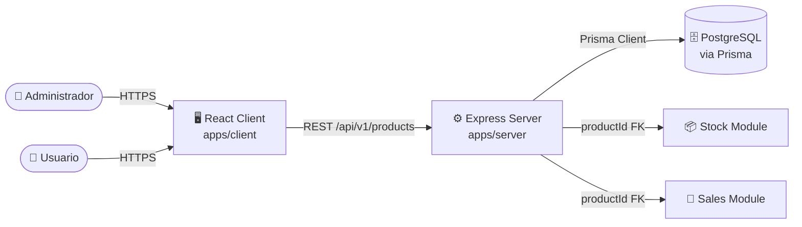
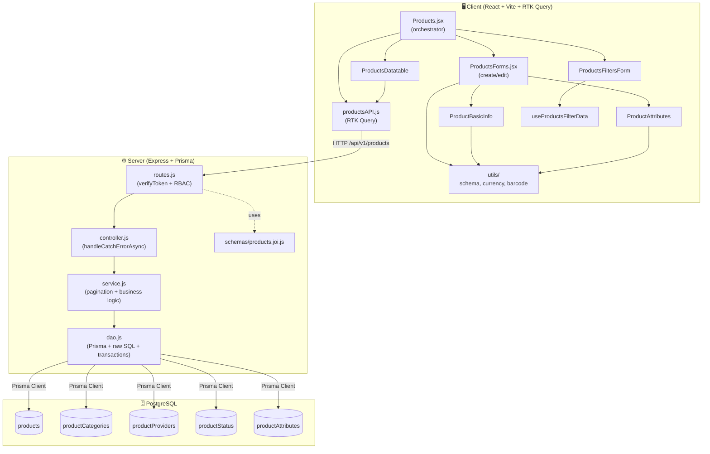
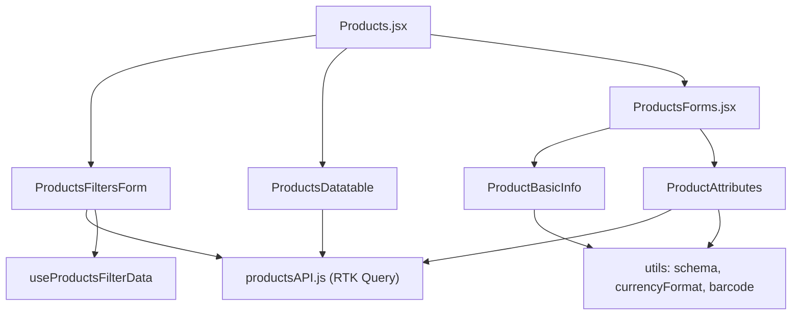
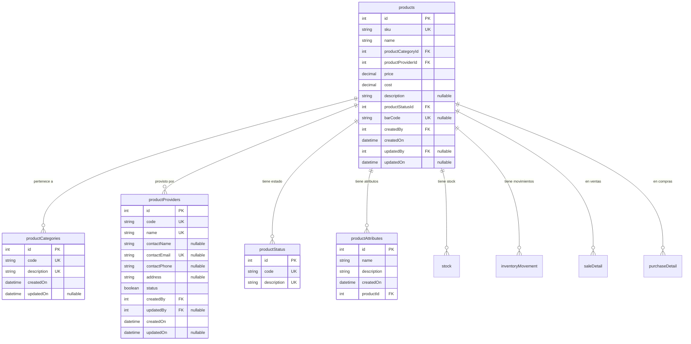

# Módulo: Products (Server + Client)

> Documentación técnica integral del módulo **Products** siguiendo un enfoque híbrido **arc42 / C4 Model / IEEE 1016**.
> Cubre tanto el backend (`apps/server/src/modules/products/`) como el frontend (`apps/client/src/modules/products/`).
>
> **Audiencia:** Arquitectos de software, Tech Leads, desarrolladores backend/frontend, revisores de código, auditores de seguridad y QA.

---

## Tabla de Contenidos

1. [Metadatos del Documento e Historial de Revisiones](#1-metadatos-del-documento-e-historial-de-revisiones)
2. [Introducción y Objetivos](#2-introducción-y-objetivos)
3. [Contexto y Alcance](#3-contexto-y-alcance)
4. [Restricciones](#4-restricciones)
5. [Stack Tecnológico](#5-stack-tecnológico)
6. [Arquitectura del Módulo (Overview)](#6-arquitectura-del-módulo-overview)
7. [Vista de Building Blocks — Server](#7-vista-de-building-blocks--server)
8. [Vista de Building Blocks — Client](#8-vista-de-building-blocks--client)
9. [Vista de Runtime y Flujo de Datos](#9-vista-de-runtime-y-flujo-de-datos)
10. [Modelo de Datos](#10-modelo-de-datos)
11. [Contratos de API](#11-contratos-de-api)
12. [Reglas de Validación y Esquemas](#12-reglas-de-validación-y-esquemas)
13. [Seguridad y Autorización](#13-seguridad-y-autorización)
14. [Manejo de Errores](#14-manejo-de-errores)
15. [Conceptos Transversales (Cross-Cutting)](#15-conceptos-transversales-cross-cutting)
16. [Requisitos de Calidad](#16-requisitos-de-calidad)
17. [Decisiones de Diseño (ADRs)](#17-decisiones-de-diseño-adrs)
18. [Riesgos y Deuda Técnica](#18-riesgos-y-deuda-técnica)
19. [Glosario](#19-glosario)
20. [Apéndices](#20-apéndices)

---

## 1. Metadatos del Documento e Historial de Revisiones

| Campo | Valor |
| ---------------- | ------------------------------------------------ |
| **Módulo** | `products` |
| **Estado** | Released / Implementado |
| **Versión** | `1.0.0` |
| **Owner** | Backend Guild — Express Track |
| **Path Server** | `apps/server/src/modules/products/` |
| **Path Client** | `apps/client/src/modules/products/` |
| **Base URL API** | `/api/v1/products` |
| **Estándar** | arc42 + C4 (L1/L2) + IEEE 1016 |
| **Audiencia** | Engineers, Architects, QA, Security Reviewers |

### Historial de Revisiones

| Versión | Fecha | Autor | Cambios |
| ------- | ----------- | ------------ | -------------------------------------------------------------------------------------------------- |
| 1.0.0 | 2026-06-11 | Docs Bot | Creación inicial del documento integral (server + client) siguiendo arc42/C4/IEEE 1016. Se documentan 12 endpoints server, 10 hooks RTK Query client, 5 componentes client, esquemas Joi/Zod, 4 modelos Prisma. |

---

## 2. Introducción y Objetivos

### 2.1 Propósito

El módulo **Products** gestiona el catálogo de productos del sistema. Proporciona CRUD completo de productos con soporte para categorías, proveedores, estados y atributos dinámicos. Cada producto tiene SKU único, precio, costo, código de barras opcional y está vinculado a stock, movimientos de inventario, ventas, compras y pedidos.

Funcionalidades principales:

- **Administración de Productos**: CRUD completo con SKU único y código de barras opcional.
- **Categorías y Proveedores**: Catálogos auxiliares vinculados a cada producto.
- **Atributos Dinámicos**: Gestión de atributos adicionales por producto (dimensiones, peso, etc.).
- **Filtros y Paginación**: Búsqueda por nombre, código de proveedor, categoría y estado.
- **Stock Vinculado**: Relación directa con el módulo de stock para control de inventario.

### 2.2 Alcance Funcional

| ID | Función | Actor | Cubre |
| ------ | ---------------------------------------------------------------- | --------- | --------------------------------------------------------------------------------------------------------- |
| F-001 | Listar productos con filtros y paginación | Autenticado | GET `/api/v1/products` con `checkRoleAuthOrPermisssion(canViewProduct)` |
| F-002 | Obtener productos para filtros UI | Autenticado | GET `/api/v1/products/` (segundo handler, sin validación de query) |
| F-003 | Obtener estados de producto | Autenticado | GET `/api/v1/products/status` |
| F-004 | Obtener categorías de producto | Autenticado | GET `/api/v1/products/category` |
| F-005 | Crear producto nuevo | ADMIN/MANAGER | POST `/api/v1/products` con `checkRoleAuthOrPermisssion(canCreateProduct)` |
| F-006 | Actualizar producto | ADMIN/MANAGER | PATCH `/api/v1/products/:id` con `checkRoleAuthOrPermisssion(canEditProduct)` |
| F-007 | Eliminar producto | ADMIN/MANAGER | DELETE `/api/v1/products/:id` con `checkRoleAuthOrPermisssion(canDeleteProduct)` |
| F-008 | Obtener atributos de producto | Autenticado | GET `/api/v1/products/attributes/:id` |
| F-009 | Guardar atributos de producto | ADMIN/MANAGER | POST `/api/v1/products/attributes/` |
| F-010 | Eliminar atributo de producto | ADMIN/MANAGER | DELETE `/api/v1/products/attributes/:id` |

### 2.3 Objetivos de Calidad

| ID | Prioridad | Objetivo |
| ----- | --------- | ------------------------------------------------------------------------------------------------------- |
| Q-001 | Alta | **SKU Único:** Validación de unicidad a nivel BD con constraint `@unique` en Prisma. |
| Q-002 | Alta | **Autorización RBAC:** Todos los endpoints requieren `verifyToken` + permiso específico. |
| Q-003 | Alta | **Validación Dual:** Joi en servidor para inputs, Zod en cliente para formularios. |
| Q-004 | Alta | **Integridad Referencial:** FK a `productCategories`, `productProviders`, `productStatus`. |
| Q-005 | Media | **Paginación Server-Side:** `getSafePagination` previene valores inválidos. |
| Q-006 | Media | **Trazabilidad:** `createdBy` / `updatedBy` vinculan cada producto al usuario responsable. |
| Q-007 | Media | **Transacciones Atómicas:** Guardado de atributos múltiples en una transacción Prisma. |

### 2.4 Stakeholders

| Rol | Interés |
| ------------------ | -------------------------------------------------------------------------------- |
| Product Owner | Catálogo de productos actualizado, búsqueda eficiente, atributos dinámicos. |
| Backend Engineer | Mantenimiento de routes/controller/service/DAO + Prisma. |
| Frontend Engineer | Mantenimiento de pages/components/API/utils. |
| Warehouse Manager | Consulta de productos, stock vinculado, atributos. |
| QA | Pruebas de CRUD, filtros, paginación, validación de SKU. |

---

## 3. Contexto y Alcance

### 3.1 Diagrama de Contexto (C4 Nivel 1)



### 3.2 Dentro del Alcance (In-Scope)

- Endpoints REST `/api/v1/products/*` con CRUD completo y gestión de atributos.
- Catálogos auxiliares: `productCategories`, `productProviders`, `productStatus`.
- Filtros por nombre, código de proveedor, categoría y estado.
- Paginación server-side con `take` / `skip`.
- Atributos dinámicos por producto con transacción atómica.
- Validación Joi (server) y Zod (client).
- Auditoría: `createdBy`, `updatedBy`, `createdOn`, `updatedOn`.

### 3.3 Fuera del Alcance (Out-of-Scope)

- Gestión de imágenes de producto (campo `picture` no implementado en server).
- Sincronización automática de stock (depende del módulo Stock).
- Precios por volumen o descuentos.
- Importación/exportación masiva de productos.
- Historial de versiones de producto.

---

## 4. Restricciones

| ID | Tipo | Restricción |
| ----- | ------------------- | ---------------------------------------------------------------------------------------------------------- |
| C-001 | Tecnológica | Backend: Express + Prisma + PostgreSQL (ver `apps/server/AGENTS.md`). |
| C-002 | Tecnológica | Frontend: React 18 + Vite + RTK Query + shadcn/ui (ver `apps/client/AGENTS.md`). |
| C-003 | Tecnológica | Todos los endpoints REST cuelgan del prefijo `/api/v1`. |
| C-004 | Base de Datos | `sku` es `VarChar(16)` con constraint `@unique` — no puede repetirse. |
| C-005 | Base de Datos | `barCode` es `VarChar(25)` con constraint `@unique` — opcional pero único si se provee. |
| C-006 | Validación | `sku` max 16 chars; `name` max 80; `description` max 2000; `barCode` max 25. |
| C-007 | Validación | `price` y `cost` son `Decimal(10,2)` con validación positiva. |
| C-008 | Seguridad | Sólo ADMIN/MANAGER pueden crear, editar o eliminar productos. |
| C-009 | Seguridad | `userId` se extrae exclusivamente del token JWT, nunca del body. |
| C-010 | Convencional | Path alias en cliente: `@/ → src/`. |

---

## 5. Stack Tecnológico

| Capa | Tecnología | Versión / Notas | Justificación |
| --------------------- | ------------------------------------- | ---------------------------------------- | ---------------------------------------------------------------------------- |
| **Server runtime** | Node.js | LTS (>= 18) | Compatibilidad con Prisma y Express. |
| **Server framework** | Express.js | 4.x | Estándar de facto, ecosistema maduro. |
| **Server ORM** | Prisma | Cliente Prisma | Type-safety; relaciones `productCategories`, `productProviders`, `productStatus`. |
| **Server DB** | PostgreSQL | Tipos `Decimal(10,2)`, `VarChar(N)`, `Timestamp(3)` | Tipado estricto para precios y constraints únicos. |
| **Server validación** | Joi | Esquemas en `products.joi.js` | Validación declarativa de entrada. |
| **Server auth** | JWT + middleware | `verifyToken` + `checkRoleAuthOrPermisssion` | Stateless; roles y permisos por claims. |
| **Client framework** | React | 18.x | Hooks, suspense, concurrent rendering. |
| **Client bundler** | Vite | 5.x+ | HMR rápido, ESM nativo. |
| **Client state/data** | Redux Toolkit + RTK Query | `createApi` con tags `Products`, `ProductAttributes` | Cache automático, invalidación por tags. |
| **Client UI** | shadcn/ui + Tailwind | DataTable, Dialog, Form, Select | Componentes accesibles y tematizables. |
| **Client forms** | react-hook-form + Zod | `@hookform/resolvers/zod` | Performance, validación tipada. |
| **Client i18n** | react-i18next | `useTranslation()` | Traducciones externas. |
| **Testing** | Vitest | Unit + Integration | Mismo runner server/client. |

---

## 6. Arquitectura del Módulo (Overview)

### 6.1 Estructura de Archivos

```text
project-one/
├── apps/
│   ├── server/
│   │   └── src/modules/products/
│   │       ├── routes.js                          # Express router (12 endpoints)
│   │       ├── controller.js                      # 10 handlers (async, decorados)
│   │       ├── service.js                         # Lógica de negocio + paginación
│   │       ├── dao.js                             # Prisma + raw SQL + transacciones
│   │       └── schemas/
│   │           └── products.joi.js                # Joi: create/filters/update/attributes
│   └── client/
│       └── src/modules/products/
│           ├── pages/
│           │   ├── Products.jsx                   # Orquestador lista + filtros
│           │   └── ProductsForms.jsx              # Formulario crear/editar
│           ├── api/
│           │   └── productsAPI.js                 # RTK Query (10 endpoints)
│           ├── components/
│           │   ├── ProductsDatatable.jsx          # Tabla de productos
│           │   ├── ProductsFiltersForm.jsx        # Filtros de búsqueda
│           │   ├── ProductBasicInfo.jsx           # Formulario info básica
│           │   ├── ProductAttributes.jsx          # Gestión de atributos
│           │   └── index.js                       # Barrel
│           ├── hooks/
│           │   ├── useProductsFilterData.js       # Hook de datos para filtros
│           │   └── index.js                       # Barrel
│           └── utils/
│               ├── schema.js                      # Zod: ProductsSchema, attributesSchema
│               ├── currencyFormat.js              # Formato de moneda
│               ├── barcode.js                     # Utilidades de código de barras
│               └── index.js                       # Barrel
└── docs/
    └── modules/
        └── products.md                            # Este documento
```

### 6.2 Diagrama de Contenedores (C4 Nivel 2)



---

## 7. Vista de Building Blocks — Server

### 7.1 Responsabilidades por Capa

| Capa | Archivo | Responsabilidad |
| ------------- | -------------------------------------- | ------------------------------------------------------------------------------------------- |
| **Rutas** | `routes.js` | Definir 12 endpoints, encadenar middleware (auth + RBAC + validación). |
| **Controlador** | `controller.js` | Recibir request HTTP, extraer datos sanitizados, delegar al servicio. |
| **Servicio** | `service.js` | Lógica de negocio: paginación, mapeo de datos, transformación de tipos. |
| **DAO** | `dao.js` | Persistencia Prisma: queries raw SQL con JOINs, CRUD, transacciones de atributos. |
| **Esquemas** | `schemas/products.joi.js` | Validación declarativa: 4 esquemas (create, filters, update, attributes). |

### 7.2 Rutas y Cadena de Middleware

| Método | Path | Middleware Chain | Handler |
| ------ | ------------------------- | ---------------------------------------------------------------------------------------- | ------------------------------------ |
| GET | `/` | `verifyToken` → `checkRoleAuthOrPermisssion` → `validateQueryParams(ProductsFilters)` | `getAllProducts` |
| GET | `/` | `verifyToken` → `checkRoleAuthOrPermisssion` | `getAllProductsFilters` |
| GET | `/status` | `verifyToken` → `checkRoleAuthOrPermisssion` | `getAllProductStatus` |
| GET | `/category` | `verifyToken` → `checkRoleAuthOrPermisssion` | `getAllProductCategories` |
| POST | `/` | `verifyToken` → `checkRoleAuthOrPermisssion` → `validateSchema(ProductsCreate)` | `createOne` |
| PATCH | `/:id` | `verifyToken` → `checkRoleAuthOrPermisssion` → `validatePathParam` → `validateSchema(ProductsUpdate)` | `patchById` |
| DELETE | `/:id` | `verifyToken` → `checkRoleAuthOrPermisssion` → `validatePathParam` | `deleteById` |
| GET | `/attributes/:id` | `verifyToken` → `checkRoleAuthOrPermisssion` → `validatePathParam` | `getAllProductAttributesByProductId` |
| POST | `/attributes/` | `verifyToken` → `checkRoleAuthOrPermisssion` → `validateSchema(ProductAttributes)` | `saveProductAttributes` |
| DELETE | `/attributes/:id` | `verifyToken` → `checkRoleAuthOrPermisssion` → `validatePathParam` | `deleteProductsAttributeById` |

> **Nota:** Se detectaron **2 rutas GET duplicadas en `/`** (líneas 22-30 y 32-39) que apuntan a handlers diferentes. Esto es un bug: Express usa la primera coincidencia.

### 7.3 Controladores (Funciones Exportadas)

| Función | Firma | Comportamiento | Status Code |
| -------------------------------- | ----------------------------------------------------- | --------------------------------------------------------------------------------- | ----------- |
| `getAllProducts` | `(req, res)` — Lee `req.safeQuery` | Filtros: name, productProviderCode, productCategoryCode, statusCode, page, limit | `200` |
| `getAllProductsFilters` | `(req, res)` | Obtiene todos los productos sin filtros (para UI) | `200` |
| `getAllProductStatus` | `(req, res)` | Obtiene catálogo de estados de producto | `200` |
| `getAllProductCategories` | `(req, res)` | Obtiene catálogo de categorías | `200` |
| `createOne` | `(req, res)` — Lee `req.userId`, `req.body` | Crea producto con datos completos | `201` |
| `patchById` | `(req, res)` — Lee `req.userId`, `req.params.id`, `req.body` | Actualización parcial de producto | `200` |
| `deleteById` | `(req, res)` — Lee `req.params.id` | Elimina producto por ID | `200` |
| `getAllProductAttributesByProductId` | `(req, res)` — Lee `req.params.id` | Obtiene atributos de un producto | `200` |
| `saveProductAttributes` | `(req, res)` — Lee `req.body` | Guarda/actualiza atributos (transacción) | `201` |
| `deleteProductsAttributeById` | `(req, res)` — Lee `req.params.id` | Elimina un atributo por ID | `200` |

### 7.4 Servicios (Lógica de Negocio)

| Función | Firma | Reglas Aplicadas |
| -------------------------------- | ------------------------------------------------------------ | --------------------------------------------------------------------------------- |
| `getAllProducts` | `({ name, productProviderCode, productCategoryCode, statusCode, limit, page })` | Aplica `getSafePagination`, valida `take > 0`, delega al DAO con filtros. |
| `createOne` | `(userId, data)` | Convierte tipos (String, Number), setea `createdOn`, `createdBy`. |
| `patchById` | `(userId, id, data)` | Convierte `id` a Number, setea `updatedOn`, `updatedBy`. |
| `updateById` | `(userId, id, data)` | Ídem `patchById` — función duplicada sin uso en rutas. |
| `deleteById` | `(id)` | Convierte `id` a Number, delega al DAO. |
| `saveProductAttributes` | `(data)` | Pasa-through al DAO (no hay lógica adicional). |

### 7.5 DAO (Acceso a Datos)

| Función | Query Type | Comportamiento |
| -------------------------------- | ----------- | ------------------------------------------------------------------------------------- |
| `getAllProducts` | Raw SQL (`$queryRaw`) + Prisma count | JOIN a `productCategories`, `productProviders`, `productStatus`, `users` (createdBy/updatedBy). `WHERE` dinámico con filtros. `count` con Prisma ORM. |
| `getAllProductsFilters` | Prisma ORM | `findMany()` simple para poblar selects UI. |
| `getAllProductStatus` | Prisma ORM | `findMany()` en `productStatus`. |
| `getAllProductCategories` | Prisma ORM | `findMany()` en `productCategories`. |
| `createRow` | Prisma ORM | `create` con conectores a `productCategories`, `productProviders`, `productStatus`, `userProductCreated`. |
| `updateRow` | Prisma ORM | `update` con `connect` condicional para FKs + `userProductUpdated`. |
| `deleteRow` | Generic DAO | `prismaService.deleteRow(tableName, where)` genérico. |
| `getAllProductAttributesByProductId` | Prisma ORM | `findMany` con `where: { productId }`. |
| `saveProductAttributes` | Prisma `$transaction` | Mapea cada atributo: si tiene `id` → `update`, si no → `create`. Transacción atómica. |
| `deleteProductsAttributeById` | Generic DAO | `prismaService.deleteRow` sobre `productAttributes`. |

### 7.6 Utilidades Compartidas (Server)

- **`getSafePagination(pagination)`** → Calcula `take`/`skip` seguros desde `page`/`limit`.
- **`prismaService.deleteRow(tableName, where)`** → Helper genérico para borrados.

---

## 8. Vista de Building Blocks — Client

### 8.1 Orquestador de Página

**`Products.jsx`**: Orquestador principal de la lista de productos. Gestiona:
- Estado de paginación (`pageIndex`, `pageSize`) con `useState`.
- Estado de filtros con `useState`.
- Efecto reactivo para disparar `useLazyGetAllProductsQuery` ante cambios de paginación/filtros.
- Hook `useProductsFilterData` para cargar datos de catálogos (status, categories, providers).
- Hook `useLoadingState` para estados de carga combinados.
- Navegación a `ProductsForms.jsx` con `location.state.row`.

**`ProductsForms.jsx`**: Página de formulario para creación/edición de productos.

### 8.2 Árbol de Componentes



### 8.3 Especificación de Componentes

| Componente | Archivo | Props | Descripción |
| ----------- | ------- | ----- | ----------- |
| `ProductsFiltersForm` | `components/ProductsFiltersForm.jsx` | `onSubmit`, `onOpenProductsForms`, `datastatus`, `dataCategory`, `dataProviders` | Formulario de búsqueda con selects de estado, categoría, proveedor. |
| `ProductsDatatable` | `components/ProductsDatatable.jsx` | `dataProducts`, `onOpenProductsForms`, `pagination`, `onPaginationChange` | DataTable con columnas de producto. |
| `ProductBasicInfo` | `components/ProductBasicInfo.jsx` | `onSubmit`, `selectedRow`, `dataStatus`, `dataCategory`, `dataProviders` | Formulario de info básica del producto. |
| `ProductAttributes` | `components/ProductAttributes.jsx` | `productId`, `onSave` | Gestión de atributos dinámicos del producto. |

### 8.4 Endpoints RTK Query

| Hook | Endpoint | Tags |
| ----- | -------- | ---- |
| `useLazyGetAllProductsQuery` | `GET /products` | `Products` |
| `useGetAllProductsFiltersQuery` | `GET /products/productsFilters` | `Products` |
| `useGetAllProductsStatusQuery` | `GET /products/status` | — |
| `useGetAllProductCategoriesQuery` | `GET /products/category` | — |
| `useCreateProductMutation` | `POST /products/` | `Products` |
| `useUpdateProductByIdMutation` | `PATCH /products/:id` | `Products` |
| `useDeleteProductByIdMutation` | `DELETE /products/:id` | `Products` |
| `useLazyGetAllProductAttributesQuery` | `GET /products/attributes/:id` | — (lazy) |
| `useSaveProductAttributesMutation` | `POST /products/attributes/` | `ProductAttributes` |
| `useDeleteProductAttributeByIdMutation` | `DELETE /products/attributes/:id` | `ProductAttributes` |

> **Nota:** El endpoint `GET /products/productsFilters` en el cliente (`/productsFilters`) no coincide con el server (`GET /` con handler `getAllProductsFilters`). Esto causará un error 404 en cliente.

### 8.5 Utilidades del Cliente

| Archivo | Propósito |
| -------- | --------- |
| `utils/schema.js` | Esquemas Zod: `ProductsSchema` (validación de formulario), `attributesSchema` (validación de atributos). |
| `utils/currencyFormat.js` | Formateo de moneda para precios/costos. |
| `utils/barcode.js` | Utilidades para manejo de códigos de barras. |
| `hooks/useProductsFilterData.js` | Hook que agrupa consultas de catálogos (status, categories, providers). |

---

## 9. Vista de Runtime y Flujo de Datos

### 9.1 Flujo de Listado con Filtros (Happy Path)

1. Usuario abre `Products.jsx`.
2. `useProductsFilterData` dispara 3 queries paralelas: status, categories, providers.
3. `useEffect` dispara `trigger()` con valores iniciales (page=1, limit=20).
4. Server: `getSafePagination` → `getAllProducts` con raw SQL JOIN + filters → `decryptResults` si aplica.
5. Cliente renderiza `ProductsDatatable` con datos y controles de paginación.
6. Usuario cambia filtro → `handleSubmitFilters` resetea página a 0 → `useEffect` redispara.

### 9.2 Flujo de Creación de Producto

1. Usuario navega a `ProductsForms.jsx` (nuevo).
2. Completa formulario: SKU, nombre, categoría, proveedor, precio, costo, estado.
3. `ProductsSchema` (Zod) valida en cliente.
4. `createProduct` mutation → `POST /api/v1/products`.
5. Server: Joi valida `ProductsCreate` → `createOne` en service → `createRow` en DAO con conectores.
6. Response `201 Created` → invalida tag `Products` → refetch lista.

### 9.3 Flujo de Atributos (Transacción)

1. Usuario agrega/edita atributos en `ProductAttributes`.
2. `saveProductAttributes` mutation → `POST /api/v1/products/attributes/`.
3. Server: Joi valida `ProductAttributes` → `saveProductAttributes` service → DAO ejecuta `$transaction`.
4. Por cada atributo: si tiene `id` → `update`, si no → `create`.
5. Response `201 Created` → invalida tag `ProductAttributes`.

---

## 10. Modelo de Datos

### 10.1 Diagrama ER



### 10.2 Tablas (columnas, tipos, constraints)

**`products`**

| Columna | Tipo | Constraint | Notas |
| --------- | ---- | ---------- | ----- |
| `id` | `Int` | PK, autoincrement | |
| `sku` | `VarChar(16)` | `@unique` | Código único de producto |
| `name` | `VarChar(80)` | | Nombre del producto |
| `productCategoryId` | `Int` | FK → `productCategories.id` | |
| `productProviderId` | `Int` | FK → `productProviders.id` | |
| `price` | `Decimal(10,2)` | | Precio de venta |
| `cost` | `Decimal(10,2)` | | Costo del producto |
| `description` | `VarChar(2000)` | nullable | |
| `productStatusId` | `Int` | FK → `productStatus.id` | |
| `barCode` | `VarChar(25)` | `@unique`, nullable | Código de barras |
| `createdBy` | `Int` | FK → `users.id` | |
| `createdOn` | `Timestamp(3)` | | |
| `updatedBy` | `Int` | FK → `users.id`, nullable | |
| `updatedOn` | `Timestamp(3)` | nullable | |

**`productCategories`**

| Columna | Tipo | Constraint |
| --------- | ---- | ---------- |
| `id` | `Int` | PK, autoincrement |
| `code` | `VarChar(3)` | `@unique` |
| `description` | `VarChar(50)` | `@unique` |
| `createdOn` | `Timestamp(3)` | |
| `updatedOn` | `Timestamp(3)` | nullable |

**`productStatus`**

| Columna | Tipo | Constraint |
| --------- | ---- | ---------- |
| `id` | `Int` | PK, autoincrement |
| `code` | `VarChar(3)` | `@unique` |
| `description` | `VarChar(10)` | `@unique` |

**`productAttributes`**

| Columna | Tipo | Constraint |
| --------- | ---- | ---------- |
| `id` | `Int` | PK, autoincrement |
| `name` | `VarChar(50)` | |
| `description` | `VarChar(100)` | |
| `createdOn` | `Timestamp(3)` | |
| `productId` | `Int` | FK → `products.id`, `onDelete: Cascade` |

### 10.3 Catálogos

- **`productStatus`**: Valores típicos como `ACT` (Activo), `INA` (Inactivo), `DIS` (Descontinuado).
- **`productCategories`**: Categorizado por código de 3 caracteres (ej: `ELE` para Electrónica, `ROp` para Ropa).
- **`productProviders`**: Proveedores con datos de contacto (nombre, email, teléfono, dirección).

### 10.4 Alineación de Field Limits

| Campo | Server (Joi/Prisma) | Client (Zod) | Coinciden |
| --------- | ------------------- | ------------ | --------- |
| `sku` | max 16 | max 16 | ✅ |
| `name` | max 80 | max 80 | ✅ |
| `description` | max 2000 | — (sin validación) | ⚠️ Sólo server |
| `price` | Decimal(10,2), positivo | positivo, multipleOf(0.01) | ✅ |
| `cost` | Decimal(10,2), positivo | positivo, multipleOf(0.01) | ✅ |
| `barCode` | max 25 | — (sin validación) | ⚠️ Sólo server |
| Atributo `name` | max 50 | max 50 | ✅ |
| Atributo `description` | max 50 | max 100 | ❌ **MISMATCH** (50 vs 100) |

---

## 11. Contratos de API

### 11.1 `GET /api/v1/products` — Listar productos

**Permiso:** `canViewProduct` (ADMIN, MANAGER, USER)

**Query Parameters:**

| Parámetro | Tipo | Requerido | Descripción |
| --------- | ---- | --------- | ----------- |
| `name` | string | No | Filtro por nombre (ILIKE) |
| `productProviderCode` | string(3) | No | Código de proveedor |
| `productCategoryCode` | string(3) | No | Código de categoría |
| `statusCode` | string(3) | No | Código de estado |
| `page` | integer | No | Número de página |
| `limit` | integer | No | Items por página |

**Response `200`:**

```json
{
  "dataList": [
    {
      "id": 1,
      "sku": "LAP001",
      "name": "Laptop Gamer",
      "price": "1500.00",
      "cost": "1200.00",
      "categoryDescription": "Electrónica",
      "providerDescription": "TechCorp",
      "statusDescription": "ACTIVO",
      "userProductCreatedName": "Admin",
      "userProductUpdatedName": null
    }
  ],
  "total": 42
}
```

### 11.2 `POST /api/v1/products` — Crear producto

**Permiso:** `canCreateProduct` (ADMIN, MANAGER)

**Body:**

```json
{
  "sku": "LAP001",
  "name": "Laptop Gamer",
  "productCategoryId": 1,
  "productProviderId": 2,
  "price": 1500.00,
  "cost": 1200.00,
  "description": "Laptop de alta gama para gaming",
  "productStatusId": 1,
  "barCode": "8901234567890"
}
```

**Response `201`:**

```json
{
  "error": false,
  "statusCode": 201,
  "message": "Item created successfully",
  "data": { ... }
}
```

### 11.3 `PATCH /api/v1/products/:id` — Actualizar producto

**Permiso:** `canEditProduct` (ADMIN, MANAGER)

**Body:** Cualquier campo de producto (parcial).

### 11.4 `DELETE /api/v1/products/:id` — Eliminar producto

**Permiso:** `canDeleteProduct` (ADMIN, MANAGER)

**Response `200`:**

```json
{ "error": false, "statusCode": 200, "message": "Items deleted successfully" }
```

### 11.5 `GET /api/v1/products/attributes/:id` — Obtener atributos

**Response `200`:**

```json
[
  { "id": 1, "name": "Peso", "description": "2.5 kg", "createdOn": "2026-01-01T00:00:00.000Z", "productId": 1 }
]
```

### 11.6 `POST /api/v1/products/attributes/` — Guardar atributos

**Body:**

```json
[
  { "name": "Peso", "description": "2.5 kg", "createdOn": "2026-01-01T00:00:00.000Z", "productId": 1 },
  { "id": 3, "name": "Color", "description": "Negro", "createdOn": "2026-01-01T00:00:00.000Z", "productId": 1 }
]
```

---

## 12. Reglas de Validación y Esquemas

### 12.1 Server (Joi) — `products.joi.js`

| Esquema | Reglas |
| -------- | ----- |
| `ProductsCreate` | `sku`: max 16, required. `name`: max 80, required. `productCategoryId`: integer, required. `productProviderId`: integer, required. `price`: número positivo, precision(2), required. `cost`: número positivo, precision(2), required. `description`: max 2000, allow null. `productStatusId`: integer, required. `barCode`: max 25, allow null. |
| `ProductsFilters` | `name`: max 80, allow empty. `statusCode`: exact 3. `productProviderCode`: exact 3. `productCategoryCode`: exact 3. `limit`, `page`: integer. |
| `ProductsUpdate` | Campos igual que `ProductsCreate` pero todos opcionales. |
| `ProductAttributes` | Array de objetos: `id`: integer opcional. `name`: max 50, required. `description`: max 50, required. `createdOn`: date, required. `productId`: integer, required. |

### 12.2 Client (Zod) — `schema.js`

| Esquema | Reglas |
| -------- | ----- |
| `ProductsSchema` | `sku`: max 16, min 1. `name`: max 80, min 1. `category`: objeto con `id`. `status`: objeto con `id`. `provider`: objeto con `id`. `price`: string → número, positivo, multipleOf(0.01). `cost`: string → número, positivo, multipleOf(0.01). |
| `attributesSchema` | Array de `attributeSchema`: `createdOn`: date o string. `name`: max 50, min 1. `description`: max 100, min 1. `save`: boolean opcional. Array min 1. |

---

## 13. Seguridad y Autorización

### 13.1 Control de Acceso

- **Autenticación**: Middleware `verifyToken` aplicado globalmente en el router. Valida JWT en header `Authorization`.
- **Autorización**: `checkRoleAuthOrPermisssion` con permisos específicos:
  - Lectura (GET): `canViewProduct` — ADMIN, MANAGER, USER.
  - Creación (POST): `canCreateProduct` — ADMIN, MANAGER.
  - Edición (PATCH): `canEditProduct` — ADMIN, MANAGER.
  - Eliminación (DELETE): `canDeleteProduct` — ADMIN, MANAGER.

### 13.2 Protección de Datos

- `userId` se extrae exclusivamente del token JWT (`req.userId`).
- Los campos de auditoría (`createdBy`, `updatedBy`) se inyectan desde el token, nunca del body.

---

## 14. Manejo de Errores

| Situación | Status Code | Formato |
| --------- | ----------- | ------- |
| Validación fallida (Joi) | `400` | `{ error: true, statusCode: 400, message: "...", details: [...] }` |
| Autenticación inválida | `401` | `{ error: true, statusCode: 401, message: "Unauthorized" }` |
| Permiso denegado | `403` | `{ error: true, statusCode: 403, message: "Forbidden" }` |
| SKU duplicado | `500` (Prisma P2002) | Capturado por `handleCatchErrorAsync` |
| Éxito | `200`/`201` | `{ error: false, statusCode, message, data? }` |

---

## 15. Conceptos Transversales (Cross-Cutting)

| Concepto | Descripción |
| --------- | ----------- |
| **Paginación** | `getSafePagination(page, limit)` en service. `page` ≥ 1, `limit` > 0. |
| **Auditoría** | `createdBy`/`createdOn` en creación, `updatedBy`/`updatedOn` en actualización. |
| **Transacciones** | `$transaction` de Prisma para guardado de atributos múltiples. |
| **Cache Cliente** | RTK Query con tags `Products` (5 min), invalidación tras mutaciones. |

---

## 16. Requisitos de Calidad

| ID | Prioridad | Objetivo | Métrica |
| --- | --------- | -------- | ------- |
| Q-001 | Alta | SKU único | Constraint BD + validación Joi |
| Q-002 | Alta | Autorización RBAC en todos los endpoints | Revisión de rutas |
| Q-003 | Alta | Validación bilateral Joi + Zod | Tests de esquemas |
| Q-004 | Media | Paginación funcional | `take`/`skip` correctos |
| Q-005 | Media | Cache eficiente en cliente | RTK Query tags |
| Q-006 | Baja | i18n en UI | Traducciones react-i18next |

---

## 17. Decisiones de Diseño (ADRs)

### ADR-001: Raw SQL para listado con JOINs

**Contexto:** `getAllProducts` requiere JOINs a 5 tablas con filtros dinámicos.

**Decisión:** Usar `$queryRaw` con `Prisma.sql` tag para optimizar performance, combinado con `prisma.products.count()` para el total.

**Consecuencias:** Mayor control sobre la query SQL, pero riesgo de SQL injection mitigado por template tags de Prisma. El `count` usa un approach ORM diferente (Prisma `where`) duplicando la lógica de filtros.

### ADR-002: Transacción para atributos múltiples

**Contexto:** `saveProductAttributes` recibe un array de atributos que pueden ser nuevos o existentes.

**Decisión:** Usar `prisma.$transaction` para ejecutar `update`/`create` por cada atributo en una sola transacción atómica.

**Consecuencias:** Atomicidad garantizada, pero no hay rollback si falla un elemento (Prisma maneja rollback automático en transacciones).

### ADR-003: DAO genérico para delete

**Contexto:** `deleteRow` y `deleteProductsAttributeById` siguen el mismo patrón.

**Decisión:** Usar `prismaService.deleteRow(tableName, where)` como wrapper genérico.

**Consecuencias:** Menos código duplicado, pero acoplamiento a la función genérica.

---

## 18. Riesgos y Deuda Técnica

| ID | Riesgo | Impacto | Mitigación |
| --- | ------ | ------- | ---------- |
| R-001 | **Rutas GET duplicadas en `/`**: 2 handlers para el mismo path. Express ejecuta solo el primero. | Alto | Unificar en una sola ruta con lógica condicional o eliminar el handler redundante. |
| R-002 | **Endpoint `/productsFilters` en cliente no existe en server**: Cliente llama `GET /products/productsFilters`, server espera `GET /`. | Alto | Corregir URL en `productsAPI.js` o añadir ruta en server. |
| R-003 | **Field limit mismatch**: `productAttributes.description` tiene max 50 en Joi pero max 100 en Zod. | Medio | Alinear a 50 en ambos lados (el menor). |
| R-004 | **Sin manejo de errores para SKU duplicado**: Prisma lanza P2002 que se traduce a 500. | Medio | Añadir catch específico para P2002 y responder 409 Conflict. |
| R-005 | **`updateById` no se usa**: Función duplicada de `patchById` sin ruta asociada. | Bajo | Eliminar función no utilizada. |
| R-006 | **Sin validación client para `description` y `barCode`**: Zod no valida estos campos. | Bajo | Añadir validaciones en `ProductsSchema`. |
| R-007 | **Sin test unitarios**: No se encontraron tests para el módulo products. | Medio | Implementar tests unitarios para service y DAO. |

---

## 19. Glosario

| Término | Definición |
| ------- | ---------- |
| **SKU** | Stock Keeping Unit — identificador único del producto. |
| **RBAC** | Role-Based Access Control — control de acceso basado en roles. |
| **DAO** | Data Access Object — capa de acceso a datos. |
| **RTK Query** | Redux Toolkit Query — herramienta de fetching y caché. |
| **Paginación** | División de resultados en páginas con `take`/`skip`. |
| **Transacción** | Operación atómica de base de datos (todo o nada). |
| **Field Limit** | Límite de caracteres para campos de texto. |

---

## 20. Apéndices

### A. Referencias

- [Prisma Client API](https://www.prisma.io/docs/reference/api-client)
- [Joi Validation](https://joi.dev/api/)
- [Zod Documentation](https://zod.dev/)
- [RTK Query createApi](https://redux-toolkit.js.org/api/createApi)

### B. Dependencias Cross-Module

| Módulo | Relación |
| ------ | -------- |
| Stock | `products.id` → `stock.productId` |
| Sales | `products.id` → `saleDetail.productId` |
| Purchase | `products.id` → `purchaseDetail.productId` |
| InventoryMovement | `products.id` → `inventoryMovement.productId` |

### C. Archivos Legacy a Reemplazar

| Archivo Legacy | Reemplazado Por |
| -------------- | --------------- |
| (ninguno para products) | — |
