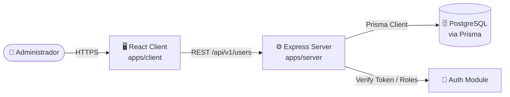
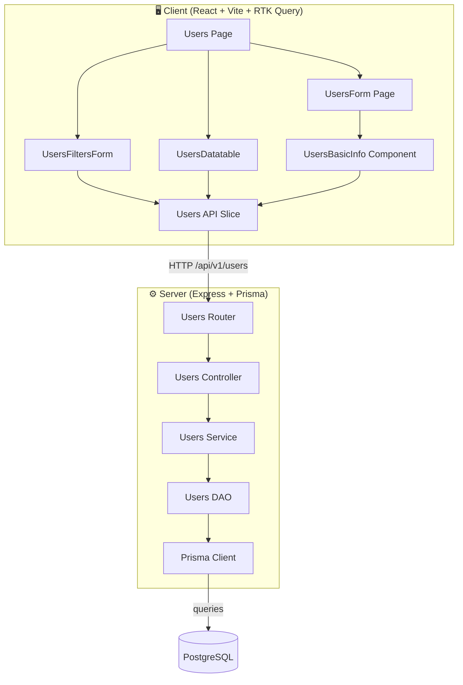

# Módulo: Users (Server + Client)

> Documentación técnica integral del módulo **Users** siguiendo un enfoque híbrido **arc42 / C4 Model / IEEE 1016**.
> Cubre tanto el backend (`apps/server/src/modules/users/`) como el frontend (`apps/client/src/modules/users/`).
>
> **Audiencia:** Arquitectos de software, Tech Leads, desarrolladores backend/frontend, revisores de código, auditores de seguridad y QA.

---

## Tabla de Contenidos

1. [Metadatos del Documento e Historial de Revisiones](#1-metadatos-del-documento-e-historial-de-revisiones)
2. [Introducción y Objetivos](#2-introducción-y-objetivos)
3. [Contexto y Alcance](#3-contexto-y-alcance)
4. [Restricciones](#4-restricciones)
5. [Stack Tecnológico](#5-stack-tecnológico)
6. [Arquitectura del Módulo (Overview)](#6-arquitectura-del-módulo-overview)
7. [Vista de Building Blocks — Server](#7-vista-de-building-blocks--server)
8. [Vista de Building Blocks — Client](#8-vista-de-building-blocks--client)
9. [Vista de Runtime y Flujo de Datos](#9-vista-de-runtime-y-flujo-de-datos)
10. [Modelo de Datos](#10-modelo-de-datos)
11. [Contratos de API](#11-contratos-de-api)
12. [Reglas de Validación y Esquemas](#12-reglas-de-validación-y-esquemas)
13. [Seguridad y Autorización](#13-seguridad-y-autorización)
14. [Manejo de Errores](#14-manejo-de-errores)
15. [Conceptos Transversales (Cross-Cutting)](#15-conceptos-transversales-cross-cutting)
16. [Requisitos de Calidad](#16-requisitos-de-calidad)
17. [Decisiones de Diseño (ADRs)](#17-decisiones-de-diseño-adrs)
18. [Riesgos y Deuda Técnica](#18-riesgos-y-deuda-técnica)
19. [Glosario](#19-glosario)
20. [Apéndices](#20-apéndices)

---

## 1. Metadatos del Documento e Historial de Revisiones

| Campo | Valor |
| ---------------- | ------------------------------------------------ |
| **Módulo** | `users` |
| **Estado** | Released / Implementado (con bugs críticos detectados) |
| **Versión** | `1.0.0` |
| **Owner** | Backend Guild — Express Track |
| **Path Server** | `apps/server/src/modules/users/` |
| **Path Client** | `apps/client/src/modules/users/` |
| **Base URL API** | `/api/v1/users` |
| **Estándar** | arc42 + C4 (L1/L2) + IEEE 1016 |
| **Audiencia** | Engineers, Architects, QA, Security Reviewers |

### Historial de Revisiones

| Versión | Fecha | Autor | Cambios |
| ------- | ----------- | ------------ | -------------------------------------------------------------------------------------------------- |
| 1.0.0 | 2026-06-11 | Orchestrator | Creación inicial del documento integral (server + client) siguiendo arc42/C4/IEEE 1016. Documenta 7 endpoints server, gestión de roles/permisos, CRUD, filtros y paginación. Se detectan 6 bugs críticos (R-001 a R-006). |

---

## 2. Introducción y Objetivos

### 2.1 Propósito

El módulo **Users** es el núcleo de gestión de identidad y acceso del sistema. Permite la administración completa de los usuarios del sistema, asignando roles (RBAC) y permisos granulares. Gestiona datos personales, laborales y el estado operativo de cada cuenta.

Funcionalidades principales:
- **Administración de Usuarios**: CRUD completo de cuentas de usuario.
- **Gestión de Roles**: Asignación de roles predefinidos (ADMIN, MANAGER, etc.).
- **Permisos Granulares**: Asignación de permisos específicos a usuarios individuales.
- **Búsqueda y Filtrado**: Filtrado avanzado por nombre, email y estado con paginación server-side.
- **Auditoría Básica**: Registro de quién creó/modificó el usuario y cuándo.

### 2.2 Alcance Funcional

| ID | Función | Actor | Cubre |
| ------ | ---------------------------------------------------------------- | --------- | --------------------------------------------------------------------------------------------------------- |
| F-001 | Listar usuarios con filtros y paginación | Autenticado | GET `/api/v1/users` con `checkRoleAuthOrPermisssion(canViewUser)` |
| F-002 | Crear usuario nuevo | Autenticado | POST `/api/v1/users` con `checkRoleAuthOrPermisssion(canCreateUser)` |
| F-003 | Editar perfil de usuario | Autenticado | PATCH `/api/v1/users/:id` con `checkRoleAuthOrPermisssion(canEditUser)` |
| F-004 | Eliminar usuario | Autenticado | DELETE `/api/v1/users/:id` con `checkRoleAuthOrPermisssion(canDeleteUser)` |
| F-005 | Gestionar permisos individuales | Autenticado | PATCH `/api/v1/users/:id` (vía `selectedPermissions`) |
| F-006 | Consultar catálogo de Roles y Estados | Autenticado | GET `/api/v1/users/roles` y GET `/api/v1/users/status` |
| F-007 | Filtrar usuarios por estado | Autenticado | GET `/api/v1/users/by-status` |

### 2.3 Objetivos de Calidad

| ID | Prioridad | Objetivo |
| ----- | --------- | ------------------------------------------------------------------------------------------------------- |
| Q-001 | Alta | **Autorización Robusta:** Implementación de `verifyToken` y `checkRoleAuthOrPermisssion` en todos los endpoints. |
| Q-002 | Alta | **Cifrado de Datos:** Uso de `decryptResults` para manejar campos sensibles cifrados en la DB. |
| Q-003 | Alta | **Integridad Referencial:** Validación de existencia de roles y estados vía FKs de PostgreSQL. |
| Q-004 | Media | **Eficiencia de Red:** Optimización de actualizaciones mediante `pickDirty` (solo envía campos modificados). |
| Q-005 | Media | **UX Fluida:** Integración de RTK Query con cache de 5 minutos y estados de carga globales. |

### 2.4 Stakeholders

| Rol | Interés |
| ------------------ | -------------------------------------------------------------------------------- |
| System Administrator | Gestión de cuentas, roles y permisos del sistema. |
| Backend Engineer | Mantenimiento de la arquitectura DAO/Service/Controller y esquemas Joi. |
| Frontend Engineer | Mantenimiento de formularios reactivos (RHF) y datatables. |
| QA Engineer | Validación de filtros, permisos y casos de borde en la creación de usuarios. |

---

## 3. Contexto y Alcance

### 3.1 Diagrama de Contexto (C4 Nivel 1)

### 3.2 Dentro del Alcance (In-Scope)

- Endpoints REST para gestión de usuarios, roles y estados.
- Lógica de asignación de permisos individuales (relación N:M `userPermits`).
- Implementación de paginación reactiva en el cliente.
- Cifrado/Descifrado de datos sensibles en la capa de DAO.
- Validación de esquemas de entrada mediante Joi (Server) y Zod (Client).

### 3.3 Fuera del Alcance (Out-of-Scope)

- Gestión de contraseñas (reset de password, MFA) — responsabilidad del módulo Auth.
- Auditoría detallada de cambios (historial de versiones del registro).
- Importación masiva de usuarios desde CSV/Excel.
- Gestión de perfiles públicos de usuario.

---

## 4. Restricciones

| ID | Tipo | Restricción |
| ----- | ------------------- | ---------------------------------------------------------------------------------------------------------- |
| C-001 | Tecnológica | Backend: Express + Prisma + PostgreSQL. |
| C-002 | Tecnológica | Frontend: React 18 + RTK Query + React Hook Form. |
| C-003 | Seguridad | Todos los endpoints requieren token JWT válido. |
| C-004 | Seguridad | El acceso está restringido por permisos específicos (ej. `canViewUser`). |
| C-005 | Datos | Los emails deben ser únicos en la tabla `users`. |
| C-006 | Datos | Los IDs de roles y estados deben existir previamente en sus tablas maestras. |

---

## 5. Stack Tecnológico

| Capa | Tecnología | Versión / Notas | Justificación |
| --------------------- | ----------------------------------------------------- | -------------------------------------------------------- | ---------------------------------------------------------------------------- |
| **Server runtime** | Node.js | LTS (>= 18) | Estabilidad y compatibilidad. |
| **Server framework** | Express.js | 4.x | Flexibilidad en la definición de rutas y middleware. |
| **Server ORM** | Prisma | Cliente Prisma | Type-safety y facilidad de manejo de relaciones complejas. |
| **Database** | PostgreSQL | 14+ | Soporte para tipos de datos robustos y transacciones ACID. |
| **Validation** | Joi (Server) / Zod (Client) | - | Validación dual para redundancia y seguridad. |
| **Frontend** | React 18 + RTK Query | - | Gestión de estado global y sincronización eficiente con API. |

---

## 6. Arquitectura del Módulo (Overview)

### 6.1 Diagrama de Componentes (C4 Nivel 2)

### 6.2 Flujo de Datos Principal

1. **Lectura**: `UsersPage` → `UsersAPI` → `UsersRoutes` → `UsersCtrl` → `UsersSvc` → `UsersDao` → `Prisma` → `decryptResults` → `UsersTable`.
2. **Actualización**: `UsersBasicInfo` → `pickDirty` → `UsersAPI` → `patchUserById` → `UsersDao` → `prisma.update`.

---

## 7. Vista de Building Blocks — Server

### 7.1 Router (`routes.js`)
Define 7 endpoints con el stack de middleware: `verifyToken` → `checkRoleAuthOrPermisssion` → `validateSchema` → `Controller`.

### 7.2 Controller (`controller.js`)
Capa delgada que orquestra la petición. Usa `handleCatchErrorAsync` para capturar errores asíncronos y `globalResponse` para formatear respuestas.

### 7.3 Service (`service.js`)
Contiene la lógica de negocio. Realiza transformaciones de datos (ej. mapeo de `name` a `label` en `getUsersByStatus`) y gestiona la paginación mediante `getSafePagination`.

### 7.4 DAO (`dao.js`)
Interacción directa con la base de datos:
- Consultas Raw SQL (`$queryRaw`) para optimizar JOINs complejos en `getAllUsers`.
- Descifrado de datos sensibles mediante `decryptResults`.
- Lógica de actualización parcial (PATCH) y la sustitución de permisos mediante el patrón `deleteMany` + `create`.

---

## 8. Vista de Building Blocks — Client

### 8.1 Pages
- **Users Page**: Orquestador de la vista de lista. Maneja el estado de filtros y paginación en un `useEffect` reactivo.
- **UsersForm Page**: Página de edición. Recupera el usuario seleccionado vía `location.state` y gestiona el diálogo de alerta para eliminaciones.

### 8.2 Components
- **UsersFiltersForm**: Formulario de criterios de búsqueda.
- **UsersDatatable**: Visualización de datos con columnas detalladas y acción de apertura de formulario.
- **UsersBasicInfo**: Formulario complejo organizado en Accordions. Utiliza `useWatch` para monitorear cambios en tiempo real y `pickDirty` para optimizar el payload de actualización.

### 8.3 API Slice (`usersApi.js`)
Implementa RTK Query para el fetching. Utiliza tags (`Users`) para invalidar el cache y forzar el refresco de datos tras mutaciones.

---

## 9. Vista de Runtime y Flujo de Datos

### 9.1 Flujo de Filtrado y Paginación
1. El usuario cambia un filtro en `UsersFiltersForm`.
2. `handleSubmitFilters` resetea la página a 0 y actualiza el estado `filters`.
3. El `useEffect` en `Users.jsx` detecta el cambio y dispara la query `getAllUsers` con los nuevos parámetros.
4. El servidor calcula `take` y `skip` y devuelve la lista cifrada + el total de registros.
5. El cliente renderiza la tabla y la paginación.

### 9.2 Flujo de Edición Optimizada
1. `UsersBasicInfo` utiliza `react-hook-form`.
2. Al enviar, `pickDirty` compara el estado actual con los `defaultValues`.
3. Solo los campos modificados se envían al server (ej. si solo cambió el email, no se envía el resto del perfil).
4. El servidor aplica un `PATCH` parcial en Prisma.

---

## 10. Modelo de Datos

### 10.1 Entidades Principales

| Entidad | Descripción | Relaciones |
| ----------- | -------------------------------------------------------------------- | ----------------------------------------------------------------------- |
| `users` | Cuenta de usuario principal. | `N:1` con `roles`, `N:1` con `userStatus`, `N:M` con `permissions` (via `userPermits`). |
| `roles` | Catálogo de roles del sistema. | `1:N` con `users`. |
| `userStatus` | Catálogo de estados (ACT/INA). | `1:N` con `users`. |
| `permissions` | Catálogo de permisos granulares. | `N:M` con `users`. |

### 10.2 Atributos Críticos (`users`)

| Campo | Tipo | Restricción | Notas |
| ----------- | ----------- | ----------- | ------------------------------------------------------------------- |
| `email` | String | Unique, VarChar(254) | Identificador único y login. |
| `password` | String | VarChar(100) | Almacenado cifrado. |
| `roleId` | Int | FK → `roles` | Define el rol base del usuario. |
| `statusId` | Int | FK → `userStatus` | Define si la cuenta está activa. |
| `lastUpdatedBy` | Int | FK → `users` | Trazabilidad del último editor. |

---

## 11. Contratos de API

### 11.1 Endpoints de Lectura

| Método | Ruta | Permiso | Descripción | Parámetros |
| -------- | ------------------- | ------------------ | ----------------------------------------------------------------- | ----------------------------------------------------------------- |
| `GET` | `/api/v1/users` | `canViewUser` | Listado paginado de usuarios. | `page`, `limit`, `name`, `email`, `status` |
| `GET` | `/api/v1/users/roles` | `canViewUser` | Catálogo de roles. | - |
| `GET` | `/api/v1/users/status` | `canViewUser` | Catálogo de estados. | - |
| `GET` | `/api/v1/users/permits` | `canViewUser` | Permisos del usuario actual. | - |
| `GET` | `/api/v1/users/by-status` | `canViewUser` | Usuarios por estado. | `statusCode` (Query) |

### 11.2 Endpoints de Escritura

| Método | Ruta | Permiso | Descripción | Body |
| -------- | ------------------- | ------------------ | ----------------------------------------------------------------- | ----------------------------------------------------------------------- |
| `POST` | `/api/v1/users` | `canCreateUser` | Crear nuevo usuario. | `UserCreateSchema` |
| `PATCH` | `/api/v1/users/:id` | `canEditUser` | Actualización parcial. | `UserUpdateSchema` |
| `DELETE` | `/api/v1/users/:id` | `canDeleteUser` | Eliminación física. | - |

---

## 12. Reglas de Validación y Esquemas

### 12.1 Validaciones Server (Joi)
- `email`: Debe ser un email válido y único.
- `name`: Longitud máxima 100.
- `socialSecurity`: Longitud máxima 128.
- `roleId`/`statusId`: Deben ser enteros positivos.

### 12.2 Validaciones Client (Zod)
- `email`: Patrón de email RFC.
- `name`: Requerido, longitud mínima.
- `telephone`: Formato numérico.

---

## 13. Seguridad y Autorización

### 13.1 Control de Acceso
- **Autenticación**: Middleware `verifyToken` valida el JWT en el header `Authorization`.
- **Autorización**: `checkRoleAuthOrPermisssion` implementa lógica de bypass para ADMIN y verificación de permisos específicos para otros roles.

### 13.2 Protección de Datos
- **Cifrado**: Los datos sensibles se cifran antes de persistir. El DAO utiliza `decryptResults` para devolver el texto plano al cliente autenticado.

---

## 14. Manejo de Errores

- **Errores de Validación**: Retornan `400 Bad Request` con el detalle del campo inválido.
- **Errores de Autorización**: Retornan `401 Unauthorized` o `403 Forbidden`.
- **Errores de Base de Datos**: Capturados por `handleCatchErrorAsync` y retornados como `500 Internal Server Error`.

---

## 15. Conceptos Transversales (Cross-Cutting)

### 15.1 Auditoría y Trazabilidad

- `createdBy` / `updatedBy` se registran en cada operación de escritura.
- `lastUpdatedBy` referenciado al usuario que realizó la modificación.
- Datos sensibles cifrados en DB, descifrados via `decryptResults` en el DAO.

### 15.2 Paginación

- Server: `getSafePagination` desde `utils/pagination/pagination.js`.
- Client: `useEffect` reactivo con estado `pageIndex`/`pageSize`, reset a 0 al cambiar filtros.

### 15.3 Internacionalización (i18n)

- Cliente usa `react-i18next` con claves como `users`, `fullName`, `email`, etc.

### 15.4 Cache de API

- RTK Query con tag `'Users'` e invalidación automática en mutations.
- `keepUnusedDataFor: 300` (5 min).

### 15.5 Manejo de Errores Global

- Server: `handleCatchErrorAsync` wrapper async.
- `globalResponse` utility para respuestas estandarizadas.

### 15.6 pickDirty (Optimización de Payload)

- Cliente: `pickDirty(data, dirtyFields)` extrae solo campos modificados.
- Server: PATCH parcial en Prisma.

---

## 16. Requisitos de Calidad

### 16.1 Rendimiento

| Escenario | Objetivo | Métrica |
| --------------- | ----------- | ----------------- |
| Listar 10K usuarios con filtros | < 500ms | Tiempo de respuesta |
| Actualización parcial (PATCH) | < 200ms | Tiempo de respuesta |

### 16.2 Mantenibilidad

- Código server modular (Controller → Service → DAO).
- Componentes client separados por responsabilidad.
- **Cobertura de tests**: Baja (bugs R-001 a R-006 evidencian falta de cobertura).

### 16.3 Seguridad

- CSRF aplicado condicionalmente.
- Rate limiting aplicado a rutas no auth.
- JWT obligatorio en todos los endpoints.
- Cifrado de datos sensibles en reposo.

---

## 17. Decisiones de Diseño (ADRs)

### ADR-001: Prisma ORM con Raw SQL para JOINs complejos

- **Contexto**: `getAllUsers` requiere JOINs con `roles`, `userStatus`, `permissions` y descifrado de campos sensibles.
- **Decisión**: Usar `prisma.$queryRaw` en lugar de `findMany` con `include`.
- **Consecuencia**: Mayor control sobre la query, pero pérdida de type-safety. Requiere `decryptResults` post-query.

### ADR-002: Patrón pickDirty para actualizaciones parciales

- **Contexto**: Los formularios de usuario tienen muchos campos. Enviar todos genera payloads grandes.
- **Decisión**: Usar `pickDirty` en el cliente para enviar solo campos modificados.
- **Consecuencia**: Reducción de payload ∼60-80% en actualizaciones típicas. Mayor complejidad en el manejo de arrays de permisos.

### ADR-003: Reemplazo completo de permisos en PATCH

- **Contexto**: La relación N:M `userPermits` se actualiza con un array de IDs.
- **Decisión**: Patrón `deleteMany` + `create` para reemplazar todos los permisos en cada actualización.
- **Consecuencia**: Garantiza consistencia pero puede ser ineficiente con grandes volúmenes de permisos.

---

## 18. Riesgos y Deuda Técnica

| ID | Riesgo | Impacto | Mitigación |
| ----- | --------------------------------------------------------------------------------- | ---------- | -------------------------------------------------------------------- |
| R-001 | **Bug en Filtro Name**: DAO no push `name` a `whereClauses`. | Alto | Corregir lógica de `getAllUsers` en `dao.js`. |
| R-002 | **Error Auditoría**: `patchUserById` usa el ID del target como editor. | Medio | Usar `req.userId` en lugar de `id` en el service. |
| R-003 | **Duplicidad de Rutas**: Route DELETE definido dos veces. | Bajo | Eliminar definición redundante en `routes.js`. |
| R-004 | **Inconsistencia Esquema**: `createUser` DAO intenta insertar `userPermitId` inexistente. | Alto | Alinear DAO con el esquema de Prisma. |
| R-005 | **Error de Ejecución**: `getUserRegisteredByEmail` usa `prisma.user` (singular). | Alto | Cambiar a `prisma.users` (plural). |
| R-006 | **Inversión de Constantes**: Códigos de estado invertidos entre Client y Server. | Medio | Sincronizar `USER_STATUS_CODE` en ambos lados. |

---

## 19. Glosario

- **RBAC**: Role-Based Access Control.
- **DAO**: Data Access Object.
- **pickDirty**: Técnica para extraer solo los campos modificados de un formulario.
- **RTK Query**: Redux Toolkit Query para gestión de caché de API.

---

## 20. Apéndices

### A. ADRs Relevantes
- **ADR-001**: Uso de Prisma ORM vs Query Raw para JOINs complejos.
- **ADR-002**: Patrón `pickDirty` para optimización de payloads.

### B. Referencias
- [Documentación RTK Query](https://redux-toolkit.js.org/api/createApi)
- [Prisma Client API](https://www.prisma.io/docs/reference/api-client)

### C. Histórico de Cambios
| Versión | Fecha | Autor | Descripción |
| ------- | ----- | ----- | ----------- |
| 1.0.0 | 2026-06-11 | Docs Bot | Primera versión del documento. |