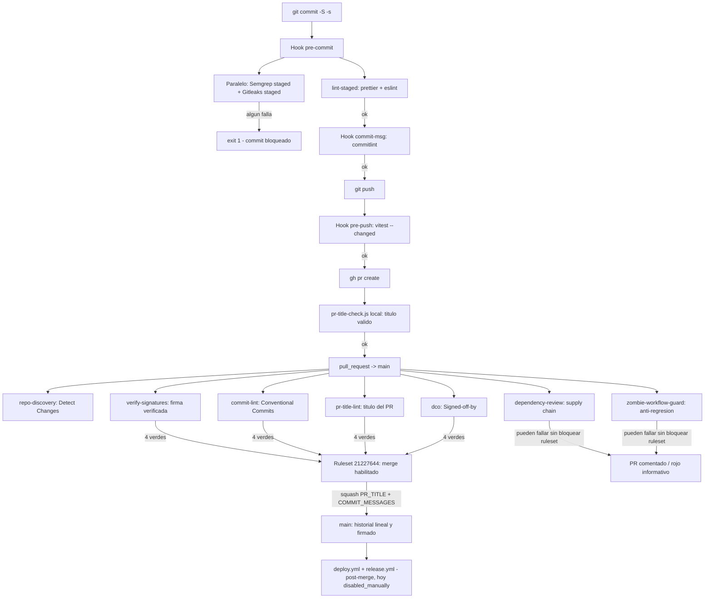

# Pre-merge gates: cómo implementamos governance distribuida en nuestro pipeline

> Artículo técnico basado en la implementación real de governance pre-build/pre-merge de project-one: `.github/workflows/ci.yml` (1049 líneas), ruleset `21227644`, hooks de Husky (`.husky/`), configs locales (`.gitleaks.toml`, `.semgrep/`, `commitlint.config.js`, `scripts/hooks/`) y su contraste con la propuesta enterprise de `docs/ci-cd-pipeline-empresarial.md` §23.3 (STAGE 2 PRE-BUILD — VALIDATE) y el `Governance Lifecycle` de 7 pasos.
>
> **Nota de trazabilidad:** todo lo afirmado aquí fue verificado contra el árbol de trabajo en la rama `ci/governance-gates` (HEAD `3b54db7`). Cuando algo está diseñado pero aún no activo, se dice explícitamente. No asumimos nada.

---

## 1. El problema: la governance como idea de último momento

Cuando un pipeline crece por capas (build → test → deploy), la governance suele llegar al final: un ruleset aquí, un hook allá, un check manual más allá. El resultado es una colección de controles aislados que **no forman un sistema**: cada uno valida una cosa distinta, en un momento distinto, con criterios que nadie documentó como conjunto.

Nosotros llegamos a ese punto en project-one. Teníamos firma de commits, Conventional Commits, DCO y validación de título de PR — pero cada pieza vivía en un workflow, un hook o una config distinta, y no existía una visión única de _qué se valida antes de que el código pueda entrar a `main`_.

Este artículo documenta la decisión que tomamos: **reorganizar la governance pre-merge como una capa distribuida de 4 checks requeridos**, soportada por una capa local (hooks) y complementada por gates no-bloqueantes, y contrastarla con la propuesta enterprise de nuestra documentación de referencia (§23.3).

---

## 2. Terminología: por qué decimos "pre-merge gates"

Antes de diseñar, investigamos la nomenclatura de la industria. No existe un término único consolidado; cada plataforma nombra el mismo concepto con su vocabulario:

| Fuente                       | Término                                                                   | Alcance                                                   |
| ---------------------------- | ------------------------------------------------------------------------- | --------------------------------------------------------- |
| Universal (literatura CI/CD) | **Pre-merge gates**                                                       | Umbrella: cualquier validación previa al merge            |
| Google SRE                   | **Pre-submit checks**                                                     | Validaciones que corren antes del submit/merge            |
| GitHub                       | **Required status checks** + branch protection / rulesets                 | Checks que el ruleset exige en verde para habilitar merge |
| GitLab                       | **Merge request pipeline**                                                | Pipelines atadas al lifecycle del MR (no solo al commit)  |
| AWS CodePipeline             | **Stage-level conditions**                                                | Gates de aprobación y condiciones entre stages            |
| IBM / Gartner                | **Pipeline gates / quality gates**                                        | Puntos de entrada controlada entre fases                  |
| Complementarios              | **Policy-as-code**, **shift-left governance**, **governance transversal** | Formas de _hacer cumplir_ y de _posicionar_ los gates     |

**Por qué elegimos "pre-merge gates":** es el término más inclusivo (qualquier validación previa al merge) y el que mejor encaja con la metáfora física — una compuerta que solo abre cuando las condiciones se cumplen, con mecanismos de fallo explícitos. Los demás términos describen _dónde_ o _cómo corren_ los gates; este describe _qué son_.

---

## 3. La arquitectura: governance distribuida en 4 capas

La governance no vive en un solo lugar. La distribuimos en 4 capas, cada una con un costo distinto y un punto de ejecución distinto. Esta distribución es la pieza clave del diseño: **cada validación corre en la capa más barata que pueda detectar su fallo**.

```mermaid
flowchart LR
    subgraph L1[L1 - Pre-commit · en el dev]
        A1[lint-staged: prettier + eslint]
        A2[SAST Semgrep staged]
        A3[Gitleaks secret scan staged]
        A4[commit-msg: commitlint]
    end

    subgraph L2[L2 - Pre-push · en el dev]
        B1[Tests scoped: vitest --changed origin/main]
    end

    subgraph L2_5[L2.5 - PR title · en el dev]
        C1[pr-title-check.js antes de gh pr create]
    end

    subgraph L3[L3 - CI · GitHub · pull_request a main]
        D1[verify-signatures - firma verificada]
        D2[commit-lint - Conventional Commits]
        D3[pr-title-lint - titulo del PR]
        D4[dco - Signed-off-by]
        D5[dependency-review - supply chain]
        D6[zombie-workflow-guard - anti-regresion]
        D7[repo-discovery - path scoping]
    end

    L1 --> L2 --> L2_5 --> L3
```



| Capa     | Punto de ejecución                     | Costo                         | Qué valida                                                                    | Bloqueo                     |
| -------- | -------------------------------------- | ----------------------------- | ----------------------------------------------------------------------------- | --------------------------- |
| **L1**   | Hook `pre-commit` + `commit-msg`       | Muy bajo (segundos, local)    | Formato, lint, SAST staged, secretos staged, mensaje de commit                | Sí (local)                  |
| **L2**   | Hook `pre-push`                        | Bajo-medio (regresión scoped) | Tests scoped de los workspaces cambiados (`vitest run --changed origin/main`) | Sí (local)                  |
| **L2.5** | Script npm `pr:create`                 | Muy bajo                      | Título del PR antes de abrirlo                                                | Warn (wrapper, no hook)     |
| **L3**   | GitHub Actions, `pull_request -> main` | Alto (minutos, remoto)        | Firma, mensajes, título, DCO, dependencias, anti-regresión                    | Sí (ruleset, no-bypassable) |

**Por qué importa la distribución:** si todo estuviera en CI (capa L3), un fallo trivial de formato costaría 2-5 minutos de feedback loop y bloquearía el merge de todo un equipo. Si todo estuviera en L1, el ciclo de commit sería lentísimo y la gente buscaría bypases. La regla que aplicamos: _valida lo más temprano posible, con la cobertura mínima suficiente, y deja la red de seguridad infalible (ruleset) al final_.

---

## 4. Catálogo detallado de validaciones y herramientas

Esta es la sección central del artículo. Para **cada validación** explicamos: qué herramienta usamos y qué es, qué valida exactamente, por qué existe (qué riesgo mitiga y qué pasaría sin ella), su importancia, un ejemplo concreto, y dónde está implementada.

---

### 4.1 Firma de commits verificada — job `verify-signatures`

**Capa:** L1 (firma local) + L3 (verificación CI) · **Check requerido:** `Verify Commit Signatures`

#### Qué es y qué herramienta usamos

GitHub firma commits con claves SSH/PGP/GPG y expone el resultado de verificación en su REST API bajo `.commit.verification.verified`. Nosotros firmamos localmente con una **clave SSH ed25519 dedicada** (`git commit -S`) por dos razones: es la cadena de confianza de nuestra infra (misma infraestructura que `git push`), y ed25519 es el algoritmo moderno recomendado (curva elíptica de 256 bits, firma y verificación rápidas, sin los problemas de tamaño de claves RSA).

El job `verify-signatures` del CI **no verifica que el commit esté firmado** (eso ya lo garantiza el ruleset con `required_signatures`); verifica que **GitHub haya verificado la firma** — que la clave es legítima y el commit no fue alterado después de firmar.

#### Qué valida exactamente

Para cada commit **nuevo** del PR (no los históricos de main), consulta la REST API y exige:

```
.commit.verification.verified == true
```

Escalamos el consumo de API con el endpoint `compare/base.sha...head.sha` (máx. 250 commits por llamada) en lugar de paginar `GET /pulls/{n}/commits` — así evaluamos **solo** el rango de commits que el PR añade sobre su base, sin tocar la historia de `main`.

#### Por qué existe / qué riesgo mitiga

- **Cadena de suministro:** un commit firmado por la clave correcta prueba que el autor tenía acceso a la clave privada; un commit no verificado puede ser inyectado por un tercero, un token comprometido o un actor automático sin identidad.
- **Auditabilidad:** si `main` debe ser reproducible y auditable, cada commit en su historial debe tener autoría verificable. Sin este gate, el merge de un commit con firma rota o sin firma _por accidente_ era posible (un squash imperfecto, un coauthor mal configurado, un bot).
- **Guardian del historial:** combinado con `required_linear_history`, impide que el historial lineal de `main` se contamine con commits sin identidad verificable.

#### Importancia

Es el check de **mayor severidad** del lote: si este falla, no hay discusión posible — el commit no tiene autoría verificable y no debe entrar. Por eso es el primero de los 4 requeridos y tiene `continue-on-error: false` (eliminado explícitamente con el comentario _"signature verification failures must propagate to ruleset 21227644"_).

#### Problema real que resolvimos: retraso de propagación de GitHub

Detectamos un **falso negativo**: tras un push, GitHub tarda ~30 segundos en marcar un commit como `verified` (búsqueda con `jq` sobre `.commit.verification`). Si el job evaluaba un SHA en ese instante, lo marcaba como no verificado y bloqueaba un PR legítimo (bug ref: run `32661559666`, SHAs `4d1953c7/890cdc2a/110292707b/7ec00546`).

Solución de tres partes, hoy en el código (líneas 166-215 de `ci.yml`):

```bash
# 1) Tolerancia: dar tiempo a la propagación (~30s post-push)
sleep 30

# 2) Anti-stale retry: cada SHA no verificado se re-chequea individualmente
#    (máx. 5 reintentos por run)
for SHA in $FAILED_SHAS; do
  INDIVIDUAL=$(curl -s ... "https://api.github.com/repos/${{ github.repository }}/commits/$SHA")
  # Null tolerance: si '.verification' no existe, tratar como false (no crashear)
  VERIFIED=$(echo "$INDIVIDUAL" | jq -r '.commit.verification.verified // .verification.verified // false')
  ...
done

# 3) Grandfathering: commits con fecha anterior al rollout (2026-08-01)
#    se exoneran para no exigir firma retroactiva
if [[ -n "$AUTHOR_DATE" && "$AUTHOR_DATE" < "$ROLLOUT_DATE" ]]; then
  echo "SKIP (grandfathered via anti-stale, $AUTHOR_DATE): $SHA"
fi
```

#### Dónde está implementada

- Local: `git config commit.signoff true` (DCO automático) + convención `git commit -S` (firma) obligatorio (ver §4.3).
- CI: job `verify-signatures` en `.github/workflows/ci.yml` (check name exacto: **Verify Commit Signatures**).
- Ruleset `21227644` → regla `required_signatures` + status check requerido (¡renombrar el nombre del job rompe el binding del ruleset!).
- El job forma parte de `ci-complete.needs` (ci.yml L796) — el agregador solo reporta cuando `CI_MINIMAL != 'true'`.

---

### 4.2 Conventional Commits — job `commit-lint`

**Capa:** L1 (hook `commit-msg`) + L3 · **Check requerido:** `Commit Lint (Conventional Commits)`

#### Qué herramienta usamos y qué es

**[commitlint](https://commitlint.js.org)** con la config `@commitlint/config-conventional`. Nuestra config completa es:

```js
// commitlint.config.js
const config = {
  extends: ['@commitlint/config-conventional'],
};

export default config;
```

Conventional Commits es el estándar que define mensajes con estructura `type(scope): description`:

```
feat(server): add refresh token rotation
fix(client): correct pagination offset under load
docs(readme): document local dev setup
ci(github): enable PR governance gates
ops(infra): rotate staging database credentials
```

#### Qué valida

En CI (job `commit-lint`):

```bash
npx commitlint --from $BASE_SHA --to $HEAD_SHA --verbose
```

con un **guard anti-vacío** que falla si el rango `base..head` contiene 0 commits (así un PR sin commits no pasa el check por silencio). En `merge_group` usa `commitlint --last` para validar el título del squash. En local, el hook `commit-msg` corre lo mismo sobre el mensaje que se está escribiendo:

```bash
npx --no -- commitlint --edit "$1"
```

#### Por qué existe / qué riesgo mitiga

- **Historial legible y machine-readable:** `git log --oneline` deja de ser ruido y pasa a ser un changelog: cada commit dice qué cambió y (con scope) dónde.
- **Release automático:** Changesets y semantic-release derivan versiones (major/minor/patch) de los tipos — sin Conventional Commits, el bump es manual y propenso a error.
- **Navegación y blame:** un `git bisect` sobre `fix(...)` vs `feat(...)` es directo; un mensaje libre (`"update stuff"`) no permite filtrar.
- **Gate de calidad cultural:** fuerza a cada persona a pensar _qué_ cambia antes de commitear.

#### Importancia

Es el check **más barato de satisfacer** y el que más frecuencia de violación tiene (la gente escribe "cambios varios"). Por eso corre dos veces: una en L1 (feedback en segundos, en el mismo editor) y otra en L3 (red de seguridad obligatoria). El mensaje es claro: _el historial de main es un artefacto de software, no un registro de intenciones_.

#### Ejemplo de fallo y mensaje

```bash
$ git commit -m "fix login bug"
⧗   input: fix login bug
✖   subject may not be empty [subject-empty]
✖   type may not be empty [type-empty]

✖   found 2 problems, 1 warning
ⓘ   Get help: https://github.com/conventional-changelog/commitlint/#what-is-commitlint
```

El commit correcto sería `fix(auth): correct login validation for empty credentials`.

#### Dónde está implementada

- Local: `.husky/commit-msg` → `commitlint --edit "$1"`, config `commitlint.config.js` (trackeada).
- CI: job `commit-lint` en `ci.yml` (name exacto: **Commit Lint (Conventional Commits)**), requerido por ruleset.

---

### 4.3 Developer Certificate of Origin (DCO) — job `dco`

**Capa:** L1 (auto-signoff + commit-msg) + L3 · **Check requerido:** `DCO`

#### Qué es

El DCO es un certificado legal ligero (creado por el kernel de Linux) que declara: _"el autor certifica que escribió este código o tiene derecho a enviarlo bajo la licencia del proyecto"_. Se materializa como un trailer en el mensaje del commit:

```
feat(auth): add refresh token rotation

Signed-off-by: Ana García <ana.garcia@example.com>
```

#### Qué herramientas usamos

- **GitHub Action `KineticCafe/actions-dco@v3.2.0`** en CI — valida que cada commit del PR tenga su trailer `Signed-off-by`.
- **Config global de git** `commit.signoff true` — añade el trailer automáticamente a cada commit.
- **Convención del equipo**: `git commit -S -s` es la forma canónica (firma + sign-off) en los flujos de commit asistidos.

#### Qué valida exactamente

```yaml
# ci.yml — job dco
- uses: KineticCafe/actions-dco@v3.2.0
  with:
    bot_policy: well-known # bots conocidos NO fallan
    bot_category: dependency-updaters # categoría Dependabot y similares
  continue-on-error: false # BLOQUEANTE desde 2026-08-31
```

**Bot policy:** los commits firmados por bots _well-known_ (como Dependabot) no fallan el check — de lo contrario, cada update automático de dependencias rompería el pipeline. Los seres humanos sí deben firmar.

**Defensa local del trailer:** el hook `pre-push` **no** re-chequea el trailer — solo corre los tests scoped (ver §4.8). La defensa local del DCO se apoya en dos mecanismos: la config global `commit.signoff true` — que añade el trailer automáticamente en cada commit — y nuestra regla de flujo asistido (git-manager exige `git commit -S -s`). El enforcement real del trailer es el check bloqueante de CI (L3).

> **Nota de auditoría:** CONTEXT-CICD §11.1 afirmaba un re-check de DCO en pre-push que el código no implementa (misma clase de discrepancia docs-código que el job SAST del §4.6). Este artículo refleja el código real.

#### Por qué existe / qué riesgo mitiga

- **Proveniencia legal:** sin él, cualquier commit podría alegar desconocimiento sobre el origen del código; con él, cada commit lleva una declaración explícita de que quien lo envió tenía derecho a enviarlo.
- **Auditoría de autoría:** el trailer permite rastrear _quién certificó_ cada línea, independientemente del autor del commit.
- **Cada merge conserva la cadena:** con squash merge que usa `COMMIT_MESSAGES`, los trailers de los commits del PR se conservan en el commit final.

#### Importancia

Es el gate que **más fricción cultural** generó al inicio (la gente olvidaba el `-s` en `--amend`, en squashes manuales, en coautores), y por eso lo atacamos en dos capas: auto-signoff global + flujo asistido (L1), y check bloqueante en CI (L3). Hoy la tasa de violación es ~0.

#### Dónde está implementada

- L1: `git config commit.signoff true` (auto-signoff) + hook `commit-msg` (commitlint) + regla git-manager `-S -s`.
- L3: job `dco` en `ci.yml` (name exacto: **DCO**), BLOQUEANTE.

---

### 4.4 Título del PR — job `pr-title-lint` + script local

**Capa:** L2.5 (local, wrapper npm) + L3 · **Check requerido:** `PR Title Lint`

#### Qué herramientas usamos

- **CI:** `amannn/action-semantic-pull-request@v6` — la action estándar del ecosistema GitHub para validar títulos de PR (misma familia de config que Vite, Electron, PostHog).
- **Local:** `scripts/hooks/pr-title-check.js` — nuestro validador espejo, invocado por `npm run pr:create` **antes** de ejecutar `gh pr create`.

#### Qué valida (los dos válidan lo mismo)

```js
// scripts/hooks/pr-title-check.js — espejo exacto del CI
const TYPES = [
  'feat',
  'fix',
  'docs',
  'style',
  'refactor',
  'perf',
  'test',
  'build',
  'ci',
  'chore',
  'revert',
  'ops',
];
const SUBJECT_PATTERN = /^(?![A-Z]).+$/; // el subject NO empieza con mayúscula
```

Y en CI, con la action:

```yaml
- uses: amannn/action-semantic-pull-request@v6
  with:
    types:
      [
        feat,
        fix,
        docs,
        style,
        refactor,
        perf,
        test,
        build,
        ci,
        chore,
        revert,
        ops,
      ]
    requireScope: false
    subjectPattern: '^(?![A-Z]).+$' # permite acrónimos internos tipo "AWS"
    ignoreLabels: ['bot', 'ignore-semantic-pull-request']
  continue-on-error: false # BLOQUEANTE desde 2026-08-31
```

> **Nota `ops`:** el tipo `ops` lo añadimos para cambios de operaciones/plataforma (secrets, rotación de credenciales, provisionamiento de infraestructura) que no son `ci` ni `chore`. Es el mismo patrón que usa Kubernetes.

#### Por qué existe / qué riesgo mitiga

- **El squash merge titula con `PR_TITLE`** (`squash_merge_commit_title=PR_TITLE`). Si el título no es un Conventional Commit válido, **cada merge generaría un commit que fallaría el check de commit-lint** del siguiente análisis. Validar el título es validar _el commit que el squash va a crear_.
- **Discusión y navegación:** un PR con título semántico (`feat(client): ...`) se filtra y se discute mejor que uno genérico (`Update files`).
- **Consistencia con el release:** el release automation lee el título del commit squash para el changelog.

#### Importancia

Es el único de los 4 checks que mira un artefacto que **aún no existe como commit** (el título del PR). Su fallo cuesta segundos de arreglar y ahorra contaminar el historial — es el caso canónico de _shifting-left_: validar antes de que el dato se materialice.

#### Ejemplo

```bash
# Mal: subject con mayúscula inicial o sin tipo
$ node scripts/hooks/pr-title-check.js "Fix login bug"
Invalid PR title: "Fix login bug"
   Reason: does not match Conventional Commits format "type(scope): description"
   Allowed types: feat, fix, docs, style, refactor, perf, test, build, ci, chore, revert, ops
   Example: feat(server): add DCO check to pre-push hook

# Bien
$ node scripts/hooks/pr-title-check.js "feat(auth): add refresh token rotation"
PR title is valid: "feat(auth): add refresh token rotation"
```

#### Dónde está implementada

- L2.5: `scripts/hooks/pr-title-check.js` + `scripts/hooks/pr-create.js` (wrapper de `gh pr create`).
- L3: job `pr-title-lint` en `ci.yml` (name exacto: **PR Title Lint**), BLOQUEANTE.

---

### 4.5 Formato y lint — `lint-staged` (prettier + eslint)

**Capa:** L1 (solo) · **No es check del ruleset** (vive en el dev)

#### Qué herramientas usamos y qué son

- **[lint-staged](https://github.com/lint-staged/lint-staged)** (raíz, `package.json`): corre comandos solo sobre los archivos **staged**, no sobre todo el repo — ahí está su valor: el feedback es inmediato y el costo es proporcional al cambio.
- **[prettier](https://prettier.io)** (`.prettierrc` + `.prettierignore`): formateador opinado (printWidth 80, singleQuote, semi, eol lf).
- **[eslint](https://eslint.org)** (`eslint.config.js`): lint de JS/JSX.

#### Qué valida

```jsonc
// package.json — lint-staged
"lint-staged": {
  "*.{js,jsx,ts,tsx,cjs,mjs,json,jsonc,md}": ["prettier --write"],
  "*.{js,jsx,cjs,mjs}": ["eslint --fix --max-warnings 0"]
}
```

```bash
# .husky/pre-commit — primer paso, antes de SAST/secrets
lint-staged   # si falla o modifica archivos -> exit 1 (bloquea el commit)
```

#### Por qué existe / qué riesgo mitiga

- **Ruido de diff:** sin formateador, cada PR mezcla cambios funcionales con reformateos accidentales — el reviewer no puede distinguir qué cambió realmente.
- **Deuda acumulativa:** el lint relajado ("lo arreglo luego") produce un backlog eterno; `--max-warnings 0` convierte cualquier warning en error _de una vez_.
- **Costo de CI:** un lint en CI de todo el repo cuesta minutos; hacerlo staged cuesta milisegundos y falla **antes** de que el código salga del dev.

#### Importancia

Es la validación de _menor severidad técnica y mayor impacto cultural_: es la primera que todo el mundo experimenta al commitear, y marca el estándar de trabajo. Un pre-commit que falla rápido y dice _exactamente qué archivo y qué línea_ ahorra decenas de iteraciones de CI.

#### Dónde está implementada

- Solo L1: `.husky/pre-commit` + config de `lint-staged` en `package.json` raíz.

---

### 4.6 SAST — Semgrep (capa local staged + evolución CI)

**Capa:** L1 (activo hoy: staged con Docker) · L3 (diseñado, job documentado; ver nota de estado)

#### Qué herramienta usamos y qué es

**[Semgrep](https://semgrep.dev)**, motor de SAST (Static Application Security Testing) que analiza código fuente **sin ejecutarlo**. Se distribuye como imagen Docker (`semgrep/semgrep`), lo que lo hace portable: el mismo binario corre en Windows, Linux y CI sin instalar nada en el host.

Dos cosas de nuestra implementación:

1. **Un conjunto curado de ~100 reglas del registry** (`r/...`), seleccionadas para nuestro stack (Express + React + JSON Web Tokens + Playwright), desglosadas en líneas individuales en `scripts/security/semgrep-staged.ps1`:
   - **Express (autenticación):** `express-check-csurf-middleware-usage`, `express-jwt-hardcoded-secret`, `express-session-hardcoded-secret`, `express-cookie-session-no-httponly`, `-no-secure`, `-no-expires`, `jsonwebtoken.security.jwt-none-alg` (¡algoritmo `none` = token sin verificar!).
   - **Inyección:** `tainted-sql-string`, `sqli.node-postgres-sqli` (SQLi en Postgres), `express-ssrf`, `path-traversal`, `spawn-shell-true` (command injection), `detect-eval-with-expression`.
   - **XSS frontend:** `react-dangerouslysetinnerhtml`, `dom-based-xss`, `raw-html-concat`, `insecure-innerhtml`, `jwt-in-localstorage` (JWT en localStorage = exfiltrable por XSS).
   - **Cripto:** `md5-used-as-password`, `detect-pseudoRandomBytes`, `gcm-no-tag-length`, `aead-no-final`.
   - **Prototype pollution y deserialización:** `prototype-pollution-assignment`, `express-third-party-object-deserialization`.

2. **Reglas custom propias** en `.semgrep/`:
   - `.semgrep/.semgrep.yml` (trackeada): regla local `no-console-log` (severity WARNING, lenguajes javascript/typescript) que prohíbe `console.log(...)` en producción — además los packs `p/*` están comentados _a propósito_: preferimos reglas puntuales del registry a packs masivos que generan ruido de falsos positivos.
   - `.semgrep/rules/` (5 reglas custom, **aún no trackeadas** en esta rama): `prisma-raw-sqli`, `prototype-pollution`, `ssrf`, `unsafe-deserialization`, `xss-dom-intermediate` — reglas específicas de nuestros patrones Prisma/ORM y DOM.

```bash
# .husky/pre-commit — SAST + Gitleaks en paralelo, espera por PID capturando fallos
npm exec lint-staged || { echo "lint-staged failed"; exit 1; }

FAILED=0
npm run sast:semgrep &        # -> scripts/security/semgrep-staged.ps1
SAST_PID=$!
npm run security:secrets &    # -> gitleaks protect --staged
SECRETS_PID=$!
wait $SAST_PID || { echo "SAST scan failed"; FAILED=1; }
wait $SECRETS_PID || { echo "Secret scan failed"; FAILED=1; }
[ $FAILED -ne 0 ] && exit 1
```

```powershell
# scripts/security/semgrep-staged.ps1 — solo staged, solo cambios "adelante"
$files = git diff --cached --name-only --diff-filter=ACM
if (-not $files) { Write-Host "No staged files to scan."; exit 0 }

docker run --rm -v "${PWD}:/src" -w /src semgrep/semgrep:latest semgrep scan `
  --config="r/javascript.express.security.audit.express-jwt-hardcoded-secret.express-jwt-hardcoded-secret" `
  --config="r/javascript.lang.security.audit.sqli.node-postgres-sqli.node-postgres-sqli" `
  # ... ~100 reglas más ...
```

#### Qué valida

Solo los archivos staged (`git diff --cached`) — no todo el repo. Así el análisis es **proporcional al cambio** y detecta la vulnerabilidad _antes_ de que el código se commitee.

#### Por qué existe / qué riesgo mitiga

- **Las vulnerabilidades que el lint no ve:** ESLint detecta bugs y estilo; no detecta `res.send(datosSinSanitizar)` (XSS de respuesta directa), `jwt.decode(token, { algorithms: ['none'] })` o un `exec(cmd)` con input del usuario. Semgrep cubre esa capa.
- **Costo del hallazgo tardío:** encontrar un SQLi en CI cuesta un ciclo de PR; encontrarlo en producción es un incidente de seguridad (CWE-89, OWASP Top 10 A03). Detectarlo en el commit cuesta segundos.
- **Stack-aware:** al revés de los scanners genéricos, las reglas `r/typescript.react...` y `r/javascript.express...` entienden _nuestro_ framework, no solo patrones abstractos.

#### Importancia

Es la validación más **nueva y en evolución** de nuestro stack. Su severidad hoy es WARNING en local custom (`no-console-log`) y las reglas del registry son el verdadero filtro de seguridad. La evolución planificada (change `ci-sast-governance`) es un job CI F1 no-bloqueante con `--baseline-commit` (solo diff del PR) que posteriormente migraría a F2 bloqueante — el mismo camino que recorrieron `pr-title-lint` y `dco` (primero informativos, luego BLOQUEANTES).

#### Nota de estado (honestidad del artículo)

En esta rama (`ci/governance-gates`) el job CI de Semgrep **no está en `ci.yml`**: la capa activa hoy es la local staged (L1). El job `sast` que existe en `security.yml` es **CodeQL** (`name: "SAST - CodeQL"`), y ese workflow está `disabled_manually` en GitHub (ver §10). La documentación de referencia (CONTEXT-CICD §9.3.9) describe el job Semgrep como existente en `ci.yml`; al verificar el código real encontramos la discrepancia y la registramos — este artículo describe **lo implementado y verificado**, no lo asumido.

#### Dónde está implementada

- L1: `.husky/pre-commit` → `npm run sast:semgrep` → `scripts/security/semgrep-staged.ps1` (Docker). Reglas: registry `r/...` (~100) + `.semgrep/.semgrep.yml` (custom, trackeada) + `.semgrep/rules/` (5 custom, pending de commit).
- L3: diseñado en change `ci-sast-governance` (no presente en la rama actual).
- Referencia enterprise: §23.3 + diagrama con "SAST 3 capas" (local/CI/scheduled).

---

### 4.7 Detección de secretos — Gitleaks

**Capa:** L1 (staged) + scheduled (workflow semanal, hoy `disabled_manually`) · **No es check del ruleset**

#### Qué herramienta usamos y qué es

**[Gitleaks](https://gitleaks.io)**, scanner de secretos open source que detecta credenciales hardcodeadas en el código (API keys, tokens, passwords, connection strings) usando un motor de reglas basado en regex + entropía. Corremos gitleaks **solo sobre lo staged** (patrón `protect`) en el pre-commit:

```bash
npx gitleaks protect --staged --verbose --redact --config .gitleaks.toml
```

#### Qué valida — nuestra config (` .gitleaks.toml`, trackeada)

```toml
# Extiende las reglas oficiales mantenidas por Gitleaks (AWS, GitHub,
# Slack, Stripe, Google API keys, private keys, ...)
[extend]
useDefault = true

# Reglas custom para nuestros patrones de Node
[[rules]]
id = "generic-api-key"
regex = '''(?i)api[_-]?key['"]?\s*[:=]\s*['"][A-Za-z0-9_\-]{16,}['"]'''

[[rules]]
id = "jwt-secret-variable"
regex = '''(?i)jwt[_-]?secret['"]?\s*[:=]\s*['"].{10,}['"]'''

[[rules]]
id = "generic-secret-variable"
regex = '''(?i)secret['"]?\s*[:=]\s*['"].{10,}['"]'''

[[rules]]
id = "password-assignment"
regex = '''(?i)password['"]?\s*[:=]\s*['"].{8,}['"]'''

[[rules]]
id = "database-url"
regex = '''(?i)(postgres|mysql|mongodb|redis):\/\/[^ \n]+'''
```

Y allowlists por directorio para no escanear dependencias/builds ni fixtures de test:

```toml
[[allowlists]]
description = "Ignore dependency and build directories"
paths = ['node_modules', 'dist', 'build', 'coverage', 'package-lock.json', ...]

[[allowlists]]
description = "Ignore test fixtures and mocks"
paths = ['__tests__', 'tests', 'fixtures', 'mocks', 'apps/client/tests', 'apps/server/tests']

[[allowlists]]
description = "Ignore placeholder REDIS_URL in PM2 ecosystem config"
paths = ['apps/server/ecosystem.config.js']
```

#### Por qué existe / qué riesgo mitiga

- **El escenario canónico:** un `.env` commiteado o un JWT secret hardcodeado en el código termina en el historial de main y en el fork de cualquier colaborador. Git guarda todo; los secretos no "desaparecen" al borrar el archivo — hay que rotarlos.
- **Coste de rotación:** detectar el secreto en el commit (L1) costó 1 segundo y `git reset`; detectarlo en producción cuesta rotar credenciales en todos los entornos, invalidar sesiones y emitir un postmortem.
- **Cadena de suministro:** los secretos de staging/test suelen reutilizarse en entornos reales; una connection string de Postgres filtrada es acceso a datos.

#### Importancia

Junto con la firma de commits, es el gate de **mayor impacto si falla silenciosamente** — un secreto filtrado no rompe el build, se descubre días después. Por eso la detección es **proactiva** (staged) y también existe un workflow semanal `scheduled-security.yml` (Gitleaks full-history + SARIF a Security tab) que hoy está `disabled_manually` (ver §10). Los allowlists de test fixtures existen porque el _objetivo_ es detectar secretos reales, no generar ruido con mocks.

#### Dónde está implementada

- L1: `.husky/pre-commit` → `npm run security:secrets` → `gitleaks protect --staged`.
- Schedulada: `.github/workflows/scheduled-security.yml` (hoy `disabled_manually`), job Gitleaks full-history.
- Config: `.gitleaks.toml` + `.gitleaksignore` (trackeadas) — verificado 139 líneas.

---

### 4.8 Tests scoped — `vitest run --changed` en pre-push

**Capa:** L2 (solo) · **No es check del ruleset** (vive en el dev)

#### Qué herramienta usamos y qué es

**[Vitest](https://vitest.dev)** (`4.x`, config en `apps/server/vitest.config.js` y `apps/client/vitest.config.js`), runner de tests con watch mode y modo CI. La feature clave que usamos es `--changed`:

```bash
# .husky/pre-push — regresión rápida solo de lo que cambió
git fetch origin main --depth=1
git rev-parse --verify origin/main > /dev/null 2>&1 || exit 1   # safety net

vitest run --changed origin/main --config apps/server/vitest.config.js
vitest run --changed origin/main --config apps/client/vitest.config.js
```

#### Qué valida

Detecta los archivos de test que dependen de los archivos modificados (grafo de imports) y ejecuta **solo esos** — no la suite completa. Un cambio en `auth.service.ts` corre los tests de auth, no los de facturación.

#### Por qué existe / qué riesgo mitiga

- **Feedback loop:** correr la suite completa (server + client) en cada `git push` cuesta minutos; con `--changed` la regresión relevante corre en segundos. El ciclo rápido hace que la gente **use** el hook; el ciclo lento hace que lo bypaseen.
- **Regresión silenciosa:** un cambio que rompe 3 tests que "no tienen que ver con mi cambio" es exactamente lo que este hook detecta antes de que un CI de 5-10 minutos lo descubra.
- **Complementariedad con L3:** el CI (cuando esté completo, hoy `CI_MINIMAL=true` desactiva los jobs de test) corre la suite completa; el hook corre la _parte probablemente afectada_. Son dos vistas, no dos copias.

#### Dónde está implementada

- Solo L2: `.husky/pre-push` (verificado: `fetch origin/main --depth=1` + `vitest run --changed origin/main` en server y client).

---

### 4.9 Path scoping — job `repo-discovery` (Detect Changes)

**Capa:** L3 (infraestructura de otros jobs) · **No es check de governance por sí mismo**

#### Qué herramienta usamos y qué es

**[dorny/paths-filter](https://github.com/dorny/paths-filter)** — analiza el diff del PR y emite outputs booleanos por path (`client`, `server`, `e2e`, `shared`). Es el _detector de cambios_ que permite a otros jobs decidir si corren o se saltan:

```yaml
# ci.yml — job repo-discovery (name: "Detect Changes")
- uses: dorny/paths-filter@v4
  with:
    filters: |
      client:   apps/client/**
      server:   apps/server/**
      e2e:      e2e/**
      shared:   package.json, package-lock.json, .github/workflows/**
```

#### Qué valida / por qué existe

No valida calidad; **optimiza el costo** del pipeline: un PR que toca solo `apps/client` no debería disparar tests de server. Permite construir el DAG condicional (jobs `if: steps...outputs.server == 'true'`) y alimenta a `ci-complete` con la lista de qué "debería haber corrido".

#### Importancia

Sin path-scoping, un cambio trivial de README dispararía todo el pipeline de calidad. Con él, el feedback es rápido y el costo marginal de cada PR es proporcional a su tamaño real — condición necesaria para que el "CI incremental" (ver §10) sea económicamente viable.

#### Dónde está implementada

- L3: job `repo-discovery` en `ci.yml` (needs de `ci-complete`, `zombie-workflow-guard`, jobs de calidad). Nota: agregar `repo-discovery` a `ci-complete.needs` fue parte del change `ci-prebuild-substage-structure` (activo en la rama).

---

### 4.10 Supply chain — job `dependency-review` (dependency-review-action@v5)

**Capa:** L3 (corre en PRs a main) · **NO es check del ruleset** — es SECURITY, no governance (regla 6 de nuestra guía CI/CD)

#### Qué herramienta usamos y qué es

**[actions/dependency-review-action@v5](https://github.com/actions/dependency-review)**: diff de dependencias del PR vs la rama base, consulta el GitHub Advisory Database y bloquea si introduce vulnerabilidades conocidas o licencias incompatibles.

```yaml
# ci.yml — job Dependency Review (inline, no en security.yml)
- uses: actions/dependency-review-action@v5
  with:
    fail-on-severity: moderate # bloquea desde severidad "moderate"
    vulnerability-check: true
    license-check: true
```

#### Qué valida

- **Vulnerabilidades** introducidas por el PR (`package.json` + lockfile): si una nueva dependencia (o una versión nueva de una existente) tiene un advisory `>= moderate`, el job falla.
- **Licencias** incompatibles con nuestra política.
- Se evalúa el **delta**: solo lo que el PR añade/actualiza, no todo el árbol ya aprobado.

#### Por qué existe / qué riesgo mitiga

- **El riesgo de la dependencia nueva no es el código, es el árbol:** `npm audit` solo ve el árbol actual; este check ve _lo que el PR está a punto de meter_. Un `lodash@4.17.20` (CVE por prototype pollution) no se detecta "al importar", se detecta _al querer entrar_.
- **Cadena de suministro (OWASP A06):** sin él, la única defensa contra un paquete malicioso/carente de mantenimiento es la revisión humana del `package.json` — que casi nunca ocurre en el diff.

#### Importancia

Es un gate **no-bloqueante a nivel ruleset pero bloqueante a nivel PR**: si falla, el PR se marca en rojo pero no es uno de los 4 checks requeridos — porque es una capa de _seguridad_, no de _gobernanza del historial_. Configuramos `fail-on-severity: moderate` (el default de GitHub es `high`), lo que lo hace más estricto que el estándar.

#### Dónde está implementada

- L3: job **Dependency Review** (inline en `ci.yml`, no requiere workflow aparte). Runs solo en `pull_request`. Su historial: nació en `security.yml` y se movió inline a `ci.yml` para que `ci-complete.needs` pudiera agregarlo — un detalle de arquitectura del change `ci-governance-pre-merge-gates`.

---

### 4.11 Anti-regresión de workflows — job `zombie-workflow-guard`

**Capa:** L3 · **No es check del ruleset** (pero es implacable)

#### Qué herramienta usamos y qué es

Un job propio (bash) que falla el build si **reaparece un workflow que debió ser eliminado**:

```bash
# ci.yml — job zombie-workflow-guard (esquema conceptual verificado)
ZOMBIES=("pr-validation.yml" "lint.yml" "formatter.yml" "quality.yml")
for f in "${ZOMBIES[@]}"; do
  [ -f ".github/workflows/$f" ] && echo "ZOMBIE DETECTED: $f" && exit 1
done
```

`quality.yml` fue migrado a jobs `if:false` inline en `ci.yml`; los otros tres fueron eliminados por los changes de governance. Este guard garantiza que **no vuelvan** (por ejemplo, vía un cherry-pick mal hecho o una branch antigua mergeada).

#### Qué valida / por qué existe

- **No es sobre calidad:** es sobre _estado del sistema_. Un workflow zombie puede correr sin que nadie lo sepa, duplicar jobs, o (peor) **introducir un gate que la gente no conoce**.
- **El coste de un duplicado es doble:** (1) tiempo de CI doble, (2) confusión: dos jobs con nombres similares, dos fuentes de verdad.

#### Importancia

Es el gate de **higiene de configuración**: el único que no valida código _de producto_ sino _configuración del pipeline en sí_. El precedente: el incidente `quality.yml` (que "ya no existía" en docs pero seguía referenciada) casi reintroduce el archivo; el guard lo impide para siempre.

#### Dónde está implementada

- L3: job **Zombie Workflow Guard** en `ci.yml` (needs `repo-discovery`, timeout 2 min).

---

### 4.12 Dead code — knip (change activo `ci-prebuild-substage-structure`)

**Capa:** L3 (job, diseñado; hoy `if:false` por CI incremental) · **No es check del ruleset**

#### Qué herramienta usamos y qué es

**[knip](https://knip.dev)** (`6.32.2`, devDependency root): detecta dependencias, exports y archivos no usados — _dead code_ que el compilador no detecta (JavaScript es tolerante con lo no usado).

#### Qué valida / por qué existe

- **Coste de mantenimiento:** una dependencia no usada es superficie de ataque (nunca se actualiza, nunca se audita) y confusión (¿se usa? ¿dónde?).
- **Tamaño de bundle:** en el client, módulos no usados pueden entrar en el bundle si el tree-shaking falla.
- **Deuda de limpieza:** sin una herramienta, "borrar lo que no se usa" es una tarea manual que se pospone indefinidamente.

En el change activo se activa knip (dead-code) como uno de los substages de calidad del PRE-BUILD, junto con format-check, typecheck, complexity e import-bounds.

#### Importancia

Complementa a los gates de lint/tests: esos dicen _"lo que hay, funciona"_; knip dice _"lo que no se usa, no debería estar"_. Es una pieza de la governance de calidad — no de identidad — por eso no está en el ruleset.

#### Dónde está implementada

- L3: job `client-dead-code` / `server-dead-code` en `ci.yml` (hoy `if:false` — CI incremental, ver §10), alimentando `ci-complete.needs`.

---

## 5. El ruleset: el pegamento que convierte lo voluntario en obligatorio

Sin un enforcer, todos los jobs anteriores son _reportes_: pueden fallar y el merge seguir ocurriendo. El **ruleset `21227644` "Require signed commits"** (branch `main`, `enforcement`) es el que hace que 4 de ellos **bloqueen el merge físicamente**:

| Regla del ruleset                                      | Qué bloquea                                          |
| ------------------------------------------------------ | ---------------------------------------------------- |
| `deletion` + `non_fast_forward`                        | Eliminar main / force-push                           |
| `required_signatures`                                  | Commits sin firma verificada por GitHub              |
| `required_status_checks` (4, strict)                   | Merge si los 4 checks no están en verde              |
| `required_approving_review_count=1`                    | Merge sin al menos 1 aprobación                      |
| `require_code_owner_review`                            | Merge sin review del CODEOWNERS del path             |
| `require_last_push_approval`                           | Merge de un push que nadie re-aprobó                 |
| `required_review_thread_resolution`                    | Merge con hilos de discusión abiertos                |
| `required_extra_approval_for_unattributed_changes`     | Aprobación extra si hay commits sin autor atribuible |
| `required_linear_history`                              | Merge no squash/rebase (historial lineal)            |
| `bypass_actors: []` + `current_user_can_bypass: never` | **Nadie, ni admins, puede saltarse el ruleset**      |

### Los 4 checks requeridos (nombres EXACTOS — renombrar rompe el binding)

1. `Verify Commit Signatures` → job `verify-signatures`
2. `Commit Lint (Conventional Commits)` → job `commit-lint`
3. `PR Title Lint` → job `pr-title-lint`
4. `DCO` → job `dco`

> **Regla 8 de nuestra guía CI/CD:** el ruleset vincula por el campo `name:` del job. Si renombras un job, el binding se rompe _en silencio_: el check sale del ruleset y el merge vuelve a estar desprotegido sin ningún error. Por eso los nombres están documentados y congelados.

### Por qué importa la combinación ruleset + checks

El patrón completo es **defense-in-depth**:

- Los hooks (L1/L2) **previenen** que el código malo exista.
- Los jobs de CI (L3) **detectan** el código malo que llegó.
- El ruleset **obliga** a que la detección sea condición de merge.

Cada capa falla sola por una razón distinta (olvido, bypaseo, rama forkeada), y las tres juntas cubren el espectro: _prevenir, detectar, hacer cumplir_.

---

## 6. Herramientas transversales del stack (y por qué elegimos cada una)

| Herramienta            | Versión/fuente                                                                                                                     | Por qué esa                                                                                                |
| ---------------------- | ---------------------------------------------------------------------------------------------------------------------------------- | ---------------------------------------------------------------------------------------------------------- |
| **Husky** (v9)         | `.husky/` + `prepare: husky`                                                                                                       | Gestiona los hook scripts versionados; `npx --no` evita resolver de la red en hooks                        |
| **commitlint**         | `@commitlint/config-conventional`                                                                                                  | Estándar de facto de Conventional Commits; CI y hook comparten config                                      |
| **GitHub Actions**     | `amannn/action-semantic-pull-request@v6`, `KineticCafe/actions-dco@v3.2.0`, `dependency-review-action@v5`, `dorny/paths-filter@v4` | Ecosistema mantenido, inputs declarativos, SHA-pinnable                                                    |
| **Docker (Semgrep)**   | `semgrep/semgrep`                                                                                                                  | Mismo motor en dev y CI; cero instalaciones nativas; versiones pinneables                                  |
| **curl + jq**          | build-in del runner + jq                                                                                                           | Consultar la REST API de GitHub para verificación de firma con parsing robusto (`// false` null tolerance) |
| **Gitleaks**           | v8 (CLI) + `.gitleaks.toml`                                                                                                        | Open source, uso de reglas default + custom, soporte `--staged` nativo                                     |
| **Vitest `--changed`** | 4.x                                                                                                                                | Grafo de dependencias real (no diff de archivos) para tests scoped                                         |
| **knip**               | 6.32.2                                                                                                                             | Detección estructurada de dead code en monorepos npm workspaces                                            |
| **PowerShell (ps1)**   | `scripts/security/*.ps1`                                                                                                           | La caja de CI/CD del equipo es Windows; `pwsh` portable a Linux CI                                         |

**Por qué scripts PowerShell para los scans:** son compatibles entre la máquina local (Windows) y el runner de GitHub Actions (ubuntu, con `pwsh` instalado), manteniendo una única implementación del scan — ni duplicación bash/ps1 ni deriva de config.

---

## 7. Propuesto (§23.3) vs implementado: qué cambió y por qué

La propuesta enterprise (`docs/ci-cd-pipeline-empresarial.md` §23.3, STAGE 2 PRE-BUILD — VALIDATE, Governance Lifecycle de 7 pasos) define un ideal; nuestra implementación lo ajustó a la realidad del monorepo. Contraste punto por punto:

| Punto propuesto (§23.3)                                                    | Lo que implementamos                                                                                                    | Delta y por qué                                                                                                                                   |
| -------------------------------------------------------------------------- | ----------------------------------------------------------------------------------------------------------------------- | ------------------------------------------------------------------------------------------------------------------------------------------------- |
| Governance Lifecycle: 7 pasos (definición → difusión → enforcement → ...)  | Los 7 pasos existen, pero **no como workflow secuencial único**: viven en capas                                         | El lifecycle enterprise asume un equipo grande; aquí el enforcement se descentraliza en capas (hooks + CI + ruleset)                              |
| CODE REVIEW como paso explícito entre PR GATE y BRANCH PROTECTION          | `require_code_owner_review` + `required_approving_review_count=1` en el ruleset                                         | Implementado como política del ruleset, no como job: es una capacidad nativa de GitHub                                                            |
| Checks de calidad (lint, typecheck, tests, coverage, sonarqube) en el gate | Jobs **`if:false`** en `ci.yml` (diseño incremental, `CI_MINIMAL=true`)                                                 | **Desviación intencional:** arrancamos con gobernanza de identidad (firma/CC/DCO/título) y luego añadiremos calidad cuando se justifique el costo |
| SAST como capa del gate                                                    | SAST local staged (activo) + evolución CI diseñada (F1 no-bloqueante)                                                   | La capa CI aún no está en el árbol; la local ya produce resultados                                                                                |
| "CI Complete" como check agregador                                         | `ci-complete` existe pero se SKIPPA con `CI_MINIMAL=true`                                                               | No se vincula al ruleset hasta reportarse ≥1 vez (GitHub solo permite elegir checks que hayan corrido)                                            |
| Governance sobre _todo_ el pipeline                                        | Governance distribuida que hoy cubre el **pre-merge**; el post-merge (deploy/release) tiene workflows con gates propios | Expansión planificada por changes separados (regla 4: un change NO mezcla stages)                                                                 |
| Política de dependencias                                                   | `dependency-review` con `fail-on-severity: moderate`                                                                    | Más estricto que el default (high)                                                                                                                |

**Por qué estas desviaciones son diseño, no deuda:** nuestro contexto es un monorepo pequeño-medio con 1 develop, no una enterprise. Correr los 25+ jobs de calidad en cada PR costaría minutos y bloquearía la iteración sin beneficio proporcional. El diseño incremental (gobernanza primero, calidad después, cada pieza con change propio) es lo que hizo el sistema sostenible.

---

## 8. Las 5 estrategias de governance (y cómo se ven en nuestro código)

1. **Shift-left (validar antes):** cada validación corre en la capa más barata — `pr-title-check.js` local (L2.5) antes que `pr-title-lint` CI (L3); `semgrep-staged` (L1) antes que un hipotético job CI; `vitest --changed` (L2) antes que la suite completa.
2. **Policy-as-code (la política es código):** ruleset 21227644 versionado por API; `commitlint.config.js`, `.gitleaks.toml`, `.semgrep/`, `.husky/` — todo trackeado y revisable con git blame.
3. **Enforcement no-bypassable:** `bypass_actors: []` + `current_user_can_bypass: never` — ni admins pueden saltarse el ruleset. Las herramientas locales pueden desactivarse (husky disable), por eso la red de seguridad vive en CI, donde no se puede.
4. **Gates escalonados severity-first:** primero los checks de _identidad/autenticidad_ (firma, CC, DCO, título), luego los de _seguridad_ (dependency-review, secretos, SAST), luego los de _calidad_ (lint/tests/dead-code, hoy `if:false`). Cada cambio documenta su justificación de costo.
5. **Incrementalismo con trazabilidad:** cada pieza nace de un change OpenSpec archivado (`ci-governance-pre-merge-gates`, `ci-commit-signing`, `ci-commit-lint-governance`, `ci-pr-metadata-governance`), con su spec en WHEN/THEN, evidencia de implementación y lecciones. Un change NO mezcla stages de governance.

---

## 9. El journey de un commit / un PR (flujo completo)



Cada flecha es un punto donde el sistema puede decir **NO** — y cuando lo dice, dice _qué_ y _por qué_.

---

## 10. Estado real del sistema y deudas conocidas (verificado en rama `ci/governance-gates`)

Para que este artículo no sea un ejercicio de deseos, el estado **verificado** (git-manager audit, read-only):

| Pieza                                                                                      | Estado real                                                                                                                                      |
| ------------------------------------------------------------------------------------------ | ------------------------------------------------------------------------------------------------------------------------------------------------ |
| 4 checks governance (firma/CC/título/DCO)                                                  | Activos en `ci.yml`, BLOQUEANTES vía ruleset `21227644`                                                                                          |
| dependency-review, zombie-workflow-guard, repo-discovery                                   | Activos en `ci.yml`, visibles en PRs                                                                                                             |
| Hooks L1/L2/L2.5                                                                           | Activos localmente (files verificados)                                                                                                           |
| `.gitleaks.toml`, `.gitleaksignore`, `.semgrep/.semgrep.yml`, `commitlint.config.js`       | Trackeados en HEAD                                                                                                                               |
| `.semgrep/rules/` (5 reglas custom)                                                        | **Untracked** — creadas en la rama, pendientes de commit                                                                                         |
| Job CI Semgrep (F1)                                                                        | **No existe en `ci.yml`** — documentado en CONTEXT-CICD §9.3.9 pero ausente del código (discrepancia registrada; la capa activa hoy es la local) |
| `security.yml`, `scheduled-security.yml`, `deploy.yml`, `release.yml`, `preview.yml`, etc. | **`disabled_manually`** en GitHub — existen pero no corren                                                                                       |
| `opencode-review.yml` (AI code review, §9.3.8 CONTEXT-CICD)                                | `disabled_manually` — capa advisory NO bloqueante, no vinculada al ruleset                                                                       |
| `CI_MINIMAL=true`, jobs quality/build `if:false`                                           | Diseño incremental intencional (§3.1 CONTEXT-CICD), no bug                                                                                       |
| `docs/pre-merge-gates-governance.md`                                                       | Untracked (este documento, pending de commit)                                                                                                    |

**Implicación práctica:** "implementado" no significa "corriendo hoy". Siempre verificamos con `gh api repos/.../actions/workflows` (§2 CONTEXT-CICD) antes de asumir que un workflow está vivo.

---

## 11. Conclusiones y aprendizajes

1. **La governance pre-merge es un sistema, no una colección de checks.** Las capas (local/CI/ruleset) se potencian: la local da feedback barato, la CI da la red infalible, el ruleset la hace obligatoria.
2. **El orden importa.** Gobernanza de identidad (quién dice qué) antes que calidad (qué tan bien está hecho). Es más barato y más crítico.
3. **El shifting-left funciona cuando el costo es asimétrico:** lo que cuesta milisegundos en el dev cuesta minutos en CI — distribuir las validaciones por costo es la optimización dominante.
4. **Los nombres son contrato.** El binding del ruleset a los job names es silencioso al romperse: documentar y congelar esos nombres es tan importante como los checks mismos.
5. **La honestidad sobre el estado es parte del diseño.** Este artículo distingue explícitamente lo activo de lo diseñado, porque la deuda (`.semgrep/rules/` sin trackear, job Semgrep ausente, workflows `disabled_manually`) es trabajo futuro con nombre, no vergüenza oculta.

---

## Referencias

- `.github/workflows/ci.yml` — implementación real (1049 líneas): jobs `repo-discovery` (L20), `verify-signatures` (+L239 merge_group fallback, +L252 check results, +L275 reporte), `commit-lint`, `pr-title-lint`, `dco`, `dependency-review` (L733), `ci-complete` (L760, `needs` completo), `zombie-workflow-guard` (L1024)
- `.husky/pre-commit`, `.husky/commit-msg`, `.husky/pre-push` — capa local L1/L2
- `.gitleaks.toml` (139 líneas) + `.gitleaksignore` — política de secretos
- `.semgrep/.semgrep.yml` + `.semgrep/rules/` (5 reglas, untracked) + `scripts/security/semgrep-staged.ps1` (~100 reglas registry) — SAST local
- `scripts/hooks/pr-title-check.js` + `scripts/hooks/pr-create.js` — L2.5
- `commitlint.config.js` — config Conventional Commits
- `docs/ci-cd-pipeline-empresarial.md` §23.3 — propuesta enterprise (Governance Lifecycle 7 pasos, GOVERNANCE TRANSVERSAL) y §13.10
- `docs/CONTEXT-CICD.md` — doc central CI/CD auto-cargable (§3.3, §5.3, §9.3.8, §9.3.9, §10-§13)
- `openspec/changes/` — changes: `ci-governance-pre-merge-gates` (archivado), `ci-commit-signing` (archivado), `ci-commit-lint-governance` (archivado), `ci-pr-metadata-governance` (archivado), `ci-prebuild-substage-structure` + `ci-sast-governance` (activos en la rama)
- Ruleset `21227644` — verificado por API (read-only): 4 status checks con `integration_id=15368`, `bypass_actors: []`
